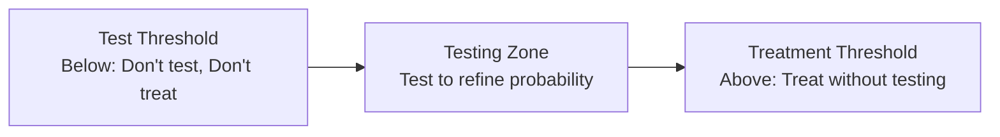
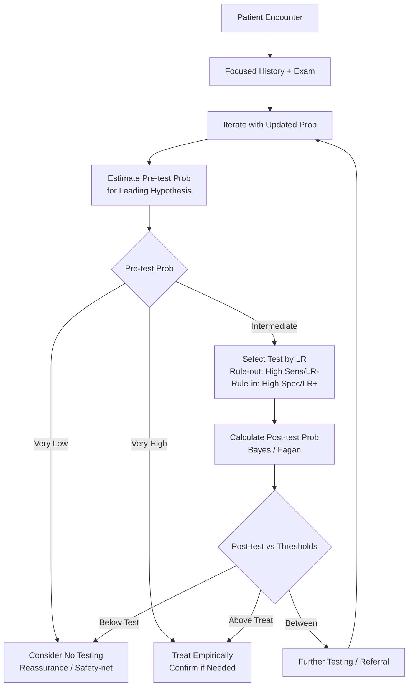

**Parent Topic:** [Clinical Decision-Making MOC](../Clinical%20Decision-Making%20MOC.md) → [Chapter 1 Hierarchy](../Davidson%20Chapter%201%20-%20Clinical%20Decision-Making%20Hierarchy.md)  
**Status:** `full-fcps-mrcp-note`  
**Priority:** ⭐⭐⭐ HIGHEST (FCPS/MRCP — Diagnostic process, Probabilistic reasoning, Cognitive biases, Clinical decision rules)  
**Source:** Davidson 24th Ed Ch 1; Croskerry; Kahneman; BMJ Clinical Reasoning series; Oxford Handbook of Clinical Diagnosis

---

## 1. 1. 🎯 Learning Objectives
- [ ] Describe the **diagnostic process**: History → Examination → Hypothesis generation → Testing → Diagnosis
- [ ] Distinguish **Type 1 (intuitive) vs Type 2 (analytical) thinking**; recognise cognitive biases
- [ ] Apply **probabilistic reasoning**: Pre-test probability, Likelihood ratios, Post-test probability, Threshold model
- [ ] Calculate **diagnostic test metrics**: Sensitivity, Specificity, PPV, NPV, LR+, LR-, ROC/AUC
- [ ] Evaluate **clinical decision rules**: Derivation, Validation, Impact analysis (Wells, Centor, Ottawa, PERC)
- [ ] Identify **diagnostic error types** and mitigation strategies
- [ ] Answer viva: "Pre-test probability 30%, LR+ 5 → post-test probability?" and "Type 1 vs Type 2 thinking"

---

## 2. 2. 🧠 Core Concept: The Diagnostic Process

```mermaid
flowchart TD
    A[Patient Presentation] --> B[History Taking
Focused, hypothesis-driven]
    B --> C[Physical Examination
Targeted to hypotheses]
    C --> D[Clinical Hypothesis Generation
Pattern recognition Type 1
Analytical reasoning Type 2]
    D --> E[Pre-test Probability
Epidemiology + Clinical gestalt]
    E --> F{Test Selection}
    F -->|Rule-out| G[High Sensitivity Test
SnNout]
    F -->|Rule-in| H[High Specificity Test
SpPin]
    G & H --> I[Likelihood Ratio
LR+ = Sens/(1-Spec)
LR- = (1-Sens)/Spec]
    I --> J[Post-test Probability
Fagan Nomogram / Bayes]
    J --> K{Compare to Thresholds}
    K -->|Below Test Threshold| L[No further testing
Watchful waiting]
    K -->|Above Treatment Threshold| M[Treat empirically]
    K -->|Between| N[Further testing / Referral]
    N --> O[Iterate until diagnosis
or certainty threshold met]
```

> **Key Principle:** *Diagnosis is a **probabilistic, iterative process** — not a binary event. The goal is to reduce uncertainty to cross a **decision threshold**.*

---

## 3. 3. ️⃣ Clinical Reasoning Models

### 1. Dual Process Theory (Kahneman / Croskerry)

| System | Characteristics | Clinical Example |
|--------|----------------|------------------|
| **Type 1 (System 1)** | Fast, intuitive, automatic, pattern recognition, heuristic-based, low effort | "This looks like MI" on seeing diaphoresis + crushing chest pain |
| **Type 2 (System 2)** | Slow, analytical, deliberate, rule-based, high effort, working memory intensive | Calculating Wells score, applying Bayes theorem, differential diagnosis list |

> **Ideal:** *Use Type 1 for pattern recognition, **switch to Type 2** when: uncertain, high stakes, atypical presentation, fatigue, time allows.*

### 2. Clinical Reasoning Steps (Hypothetico-Deductive)

1. **Cue acquisition** (History, Exam, Records)
2. **Hypothesis generation** (3-5 differentials within minutes)
3. **Cue interpretation** (Selective data gathering for/against each hypothesis)
4. **Hypothesis evaluation** (Rank by probability, update with new data)
5. **Diagnostic verification** (Test, treat, or refer)

---

## 4. 4. ️⃣ Probabilistic Reasoning & Bayes Theorem

### 1. Key Definitions

| Term | Formula | Clinical Meaning |
|------|---------|------------------|
| **Pre-test Probability (Prevalence)** | — | Probability of disease **before** test |
| **Sensitivity** | TP / (TP + FN) | **Rule-out** (SnNout): High sens → negative test rules out |
| **Specificity** | TN / (TN + FP) | **Rule-in** (SpPin): High spec → positive test rules in |
| **PPV** | TP / (TP + FP) | Probability disease **given** positive test |
| **NPV** | TN / (TN + FN) | Probability no disease **given** negative test |
| **LR+** | Sens / (1 - Spec) | How much **positive** test **increases** odds |
| **LR-** | (1 - Sens) / Spec | How much **negative** test **decreases** odds |

### 2. Likelihood Ratio Interpretation

| LR Value | Effect on Probability | Clinical Meaning |
|----------|----------------------|------------------|
| **>10** | Large increase | **Strong rule-in** (e.g., CT angio for PE) |
| **5–10** | Moderate increase | **Moderate rule-in** (e.g., D-dimer for PE — but low spec) |
| **2–5** | Small increase | Weak rule-in |
| **1–2** | Minimal increase | Poor discriminatory value |
| **1** | No change | **Useless test** |
| **0.5–1** | Minimal decrease | Poor rule-out |
| **0.2–0.5** | Small decrease | Weak rule-out |
| **0.1–0.2** | Moderate decrease | **Moderate rule-out** |
| **<0.1** | Large decrease | **Strong rule-out** (e.g., normal CXR for pneumothorax) |

### 3. Bayes Theorem (Odds Form)

```
Post-test Odds = Pre-test Odds × Likelihood Ratio
Pre-test Odds = Pre-test Probability / (1 - Pre-test Probability)
Post-test Probability = Post-test Odds / (1 + Post-test Odds)
```

### 4. Fagan Nomogram — Practical Tool
- **Visual Bayes**: Line from Pre-test prob through LR → Post-test prob
- **Approximations** (for quick mental calculation):
  - LR 2 → +15% probability
  - LR 5 → +30% probability
  - LR 10 → +45% probability
  - LR 0.5 → -15% probability
  - LR 0.2 → -30% probability
  - LR 0.1 → -45% probability

### 5. Threshold Model (Pauker & Kassirer)



| Threshold | Formula | Clinical Meaning |
|-----------|---------|------------------|
| **Test Threshold** | `Harm of test / (Harm of test + Benefit of treatment)` | Below: Risk of test > Benefit of knowing |
| **Treatment Threshold** | `Harm of treatment / (Harm of treatment + Benefit of treatment)` | Above: Certainty sufficient to treat |

> **Viva Key:** *Treatment threshold for antibiotics in sepsis = **very low** (harm of missing sepsis >> harm of antibiotics). Test threshold for CTPEA in low-risk PE = **high** (radiation risk).*

---

## 5. 5. ️⃣ Diagnostic Test Metrics — Calculations

### 1. 2×2 Table

| | Disease + | Disease - |
|---|-----------|-----------|
| **Test +** | TP (a) | FP (b) |
| **Test -** | FN (c) | TN (d) |

### 2. Worked Example: D-dimer for PE
- Prevalence (Pre-test prob) = 10% (Intermediate Wells)
- Sensitivity = 95%, Specificity = 40%
- **LR+ = 0.95 / 0.60 = 1.58** (Weak rule-in)
- **LR- = 0.05 / 0.40 = 0.125** (Moderate rule-out)
- **Post-test prob if NEGATIVE**: Pre-test odds = 0.1/0.9 = 0.111 → Post odds = 0.111 × 0.125 = 0.014 → Post prob = 1.4% → **Rules out PE**

### 3. ROC Curve & AUC
- **AUC 0.5** = Useless (diagonal)
- **AUC 0.7–0.8** = Acceptable
- **AUC 0.8–0.9** = Excellent
- **AUC >0.9** = Outstanding
- **Youden Index (J)** = Max(Sensitivity + Specificity - 1) → Optimal cut-point

---

## 6. 6. ️⃣ Clinical Decision Rules (CDRs)

### 1. Development Phases (TRIPOD)

| Phase | Purpose | Key Features |
|-------|---------|--------------|
| **Derivation** | Identify predictors, build model | Single centre, large sample, multivariate regression |
| **Internal Validation** | Optimism correction | Bootstrapping, cross-validation |
| **External Validation** | Test in different population | Different centres, countries, time periods — **essential** |
| **Impact Analysis** | Does use improve outcomes? | RCT of rule vs usual care (rare) |

### 2. High-Yield CDRs for Exams

| Rule | Condition | Components | Score Interpretation |
|------|-----------|------------|---------------------|
| **Wells (PE)** | Pulmonary Embolism | Clinical signs, HR, Immobility, Surgery, Prior VTE, Haemoptysis, Cancer, Alternative dx | <2 = Low (D-dimer); 2-6 = Mod; >6 = High → Image |
| **Wells (DVT)** | Deep Vein Thrombosis | Active cancer, Paralysis, Bedridden, Swelling, Pain, Collateral veins | ≤0 = Low (D-dimer); 1-2 = Mod; ≥3 = High → US |
| **Centor** | GABHS Pharyngitis | Fever, Exudate, Adenopathy, No cough | 0-1 = No test/Abx; 2-3 = RADT/Culture; 4 = Empiric Abx |
| **Ottawa Ankle** | Ankle Fracture | Bone tenderness (malleoli, navicular, 5th metatarsal) + Weight-bearing | Any positive → X-ray |
| **Ottawa Knee** | Knee Fracture | Age>55, Patella tenderness, Fibula head tenderness, Flexion<90°, Weight-bearing | Any positive → X-ray |
| **Canadian CT Head** | Minor Head Injury | GCS<15, Vomiting>2, Age>65, Amnesia, Dangerous mechanism | Any high-risk → CT; Medium-risk → CT if not settling |
| **PERC** | PE Rule-out (Low risk) | 8 criteria (Age<50, HR<100, SaO2>94%, No haemoptysis, No oestrogen, No prior VTE, No surgery/trauma, No unilateral leg swelling) | **All negative** → PE excluded (no D-dimer) |
| **CURB-65** | CAP Severity | Confusion, Urea>7, RR≥30, BP<90/60, Age≥65 | 0-1 = Low (outpatient); 2 = Mod (admit); 3-5 = High (ICU) |
| **qSOFA** | Sepsis Risk | GCS<15, RR≥22, SBP≤100 | ≥2 = High risk for poor outcome |
| **CHADS₂-VASc** | AF Stroke Risk | CHF, HTN, Age≥75 (2), DM, Stroke/TIA (2), Vascular, Age 65-74, Sex (F) | ≥2 (M) / ≥3 (F) → Anticoagulate |

### 3. CDR Validation Metrics

| Metric | Target |
|--------|--------|
| **C-statistic (AUC)** | >0.8 for strong discrimination |
| **Calibration** | Hosmer-Lemeshow p>0.05; Calibration plot slope ~1 |
| **Net Benefit** | Decision curve analysis > Treat-all/Treat-none |

---

## 7. 7. ️⃣ Cognitive Biases in Clinical Reasoning

| Bias | Definition | Clinical Example | Mitigation |
|------|------------|------------------|------------|
| **Anchoring** | Over-reliance on first impression | "First doctor said viral" → miss bacterial pneumonia | **Consider alternatives**, seek disconfirming evidence |
| **Availability** | Recent/vivid cases over-weighted | Saw MI yesterday → diagnose MI for indigestion | **Check base rates**, use checklists |
| **Confirmation** | Seek confirming evidence, ignore disconfirming | Order tests only supporting working diagnosis | **"What would disprove my diagnosis?"** |
| **Premature Closure** | Accept diagnosis before fully verified | "It's COPD exacerbation" → miss PE | **Force differential**, time-out |
| **Search Satisficing** | Stop searching after finding one explanation | Find pneumonia → miss concurrent MI | **Systematic review** of all data |
| **Overconfidence** | Overestimate diagnostic accuracy | "I'm 100% sure" → error | **Calibration exercises**, feedback |
| **Diagnostic Momentum** | Previous label sticks | "Admitted with 'pneumonia'" → never questioned | **Re-evaluate at handover** |
| **Framing Effect** | Presentation alters decision | "90% survival" vs "10% mortality" | **Reframe**, use absolute numbers |
| **Hindsight Bias** | "I knew it all along" after outcome | Blame self for missed diagnosis | **Prospective documentation** of uncertainty |

### 1. Debiasing Strategies (Croskerry)
1. **Metacognition** — "How am I thinking?"
2. **Forced consideration** of alternatives (differential diagnosis list)
3. **Checklists** (diagnostic, cognitive)
4. **Diagnostic time-outs** (especially for high-stakes decisions)
5. **Feedback loops** — M&M, clinical audit, second opinions
6. **Simulation training** for cognitive error recognition

---

## 8. 8. ️⃣ Diagnostic Error

### 1. Types (Graber et al.)
| Type | Cause | Example |
|------|-------|---------|
| **No-fault** | Atypical presentation, silent disease | Young woman with MI presenting as anxiety |
| **System** | Communication failures, handover errors, resource limits | Delayed biopsy result, lost referral |
| **Cognitive** | Biases, knowledge gaps, faulty synthesis | Anchoring on "COPD" → miss PE |

### 2. Diagnostic Error Taxonomy (NEJM 2015)
| Category | Subtypes |
|----------|----------|
| **Missed** | No diagnosis made despite symptoms |
| **Delayed** | Diagnosis eventually made but after preventable delay |
| **Wrong** | Incorrect diagnosis assigned |

### 3. Root Cause Analysis Tools
| Tool | Application |
|------|-------------|
| **5 Whys** | Iterative "Why?" → root cause |
| **Fishbone (Ishikawa)** | Categories: People, Process, Equipment, Environment, Materials, Management |
| **Swiss Cheese Model** | Latent system failures + Active errors → Accident |
| **SEIPS Model** | Systems Engineering Initiative for Patient Safety: Person, Tasks, Tools, Environment, Organization |

---

## 9. 9. ️⃣ Practical Algorithm: Diagnostic Approach



---

## 10. 10. ⚡ FCPS/MRCP High-Yield Summary

| Concept | Key Points |
|---------|------------|
| **Dual Process** | Type 1 = Fast/Intuitive/Pattern; Type 2 = Slow/Analytical. Switch to Type 2 for uncertainty, high stakes, atypical. |
| **Diagnostic Process** | History/Exam → Hypotheses → Pre-test Prob → Test Selection (SnNout/SpPin) → LR → Post-test Prob → Thresholds |
| **Likelihood Ratios** | LR+ = Sens/(1-Spec) [Rule-in]; LR- = (1-Sens)/Spec [Rule-out]; LR>10 / <0.1 = Strong; LR 1 = Useless |
| **Bayes/Fagan** | Post-test Odds = Pre-test Odds × LR; Approx: LR 2→+15%, 5→+30%, 10→+45% |
| **Threshold Model** | Test Threshold → Testing Zone → Treatment Threshold. Low threshold for sepsis antibiotics; High for CTPEA |
| **Clinical Decision Rules** | Derivation → Internal Val → **External Validation** (essential) → Impact Analysis. Wells, Centor, Ottawa, PERC, CURB-65 |
| **Cognitive Biases** | Anchoring, Availability, Confirmation, Premature Closure, Overconfidence. Debias: Metacognition, Checklists, Time-outs |
| **Diagnostic Error** | No-fault / System / Cognitive. Missed / Delayed / Wrong. RCA: 5 Whys, Fishbone, Swiss Cheese |

---

## 11. 11. 🎤 Viva Questions (Expected Answers)

| # | Question | Expected Answer |
|---|----------|-----------------|
| 1 | What is the difference between Type 1 and Type 2 clinical reasoning? | Type 1: Fast, intuitive, pattern recognition (heuristics). Type 2: Slow, analytical, deliberate, rule-based. Use Type 2 for uncertainty, high stakes, atypical. |
| 2 | Pre-test probability 20%, LR+ 10. Post-test probability? | **Pre-test odds = 0.2/0.8 = 0.25**. Post-test odds = 0.25 × 10 = 2.5. **Post-test prob = 2.5/3.5 = 71%**. (Approx: +45% → 65%) |
| 3 | Sensitivity 90%, Specificity 60%. LR+ and LR-? | **LR+ = 0.9/0.4 = 2.25** (weak rule-in). **LR- = 0.1/0.6 = 0.17** (moderate rule-out). |
| 4 | What does "SnNout" mean? | **High Sensitivity → Negative test rules OUT** disease. Example: D-dimer for PE (high sens). |
| 5 | What does "SpPin" mean? | **High Specificity → Positive test rules IN** disease. Example: CT angio for PE (high spec). |
| 6 | Wells score for PE — how does it guide management? | Score <2 = Low prob → D-dimer if negative = PE excluded. 2-6 = Mod → Image. >6 = High prob → Image directly. |
| 6 | PERC rule — when is it applied? | **Only in low pre-test probability patients** (clinician gestalt <15%). If all 8 criteria negative → PE excluded without D-dimer. |
| 7 | What are the phases of CDR development? | Derivation → Internal validation → **External validation** (essential) → Impact analysis (RCT) |
| 8 | Name 3 cognitive biases and their mitigation. | Anchoring (consider alternatives), Confirmation bias (seek disconfirming evidence), Premature closure (forced differential, time-out) |
| 9 | What is the threshold model? | Test threshold → Testing zone → Treatment threshold. Below test threshold = don't test/treat. Above treatment threshold = treat without testing. |
| 10 | Types of diagnostic error? | No-fault (atypical), System (communication/handover), Cognitive (biases). Missed / Delayed / Wrong. |

---

## 12. 12. 🧩 Confusions & Mnemonics

| Confusion | Clarification |
|-----------|---------------|
| **"High sensitivity = good rule-in"** | **NO.** High sensitivity = **good rule-out** (SnNout). High specificity = good rule-in (SpPin). |
| **"PPV = Sensitivity"** | **NO.** PPV depends on **prevalence**. Same test: PPV 90% in high prevalence, 10% in low prevalence. |
| **"LR+ and LR- are the same for all populations"** | **YES, mostly.** LRs are **stable across prevalences** (unlike PPV/NPV). Only change if spectrum bias. |
| **"D-dimer rules out PE in everyone"** | **NO.** Only if **low/intermediate pre-test prob** (Wells <4). High prob → D-dimer useless (high false negative impact). |
| **"PERC rule can be used on any patient"** | **NO.** Only if **clinician gestalt <15%** (low pre-test prob). Using on high prob = dangerous. |
| **"External validation = just using it in another hospital"** | **NO.** Requires **statistical validation** (C-statistic, calibration) in a **different population** (time/place/setting). |
| **"Cognitive biases only affect juniors"** | **NO.** Experts also biased — often **more overconfident**. Debiasing needs **systematic approach** at all levels. |

> **Mnemonic: DIAGNOSTIC REASONING**  
> **D**ual process: **Type 1 (fast/intuitive) vs Type 2 (slow/analytic)** — switch for uncertainty  
> **I**terative process: **History → Exam → Hypotheses → Pre-test prob → Test → Post-test → Thresholds**  
> **A**nchoring, Availability, Confirmation, Premature closure = **Major cognitive biases**  
> **G**enerate 3-5 differentials early → **Rank by probability**  
> **N**NT/LR/Pre-test prob = **Numbers matter** — quantify uncertainty  
> **O**ttawa, Wells, Centor, PERC, CURB-65, qSOFA = **Validated CDRs** (external validation essential)  
> **S**nNout = **High Sens → Rule-out**; **SpPin = High Spec → Rule-in**  
> **T**hreshold model: **Test threshold → Testing zone → Treatment threshold**  
> **I**nterval LR: **LR+ = Sens/(1-Spec)** [Rule-in]; **LR- = (1-Sens)/Spec** [Rule-out]  
> **C**alibration: **Feedback loops** (M&M, audit) reduce overconfidence  
> **R**oot cause: **5 Whys, Fishbone, Swiss Cheese** for diagnostic errors  
> **E**rror types: **No-fault / System / Cognitive** → Missed, Delayed, Wrong  
> **A**ppraise CDRs: **Derivation → Internal Val → External Val → Impact** (TRIPOD)  
> **S**earch satisficing & Overconfidence = **Checklists, Time-outs, Forced differentials**  
> **I**nformation: **Bayes** — Post-test odds = Pre-test odds × LR  
> **N**omogram: **Fagan** visual Bayes — line from pre-test through LR to post-test  
> **G**estalt: **Clinical intuition** calibrated by probabilistic reasoning, not replaced

---

## 13. 13. 🗺️ Mind Map

```mermaid
mindmap
  root((Clinical Reasoning))
    Dual Process
      Type 1: Fast, Pattern recognition
      Type 2: Slow, Analytical
      Switch for uncertainty
    Diagnostic Process
      History/Exam → Hypotheses
      Pre-test probability
      Test selection (LR)
      Post-test probability
      Thresholds (Test/Treat)
    Probabilistic Reasoning
      Bayes / Fagan Normogram
      LR+ = Sens/(1-Spec)
      LR- = (1-Sens)/Spec
      SnNout / SpPin
    Clinical Decision Rules
      Derivation → Ext Val → Impact
      Wells, PERC, Centor, Ottawa
      CURB-65, qSOFA
    Cognitive Biases
      Anchoring, Availability, Confirmation
      Premature closure, Overconfidence
      Debiasing: Checklists, Time-outs
    Diagnostic Error
      No-fault, System, Cognitive
      Missed, Delayed, Wrong
      RCA: 5 Whys, Fishbone
```

---

## 14. 14. 📅 Spaced Repetition Tracker

| Review | Date | Score (0–5) | Notes |
|--------|------|-------------|-------|
| Day 1 | | | |
| Day 3 | | | |
| Day 7 | | | |
| Day 14 | | | |
| Day 30 | | | |
| Day 90 | | | |

---

## 15. 15. 📝 Self-Test Scorecard

| Section | Max | Score | % |
|---------|-----|-------|---|
| Dual Process & Diagnostic Steps | 2 | | |
| Probabilistic Reasoning (Bayes, LR, Thresholds) | 4 | | |
| Diagnostic Test Metrics | 3 | | |
| Clinical Decision Rules | 3 | | |
| Cognitive Biases & Debiasing | 3 | | |
| Diagnostic Error Types & RCA | 2 | | |
| Practical Algorithm Application | 3 | | |
| **Total** | **20** | | |

---

## 16. 16. 💬 Exam Answer Modes

| Format | Prompt | Key Points |
|--------|--------|------------|
| **Long Essay** | "Describe the clinical reasoning process including probabilistic reasoning and cognitive biases." | Dual process, Hypothesis generation, Pre-test prob, LR/Bayes, Threshold model, CDRs, Cognitive biases, Debiasing, Diagnostic error taxonomy |
| **Short Note** | "Fagan nomogram and Bayes theorem in clinical practice." | Pre-test odds = p/(1-p); Post-test odds = Pre × LR; Post prob = Odds/(1+Odds); Approx: LR2=+15%, LR5=+30%, LR10=+45% |
| **Viva** | "Patient with pleuritic chest pain, Wells 3 (moderate). D-dimer positive. CTPEA negative. What next?" | Pre-test prob ~20% (Mod Wells). D-dimer LR+ ~1.5 (weak) → Post-test ~30%. CTPEA LR- ~0.1 → Post-test ~3-4%. **Below test threshold** → Consider alternative (musculoskeletal, GERD), safety-net |
| **Ward Round** | "Junior diagnoses 'COPD exacerbation' for dyspnoeic patient with unilateral leg swelling. Your action?" | **Cognitive bias: Anchoring/Premature closure**. Prompt: "What else could cause dyspnoea + unilateral swelling?" → Consider PE. Order Wells/D-dimer/CTPEA. Teach forced differential. |
| **Last-Night** | "Type 1 fast/intuitive, Type 2 slow/analytic. Pre→LR→Post. SnNout/SpPin. Thresholds: Test/Treat. CDRs: Deriv→Ext Val. Biases: Anchor/Avail/Confirm. Error: No-fault/System/Cog. RCA: 5Whys/Fishbone." | Full framework in 3 lines. |

---

## 17. 17. 📌 Summary
- **Diagnostic reasoning** = Probabilistic, iterative process (History → Hypotheses → Pre-test prob → Test → Post-test prob → Decision)
- **Dual process**: Type 1 (fast/pattern) + Type 2 (slow/analytic); deliberate switching reduces error
- **Bayes theorem**: Post-test odds = Pre-test odds × LR; LRs stable across prevalences
- **Key metrics**: Sensitivity/Specificity → LR+/LR-; SnNout (high sens rules out); SpPin (high spec rules in)
- **Threshold model**: Test threshold → Testing zone → Treatment threshold
- **Clinical Decision Rules**: Must have **external validation** (Wells, PERC, Centor, Ottawa, CURB-65, qSOFA)
- **Cognitive biases**: Anchoring, Availability, Confirmation, Premature closure, Overconfidence → Debias with checklists, time-outs, forced differentials, feedback
- **Diagnostic error**: No-fault / System / Cognitive; Missed / Delayed / Wrong; RCA with 5 Whys, Fishbone, Swiss Cheese

---

## 18. 18. ❓ MCQs (10)

1. **Pre-test probability 30%, LR+ 5. Post-test probability?**  
   A. 45%  B. **52%**  C. 60%  D. 68%  
   *Answer: B. Pre-odds = 0.3/0.7 = 0.43. Post-odds = 0.43 × 5 = 2.14. Post-prob = 2.14/3.14 = 68%. Wait — approx +30% = 60%. Exact = 68%.*

2. **High sensitivity test — best for:**  
   A. Ruling in  B. **Ruling out**  C. Both  D. Neither  
   *Answer: B. SnNout — Sensitive test Negative rules OUT.*

3. **Specificity 95%, Sensitivity 40%. LR+?**  
   A. 8  B. **8**  C. 0.63  D. 1.5  
   *Answer: B. LR+ = 0.4 / 0.05 = 8 (strong rule-in).*

4. **PERC rule is applied when:**  
   A. High pre-test probability  B. **Low pre-test probability (<15%)**  C. Moderate probability  D. All patients  
   *Answer: B. Only when clinician gestalt <15% (low pre-test prob).*

5. **Cognitive bias: Diagnosing "COPD" for all smokers with dyspnoea, missing PE.**  
   A. Anchoring  B. **Premature closure**  C. Availability  D. Confirmation  
   *Answer: B. Accepting first diagnosis without considering alternatives.*

6. **Clinical decision rule development — most critical phase:**  
   A. Derivation  B. **External validation**  C. Internal validation  D. Impact analysis  
   *Answer: B. External validation in different population/setting is essential for generalisability.*

7. **Test threshold vs Treatment threshold — area between:**  
   A. Don't test, don't treat  B. **Test to refine probability**  C. Treat without testing  D. Refer  
   *Answer: B. Testing zone / Zone of uncertainty.*

8. **Swiss cheese model applies to:**  
   A. Cognitive biases  B. **System errors / Latent failures**  C. Individual knowledge gaps  D. Test characteristics  
   *Answer: B. Latent system holes align with active error → accident.*

9. **Diagnostic odds ratio (DOR) formula:**  
   A. LR+ / LR-  B. LR+ × LR-  C. **LR+ / LR-**  D. (LR+ + LR-)/2  
   *Answer: C. DOR = LR+ / LR- = (Sens×Spec) / ((1-Sens)×(1-Spec)).*

10. **Missed diagnosis after atypical presentation in young patient:**  
    A. Cognitive error  B. System error  C. **No-fault error**  D. Communication error  
    *Answer: C. No-fault — disease not reasonably detectable (silent/atypical).*

---

## 19. 19. 📋 SBAs (10)

1. **55M, pleuritic chest pain, Wells 4 (moderate), D-dimer 800 (positive). CTPEA negative. Next step?**  
   A. Start anticoagulation  B. **Consider alternative diagnosis; safety-net**  C. Repeat CTPEA in 24h  D. V/Q scan  
   *Answer: B. Pre-test ~20%. D-dimer LR+ ~1.5 → Post ~25%. CTPEA LR- ~0.1 → Post ~3%. Below test threshold.*

2. **Patient with sore throat, Centor 3. Management?**  
   A. No antibiotics  B. **RADT or throat culture; treat if positive**  C. Empiric penicillin  D. Refer ENT  
   *Answer: B. Centor 2-3 = test (RADT/culture) and treat if positive. Centor 0-1 = no test/abx; 4 = empiric.*

3. **Junior doctor insists diagnosis is "gastroenteritis" for elderly patient with abdominal pain, ignores subtle rigidity. Bias?**  
   A. Anchoring  B. **Premature closure**  C. Confirmation  D. Search satisficing  
   *Answer: B. Accepts first diagnosis without considering surgical abdomen (peritonitis).*

4. **New CDR for meningitis derived in single centre, AUC 0.92. Before clinical use?**  
   A. Implement immediately  B. **External validation in different population**  C. Impact analysis RCT  D. Internal validation only  
   *Answer: B. External validation essential before adoption.*

5. **SNNOUT test with negative result in high prevalence disease. Action?**  
   A. Rule out confidently  B. **Cannot rule out (high false negative impact in high prevalence)**  C. Treat empirically  D. Repeat test  
   *Answer: B. High prevalence → even high sensitivity test has significant false negatives. NPV drops with prevalence.*

---

## 20. 20. 🔑 Answer Keys
| MCQs | SBAs |
|------|------|
| 1-B, 2-B, 3-B, 4-B, 5-B, 6-B, 7-B, 8-B, 9-C, 10-C | 1-B, 2-B, 3-B, 4-B, 5-B |

---

## 21. 21. 🔗 Cross-Links
- [[1.2 Evidence-Based Medicine]] — Study design, Critical appraisal, Statistics for EBM
- [[1.3 Communication Skills]] — History taking, Shared decision-making, Consent
- [[1.4 Ethics & Law]] — Consent law (Montgomery), Capacity (MCA 2005)
- [[1.5 Quality Improvement & Patient Safety]] — Diagnostic error, RCA, Never Events, Duty of candour
- [[1.6 Guidelines & Pathways]] — CDR validation, AGREE II, Implementation
- [../Clinical Therapeutics/Pharmacokinetics] — Drug interactions affecting diagnostic tests
- [../../Cardiology/Clinical Decision-Making] — Chest pain pathways (Wells, TIMI, HEART)
- [../../Respiratory/Clinical Decision-Making] — Pneumonia (CURB-65), PE (Wells, PERC)
