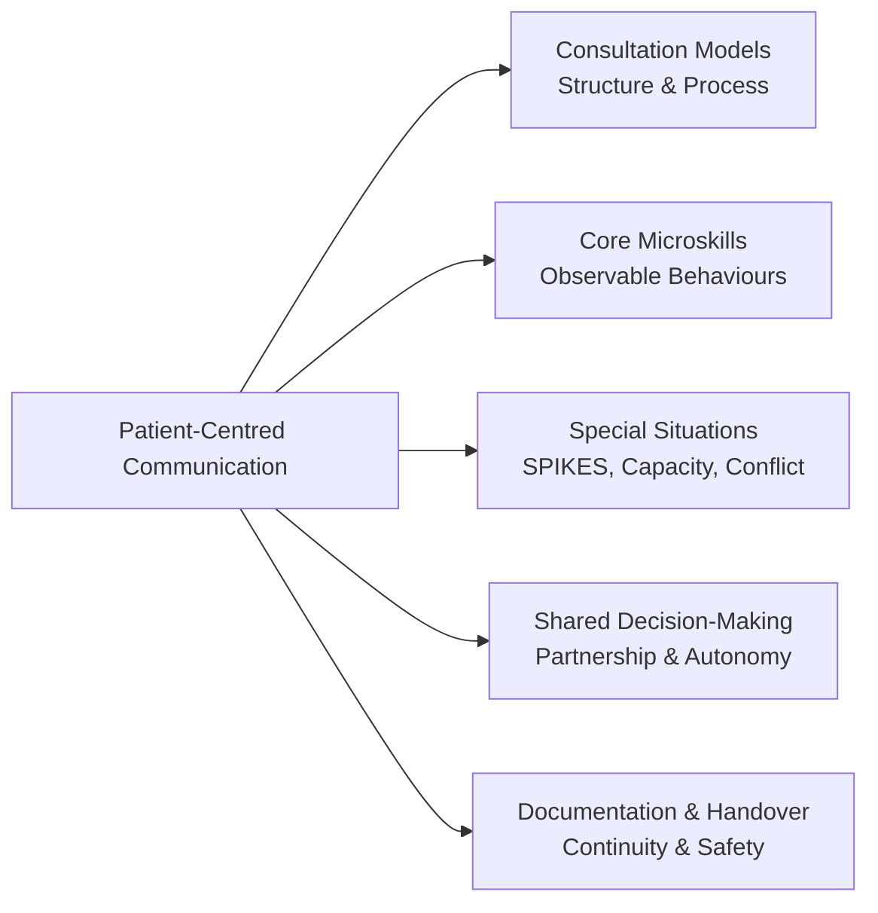
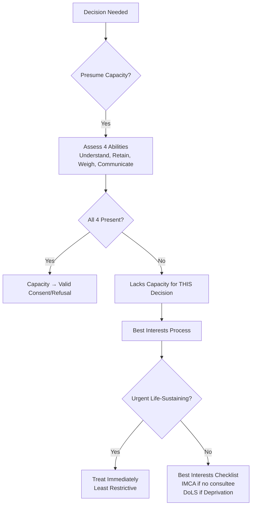
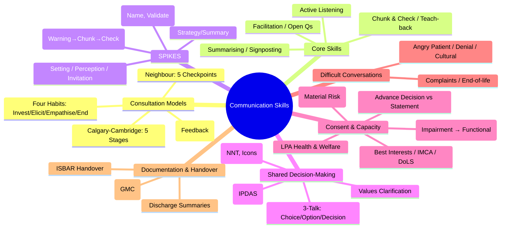

**Parent Topic:** [Clinical Decision-Making MOC](../Clinical%20Decision-Making%20MOC.md) → [Chapter 1 Hierarchy](../Davidson%20Chapter%201%20-%20Clinical%20Decision-Making%20Hierarchy.md)  
**Status:** `full-fcps-mrcp-note`  
**Priority:** ⭐⭐⭐ HIGHEST (FCPS/MRCP — Consultation models, SPIKES, Shared decision-making, Consent & Capacity)  
**Source:** Davidson 24th Ed Ch 1; Calgary-Cambridge Guide; GMC "Good Medical Practice"; RCGP Consultation Skills; SPIKES Protocol; Mental Capacity Act 2005; Montgomery ruling

---

## 1. 1. 🎯 Learning Objectives
- [ ] Describe **consultation models**: Calgary-Cambridge, Neighbour, Pendleton, Four Habits
- [ ] Demonstrate **core communication skills**: Active listening, Facilitation, Summarising, Signposting, Chunk & Check
- [ ] Apply **SPIKES** for breaking bad news; adapt for different scenarios
- [ ] Conduct **shared decision-making**: Option grids, Decision aids, Risk communication, Values clarification
- [ ] Assess **capacity** under MCA 2005 (2-stage test); understand best interests, IMCA, DoLS, LPA
- [ ] Obtain **valid consent** (Montgomery principles: Material risk, Reasonable patient standard)
- [ ] Document effectively: Medical records, SBAR/ISBAR handover, Discharge summaries
- [ ] Answer viva: "SPIKES steps" and "MCA 2-stage test" and "Montgomery vs Bolam"

---

## 2. 2. 🧠 Core Concept: Communication as Clinical Skill



> **Key Principle:** *Communication is not "soft skill" — it's a **core clinical competency** with measurable impact on outcomes (adherence, satisfaction, safety, litigation).*

---

## 3. 3. ️⃣ Consultation Models

### 1. Calgary-Cambridge Guide (Most widely taught in UK)

| Stage | Content | Key Skills |
|-------|---------|------------|
| **1. Initiating** | Greeting, Introductions, Identify agenda, Establish rapport | Open posture, Eye contact, "What brings you in today?" |
| **2. Gathering** | **Explore patient's perspective** (Ideas, Concerns, Expectations — ICE), Bio-psychosocial history, Facilitation | Active listening, Open questions, Facilitation ("Tell me more"), Clarification, Summarising |
| **3. Physical Exam** | Signposting ("I'll examine your chest now"), Explain findings, Chunk & Check | Permission, Explanation, Checking understanding |
| **4. Explanation & Planning** | Diagnosis in plain language, Shared decision-making, Safety-netting, Follow-up | Chunk & Check, Teach-back, Negotiated plan, "What questions do you have?" |
| **5. Closing** | Summarise, Safety-net, Next steps, "Is there anything else?" | Summarise, "Any other concerns?", Clear next steps |

> **Calgary-Cambridge = Gold standard for UK medical education & MRCP PACES.**

### 2. Neighbour's "Inner Consultation" (5 Checkpoints)

| Checkpoint | Question |
|------------|----------|
| **1. Connecting** | "Can I connect with this patient?" |
| **2. Summarising** | "What is the patient really saying?" (ICE) |
| **3. Handover** | "What is my working diagnosis/plan?" |
| **4. Safety Netting** | "What if I'm wrong?" / "When to return?" |
| **5. Housekeeping** | "Am I looking after myself?" (reflection, stress) |

### 3. Pendleton's Rules (Feedback Model — 7 Steps)
1. **Clarify facts** — "What happened?"
2. **What went well** — Learner identifies strengths
3. **What could be improved** — Learner identifies weaknesses
4. **Observer feedback on strengths**
5. **Observer feedback on improvements**
6. **Action plan** — Specific, Measurable, Achievable, Relevant, Time-bound (SMART)
6. **Summary** — Key learning points

### 4. Four Habits Model (Kaiser Permanente)

| Habit | Focus |
|-------|-------|
| **1. Invest in the Beginning** | Build rapport, Elicit agenda, Set expectations |
| **2. Elicit the Patient's Perspective** | ICE, Psychosocial context, Functional impact |
| **3. Demonstrate Empathy** | Name emotions, Validate, Support |
| **4. Invest in the End** | Deliver info (chunk & check), Shared decision-making, Safety-net, Close |

---

## 4. 4. ️⃣ Core Microskills (Observable Behaviours)

| Skill | Description | Example Phrases |
|-------|-------------|-----------------|
| **Active Listening** | Full attention, Minimal encouragers | "Mm-hmm", "Go on", "I see", Nodding |
| **Facilitation** | Encourage elaboration | "Can you tell me more about...?" "What else?" |
| **Open Questions** | Cannot be answered yes/no | "How has this affected your daily life?" |
| **Closed Questions** | Specific facts | "Do you have chest pain?" |
| **Clarification** | Check understanding | "So the pain is sharp, not dull?" |
| **Summarising** | Reflect back key points | "So far you've told me: pain for 2 weeks, worse on exertion, worried about heart attack..." |
| **Signposting** | Explicitly state structure | "First I'll ask about your symptoms, then examine you, then discuss options." |
| **Chunk & Check** | Small info pieces + verify | "There are three options... [Option 1]. Does that make sense?" |
| **Teach-back** | Patient explains in own words | "Can you tell me in your own words how you'll take this medicine?" |
| **Empathy Statements** | Name, Validate, Support | "I can see this is really worrying for you." "It's understandable you feel anxious." |

---

## 5. 5. ️⃣ SPIKES Protocol — Breaking Bad News

| Step | Action | Key Phrases |
|------|--------|-------------|
| **S — Setting** | Privacy, Time, No interruptions, Support person, Sit down, Eye level | "I've asked you here to discuss your test results. Is it okay if your wife stays?" |
| **P — Perception** | Assess patient's current understanding | "What have you been told so far?" "What do you understand about your condition?" |
| **I — Invitation** | Ask how much detail wanted | "How much detail would you like me to give?" "Would you like the full picture?" |
| **K — Knowledge** | **Warning shot** → Info in chunks → Check understanding → Avoid jargon | "Unfortunately, I have some difficult news. The biopsy shows..." [Pause] "This means..." [Check] |
| **E — Emotions** | **Observe, Name, Validate, Empathise, Explore** | "I can see this is devastating." "It's completely understandable to feel shocked." "Tell me more about what you're feeling." |
| **S — Strategy/Summary** | Agree next steps, Offer follow-up, Written info, Team involvement | "Let's talk about what happens next. We'll involve the specialist nurse. Here's written info. I'll see you again in 2 days." |

> **Key:** *SPIKES is a **framework**, not a script. Adapt to patient, culture, context. **Never** give bad news over phone if avoidable. **Never** say "There's nothing more we can do."*

---

## 6. 6. ️⃣ Shared Decision-Making (SDM)

### 1. 3-Talk Model (Elwyn et al.)

| Talk | Goal | Key Actions |
|------|------|-------------|
| **1. Choice Talk** | "There are options." | Introduce choices, "We have a decision to make", Check understanding of options |
| **2. Option Talk** | Compare options. | **Absolute risks** (NNT, icon arrays), Decision aids, Compare benefits/harms |
| **3. Decision Talk** | Elicit preferences. | "What matters most to you?", Values clarification, "Given what you've heard, what feels right?" |

### 2. Risk Communication — Absolute > Relative

| Format | Example | Why |
|--------|---------|-----|
| **Relative Risk Reduction** | "Reduces risk by 50%!" | Misleading (ignores baseline) |
| **Absolute Risk Reduction** | "From 4 in 100 to 2 in 100" | Transparent |
| **NNT** | "100 people treated for 1 benefit" | Concrete |
| **Icon Arrays** | 100 faces, 2 red = event | Visual, intuitive |
| **Natural Frequencies** | "2 out of 100" vs "2%" | Easier to process |

> **Never give RRR alone.** Always pair with ARR/NNT.

### 3. Decision Aids (IPDAS Criteria)

| Component | Standard |
|-----------|----------|
| **Content** | Options, Benefits/Harms, Probabilities, Values clarification |
| **Format** | Paper, Video, Web, Interactive, Option grids |
| **Quality** | Evidence-based, Balanced, Up-to-date, Conflict-of-interest free |
| **Testing** | User-tested, Improves knowledge, Reduces decisional conflict |

### 4. Values Clarification Methods

| Method | Description |
|--------|-------------|
| **Threshold Technique** | "At what risk would you choose surgery?" |
| **Best-Worst Scaling** | Rank attributes from most to least important |
| **Discrete Choice Experiments** | Trade-offs between attribute levels |
| **Swing Weighting** | Assign weights to criteria |

---

## 7. 7. ️⃣ Consent & Capacity

### 1. Valid Consent — 3 Elements (GMC)

| Element | Requirement |
|---------|-------------|
| **Voluntary** | Free from coercion, Pressure, Undue influence |
| **Informed** | Nature, Purpose, Benefits, Risks, Alternatives, **Material risks** (Montgomery), No treatment option |
| **Capacity** | Able to understand, retain, weigh, communicate |

### 2. Montgomery v Lanarkshire (2015) — UK Landmark

| Principle | Application |
|-----------|-------------|
| **Material Risk Test** | Would a **reasonable person** in patient's position attach significance? OR **Doctor aware** patient would attach significance? |
| **Duty to Warn** | Disclose **material risks** (not all risks) + **Reasonable alternatives** |
| **Patient-Centred** | "What matters to **this patient**?" (not "What would reasonable doctor say?") |
| **Documentation** | Record discussion, Risks discussed, Patient's questions, Decision |

> **Pre-Montgomery (Bolam/Bolitho):** "Responsible body of medical opinion" standard. **Post-Montgomery:** "Reasonable patient" standard.

### 3. Mental Capacity Act 2005 (England & Wales) — 2-Stage Test

```mermaid
flowchart TD
    A[Decision Required] --> B{Stage 1: Impairment?}
    B -->|No| C[Capacity Presumed]
    B -->|Yes| D{Stage 2: Functional Test}
    D -->|Can a) Understand?| E[All 4 = Capacity]
    D -->|Can b) Retain?| E
    D -->|Can c) Use/Weigh?| E
    D -->|Can d) Communicate?| E
    D -->|Any NO| F[Lacks Capacity for THIS Decision]
    F --> G[Best Interests Decision]
    G --> H{Urgent?}
    H -->|Yes| I[Act Immediately]
    H -->|No| J[Best Interests Checklist
IMCA if no family/friends
DoLS if deprivation of liberty]
```

| Functional Ability | Assessment |
|--------------------|------------|
| **a) Understand** | Can grasp relevant information (nature, purpose, consequences of decision) |
| **b) Retain** | Hold info long enough to use it (even briefly) |
| **c) Use/Weigh** | Manipulate info, Compare options, Reason |
| **d) Communicate** | Any method (speech, writing, gestures, blinking) |

> **Capacity is decision-specific & time-specific.** Presumed unless proven otherwise. **Unwise decisions ≠ Lack of capacity.**

### 4. Best Interests Checklist (MCA s.4)
1. **Past & present wishes** (advance statements, verbal)
2. **Beliefs & values** (religious, cultural, moral)
3. **Consult** family, carers, attorneys, deputies
4. **Avoid discrimination** (age, disability, appearance)
5. **Less restrictive option** (least restriction of rights)
6. **Encourage participation** (involve person as much as possible)

### 5. IMCA (Independent Mental Capacity Advocate)
- **Required** if: Serious medical treatment **OR** Long-term accommodation change **AND** No family/friends to consult
- **Role**: Represent patient, Challenge decisions, Access records

### 6. DoLS (Deprivation of Liberty Safeguards)
- **Criteria**: Continuous supervision/control + Not free to leave + Lacks capacity
- **Authorisation**: Standard (21 days) / Urgent (7 days) → Supervisory body authorisation
- **Review**: Regular reviews, Right to challenge (Court of Protection)

### 7. Advance Decisions & LPA
| Instrument | Scope | Requirements |
|------------|-------|--------------|
| **Advance Decision (ADRT)** | Refuse specific treatment | Written, Signed, Witnessed, "Even if life at risk" for life-sustaining |
| **LPA Health & Welfare** | Attorney makes decisions | Registered with OPG, Only if lacks capacity |
| **Advance Statement** | Wishes/preferences (not legally binding) | Written/Verbal, Guides best interests |

---

## 8. 8. ️⃣ Difficult Conversations — Beyond SPIKES

| Scenario | Key Principles |
|----------|----------------|
| **Angry Patient** | Acknowledge emotion ("I see you're angry"), Don't defend, Apologise for experience, Explore underlying concern, Set boundaries if abusive |
| **Denial / Collusion** | Respect pace, "What have you been told?", "Some people find it hard to hear...", Don't force, Leave door open |
| **Cultural / Language Barriers** | Professional interpreter (not family), Cultural humility, "Help me understand your perspective", Avoid assumptions |
| **Complaints** | Listen fully, Acknowledge distress, Apologise for experience (not admission of liability), Explain process, Offer escalation |
| **End-of-Life / DNAR** | SPIKES + Values ("What does quality of life mean to you?"), ReSPECT process, Document clearly |

---

## 9. 9. ️⃣ Documentation & Handover

### 1. Medical Records (GMC Standards)
- **Contemporaneous** — At time or ASAP
- **Legible** — Ink, Date, Time, Signature/ID
- **Accurate** — Facts vs Opinion (label: "Patient reports...", "I observed...")
- **Complete** — History, Exam, Assessment, Plan, Consent discussed, Safety-net
- **Confidential** — Secure storage, Minimum necessary access

### 2. SBAR / ISBAR Handover

| Component | Content |
|-----------|---------|
| **I**dentify | Patient name, DOB, Location, Your name/role |
| **S**ituation | Current concern, Reason for handover, Acuity |
| **B**ackground | Admission reason, Relevant history, Key results, Current plan |
| **A**ssessment | Current clinical impression, Concerns, Trends (NEWS2) |
| **R**ecommendation | Actions needed, Timeframes, Escalation plan, "What would you do if...?" |

> **ISBAR = Standard for NHS handovers. Read-back encouraged.**

### 3. Discharge Summary Essentials
- Diagnosis, Procedures, Investigations
- Medication changes (Start/Stop/Change + Reason)
- Follow-up (Appointments, Investigations, Red flags)
- GP actions (Monitoring, Prescribing, Referrals)
- Patient understanding / Safety-netting advice

---

## 10. 10. ️⃣ Practical Algorithms

### 1. Capacity Assessment Flow


### 2. Consent Conversation Checklist
- [ ] Diagnosis & Prognosis explained
- [ ] Nature & Purpose of treatment
- [ ] **Material risks** (Montgomery) + Common side effects
- [ ] **Alternatives** (including no treatment)
- [ ] **Patient-specific concerns** explored ("What matters to you?")
- [ ] Questions invited & answered
- [ ] Understanding checked (Teach-back)
- [ ] Decision documented (Signed form + Notes)

---

## 11. 11. ⚡ FCPS/MRCP High-Yield Summary

| Topic | Key Points |
|-------|------------|
| **Calgary-Cambridge** | 5 stages: Initiating, Gathering (ICE), Exam, Explanation/Planning, Closing — **UK standard** |
| **SPIKES** | Setting, Perception, Invitation, Knowledge (warning→chunk→check), Emotions (name/validate), Strategy/Summary |
| **Shared Decision-Making** | 3-Talk: Choice (options exist), Option (compare absolute risks/NNT), Decision (values) |
| **Risk Communication** | **Absolute risks (ARR/NNT/icon arrays) > Relative (RRR)**. Decision aids (IPDAS). |
| **Consent (Montgomery)** | Material risk test (reasonable patient), Alternatives, Patient-specific, Document |
| **Capacity (MCA 2005)** | 2-stage: 1) Impairment, 2) Functional (Understand, Retain, Use/Weigh, Communicate). Decision-specific. |
| **Best Interests** | Checklist (past wishes, beliefs, consult, least restrictive). IMCA if no family + serious treatment. |
| **DoLS** | Continuous supervision + Not free to leave + Lacks capacity → Authorisation required. |
| **Advance Decisions** | Written, Signed, Witnessed, "Even if life at risk" for life-sustaining. |
| **LPA** | Health & Welfare (decisions if lacks capacity); Property & Financial (separate). |
| **SBAR/ISBAR** | Identify, Situation, Background, Assessment, Recommendation — **NHS standard handover**. |

---

## 12. 12. 🎤 Viva Questions (Expected Answers)

| # | Question | Expected Answer |
|---|----------|-----------------|
| 1 | What are the 5 stages of Calgary-Cambridge? | Initiating, Gathering (ICE), Physical Exam, Explanation & Planning, Closing |
| 2 | SPIKES — what does each letter stand for? | **S**etting, **P**erception, **I**nvitation, **K**nowledge, **E**motions, **S**trategy/Summary |
| 3 | How do you assess capacity under MCA 2005? | **2-stage**: 1) Impairment of mind/brain? 2) Functional test — Can: a) Understand, b) Retain, c) Use/Weigh, d) Communicate? Decision-specific, time-specific. |
| 4 | Montgomery v Lanarkshire — what changed consent law? | Shifted from **Bolam (doctor-centric)** to **Montgomery (patient-centric)**: Must disclose **material risks** (reasonable patient test) and **reasonable alternatives**. |
| 5 | What is the difference between Advance Decision and Advance Statement? | **Advance Decision** = Legally binding refusal of specific treatment (written, signed, witnessed). **Advance Statement** = Wishes/preferences (guiding, not legally binding). |
| 6 | What is IMCA and when required? | Independent Mental Capacity Advocate. Required for **serious medical treatment** or **long-term accommodation change** when **no family/friends** to consult. |
| 7 | DoLS — when does it apply? | **Continuous supervision/control** + **Not free to leave** + **Lacks capacity** → Requires authorisation (Standard 21d / Urgent 7d). |
| 8 | Shared decision-making — 3-talk model? | **Choice Talk**: Options exist. **Option Talk**: Compare absolute risks (NNT), decision aids. **Decision Talk**: Elicit values/preferences. |
| 9 | SBAR vs ISBAR — what does the 'I' add? | **Identify** — Patient name, DOB, Location, Your role. |
| 10 | How to communicate risk effectively? | **Absolute risks** (ARR, NNT, "X in 100"), **Icon arrays**, **Natural frequencies** ("2 in 100"), **Avoid RRR alone**. Use decision aids (IPDAS). |

---

## 13. 13. 🧩 Confusions & Mnemonics

| Confusion | Clarification |
|-----------|---------------|
| **"Capacity = Competence"** | **Capacity = Legal (decision-specific). Competence = Legal status (global).** Capacity presumed unless proven otherwise. |
| **"Unwise decision = Lack of capacity"** | **NO.** "Unwise" ≠ "Lack capacity." People have right to make unwise decisions if they can understand/weigh. |
| **"Next of kin can consent for incapable adult"** | **NO.** Next of kin **cannot** legally consent. **Best interests decision** by clinician (consult family). LPA / Court of Protection for formal authority. |
| **"Advance Decision = Advance Statement"** | **NO.** **Advance Decision** = Legally binding refusal (specific treatment). **Advance Statement** = Preferences (guide only). |
| **"Montgomery = Tell all risks"** | **NO.** **Material risks only** (what reasonable patient would want to know + what doctor knows patient would want to know). Not exhaustive list. |
| **"SBAR = ISBAR"** | **ISBAR adds "Identify"** — Critical for patient safety (wrong patient handover). |
| **"Consent form = Consent"** | **NO.** Form = Documentation. Consent = **Process** (Information + Understanding + Voluntary agreement). |
| **"SPIKES is only for cancer"** | **NO.** Any bad news: Chronic disease diagnosis, Genetic result, Disability, End-of-life, COVID ICU outcome. |

> **Mnemonic: COMMUNICATION SPIKES**  
> **C**algary-Cambridge: **5 Stages** (Initiate, Gather-ICE, Examine, Explain/Plan, Close) — UK Gold Standard  
> **O**bserving Microskills: **Active Listening, Facilitation, Open/Closed Qs, Summarising, Signposting, Chunk&Check, Teach-back**  
> **M**ontgomery Consent: **Material Risk** (Reasonable Patient) + Alternatives + Patient-Specific + Document  
> **M**CA 2-Stage: **Impairment → Functional (Understand, Retain, Weigh, Communicate)** — Decision-Specific  
> **U**nwise ≠ Lack Capacity: **Respect Autonomy** even for "bad" choices if capacity intact  
> **N**ext of Kin ≠ Consent: **Best Interests** by Clinician; LPA/Court for Legal Authority  
> **I**MCA for **Serious Treatment/Accommodation** + No Family/Friends  
> **C**hoice/Option/Decision = **3-Talk SDM** (Elwyn) — Absolute Risks (NNT, Icons) + Values  
> **A**dvance Decision (Binding Refusal) vs **Advance Statement** (Guiding Wishes)  
> **T**each-back: **"Tell me in your own words..."** — Confirms Understanding  
> **I**D/SBAR: **Identify, Situation, Background, Assessment, Recommendation** — Read-back!  
> **O**pinion: **Bolam (Doctor) → Montgomery (Patient)** — Material Risk Disclosure  
> **N**egotiate: **Safety-Net** ("If worse, come back"; "Red flags: X, Y, Z")  
> **N**eighbour's 5 Checkpoints: **Connect, Summarise, Handover, Safety-net, Housekeeping**  
> **S**PIKES: **Setting, Perception, Invitation, Knowledge, Emotions, Strategy** — Bad News Framework  
> **K**ey: **Warning Shot → Chunk & Check → Avoid Jargon**  
> **E**motions: **Observe, Name, Validate, Empathise** — "I can see this is..."  
> **S**trategy: **Shared Plan, Written Info, Follow-up, Team**

---

## 14. 14. 🗺️ Mind Map



---

## 15. 15. 📅 Spaced Repetition Tracker

| Review | Date | Score (0–5) | Notes |
|--------|------|-------------|-------|
| Day 1 | | | |
| Day 3 | | | |
| Day 7 | | | |
| Day 14 | | | |
| Day 30 | | | |
| Day 90 | | | |

---

## 16. 16. 📝 Self-Test Scorecard

| Section | Max | Score | % |
|---------|-----|-------|---|
| Consultation Models | 2 | | |
| Core Microskills | 2 | | |
| SPIKES | 3 | | |
| Shared Decision-Making | 3 | | |
| Consent (Montgomery) | 2 | | |
| Capacity (MCA 2005) | 3 | | |
| Advance Decisions/IMCA/DoLS | 2 | | |
| Documentation/SBAR | 3 | | |
| **Total** | **20** | | |

---

## 17. 17. 💬 Exam Answer Modes

| Format | Prompt | Key Points |
|--------|--------|------------|
| **Long Essay** | "Describe the principles of effective clinical communication including breaking bad news and shared decision-making." | Calgary-Cambridge, SPIKES, SDM 3-talk, Absolute risk communication, Consent (Montgomery), Capacity (MCA), Documentation (SBAR) |
| **Short Note** | "Mental Capacity Act 2005 — 2-stage test and best interests." | 2-stage: Impairment → Functional (Understand, Retain, Weigh, Communicate). Decision-specific. Best interests checklist. IMCA/DoLS/LPA. |
| **Viva** | "Patient with dementia refuses life-saving surgery. Daughter demands you operate. What do you do?" | Assess capacity (2-stage). If lacks → Best interests (past wishes, beliefs, consult daughter, least restrictive). IMCA if no other consultee. Document. |
| **Ward Round** | "Junior obtains consent for procedure using form only. No discussion of alternatives. Your action?" | **Consent = Process, not form.** Must discuss: Diagnosis, Material risks (Montgomery), Alternatives, No treatment option. Teach-back. Document conversation. |
| **Last-Night** | "Calgary: 5 stages. SPIKES: S/P/I/K/E/S. SDM: Choice/Option/Decision (abs risks). Montgomery: Material risk. MCA: Impair→Func (U/R/W/C). Best interests: Past wishes, beliefs, consult, IMCA. DoLS: Continuous supervision. AD=Binding, AS=Guide. ISBAR: Identify added." | All key frameworks compressed. |

---

## 18. 18. 📌 Summary
- **Calgary-Cambridge** = UK consultation gold standard (5 stages, ICE, Chunk & Check)
- **SPIKES** = Bad news framework (Setting, Perception, Invitation, Knowledge, Emotions, Strategy)
- **Shared Decision-Making** = 3-Talk (Choice, Option, Decision); Absolute risks (NNT, icon arrays); Decision aids
- **Consent (Montgomery)** = Material risks (reasonable patient), Alternatives, Patient-specific, Document process
- **Capacity (MCA 2005)** = 2-Stage: Impairment → Functional (Understand, Retain, Use/Weigh, Communicate); Decision & time specific
- **Best Interests** = Past wishes, Beliefs, Consult, Least restrictive; IMCA if no family + serious decision
- **DoLS** = Continuous supervision + Not free to leave + Lacks capacity → Authorisation required
- **Advance Decisions** = Legally binding refusal (written, signed, witnessed, "even if life at risk")
- **SBAR/ISBAR** = Identify, Situation, Background, Assessment, Recommendation — NHS handover standard
- **Teach-back** = "Tell me in your own words..." — Confirms understanding, closes loop

---

## 19. 19. ❓ MCQs (10)

1. **Calgary-Cambridge — "Gathering" stage includes:**  
   A. Physical examination  B. **ICE (Ideas, Concerns, Expectations)**  C. Safety-netting  D. Closing  
   *Answer: B. Gathering = Explore patient perspective (ICE), Bio-psychosocial history.*

2. **SPIKES — 'E' stands for:**  
   A. Explanation  B. **Emotions**  C. Engagement  D. Evaluation  
   *Answer: B. Emotions — Observe, Name, Validate, Empathise.*

3. **MCA 2005 — Stage 2 Functional Test assesses:**  
   A. Diagnosis of dementia  B. **Understand, Retain, Use/Weigh, Communicate**  C. Best interests  D. Past wishes  
   *Answer: B. Four abilities: Understand, Retain, Use/Weigh, Communicate.*

4. **Montgomery ruling — material risk defined by:**  
   A. **Reasonable patient test**  B. Responsible medical opinion  C. Hospital protocol  D. GMC guidance only  
   *Answer: A. "Would a reasonable person in patient's position attach significance?" + doctor's knowledge of patient.*

5. **Advance Decision vs Advance Statement — legally binding?**  
   A. Both binding  B. **Advance Decision only**  C. Advance Statement only  D. Neither  
   *Answer: B. Advance Decision (refusal of treatment) = binding if valid. Advance Statement = guide only.*

6. **IMCA required when:**  
   A. Any treatment decision  B. **Serious medical treatment + No family/friends**  C. Patient requests  D. Court orders  
   *Answer: B. Serious medical treatment OR long-term accommodation change AND no appropriate family/friends.*

7. **DoLS applies if patient:**  
   A. Refuses treatment  B. **Under continuous supervision + Not free to leave + Lacks capacity**  C. Has LPA  D. Makes unwise decision  
   *Answer: B. Continuous supervision/control + Not free to leave + Lacks capacity = Deprivation of Liberty.*

8. **Shared decision-making — best risk format:**  
   A. Relative risk reduction  B. **Absolute risk (NNT, icon arrays)**  C. Odds ratio  D. Hazard ratio  
   *Answer: B. Absolute risks (ARR, NNT, icon arrays, natural frequencies) — transparent, patient-centred.*

9. **SBAR vs ISBAR — 'I' adds:**  
   A. Intervention  B. **Identify (Patient name, DOB, Location, Role)**  C. Impression  D. Investigation  
   *Answer: B. Identify = Patient demographics + Your role. Prevents wrong-patient handover.*

10. **Teach-back purpose:**  
    A. Test patient memory  B. **Confirm patient understanding**  C. Save time  D. Legal requirement  
    *Answer: B. Patient explains in own words → Confirms understanding, closes loop, identifies gaps.*

---

## 20. 20. 📋 SBAs (10)

1. **75M with dementia (moderate), admitted with hip fracture. Needs surgery. Daughter insists on surgery. Capacity assessment?**  
   A. Dementia = No capacity  B. **Assess 4 abilities for THIS decision**  C. Daughter decides  D. Best interests immediately  
   *Answer: B. Dementia ≠ automatic lack of capacity. Assess 4 abilities for THIS decision (surgery).*

2. **Patient with learning disability, acute appendicitis. Needs surgery. No family. No LPA. Next step?**  
   A. Operate without consent  B. **Refer IMCA**  C. Wait for Court of Protection  D. Ask neighbour  
   *Answer: B. Serious medical treatment + No family/friends → IMCA required.*

3. **Patient refuses blood transfusion (Jehovah's Witness). Hb 50, symptomatic. Capacity intact. Doctor's duty?**  
   A. Override (life-saving)  B. **Respect refusal (valid advance decision)**  C. Get court order  D. Give anyway, document  
   *Answer: B. Capacity intact → Valid refusal. Advance decision (if written) or contemporaneous refusal binding.*

4. **Discharge summary — essential components (NICE/NHS):**  
   A. Diagnosis only  B. **Diagnosis, Med changes with reasons, Follow-up, Red flags, GP actions**  C. Medication list only  D. Investigation results only  
   *Answer: B. Complete discharge summary includes all: Diagnosis, Procedures, Med changes (with reasons), Follow-up, Red flags, GP actions.*

5. **Handover — correct ISBAR sequence:**  
   A. Situation, Background, Assessment, Recommendation, Identify  B. **Identify, Situation, Background, Assessment, Recommendation**  C. Identify, Assessment, Situation, Background, Recommendation  D. Background, Situation, Identify, Assessment, Recommendation  
   *Answer: B. I-S-B-A-R in order.*

---

## 21. 21. 🔑 Answer Keys
| MCQs | SBAs |
|------|------|
| 1-B, 2-B, 3-B, 4-A, 5-B, 6-B, 7-B, 8-B, 9-B, 10-B | 1-B, 2-B, 3-B, 4-B, 5-B |

---

## 22. 22. 🔗 Cross-Links
- [[1.1 Clinical Reasoning & Diagnostic Process]] — History taking (ICE), Diagnostic process, Shared decision-making
- [[1.2 Evidence-Based Medicine]] — Risk communication (ARR/NNT), Decision aids, GRADE, Guidelines
- [[1.4 Ethics & Law]] — Consent law (Montgomery), Ethics of autonomy/beneficence, End-of-life decisions
- [[1.5 Quality Improvement & Patient Safety]] — Handover safety (ISBAR), Incident reporting, Duty of candour
- [[1.6 Guidelines & Pathways]] — Decision aids, Implementation, Patient pathways
- [../../Palliative Care/Communication] — SPIKES in end-of-life, DNAR conversations, ReSPECT
- [../../Medication Safety/Communication] — Medication reconciliation, Patient counselling, Adherence
- [../../Perioperative/Communication] — Pre-op consent, Post-op handover, Anaesthetic communication
