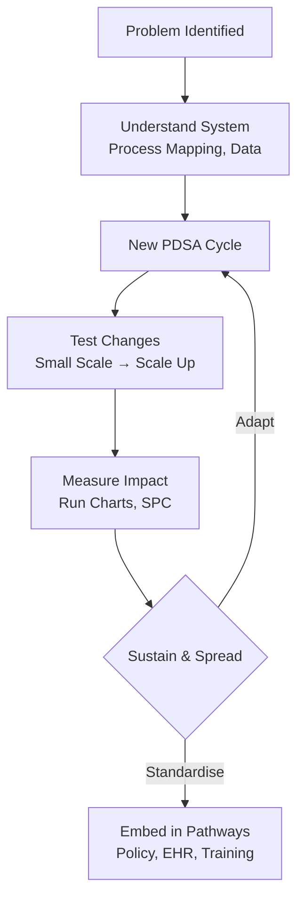
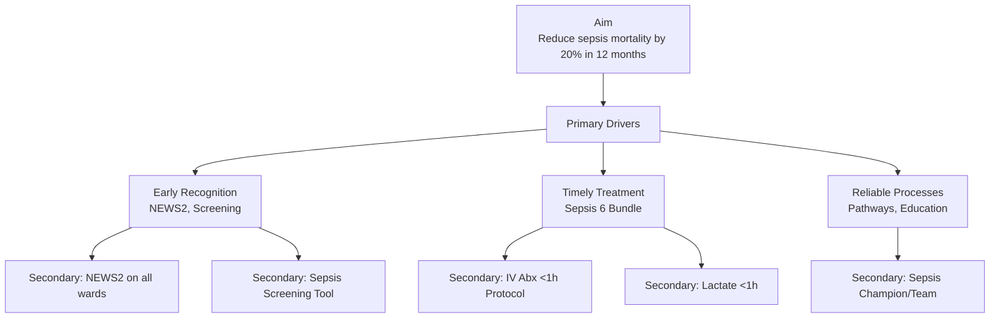
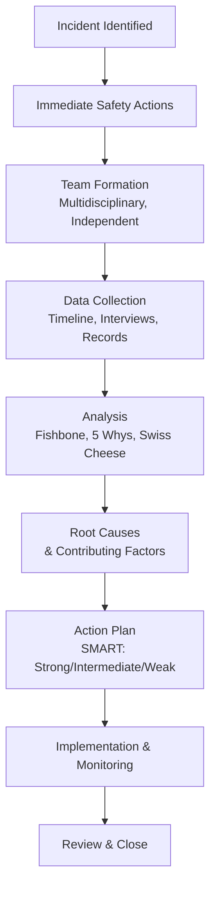
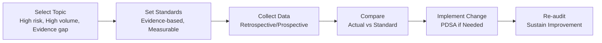
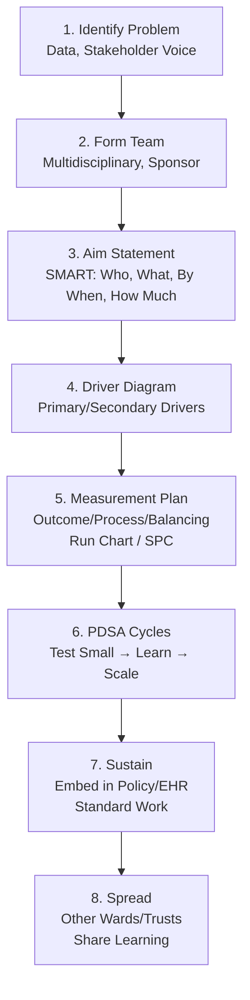
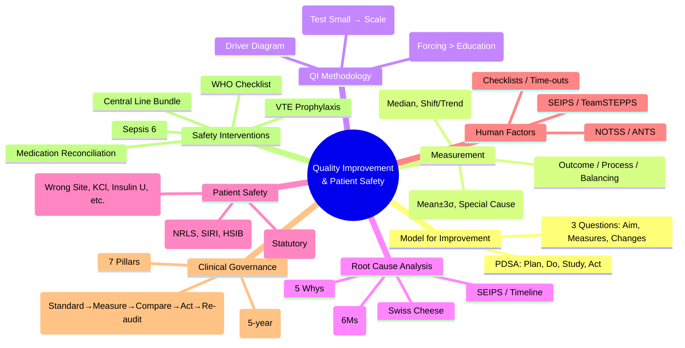

**Parent Topic:** [Clinical Decision-Making MOC](../Clinical%20Decision-Making%20MOC.md) → [Chapter 1 Hierarchy](../Davidson%20Chapter%201%20-%20Clinical%20Decision-Making%20Hierarchy.md)  
**Status:** `full-fcps-mrcp-note`  
**Priority:** ⭐⭐⭐ HIGHEST (FCPS/MRCP — QI Methodology, Patient Safety, Clinical Governance, Root Cause Analysis, Never Events)  
**Source:** Davidson 24th Ed Ch 1; IHI Model for Improvement; NHS Patient Safety Strategy; CQC; NICE; WHO Patient Safety; Royal College QI curricula

---

## 1. 1. 🎯 Learning Objectives
- [ ] Apply **QI methodology**: Model for Improvement (PDSA), Lean, Six Sigma, Driver diagrams, Run charts, Control charts
- [ ] Distinguish **measurement types**: Outcome, Process, Balancing; Understand variation (Common vs Special cause)
- [ ] Conduct **root cause analysis**: Fishbone, 5 Whys, Swiss Cheese, SEIPS, RCA report structure
- [ ] Identify **Never Events** (NHS); Understand **Duty of Candour** (Statutory)
- [ ] Describe **Clinical Governance** pillars; CQC regulation; Revalidation; Clinical audit cycle
- [ ] Apply **Human Factors / Ergonomics**: SEIPS, TeamSTEPPS, Checklists, Time-outs
- [ ] Design **safety interventions**: Surgical checklists, Medication reconciliation, VTE prophylaxis, Sepsis bundles
- [ ] Answer viva: "PDSA cycle steps" and "Root cause analysis tools" and "Never Events list"

---

## 2. 2. 🧠 Core Concept: Quality Improvement = System Science

> **Key:** *QI is not "audit" — it's **iterative testing of changes** to improve systems. Safety is a **system property**, not individual vigilance.*

---

## 3. 3. ️⃣ QI Methodology — Model for Improvement (IHI)

### 1. The 3 Fundamental Questions
1. **What are we trying to accomplish?** (Aim Statement — SMART: Specific, Measurable, Achievable, Relevant, Time-bound)
2. **How will we know a change is an improvement?** (Measures: Outcome, Process, Balancing)
3. **What changes can we make that will result in improvement?** (Change Ideas — Theory-driven, Evidence-based)

### 2. PDSA Cycle (Plan-Do-Study-Act)

| Phase | Actions | Tools |
|-------|---------|-------|
| **Plan** | Define objective, Predictions, Plan data collection, Assign roles | Aim statement, Driver diagram, Measurement plan |
| **Do** | Execute on small scale, Document problems, Collect data | Test on 1 patient/ward/day |
| **Study** | Analyse data vs predictions, Compare to baseline, Summarise learning | Run chart, Pareto chart, Qualitative feedback |
| **Act** | Adopt, Adapt, or Abandon; Plan next cycle | Standardise if successful, Modify if partial |

> **Key:** *Multiple rapid PDSAs > One big implementation. Test → Learn → Scale.*

### 3. Driver Diagram — Linking Aim to Changes

---

## 4. 4. ️⃣ Measurement for Improvement

### 1. Types of Measures

| Type | What It Measures | Examples | Frequency |
|------|------------------|----------|-----------|
| **Outcome** | Voice of patient/system | Mortality, Readmission, Infection rate, Patient experience | Monthly/Quarterly |
| **Process** | Voice of workings | Time to antibiotics, VTE prophylaxis compliance, Checklist completion | Weekly/Daily |
| **Balancing** | Unintended consequences | C. difficile rate, Antibiotic resistance, Staff burnout, Cost | Monthly |

### 2. Data Visualisation — Run Charts vs Control Charts

| Feature | Run Chart | Control Chart (SPC) |
|---------|-----------|---------------------|
| **Purpose** | Detect trends/shifts over time | Distinguish Common vs Special Cause variation |
| **Center Line** | Median | Mean |
| **Rules** | 6 points same side, 5 trending, 14 alternating | Western Electric / Nelson Rules (Zone tests) |
| **Limits** | None | UCL/LCL (±3σ) |
| **Use** | Early QI, Small data | Sustained monitoring, Stability assessment |

### 3. Run Chart Rules (Perla et al.)
1. **Shift**: 6+ consecutive points above/below median
2. **Trend**: 5+ consecutive increasing/decreasing
3. **Runs**: Too few/too many runs (non-random)
3. **Astronomical**: Obvious outlier

### 4. Variation — Common vs Special Cause (Deming/Shewhart)

| Variation Type | Source | Management Response |
|----------------|--------|---------------------|
| **Common Cause** | Inherent in system (94-97% of variation) | **Improve the system** (redesign, standardise, train) |
| **Special Cause** | Assignable, external, unusual (3-6%) | **Investigate & Remove** (root cause, fix specific issue) |

> **Tampering** = Reacting to common cause as if special → Increases variation.

---

## 5. 5. ️⃣ Root Cause Analysis (RCA) — Tools & Process

### 1. RCA Process (NHS / NPSA)

### 2. RCA Tools

| Tool | Purpose | Application |
|------|---------|-------------|
| **Fishbone (Ishikawa)** | Categorise causes | 6 Ms: Man, Machine, Method, Material, Measurement, Mother Nature (Environment) |
| **5 Whys** | Drill to root | Ask "Why?" iteratively (typically 5×) until systemic cause |
| **Swiss Cheese Model** | Visualise defences | Latent holes (system) align with active error → Harm. Defences: Protocols, Training, Supervision, Equipment |
| **SEIPS** | Systems analysis | **Systems Engineering Initiative for Patient Safety**: Person, Tasks, Tools, Environment, Organization → Processes → Outcomes |
| **Timeline / Chronology** | Sequence events | Identify gaps, delays, handover failures |
| **Barrier Analysis** | Defences failed | Identify which barriers were absent/ineffective |

### 3. Action Hierarchy (Strength of Interventions)

| Strength | Examples | Sustainability |
|----------|----------|----------------|
| **Strong** | **Forcing functions** (Hard stops, Lockouts), Automation, Computerised alerts, Physical redesign | **High** — Independent of human memory |
| **Intermediate** | Checklists, Standardised protocols, Cognitive aids, Redundancy (double-check), Simplification | Medium |
| **Weak** | Education/Training, Policies/Procedures, Memos, Reminders, Discipline | Low — Reliant on human compliance |

> **Hierarchy of Effectiveness**: Forcing Functions > Automation > Standardisation > Checklists > Education > Punishment

---

## 6. 6. ️⃣ Patient Safety — Core Concepts

### 1. Never Events (NHS England — 2018 Framework)

| Category | Examples |
|----------|----------|
| **Surgical** | Wrong site surgery, Wrong implant/prosthesis, Retained foreign object, Wrong procedure |
| **Medication** | IV KCl on wards, Insulin "U" error, Intrathecal vincristine, Overdose midazolam in child |
| **Device** | Misplaced NG/OG tube (no pH check), Oxygen tubing to air flowmeter |
| **General** | Falls from unrestricted windows, Chest/neck entrapment in bedrails, Transfusion ABO mismatch |

> **Never Event = "Serious, largely preventable safety incident that should not occur if preventive measures implemented."** Mandatory reporting, RCA required, CQC notified.

### 2. Incident Reporting & Learning

| System | Purpose |
|--------|---------|
| **NRLS / LFPSE** | National Reporting & Learning System / Learn from Patient Safety Events (England) |
| **Datix / Ulysses / Safeguard** | Local incident reporting systems |
| **Yellow Card** | Medicines/Devices (MHRA) |
| **SIRI** | Serious Incident Requiring Investigation (STEIS) |
| **HSIB** | Healthcare Safety Investigation Branch (Independent, no-blame) |

### 3. Duty of Candour (Statutory — Regulation 20, HSCA 2008)

| Trigger | Notifiable Safety Incident |
|---------|---------------------------|
| **Death** | Unintended/unexpected |
| **Severe Harm** | Permanent lessening of function (physical/psychological) |
| **Moderate Harm** | Significant but not permanent harm; Requires further treatment |
| **Prolonged Psychological Harm** | ≥28 days |

| Organisational Duty | Professional Duty |
|---------------------|-------------------|
| Tell patient (in person + writing) | Same + Report to regulator if required |
| Apologise (empathy, not liability admission) | |
| Explain what happened, known/unknown | |
| Provide support | |
| Record & Keep records | |

### 4. Human Factors / Ergonomics

| Framework | Application |
|-----------|-------------|
| **SEIPS 2.0/3.0** | Person, Tasks, Tools, Environment, Organization → Processes → Outcomes (Patient, Staff, System) |
| **TeamSTEPPS** | Team structure, Communication (SBAR, Call-out, Check-back), Leadership, Situation monitoring, Mutual support |
| **Non-Technical Skills (NOTSS / ANTS)** | Situation awareness, Decision-making, Communication, Teamwork, Leadership |
| **Checklists** | Forcing function (WHO Surgical Safety Checklist, Central Line Bundle, Sepsis 6) |
| **Time-out / Sign-in / Sign-out** | WHO Surgical Checklist (Briefing → Time-out → Debriefing) |

---

## 7. 7. ️⃣ Clinical Governance — 7 Pillars (NHS)

| Pillar | Key Activities |
|--------|----------------|
| **1. Clinical Effectiveness** | Evidence-based practice, NICE guidelines, Outcome measurement, CQUIN |
| **2. Clinical Audit** | Standard → Measure → Compare → Act → Re-audit (Cycle) |
| **3. Risk Management** | Incident reporting, RCA, Risk registers, Never Events, Claims management |
| **4. Patient & Public Involvement** | Experience surveys, Co-design, PALS, Healthwatch |
| **5. Education & Training** | CPD, Revalidation, Simulation, Human factors training |
| **6. Staffing & Workforce** | Safe staffing, Rostering, Wellbeing, Raising concerns |
| **7. Information & IT** | Clinical coding, EHR, Information governance, Data quality |

### 1. Clinical Audit Cycle

> **Audit ≠ Research.** Audit = "Are we doing what we should?" Research = "What should we do?"

### 2. Revalidation (GMC) — 5-Year Cycle
1. **CPD** — 50 hours/year (mix of personal, internal, external)
2. **Quality Improvement Activity** — At least 1 per 5 years
3. **Significant Events** — Reflection on SEAs/Complaints
4. **Patient/Colleague Feedback** — Formal surveys (MSF/PSQ)
5. **Appraisal** — Annual with trained appraiser → Recommendation to GMC

---

## 8. 8. ️⃣ High-Reliability Safety Interventions

### 1. WHO Surgical Safety Checklist (2008)

| Phase | Key Checks |
|-------|------------|
| **Sign-in (Before Anaesthesia)** | Patient ID, Site, Consent, Allergy, Airway risk, Blood loss risk |
| **Time-out (Before Incision)** | Team intro, Procedure, Site, Antibiotics (given ≤60min), Imaging, Critical events anticipated |
| **Sign-out (Before Wound Closure)** | Procedure name, Counts (swabs/instruments), Specimen labelling, Equipment issues, Recovery plan |

> **Evidence:** 30-50% reduction in mortality/complications (Haynes NEJM 2009).

### 2. Central Line Bundle (CLAB Prevention)

| Component | Standard |
|-----------|----------|
| **Hand Hygiene** | Before/after |
| **Maximal Barrier** | Cap, Mask, Gown, Gloves, Full drape |
| **Chlorhexidine 2%** | Skin prep (allow to dry) |
| **Optimal Site** | Subclavian preferred (lowest infection) |
| **Daily Review** | Necessity? Remove ASAP |

### 3. Sepsis 6 Bundle (UK Sepsis Trust)

| Within 1 Hour | |
|---------------|--|
| 1. Give Oxygen (target SpO₂ 94-98%) | 4. Take Blood Cultures (before abx) |
| 2. IV Antibiotics (broad-spectrum) | 5. Measure Serum Lactate |
| 3. IV Fluid Resuscitation (500ml crystalloid) | 6. Measure Urine Output (catheter if needed) |

### 4. Medication Safety — High-Alert Strategies

| Strategy | Example |
|----------|---------|
| **Forcing Functions** | KCl off wards, No morphine 30mg/mL on wards, Separate storage LASA drugs |
| **Standardisation** | Concentrations, Protocols, Order sets, Smart pumps |
| **Tall Man Lettering** | HYDROmorphone, OXYcodone, MORPHine |
| **Independent Double-Check** | High-alert drugs (Insulin, Heparin, Chemotherapy, KCl, Opioids IV) |
| **Medication Reconciliation** | Admission, Transfer, Discharge (Gold standard) |

---

## 9. 9. ️⃣ Practical QI Project Template

---

## 10. 10. ⚡ FCPS/MRCP High-Yield Summary

| Topic | Key Points |
|-------|------------|
| **Model for Improvement** | 3 Questions (Aim, Measures, Changes) → **PDSA** (Plan, Do, Study, Act) |
| **Driver Diagram** | Aim → Primary Drivers → Secondary Drivers → Change Ideas |
| **Measures** | Outcome (patient), Process (system), Balancing (unintended) |
| **Run Chart** | Median, Shift (6), Trend (5), Runs, Astronomical — Detect improvement |
| **Control Chart (SPC)** | Mean ±3σ, Special vs Common Cause, Western Electric rules |
| **PDSA** | Rapid cycles: Plan → Do (small) → Study (data) → Act (Adopt/Adapt/Abandon) |
| **RCA Tools** | Fishbone (6Ms), 5 Whys, Swiss Cheese, SEIPS, Timeline |
| **Action Hierarchy** | **Forcing Functions > Automation > Standardisation > Checklists > Education > Punishment** |
| **Never Events** | Wrong site surgery, Retained foreign object, KCl on wards, Insulin "U", Intrathecal vincristine, NG misplacement |
| **Duty of Candour** | Statutory (Reg 20): Tell + Apologise + Explain + Support + Record (Notifiable: Death, Severe/Moderate harm, Psych harm) |
| **Clinical Governance** | 7 Pillars: Effectiveness, Audit, Risk, Patient Involvement, Education, Workforce, Information |
| **Audit Cycle** | Standard → Measure → Compare → Act → Re-audit (Not research) |
| **Human Factors** | SEIPS, TeamSTEPPS, NOTSS, Checklists, Time-outs, Non-technical skills |
| **Safety Interventions** | WHO Checklist, Central Line Bundle, Sepsis 6, Medication Reconciliation, VTE Prophylaxis |

---

## 11. 11. 🎤 Viva Questions (Expected Answers)

| # | Question | Expected Answer |
|---|----------|-----------------|
| 1 | What is the Model for Improvement and PDSA cycle? | 3 Questions: Aim, Measures, Changes. PDSA: Plan (predict, plan data), Do (small test), Study (analyse vs prediction), Act (Adopt/Adapt/Abandon). |
| 2 | What are the 3 types of measures in QI? | **Outcome** (patient result), **Process** (system function), **Balancing** (unintended consequences). |
| 3 | Run chart — rules for special cause? | Shift (6 same side of median), Trend (5 increasing/decreasing), Runs (too few/many), Astronomical (outlier). |
| 4 | Common vs Special cause variation? | Common = Inherent in system (improve system). Special = Assignable, external (investigate & remove). |
| 5 | What is a Never Event? Name 5. | Wrong site surgery, Retained foreign object, KCl on wards, Insulin "U" error, Intrathecal vincristine, NG misplacement, Transfusion ABO mismatch, Bedrail entrapment. |
| 6 | RCA — Fishbone diagram categories? | 6 Ms: Man (People), Machine, Method, Material, Measurement, Mother Nature (Environment). |
| 7 | 5 Whys — how does it work? | Ask "Why?" iteratively (~5 times) to drill from symptom to systemic root cause. |
| 8 | Action hierarchy — strongest intervention? | **Forcing functions / Automation** (hard stops, lockouts, computerised alerts) — independent of human memory. |
| 9 | Duty of Candour — statutory triggers? | Death, Severe harm, Moderate harm, Prolonged psychological harm (unintended/unexpected). |
| 10 | WHO Surgical Checklist — 3 phases? | Sign-in (before anaesthesia), Time-out (before incision), Sign-out (before closure). |

---

## 12. 12. 🧩 Confusions & Mnemonics

| Confusion | Clarification |
|-----------|---------------|
| **"QI = Audit"** | **NO.** Audit = "Are we meeting standard?" QI = "Can we improve system?" (PDSA, iterative). |
| **"Run chart = Control chart"** | **NO.** Run chart = Median + Shift/Trend rules. Control chart = Mean ±3σ, Zone rules, Distinguish common/special cause. |
| **"Special cause = Most variation"** | **NO.** **Common cause = 94-97%** of variation. Special cause = 3-6%. |
| **"RCA = Blame individuals"** | **NO.** RCA = **Systems analysis** (Swiss Cheese, SEIPS). Focus on latent conditions, not blame. |
| **"Education = Strong intervention"** | **NO.** Education = **Weak** (relies on memory/compliance). **Forcing functions = Strongest**. |
| **"Audit = Research"** | **NO.** Audit = "Are we doing what we should?" Research = "What should we do?" |
| **"Duty of Candour = Admit negligence"** | **NO.** "Sorry this happened" ≠ "I was negligent." Apology ≠ Legal admission. |
| **"Checklist = Magic bullet"** | **NO.** Checklist = **Intermediate** strength. Works with culture, training, leadership buy-in. |
| **"PDSA = One big cycle"** | **NO.** Multiple **rapid** PDSAs (days/weeks) > One big implementation. Test → Learn → Scale. |
| **"Common cause = Fix the person"** | **NO.** Common cause = **Fix the SYSTEM** (process redesign, standardisation). |

> **Mnemonic: QI PATIENT SAFETY**  
> **Q**uality Improvement: **Model for Improvement → 3 Questions → PDSA (Rapid Cycles)**  
> **P**lan: **Aim (SMART), Driver Diagram, Measurement Plan (Outcome/Process/Balancing)**  
> **A**ct: **PDSA Cycles** (Test Small → Learn → Scale) → **Adopt, Adapt, Abandon**  
> **T**ools: **Run Chart** (Median, Shift/Trend Rules) vs **SPC** (Mean±3σ, Common vs Special Cause)  
> **I**mprovement: **Standardise → Embed in EHR/Policy → Spread**  
> **E**ngage: **Multidisciplinary Team, Patient Voice, Executive Sponsor**  
> **N**ever Events: **Wrong Site, Retained Object, KCl, Insulin U, Intrathecal Vincristine, NG Misplacement**  
> **T**ransparency: **Duty of Candour** (Statutory: Tell, Apologise, Explain, Support, Record)  
> **P**atient Safety: **Hierarchy of Interventions** — Forcing Functions > Automation > Standardisation > Checklists > Education  
> **A**nalysis (RCA): **Fishbone (6Ms), 5 Whys, Swiss Cheese, SEIPS, Timeline**  
> **I**ntervention Strength: **Forcing Function > Automation > Standardisation > Checklists > Education**  
> **E**rror Theory: **Swiss Cheese** (Latent Holes + Active Error → Harm)  
> **N**HS Governance: **7 Pillars** (Effectiveness, Audit, Risk, Involvement, Education, Workforce, Info)  
> **S**afety Culture: **Just Culture** (Human Error → Console; At-risk → Coach; Reckless → Punish)  
> **A**udit Cycle: **Standard → Measure → Compare → Act → Re-audit** (Not Research!)  
> **F**eedback: **Run Chart Rules** (Shift 6, Trend 5, Runs, Astronomical)  
> **E**xecutive Sponsor: **Essential for Resources + Barrier Removal**  
> **T**eamSTEPPS: **Communication (SBAR), Leadership, Situation Awareness, Mutual Support**  
> **Y** (Why?): **Root Cause → 5 Whys → System Fix, Not Blame**  

---

## 13. 13. 🗺️ Mind Map

---

## 14. 14. 📅 Spaced Repetition Tracker

| Review | Date | Score (0–5) | Notes |
|--------|------|-------------|-------|
| Day 1 | | | |
| Day 3 | | | |
| Day 7 | | | |
| Day 14 | | | |
| Day 30 | | | |
| Day 90 | | | |

---

## 15. 15. 📝 Self-Test Scorecard

| Section | Max | Score | % |
|---------|-----|-------|---|
| Model for Improvement / PDSA | 3 | | |
| Measurement (Outcome/Process/Balancing) | 2 | | |
| Run Charts / SPC | 3 | | |
| RCA Tools | 3 | | |
| Action Hierarchy | 2 | | |
| Never Events | 2 | | |
| Duty of Candour | 2 | | |
| Clinical Governance / Audit | 2 | | |
| Human Factors / Safety Interventions | 3 | | |
| **Total** | **20** | | |

---

## 16. 16. 💬 Exam Answer Modes

| Format | Prompt | Key Points |
|--------|--------|------------|
| **Long Essay** | "Describe the methodology for a quality improvement project to reduce time-to-antibiotics in sepsis." | Model for Improvement → Aim → Driver Diagram → Measures (Outcome/Process/Balancing) → PDSA cycles → Run Charts → Sustain → Spread. Include sepsis-specific: Sepsis 6, NEWS2, Sepsis screening. |
| **Short Note** | "Root cause analysis tools." | Fishbone (6Ms), 5 Whys, Swiss Cheese, SEIPS, Timeline. Action hierarchy: Forcing functions > Education. |
| **Viva** | "You're leading a QI project to reduce falls on elderly ward. Run chart shows 6 points below median after intervention. Interpretation?" | **Shift = Special cause = Improvement signal.** Run chart rule: 6 consecutive points on one side of median = statistically significant change. |
| **Ward Round** | "Incident: Wrong-site block performed. Immediate actions?" | 1. Patient safety (stop, assess harm). 2. Duty of Candour (inform patient/family, apologise). 3. Report (NRLS/SIRI). 4. Immediate safety actions (stop list). 5. RCA (Fishbone, 5 Whys). 6. Action plan (Forcing functions: site marking, time-out). 7. Share learning. |
| **Last-Night** | "Model: Aim→Measures→Changes→PDSA. Measures: Outcome/Process/Balancing. Run: Shift6/Trend5. RCA: Fishbone/5Whys/SwissCheese. Hierarchy: Forcing>Auto>Standard>Checklist>Edu. NeverEvents: WrongSite/KCl/InsulinU/IntrathecalVinca/NGmisplace. Candour: Death/Severe/Mod/Psych. Audit: Std→Meas→Compare→Act→Reaudit. Governance: 7Pillars. JustCulture: Human/At-risk/Reckless." | Compressed frameworks. |

---

## 17. 17. 📌 Summary
- **Model for Improvement**: 3 Questions (Aim, Measures, Changes) → **PDSA** cycles (Plan, Do, Study, Act) — rapid, iterative
- **Driver Diagram**: Aim → Primary Drivers → Secondary Drivers → Change Ideas
- **Measures**: **Outcome** (patient), **Process** (system), **Balancing** (unintended)
- **Run Charts**: Median + Rules (Shift 6, Trend 5, Runs, Astronomical) — detect improvement signals
- **Control Charts (SPC)**: Mean ±3σ, Distinguish **Common Cause** (improve system) vs **Special Cause** (investigate)
- **RCA Tools**: **Fishbone (6Ms)**, **5 Whys**, **Swiss Cheese**, **SEIPS**, Timeline
- **Action Hierarchy**: **Forcing Functions > Automation > Standardisation > Checklists > Education > Punishment**
- **Never Events**: Wrong site, Retained object, KCl on wards, Insulin "U", Intrathecal vincristine, NG misplacement, Transfusion mismatch
- **Duty of Candour (Statutory)**: Death/Severe/Moderate harm/Psych harm → Tell, Apologise, Explain, Support, Record
- **Clinical Governance**: 7 Pillars (Effectiveness, Audit, Risk, Involvement, Education, Workforce, Information)
- **Audit Cycle**: Standard → Measure → Compare → Act → Re-audit (Not research!)
- **Human Factors**: SEIPS, TeamSTEPPS, Checklists, Time-outs, Non-technical skills (NOTSS)
- **Key Safety Interventions**: WHO Surgical Checklist, Central Line Bundle, Sepsis 6, Medication Reconciliation, VTE Prophylaxis

---

## 18. 18. ❓ MCQs (10)

1. **Model for Improvement — 3 Questions are:**  
   A. What, Why, How  B. **Aim, Measures, Changes**  C. Plan, Do, Study  D. Who, What, When  
   *Answer: B. 1) What are we trying to accomplish? 2) How will we know? 3) What changes can we make?*

2. **Run chart rule for "Shift":**  
   A. 5 points trending  B. **6 consecutive points on same side of median**  C. 14 alternating  D. 1 point outside 3σ  
   *Answer: B. 6+ consecutive points above or below median = Shift (special cause).*

3. **Common cause variation — percentage of total variation:**  
   A. 3-6%  B. 10-20%  C. **94-97%**  D. 50%  
   *Answer: C. Common cause = inherent system variation (94-97%). Special cause = 3-6%.*

4. **Strongest intervention in action hierarchy:**  
   A. Education  B. Policy  C. **Forcing function / Automation**  D. Checklist  
   *Answer: C. Forcing functions (hard stops, lockouts) > Automation > Standardisation > Checklists > Education.*

5. **NHS Never Event — which is listed?**  
   A. Hospital-acquired infection  B. **IV potassium on wards**  C. Pressure ulcer  D. Drug reaction  
   *Answer: B. IV concentrated KCl on wards = Never Event. Others are preventable harm but not Never Events.*

6. **Duty of Candour — notifiable harm includes:**  
   A. Minor harm  B. **Moderate harm (significant but not permanent)**  C. Near miss  D. Patient dissatisfaction  
   *Answer: B. Notifiable: Death, Severe harm, Moderate harm, Prolonged psychological harm.*

7. **WHO Surgical Checklist — Time-out phase includes:**  
   A. Allergy check  B. **Team intros, Procedure, Site, Antibiotics given, Imaging, Critical events**  C. Blood loss estimate  D. DVT prophylaxis  
   *Answer: B. Time-out = Team intro, Procedure, Site, Antibiotics (≤60min), Imaging, Anticipated critical events.*

8. **Audit vs Research:**  
   A. Same  B. **Audit = "Are we doing what we should?" Research = "What should we do?"**  C. Research = Audit with ethics  D. Audit = Retrospective, Research = Prospective  
   *Answer: B. Audit compares practice to standard; Research generates new knowledge.*

9. **Just Culture — At-risk behaviour response:**  
   A. Punish  B. Console  C. **Coach**  D. Ignore  
   *Answer: B. Human Error → Console; At-risk Behaviour → Coach; Reckless Behaviour → Punish.*

10. **SEIPS model components:**  
    A. Safety, Environment, Infection, Process, Staff  B. **Systems, Engineering, Initiative, Patient, Safety**  C. **Person, Tasks, Tools, Environment, Organization**  D. Structure, Process, Outcome, Input, Output  
    *Answer: C. Systems Engineering Initiative for Patient Safety: Person, Tasks, Tools, Environment, Organization → Processes → Outcomes.*

---

## 19. 19. 📋 SBAs (10)

1. **QI project: Reduce door-to-needle time for stroke thrombolysis. Current median 60 min. After intervention, run chart shows 7 consecutive points below median. Interpretation?**  
   A. Common cause variation  B. **Special cause improvement (Shift rule)**  C. No change  D. Deterioration  
   *Answer: B. Shift = 6+ consecutive points on one side of median = signal of improvement.*

2. **Never Event occurs: Wrong-site skin lesion excised. Immediate organisational duty?**  
   A. Root cause analysis within 72h  B. **Duty of Candour: Inform patient, Apologise, Support, Record**  C. Suspend surgeon  D. Report to GMC only  
   *Answer: B. Statutory Duty of Candour triggered: Tell patient (in person+writing), Apologise, Explain, Support, Record.*

3. **QI team proposes "educate all nurses on new VTE protocol" as primary intervention. Assessment?**  
   A. Strong  B. Intermediate  C. **Weak (Education alone)**  D. Forcing function  
   *Answer: C. Education = Weak (relies on memory/compliance). Need standardisation, checklists, forcing functions.*

4. **Control chart rule — point above UCL (Upper Control Limit at +3σ):**  
   A. Common cause  B. **Special cause**  C. Process improvement  D. Measurement error  
   *Answer: B. Point beyond ±3σ = Special cause signal (Western Electric Rule 1).*

5. **Just Culture — nurse bypasses barcode scan "to save time" repeatedly. Classification?**  
   A. Human Error  B. **At-risk Behaviour**  C. Reckless Behaviour  D. System Failure  
   *Answer: B. At-risk Behaviour (choosing shortcut despite knowing protocol) → Coach, Address system factors.*

---

## 20. 20. 🔑 Answer Keys
| MCQs | SBAs |
|------|------|
| 1-B, 2-B, 3-C, 4-C, 5-B, 6-B, 7-B, 8-B, 9-C, 10-C | 1-B, 2-B, 3-C, 4-B, 5-B |

---

## 21. 21. 🔗 Cross-Links
- [[1.1 Clinical Reasoning & Diagnostic Process]] — Diagnostic error, Cognitive biases, Safety-netting
- [[1.2 Evidence-Based Medicine]] — Evidence-based QI, GRADE for QI, Statistics for improvement
- [[1.3 Communication Skills]] — SBAR/ISBAR handover, TeamSTEPPS, Duty of candour conversation
- [[1.4 Ethics & Law]] — Duty of candour (Legal), Consent for QI, Confidentiality in reporting
- [[1.6 Guidelines & Pathways]] — QI for guideline implementation, Clinical pathways, Variance tracking
- [../../Medication Safety/QI] — Medication reconciliation, High-alert drug safety, PINCH drugs
- [../../Perioperative/QI] — WHO Checklist, VTE prophylaxis bundles, SSI bundles
- [../../Clinical Context/Antimicrobial Stewardship] — Sepsis bundles, Antibiotic stewardship QI
