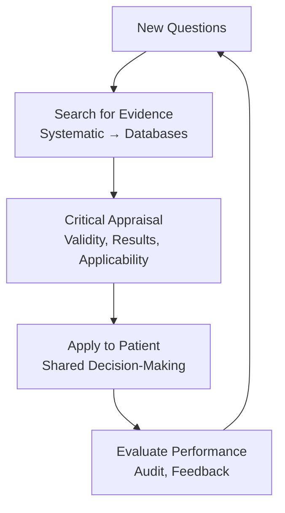
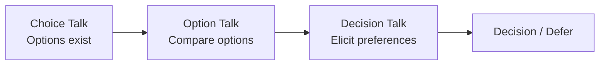

# 1.2 Evidence-Based Medicine (EBM)

**Parent Topic:** [Clinical Decision-Making MOC](../Clinical%20Decision-Making%20MOC.md) → [Chapter 1 Hierarchy](../Davidson%20Chapter%201%20-%20Clinical%20Decision-Making%20Hierarchy.md)  
**Status:** `full-fcps-mrcp-note`  
**Priority:** ⭐⭐⭐ HIGHEST (FCPS/MRCP — Study design, Critical appraisal, Statistics, GRADE, Shared decision-making)  
**Source:** Davidson 24th Ed Ch 1; Sackett; CEBM Oxford; JAMA Users' Guides; GRADE Handbook; Cochrane Handbook; BMJ Statistics Notes

---

## 1. 🎯 Learning Objectives
- [ ] Classify **study designs** by hierarchy of evidence; identify strengths/limitations
- [ ] Critically appraise **RCTs** (Therapy), **Diagnostic studies**, **Prognosis studies**, **Harm/Etiology studies**, **Systematic reviews/Meta-analyses**
- [ ] Apply **statistics for EBM**: NNT/NNH, Sensitivity/Specificity/LRs, Hazard ratios, I², Forest plots
- [ ] Use **GRADE** to rate quality of evidence and strength of recommendations
- [ ] Understand **guideline development** (AGREE II, WHO, NICE, ESC)
- [ ] Apply **shared decision-making**: Decision aids, Risk communication, Values clarification
- [ ] Answer viva: "Appraise this RCT" and "Interpret this forest plot" and "GRADE this evidence"

---

## 2. 🧠 Core Concept: EBM Framework



> **EBM = Best Evidence + Clinical Expertise + Patient Values/Preferences** (Sackett 1996)

---

## 3. ️⃣ Hierarchy of Evidence (Oxford CEBM 2011)

| Level | Study Design | Clinical Question |
|-------|--------------|-------------------|
| **1a** | SR/MA of RCTs | Therapy, Prevention |
| **1b** | Individual RCT (narrow CI) | Therapy, Prevention |
| **1c** | All-or-none study | Therapy, Prevention |
| **2a** | SR/MA of Cohort studies | Prognosis, Harm |
| **2b** | Individual Cohort study | Prognosis, Harm |
| **2c** | Outcomes research / Registry | Prognosis, Harm |
| **3a** | SR/MA of Case-control | Harm, Rare disease |
| **3b** | Individual Case-control | Harm, Rare disease |
| **4** | Case-series / Case-report | Rare disease, New entity |
| **5** | Expert opinion / Consensus | All (lowest) |

> **Key:** *Systematic reviews > Single studies. RCTs > Observational for therapy. Cohort > Case-control for prognosis/harm.*

---

## 4. ️⃣ Study Designs — Key Features

### Randomised Controlled Trial (RCT) — Gold Standard for Therapy
| Feature | Detail |
|---------|--------|
| **Randomisation** | Sequence generation (computer, permutation), Allocation concealment (opaque sealed envelopes, central) |
| **Blinding** | Participant, Personnel, Outcome assessor (single/double/triple) |
| **Analysis** | **Intention-to-Treat (ITT)** — all randomised analysed as allocated; Per-protocol = biased |
| **Follow-up** | ≥80% complete; Attrition <20% |
| **Reporting** | CONSORT 2010 (25 items) |

### Observational Studies
| Design | Best For | Key Bias |
|--------|----------|----------|
| **Prospective Cohort** | Prognosis, Incidence, Harm | Loss to follow-up, Confounding |
| **Retrospective Cohort** | Same (using existing data) | Selection, Information bias |
| **Case-Control** | Rare diseases, Harm (long latency) | Recall bias, Selection bias (controls) |
| **Cross-Sectional** | Prevalence, Diagnostic accuracy | Temporal ambiguity |

### Systematic Review & Meta-Analysis
| Step | Tool/Standard |
|------|---------------|
| **Protocol** | PRISMA-P, PROSPERO registration |
| **Search** | Multiple databases, Grey literature, Hand-search, No language restriction |
| **Selection** | PRISMA flow diagram (Identification → Screening → Eligibility → Included) |
| **Risk of Bias** | **RoB 2** (RCTs), **ROBINS-I** (Non-randomised), **QUADAS-2** (Diagnostic) |
| **Synthesis** | Fixed-effect (homogeneous) vs Random-effects (heterogeneous) |
| **Heterogeneity** | I²: 0–40% low, 30–60% moderate, 50–90% substantial, 75–100% considerable |
| **Publication Bias** | Funnel plot asymmetry, Egger test, Trim-and-fill |
| **Reporting** | PRISMA 2020 (27 items) |

---

## 5. ️⃣ Critical Appraisal by Question Type

### 3.1 Therapy (RCT) — Key Appraisal Questions

| Domain | Questions |
|--------|-----------|
| **Validity** | 1. Randomised? (sequence, concealment) 2. Blinded? (patient, clinician, assessor) 3. ITT analysis? 4. Follow-up >80%? 5. Groups similar at baseline? |
| **Results** | 6. Effect size (RR, OR, HR)? 7. Precision (95% CI)? 8. Absolute measures (ARR, NNT)? 9. Subgroups pre-specified? |
| **Applicability** | 10. Population = my patient? 11. Intervention feasible? 12. Outcomes relevant? 13. Harms vs Benefits? |

### Key Metrics for Therapy

| Metric | Formula | Interpretation |
|--------|---------|----------------|
| **RR (Relative Risk)** | EER / CER | Risk in exposed vs control |
| **OR (Odds Ratio)** | (a/b) / (c/d) | Approx RR if outcome rare (<10%) |
| **HR (Hazard Ratio)** | Cox model | Time-to-event; Instantaneous risk ratio |
| **ARR (Absolute Risk Reduction)** | CER - EER | Absolute benefit per patient |
| **NNT (Number Needed to Treat)** | 1 / ARR | Patients to treat for 1 benefit |
| **NNH (Number Needed to Harm)** | 1 / ARI | Patients to treat for 1 harm |
| **RRR (Relative Risk Reduction)** | (CER - EER) / CER | Proportional reduction |

> **Viva Key:** *NNT = 1/ARR. If CER=20%, EER=10% → ARR=10% → NNT=10. Report ARR + NNT, not just RRR.*

### Fragility Index
- Minimum number of outcome switches (event→non-event) to make p>0.05
- Low FI (<5) = fragile result despite statistical significance

---

### 3.2 Diagnostic Studies — Key Appraisal

| Domain | Questions |
|--------|-----------|
| **Validity** | 1. Representative spectrum? 2. Blinded comparison? 3. Independent gold standard? 4. All patients get same reference? |
| **Results** | 5. Sensitivity, Specificity, LR+, LR-? 6. PPV, NPV at relevant prevalence? 7. Precision (CI)? |
| **Applicability** | 8. Population similar? 9. Test available/affordable? 10. Impact on outcomes? |

> **Key:** *Diagnostic studies need **pre-specified thresholds**. Avoid "diagnostic review bias" (knowledge of index test influences reference).*

---

### 3.3 Prognosis Studies — Key Appraisal

| Domain | Questions |
|--------|-----------|
| **Validity** | 1. Inception cohort? (early, uniform stage) 2. Complete follow-up (>80%)? 3. Objective outcome criteria? 4. Adjustment for confounders (multivariable)? |
| **Results** | 5. Survival curves (KM)? 6. Hazard ratios (Cox)? 7. Precision (CI)? 8. Competing risks addressed? |

### Key Metrics for Prognosis

| Metric | Interpretation |
|--------|----------------|
| **Kaplan-Meier** | Survival probability over time; Censoring handled |
| **Log-rank test** | Compare survival curves |
| **Cox PH Model** | HR: Hazard in exposed vs unexposed at any time; Assumes proportional hazards |
| **C-statistic (AUC)** | Discrimination of risk model (0.5–1.0) |
| **Calibration** | Observed vs Predicted (Hosmer-Lemeshow, calibration plot) |
| **Competing Risks** | Fine-Gray model (subdistribution hazard) |

---

### 3.4 Harm / Etiology Studies

| Design | Best For | Key Metric |
|--------|----------|------------|
| **Case-Control** | Rare outcomes, Long latency | **OR** (approx RR if rare) |
| **Cohort** | Common outcomes, Short latency | **RR**, **AR**, **PAR** |
| **RCT** | Drug adverse events (short-term) | **RR** (but underpowered for rare harm) |

### Key Metrics for Harm

| Metric | Formula | Interpretation |
|--------|---------|----------------|
| **Attributable Risk (AR)** | EER - CER | Excess risk in exposed |
| **Population Attributable Risk (PAR)** | Pp × (RR-1) / [1 + Pp×(RR-1)] | Population burden |
| **Population Attributable Fraction (PAF)** | PAR / Overall Risk | Proportion preventable if exposure removed |

---

### 3.5 Systematic Review & Meta-Analysis Appraisal

| Domain | Questions |
|--------|-----------|
| **Validity** | 1. Focused question (PICO)? 2. Comprehensive search? 3. Reproducible selection? 4. Reproducible data extraction? 5. RoB assessment (RoB 2/ROBINS-I)? |
| **Results** | 6. Heterogeneity (I², χ²)? 7. Fixed vs Random effects justified? 8. Publication bias assessed? 9. Sensitivity/subgroup analyses? |
| **Applicability** | 10. Results applicable to my patient? 11. All outcomes considered? 12. Benefits vs Harms? |

### Forest Plot Interpretation
- **Square** = Study effect size (size = weight)
- **Horizontal line** = 95% CI
- **Diamond** = Pooled effect (center = effect, width = CI)
- **Vertical line** = No effect (1.0 for RR/OR/HR)
- **Heterogeneity**: I² >50% = substantial → explore causes (subgroup, sensitivity)

### Network Meta-Analysis (NMA)
- **Direct + Indirect evidence** → Mixed estimates
- **Assumption**: Transitivity (similarity across comparisons)
- **Output**: League tables, Rankograms, **SUCRA** (Surface Under Cumulative Ranking Curve)
- **Inconsistency**: Loop-specific (node-splitting), Global (design-by-treatment)

---

## 6. ️⃣ Statistics for EBM — Quick Reference

### Common Tests & When to Use

| Scenario | Test | Assumptions |
|----------|------|-------------|
| Compare means (2 groups) | t-test (parametric) / Mann-Whitney (non-parametric) | Normality, Equal variance |
| Compare means (>2 groups) | ANOVA / Kruskal-Wallis | Normality, Homoscedasticity |
| Compare proportions | χ² / Fisher's exact | Expected >5 (χ²) |
| Correlation | Pearson (parametric) / Spearman (non-parametric) | Linearity, Normality |
| Time-to-event | Log-rank (univariate) / Cox (multivariate) | Proportional hazards |
| Diagnostic accuracy | Sensitivity, Specificity, LR, ROC/AUC | Representative spectrum |

### Regression Models

| Model | Outcome | Interpretation |
|-------|---------|----------------|
| **Linear** | Continuous | β = change in Y per 1-unit X |
| **Logistic** | Binary | **OR = e^β** (approx RR if rare) |
| **Cox PH** | Time-to-event | **HR = e^β** (proportional hazards) |
| **Poisson/Negative Binomial** | Count | IRR = e^β |
| **Fine-Gray** | Competing risks | Subdistribution HR |

### Key Concepts

| Concept | Definition |
|---------|------------|
| **p-value** | Prob(data ≥ observed | H₀ true); Not = Prob(H₀ true | data) |
| **95% CI** | Range of true effect compatible with data; 95% of such intervals contain true value |
| **Type I Error (α)** | False positive (reject H₀ when true); Usually 0.05 |
| **Type II Error (β)** | False negative (fail to reject H₀ when false); Power = 1-β |
| **Power** | Prob(detect effect | effect exists); Usually 80–90% |
| **Effect Size** | Standardised mean difference (Cohen's d): 0.2 small, 0.5 medium, 0.8 large |

---

## 7. ️⃣ GRADE (Grading of Recommendations Assessment, Development and Evaluation)

### Quality of Evidence — 4 Levels

| Level | Symbol | Meaning |
|-------|--------|---------|
| **High** | ⊕⊕⊕⊕ | Very confident effect ≈ true effect |
| **Moderate** | ⊕⊕⊕⊙ | Moderately confident; true effect likely close |
| **Low** | ⊕⊕⊙⊙ | Limited confidence; true effect may be substantially different |
| **Very Low** | ⊕⊙⊙⊙ | Very little confidence; true effect likely substantially different |

### Downgrading Factors (5)
| Factor | Downgrade By |
|--------|--------------|
| **Risk of Bias** | Serious (-1), Very serious (-2) |
| **Inconsistency** | Heterogeneity (I²>50%), Unexplained variability |
| **Indirectness** | Population/Intervention/Comparator/Outcome not matching |
| **Imprecision** | Wide CI crossing decision threshold, Optimal information size not met |
| **Publication Bias** | Funnel plot asymmetry, Small study effects |

### Upgrading Factors (3) — Observational only
| Factor | Upgrade By |
|--------|------------|
| **Large Effect** | RR >2 or <0.5 (+1), RR >5 or <0.2 (+2) |
| **Dose-Response** | Gradient present (+1) |
| **All Plausible Confounding** | Would reduce effect (+1) |

### Strength of Recommendation

| Grade | Phrasing | Meaning |
|-------|----------|---------|
| **Strong** | "We recommend..." | Net benefit clearly outweighs harm; Most patients should receive |
| **Conditional/Weak** | "We suggest..." | Trade-offs exist; Different choices for different patients; Shared decision-making essential |

> **GRADE ≠ Study Design Hierarchy.** RCT starts at **High** but can be downgraded. Observational starts at **Low** but can be upgraded.

---

## 8. ️⃣ Guideline Development & Appraisal

### AGREE II Instrument (23 items, 6 Domains)

| Domain | Focus |
|--------|-------|
| **1. Scope & Purpose** | Objectives, Population, Health questions |
| **2. Stakeholder Involvement** | Representation, Views, Target users |
| **3. Rigour of Development** | Search, Evidence selection, Criteria, Methods, Link evidence → recs, External review, Update plan |
| **4. Clarity of Presentation** | Specific recommendations, Options, Key recommendations identifiable |
| **5. Applicability** | Barriers/facilitators, Implementation tools, Resource implications, Monitoring/audit |
| **6. Editorial Independence** | Funding body influence, Competing interests |

### WHO Guideline Development (Handbook)
1. **Scope** → 2. **Group composition** → 3. **PICO questions** → 4. **Evidence retrieval & appraisal** → 5. **Evidence-to-decision (EtD) frameworks** → 6. **Recommendation formulation** → 7. **Dissemination/Implementation** → 8. **Evaluation/Update**

### NICE Process
- **Topic selection** → **Scope** → **Evidence review** → **Economic modelling** → **Committee deliberation** → **Consultation** → **Publication**
- **Technology Appraisal** (TA), **Clinical Guideline** (CG), **Public Health Guideline** (PH), **Diagnostics Guidance** (DG)

---

## 9. ️⃣ Shared Decision-Making (SDM)

### SDM Model (Elwyn et al.)



### Key Components

| Component | Tools |
|-----------|-------|
| **Risk Communication** | Absolute risks (ARR/NNT), Icon arrays, Natural frequencies ("10 in 100"), Avoid RRR alone |
| **Decision Aids** | Option grids, Patient decision aids (IPDAS criteria), Videos, Interactive tools |
| **Values Clarification** | Exercises, Wish lists, Best-worst scaling, Threshold technique |
| **Implementation** | SDM embedded in consultation (3-talk model), Training, System support |

### 3-Talk Model (Elwyn)

| Talk | Content |
|------|---------|
| **Choice Talk** | "There are options..." Summarise options, Check understanding |
| **Option Talk** | Compare benefits/harms (absolute numbers), Use decision aids |
| **Decision Talk** | "What matters most to you?" Elicit preferences, Check concordance |

---

## 10. ️⃣ Practical Appraisal Checklists

### RCT Quick Checklist (CONSORT-based)
- [ ] Randomised? Concealed allocation?
- [ ] Blinded (patient, clinician, assessor)?
- [ ] ITT analysis? Attrition <20%?
- [ ] Baseline balance?
- [ ] Effect size (RR/OR/HR) + 95% CI?
- [ ] ARR/NNT reported?
- [ ] Subgroups pre-specified?
- [ ] Harms reported?
- [ ] Applicable to my patient?

### Diagnostic Study Checklist (QUADAS-2 based)
- [ ] Representative spectrum?
- [ ] Index test blinded to reference?
- [ ] Reference standard independent/blinded?
- [ ] Same reference for all?
- [ ] Continuing enrollment?
- [ ] Sensitivity/Spec/LR with CIs?
- [ ] Clinical applicability?

### SR/MA Checklist (PRISMA/AMSTAR-2)
- [ ] Protocol registered (PROSPERO)?
- [ ] PICO clear?
- [ ] Comprehensive search (databases, grey, no lang restriction)?
- [ ] Duplicate selection/extraction?
- [ ] RoB assessment (RoB 2 / ROBINS-I)?
- [ ] Random-effects if heterogeneity?
- [ ] I² reported? Subgroup/sensitivity?
- [ ] Publication bias (funnel, Egger)?
- [ ] GRADE applied?

---

## 11. ⚡ FCPS/MRCP High-Yield Summary

| Topic | Key Points |
|-------|------------|
| **Hierarchy** | SR/MA > RCT > Cohort > Case-control > Cross-sectional > Expert opinion |
| **RCT Appraisal** | Randomisation (concealment), Blinding, ITT, Follow-up >80%, Effect size + CI, ARR/NNT |
| **Diagnostic Appraisal** | Spectrum, Blinding, Gold standard, Sensitivity/Spec/LR/PPV/NPV |
| **Prognosis Appraisal** | Inception cohort, Follow-up >80%, Multivariable Cox, KM curves, C-statistic |
| **Meta-Analysis** | Random-effects if I²>50%, Publication bias (funnel/Egger), NMA (transitivity, SUCRA) |
| **Key Stats** | RR/OR/HR, ARR/NNT/NNH, Sensitivity/Spec/LR, Hazard Ratio, I², Fragility Index |
| **GRADE** | High/Mod/Low/Very Low; Downgrade (Bias, Inconsistency, Indirectness, Imprecision, Pub bias); Upgrade (Large effect, Dose-response, Confounding) |
| **Recommendation** | Strong ("recommend") vs Conditional ("suggest") |
| **AGREE II** | 6 domains: Scope, Stakeholders, Rigour, Clarity, Applicability, Independence |
| **Shared Decision-Making** | 3-talk model (Choice/Option/Decision), Absolute risks (NNT), Decision aids, Values clarification |

---

## 12. 🎤 Viva Questions (Expected Answers)

| # | Question | Expected Answer |
|---|----------|-----------------|
| 1 | Hierarchy of evidence for therapy? | 1a: SR/MA of RCTs → 1b: Individual RCT → 2a: SR/MA of cohorts → 2b: Individual cohort → 3: Case-control → 4: Case-series → 5: Expert opinion |
| 2 | How to appraise an RCT? | Validity: Randomisation (concealment), Blinding, ITT, Follow-up >80%. Results: Effect size (RR/OR/HR), 95% CI, ARR, NNT, Subgroups. Applicability: Population, Intervention, Outcomes. |
| 3 | What is NNT and how to calculate? | NNT = 1 / ARR. ARR = CER - EER. Example: CER 20%, EER 10% → ARR 10% → NNT = 10. |
| 4 | Sensitivity 90%, Specificity 80%, Prevalence 20%. PPV? | TP = 0.9×20 = 18; FP = 0.2×80 = 16; PPV = 18/(18+16) = 53%. |
| 5 | What is I² in meta-analysis? | I² = % of total variation due to heterogeneity not chance. 0–40% low, 30–60% mod, 50–90% substantial, 75–100% considerable. |
| 6 | GRADE — when to downgrade for imprecision? | Wide CI crossing decision threshold (e.g., includes both benefit and harm), Optimal information size not met (sample size too small). |
| 7 | GRADE — when to upgrade observational evidence? | Large effect (RR>2 or <0.5 → +1; RR>5 or <0.2 → +2); Dose-response gradient; All plausible confounding would reduce effect. |
| 8 | Strong vs Conditional recommendation? | Strong: "We recommend" — net benefit clear, most patients should receive. Conditional: "We suggest" — trade-offs, different choices for different patients, SDM needed. |
| 9 | AGREE II — most important domain for trustworthy guidelines? | **Domain 3: Rigour of Development** — Systematic search, Evidence selection, Link evidence→recs, External review, Update plan. |
| 10 | Shared decision-making — 3-talk model? | Choice Talk: Options exist. Option Talk: Compare (absolute risks, decision aids). Decision Talk: Elicit preferences/values, Agree on plan. |

---

## 13. 🧩 Confusions & Mnemonics

| Confusion | Clarification |
|-----------|---------------|
| **"RCT always = High quality"** | **NO.** RCT with poor allocation concealment, no blinding, high attrition → **downgraded** to Moderate/Low. |
| **"OR = RR"** | **Only if outcome rare (<10%).** Common outcome → OR overestimates RR. Use RR/HR for cohort/RCT. |
| **"RRR = Clinical significance"** | **NO.** RRR ignores baseline risk. ARR/NNT needed for clinical relevance. |
| **"I² >50% = Don't pool"** | **NO.** Substantial heterogeneity → explore (subgroup, sensitivity), use random-effects, interpret cautiously. |
| **"GRADE = Study hierarchy"** | **NO.** RCT starts High but can be downgraded. Observational starts Low but can be upgraded. |
| **"SR/MA always better than single RCT"** | **Not if SR includes biased studies.** Quality of included studies matters more than number. |
| **"NNT = 1/RRR"** | **NO.** NNT = 1/ARR. RRR is relative; ARR is absolute. |
| **"PPV = Sensitivity"** | **NO.** PPV depends on PREVALENCE. Same test: high prev → high PPV; low prev → low PPV. |
| **"Strong recommendation = Do it always"** | **Strong = Net benefit clear for MOST patients.** Conditional = Trade-offs, SDM essential. |

> **Mnemonic: EBM APPRAISAL GRADE**  
> **E**vidence hierarchy: **SR/MA > RCT > Cohort > Case-control > Cross-sec > Expert**  
> **B**ias check: **RCT = Randomised, Blinded, ITT, Concealed, Follow-up**  
> **M**etrics: **NNT = 1/ARR; LR+ = Sens/(1-Spec); LR- = (1-Sens)/Spec**  
> **A**ppraisal by type: **Therapy=RCT; Diagnosis=Sen/Spec/LR; Prognosis=Cox/KM; Harm=Case-control**  
> **P**ooling: **Fixed if I²<40%, Random if I²>50%**; NMA needs transitivity  
> **R**esults: **ARR + NNT > RRR**; Fragility index for fragile significance  
> **A**pplicability: **Population, Intervention, Outcomes, Setting** — match my patient?  
> **I**nconsistency: **I², Subgroup, Sensitivity** — explore heterogeneity  
> **S**ensitivity/Specificity: **SnNout / SpPin**; LR stable across prevalences  
> **E**vidence-to-decision: **GRADE** for quality; **EtD** for recommendations  
> **A**GREE II: **6 domains** (Scope, Stakeholders, Rigour, Clarity, Applicability, Independence)  
> **R**ecommendation: **Strong = Recommend (most); Conditional = Suggest (SDM)**  
> **D**ecision aids: **3-talk (Choice/Option/Decision)**; Absolute risks; Values clarification  
> **K**nowledge translation: **GRADE → EtD → AGREE II → Implementation → Evaluation**  
> **I**mpact: **Fragility Index** (switches to change p<0.05)  
> **A**llows upgrading: **Large effect, Dose-response, Confounding** (observational only)  
> **L**iving guidelines: **Update as evidence changes** (continuous surveillance)

---

## 14. 🗺️ Mind Map

```mermaid
mindmap
  root((Evidence-Based Medicine))
    Hierarchy
      SR/MA > RCT > Cohort > Case-control
    Study Designs
      RCT: Randomised, Blinded, ITT
      Cohort: Prognosis, Harm
      Case-control: Rare harm
      Cross-sectional: Prevalence
    Critical Appraisal
      Therapy: RCT validity, Results, Applicability
      Diagnosis: Spectrum, Blinded, Gold standard, LR
      Prognosis: Inception cohort, Cox, KM
      Harm: Case-control (OR), Cohort (RR)
      SR/MA: RoB, I², Fixed/Random, Pub bias
    Statistics
      NNT = 1/ARR
      RR/OR/HR
      I² heterogeneity
      Fragility Index
    GRADE
      High/Mod/Low/Very Low
      Downgrade 5 factors
      Upgrade 3 factors
      Strong vs Conditional
    Guidelines
      AGREE II (6 domains)
      WHO Handbooks
      NICE Process
    Shared Decision-Making
      3-Talk Model
      Decision Aids
      Risk Communication
```

---

## 15. 📅 Spaced Repetition Tracker

| Review | Date | Score (0–5) | Notes |
|--------|------|-------------|-------|
| Day 1 | | | |
| Day 3 | | | |
| Day 7 | | | |
| Day 14 | | | |
| Day 30 | | | |
| Day 90 | | | |

---

## 16. 📝 Self-Test Scorecard

| Section | Max | Score | % |
|---------|-----|-------|---|
| Hierarchy & Study Designs | 3 | | |
| RCT Appraisal | 3 | | |
| Diagnostic/Prognosis/Harm Appraisal | 4 | | |
| Meta-Analysis & Statistics | 3 | | |
| GRADE | 3 | | |
| Guidelines (AGREE II) | 2 | | |
| Shared Decision-Making | 2 | | |
| **Total** | **20** | | |

---

## 17. 💬 Exam Answer Modes

| Format | Prompt | Key Points |
|--------|--------|------------|
| **Long Essay** | "Describe the steps of critical appraisal of an RCT and how GRADE is used to make recommendations." | PICO → Search → Validity (Randomised, Blinded, ITT, Follow-up) → Results (Effect, CI, ARR/NNT) → Applicability → GRADE (downgrade/upgrade) → Strong vs Conditional rec |
| **Short Note** | "GRADE approach to quality of evidence." | 4 levels, 5 downgrade factors (Bias, Inconsistency, Indirectness, Imprecision, Pub bias), 3 upgrade (Large effect, Dose-response, Confounding), Strong vs Conditional |
| **Viva** | "Interpret this forest plot: Diamond at 0.85 (0.72–1.01), I²=65%." | Pooled HR 0.85 (CI crosses 1.0 = not statistically significant). Substantial heterogeneity (I²=65%) → explore causes. Random-effects used. Clinical significance uncertain. |
| **Ward Round** | "Patient asks 'What are my chances?' after MI. NNT for aspirin 40. How to explain?" | "Without aspirin, 20 in 100 have another event. With aspirin, 17 in 100. So 3 in 100 benefit. That's 1 person helped for every 33 treated (if ARR 3%). Your personal risk factors adjust this." |
| **Last-Night** | "Hierarchy: SR>RCT>Cohort>CC. RCT: random, blind, ITT, FU>80%. NNT=1/ARR. Diag: SnNout/SpPin. MA: I²>50 random. GRADE: 4 levels, 5 down, 3 up. AGREE: 6 domains. SDM: 3-talk. Strong=recommend." | Tier 1 facts compressed. |

---

## 18. 📌 Summary
- **Evidence Hierarchy**: SR/MA of RCTs > Individual RCT > Cohort > Case-control > Cross-sectional > Expert opinion
- **RCT Appraisal**: Randomisation (concealment), Blinding, ITT, Follow-up >80%, Effect size + 95% CI, ARR/NNT
- **Key Metrics**: NNT = 1/ARR; LR+ = Sens/(1-Spec); LR- = (1-Sens)/Spec; HR from Cox; I² for heterogeneity
- **GRADE**: 4 quality levels (High→Very Low); 5 downgrade factors (Bias, Inconsistency, Indirectness, Imprecision, Pub bias); 3 upgrade (Large effect, Dose-response, Confounding); Strong vs Conditional recs
- **Guidelines**: AGREE II (6 domains: Scope, Stakeholders, Rigour, Clarity, Applicability, Independence); WHO, NICE processes
- **Shared Decision-Making**: 3-talk model (Choice, Option, Decision); Absolute risk communication (NNT, icon arrays); Decision aids; Values clarification

---

## 19. ❓ MCQs (10)

1. **Highest level of evidence for therapy:**  
   A. Expert opinion  B. Single RCT  C. **SR/MA of RCTs**  D. Cohort study  
   *Answer: C. Systematic review/meta-analysis of RCTs (Level 1a).*

2. **NNT formula:**  
   A. 1/RRR  B. **1/ARR**  C. 1/(CER-EER)  D. CER/EER  
   *Answer: B. NNT = 1/ARR. ARR = CER - EER.*

3. **I² = 75% in meta-analysis — interpretation:**  
   A. Low heterogeneity  B. Moderate  C. **Substantial/Considerable**  D. No heterogeneity  
   *Answer: C. 75–100% = considerable heterogeneity.*

4. **GRADE — observational studies start at:**  
   A. High  B. Moderate  C. **Low**  D. Very Low  
   *Answer: C. Observational = Low (can be upgraded). RCT = High (can be downgraded).*

5. **What does "Strong recommendation" mean in GRADE?**  
   A. Mandatory  B. **Net benefit clear for most patients**  C. No trade-offs at all  D. Evidence is Level 1a  
   *Answer: B. "We recommend" — net benefit clearly outweighs harm; most patients should receive.*

6. **Fragility Index definition:**  
   A. Number of patients lost to follow-up  B. **Min outcome switches to make p>0.05**  C. Number of studies in MA  D. Sample size / Events  
   *Answer: B. Minimum outcome changes (event→non-event) to lose statistical significance.*

6. **AGREE II Domain 3 (Rigour) includes:**  
   A. Funding disclosure  B. **Systematic search, Evidence→Rec linkage, External review**  C. Patient preferences  D. Implementation tools  
   *Answer: B. Domain 3 = Rigour of Development.*

8. **In NMA, transitivity assumption means:**  
   A. Direct = Indirect evidence  B. **Comparisons similar enough for indirect inference**  C. All studies independent  D. No publication bias  
   *Answer: B. Similarity across comparisons (PICO) allows valid indirect estimates.*

9. **Shared decision-making — 3-talk model sequence:**  
   A. Option → Choice → Decision  B. **Choice → Option → Decision**  C. Decision → Option → Choice  D. Choice → Decision → Option  
   *Answer: B. Choice Talk (options exist) → Option Talk (compare) → Decision Talk (preferences).*

10. **Diagnostic study appraisal — most critical for validity:**  
    A. Sample size  B. **Blinded comparison with independent gold standard**  C. PPV reported  D. Single centre  
    *Answer: B. Blinding + Independent gold standard = essential (QUADAS-2).*

---

## 20. 📋 SBAs (10)

1. **RCT: Aspirin vs Placebo for MI prevention. CER 10%, EER 7%. ARR and NNT?**  
   A. ARR 3%, NNT 33  B. ARR 3%, NNT 303  C. **ARR 3%, NNT 33**  D. ARR 7%, NNT 14  
   *Answer: C. ARR = 10% - 7% = 3%; NNT = 1/0.03 = 33.*

2. **Meta-analysis: Pooled OR 0.80 (95% CI 0.65–0.98), I² = 0%, 10 studies. Interpretation?**  
   A. Significant benefit, no heterogeneity  B. Not significant, low heterogeneity  C. Significant harm, high heterogeneity  D. Not significant, high heterogeneity  
   *Answer: A. CI excludes 1.0 (significant benefit); I²=0% (no heterogeneity).*

3. **GRADE: Large RCT, proper blinding, ITT, low attrition. Outcome: Mortality. Quality?**  
   A. High  B. Moderate  C. Low  D. Very Low  
   *Answer: A. High (RCT with low risk of bias = High).*

4. **Observational study: Cohort, HR 0.50 (95% CI 0.30–0.85) for drug X on mortality. Dose-response shown. GRADE upgrade?**  
   A. None  B. **+1 (Large effect)**  C. +2  D. +1 (Dose-response)  
   *Answer: D. Observational starts Low. Large effect (RR<0.5) → +1. Dose-response → +1. Total = Moderate.*

5. **Guideline appraisal — AGREE II domain most predicting trustworthiness?**  
   A. Scope & Purpose  B. Stakeholder Involvement  C. **Rigour of Development**  D. Editorial Independence  
   *Answer: C. Rigour of Development (search, evidence→rec, review, update) most critical for trust.*

---

## 21. 🔑 Answer Keys
| MCQs | SBAs |
|------|------|
| 1-C, 2-B, 3-C, 4-C, 5-B, 6-B, 7-B, 8-B, 9-B, 10-B | 1-C, 2-A, 3-A, 4-D, 5-C |

---

## 22. 🔗 Cross-Links
- [[1.1 Clinical Reasoning & Diagnostic Process]] — Pre-test probability, LR, Bayes, Diagnostic accuracy
- [[1.3 Communication Skills]] — Shared decision-making, Risk communication, Consent
- [[1.4 Ethics & Law]] — Informed consent (Montgomery), Research ethics, Ethics of evidence use
- [[1.5 Quality Improvement & Patient Safety]] — Audit cycle, Clinical governance, Implementation science
- [[1.6 Guidelines & Pathways]] — CDR validation, AGREE II, Implementation
- [../../Cardiology/Clinical Decision-Making] — CV trial appraisal (CVOTs, SGLT2i, GLP-1RA)
- [../../Diabetes/Evidence-Based Medicine] — ADA/EASD algorithms, CVOT-guided therapy
- [../../Nephrology/EBM] — KDIGO guidelines, RCT appraisal in nephrology
