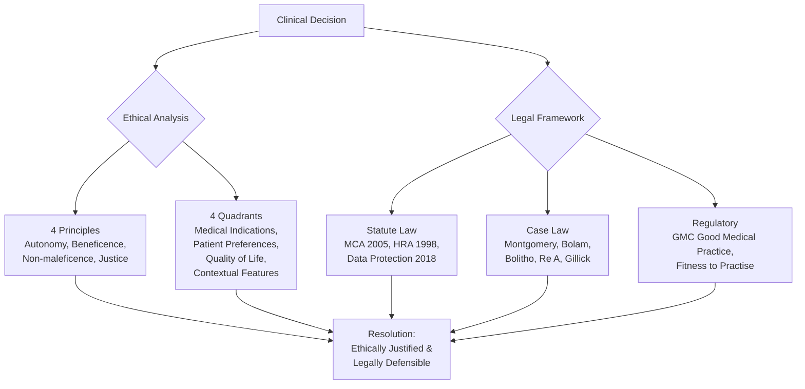
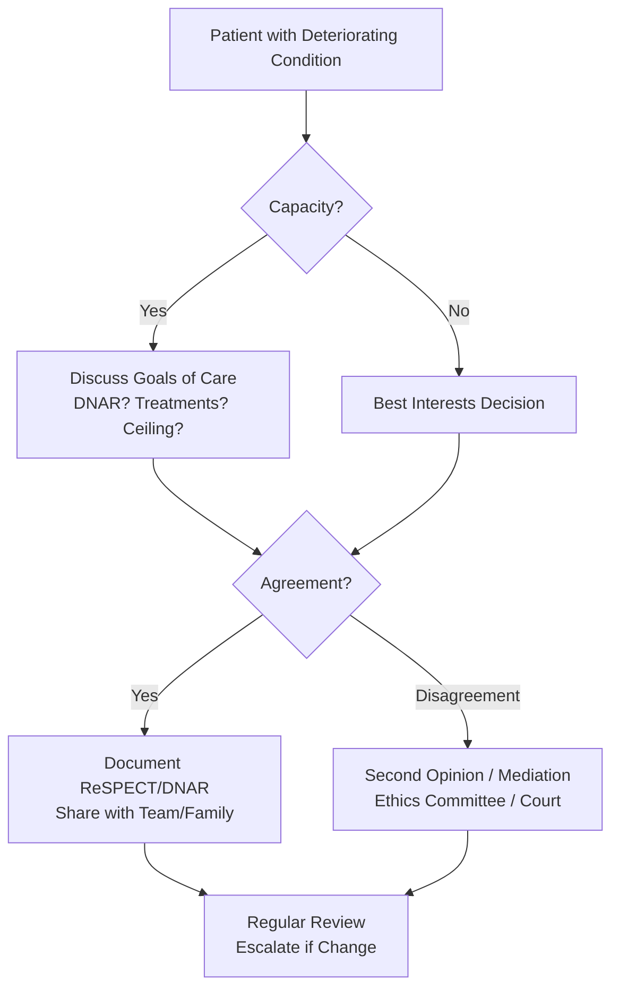
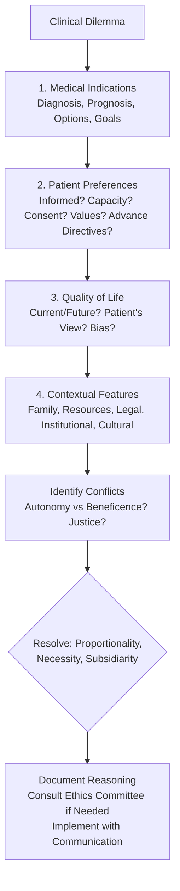
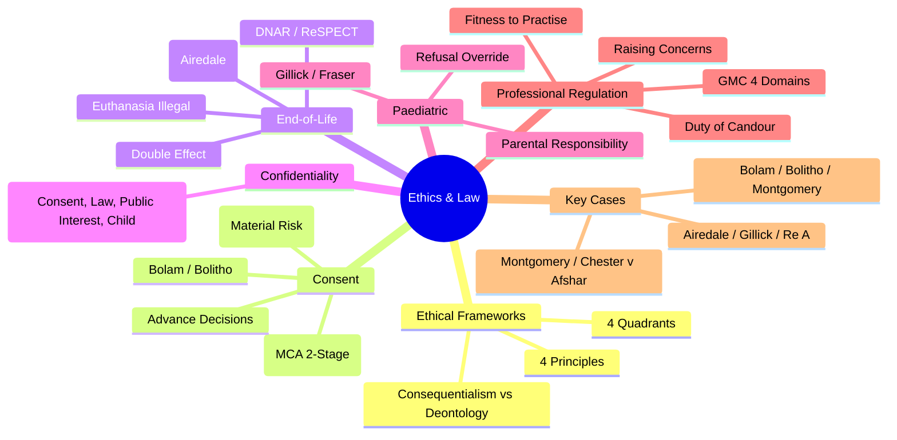

# 1.4 Ethics & Law

**Parent Topic:** [Clinical Decision-Making MOC](../Clinical%20Decision-Making%20MOC.md) → [Chapter 1 Hierarchy](../Davidson%20Chapter%201%20-%20Clinical%20Decision-Making%20Hierarchy.md)  
**Status:** `full-fcps-mrcp-note`  
**Priority:** ⭐⭐⭐ HIGHEST (FCPS/MRCP — Ethical frameworks, UK Law, End-of-life, Consent, Confidentiality, Negligence)  
**Source:** Davidson 24th Ed Ch 1; GMC "Good Medical Practice"; BMA Ethics; UK Legislation (MCA 2005, Human Rights Act 1998, Data Protection Act 2018); Key Cases (Montgomery, Bolam, Bolitho, Re A, Airedale, Gillick)

---

## 1. 🎯 Learning Objectives
- [ ] Apply **ethical frameworks**: 4 Principles (Beauchamp & Childress), 4 Quadrants (Jonsen), Consequentialism vs Deontology
- [ ] Navigate **UK medical law**: Consent (Montgomery), Capacity (MCA 2005), Negligence (Bolam/Bolitho), Confidentiality, End-of-life
- [ ] Resolve **ethical dilemmas**: End-of-life (DNAR, Withdrawal), Resource allocation, Organ donation, Genetics, Research ethics
- [ ] Understand **professional regulation**: GMC "Good Medical Practice", Fitness to practise, Duty of candour, Raising concerns
- [ ] Apply **paediatric consent**: Gillick competence, Fraser guidelines, Parental responsibility
- [ ] Answer viva: "Montgomery vs Bolam" and "DNAR decision framework" and "Confidentiality exceptions"

---

## 2. 🧠 Core Concept: Ethics & Law in Clinical Practice



> **Key:** *Ethics asks "What *should* we do?" Law asks "What *must* we do?" Good practice aligns both.*

---

## 3. ️⃣ Ethical Frameworks

### Four Principles (Beauchamp & Childress)

| Principle | Definition | Clinical Application |
|-----------|------------|----------------------|
| **Autonomy** | Respect patient's right to self-determination | Informed consent, Advance decisions, Confidentiality, Truth-telling |
| **Beneficence** | Act in patient's best interest | Provide effective treatment, Prevent harm, Promote wellbeing |
| **Non-maleficence** | "First, do no harm" | Avoid unnecessary risk, Side-effect minimisation, Error prevention |
| **Justice** | Fair distribution of benefits/burdens | Resource allocation, Triage, Non-discrimination, Access to care |

> **Conflict Resolution:** *No hierarchy. Use **proportionality** (benefit vs harm), **necessity** (least restrictive), **subsidiarity** (decide at lowest appropriate level).*

### Four Quadrants Approach (Jonsen et al.)

| Quadrant | Key Questions |
|----------|---------------|
| **1. Medical Indications** | What is the problem? Diagnosis, Prognosis, Treatment options, Benefits/Harms, Goals of care |
| **2. Patient Preferences** | Has patient been informed? Understands? Consents? Values? Goals? Advance directives? |
| **3. Quality of Life** | Current/future QoL? Patient's view of acceptable QoL? Bias in assessment? |
| **4. Contextual Features** | Family/social? Financial? Legal? Institutional? Religious/cultural? Resource allocation? |

> **Use:** *Systematic case analysis → Identify conflicts → Weigh principles in context.*

### Other Ethical Theories
| Theory | Core Idea | Limitation |
|--------|-----------|------------|
| **Consequentialism / Utilitarianism** | Maximise overall good (greatest happiness) | Ignores individual rights; "ends justify means" |
| **Deontology** | Duties/rules (Kant: categorical imperative) | Rigid; conflicts between duties |
| **Virtue Ethics** | Character of moral agent (phronesis/practical wisdom) | Vague; culturally relative |
| **Principlism** (Predominant in medicine) | Balance 4 principles in context | Requires judgement; no algorithm |

---

## 4. ️⃣ Key Ethical Dilemmas in Clinical Practice

### End-of-Life Decisions

| Issue | Ethical/Legal Framework |
|-------|-------------------------|
| **DNAR (Do Not Attempt Resuscitation)** | Not a "treatment decision" per se — clinical judgment on futility. Must discuss with patient/family (unless harm). Document on ReSPECT/NHS form. Not legally binding on other clinicians but strong guidance. |
| **Withholding vs Withdrawing Treatment** | **Legally & ethically equivalent** (Airedale v Bland). Both require best interests assessment. Withdrawing often harder psychologically. |
| **Artificial Nutrition & Hydration (ANH)** | Considered medical treatment (Airedale). Can be withheld/withdrawn if not in best interests. |
| **Advance Decisions (ADRT)** | Legally binding refusal if valid (MCA 2005). Must be "clear, specific, applicable". "Even if life at risk" for life-sustaining. |
| **Euthanasia / Assisted Dying** | **Illegal in UK** (Suicide Act 1961, Murder Act). Distinct from withdrawing treatment. Double effect doctrine: palliative sedation with intent to relieve suffering. |

### End-of-Life Decision Framework (ReSPECT / GMC)



### Resource Allocation (Distributive Justice)

| Principle | Application |
|-----------|-------------|
| **Utilitarian** | Maximise QALYs (NICE ICER £20-30k/QALY) |
| **Egalitarian** | Equal access regardless of outcome |
| **Prioritarian** | Priority to worst off (Rule of Rescue) |
| **Clinical Need** | NHS: "Comprehensive service free at point of use based on clinical need" |
| **Rationing** | Explicit (NICE) vs Implicit (clinician bedside) |

> **NICE = Explicit rationing** — Evidence-based, Transparent, Appealable.

### Organ Donation

| Type | Consent Model |
|------|---------------|
| **Deceased Donation** | **Opt-out (England/Wales)** — Deemed consent unless opted out (Organ Donation Act 2019/2023). Family consulted. |
| **Living Donation** | Informed consent, Independent assessment, No coercion, Long-term follow-up |
| **DCD (Donation after Circulatory Death)** | Controlled (planned withdrawal) vs Uncontrolled. 5-min hands-off period. |

### Genetics & Genomics

| Issue | Key Points |
|-------|------------|
| **Predictive Testing** | Autonomy (right to know / not know), Non-directive counselling, Family implications |
| **Incidental Findings** | ACMG actionable genes list; Duty to warn? Patient preference? |
| **Prenatal / Preimplantation** | Eugenics concerns, Disability rights, Reproductive autonomy |
| **Data Sharing** | GDPR, Familial implications, Insurance discrimination (Moratorium UK) |

---

## 5. ️⃣ UK Medical Law — Key Statutes & Cases

### Consent Law Evolution

| Case | Principle |
|------|-----------|
| **Bolam (1957)** | "Responsible body of medical opinion" — Doctor not negligent if acts per accepted practice |
| **Bolitho (1997)** | Court can reject medical opinion if **not logical** / **not defensible** |
| **Sidaway (1985)** | Doctor decides what risks to disclose ("prudent patient") |
| **Chester v Afshar (2004)** | Failure to warn = Breach of duty (causation presumed for non-disclosure) |
| **Montgomery v Lanarkshire (2015)** | **Landmark**: **Patient-centred** — Must disclose **material risks** (reasonable person test) + **Reasonable alternatives** |

### Montgomery Test (2015) — 2-Limb Test

| Limb | Test |
|------|------|
| **1. Material Risk** | Would a **reasonable person** in patient's position attach significance? OR Doctor **reasonably aware** patient would attach significance? |
| **2. Alternatives** | Must discuss **reasonable alternative treatments** (including no treatment) |

> **Post-Montgomery:** No longer "What would reasonable doctor disclose?" → **"What would reasonable patient want to know?" + "What does THIS patient want to know?"**

### Negligence — 4 Elements (Tort Law)

| Element | Requirement |
|---------|-------------|
| **Duty of Care** | Doctor-patient relationship established |
| **Breach of Duty** | Below standard of reasonable competent practitioner (Bolam/Bolitho) |
| **Causation** | "But for" breach → harm (Factual) + Legal causation (foreseeability) |
| **Damage** | Recognisable harm (Physical, Psychiatric, Financial) |

### Confidentiality — Legal Basis & Exceptions

| Legal Basis | Source |
|-------------|--------|
| **Common Law** | Duty of confidence (implied) |
| **Statute** | Data Protection Act 2018 / UK GDPR, Human Rights Act 1998 (Art 8) |
| **Contract** | Implied term in doctor-patient contract |

| Exception | Legal Basis | Example |
|-----------|-------------|---------|
| **Patient Consent** | Explicit/Implied | Referral, Insurance report |
| **Legal Obligation** | Statute | Notifiable diseases (Public Health Act), Court order, Coroner |
| **Public Interest** | Common Law / Statute | **Risk of serious harm to others** (W v Egdell), Terrorism, Road safety (DVLA) |
| **Child Protection** | Children Act 1989/2004 | Safeguarding override |
| **Anonymised Data** | GDPR (Recital 26) | Research, Audit (if truly anonymised) |

> **Child Protection:** "Welfare of child is paramount" (Children Act 1989). Information sharing without consent if risk of significant harm.

### Mental Capacity Act 2005 — Key Provisions

| Provision | Summary |
|-----------|---------|
| **s.1 Principles** | Presume capacity; Support decisions; Unwise ≠ lack capacity; Best interests; Least restrictive |
| **s.2-3 Definition** | Impairment + Functional inability (Understand, Retain, Weigh, Communicate) |
| **s.4 Best Interests** | Checklist (Past wishes, Beliefs, Consult, No discrimination, Least restrictive) |
| **s.5-6 Protection from Liability** | Acts in best interests + Reasonable belief of incapacity = Protected |
| **s.9-14 LPA** | Property/Finance & Health/Welfare (Registered OPG) |
| **s.24-26 ADRT** | Advance Decision to Refuse Treatment (Valid, Applicable, Life-sustaining = written/signed/witnessed) |
| **s.35-41 IMCA** | Serious treatment / Accommodation change + No family/friends |
| **s.4A DoLS** | Deprivation of Liberty Safeguards (Care homes/hospitals) |

### Human Rights Act 1998 — Relevant Articles

| Article | Clinical Relevance |
|---------|-------------------|
| **Art 2: Right to Life** | DNAR decisions, Withdrawal of treatment, Suicide prevention |
| **Art 3: Freedom from Inhuman/Degrading Treatment** | Pain relief, Dignity, Restraint, DoLS |
| **Art 5: Right to Liberty** | Detention (MHA), DoLS, Physical restraint |
| **Art 8: Right to Private/Family Life** | Confidentiality, Medical records, Family decisions, Genetic info |
| **Art 9: Freedom of Thought/Conscience/Religion** | Refusal of treatment (Blood products), Conscientious objection |

---

## 6. ️⃣ Paediatric Consent — Gillick & Fraser

| Concept | Details |
|---------|---------|
| **Gillick Competence** | Child <16 **can** consent if "sufficient understanding and intelligence to enable them to understand fully what is proposed" (Gillick v West Norfolk 1985). |
| **Fraser Guidelines** | Specifically for **contraceptive/sexual health advice** to <16 without parental consent: 1) Understands advice, 2) Cannot be persuaded to inform parents, 3) Likely to have sex anyway, 4) Health suffers without treatment, 5) Best interests. |
| **Parental Responsibility** | Mother (auto), Father (married/registered/court order), Others via court. Both parents can consent for <16. |
| **Refusal by Gillick-competent Child** | Can consent but **cannot refuse** life-saving treatment (Re R 1991). Court can override. |
| **16-17 Year Olds** | Presumed capacity (Family Law Reform Act 1969). Can consent. **Cannot refuse** life-saving (can be overridden by court/parent). |

---

## 7. ️⃣ Professional Regulation — GMC & Fitness to Practise

### GMC Good Medical Practice (2024) — 4 Domains

| Domain | Key Standards |
|--------|---------------|
| **1. Knowledge, Skills & Performance** | Develop/maintain competence, Work within limits, Record keeping, CPD |
| **2. Safety & Quality** | Patient safety, Raise concerns, Risk management, Infection control |
| **3. Communication, Partnership & Teamwork** | Communication, Consent, Teamwork, Leadership, Teaching |
| **4. Maintaining Trust** | Honesty, Integrity, Confidentiality, Probity, Personal conduct |

### Fitness to Practise — Process

| Stage | Action |
|-------|--------|
| **Concern Raised** | Employer, Patient, Police, Self-referral |
| **Triage** | GMC assesses if meets threshold |
| **Investigation** | Evidence gathering, Health assessment, Language test |
| **Case Examiners** | Decide: No case / Undertakings / Warnings / Refer to MPTS |
| **MPTS (Tribunal)** | Hearings (public/private), Evidence, Witnesses |
| **Outcomes** | Erasure, Suspension, Conditions, Warning, No action |
| **Appeal** | High Court (England/Wales) / Court of Session (Scotland) |

### Duty of Candour (Statutory — Health & Social Care Act 2008 Reg 20)

| Trigger | Action |
|---------|--------|
| **Notifiable Safety Incident** | Unintended/unexpected: Death, Severe harm, Moderate harm, Prolonged psychological harm |
| **Organisational Duty** | Tell patient (in person + writing), Apologise, Explain, Support, Record |
| **Professional Duty** | Same + Report to regulator if required |

> **Candour ≠ Admission of Liability.** Apology = "I'm sorry this happened" (not "I'm sorry I was negligent").

### Raising Concerns (Whistleblowing)

| Protection | Source |
|------------|--------|
| **Public Interest Disclosure Act 1998 (PIDA)** | Protected disclosure if: Public interest, Reasonable belief, Made to prescribed person (GMC, CQC, NHS, etc.) |
| **GMC Duty** | "Must take prompt action if patient safety at risk" (GMP Domain 2) |
| **Process** | Local → Regulator → Public (last resort). Anonymous not ideal (harder to investigate). |

---

## 8. ️⃣ Practical Decision Frameworks

### Ethical Decision-Making (4-Quadrant Checklist)



### Consent Conversation Checklist (Montgomery-Compliant)
- [ ] Diagnosis & Prognosis (plain language)
- [ ] Nature & Purpose of proposed treatment
- [ ] **Material Risks** (Common + Serious + Patient-specific)
- [ ] **Reasonable Alternatives** (including No Treatment)
- [ ] **Patient-specific Concerns** ("What matters to you?")
- [ ] **Understanding Checked** (Teach-back: "In your own words...")
- [ ] **Voluntariness** (No coercion, Time given)
- [ ] **Documentation** (Signed form + Detailed notes)

### Capacity Assessment Script (MCA 2005)
```
"I need to check you can make this decision about [treatment].
1. Can you tell me what [treatment] involves and why it's recommended? (Understand)
2. Can you remember what we discussed for a few minutes? (Retain)
3. Can you tell me the pros and cons, and why you'd choose or not choose it? (Use/Weigh)
4. Can you tell me your decision? (Communicate)
If any NO → Lacks capacity for THIS decision → Best Interests."
```

---

## 9. ⚡ FCPS/MRCP High-Yield Summary

| Topic | Key Points |
|-------|------------|
| **Ethical Principles** | Autonomy, Beneficence, Non-maleficence, Justice. Quadrants: Medical, Preferences, QoL, Context. |
| **Consent (Montgomery)** | **Material risk** (reasonable patient test) + **Reasonable alternatives**. Patient-centred. Document discussion. |
| **Capacity (MCA 2005)** | 2-stage: 1) Impairment, 2) Functional (Understand, Retain, Use/Weigh, Communicate). Decision-specific. |
| **Best Interests** | Past wishes, Beliefs, Consult, No discrimination, Least restrictive. IMCA if no family + serious decision. |
| **Advance Decisions** | Binding refusal (written, signed, witnessed, "even if life at risk" for life-sustaining). |
| **DNAR / End-of-life** | Clinical judgment on futility. Discuss with patient/family. ReSPECT form. Not legally binding but strong guidance. |
| **Confidentiality Exceptions** | Consent, Legal obligation (notifiable diseases, court), Public interest (serious harm to others), Child protection. |
| **Negligence** | Duty → Breach (Bolam/Bolitho) → Causation → Damage. Bolitho = Court can reject illogical medical opinion. |
| **Child Consent** | Gillick <16 = competent if understands. Fraser = Contraception <16. <16 cannot refuse life-saving. 16-17 = presume capacity but can refuse life-saving. |
| **GMC Domains** | 1. Knowledge/Skills, 2. Safety/Quality, 3. Communication/Teamwork, 4. Trust. |
| **Duty of Candour** | Notifiable incident → Tell patient (in person + writing), Apologise, Explain, Support, Record. |
| **Key Cases** | Montgomery (Material risk), Bolam/Bolitho (Negligence std), Gillick (Child competence), Airedale (Withdrawal = Withholding), Re A (Conjoined twins). |

---

## 10. 🎤 Viva Questions (Expected Answers)

| # | Question | Expected Answer |
|---|----------|-----------------|
| 1 | What are the 4 principles of medical ethics? | Autonomy, Beneficence, Non-maleficence, Justice. |
| 2 | What changed with Montgomery v Lanarkshire? | Shift from **Bolam (doctor-centric: "responsible body of opinion")** to **Montgomery (patient-centric: "reasonable patient test")** — Must disclose material risks + reasonable alternatives. |
| 3 | What is the Bolam test? | Doctor not negligent if acts in accordance with practice accepted as proper by responsible body of medical opinion. |
| 4 | What did Bolitho add? | Court can reject medical opinion if **not logical** or **not defensible** — not absolute deference. |
| 4 | Mental Capacity Act — 2-stage test? | Stage 1: Impairment of mind/brain? Stage 2: Functional — Can: a) Understand, b) Retain, c) Use/Weigh, d) Communicate? Decision-specific. |
| 5 | What makes an Advance Decision valid? | Written, Signed, Witnessed, "Even if life at risk" for life-sustaining treatment, Applicable to current situation. |
| 5 | When is IMCA required? | Serious medical treatment OR long-term accommodation change + **No family/friends** to consult. |
| 6 | DoLS — when does it apply? | Continuous supervision/control + Not free to leave + Lacks capacity → Requires authorisation. |
| 6 | Gillick competence — what does it mean? | Child <16 **can** consent if "sufficient understanding and intelligence to understand fully what is proposed". |
| 7 | Confidentiality — when can you disclose without consent? | Patient consent, Legal obligation (notifiable diseases, court), **Public interest (serious harm to others)**, Child protection. |
| 8 | Duty of Candour — what triggers it? | Notifiable safety incident: Unintended/unexpected Death, Severe harm, Moderate harm, Prolonged psychological harm. |
| 9 | What are the 4 domains of GMC Good Medical Practice? | 1. Knowledge/Skills/Performance, 2. Safety/Quality, 3. Communication/Teamwork, 4. Maintaining Trust. |
| 10 | What is the difference between withholding and withdrawing treatment? | **Legally & ethically equivalent** (Airedale v Bland). Both require best interests assessment. |

---

## 11. 🧩 Confusions & Mnemonics

| Confusion | Clarification |
|-----------|---------------|
| **"Bolam = Doctor can do whatever peers do"** | **NO.** Bolitho: Court can reject if **not logical/defensible**. Standard must withstand scrutiny. |
| **"Montgomery = Tell patient EVERY risk"** | **NO.** Only **material risks** (reasonable patient test + doctor's knowledge of patient). |
| **"If patient lacks capacity, family decides"** | **NO.** Family **consulted** but **clinician decides best interests** (or Court/LPA). IMCA if no family. |
| **"Advance Decision = Advance Statement"** | **NO.** Advance Decision = **Binding refusal** (specific treatment). Advance Statement = **Preferences** (guiding only). |
| **"Gillick = Child can refuse treatment"** | **NO.** Gillick = Can **consent**. **Cannot refuse** life-saving (court can override). |
| **"16-17 year olds = Full adult capacity"** | **NO.** Presumed capacity but **cannot refuse life-saving** treatment (court can override). |
| **"Duty of Candour = Admit negligence"** | **NO.** "I'm sorry this happened" ≠ "I was negligent." Apology ≠ Legal admission. |
| **"Next of kin has legal authority"** | **NO.** Next of kin = **Consultee** (best interests). Legal authority = **LPA / Court of Protection**. |
| **"DNAR = Do Not Treat"** | **NO.** DNAR = **No CPR only**. All other treatment continues. Must communicate clearly. |
| **"Bolam is dead after Montgomery"** | **NO.** Bolam still applies to **clinical judgment** (diagnosis, treatment choice). Montgomery = **Consent/disclosure** only. |

> **Mnemonic: ETHICS LAW UK CASES**  
> **E**thical Principles: **Autonomy, Beneficence, Non-maleficence, Justice** (Beauchamp & Childress)  
> **T**reatment Decisions: **4 Quadrants** (Medical, Preferences, QoL, Context) — Jonsen  
> **H**uman Rights Act: **Art 2 (Life), 3 (Degrading), 5 (Liberty), 8 (Privacy), 9 (Religion)**  
> **I**nformed Consent: **Montgomery** (Material Risk + Alternatives) → **Bolam/Bolitho** (Negligence)  
> **C**apacity: **MCA 2-Stage** → **Impairment → Functional (Understand, Retain, Weigh, Communicate)**  
> **S** Best Interests: **Past Wishes, Beliefs, Consult, No Discrimination, Least Restrictive**  
> **L**aw Cases: **Bolam (Peer), Bolitho (Logic), Montgomery (Patient), Airedale (Withdraw=Withhold), Gillick (Child), Re A (Conjoined)**  
> **A**dvance Decisions: **Binding Refusal** (Written, Signed, Witnessed, "Even if Life at Risk")  
> **W**elfare of Child: **Paramount** (Children Act) — **Gillick** (Consent <16) / **Fraser** (Contraception)  
> **C**onfidentiality Exceptions: **Consent, Legal Obligation, Public Interest (Harm to Others), Child Protection**  
> **A**dvance Decision vs Statement: **Binding Refusal** vs **Guiding Preferences**  
> **N**egligence: **Duty → Breach (Bolam/Bolitho) → Causation → Damage**  
> **D**uty of Candour: **Notifiable Incident → Tell + Apologise + Explain + Support + Record** (Statutory)  
> **O**PGA: **LPA (Health/Welfare + Property/Finance)** — Registered, Decides if Incapacity  
> **U**nwise ≠ Lack Capacity: **Respect Autonomy** — Capacity = Functional, Decision-Specific  
> **R**efusal <16: **Cannot Refuse Life-Saving** (Court Overrides) — 16-17 Also Cannot Refuse Life-Saving  
> **E**nd-of-Life: **DNAR = No CPR Only** — Clinical Futility + Discussion + ReSPECT — Withhold=Withdraw (Airedale)  
> **G**MC 4 Domains: **Knowledge/Skills, Safety/Quality, Communication/Teamwork, Trust**  
> **A**ssisted Dying: **Illegal UK** — Double Effect (Palliative Sedation Intent = Relief)  
> **S**ocial Justice: **NICE ICER £20-30k/QALY** — Explicit Rationing — Equity vs Utility  

---

## 12. 🗺️ Mind Map



---

## 13. 📅 Spaced Repetition Tracker

| Review | Date | Score (0–5) | Notes |
|--------|------|-------------|-------|
| Day 1 | | | |
| Day 3 | | | |
| Day 7 | | | |
| Day 14 | | | |
| Day 30 | | | |
| Day 90 | | | |

---

## 14. 📝 Self-Test Scorecard

| Section | Max | Score | % |
|---------|-----|-------|---|
| Ethical Principles & Frameworks | 3 | | |
| Consent Law (Montgomery, Bolam) | 3 | | |
| Capacity & MCA 2005 | 3 | | |
| End-of-Life / DNAR / Advance Decisions | 3 | | |
| Confidentiality & Exceptions | 2 | | |
| Paediatric Consent (Gillick/Fraser) | 2 | | |
| Professional Regulation (GMC, Candour) | 2 | | |
| Key Cases (Bolam, Montgomery, Airedale, Gillick) | 2 | | |
| **Total** | **20** | | |

---

## 15. 💬 Exam Answer Modes

| Format | Prompt | Key Points |
|--------|--------|------------|
| **Long Essay** | "Discuss the legal and ethical framework for consent in UK medical practice." | Montgomery (material risk + alternatives), Bolam/Bolitho (negligence standard), MCA 2005 (2-stage capacity), Advance decisions, Paediatric (Gillick), Exceptions (emergency, public interest) |
| **Short Note** | "Mental Capacity Act 2005 — Best interests and IMCA." | 2-stage test → If lacks capacity → Best interests checklist (past wishes, beliefs, consult, least restrictive). IMCA if serious treatment + no family. DoLS for deprivation. |
| **Viva** | "Patient with capacity refuses life-saving treatment. Family wants treatment. What do you do?" | Respect autonomy (capacity = right to refuse). Best interests only if lacks capacity. Explore reasons, Address fears, Document. No court override if capacity intact. |
| **Ward Round** | "Junior doctor asks: 'Do I need to tell patient about 1% risk of stroke from this procedure?'" | **Yes — Montgomery.** Material risk = reasonable person would want to know + patient-specific factors. Must discuss alternatives. Document. |
| **Last-Night** | "4 Principles: Auto/Benefic/Non-malef/Justice. Montgomery: Material risk + Alternatives. Bolam/Bolitho. MCA: Impair→Func(U/R/W/C). AD=Binding refusal. DNAR=No CPR only. Confidentiality: Consent/Law/Public Interest/Child. Gillick<16 consent, no refuse life. DoLS: Continuous supervision. Candour: Tell+Apologise." | All key frameworks compressed. |

---

## 16. 📌 Summary
- **Ethical Principles**: Autonomy, Beneficence, Non-maleficence, Justice. 4-Quadrant analysis for complex cases.
- **Consent (Montgomery)**: **Material risk** (reasonable patient test) + **Reasonable alternatives**. Shift from doctor-centric (Bolam) to patient-centric.
- **Capacity (MCA 2005)**: 2-Stage — 1) Impairment, 2) Functional (Understand, Retain, Use/Weigh, Communicate). **Decision-specific, time-specific**.
- **Best Interests**: Past wishes, Beliefs, Consult, No discrimination, Least restrictive. **IMCA** if serious decision + no family.
- **Advance Decisions**: **Legally binding refusal** (written, signed, witnessed, "even if life at risk" for life-sustaining).
- **End-of-Life**: DNAR = No CPR only (clinical futility + discussion). Withhold = Withdraw (Airedale). Double effect for palliative sedation.
- **Confidentiality**: Exceptions = Consent, Legal obligation, **Public interest (serious harm)**, Child protection.
- **Paediatrics**: Gillick <16 = Consent if competent. **Cannot refuse life-saving**. 16-17 = Presumed capacity but **cannot refuse life-saving**.
- **Professional Regulation**: GMC 4 Domains. **Duty of Candour** = Statutory (notifiable incident → Tell, Apologise, Explain, Support, Record).
- **Key Cases**: **Bolam** (peer standard), **Bolitho** (logic test), **Montgomery** (material risk), **Airedale** (withdraw=withhold), **Gillick** (child competence), **Re A** (best interests conjoined twins).

---

## 17. ❓ MCQs (10)

1. **Montgomery v Lanarkshire — key change:**  
   A. Doctor decides risks to disclose  B. **Patient-centred: reasonable person test**  C. No consent needed for minor procedures  D. Verbal consent sufficient  
   *Answer: B. Shift from Bolam (doctor-centric) to Montgomery (patient-centric).*

2. **MCA 2005 — Stage 1 assesses:**  
   A. Functional abilities  B. **Impairment of mind/brain**  C. Best interests  D. Past wishes  
   *Answer: B. Stage 1: Impairment. Stage 2: Functional (Understand, Retain, Weigh, Communicate).*

3. **Advance Decision — valid for life-sustaining treatment requires:**  
   A. Verbal statement  B. **Written, signed, witnessed, "even if life at risk"**  C. Doctor countersignature  D. Court approval  
   *Answer: B. Strict formalities for life-sustaining refusal.*

4. **Gillick competence applies to:**  
   A. Children <16 consenting to treatment  B. **Children <16 refusing life-saving treatment**  C. Adults with learning disability  D. Adolescents 16-17  
   *Answer: A. Gillick = Child <16 **consenting** if understands. **Cannot refuse life-saving**.*

5. **IMCA required when:**  
   A. Any treatment  B. **Serious medical treatment + No family/friends**  C. Patient requests  D. Mental Health Act used  
   *Answer: B. Serious treatment OR accommodation change + No appropriate consultee.*

6. **Confidentiality — disclosure without consent allowed for:**  
   A. Patient's employer  B. **Public interest (serious harm to others)**  C. Insurance company  D. Research without ethics approval  
   *Answer: B. Public interest (W v Egdell) — serious harm to others. Also: Legal obligation, Child protection, Consent.*

7. **Bolam test — standard of care:**  
   A. Reasonable patient  B. **Responsible body of medical opinion**  C. NICE guidelines  D. Hospital protocol  
   *Answer: B. Doctor not negligent if acts per responsible body of medical opinion. Bolitho: Court can reject if illogical.*

8. **Duty of Candour — statutory trigger:**  
   A. Any complaint  B. **Notifiable safety incident (Death, Severe/Moderate harm, Prolonged psychological harm)**  C. Any error  C. Patient request  
   *Answer: B. Notifiable safety incident = Unintended/unexpected Death, Severe harm, Moderate harm, Prolonged psychological harm.*

9. **DNAR — legally binding?**  
   A. Yes, on all clinicians  B. **No, clinical guidance only**  C. Only if patient signs  D. Only if court orders  
   *Answer: B. DNAR = Clinical judgment (futility) + Discussion. Not legally binding but strong guidance. ReSPECT form for broader goals.*

10. **Withholding vs Withdrawing treatment — legal status:**  
    A. Withdrawing = Murder  B. **Equivalent (Airedale v Bland)**  C. Withholding = Negligence  D. Different standards  
    *Answer: B. **Legally and ethically equivalent** (Airedale v Bland). Both require best interests.*

---

## 18. 📋 SBAs (10)

1. **70F with advanced dementia, severe pneumonia. No advance decision. Daughter demands "everything". Best approach?**  
   A. Treat against wishes  B. **Capacity assessment → Best interests (consult daughter, past wishes)**  C. Daughter decides  D. Palliative only  
   *Answer: B. Assess capacity for THIS decision. If lacks → Best interests (consult daughter, past wishes, beliefs, least restrictive).*

2. **15F requests contraception. Does not want parents informed. Fraser guidelines — which is NOT a criterion?**  
   A. Understands advice  B. Cannot persuade to tell parents  C. **Parents must consent**  D. Health suffers without treatment  
   *Answer: C. Fraser: 1) Understands, 2) Cannot persuade to tell parents, 3) Likely to have sex anyway, 4) Health suffers without, 5) Best interests. Parental consent NOT required.*

3. **Doctor accidentally administers 10x insulin dose. Patient hypoglycaemic but recovers. Candour?**  
   A. No (no permanent harm)  B. **Yes (Moderate harm = Notifiable)**  C. Only if patient asks  D. Only if complaint  
   *Answer: B. Moderate harm (significant but not permanent) = Notifiable under statutory duty.*

4. **DNAR decision for 85M with metastatic cancer, admitted with sepsis. Who makes decision?**  
   A. Family  B. **Senior Clinician (Clinical judgment on futility)**  C. Patient (if capacity)  D. Court  
   *Answer: C. If capacity → Patient decides (with info). If lacks → Clinical team decides (clinical judgment, best interests). Family consulted, not deciding.*

5. **Montgomery — "Material risk" definition:**  
   A. Risk >1%  B. **Risk reasonable patient would attach significance + Risk doctor knows patient would**  C. Risk >5%  D. Only life-threatening risks  
   *Answer: B. Subjective (patient-specific) + Objective (reasonable person) test.*

---

## 19. 🔑 Answer Keys
| MCQs | SBAs |
|------|------|
| 1-B, 2-B, 3-B, 4-A, 5-B, 6-B, 7-B, 8-B, 9-B, 10-B | 1-B, 2-C, 3-B, 4-C, 5-B |

---

## 20. 🔗 Cross-Links
- [[1.3 Communication Skills]] — SPIKES, Shared decision-making, Consent conversation, Capacity assessment
- [[1.1 Clinical Reasoning]] — Diagnostic process, Shared decision-making, Diagnostic uncertainty
- [[1.2 Evidence-Based Medicine]] — Risk communication (ARR/NNT), Decision aids, GRADE
- [[1.5 Quality Improvement & Patient Safety]] — Duty of candour, Incident reporting, Clinical governance
- [[1.6 Guidelines & Pathways]] — Ethical implementation, Resource allocation, NICE
- [../../Palliative Care/Ethics] — End-of-life decisions, ReSPECT, DNAR, Advance care planning
- [../../Paediatric/Ethics] — Gillick, Fraser, Consent in children
- [../../Medication Safety/Ethics] — Consent for high-risk drugs, Off-label use, Clinical trials
