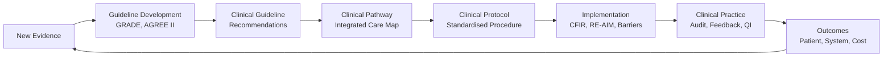
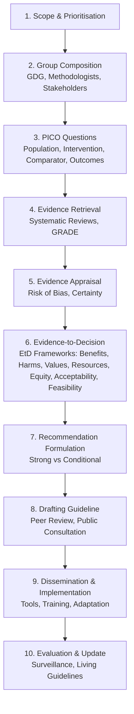

# 1.6 Guidelines, Pathways & Protocols

**Parent Topic:** [Clinical Decision-Making MOC](../Clinical%20Decision-Making%20MOC.md) → [Chapter 1 Hierarchy](../Davidson%20Chapter%201%20-%20Clinical%20Decision-Making%20Hierarchy.md)  
**Status:** `full-fcps-mrcp-note`  
**Priority:** ⭐⭐⭐ HIGHEST (FCPS/MRCP — Guideline appraisal, Implementation, Clinical pathways, Protocol development, NICE)  
**Source:** Davidson 24th Ed Ch 1; AGREE II; WHO Handbook; NICE Process; GRADE; Cochrane; Implementation Science (CFIR, RE-AIM); Cochrane Effective Practice and Organisation of Care (EPOC)

---

## 1. 🎯 Learning Objectives
- [ ] Appraise **clinical guidelines** using **AGREE II** (6 domains, 23 items)
- [ ] Understand **guideline development process**: WHO, NICE, SIGN, ESC, GRADE methodology
- [ ] Distinguish **guidelines, pathways, protocols, bundles** — definitions and uses
- [ ] Design **clinical pathways**: Integrated care, Variance tracking, Discharge planning
- [ ] Develop **clinical protocols**: Standardisation, Local adaptation, Version control
- [ ] Apply **implementation science**: CFIR, RE-AIM, Normalisation Process Theory, BARRIERS
- [ ] Evaluate **guideline impact**: QI methods, Audit, Feedback, Sustainability
- [ ] Answer viva: "AGREE II domains" and "Guideline development steps" and "CFIR domains"

---

## 2. 🧠 Core Concept: From Evidence to Practice



> **Hierarchy:** *Guideline (What) → Pathway (When/Who/Where) → Protocol (How) → Implementation (Fidelity) → Audit (Compliance) → Outcomes*

---

## 3. ️⃣ Guideline Appraisal — AGREE II (Gold Standard)

### AGREE II Instrument — 23 Items, 6 Domains

| Domain | Items | Key Content |
|--------|-------|-------------|
| **1. Scope & Purpose** (3) | 1-3 | Objectives, Health questions, Target population |
| **2. Stakeholder Involvement** (4) | 4-7 | Professional groups, Patient/public, Target users |
| **3. Rigour of Development** (8) | 8-15 | Search strategy, Evidence selection, Criteria, Methods, Evidence→Rec link, External review, Update plan |
| **4. Clarity of Presentation** (3) | 16-18 | Specific recommendations, Options, Key recs identifiable |
| **5. Applicability** (4) | 19-22 | Barriers/Facilitators, Implementation tools, Resource implications, Monitoring/Audit criteria |
| **6. Editorial Independence** (2) | 22-23 | Funding body influence, Competing interests recorded |

### AGREE II Scoring
- Each item scored 1 (Strongly Disagree) to 7 (Strongly Agree)
- **Domain Score** = (Sum of item scores - Minimum possible) / (Maximum possible - Minimum) × 100%
- **Overall Assessment**: "Would you recommend this guideline?" (Yes/No with modifications)

### Critical Appraisal Questions (Rapid AGREE)
- [ ] Are the **recommendations clear, specific, actionable**?
- [ ] Was there a **systematic evidence search**?
- [ ] Are **evidence-to-recommendation links explicit**?
- [ ] Were **patients/public involved**?
- [ ] Are **conflicts of interest declared**?
- [ ] Is there an **update plan**?
- [ ] Are **barriers to implementation addressed**?
- [ ] Is it **independent of funding bias**?

---

## 4. ️⃣ Guideline Development Process

### WHO Guideline Development (WHO Handbook)



### NICE Guideline Process (UK)
1. **Topic Selection** (DHSC referral, Stakeholder nomination)
2. **Scope Development** (Stakeholder workshop, Define inclusion/exclusion)
3. **Evidence Review** (Systematic reviews, Economic modelling if cost-effective)
4. **Committee Deliberation** (Evidence review + Expert testimony + Patient testimony)
5. **Draft Guidance** → **Consultation** (4 weeks, Stakeholder comments)
6. **Final Guidance** → **Publication** (NICE website, Pathways, Tools)
7. **Implementation Support** (Baseline assessment, Costing, Audit standards, E-learning)
8. **Surveillance & Update** (Scheduled / Exceptional)

### GRADE in Guidelines
- **Evidence Certainty** → Recommendation Strength
- **Evidence-to-Decision (EtD) Frameworks** — Structured transparent process
  - Problem, Benefits/Harms, Certainty, Values, Resources, Equity, Acceptability, Feasibility
  - Judgements → Recommendation (Strong/Conditional) + Direction (For/Against)

---

## 5. ️⃣ Guideline vs Pathway vs Protocol vs Bundle

| Tool | Definition | Scope | Flexibility | Example |
|------|------------|-------|-------------|---------|
| **Clinical Guideline** | Evidence-based recommendations | Broad (condition, population) | High (Clinical judgement) | NICE NG138 (Pneumonia), ESC HF |
| **Clinical Pathway** | Structured multidisciplinary care plan | Episode of care (Admission→Discharge) | Medium (Variance tracking) | Hip fracture pathway, Stroke pathway |
| **Clinical Protocol** | Detailed step-by-step procedure | Specific intervention | Low (Standardised) | Sepsis 6 Protocol, Central Line Insertion |
| **Care Bundle** | Small set (3-5) evidence-based practices | Specific high-risk situation | Low (All-or-none) | Central Line Bundle, Ventilator Bundle, Sepsis 6 |

### Clinical Pathway — Components

| Component | Description |
|-----------|-------------|
| **Timeline** | Phases (Pre-op, Day 0, Day 1, Discharge) |
| **Multidisciplinary Actions** | Medical, Nursing, Allied Health, Pharmacy per phase |
| **Investigations/Interventions** | Scheduled per day |
| **Goals/Milestones** | Criteria for progression (e.g., "Mobilise Day 1") |
| **Variance Tracking** | Planned vs Actual (Positive/Negative variance → Analyse) |
| **Discharge Criteria** | Explicit, Measurable |

### Variance Analysis
| Variance Type | Definition | Action |
|---------------|------------|--------|
| **Positive** | Better than planned (e.g., earlier mobilisation) | Capture learning, Spread |
| **Negative** | Delayed/Omitted (e.g., missed VTE prophylaxis) | RCA → System fix, Education |
| **System** | Recurrent, process-related | Process redesign |
| **Patient** | Patient-specific (refusal, comorbidity) | Document, Adapt plan |

---

## 6. ️⃣ Implementation Science — Bridging the Gap

### The "Know-Do" Gap
- **Evidence-based practice takes ~17 years** to reach routine care (Balas & Boren)
- **Implementation Science** = Scientific study of methods to promote uptake of evidence

### Key Frameworks

| Framework | Purpose | Key Components |
|-----------|---------|----------------|
| **CFIR** (Damschroder) | Determinants of implementation | **5 Domains**: Intervention Characteristics, Outer Setting, Inner Setting, Characteristics of Individuals, Process |
| **RE-AIM** (Glasgow) | Evaluation | **Reach, Effectiveness, Adoption, Implementation, Maintenance** |
| **NPT** (May et al.) | Normalisation | **4 Constructs**: Coherence, Cognitive Participation, Collective Action, Reflexive Monitoring |
| **TDF** (Michie) | Behaviour change | **14 Domains**: Knowledge, Skills, Beliefs, Intentions, Goals, Memory, Environment, Social, Emotion, Behavioural Regulation |
| **EPOC Taxonomy** | Implementation strategies | **7 Categories**: Professional, Financial, Organisational, Regulatory, Recipient, Structural, Digital |

### CFIR — 5 Domains (Determinants of Implementation)

| Domain | Constructs | Example |
|--------|------------|---------|
| **Intervention Characteristics** | Evidence strength, Adaptability, Trialability, Complexity, Cost | "Guideline is complex (50 pages) → Low adoption" |
| **Outer Setting** | Patient needs, Cosmopolitanism, Peer pressure, External policy | "NICE mandate → Outer pressure" |
| **Inner Setting** | Structural characteristics, Networks, Culture, Readiness, Leadership | "Ward culture resists change → Low readiness" |
| **Characteristics of Individuals** | Knowledge, Beliefs, Self-efficacy, Stage of change | "Senior consultant sceptical → Low self-efficacy" |
| **Process** | Planning, Engaging, Executing, Reflecting/Evaluating | "No formal plan → Poor execution" |

### RE-AIM — Evaluation Framework

| Dimension | Question | Metric |
|-----------|----------|--------|
| **Reach** | Who participates? | % eligible patients/clinicians reached |
| **Effectiveness** | Does it work? | Outcomes (RCT/QI), Heterogeneity of effect |
| **Adoption** | Who adopts? | % settings/clinicians adopting |
| **Implementation** | Fidelity/Cost | Fidelity score, Cost per unit |
| **Maintenance** | Sustained? | Duration, Institutionalisation |

### Barriers & Facilitators (BARRIERS Framework)

| Level | Barriers | Facilitators |
|-------|----------|--------------|
| **Guideline** | Complexity, Length, Rigidity, Lack of evidence clarity | Clear recommendations, Format, Tools (algorithms, apps) |
| **Professional** | Knowledge, Attitudes, Skills, Habits, Autonomy threat | Education, Opinion leaders, Audit/feedback, Incentives |
| **Patient** | Health literacy, Preferences, Adherence | Shared decision-making, Decision aids, Easy-read |
| **Organisational** | Culture, Resources, Leadership, IT, Competing priorities | Leadership support, Resources, QI infrastructure, Champions |
| **System** | Policy, Funding, Regulation, Interoperability | National mandates, Payment reform, Integrated IT |

---

## 7. ️⃣ Implementation Strategies (EPOC Taxonomy)

| Category | Strategies | Example |
|----------|------------|---------|
| **Professional** | Education, Audit & Feedback, Reminders, Opinion Leaders, Academic Detailing | "Sepsis 6 audit + feedback to consultants" |
| **Financial** | Incentives (Pay-for-Performance), Penalties, Budget allocation | "CQUIN for Sepsis 6 compliance" |
| **Organisational** | Care pathways, Multidisciplinary teams, Skill mix, Case management | "Hip fracture pathway with orthogeriatrician" |
| **Regulatory** | Licensing, Accreditation, Mandates, Standards | "CQC requiring sepsis protocol" |
| **Recipient** | Patient education, Decision aids, Self-management support | "Patient sepsis leaflet, Decision aid" |
| **Structural** | Equipment, Facilities, Staffing, IT systems | "EHR sepsis alert, Smart pumps" |
| **Digital** | CDSS, EHR integration, Apps, Telehealth | "EHR order set for Sepsis 6, Mobile app for guideline" |

---

## 8. ️⃣ NICE — UK Guideline Ecosystem

### NICE Product Types

| Product | Code | Purpose |
|---------|------|---------|
| **Guideline** | NG / CG | Clinical/Public health recommendations |
| **Technology Appraisal** | TA | New drugs/devices (Clinical + Cost-effectiveness) |
| **Interventional Procedures** | IPG | Surgical/diagnostic procedures |
| **Diagnostics Guidance** | DG | Diagnostic technologies |
| **Medical Technologies** | MTG | Devices (earlier than TA) |
| **Quality Standard** | QS | Concise prioritised statements for quality improvement |
| **Pathway** | — | Interactive visual care pathway (NICE Pathways) |

### NICE Technology Appraisal Process
1. **Topic Selection** → 2. **Scoping** → 3. **Evidence Submission** (Company + Independent ERG) → 4. **Appraisal Committee** (Clinical + Economic) → 5. **Draft Guidance** → 6. **Consultation** → 7. **Final Guidance** → 8. **Mandatory NHS Funding (90 days)**

### NICE Cost-Effectiveness Threshold
- **ICER ≤ £20,000–£30,000/QALY** (Standard)
- **End of Life** (Life expectancy <24mo, treatment extends ≥3mo): up to **£50,000/QALY**
- **Severity Modifier** (New 2022): Higher weight for severe diseases

---

## 9. ️⃣ Protocol Development & Standardisation

### Protocol vs Guideline
| Feature | Guideline | Protocol |
|---------|-----------|----------|
| **Purpose** | Evidence-based recommendations | Step-by-step operational procedure |
| **Flexibility** | High (Judgement allowed) | Low (Standardised) |
| **Scope** | Condition/Population | Specific intervention |
| **Authorship** | Multidisciplinary panel | Local clinical team + Governance |
| **Version Control** | Major updates (years) | Frequent (Real-time changes) |

### Protocol Development Checklist
- [ ] **Clinical Need** identified (Incident, Audit, New Evidence)
- [ ] **Multidisciplinary Team** (Doctors, Nurses, Pharmacy, Governance)
- [ ] **Evidence Base** referenced (Guideline, RCT, Local data)
- [ ] **Step-by-Step Instructions** (Who, What, When, Where, How)
- [ ] **Safety Checks** (Allergies, Contraindications, Monitoring)
- [ ] **Equipment/Materials** specified
- [ ] **Documentation Requirements** (What, Where, By Whom)
- [ ] **Escalation Criteria** (When to call senior, Red flags)
- [ ] **Version Control** (Number, Date, Author, Approval, Review Date)
- [ ] **Dissemination** (Training, Intranet, Pocket cards, EHR integration)
- [ ] **Audit Plan** (Compliance metrics, Review date)

### Standardisation vs Individualisation
- **Standardise**: High-volume, High-risk, Evidence-strong (e.g., Sepsis 6, Central Line Bundle)
- **Individualise**: Complex comorbidities, Preference-sensitive, Evidence-weak (e.g., Frail elderly, Palliative)

---

## 10. ️⃣ Evaluating Guideline Impact

| Evaluation Type | Methods |
|-----------------|---------|
| **Process Evaluation** | Fidelity (adherence to protocol), Reach, Dose, Adaptations |
| **Outcome Evaluation** | Clinical outcomes, Patient-reported outcomes, Safety events |
| **Economic Evaluation** | Cost-effectiveness, Budget impact, ROI |
| **Implementation Evaluation** | CFIR/RE-AIM, Barriers/Facilitators, Sustainability |

### Sustainability Factors
| Factor | Evidence |
|--------|----------|
| **Leadership Support** | Visible, Consistent, Resource allocation |
| **Embedded in Systems** | EHR integration, Standard work, Job descriptions |
| **Continuous Measurement** | Run charts, Dashboards, Feedback loops |
| **Champions/Opinion Leaders** | Credible, Enthusiastic, Protected time |
| **Adaptability** | Local context fit, Ongoing refinement |
| **Staff Engagement** | Co-design, Ownership, Psychological safety |

---

## 11. ⚡ FCPS/MRCP High-Yield Summary

| Topic | Key Points |
|-------|------------|
| **AGREE II** | 6 Domains: Scope, Stakeholders, **Rigour (Key)**, Clarity, Applicability, Independence. 23 items, 7-point scale. |
| **Guideline Development** | WHO (10 steps) / NICE (Scope→Evidence→Committee→Consult→Publish). GRADE for certainty. EtD Frameworks. |
| **Guideline vs Pathway vs Protocol** | Guideline = Recommendations (broad). Pathway = Multidisciplinary timeline with variance tracking. Protocol = Step-by-step SOP. Bundle = 3-5 practices all-or-none. |
| **Implementation Science** | **CFIR** (5 domains: Intervention, Outer/Inner Setting, Individuals, Process). **RE-AIM** (Reach, Effectiveness, Adoption, Implementation, Maintenance). **TDF** (14 behaviour domains). |
| **Barriers** | Guideline (Complexity), Professional (Knowledge/Attitude), Organisational (Culture/Resources), Patient, System |
| **Strategies** | Education, Audit/Feedback, Opinion Leaders, Reminders, CDSS, Pathways, Incentives, Patient Decision Aids |
| **NICE** | TA (Drugs/Devices, ICER £20-30k/QALY), CG (Clinical), QS (Quality statements), Pathways (Visual). Mandatory funding 90 days. |
| **Protocol Development** | MDT, Evidence-based, Step-by-step, Safety checks, Version control, Dissemination, Audit plan |
| **Evaluation** | Process (Fidelity), Outcome (Clinical/Patient), Economic, Implementation (CFIR/RE-AIM) |
| **Sustainability** | Leadership, Embedded in systems (EHR), Continuous measurement, Champions, Adaptability |

---

## 12. 🎤 Viva Questions (Expected Answers)

| # | Question | Expected Answer |
|---|----------|-----------------|
| 1 | What are the 6 domains of AGREE II? | 1. Scope & Purpose, 2. Stakeholder Involvement, 3. **Rigour of Development** (most critical), 4. Clarity of Presentation, 5. Applicability, 6. Editorial Independence. |
| 2 | What is the difference between a guideline and a clinical pathway? | Guideline = Evidence-based recommendations (broad, flexible). Pathway = Structured multidisciplinary timeline for episode of care with variance tracking. |
| 3 | What is a care bundle? | Small set (3-5) evidence-based practices for high-risk situation, applied **all-or-none** (e.g., Central Line Bundle, Sepsis 6). |
| 4 | CFIR — 5 domains? | **Intervention Characteristics, Outer Setting, Inner Setting, Characteristics of Individuals, Process**. |
| 5 | RE-AIM framework? | **Reach, Effectiveness, Adoption, Implementation, Maintenance** — Evaluation framework for implementation. |
| 6 | TDF — what is it? | Theoretical Domains Framework — 14 behavioural domains (Knowledge, Skills, Beliefs, Intentions, Goals, etc.) for behaviour change analysis. |
| 7 | Barriers to guideline implementation — categorise. | Guideline (Complexity), Professional (Knowledge/Attitudes), Organisational (Culture/Resources), Patient, System |
| 8 | NICE Technology Appraisal — cost-effectiveness threshold? | **ICER £20,000–£30,000/QALY** (End of life up to £50,000). Mandatory NHS funding within 90 days. |
| 9 | Clinical protocol — essential components? | Step-by-step instructions, Safety checks, Equipment, Documentation, Escalation criteria, Version control, Dissemination, Audit plan. |
| 10 | Sustainability of QI implementation — key factors? | Leadership support, Embedded in systems (EHR), Continuous measurement, Champions, Adaptability, Staff engagement. |

---

## 13. 🧩 Confusions & Mnemonics

| Confusion | Clarification |
|-----------|---------------|
| **"Guideline = Protocol"** | **NO.** Guideline = Recommendations (clinical judgement). Protocol = SOP (Standardised, low flexibility). |
| **"AGREE II score = Quality"** | **NO.** AGREE II assesses **process of development**, not clinical content quality. A guideline can score high but have outdated evidence. |
| **"All NICE guidelines are mandatory"** | **Only Technology Appraisals (TA)** are mandatory (NHS must fund in 90 days). **Clinical Guidelines (CG/NG)** are "best practice" — expected but not legally mandated. |
| **"Implementation = Dissemination"** | **NO.** Dissemination = Spreading info. Implementation = **Active process** to change behaviour/systems (CFIR, RE-AIM). |
| **"Audit/Feedback always works"** | **NO.** Effectiveness varies. Works best with: Baseline non-compliance, Actionable feedback, Credible source, Repeated, Combined with other strategies. |
| **"Guideline = Mandatory cookbook"** | **NO.** Guidelines = **Recommendations** (Strong/Conditional). Clinical judgement required. "Guideline, not tramlines." |
| **"Implementation = One-off event"** | **NO.** Implementation is **ongoing process** (Planning → Engaging → Executing → Reflecting/Evaluating). Sustainability requires continuous effort. |
| **"Guideline = Law"** | **NO.** Guidelines = Best practice. **Deviation not negligence per se** if clinically justified and documented. NICE TA = Mandatory funding only. |
| **"All stakeholders = Patients only"** | **NO.** Stakeholders = **Patients, Public, Clinicians (all disciplines), Managers, Commissioners, Researchers, Industry (declared)**. |
| **"Protocol deviation = Negligence"** | **NO.** Documented, justified deviation with patient-specific reasoning = Good care. Protocol = Default, not absolute. |

> **Mnemonic: GUIDELINES PATHWAYS PROTOCOLS**  
> **G**uideline Appraisal: **AGREE II** — **6 Domains** (Scope, Stakeholders, **Rigour #1**, Clarity, Applicability, Independence)  
> **U**pdate Cycle: **Living Guidelines** (Surveillance, New Evidence → Rapid Update)  
> **I**mplementation Science: **CFIR** (5 Domains: Intervention, Outer/Inner Setting, Individuals, Process)  
> **D**evelopment: **WHO 10 Steps / NICE Process** → **GRADE → EtD → Recommendations (Strong/Conditional)**  
> **E**vidence to Decision: **EtD Frameworks** (Problem, Benefits/Harms, Certainty, Values, Resources, Equity, Acceptability, Feasibility)  
> **L**iving Guidelines: **Continuous Surveillance** → Rapid Update (vs 3-5 year cycles)  
> **I**mplementation Science: **CFIR (5 Domains), RE-AIM (Evaluation), TDF (14 Domains), NPT (Normalisation)**  
> **N**ICE: **TA (Mandatory, ICER £20-30k/QALY), CG (Best Practice), QS (Quality Statements), Pathways (Visual)**  
> **E**valuation: **RE-AIM** (Reach, Effectiveness, Adoption, Implementation, Maintenance)  
> **S**trategies: **Education, Audit/Feedback, Opinion Leaders, Reminders, CDSS, Pathways, Incentives**  
> **P**athway vs Protocol: **Pathway = Multidisciplinary Timeline + Variance Tracking; Protocol = Step-by-Step SOP; Bundle = 3-5 All-or-None**  
> **A**daptation: **Local Context** (Resources, Culture, Patient Population) → **ADAPTE Framework**  
> **T**heory: **TDF (14 Domains), NPT (4 Constructs), CFIR (5 Domains), RE-AIM (5 Dimensions)**  
> **H**ierarchy: **Guideline (What) → Pathway (When/Who/Where) → Protocol (How) → Bundle (All-or-None)**  
> **W**ebsite: **NICE Pathways** — Interactive Visual Care Pathways (Guideline + Pathway + QS + TA)  
> **A**ppraisal: **AGREE II 23 Items, 6 Domains** — **Rigour of Development = Most Critical**  
> **Y** (Why Guidelines Fail): **Complexity, No Buy-in, No Resources, No Measurement, No Leadership, No Sustainability Plan**  
> **S**ustainability: **Leadership, Embedded (EHR), Measurement, Champions, Adaptability, Engagement**  

---

## 14. 🗺️ Mind Map

```mermaid
mindmap
  root((Guidelines, Pathways & Protocols))
    Appraisal
      AGREE II (6 Domains)
      Rigour = Key
    Development
      WHO 10 Steps
      NICE Process
      GRADE + EtD
      Living Guidelines
    Types
      Guideline: Recommendations
      Pathway: Timeline + Variance
      Protocol: Step-by-Step SOP
      Bundle: 3-5 All-or-None
    Implementation Science
      CFIR (5 Domains)
      RE-AIM (Evaluation)
      TDF (14 Domains)
      NPT / EPOC Taxonomy
    Barriers & Strategies
      Guideline / Professional / Organisational
      Education / Audit-Feedback / CDSS / Pathways
    NICE Ecosystem
      TA (Mandatory, ICER)
      CG / QS / Pathways / IPG / DG
    Protocol Development
      MDT, Evidence, Steps, Safety, Version Control
    Evaluation
      Process (Fidelity) / Outcome / Economic
      RE-AIM / CFIR
    Sustainability
      Leadership, EHR, Champions, Measurement
    NICE Products
      TA (Mandatory), CG, QS, IPG, DG, MTG
```

---

## 15. 📅 Spaced Repetition Tracker

| Review | Date | Score (0–5) | Notes |
|--------|------|-------------|-------|
| Day 1 | | | |
| Day 3 | | | |
| Day 7 | | | |
| Day 14 | | | |
| Day 30 | | | |
| Day 90 | | | |

---

## 16. 📝 Self-Test Scorecard

| Section | Max | Score | % |
|---------|-----|-------|---|
| AGREE II | 3 | | |
| Guideline Development (WHO, NICE, GRADE) | 3 | | |
| Guideline vs Pathway vs Protocol vs Bundle | 3 | | |
| Implementation Science (CFIR, RE-AIM, TDF) | 3 | | |
| Barriers & Strategies | 2 | | |
| NICE Products & Thresholds | 2 | | |
| Protocol Development | 2 | | |
| Evaluation & Sustainability | 2 | | |
| **Total** | **20** | | |

---

## 17. 💬 Exam Answer Modes

| Format | Prompt | Key Points |
|--------|--------|------------|
| **Long Essay** | "Describe the process of developing a clinical guideline and its implementation in practice." | AGREE II, WHO/NICE steps, GRADE/EtD, Recommendation formulation, Implementation (CFIR/RE-AIM), Barriers/Strategies, Evaluation (Process/Outcome), Sustainability |
| **Short Note** | "AGREE II instrument for guideline appraisal." | 6 Domains (Scope, Stakeholders, Rigour, Clarity, Applicability, Independence), 23 items, 7-point scale, Domain scores, Overall assessment. |
| **Viva** | "You want to implement NICE sepsis guideline in your trust. How?" | 1. Baseline audit (current compliance). 2. Identify barriers (CFIR). 3. Multidisciplinary team. 4. Select strategies (Education, Audit/Feedback, CDSS/EHR order sets, Opinion leaders). 5. PDSA cycles. 6. Measure (Run charts). 7. Embed (EHR order sets, pathways). 8. Sustain (Champions, Dashboard). |
| **Ward Round** | "Junior doctor deviates from local sepsis protocol. Is this negligence?" | **No — if clinically justified and documented.** Guidelines = recommendations, not tramlines. Deviation with reasoning = Good practice. Document: "Protocol deviated due to [reason], discussed with senior, patient-specific factors: X." |
| **Last-Night** | "AGREE: Scope/Stake/Rigour/Clarity/Applic/Indep. NICE: TA mandatory £20-30k. CFIR: 5 domains. RE-AIM: Reach/Eff/Adopt/Impl/Maint. Bundle=3-5 all/none. Pathway=Timeline+Variance. Protocol=SOP. Barriers: Guide/Pro/Org/Pat/Sys. Strat: Edu/Audit/CDSS/Champion. Sustain: Leadership/EHR/Champions." | Compressed frameworks. |

---

## 18. 📌 Summary
- **AGREE II**: 6 Domains (Scope, Stakeholders, **Rigour=Key**, Clarity, Applicability, Independence). 23 items, Domain scores 0-100%.
- **Guideline Development**: WHO 10 steps / NICE process → Systematic reviews → GRADE → EtD Frameworks → Strong/Conditional recommendations.
- **Hierarchy**: **Guideline** (Recommendations) → **Pathway** (Multidisciplinary timeline + Variance) → **Protocol** (Step-by-step SOP) → **Bundle** (3-5 practices All-or-None).
- **Implementation Science**: **CFIR** (5 domains: Intervention, Outer/Inner Setting, Individuals, Process), **RE-AIM** (Reach, Effectiveness, Adoption, Implementation, Maintenance), **TDF** (14 behaviour domains).
- **Barriers**: Guideline (Complexity), Professional (Knowledge/Attitude), Organisational (Culture/Resources), Patient, System.
- **Strategies**: Education, Audit/Feedback, Opinion Leaders, Reminders, CDSS, Pathways, Incentives, Patient Decision Aids.
- **NICE**: TA = Mandatory (ICER £20-30k/QALY); CG/NG = Best practice; QS = Quality statements; Pathways = Visual interactive.
- **Protocol Development**: MDT, Evidence, Step-by-step, Safety checks, Version control, Dissemination, Audit plan.
- **Evaluation**: Process (Fidelity), Outcome (Clinical/Patient), Economic, Implementation (CFIR/RE-AIM).
- **Sustainability**: Leadership, EHR embedding, Continuous measurement, Champions, Adaptability, Staff engagement.

---

## 19. ❓ MCQs (10)

1. **AGREE II — most critical domain for guideline quality:**  
   A. Scope & Purpose  B. **Rigour of Development**  C. Editorial Independence  D. Applicability  
   *Answer: B. Rigour of Development (Systematic search, Evidence selection, Evidence→Rec linkage, External review, Update plan).*

2. **NICE Technology Appraisal — mandatory funding threshold:**  
   A. ICER £10,000/QALY  B. **ICER £20,000–£30,000/QALY**  C. ICER £50,000/QALY  D. No threshold  
   *Answer: B. Standard threshold £20–30k/QALY; End-of-life up to £50,000.*

3. **Clinical pathway — key feature distinguishing from guideline:**  
   A. Evidence-based recommendations  B. **Multidisciplinary timeline with variance tracking**  C. Step-by-step procedure  D. All-or-none practices  
   *Answer: B. Pathway = Structured timeline + variance tracking (Planned vs Actual).*

4. **Care bundle — defining characteristic:**  
   A. 10+ practices  B. **3-5 practices, all-or-none application**  C. Optional components  D. Single discipline  
   *Answer: B. Small set (3-5) evidence-based practices applied ALL-OR-NONE (e.g., Central Line Bundle).*

4. **CFIR — "Inner Setting" domain includes:**  
   A. Patient needs  B. **Structural characteristics, Culture, Leadership, Readiness**  C. Intervention complexity  D. External policy  
   *Answer: B. Inner Setting = Organisational context (Structure, Networks, Culture, Readiness, Leadership).*

6. **RE-AIM "Adoption" assesses:**  
   A. Patient outcomes  B. **% settings/clinicians adopting the intervention**  C. Cost-effectiveness  D. Fidelity  
   *Answer: B. Adoption = Proportion of eligible settings/providers who take up the intervention.*

7. **EPOC Taxonomy — "Organisational" strategy example:**  
   A. Educational outreach  B. **Multidisciplinary team / Care pathway**  C. Patient decision aid  D. Reminder system  
   *Answer: B. Organisational = Care pathways, MDT, Skill mix, Case management.*

8. **Protocol deviation — when is it acceptable?**  
   A. Never  B. **When clinically justified, documented, patient-specific reasoning**  C. Only with consultant approval  D. Only in emergency  
   *Answer: B. Guidelines ≠ Mandates. Documented, reasoned deviation = Good practice.*

9. **Sustainability of implementation — most critical factor:**  
   A. Initial training  B. **Leadership support + Embedded in systems (EHR)**  C. One-time audit  D. Patient satisfaction  
   *Answer: B. Leadership visibility + Embedded in systems (EHR, Standard work) + Continuous measurement + Champions.*

10. **NICE Clinical Guideline vs Technology Appraisal — legal status:**  
    A. Both mandatory  B. **TA Mandatory (NHS must fund); CG Best Practice (Expected but not legally mandated)**  C. CG Mandatory; TA Optional  D. Neither mandatory  
    *Answer: B. TA = Statutory funding obligation (90 days). CG = Expected but not legally mandated.*

---

## 20. 📋 SBAs (10)

1. **Trust wants to implement NICE heart failure guideline. First step?**  
   A. Educate all staff  B. **Baseline audit (current practice vs guideline)**  C. Buy new software  D. Hire pharmacist  
   *Answer: B. Baseline audit identifies gaps, informs driver diagram, measures improvement.*

2. **Guideline developed without patient involvement. AGREE II domain failing?**  
   A. Scope & Purpose  B. **Stakeholder Involvement**  C. Rigour of Development  D. Clarity of Presentation  
   *Answer: B. Domain 2 = Stakeholder Involvement (Patient/public representation).*

3. **Hospital mandates "Sepsis 6" protocol for all septic patients. After 6 months, compliance 45%. Best next step?**  
   A. Punish non-compliant  B. **Barrier analysis (CFIR) → Targeted strategies (Audit/Feedback + CDSS)**  C. Abandon protocol  D. More education  
   *Answer: B. Identify barriers (CFIR) → Multifaceted strategies (Audit/Feedback + CDSS + Opinion Leaders) > Education alone.*

4. **NICE Quality Standard — purpose?**  
   A. Replace guidelines  B. **Concise prioritised statements for quality improvement / audit**  C. Mandatory funding  D. Drug pricing  
   *Answer: B. QS = Prioritised, measurable statements for QI, audit, commissioning.*

5. **Protocol for "IV Heparin Infusion" — essential safety check?**  
   A. Patient name  B. **Weight-based dosing, APTT monitoring protocol, Reversal agent availability**  C. Consultant signature  D. Pharmacy approval  
   *Answer: B. High-alert drug protocol must include: Weight-based dosing, Monitoring (APTT), Escalation, Reversal, Contraindications.*

---

## 21. 🔑 Answer Keys
| MCQs | SBAs |
|------|------|
| 1-B, 2-B, 3-B, 4-B, 5-B, 6-B, 7-B, 8-B, 9-B, 10-B | 1-B, 2-B, 3-B, 4-B, 5-B |

---

## 22. 🔗 Cross-Links
- [[1.1 Clinical Reasoning & Diagnostic Process]] — Clinical decision rules (CDRs) as guideline derivatives, Implementation
- [[1.2 Evidence-Based Medicine]] — GRADE, Systematic reviews, Critical appraisal for guideline development
- [[1.3 Communication Skills]] — Shared decision-making (Guideline → Patient conversation), Consent for pathway deviations
- [[1.4 Ethics & Law]] — Consent for protocol deviations, Duty of candour for guideline non-compliance, Resource allocation (Justice)
- [[1.5 Quality Improvement & Patient Safety]] — Audit cycle for guideline compliance, PDSA for implementation, Run charts for monitoring
- [[1.5 Quality Improvement & Patient Safety]] — Never Events as protocol failures, Duty of candour for deviations
- [../../Clinical Therapeutics/Guidelines] — Specific therapeutic guidelines (BP, Lipids, Diabetes, HF)
- [../../Clinical Context/Antimicrobial Stewardship] — Antibiotic guidelines, stewardship bundles, prescribing pathways
- [../../Perioperative/Pathways] — Enhanced recovery pathways (ERAS), Surgical safety checklists
