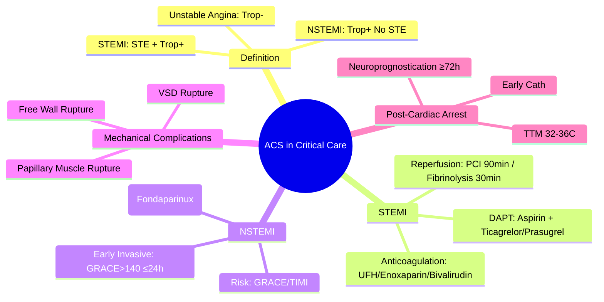
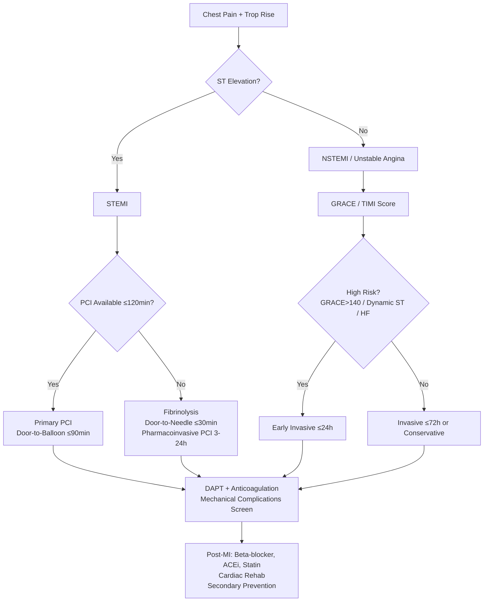

Related: [[Cardiogenic Shock]], [[Inotropes and Vasopressors]], [[Invasive Mechanical Ventilation - Basics]], [[Critical Care Monitoring]]

> [!tip]
> **Time = muscle**. **STEMI = primary PCI ≤90 min** (or fibrinolysis ≤30 min if PCI unavailable). **NSTEMI = early invasive ≤24h** (high risk) or ≤72h. **Dual antiplatelet therapy (DAPT)**: aspirin + ticagrelor/prasugrel. **Mr. G.R.A.C.E** for risk stratification. Key FCPS/MRCP: STEMI vs NSTEMI definitions, door-to-balloon times, DAPT duration, mechanical complications of MI, post-cardiac arrest care.

## 1. Learning Objectives
- Differentiate STEMI, NSTEMI, unstable angina using ECG and troponin
- Apply reperfusion strategy (primary PCI vs fibrinolysis) with time targets
- Manage antiplatelet, anticoagulant, and adjunctive therapies
- Recognise and manage mechanical complications of MI
- Apply risk scores (GRACE, TIMI) for NSTEMI management decisions
- Implement post-cardiac arrest care (targeted temperature management)

## 2. Definition
Acute Coronary Syndrome = spectrum of acute myocardial ischaemia due to coronary atherothrombosis:
- **STEMI**: ST-elevation on ECG + troponin rise → **occlusive thrombosis**
- **NSTEMI**: Troponin rise **without** persistent ST-elevation → **non-occlusive/subtotal**
- **Unstable Angina**: Ischaemic symptoms **without** troponin rise

## 3. Clinical Features

### Typical Presentation
- **Central chest pain**: heavy, pressure, squeezing, radiating to jaw/arm/back
- **Duration**: >20 min (vs stable angina <10 min)
- **Autonomic**: diaphoresis, nausea/vomiting, dyspnoea
- **Atypical**: elderly, diabetics, women → dyspnoea, syncope, epigastric pain, "indigestion"

### Atypical / High-Risk Groups
| Group | Atypical Features |
|-------|-------------------|
| **Elderly** | Confusion, falls, dyspnoea, "silent MI" |
| **Diabetics** | Autonomic neuropathy → painless MI |
| **Women** | Back/jaw pain, nausea, fatigue, dyspnoea > chest pain |
| **Post-CABG** | Atypical due to denervation |

## 4. Investigations

### ECG (Immediate — within 10 min of arrival)
| Finding | Significance |
|---------|--------------|
| **ST-elevation** ≥1 mm (limb), ≥2 mm (precordial) | **STEMI** — activate cath lab |
| **ST-depression** ≥0.5 mm / T inversion | NSTEMI / ischaemia |
| **New LBBB** (Sgarbossa criteria) | Treat as STEMI |
| **Posterior MI**: ST-depression V1–V3 + R/S >1 in V2 | STEMI equivalent |

### Biomarkers
- **High-sensitivity Troponin (hs-cTn)**: **gold standard**
  - **Rule-in**: >99th percentile URL + **rise/fall** pattern
  - **Rule-out**: <LoD at 0h and 1–2h (0/1h or 0/2h algorithms)
- **CK-MB**: not routine; useful for reinfarction, peri-procedural MI

### Risk Scores (NSTEMI)
| Score | Variables | Use |
|-------|-----------|-----|
| **GRACE** | Age, HR, BP, Creatinine, Killip, Cardiac arrest, ST-deviation, Troponin | **In-hospital to 6-month mortality** — guides invasive strategy |
| **TIMI** | Age ≥65, ≥3 CAD risk factors, Known CAD, Aspirin use, ≥2 angina episodes, ST deviation, Positive troponin | **14-day adverse events** — simplifies decision-making |

## 5. Management

### STEMI — **Reperfusion is Time-Critical**
| Strategy | Target | Indication |
|----------|--------|------------|
| **Primary PCI** | **Door-to-balloon ≤90 min** | **Preferred** if available within 120 min of diagnosis |
| **Fibrinolysis** | **Needle-to-needle ≤30 min** | If PCI >120 min (or transfer time >120 min) |
| **Pharmacoinvasive** | PCI 3–24h post-lysis | After successful fibrinolysis |

> **Contraindications to fibrinolysis**: Active bleeding, recent stroke/surgery, aortic dissection, severe hypertension, intracranial pathology

### Adjunctive Pharmacotherapy for STEMI
| Drug | Dose | Timing |
|------|------|--------|
| **Aspirin** | 300 mg PO (chewed) | Immediate |
| **P2Y12 inhibitor** | **Ticagrelor 180 mg** loading (then 90 mg bd) OR Prasugrel 60 mg loading (avoid if >75/stroke) | **Pre-PCI** |
| **Anticoagulant** | UFH 70–100 U/kg (max 5000) OR Enoxaparin 0.5 mg/kg IV | At PCI |
| | Bivalirudin 0.75 mg/kg bolus + 1.75 µg/kg/min | Alternative |
| **Beta-blocker** | IV metoprolol 2–5 mg q5min (max 15 mg) then PO | Early if no HF/shock |
| **ACEi/ARB** | Start within 24h (if no contraindication) | Post-MI remodelling |
| **Statin** | High-intensity (atorvastatin 80 mg) | Immediately |

### NSTEMI / Unstable Angina
- **Early invasive (≤24h)**: GRACE >140, dynamic ST changes, positive troponin, HF, arrhythmia
- **Invasive ≤72h**: Intermediate risk
- **Conservative**: Low risk (TIMI 0–1), medical management
- **DAPT**: Aspirin + ticagrelor/prasugrel (clopidogrel if >75 or on OAC)
- **Anticoagulation**: Fondaparinux (preferred) OR Enoxaparin OR UFH

### Mechanical Complications of MI (Usually Day 1–7)
| Complication | Presentation | Management |
|--------------|--------------|------------|
| **Papillary muscle rupture** → acute MR | **New holosystolic murmur**, pulmonary oedema, cardiogenic shock | **Emergency surgery** (mitral repair/replacement) + IABP/Impella bridge |
| **Ventricular septal rupture** | **New harsh systolic murmur**, right heart failure, shock | **Emergency surgery** + IABP |
| **Free wall rupture** / Cardiac tamponade | **Sudden collapse**, PEA, electrical alternans | **Pericardiocentesis** → **emergency surgery** |
| **LV aneurysm / pseudoaneurysm** | Late, heart failure, arrhythmia, thromboembolism | Surgical repair if symptomatic |

### Post-Cardiac Arrest Care (ROSC)
- **Targeted Temperature Management (TTM)**: **32–36°C** for 24h (then controlled rewarming 0.25°C/h)
- **Avoid hyperoxia** (target SpO₂ 94–98%) and **hypoxia**
- **Haemodynamic optimisation**: MAP ≥65, noradrenaline, echo-guided inotropes
- **Early coronary angiography** (even if comatose) — **STEMI equivalent** or shock
- **Neuroprognostication**: **≥72h** post-ROSC (multimodal: exam, EEG, NSE, MRI)

## 6. FCPS/MRCP High-Yield Points
1. **STEMI = PCI ≤90 min** (fibrinolysis if PCI >120 min)
2. **NSTEMI**: GRACE >140 → invasive ≤24h
3. **DAPT**: Aspirin + ticagrelor/prasugrel (12 months default; 1 month if bleeding risk)
4. **Fibrinolysis contraindications**: bleeding, stroke, surgery, dissection, HTN crisis
5. **Mechanical complications**: new murmur + shock → surgery, IABP/Impella bridge
5. **Post-arrest**: TTM 32–36°C, early cath (even if comatose), avoid hyperoxia
6. **Sgarbossa criteria** for LBBB: concordant STE ≥1mm, discordant STD ≥1mm in V1–V3, excessive discordance
7. **GRACE >140** = early invasive ≤24h
8. **Posterior MI**: STD V1–V3 + R/S >1 in V2
9. **LAD occlusion** = anterior STEMI → high risk cardiogenic shock
10. **Peri-procedural MI**: CK-MB >10× URL (PCI) or >5× (CABG)

## 7. Common Viva Questions
1. STEMI vs NSTEMI vs unstable angina definitions
2. Primary PCI door-to-balloon time; fibrinolysis door-to-needle time
3. GRACE score interpretation and management thresholds
4. DAPT duration and agents (ticagrelor vs prasugrel vs clopidogrel)
5. Mechanical complications of MI (papillary muscle, VSD, free wall)
6. Post-cardiac arrest care (TTM, early cath, neuroprognostication)
7. Sgarbossa criteria for LBBB

## 8. Common Confusions / Exam Traps
- **Fibrinolysis after 12h** → NO benefit (except ongoing ischaemia)
- **Prasugrel in >75 / prior stroke** → CONTRAINDICATED
- **Clopidogrel + PPI (omeprazole)** → reduced clopidogrel activation (use pantoprazole)
- **NSAIDs + DAPT** → increased bleeding
- **OAC + DAPT** = triple therapy → minimal duration (1–4 weeks) then dual (OAC + single antiplatelet)
- **TTM = hypothermia** → NO, **targeted 32–36°C** (not aggressive cooling)
- **Neuroprognostication <72h** → unreliable
- **Routine oxygen in normoxic MI** → NO benefit, may harm

## 9. Mnemonics
- **STEMI REPERFUSION**: **P**CI ≤**90** min; **F**ibrinolysis ≤**30** min
- **DAPT**: **A**spirin + **T**icagrelor/**P**rasugrel (**C**lopidogrel if >75/stroke/OAC)
- **GRACE**: **G**RACE >**140** = **E**arly **I**nvasive ≤**24**h
- **MECHANICAL COMPLICATIONS**: **P**apillary **M**uscle = **M**R; **V**SD = **S**eptal; **F**ree **W**all = **T**amponade
- **POST-ARREST**: **T**TM 32–36°C, **C**ath early, **N**euro ≥**72**h
- **SGARBOSSA**: **C**oncordant STE, **D**iscordant STD V1–V3, **E**xcessive discordance

## 10. Mind Map

## 11. Flowchart

## 12. Suggested Visuals / Image Notes
- STEMI vs NSTEMI ECG criteria
- Sgarbossa criteria for LBBB
- Mechanical complications timeline
- Post-arrest care pathway

## 13. Suggested Video References
- ESC/ACC STEMI/NSTEMI guidelines
- Mechanical complications of MI
- Post-cardiac arrest care (TTM)

## 14. One-Page Revision Summary
- **STEMI**: STE + trop → PCI ≤90min (lysis ≤30min if PCI >120min)
- **NSTEMI**: Trop+ no STE → GRACE >140 → invasive ≤24h
- **DAPT**: Aspirin + Ticagrelor/Prasugrel (12mo); Clopidogrel if >75/stroke
- **Mechanical**: Papillary muscle (MR), VSD, Free wall (tamponade) → Surgery
- **Post-arrest**: TTM 32–36°C, Early cath, Neuroprognostication ≥72h
- **Sgarbossa**: Concordant STE, Discordant STD V1–V3, Excessive discordance
- **Posterior MI**: STD V1–V3 + R/S >1 in V2
- **GRACE >140** = invasive ≤24h

## 24-Hour Recall Prompts
- State STEMI reperfusion time targets
- List DAPT components and durations
- Name 3 mechanical complications of MI
- State TTM temperature and neuroprognostication timing

## 7-Day / 15-Day / 30-Day Revision Tracker
- [ ] Day 1 completed
- [ ] 24-hour recall completed
- [ ] Day 7 revision completed
- [ ] Day 15 revision completed
- [ ] Day 30 revision completed

## 15. Must Know / Should Know / Nice to Know
### Must Know
- STEMI: PCI ≤90min, lysis ≤30min
- NSTEMI: GRACE >140 → invasive ≤24h
- DAPT: Aspirin + Ticagrelor/Prasugrel (12mo)
- Mechanical complications: MR, VSD, Tamponade
- Post-arrest: TTM 32–36°C, early cath

### Should Know
- Sgarbossa criteria
- GRACE/TIMI scoring
- Fibrinolysis contraindications
- Post-arrest neuroprognostication (multimodal)
- OAC + DAPT = triple therapy management

### Nice to Know
- Posterior MI ECG
- LAD occlusion = anterior STEMI = high shock risk
- Peri-procedural MI definitions
- Burr hole vs surgical VSD repair

## 16. Self-Test Scorecard
- Understanding: /10
- Recall: /10
- MCQ Performance: /10
- SBA Performance: /10
- Viva Confidence: /10
- Total: /50

> [!tip]
> Interpretation: <35 = weak topic, 35-44 = acceptable but insecure, 45+ = strong exam-ready topic.

## 17. Exam Answer Modes
### Long Answer Skeleton
- Definition: STEMI/NSTEMI/Unstable Angina
- STEMI: reperfusion strategy, time targets, pharmacotherapy
- NSTEMI: risk stratification (GRACE), invasive timing
- Mechanical complications
- Post-cardiac arrest care

### Short Note Skeleton
- STEMI vs NSTEMI table
- DAPT box
- Mechanical complications table
- Post-arrest care box

### Viva One-Liners
- "STEMI = PCI ≤90min; Fibrinolysis ≤30min if PCI >120min"
- "NSTEMI: GRACE >140 → invasive ≤24h"
- "DAPT: Aspirin + Ticagrelor/Prasugrel 12mo"
- "Mechanical: Papillary muscle = acute MR; VSD; Free wall = tamponade"
- "Post-arrest: TTM 32–36°C; Early cath even if comatose; Neuro ≥72h"
- "Sgarbossa: Concordant STE, Discordant STD V1-3, Excessive discordance"
- "Fibrinolysis contraindications: Bleeding, Stroke, Surgery, Dissection, HTN crisis"
- "Posterior MI: STD V1-3 + R/S >1 in V2"
- "TTM = Targeted Temperature Management 32–36°C (not hypothermia)"

### Ward-Case Discussion Points
- STEMI + cardiogenic shock → PCI + IABP/Impella + inotropes
- NSTEMI + GRACE 160 → cath lab ≤24h + fondaparinux + ticagrelor
- Post-arrest VF → PCI + TTM 32–36°C → neuroprognostication day 3
- STEMI + new murmur + shock → echo → papillary rupture → IABP → surgery

### Last-Night-Before-Exam Sheet
- STEMI: PCI 90, Lysis 30
- NSTEMI: GRACE>140 = 24h
- DAPT: Asp + Tica/Prasu 12mo
- Mechanical: MR, VSD, Tamponade
- Post-arrest: TTM 32-36, Cath, Neuro 72h
- Sgarbossa: LBBB STEMI dx

## 18. Summary
ACS spectrum: STEMI (STE + trop), NSTEMI (trop+ no STE), Unstable Angina (trop-). **STEMI**: primary PCI ≤90 min (fibrinolysis ≤30 min if PCI >120 min). **NSTEMI**: GRACE >140 → early invasive ≤24h. **DAPT**: aspirin + ticagrelor/prasugrel 12mo (clopidogrel if >75/prior stroke/OAC). **Mechanical complications**: papillary muscle rupture (acute MR), VSD, free wall rupture (tamponade) → emergency surgery ± IABP/Impella. **Post-cardiac arrest**: TTM 32–36°C, early coronary angiography, neuroprognostication ≥72h multimodal. **Sgarbossa criteria** for LBBB.

## 19. MCQs (10)
1. STEMI on ECG is defined as:
   A. ST elevation in 2 contiguous leads ≥1 mm
   B. **ST elevation in 2 contiguous leads ≥1 mm (≥2 mm in V2–V3 men, ≥1.5 mm women)**
   C. New T-wave inversion
   D. New LBBB only

2. Primary PCI time target for STEMI (door-to-balloon):
   A. 30 min
   B. **≤90 min (≤60 min if directly admitted)**
   C. 120 min
   D. 180 min

3. Fibrinolysis is preferred over PCI if:
   A. Always
   B. **PCI cannot be performed within 120 min of first medical contact**
   C. Patient is over 75
   D. Anterior STEMI

4. NSTEMI risk stratification uses:
   A. TIMI score only
   B. **GRACE score (preferred)**
   C. Killip class
   D. NYHA class

5. GRACE score >140 in NSTEMI indicates:
   A. Low risk — discharge
   B. **High risk — early invasive strategy ≤24 h**
   C. Conservative management
   D. CABG

6. DAPT duration post-ACS in stable patient:
   A. 1 month
   B. 6 months
   C. **12 months (aspirin + ticagrelor/prasugrel)**
   D. Lifelong

7. Ticagrelor loading dose:
   A. 75 mg
   B. 150 mg
   C. **180 mg loading, then 90 mg BD**
   D. 300 mg

8. Papillary muscle rupture post-MI classically causes:
   A. VSD
   B. **Acute severe mitral regurgitation**
   C. Free wall rupture
   D. Tamponade immediately

9. Post-MI ventricular septal defect — treatment:
   A. Diuretics
   B. **Emergency surgical repair ± IABP bridge**
   C. Beta-blockers
   D. Observation

10. Sgarbossa criteria are used to diagnose MI in the presence of:
    A. Pacemaker
    B. **LBBB**
    C. RBBB
    D. WPW

## 20. SBA Questions (10)
1. A 60-year-old man with crushing chest pain, anterior STEMI on ECG, PCI available in 30 min. Management:
   A. Fibrinolysis
   B. **Primary PCI (door-to-balloon ≤90 min) + DAPT (aspirin + ticagrelor)**
   C. CT coronary angiogram
   D. Stress test

2. PCI not available within 2 h. Alternative:
   A. Wait for PCI
   B. **Fibrinolysis (door-to-needle ≤30 min)**
   C. Heparin only
   D. Discharge

3. A 70-year-old with NSTEMI, GRACE 160. Plan:
   A. Discharge
   B. **Early invasive coronary angiography within 24 h**
   C. CT angio
   D. Stress test in 6 weeks

4. Anterior MI on day 3, new loud holosystolic murmur, hypotension, pulmonary oedema. Diagnosis:
   A. Free wall rupture
   B. **Ventricular septal defect (VSD)**
   C. Papillary muscle rupture
   D. Dressler syndrome

5. Inferior MI on day 5, new pansystolic murmur, pulmonary oedema. Diagnosis:
   A. VSD
   B. **Acute severe mitral regurgitation (posteromedial papillary muscle rupture)**
   C. Free wall rupture
   D. LV aneurysm

6. Post-MI cardiac arrest, ROSC achieved, comatose. Best practice:
   A. Immediate CT head
   B. **Targeted temperature management 32–36°C + early coronary angiography**
   C. Normothermia
   D. Mannitol

7. Sgarbossa criterion — concordant ST elevation ≥1 mm in LBBB:
   A. Normal variant
   B. **Specific for MI in LBBB**
   C. Suggests pericarditis
   D. Suggests LVH

8. A patient on DAPT (aspirin + ticagrelor) needs urgent CABG. When to stop ticagrelor?
   A. 24 h before
   B. **5 days (or 3 days for clopidogrel)**
   C. 12 h before
   D. No need to stop

9. Free wall rupture post-MI — clinical features:
   A. New loud murmur
   B. **Sudden cardiovascular collapse with pulseless electrical activity ± tamponade**
   C. Slow AF
   D. Recurrent chest pain

10. Cardiogenic shock post-anterior STEMI. First-line mechanical support:
    A. IABP
    B. **Noradrenaline + consider Impella/VA-ECMO; IABP no longer routine**
    C. Bandage
    D. None

## 21. Flashcards
- Q: STEMI definition (ECG)
  A: ST elevation in 2 contiguous leads ≥1 mm (≥2 mm V2–V3 men, ≥1.5 mm V2–V3 women)
- Q: STEMI reperfusion target
  A: Primary PCI ≤90 min door-to-balloon
- Q: Fibrinolysis time target
  A: Door-to-needle ≤30 min
- Q: NSTEMI risk score
  A: GRACE
- Q: GRACE >140 = ?
  A: High risk → early invasive ≤24 h
- Q: DAPT duration post-ACS
  A: 12 months (aspirin + ticagrelor/prasugrel)
- Q: Ticagrelor loading
  A: 180 mg, then 90 mg BD
- Q: Papillary muscle rupture
  A: Inferior MI → acute severe MR
- Q: VSD post-MI timing
  A: Day 3–5
- Q: Free wall rupture
  A: Sudden PEA, tamponade, usually fatal
- Q: Sgarbossa criteria
  A: MI diagnosis in LBBB
- Q: TTM post-arrest
  A: 32–36°C × 24 h

## 22. Answer Key with Explanations
### MCQs
1. **B** — STEMI: ST elevation in 2 contiguous leads with sex/lead-specific thresholds.
2. **B** — Door-to-balloon ≤90 min (≤60 min if direct admission).
3. **B** — Fibrinolysis if PCI >120 min from first medical contact.
4. **B** — GRACE is preferred risk score for NSTEMI.
5. **B** — GRACE >140 → high risk → early invasive ≤24 h.
6. **C** — DAPT 12 months (aspirin + ticagrelor/prasugrel).
7. **C** — Ticagrelor 180 mg loading, 90 mg BD.
8. **B** — Papillary muscle rupture → acute severe MR.
9. **B** — Post-MI VSD → emergency surgical repair + IABP bridge.
10. **B** — Sgarbossa = MI in LBBB.

### SBAs
1. **B** — STEMI + PCI available = primary PCI + DAPT.
2. **B** — Fibrinolysis if PCI >120 min; door-to-needle ≤30 min.
3. **B** — NSTEMI + GRACE >140 = early invasive ≤24 h.
4. **B** — Anterior MI + new murmur + shock = VSD.
5. **B** — Inferior MI + new MR = papillary muscle rupture.
6. **B** — Post-arrest: TTM 32–36°C + early angiography.
7. **B** — Concordant ST elevation is specific for MI in LBBB.
8. **B** — Stop ticagrelor 5 days before CABG (3 for clopidogrel).
9. **B** — Free wall rupture = sudden PEA + tamponade.
10. **B** — Noradrenaline + Impella/VA-ECMO; IABP no longer routine.

## PasTest Scenario SBAs (Clinical Vignettes)

> **Auto-generated PasTest/Mediscope-style scenario SBAs** grounded in the authored source. Each scenario tests a real clinical fact (triad, specific sign, contraindication, trial, first-line Rx) extracted from the topic. *Source: Ch 10: Acute Medicine — Acute Coronary Syndromes in Critical Care*

**Q1.** Which of the following features is most specific or characteristic of Acute Coronary Syndromes in Critical Care?

  - **A.** Post-CABG
  - **B.** A feature common to many acute inflammatory conditions
  - **C.** A non-specific sign that does not localise the diagnosis
  - **D.** An investigation finding rather than a clinical feature

  > **Answer: A** — Post-CABG
  >
  > *Source:* neuropathy → painless MI |
| **Women** | Back/jaw pain, nausea, fatigue, dyspnoea > chest pain |
| **Post-CABG** | Atypical due to denervation |
### ECG (Immediate — within 10 min of arrival)
| Findin

**Q2.** What is the most appropriate first-line therapy for Acute Coronary Syndromes in Critical Care?

  - **A.** Pharmacoinvasive + Contraindications to fibrinolysis
  - **B.** An advanced/surgical therapy reserved for refractory disease
  - **C.** Symptomatic treatment only, no disease-modifying therapy
  - **D.** Empiric broad-spectrum therapy without specific indication

  > **Answer: A** — Pharmacoinvasive + Contraindications to fibrinolysis
  >
  > *Source:* **Pharmacoinvasive**   PCI 3–24h post-lysis   After successful fibrinolysis  

> **Contraindications to fibrinolysis**: Active bleeding, recent stroke/surgery, aortic dissection, severe hypertension, 

