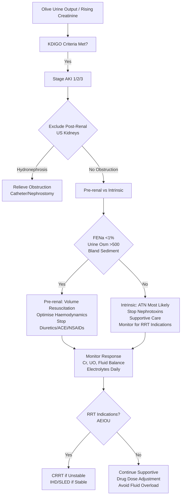

Related: [[Shock - Overview]], [[Sepsis and Septic Shock]], [[Fluid Resuscitation Strategies]], [[Critical Care Monitoring]], [[Enhanced Elimination (Dialysis, Hemoperfusion)]]

> [!tip]
> **KDIGO criteria** = standard for AKI diagnosis. **AKI is common (20-50% ICU)** and independently increases mortality. **Prevention > treatment**. RRT indications: AEIOU. Key FCPS/MRCP: KDIGO staging, creatinine/urine output criteria, contrast nephropathy prevention, RRT indications (AEIOU), timing of RRT initiation.

## 1. Learning Objectives
- Apply KDIGO criteria for AKI diagnosis and staging
- Differentiate pre-renal, intrinsic, and post-renal AKI
- Apply prevention strategies (especially contrast-induced)
- Identify indications for renal replacement therapy (RRT)
- Choose appropriate RRT modality and timing

## 2. Definition
AKI = abrupt decline in kidney function over hours to days, resulting in retention of nitrogenous wastes (creatinine, urea) and dysregulation of fluid, electrolyte, and acid-base balance.

## 3. KDIGO Criteria (Diagnosis & Staging)

| Stage | Creatinine Criteria | Urine Output Criteria |
|-------|---------------------|----------------------|
| **1** | 1.5–1.9× baseline OR ≥26.5 µmol/L (0.3 mg/dL) rise in 48h | <0.5 mL/kg/h for 6–12h |
| **2** | 2.0–2.9× baseline | <0.5 mL/kg/h for ≥12h |
| **3** | 3.0× baseline OR ≥354 µmol/L (4.0 mg/dL) OR RRT initiation | <0.3 mL/kg/h for ≥24h OR anuria ≥12h |

> **Note**: Baseline = lowest creatinine in prior 3 months. If unknown, assume MDRD eGFR 75 mL/min → estimate baseline creatinine.

## 4. Aetiology / Classification

| Category | Causes | Key Features |
|----------|--------|--------------|
| **Pre-renal** (70%) | Hypovolaemia, heart failure, cirrhosis, sepsis, medications (ACEi, NSAIDs, diuretics) | **Reversible** with volume/haemodynamic optimisation; FENa <1%, urine osmolality >500 |
| **Intrinsic** (25%) | **ATN** (ischaemia, nephrotoxins: contrast, aminoglycosides, amphotericin), AIN (drugs), GN, vasculitis, rhabdo, tumour lysis | FENa >2%, muddy brown casts; **ATN = most common intrinsic** |
| **Post-renal** (5%) | Obstruction (prostate, stones, tumour, retroperitoneal fibrosis) | Hydronephrosis on US; may be anuric |

## 5. Clinical Features
- **Oliguria** (<0.5 mL/kg/h) or anuria
- **Fluid overload**: pulmonary oedema, hypertension, raised JVP
- **Electrolytes**: hyperkalaemia, metabolic acidosis, hyperphosphataemia, hypocalcaemia
- **Uraemic symptoms**: nausea, pericarditis, encephalopathy, bleeding (platelet dysfunction)
- **Hyperpigmentation**, pruritus (chronic)

## 6. Investigations
- **Creatinine, urea** (trend more important than absolute)
- **Urine output** (strict hourly measurement — **Foley catheter**)
- **Urinalysis**: protein, blood, casts (muddy brown = ATN), eosinophils (AIN)
- **FENa** = (U<sub>Na</sub> × P<sub>Cr</sub>) / (P<sub>Na</sub> × U<sub>Cr</sub>) × 100
- **Urine osmolality**, urine sodium
- **Renal US**: kidney size, hydronephrosis (exclude obstruction), cortical echogenicity
- **CK** (rhabdo), lactate, electrolytes, ABG

## 7. Management

### 1. General Measures (All AKI)
- **Stop nephrotoxins** (ACEi/ARB, NSAIDs, aminoglycosides, contrast, diuretics)
- **Optimise haemodynamics**: MAP ≥65, euvolaemia, avoid hypotension
- **Correct hypovolaemia** (fluids) then **avoid fluid overload** (risk of pulmonary oedema)
- **Monitor**: strict fluid balance, daily weight, hourly urine output, daily creatinine/electrolytes
- **Nutrition**: adequate calories, protein 0.8–1.0 g/kg/day (higher on RRT)
- **Drug dosing**: adjust ALL renally cleared drugs (use eGFR/CrCl)

### 2. Pre-renal AKI
- **Volume resuscitation**: crystalloids (balanced preferred), target MAP ≥65
- **Vasopressors** if fluid-refractory (noradrenaline first-line)
- **Treat underlying cause** (sepsis, heart failure, haemorrhage)

### 3. Intrinsic AKI (ATN)
- **Supportive** — no specific therapy to accelerate recovery
- **Avoid nephrotoxins**
- **Loop diuretics** do **not** prevent or treat ATN (may convert oliguric to non-oliguric but no mortality benefit)
- **Dopamine** — **no role** in ATN prevention/treatment

### 4. Contrast-Induced Nephropathy (CIN) Prevention
- **High risk**: eGFR <30, diabetes, heart failure, age >75, volume depletion, myeloma, concurrent nephrotoxins
- **Hydration**: IV 0.9% saline or bicarbonate 1 mL/kg/h for 6–12h pre and post
- **Use low-osmolar/iso-osmolar contrast**, minimise volume
- **N-acetylcysteine** — **evidence weak**, not routinely recommended
- **Stop nephrotoxins** 48h before/after
- **Hold metformin** 48h post-contrast if eGFR <60

### 5. Drug-Induced AKI
- **AIN**: eosinophilia, eosinophiluria, fever, rash — **stop offending drug, consider steroids**
- **Nephrotoxins**: aminoglycosides (trough monitoring), amphotericin (liposomal preferred), calcineurin inhibitors (trough levels), TKIs

### 5. Post-renal AKI
- **Relieve obstruction**: Foley catheter, nephrostomy, stent, surgery

## 8. Renal Replacement Therapy (RRT)

### Indications for RRT (AEIOU)
| Indication | Details |
|------------|---------|
| **A**cidosis | pH <7.15 (metabolic) unresponsive to medical therapy |
| **E**lectrolytes | **K⁺ >6.5 mmol/L** (or >6.0 with ECG changes) refractory to medical Rx |
| **I**ngestions | Dialysable toxins (methanol, ethylene glycol, lithium, salicylate, metformin) |
| **O**verload | **Fluid overload** refractory to diuretics (pulmonary oedema) |
| **U**raemia | Pericarditis, encephalopathy, bleeding (platelet dysfunction), neuropathy |

### RRT Modalities
| Modality | Indication | Key Features |
|----------|------------|--------------|
| **IHD** (Intermittent HD) | Stable, hypercatabolic, intoxication | 3–4h sessions, 3x/week; hemodynamic instability risk |
| **SLED** (Sustained Low-Efficiency Dialysis) | Moderate instability | 6–12h sessions, slower solute/fluid removal |
| **CRRT** (CVVH/CVVHDF) | **Haemodynamically unstable**, sepsis, cerebral oedema | Continuous; better haemodynamic tolerance; superior solute control |
| **PD** (Peritoneal Dialysis) | Resource-limited, no vascular access | Lower clearance; infection risk |

> **Timing**: **Early RRT** (within 12h of indication) may improve survival in septic AKI — **don't wait for life-threatening complications**.

### CRRT Prescription (Typical)
- **Blood flow**: 150–200 mL/min
- **Effluent dose**: 20–25 mL/kg/h (standard); 35 mL/kg/h (septic AKI/fluid overload)
- **Anticoagulation**: Regional citrate (preferred) or unfractionated heparin
- **Replacement fluid**: Pre-dilution (filter life) vs post-dilution (clearance)

## 9. Complications of AKI
- Fluid overload → pulmonary oedema, prolonged ventilation
- Hyperkalaemia → arrhythmias, death
- Metabolic acidosis → haemodynamic instability
- Uraemic pericarditis, encephalopathy, bleeding
- Infection (catheter-related sepsis)
- Chronic kidney disease (CKD) — 20–30% survivors develop CKD/progress to ESRD

## 10. Prognosis
- **ICU mortality**: 40–60% with severe AKI requiring RRT
- **Renal recovery**: 50–60% at hospital discharge (better if pre-renal, worse if ATN + multiorgan failure)
- **Risk factors for non-recovery**: older age, CKD baseline, severe ATN, prolonged oliguria, multiorgan failure

## 11. FCPS/MRCP High-Yield Points
1. **KDIGO criteria**: Creatinine rise 1.5× OR urine output <0.5 mL/kg/h × 6h
2. **Staging**: Stage 1/2/3 based on Cr rise or UO
3. **FENa**: <1% pre-renal, >2% ATN (invalid if diuretics)
4. **Contrast nephropathy**: hydration is key; NAC weak evidence
5. **Loop diuretics**: no mortality benefit in ATN
6. **RRT indications** = **AEIOU** (Acidosis, Electrolytes, Ingestions, Overload, Uraemia)
7. **CRRT** preferred in haemodynamically unstable; IHD if stable
8. **Early RRT** within 12h of indication may improve survival
9. **Drug dosing**: adjust all renally excreted drugs
10. **Contrast**: hold metformin 48h post if eGFR <60

## 12. Common Viva Questions
1. KDIGO staging criteria for AKI
2. Differentiate pre-renal vs intrinsic (ATN) using FENa, urine osmolality, sediment
3. Contrast-induced nephropathy: risk factors and prevention
4. RRT indications (AEIOU)
7. CRRT vs IHD — when to choose which?
8. Fluid management in oliguric AKI
9. Drug dosing adjustment in AKI

## 13. Common Confusions / Exam Traps
- **FENa invalid if on diuretics** → use FeUrea (<35% pre-renal)
- **Diuretics prevent/treat ATN** → NO (no mortality benefit)
- **Dopamine for renal protection** → NO role
- **NAC for contrast nephropathy** → weak evidence, not standard
- **K⁺ >6.5 = immediate RRT** → treat medically first (insulin/dextrose, calcium, salbutamol, kayexalate) — RRT if refractory
- **Creatinine rise = AKI** → need baseline; trend matters more than single value
- **Urine output alone ≈ AKI** → use both Cr and UO criteria

## 14. Mnemonics
- **AKI STAGING**: **1** = 1.5×/0.5 UO, **2** = 2×/0.5 UO longer, **3** = 3×/RRT/0.3 UO
- **AEIOU**: **A**cidosis, **E**lectrolytes (K), **I**ngestions, **O**verload, **U**raemia
- **FENa**: **<1%** Pre-renal; **>2%** ATN (diuretics = invalid)
- **CONTRAST RISK**: **E**GFR <30, **D**M, **H**F, **A**ge>75, **V**olume depletion, **N**ephrotoxins
- **RRT DIALYSABLE TOXINS**: **M**ethanol, **E**thylene glycol, **L**ithium, **S**alicylate, **M**etformin

## 15. Mind Map
```mermaid
mindmap
  root((AKI in Critical Illness))
    Diagnosis
      KDIGO: Cr + UO
      Stages 1-3
      Baseline Cr Essential
    Classification
      Pre-renal (70%)
      Intrinsic: ATN (most), AIN, GN
      Post-renal (5%)
    Investigations
      Cr trend, UO, FENa, Urinalysis
      US: Hydronephrosis
    Management
      Stop Nephrotoxins
      Haemodynamic Optimisation
      Fluid Balance
      Drug Dosing
    CIN Prevention
      Hydration (Saline/Bicarb)
      Low-Osmolar Contrast
      Hold Metformin
    RRT
      Indications: AEIOU
      CRRT vs IHD vs SLED
      Timing: Early Better
    Complications
      HyperK, Acidosis, Fluid Overload, Uraemia
```

## 16. Flowchart


## 17. Suggested Visuals / Image Notes
- KDIGO staging table
- AEIOU indications card
- FENa interpretation diagram
- CRRT prescription card

## 18. Suggested Video References
- KDIGO AKI guidelines overview
- CRRT practical setup
- Fluid responsiveness in AKI

## 19. One-Page Revision Summary
- **KDIGO**: Cr ×1.5 or UO <0.5 mL/kg/h ×6h = AKI
- **Staging**: 1 (1.5–1.9×), 2 (2–2.9×), 3 (3× or RRT or UO <0.3)
- **FENa**: <1% pre-renal; >2% ATN (diuretics invalidate)
- **CIN**: Hydration is key; low-osmolar contrast; hold metformin if eGFR<60
- **RRT Indications**: AEIOU (Acidosis pH<7.15, K>6.5, Ingestions, Overload, Uraemia)
- **CRRT** for unstable; **IHD** for stable; **Early RRT** within 12h of indication
- **Drug dosing**: adjust ALL renally cleared drugs
- **Diuretics**: no benefit in ATN; **dopamine no role**

## 24-Hour Recall Prompts
- State KDIGO Stage 1/2/3 criteria
- List 5 RRT indications (AEIOU)
- Differentiate pre-renal vs ATN using FENa/sediment
- State CIN prevention bundle

## 7-Day / 15-Day / 30-Day Revision Tracker
- [ ] Day 1 completed
- [ ] 24-hour recall completed
- [ ] Day 7 revision completed
- [ ] Day 15 revision completed
- [ ] Day 30 revision completed

## 20. Must Know / Should Know / Nice to Know
### Must Know
- KDIGO criteria + staging
- FENa interpretation (and diuretic caveat)
- AEIOU for RRT
- CIN prevention (hydration, hold metformin)
- CRRT vs IHD choice
- Adjust drug doses

### Should Know
- FeUrea if diuretics
- CRRT prescription details
- Contrast nephropathy risk factors
- ATN vs AIN differentiation
- Early vs late RRT timing evidence

### Nice to Know
- Biomarkers (NGAL, KIM-1, L-FABP)
- SLED hybrid modality
- Peritoneal dialysis in critically ill
- Long-term CKD/ESRD risk post-AKI

## 21. Self-Test Scorecard
- Understanding: /10
- Recall: /10
- MCQ Performance: /10
- SBA Performance: /10
- Viva Confidence: /10
- Total: /50

> [!tip]
> Interpretation: <35 = weak topic, 35-44 = acceptable but insecure, 45+ = strong exam-ready topic.

## 22. Exam Answer Modes
### Long Answer Skeleton
- Definition + KDIGO criteria + staging table
- Classification (pre-renal, intrinsic, post-renal) with table
- FENa/FeUra interpretation
- CIN prevention
- RRT: indications (AEIOU), modalities, timing
- Complications + prognosis

### Short Note Skeleton
- KDIGO staging box
- AEIOU indications box
- FENa/FeUrea table
- CRRT vs IHD comparison

### Viva One-Liners
- "AKI = Cr ×1.5 or UO <0.5 mL/kg/h ×6h (KDIGO)"
- "Stage 1: 1.5–1.9×Cr; Stage 2: 2–2.9×; Stage 3: 3× or RRT"
- "FENa <1% = pre-renal; >2% = ATN (diuretics invalidate)"
- "AEIOU = Acidosis, Electrolytes (K), Ingestions, Overload, Uraemia"
- "CIN: Hydration > NAC; hold metformin 48h if eGFR<60"
- "CRRT for unstable; IHD for stable; Early RRT within 12h"
- "Drug doses: adjust ALL renally cleared drugs"
- "Diuretics no mortality benefit in ATN; dopamine no role"

### Ward-Case Discussion Points
- Sepsis + oliguria + rising Cr → KDIGO Stage 2 → FENa 0.8% → fluids + noradrenaline → monitor for RRT
- Post-contrast Cr rise 1.8× baseline at 48h → CIN Stage 1 → aggressive hydration, stop nephrotoxins, monitor
- eGFR 20, needs urgent contrast CT → saline/bicarb hydration, iso-osmolar contrast, hold metformin
- Severe sepsis + K⁺ 7.0 unresponsive to medical Rx → RRT (AEIOU: Electrolytes)

### Last-Night-Before-Exam Sheet
- KDIGO: 1.5×Cr / 0.5 UO = AKI
- Stages: 1.5-1.9 / 2-2.9 / 3+
- FENa: <1 Pre, >2 ATN
- AEIOU: A-E-I-O-U
- CIN: Hydrate, Low-osmolar, Hold Metformin
- CRRT unstable, IHD stable
- Early RRT better
- Drug dosing adjust

## 23. Summary
AKI in critical illness = common, high mortality. **KDIGO** criteria (Cr + UO) for diagnosis/staging. **FENa** differentiates pre-renal (<1%) from ATN (>2%) — **invalid if diuretics** (use FeUrea). **CIN prevention**: hydration > NAC; hold metformin 48h if eGFR<60. **RRT indications = AEIOU**. **CRRT for unstable**, IHD/SLED for stable. **Early RRT** within 12h may improve survival. **Adjust ALL renally cleared drugs**. Diuretics/dopamine no role in ATN.

## 24. MCQs (10)
1. KDIGO AKI criteria include all EXCEPT:
   A. Rise in serum creatinine ≥26.5 μmol/L in 48 h
   B. **Rise in creatinine ≥50% in 7 days**
   C. Oliguria <0.5 mL/kg/h for 6 h
   D. Anuria for 12 h

2. FENa <1% suggests:
   A. ATN
   B. **Pre-renal AKI**
   C. Post-renal AKI
   D. Glomerulonephritis

3. FENa is unreliable in:
   A. ATN
   B. **Patients on diuretics (use FeUrea)**
   C. Pre-renal AKI
   D. Hepatorenal syndrome

4. RRT indications — AEIOU includes all EXCEPT:
   A. Acidosis
   B. Electrolytes (hyperkalaemia)
   C. **Anaemia**
   D. Overload (fluid)

5. CRRT is preferred over intermittent haemodialysis in:
   A. All patients
   B. **Haemodynamically unstable patients**
   C. CKD stage 3
   D. Outpatient setting

6. Contrast-induced nephropathy prevention includes:
   A. High-dose NAC
   B. **IV hydration (0.9% saline) ± low-dose NAC**
   C. Loop diuretics
   D. Dopamine

7. Pre-renal AKI due to hepatorenal syndrome is treated with:
   A. Dopamine
   B. **Terlipressin + albumin (or noradrenaline + albumin)**
   C. Loop diuretic
   D. ACE inhibitor

8. Nephrotoxic drugs commonly causing AKI in ICU:
   A. Paracetamol
   B. **Aminoglycosides, vancomycin, contrast, NSAIDs, ACEi/ARBs**
   C. Statins
   D. Beta-blockers

9. Rhabdomyolysis AKI prevention:
   A. Restrict fluids
   B. **Aggressive IV crystalloid + consider urinary alkalinisation**
   C. Loop diuretics
   D. ACEi

10. Dopamine in AKI:
    A. Recommended
    B. **NOT recommended — no benefit, increases harm**
    C. Only low dose
    D. With ACEi

## 25. SBA Questions (10)
1. A 70-year-old, sepsis, UO 0.3 mL/kg/h for 8 h, Cr 250 (baseline 100). KDIGO stage:
   A. Stage 1
   B. **Stage 2** (Cr 2.5× baseline = stage 2; UO <0.5 for 8 h = stage 2)
   C. Stage 3
   D. Not AKI

2. A patient on furosemide, AKI workup, FENa 0.4%. Interpretation:
   A. ATN
   B. **FENa invalid; use FeUrea (<35% = pre-renal)**
   C. Pre-renal
   D. Post-renal

3. Severe hyperkalaemia (K⁺ 7.0) + AKI + oliguria. Next step:
   A. Repeat K⁺
   B. **Emergency RRT (haemodialysis) + standard hyperK management**
   C. IV fluids
   D. Insulin only

4. Refractory metabolic acidosis (pH 7.10, HCO₃⁻ 10) in AKI. Indication for RRT:
   A. No
   B. **Yes — refractory acidosis (A in AEIOU)**
   C. Bicarbonate only
   D. Dialysis 3×/week

5. CRRT vs IHD — haemodynamically unstable septic AKI patient. Best:
   A. IHD
   B. **CRRT (CVVHDF) — gradual solute/fluid removal**
   C. SLED
   D. Peritoneal dialysis

6. Patient with ACE inhibitor + sepsis + hypovolaemia. AKI mechanism:
   A. ATN
   B. **Pre-renal (efferent arteriole dilation + hypoperfusion)**
   C. Post-renal
   D. AIN

7. AKI on contrast — when does Cr peak?
   A. 6 h
   B. 24 h
   C. **48–72 h**
   D. 1 week

8. Rhabdomyolysis (CK 25,000) prevention of AKI:
   A. Restrict fluids
   B. **Aggressive IV crystalloid 1–2 L/h (target UO 200–300 mL/h)**
   C. Loop diuretic
   D. ACEi

9. Acute interstitial nephritis (AIN) — most common cause:
   A. ATN
   B. **Drugs (NSAIDs, antibiotics — penicillins, PPIs, allopurinol)**
   C. Pre-renal
   D. Glomerulonephritis

10. Early vs late RRT initiation in critically ill AKI (ELAIN / AKIKI trials):
    A. Always early
    B. **AKIKI: no benefit of early; ELAIN: early within 8h of stage 2 may benefit; wait-and-see approach acceptable**
    C. Always late
    D. Never

## 26. Flashcards
- Q: KDIGO AKI criteria
  A: Cr ↑ ≥26.5 μmol/L in 48h or ≥1.5× baseline within 7d; or UO <0.5 mL/kg/h for ≥6h
- Q: FENa interpretation
  A: <1% pre-renal; >2% ATN
- Q: FENa caveat
  A: Invalid on diuretics — use FeUrea (<35% pre-renal)
- Q: AEIOU (RRT indications)
  A: Acidosis, Electrolytes, Ingestion, Overload, Uraemia
- Q: CRRT indication
  A: Haemodynamically unstable
- Q: IHD indication
  A: Haemodynamically stable
- Q: HRS treatment
  A: Terlipressin + albumin (or noradrenaline + albumin)
- Q: CIN prevention
  A: IV hydration; hold metformin, ACEi, ARBs, NSAIDs
- Q: Rhabdomyolysis AKI prevention
  A: Aggressive IV crystalloid; target UO 200–300 mL/h
- Q: Dopamine in AKI
  A: NOT recommended (no benefit)
- Q: AIN most common cause
  A: Drugs (NSAIDs, penicillins, PPIs, allopurinol)
- Q: Rhabdomyolysis CK target
  A: Peak Cr 48–72 h post-contrast / rhabdo

## 27. Answer Key with Explanations
### MCQs
1. **B** — KDIGO: Cr ↑ ≥26.5 in 48h or ≥1.5× in 7d; oliguria <0.5 mL/kg/h for 6h (KDIGO stage 1).
2. **B** — FENa <1% = pre-renal.
3. **B** — FENa invalid on diuretics — use FeUrea.
4. **C** — AEIOU: Acidosis, Electrolytes, Ingestion, Overload, Uraemia (NOT Anaemia).
5. **B** — CRRT for unstable patients.
6. **B** — CIN prevention: IV hydration ± NAC.
7. **B** — HRS: terlipressin + albumin.
8. **B** — Common nephrotoxins: aminoglycosides, vancomycin, contrast, NSAIDs, ACEi/ARBs.
9. **B** — Rhabdo: aggressive IV crystalloid.
10. **B** — Dopamine NOT recommended in AKI.

### SBAs
1. **B** — Cr 2.5× baseline or UO <0.5 for 8h = KDIGO stage 2.
2. **B** — FENa invalid on diuretics; use FeUrea.
3. **B** — HyperK + AKI + oliguria = emergency RRT.
4. **B** — Refractory acidosis = RRT indication (A in AEIOU).
5. **B** — CRRT for haemodynamic instability.
6. **B** — ACEi + hypovolaemia = pre-renal (efferent dilation).
7. **C** — CIN peaks at 48–72 h.
8. **B** — Rhabdo: aggressive IV crystalloid, target UO 200–300 mL/h.
9. **B** — AIN: drugs (NSAIDs, penicillins, PPIs, allopurinol).
10. **B** — AKIKI: wait-and-see; ELAIN: early may help.

## PasTest Scenario SBAs (Clinical Vignettes)

> **Auto-generated PasTest/Mediscope-style scenario SBAs** grounded in the authored source. Each scenario tests a real clinical fact (triad, specific sign, contraindication, trial, first-line Rx) extracted from the topic. *Source: Ch 10: Acute Medicine — Acute Kidney Injury in Critical Illness*

**Q1.** What is the most appropriate first-line therapy for Acute Kidney Injury in Critical Illness?

  - **A.** Drug dosing
  - **B.** An advanced/surgical therapy reserved for refractory disease
  - **C.** Symptomatic treatment only, no disease-modifying therapy
  - **D.** Empiric broad-spectrum therapy without specific indication

  > **Answer: A** — Drug dosing
  >
  > *Source:* **Drug dosing**: adjust ALL renally cleared drugs (use eGFR/CrCl)

