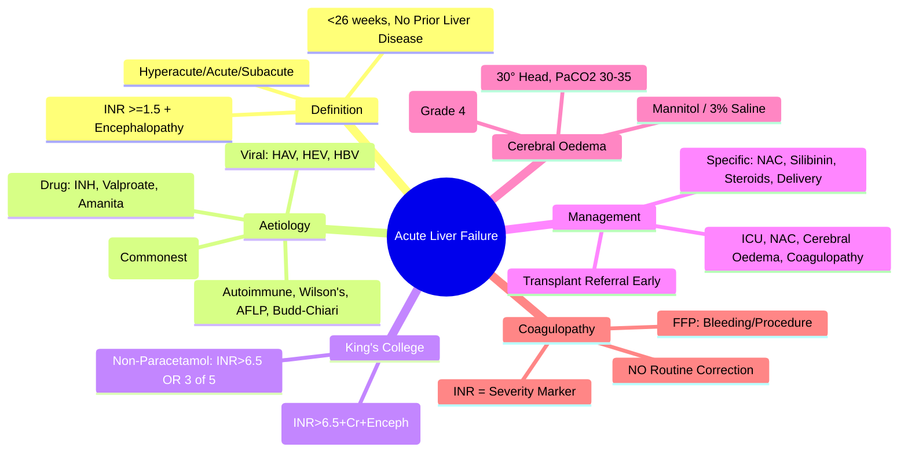

Related: [[Paracetamol (Acetaminophen) Poisoning]], [[Enhanced Elimination (Dialysis, Hemoperfusion)]], [[Critical Care Monitoring]], [[Inotropes and Vasopressors]]

> [!tip]
> **ALF = coagulopathy (INR ≥1.5) + encephalopathy in <26 weeks without prior liver disease**. **King's College Criteria** = transplant referral thresholds. **NAC** benefits even non-paracetamol ALF. **Cerebral oedema** = major cause of death. **Early transplant referral** = key. Key FCPS/MRCP: King's College Criteria (paracetamol vs non-paracetamol), cerebral oedema management, NAC in non-paracetamol ALF, transplant criteria, aetiology workup.

## 1. Learning Objectives
- Define ALF and differentiate from acute-on-chronic liver failure (ACLF)
- Apply King's College Criteria for transplant referral
- Manage cerebral oedema, coagulopathy, infection, renal failure
- Apply NAC in both paracetamol and non-paracetamol ALF
- Perform aetiology workup and initiate specific therapies

## 2. Definition
**Acute Liver Failure (ALF)** = **INR ≥1.5 + any degree of encephalopathy** in a patient **without prior liver disease** and **illness duration <26 weeks**.

**Sub-classification by tempo**:
- **Hyperacute**: encephalopathy within 7 days of jaundice (best prognosis: paracetamol, HAV)
- **Acute**: 8–28 days
- **Subacute**: 5–26 weeks (worst prognosis: drug-induced, autoimmune)

**NOT ACLF**: ACLF = acute decompensation in **cirrhotic** with organ failure(s) (CLIF-C ACLF score)

## 3. Aetiology (Common Causes)

| Category | Specific Causes |
|----------|-----------------|
| **Drug-induced** | **Paracetamol** (most common in UK/US), **isoniazid**, methotrexate, halothane, valproate, carbamazepine, herbal (kava, germander), **amatoxins** (Amanita) |
| **Viral** | **HEV** (common in endemic areas), HAV, HBV (acute/reactivation), HSV, VZV, EBV, CMV, yellow fever, dengue |
| **Autoimmune** | Autoimmune hepatitis (AIH), Wilson's disease (acute presentation) |
| **Vascular** | Budd-Chiari (hepatic vein thrombosis), acute portal vein thrombosis, ischaemic hepatitis (shock liver) |
| **Metabolic** | Acute fatty liver of pregnancy (AFLP), Reye's syndrome, hereditary fructose intolerance |
| **Idiopathic** | ~15–20% (seronegative) |

## 4. Clinical Features

### Encephalopathy (West Haven Grading)
| Grade | Features |
|-------|----------|
| **0** | Normal |
| **1** | Trivial lack of awareness, euphoria/irritability, reversed sleep cycle |
| **2** | Lethargy, disorientation, asterixis, inappropriate behaviour |
| **3** | Confused, incoherent, somnolent but arousable |
| **4** | Coma (unresponsive to pain) |

### Other Features
- **Jaundice** (often deep)
- **Coagulopathy**: INR ≥1.5 (often markedly elevated)
- **Renal impairment**: AKI (hepatorenal syndrome, ATN)
- **Metabolic**: hypoglycaemia, metabolic acidosis, hyperventilation, hyponatraemia
- **Infection**: high risk (spontaneous bacterial peritonitis, line sepsis, pneumonia)
- **Cerebral oedema**: **major cause of death** (especially Grade 3–4 encephalopathy)
- **Sepsis-like picture**: hyperdynamic circulation, hypotension

## 5. Investigations

### Mandatory
- **LFTs**: ALT, AST, ALP, bilirubin, albumin
- **INR** (daily — **trend more important than single value**)
- **Ammonia** (correlates with encephalopathy/cerebral oedema risk)
- **Glucose** (q2–4h — hypoglycaemia common)
- **ABG/VBG**: lactate, pH, base deficit
- **Renal function**: creatinine, urea, electrolytes
- **FBC**: thrombocytopenia common (sequestration, decreased production)
- **Viral serology**: HAV IgM, HBsAg/HBcIgM, HEV IgM/IgG, HSV/VZV PCR, CMV/EBV PCR
- **Autoimmune**: ANA, SMA, LKM1, IgG, caeruloplasmin (Wilson's)
- **Toxicology**: **paracetamol level** (mandatory — even if denied), drug screen
- **Pregnancy test** (AFLP, HELLP)
- **CT head** if Grade 3–4 encephalopathy (exclude bleed, assess oedema)

### Aetiology-Specific
- **Paracetamol level** (at 4h post-ingestion for nomogram; if >24h or staggered → treat empirically)
- **Caeruloplasmin + urinary copper** (Wilson's)
- **Amanita toxins** (specialised lab)
- **HEV RNA PCR** (if endemic)

## 6. King's College Criteria (Transplant Referral Indicators)

### Paracetamol-Induced ALF
**ANY ONE of:**
1. **Arterial pH <7.30** (after adequate fluid resuscitation) **OR**
2. **ALL THREE**:
   - INR >6.5
   - Creatinine >300 µmol/L (3.4 mg/dL)
   - **Grade III/IV encephalopathy**

### Non-Paracetamol ALF
**ANY ONE of:**
1. **INR >6.5** (or >3.5 if <10 yrs / >40 yrs) **OR**
2. **ANY THREE of:**
   - Age <10 or >40
   - **Aetiology**: drug-induced, indeterminate, HAV (non-A non-B)
   - **Jaundice to encephalopathy >7 days**
   - INR >3.5
   - **Bilirubin >300 µmol/L (17.5 mg/dL)**

> **Refer early**: transplant centre discussion at diagnosis of ALF; do NOT wait for all criteria.

## 7. Management

### 1. Supportive Care (All ALF)
- **ICU admission** (Grade ≥2 encephalopathy)
- **Airway**: intubate Grade ≥3 (protect airway, control ventilation)
- **Circulation**: noradrenaline for hypotension; balanced crystalloids; avoid fluid overload
- **Glucose**: **2–4 hourly monitoring**; 10% dextrose infusion to maintain 4–8 mmol/L
- **Ammonia**: monitor q6–12h; lactulose (if bowel sounds), rifaximin; consider L-ornithine-L-aspartate
- **Nutrition**: early enteral (protein 1.0–1.5 g/kg/day); avoid protein restriction
- **Infection surveillance**: daily cultures (blood, urine, sputum, ascites, line tips); **low threshold for antibiotics**
- **Renal**: monitor creatinine, fluid balance; CRRT if AKI + fluid overload
- **Liver transplant coordination**: **early referral** (King's College criteria)

### 2. Cerebral Oedema Management (Grade 3–4)
| Measure | Target |
|---------|--------|
| **Head elevation** | 30° (neutral neck position) |
| **Ventilation** | PaCO₂ 30–35 mmHg (mild hyperventilation) |
| **Osmotherapy** | **Mannitol 0.5–1 g/kg** bolus (if ICP signs) or **Hypertonic saline 3% 2–5 mL/kg** |
| **ICP monitoring** | Consider in Grade 4 (bolt/EVD) — controversial |
| **Sedation** | Propofol/midazolam (maintain light sedation, allow neuro checks) |
| **Seizure prophylaxis** | Phenytoin/levetiracetam (controversial — treat clinical seizures only) |
| **Avoid** | Hypotension, hypoxia, hypercapnia, fever, fluid overload, jugular compression |

> **Signs of raised ICP**: deteriorating GCS, fixed/dilated pupils, Cushing's reflex (HTN + brady + irregular breathing), posturing

### 3. Coagulopathy Management
- **Do NOT routinely correct INR** (INR = severity marker)
- **FFP** only for: active bleeding, pre-procedure (target INR <1.5), before RRT
- **Vitamin K** 10 mg IV daily (if prolonged INR + cholestasis/malnutrition)
- **Platelets** if <50×10⁹/L (or <100 if bleeding/procedure)
- **Recombinant factor VIIa** — **avoid** (thrombotic risk, no mortality benefit)

### 4. Specific Aetiology Therapies
| Aetiology | Specific Treatment |
|-----------|-------------------|
| **Paracetamol** | **NAC IV** (full course — even >24h; improves survival in non-paracetamol ALF too) |
| **Amanita** | **Silibinin** 5mg/kg load + 20mg/kg/day IV + **Penicillin G** 300–400K U/kg/day + NAC |
| **Viral (HAV, HBV)** | Supportive; **entecavir/tenofovir** for HBV |
| **AIH** | **Prednisolone 40–60 mg/day** (if biopsy confirms) |
| **Wilson's** | **Penicillamine/trientine**, zinc, **early transplant evaluation** |
| **AFLP** | **Immediate delivery** (cure); supportive |
| **Ischaemic hepatitis** | Treat underlying shock; supportive |

### 5. N-Acetylcysteine (NAC) in Non-Paracetamol ALF
- **Evidence**: **ALF Study Group (2009)** — NAC improves transplant-free survival in early coma (Grade 1–2) non-paracetamol ALF
- **Protocol**: same as paracetamol (SNAP 2-bag or 3-bag) — **start asap**
- **Benefit**: improves oxygen delivery, microcirculation, transplant-free survival

## 8. Complications
| Complication | Management |
|--------------|------------|
| **Cerebral oedema** | Head up 30°, hyperventilation (PaCO₂ 30–35), mannitol/hypertonic saline, ICP monitoring |
| **Sepsis** | Daily surveillance cultures; broad-spectrum antibiotics (meropenem/piperacillin-tazobactam) |
| **Renal failure (HRS/AKI)** | Terlipressin + albumin (HRS-AKI); CRRT if fluid overload/refractory |
| **Infection (SBP, pneumonia, line)** | Low threshold antibiotics; surveillance cultures |
| **Hypoglycaemia** | 10% dextrose infusion; q2–4h glucose checks |
| **Metabolic acidosis** | Bicarbonate if pH <7.2; CRRT if severe |
| **Pancreatitis** | Serum amylase/lipase; supportive |
| **Arrhythmias** | Electrolyte correction (K⁺, Mg²⁺, Ca²⁺); amiodarone if needed |

## 9. Prognosis
| Aetiology | Transplant-free Survival | With Transplant |
|-----------|-------------------------|-----------------|
| **Paracetamol** | 50–70% | ~80% |
| **Viral (HAV, HEV)** | 60–80% | ~80% |
| **Drug-induced (non-paracetamol)** | 20–40% | ~60% |
| **Indeterminate** | 15–30% | ~60% |
| **Autoimmune / Wilson's** | Variable (steroid/copper response) | ~70% |

**Poor prognostic markers** (non-paracetamol): age >40, jaundice-encephalopathy interval >7 days, high bilirubin, high INR, deep encephalopathy, renal failure, sepsis, metabolic acidosis, lack of NAC benefit.

## 10. FCPS/MRCP High-Yield Points
1. **ALF definition**: INR ≥1.5 + encephalopathy in <26 weeks, no prior liver disease
2. **King's College Criteria**: Paracetamol = pH<7.30 OR (INR>6.5 + Cr>300 + Grade III/IV); Non-paracetamol = INR>6.5 OR (any 3 of: age<10/>40, drug/indeterminate/HBV, jaundice-encephalopathy>7d, INR>3.5, bilirubin>300)
3. **Cerebral oedema** = major cause of death; manage with 30° head, PaCO₂ 30–35, mannitol/hypertonic saline
4. **NAC in non-paracetamol ALF** = improves transplant-free survival (early coma grades)
5. **Do NOT routinely correct INR** (INR = severity marker); FFP only for bleeding/procedure
6. **Ammonia** correlates with encephalopathy/oedema; lactulose/rifaximin
7. **Early transplant referral** at ALF diagnosis (King's College criteria)
7. **Specific therapies**: NAC (paracetamol + non-paracetamol), silibinin+penicillin G (Amanita), steroids (AIH), delivery (AFLP)
8. **Hypoglycaemia** = common, monitor q2–4h, 10% dextrose infusion
10. **Infection surveillance** = daily cultures; low threshold antibiotics

## 11. Common Viva Questions
1. King's College Criteria (paracetamol vs non-paracetamol)
2. Cerebral oedema management in ALF
3. Difference between ALF and ACLF
4. Role of NAC in non-paracetamol ALF
5. INR management (why not routinely correct?)
6. Ammonia management
7. Specific aetiologies and targeted therapies
8. Encephalopathy grading (West Haven)
9. Paracetamol vs non-paracetamol King's College criteria differences
10. AFLP management

## 12. Common Confusions / Exam Traps
- **INR correction** → NO (unless bleeding/procedure); INR = severity marker
- **Protein restriction** → NO (malnutrition risk); adequate protein 1.0–1.5g/kg
- **Prophylactic FFP** → NO (masks severity, volume overload, no survival benefit)
- **Mannitol vs hypertonic saline** → both ok; hypertonic saline preferred if Na⁺ low
- **Prophylactic anticonvulsants** → NO (treat clinical seizures only)
- **Protein restriction in encephalopathy** → NO (causes malnutrition)
- **Aggressive hyperventilation (PaCO₂<30)** → AVOID (cerebral vasoconstriction → ischaemia)
- **Early intubation for Grade 2** → NO, Grade ≥3 only
- **ACLF = ALF** → NO, ACLF = acute-on-chronic (cirrhosis + organ failures)
- **Transplant referral only when criteria met** → NO, refer AT DIAGNOSIS

## 13. Mnemonics
- **KING'S COLLEGE (PARACETAMOL)**: **pH <7.3** OR **INR>6.5 + Cr>300 + Enceph Grade 3/4**
- **KING'S COLLEGE (NON-PARACETAMOL)**: **INR>6.5** OR **ANY 3 of: Age<10/>40, Drug/Indeterminate/HBV, Jaundice-Enceph>7d, INR>3.5, Bilirubin>300**
- **CEREBRAL OEDEMA**: **30° Head**, **PaCO₂ 30–35**, **Mannitol/Hypertonic Saline**, **ICP Monitor**
- **INR MANAGEMENT**: **M**onitor **O**nly; **R**eplace **O**nly if **B**leeding/**P**rocedure
- **NAC IN NON-PARACETAMOL**: **E**arly **C**oma (G1–2) → **T**ransplant-free survival benefit
- **AMMONIA**: **L**actulose + **R**ifaximin; **A**mmonia >100–150 = oedema risk

## 14. Mind Map


## 15. Flowchart
```mermaid
flowchart TD
  A[Jaundice + Encephalopathy + INR>=1.5\nNo Prior Liver Disease\n<26 Weeks] --> B[ALF Diagnosis]
  B --> C[ICU Admission\nGrade >=2 Encephalopathy]
  C --> D[NAC Infusion\n(Start Immediately\nParacetamol + Non-Paracetamol)]
  C --> E[Grade Encephalopathy\nWest Haven Scale]
  E -->|Grade 3-4| F[Cerebral Oedema Protocol\n30° Head, PaCO2 30-35\nMannitol/3% Saline]
  C --> G[King's College Criteria\nParacetamol vs Non-Paracetamol]
  G -->|Met| H[Transplant Referral\nImmediate]
  G -->|Not Met| I[Continue Supportive\nDaily King's Reassessment]
  C --> J[Specific Aetiology Workup\nParacetamol Level, Viral, Autoimmune, Wilson's]
  J --> K{Specific Therapy?}
  K -->|Paracetamol| L[Continue NAC Full Course]
  K -->|Amanita| M[Silibinin + Penicillin G + NAC]
  K -->|AIH| N[Prednisolone 40-60mg]
  K -->|AFLP| O[Immediate Delivery]
  K -->|Wilson's| P[Penicillamine + Transplant]
  L --> P
  M --> P
  N --> P
  O --> P
```

## 16. Suggested Visuals / Image Notes
- King's College Criteria comparison table (paracetamol vs non-paracetamol)
- West Haven encephalopathy grading
- Cerebral oedema management algorithm
- Aetiology-based specific therapies table

## 17. Suggested Video References
- ALF management (King's College criteria, cerebral oedema)
- NAC in non-paracetamol ALF evidence
- Transplant referral pathway

## 18. One-Page Revision Summary
- **ALF**: INR ≥1.5 + encephalopathy, no prior liver disease, <26 weeks
- **King's College**: Paracetamol = pH<7.3 OR (INR>6.5+Cr>300+Enceph 3/4); Non-paracetamol = INR>6.5 OR 3 of 5
- **Cerebral oedema**: 30° head, PaCO₂ 30–35, mannitol/hypertonic saline, avoid aggressive hyperventilation
- **NAC**: ALL ALF (paracetamol + non-paracetamol) — improves survival in non-paracetamol G1–2
- **INR**: do NOT correct routinely; FFP only for bleeding/procedure
- **Ammonia**: lactulose + rifaximin; >100–150 = oedema risk
- **Specific therapies**: NAC (all), silibinin+penicillin G (Amanita), steroids (AIH), delivery (AFLP)
- **Early transplant referral** at diagnosis (King's College)
- **Hypoglycaemia**: q2–4h glucose, 10% dextrose

## 24-Hour Recall Prompts
- State King's College Criteria for paracetamol vs non-paracetamol
- List cerebral oedema management targets
- Explain why INR not routinely corrected
- State NAC role in non-paracetamol ALF

## 7-Day / 15-Day / 30-Day Revision Tracker
- [ ] Day 1 completed
- [ ] 24-hour recall completed
- [ ] Day 7 revision completed
- [ ] Day 15 revision completed
- [ ] Day 30 revision completed

## 19. Must Know / Should Know / Nice to Know
### Must Know
- ALF definition (INR≥1.5 + encephalopathy)
- King's College Criteria (paracetamol vs non-paracetamol)
- Cerebral oedema management (30°, PaCO₂ 30–35, mannitol/3% saline)
- NAC in ALL ALF (paracetamol + non-paracetamol)
- INR = severity marker, do not routinely correct
- Early transplant referral

### Should Know
- West Haven grading
- Specific aetiology therapies (silibinin, steroids, delivery)
- Ammonia management (lactulose + rifaximin)
- Hypoglycaemia monitoring
- Renal failure management (terlipressin + albumin → CRRT)

### Nice to Know
- Hyperacute/acute/subacute prognosis differences
- Wilson's disease specific management
- MARS/Plasma exchange as bridge
- Biomarkers (phosphatase, factor V, lactate)
- Post-transplant immunosuppression

## 20. Self-Test Scorecard
- Understanding: /10
- Recall: /10
- MCQ Performance: /10
- SBA Performance: /10
- Viva Confidence: /10
- Total: /50

> [!tip]
> Interpretation: <35 = weak topic, 35-44 = acceptable but insecure, 45+ = strong exam-ready topic.

## 21. Exam Answer Modes
### Long Answer Skeleton
- Definition + aetiology table
- King's College Criteria (paracetamol vs non-paracetamol)
- Encephalopathy grading
- Investigations
- Management: supportive → specific aetiology → cerebral oedema → coagulopathy → transplant
- Prognosis

### Short Note Skeleton
- King's College comparison table
- Cerebral oedema box
- Specific therapies table
- INR management box

### Viva One-Liners
- "ALF = INR≥1.5 + encephalopathy, no prior liver disease, <26 weeks"
- "King's College: paracetamol = pH<7.3 OR (INR>6.5+Cr>300+G3/4); non-paracetamol = INR>6.5 OR 3 of 5"
- "Cerebral oedema: 30° head, PaCO₂ 30–35, mannitol/3% saline, NO aggressive hyperventilation"
- "NAC in ALL ALF — improves transplant-free survival in non-paracetamol G1–2"
- "INR = severity marker — do NOT routinely correct; FFP only bleeding/procedure"
- "Ammonia: lactulose + rifaximin; >100–150 = oedema risk"
- "Early transplant referral at ALF diagnosis"
- "Specific: Amanita = silibinin+penicillin G; AIH = steroids; AFLP = delivery"
- "Hypoglycaemia = monitor q2–4h, 10% dextrose"

### Ward-Case Discussion Points
- Paracetamol OD 18h ago, INR 2.5, GCS 12 → NAC full course, King's College monitoring
- ALF Grade 3 encephalopathy, INR 5.0, ammonia 180 → cerebral oedema protocol + lactulose/rifaximin
- Young woman 36w pregnant, nausea, elevated LFTs → AFLP? immediate delivery + supportive
- Mushroom ingestion, delayed presentation → Amanita? silibinin + penicillin G + NAC + transplant eval

### Last-Night-Before-Exam Sheet
- ALF: INR≥1.5 + Encephalopathy (<26 wks)
- King's Paracetamol: pH<7.3 OR (INR>6.5+Cr>300+G3/4)
- King's Non-Paracetamol: INR>6.5 OR 3of5
- Cerebral Oedema: 30°, PaCO2 30-35, Mannitol/3% Saline
- NAC: ALL ALF (Paracetamol + Non-Paracetamol)
- INR: Severity Marker - NO Routine Correction
- Specific: Silibinin+PenG (Amanita), Steroids (AIH), Delivery (AFLP)
- Hypoglycaemia: q2-4h Glucose

## 22. Summary
ALF = INR ≥1.5 + encephalopathy in <26 weeks without prior liver disease. **King's College Criteria**: Paracetamol = pH<7.3 OR (INR>6.5 + Cr>300 + Grade 3/4 encephalopathy); Non-paracetamol = INR>6.5 OR any 3 of 5 (age<10/>40, drug/indeterminate/HBV, jaundice-encephalopathy>7d, INR>3.5, bilirubin>300). **Cerebral oedema**: 30° head elevation, PaCO₂ 30–35 mmHg, mannitol/hypertonic saline. **NAC in ALL ALF** (improves transplant-free survival in non-paracetamol). **INR = severity marker — do NOT routinely correct**. **Early transplant referral** per King's College. **Specific**: NAC (all), silibinin+penicillin G (Amanita), steroids (AIH), delivery (AFLP). **Hypoglycaemia** monitor q2–4h.

## 23. MCQs (10)
1. Acute liver failure (ALF) is defined as development of encephalopathy and coagulopathy in:
   A. A patient with pre-existing cirrhosis
   B. **A patient without pre-existing liver disease, within 8 weeks of symptom onset**
   C. Any patient with jaundice
   D. After 6 months of liver disease

2. Most common cause of ALF in the UK:
   A. Viral hepatitis A
   B. **Paracetamol (acetaminophen) overdose**
   C. Wilson's disease
   D. Autoimmune hepatitis

3. King's College Criteria for paracetamol-induced ALF — indication for transplant:
   A. pH <7.4 alone
   B. **pH <7.3 OR (INR >6.5 + Cr >300 + grade 3–4 encephalopathy)**
   C. ALT >1000
   D. Bilirubin >300

4. Cerebral oedema in ALF is treated with:
   A. Steroids
   B. **Mannitol 0.5–1 g/kg + hypertonic saline + head elevation + consider cooling**
   C. Vitamin K
   D. NAC

5. N-acetylcysteine (NAC) is indicated in:
   A. All ALF
   B. **Paracetamol-induced ALF (and may benefit non-paracetamol)**
   C. Viral ALF
   D. Wilson's disease

6. Coagulopathy in ALF (raised INR) — when to transfuse FFP:
   A. Always
   B. **Only if bleeding or pre-procedure (avoid routine correction — masks trend)**
   C. INR >5
   D. Never

7. Hepatorenal syndrome (HRS) treatment:
   A. Dopamine
   B. **Terlipressin + albumin (or noradrenaline + albumin)**
   C. Loop diuretic
   D. Paracetamol

8. Hypoglycaemia in ALF is treated with:
   A. 0.9% saline
   B. **10% dextrose infusion (continuous)**
   C. Insulin
   D. Glucagon

9. Sepsis in ALF — common organisms:
   A. Gram-positive only
   B. **Gram-positive and gram-negative (esp. S. aureus, E. coli, candida)**
   C. Viral only
   D. None

10. Indications for emergency liver transplant in ALF include:
    A. Jaundice alone
    B. **King's College Criteria met, irreversible cause, no contraindications**
    C. ALT >1000
    D. AST >1000

## 24. SBA Questions (10)
1. A 25-year-old took 30 g paracetamol, presents 36 h later with vomiting, INR 4, ALT 5000. Management:
   A. Discharge
   B. **NAC infusion + transfer to liver unit + monitor for ALF**
   C. Vitamin K
   D. Antiemetics only

2. ALF with pH 7.20, INR 8, Cr 350, encephalopathy grade 3. Next step:
   A. Palliative care
   B. **Urgent liver transplant evaluation (King's College Criteria met)**
   C. NAC
   D. Wait 48 h

3. A 30-year-old with ALF, sudden GCS drop, unequal pupils. Management:
   A. CT head
   B. **Treat as raised ICP — mannitol 0.5–1 g/kg + hypertonic saline + intubate if GCS ≤8**
   C. NAC
   D. Steroids

4. Coagulopathy in ALF (INR 6) without active bleeding. Management:
   A. FFP
   B. **No FFP — monitor INR as prognostic marker; transfuse only if bleeding/pre-procedure**
   C. Vitamin K
   D. Cryoprecipitate

5. ALF patient, Na⁺ 125, GCS 10. Differential:
   A. SIADH
   B. **Cerebral oedema / hyponatraemia worsening cerebral oedema**
   C. Hypovolaemia
   D. Cerebral salt wasting

6. Hyponatraemia (Na⁺ 125) in ALF. Management:
   A. 0.9% saline bolus
   B. **Hypertonic saline 3% 100–250 mL + fluid restriction + treat cerebral oedema**
   C. Vaptans
   D. Demeclocycline

7. ALF with sepsis — empirical antibiotics:
   A. None
   B. **Broad-spectrum (e.g., piperacillin-tazobactam) + antifungal cover (high risk)**
   C. Penicillin V
   D. Aminoglycoside only

8. Ammonia-lowering therapies in ALF hepatic encephalopathy:
   A. L-DOPA
   B. **Lactulose + rifaximin + consider L-ornithine L-aspartate (LOLA)**
   C. Steroids
   D. NAC

9. A young woman, ALF, ANA+, IgG↑, anti-smooth muscle antibody+. Diagnosis:
   A. Wilson's
   B. **Autoimmune hepatitis (AIH)**
   C. Viral hepatitis
   D. PBC

10. ALF, INR 10, fibrinogen 0.8, bleeding from line site. Best product:
    A. Platelet
    B. **FFP + cryoprecipitate (fibrinogen <1)**
    C. Vitamin K
    D. Saline

## 25. Flashcards
- Q: ALF definition
  A: Severe acute liver injury with encephalopathy + coagulopathy in patient without pre-existing liver disease (within 8 weeks)
- Q: Most common ALF cause UK
  A: Paracetamol overdose
- Q: King's College Criteria (paracetamol)
  A: pH <7.3 OR INR >6.5 + Cr >300 + grade 3–4 encephalopathy
- Q: NAC indication
  A: Paracetamol-induced ALF (may benefit non-paracetamol)
- Q: Cerebral oedema treatment
  A: Mannitol + hypertonic saline + head-up 30°
- Q: HRS treatment
  A: Terlipressin + albumin
- Q: Hypoglycaemia in ALF
  A: 10% dextrose infusion
- Q: FFP in ALF
  A: Only if bleeding or pre-procedure (don't mask INR trend)
- Q: Sepsis in ALF
  A: Broad-spectrum antibiotics + antifungal cover
- Q: AIH diagnosis
  A: ANA+, ASMA+, IgG↑, liver biopsy
- Q: Hepatic encephalopathy
  A: Lactulose + rifaximin
- Q: Ammonia target
  A: Reduce with lactulose, rifaximin, LOLA

## 26. Answer Key with Explanations
### MCQs
1. **B** — ALF: no pre-existing liver disease, within 8 weeks of symptoms.
2. **B** — Paracetamol is the most common cause in UK.
3. **B** — King's College paracetamol: pH <7.3 OR INR >6.5 + Cr >300 + grade 3–4 encephalopathy.
4. **B** — Cerebral oedema: mannitol + hypertonic saline + head-up + cooling.
5. **B** — NAC for paracetamol; may benefit non-paracetamol.
6. **B** — FFP only if bleeding or pre-procedure.
7. **B** — HRS: terlipressin + albumin.
8. **B** — Hypoglycaemia: 10% dextrose infusion.
9. **B** — Sepsis: gram + and - (S. aureus, E. coli, candida).
10. **B** — Transplant: King's College met, irreversible, no contraindications.

### SBAs
1. **B** — Late paracetamol overdose → NAC + transfer to liver unit.
2. **B** — King's College met → urgent transplant evaluation.
3. **B** — Treat as raised ICP.
4. **B** — Don't correct INR if no bleeding (prognostic marker).
5. **B** — Hyponatraemia worsens cerebral oedema.
6. **B** — Hypertonic saline + treat cerebral oedema.
7. **B** — Broad-spectrum + antifungal cover.
8. **B** — Lactulose + rifaximin.
9. **B** — AIH: ANA+, ASMA+, IgG↑.
10. **B** — FFP + cryoprecipitate for bleeding with low fibrinogen.

## PasTest Scenario SBAs (Clinical Vignettes)

> **Auto-generated PasTest/Mediscope-style scenario SBAs** grounded in the authored source. Each scenario tests a real clinical fact (triad, specific sign, contraindication, trial, first-line Rx) extracted from the topic. *Source: Ch 10: Acute Medicine — Acute Liver Failure*

**Q1.** What is the most appropriate first-line therapy for Acute Liver Failure?

  - **A.** Protocol + start asap
  - **B.** An advanced/surgical therapy reserved for refractory disease
  - **C.** Symptomatic treatment only, no disease-modifying therapy
  - **D.** Empiric broad-spectrum therapy without specific indication

  > **Answer: A** — Protocol + start asap
  >
  > *Source:* **Protocol**: same as paracetamol (SNAP 2-bag or 3-bag) — **start asap**

