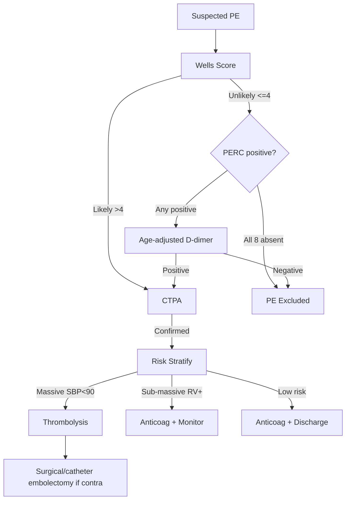
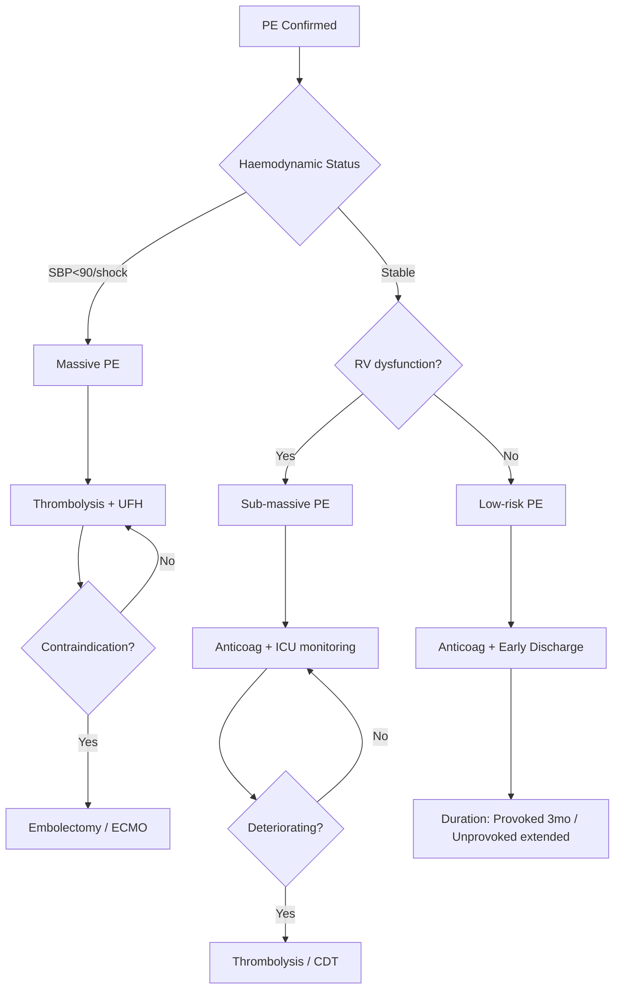

Related: [[Obstructive Shock]], [[Cardiac Arrest & Post-Resuscitation Care]], [[Acute Medicine in Pregnancy]]

> [!important]
> **PE = acute obstruction of pulmonary arterial tree** by thrombus (usually from DVT). **Triad**: dyspnoea + pleuritic chest pain + haemoptysis (only 20%). **Wells score** for pre-test probability; **PERC** to rule out in low risk. **CTPA** = gold standard. **Massive PE (obstructive shock) → thrombolysis** (tenecteplase/alteplase) or **surgical/catheter embolectomy**. Most PE: anticoagulation (LMWH, then DOAC). FCPS/MRCP: Wells, PERC, CTPA vs V/Q, RV dysfunction on echo/CT, thrombolysis criteria, IVC filter indications, pregnancy management.

## 1. Learning Objectives
- Diagnose PE using clinical probability (Wells, Geneva, PERC)
- Order appropriate investigations (D-dimer, CTPA, V/Q, echo, leg US)
- Risk stratify (massive, sub-massive, low-risk)
- Manage: anticoagulation (LMWH/DOAC), thrombolysis, embolectomy, IVC filter
- Manage PE in pregnancy
- Identify and treat chronic complications (CTEPH)

## 2. Definition & Pathophysiology
- **PE = thromboembolism of pulmonary arteries**
- **Source**: 90% from DVT (iliac/femoral/popliteal); right heart; septic emboli (IVDU); air; fat; amniotic fluid
- **Virchow's triad**: stasis, endothelial injury, hypercoagulability
- **Consequences**: V/Q mismatch (dead space), hypoxaemia, RV strain, obstructive shock, sudden death

## 3. Classification (Severity-Based)
| Severity | Definition | Mortality | Treatment |
|----------|------------|-----------|-----------|
| **Massive (high-risk)** | SBP <90 mmHg or shock | >30% | **Thrombolysis** ± embolectomy |
| **Sub-massive (intermediate-risk)** | RV dysfunction +/− troponin↑; haemodynamically stable | 5–15% | Anticoagulation; consider thrombolysis if deteriorating |
| **Low-risk** | Normotensive, no RV dysfunction, normal biomarkers | <1% | Anticoagulation; early discharge |

## 4. Risk Factors (Virchow's Triad)

### Stasis
- Immobilisation (post-op, long travel, bed rest)
- Pregnancy, postpartum
- Heart failure
- Varicose veins

### Endothelial injury
- Surgery (especially orthopaedic, abdominal/pelvic, cancer)
- Trauma, fractures
- Central lines, pacemakers
- Previous DVT/PE

### Hypercoagulability (Thrombophilia)
- **Inherited**: Factor V Leiden, Prothrombin G20210A, Protein C/S def, Antithrombin def
- **Acquired**: Cancer, OCP/HRT, pregnancy, antiphospholipid syndrome, nephrotic syndrome, smoking, obesity
- **Strong**: Major surgery, hip/knee replacement, cancer (esp. pancreatic, ovarian, brain), recent hospitalisation

## 5. Clinical Features
| Symptom | Frequency |
|---------|-----------|
| Dyspnoea | 73% |
| Pleuritic chest pain | 66% |
| Cough | 37% |
| Haemoptysis | 13% |
| Syncope | 13% (massive) |
| **Signs** | |
| Tachypnoea (RR >20) | 70% |
| Tachycardia (HR >100) | 30% |
| Hypoxia (SpO₂ <90%) | Variable |
| Raised JVP | Massive |
| Pleural rub | 3% |
| Calf swelling/tenderness | 11% |
| Loud P2 (pulmonary HTN) | 23% |
| Hypotension (massive) | ~10% |

## 6. Investigations

### Bedside
- **ECG**: sinus tachy (most common), S1Q3T3 (specific but rare), RBBB, TWI V1–V4 (RV strain)
- **ABG**: hypoxaemia, hypocapnia (respiratory alkalosis), A-a gradient ↑
- **Capnography**: ETCO₂ ↓

### Risk Stratification Tests
- **Troponin / hs-Troponin**: elevated → RV microinfarction → intermediate-high risk
- **BNP / NT-proBNP**: elevated → RV strain
- **D-dimer**: sensitive, not specific. **RULES OUT** PE if negative in low/moderate pre-test (age-adjusted threshold: age × 10 ng/mL in >50y)

### Imaging
- **CTPA (CT pulmonary angiography)** = **gold standard** (sensitivity 83%, specificity 96%)
- **V/Q scan** — alternative if CTPA contraindicated (renal failure, contrast allergy, pregnancy)
- **Compression ultrasound (CUS) of legs** — if PE confirmed, identifies DVT source
- **Bedside echocardiography** — RV dilatation, 60/60 sign, McConnell sign, free-floating thrombus
- **CXR** — usually normal; Westermark sign (oligaemia), Hampton's hump (wedge infarct)
- **CT RV/LV ratio >1.0** = RV dysfunction (on CTPA)

### Modified Wells Score
| Criterion | Points |
|-----------|--------|
| Clinical signs of DVT | 3.0 |
| PE most likely diagnosis | 3.0 |
| HR >100 | 1.5 |
| Immobilisation/surgery (4 weeks) | 1.5 |
| Previous DVT/PE | 1.5 |
| Haemoptysis | 1.0 |
| Cancer | 1.0 |
| **Total** | **>4 = likely; ≤4 = unlikely** |

### PERC Rule (apply if Wells "unlikely")
If **all 8** are negative → PE excluded, no D-dimer needed:
- Age ≥50
- HR ≥100
- SpO₂ <95%
- Haemoptysis
- Oestrogen use
- Prior DVT/PE
- Unilateral leg swelling
- Surgery/trauma (4 weeks)

## 7. Management

### General (All PE)
- **Oxygen** to SpO₂ 94–98%
- **Analgesia** (paracetamol, morphine if severe)
- **IV fluids cautiously** (RV failure risk — small boluses 250 mL only if hypotensive)
- **Compression stockings** if symptomatic DVT
- **Avoid** immobility

### Anticoagulation
| Drug | Initial | Duration |
|------|---------|----------|
| **LMWH (enoxaparin)** | 1 mg/kg SC BD | 5–10 days (until oral) |
| **Fondaparinux** | 5–10 mg SC daily (weight-adjusted) | 5–10 days |
| **UFH** | 80 U/kg bolus + 18 U/kg/h infusion | First-line in massive PE/renal failure |
| **Apixaban** | 10 mg BD × 7 d, then 5 mg BD | 3–6 months (provoked); extended (unprovoked) |
| **Rivaroxaban** | 15 mg BD × 21 d, then 20 mg OD | Same as above |
| **Dabigatran** | LMWH 5 days, then 150 mg BD | Same as above |
| **Warfarin** | LMWH overlap until INR 2–3 | Same as above (rare) |

> LMWH preferred in **pregnancy** and **cancer** (or DOACs in cancer — select trials)

### Thrombolysis
- **Indication**: **Massive PE** (haemodynamic instability: SBP <90, shock, cardiac arrest)
- **Regimens**:
  - **Alteplase 100 mg IV over 2 h** (10 mg bolus + 90 mg infusion)
  - **Tenecteplase weight-adjusted single bolus** (e.g., 50 mg if <60 kg; max 50 mg)
- **Adjunctive UFH** infusion after thrombolysis
- **Contraindications**: active bleeding, recent surgery (2–3 weeks), recent stroke (3 months), intracranial neoplasm
- **Major bleed risk**: ~2% intracranial haemorrhage

### Surgical / Catheter Embolectomy
- **Surgical embolectomy** — if thrombolysis contraindicated/failed
- **Catheter-directed thrombolysis** (CDT) — local low-dose, less bleeding risk; emerging option

### IVC Filter
- **Indications**: recurrent PE despite anticoagulation, bleeding preventing anticoagulation, very poor cardiopulmonary reserve
- **Types**: retrievable (preferred) vs permanent
- **Remove** once safe to anticoagulate

### Sub-Massive PE — Controversial
- **Anticoagulation** standard
- **Thrombolysis** if deteriorating (no clear mortality benefit, more bleeds — PEITHO trial)
- **Catheter-directed therapy** emerging
- **Close monitoring** in HDU/ICU

### Duration of Anticoagulation
- **Provoked (surgery, immobility, OCP)**: **3 months**
- **Unprovoked**: ≥3 months, consider extended (recurrence risk 5–10%/y after stopping)
- **Cancer**: **extended** (LMWH or DOAC)
- **Recurrent**: **indefinite**
- **CTEPH**: indefinite + specific therapy

## 8. Massive PE Algorithm
1. **Support ABC** + 100% O₂
2. **IV access** + fluid (small 250 mL bolus cautiously)
3. **If SBP <90** → **noradrenaline** to MAP ≥65
4. **Confirm PE** (echo, CTPA if possible — but do not delay)
5. **Thrombolysis** (alteplase 100 mg/2 h or tenecteplase bolus)
6. **+/- UFH infusion** after thrombolysis
7. **If thrombolysis contraindicated** → **surgical/catheter embolectomy**
8. **+/- ECMO** as bridge

## 9. PE in Pregnancy
- **Suspect** with dyspnoea, pleuritic pain, syncope
- **D-dimer** less useful (elevated normally in pregnancy)
- **Compression ultrasound of legs first** (no radiation)
- **V/Q scan preferred** to CTPA (lower fetal radiation); CTPA acceptable
- **LMWH** (enoxaparin) for treatment; **avoid DOACs and warfarin** (teratogenic)
- **Warfarin** ok postpartum + breastfeeding
- **Thrombolysis** reserved for life-threatening PE
- **IVC filter** if anticoagulation contraindicated

## 10. Chronic Complications
- **CTEPH (chronic thromboembolic pulmonary hypertension)** — 0.5–3% of PE
  - Progressive dyspnoea, RV failure
  - Diagnose: V/Q scan, right heart catheterisation
  - **Treatment**: lifelong anticoagulation + **pulmonary endarterectomy** (curative)
  - Riociguat (sGC stimulator) if inoperable

## 11. Prognosis
- **Massive PE**: mortality 30–60% if untreated; 10–20% with thrombolysis
- **Low-risk PE**: <1% mortality
- **Recurrence**: 5–10%/y after stopping anticoagulation in unprovoked
- **CTEPH**: 0.5–3% within 2 years

## 12. FCPS/MRCP High-Yield Points
1. **Wells >4 = likely**; ≤4 = unlikely
2. **PERC rule** to rule out in low risk
3. **D-dimer** = sensitive not specific; age-adjusted threshold (age × 10 ng/mL if >50)
4. **CTPA = gold standard**; V/Q if CTPA contraindicated (pregnancy, renal failure, contrast allergy)
5. **S1Q3T3** = classic but rare ECG finding
6. **Massive PE** (SBP <90) = **thrombolysis** (alteplase 100 mg/2h or tenecteplase)
7. **Sub-massive PE** = RV dysfunction/troponin↑; anticoagulation ± consider CDT
8. **LMWH first-line** in most PE
9. **LMWH in pregnancy**; DOACs and warfarin contraindicated (warfarin teratogenic)
10. **Apixaban/Rivaroxaban** = oral, no LMWH lead-in for rivaroxaban
11. **IVC filter** if anticoagulation contraindicated or recurrent PE
12. **Provoked PE**: 3 months anticoagulation; **unprovoked**: extended
13. **CTEPH**: V/Q scan, pulmonary endarterectomy
14. **ECMO** as bridge in massive PE

## 13. Common Viva Questions
1. Wells score and PERC rule
2. Massive vs sub-massive vs low-risk PE
3. Anticoagulation regimens in PE
4. Thrombolysis indications, agents, contraindications
5. PE in pregnancy
6. IVC filter indications
7. CT findings of PE (CTPA)
8. CTEPH and pulmonary endarterectomy
9. RV dysfunction on echo
10. Duration of anticoagulation

## 14. Common Confusions / Exam Traps
- **D-dimer rules out, doesn't rule in** (high false positive in elderly, cancer, pregnancy)
- **Wells "unlikely" + negative D-dimer = exclude PE** (no imaging needed)
- **Massive PE = thrombolysis** (despite bleeding risk)
- **CTEPH** can occur after "minor" PE
- **Cancer PE** = extended anticoagulation, LMWH or DOAC
- **Pregnancy PE**: LMWH, not DOAC; V/Q over CTPA
- **IVC filter** for recurrent PE on anticoagulation, not first-line
- **Sub-massive PE**: NO routine thrombolysis (PEITHO)
- **Perioperative PE** (recent surgery): thrombolysis often contraindicated → embolectomy

## 15. Mnemonics
- **Wells >4 = likely**: **DVT, PE most likely, HR>100, Immobile, Prev, Haemoptysis, Cancer**
- **PERC (8 criteria)**: All absent → PE excluded
- **PE Triad**: **D**yspnoea + **P**leuritic + **H**aemoptysis (rare)
- **S1Q3T3**: PE
- **ECG**: **T**achy + **RBBB** + **TWI V1–V4**
- **Anticoagulants** (cancer): **LMWH** or **Apixaban** (SELECT trial)
- **Thrombolysis**: **Alteplase 100 mg/2 h** OR **Tenecteplase bolus**
- **Pregnancy**: **LMWH** (not DOAC, not warfarin 1st trimester)
- **CTEPH**: **V/Q** scan + **pulmonary endarterectomy**
- **Provoked**: **3 months**; **Unprovoked**: **≥3 months, often extended**

## 16. Mind Map
```mermaid
mindmap
  root((Acute PE))
    Risk Factors
      Stasis (immobility, pregnancy, HF)
      Endothelial injury (surgery, trauma)
      Hypercoagulability (Factor V Leiden, cancer, OCP)
    Wells Score
      DVT signs (3)
      PE most likely (3)
      HR>100 (1.5)
      Immobile/surgery (1.5)
      Previous DVT/PE (1.5)
      Haemoptysis (1)
      Cancer (1)
      >4 likely / <=4 unlikely
    PERC
      8 criteria
      All absent -> exclude
    Investigations
      D-dimer (sensitive)
      CTPA gold standard
      V/Q (pregnancy, contrast contra)
      Echo (RV dysfunction)
      Troponin, BNP
    Severity
      Massive (SBP<90): thrombolysis
      Sub-massive (RV dysfn): anticoag, monitor
      Low-risk: anticoag, early discharge
    Management
      Anticoagulation
        LMWH (enoxaparin 1mg/kg BD)
        Apixaban, Rivaroxaban, Dabigatran
        Fondaparinux, UFH
      Thrombolysis
        Alteplase 100mg/2h
        Tenecteplase bolus
      Embolectomy
        Surgical / Catheter
        ECMO bridge
      IVC Filter
        Anticoag contraindicated
        Recurrent on anticoag
    Duration
      Provoked: 3 months
      Unprovoked: extended
      Cancer: indefinite
    Special
      Pregnancy: LMWH, V/Q, avoid DOAC
      CTEPH: V/Q, endarterectomy
```

## 17. Flowchart — PE Diagnosis


## 18. Flowchart — PE Management


## 19. One-Page Revision Summary
- **Wells >4 = likely; PERC → D-dimer** (age-adjusted in >50)
- **CTPA = gold standard**; V/Q in pregnancy/contrast contraindication
- **Massive PE (SBP <90)** → **thrombolysis** (alteplase 100 mg/2 h or tenecteplase bolus)
- **Sub-massive PE** (RV dysfunction) → anticoagulation + close monitoring
- **Low-risk PE** → LMWH or DOAC, early discharge
- **LMWH** (enoxaparin 1 mg/kg BD) first-line in most
- **Apixaban/Rivaroxaban** oral alternatives
- **Pregnancy** → LMWH (not DOAC, not warfarin 1st trimester)
- **Provoked**: 3 months; **Unprovoked**: extended
- **CTEPH**: V/Q scan, endarterectomy
- **IVC filter** if anticoag contraindicated or recurrent

## 24-Hour Recall Prompts
- State Wells score criteria
- State PERC rule
- Outline PE management by severity
- List thrombolysis indications, agents, contraindications
- Describe PE in pregnancy management

## 7-Day / 15-Day / 30-Day Revision Tracker
- [ ] Day 1 completed
- [ ] 24-hour recall completed
- [ ] Day 7 revision completed
- [ ] Day 15 revision completed
- [ ] Day 30 revision completed

## 20. Must Know / Should Know / Nice to Know
### Must Know
- Wells score
- PERC rule
- D-dimer interpretation (age-adjusted)
- CTPA = gold standard
- Massive PE = thrombolysis
- LMWH first-line
- Pregnancy: LMWH
- Anticoagulation duration
- IVC filter indications

### Should Know
- Sub-massive PE management
- DOACs (apixaban, rivaroxaban)
- Echo findings (60/60, McConnell)
- Thrombolysis contraindications
- Embolectomy indications
- CTEPH
- V/Q vs CTPA

### Nice to Know
- CDT (catheter-directed thrombolysis)
- ECMO in massive PE
- Thrombophilia testing (when)
- Inherited thrombophilias
- Pulmonary endarterectomy details
- ECMO bridge

## 21. Self-Test Scorecard
- Understanding: /10
- Recall: /10
- MCQ Performance: /10
- SBA Performance: /10
- Viva Confidence: /10
- Total: /50

> [!tip]
> Interpretation: <35 = weak topic, 35-44 = acceptable but insecure, 45+ = strong exam-ready topic.

## 22. Exam Answer Modes
### Long Answer Skeleton
- Definition + pathophysiology + risk factors
- Clinical features
- Investigations (Wells, PERC, D-dimer, CTPA, V/Q, echo, troponin, BNP)
- Risk stratification (massive, sub-massive, low-risk)
- Management by severity (anticoagulation, thrombolysis, embolectomy, IVC filter)
- Special situations (pregnancy, cancer)
- Duration of anticoagulation
- Complications (CTEPH, recurrence)

### Short Note Skeleton
- Wells + PERC table
- Severity classification
- Anticoagulation regimens
- Thrombolysis agents
- Pregnancy management

### Viva One-Liners
- "Wells >4 likely; PERC all absent excludes PE"
- "CTPA = gold standard; V/Q in pregnancy"
- "D-dimer: sensitive, not specific; age-adjusted in >50"
- "Massive PE = SBP <90 → thrombolysis (alteplase 100 mg/2 h)"
- "LMWH first-line; apixaban/rivaroxaban oral alternatives"
- "Pregnancy: LMWH (not DOAC, not warfarin 1st trimester)"
- "Provoked: 3 months; unprovoked: extended"
- "IVC filter: anticoag contraindicated or recurrent PE"
- "CTEPH: V/Q + pulmonary endarterectomy"
- "S1Q3T3 = classic PE ECG (rare)"

### Ward-Case Discussion Points
- 60-year-old post-op, dyspnoea, Wells 6, CTPA + PE, no RV dysfunction → LMWH, rivaroxaban transition, 3 months
- 50-year-old, collapse, SBP 75, HR 130, RV dilated on echo → massive PE, thrombolysis (alteplase), ICU
- 30-week pregnant, SOB, CUS shows DVT → LMWH, V/Q scan
- Unprovoked PE in 40-year-old → extended anticoagulation
- Recurrent PE despite anticoagulation → IVC filter

### Last-Night-Before-Exam Sheet
- Wells >4 likely; PERC → D-dimer
- CTPA gold standard
- Massive = thrombolysis (alteplase 100 mg/2 h)
- LMWH 1 mg/kg BD first-line
- Pregnancy = LMWH
- Provoked = 3 months; unprovoked = extended
- IVC filter if anticoag contraindicated
- CTEPH: V/Q + endarterectomy
- S1Q3T3 = PE
- RV:LV >1 = RV dysfunction

## 23. Summary
**Acute PE** = thromboembolism of pulmonary arteries, usually from DVT. **Wells score** (DVT signs, PE most likely, HR>100, immobile, prev, haemoptysis, cancer) >4 likely. **PERC rule** (8 criteria) excludes PE if all absent in low risk. **D-dimer** sensitive but not specific; age-adjusted threshold (age × 10 ng/mL in >50). **CTPA = gold standard**; V/Q in pregnancy/contrast contraindication. **Severity**: Massive (SBP<90) = **thrombolysis** (alteplase 100 mg/2 h or tenecteplase bolus); Sub-massive (RV dysfunction) = anticoagulation + close monitoring; Low-risk = LMWH/DOAC + early discharge. **LMWH (enoxaparin 1 mg/kg BD) first-line**; DOACs (apixaban, rivaroxaban) oral alternatives. **IVC filter** if anticoag contraindicated or recurrent. **Pregnancy**: LMWH (not DOAC, not warfarin 1st trimester), V/Q preferred to CTPA. **Duration**: provoked 3 months; unprovoked extended; cancer indefinite. **CTEPH** (0.5–3%): V/Q scan, pulmonary endarterectomy. **ECMO** as bridge in massive PE. ECG: sinus tachy, S1Q3T3, RBBB, RV strain (TWI V1–V4). Echo: RV dilatation, 60/60 sign, McConnell sign.

## 24. MCQs (10)
1. Most common source of pulmonary emboli:
   A. Right heart
   B. **Deep veins of lower limbs (iliofemoral)**
   C. Pelvic veins
   D. Renal veins

2. Wells score "PE most likely diagnosis" points:
   A. 1
   B. 1.5
   C. **3**
   D. 5

3. PERC rule all 8 negative means:
   A. Confirm PE
   B. **Exclude PE (no D-dimer needed)**
   C. CTPA required
   D. Admit

4. Gold standard imaging for PE:
   A. V/Q scan
   B. **CTPA**
   C. CXR
   D. D-dimer

5. D-dimer age-adjusted threshold in patients >50:
   A. 250 ng/mL
   B. 500 ng/mL
   C. **Age × 10 ng/mL**
   D. 1000 ng/mL

6. Massive PE definition:
   A. RV dysfunction
   B. Troponin elevated
   C. **SBP <90 mmHg or shock**
   D. Bilateral PE

7. First-line treatment in massive PE (haemodynamically unstable):
   A. LMWH
   B. **Thrombolysis (alteplase 100 mg/2 h)**
   C. Warfarin
   D. IVC filter

8. Anticoagulation of choice in pregnancy:
   A. Warfarin
   B. Rivaroxaban
   C. **LMWH (enoxaparin)**
   D. Apixaban

9. Duration of anticoagulation for unprovoked PE:
   A. 3 months
   B. **≥3 months, often extended**
   C. 6 weeks
   D. Lifelong

10. IVC filter indication:
    A. All PE
    B. **Recurrent PE despite anticoagulation or anticoagulation contraindicated**
    C. Massive PE
    D. Pregnancy

## 25. SBA Questions (10)
1. A 65-year-old post-op day 5, dyspnoea, HR 120, BP 110/70, SpO₂ 92%. Wells 6. Best next step:
   A. D-dimer
   B. PERC
   C. **CTPA**
   D. Empiric LMWH

2. Wells 2, PERC 1 positive, D-dimer 800. Next step:
   A. Discharge
   B. **CTPA**
   C. V/Q
   D. Repeat D-dimer

3. Massive PE, SBP 70. First-line drug:
   A. LMWH
   B. Warfarin
   C. **Alteplase 100 mg IV over 2 h + UFH**
   D. Apixaban

4. PE in 28-week pregnant woman, SOB, CUS shows DVT. Treatment:
   A. Warfarin
   B. Rivaroxaban
   C. **LMWH (enoxaparin)**
   D. Apixaban

5. Sub-massive PE, RV dilated, troponin ↑, BP 110/70. Management:
   A. Thrombolysis routinely
   B. **Anticoagulation (LMWH) + close monitoring**
   C. IVC filter
   D. Aspirin

6. Massive PE, thrombolysis contraindicated. Next:
   A. Palliative care
   B. **Surgical or catheter embolectomy ± ECMO**
   C. Apixaban
   D. Compression stockings

7. CTEPH 6 months post-PE. Best treatment:
   A. Lifelong LMWH
   B. **Pulmonary endarterectomy (surgical)**
   C. Riociguat only
   D. Lung transplant

8. D-dimer 5,000 ng/mL in 75-year-old with dyspnoea, Wells 4:
   A. Definitive for PE
   B. **High false positive in elderly; CTPA needed (age-adjusted threshold = 750)**
   C. Treat for PE
   D. Repeat test

9. Recurrent PE despite adequate anticoagulation. Next:
   A. Increase dose
   B. **IVC filter**
   C. Thrombolysis
   D. Stop anticoagulation

10. 30-year-old on OCP, sudden SOB, pleuritic pain, haemoptysis. Most likely diagnosis:
    A. Pneumonia
    B. **PE (OCP risk factor)**
    C. Pneumothorax
    D. MI

## 26. Flashcards
- Q: Wells score cutoff
  A: >4 likely; ≤4 unlikely
- Q: PERC rule
  A: 8 criteria, all absent = exclude PE
- Q: D-dimer threshold in >50
  A: Age × 10 ng/mL
- Q: Gold standard PE imaging
  A: CTPA
- Q: Massive PE definition
  A: SBP <90 mmHg or shock
- Q: Massive PE treatment
  A: Thrombolysis (alteplase 100 mg/2 h)
- Q: Sub-massive PE
  A: RV dysfunction + troponin↑; anticoag + monitor
- Q: LMWH dose
  A: Enoxaparin 1 mg/kg SC BD
- Q: Pregnancy PE anticoagulation
  A: LMWH (enoxaparin)
- Q: Provoked PE duration
  A: 3 months
- Q: Unprovoked PE duration
  A: ≥3 months, often extended
- Q: IVC filter indication
  A: Anticoag contraindicated or recurrent on anticoag
- Q: CTEPH treatment
  A: Pulmonary endarterectomy
- Q: V/Q vs CTPA
  A: V/Q in pregnancy/contrast contraindication

## 27. Answer Key with Explanations
**MCQ 1**: B — Iliofemoral DVT is the most common source of PE.
**MCQ 2**: C — Wells: PE most likely = 3 points.
**MCQ 3**: B — PERC all absent excludes PE.
**MCQ 4**: B — CTPA is gold standard.
**MCQ 5**: C — Age × 10 ng/mL in >50.
**MCQ 6**: C — Massive PE = SBP <90 or shock.
**MCQ 7**: B — Alteplase 100 mg/2 h.
**MCQ 8**: C — LMWH in pregnancy; warfarin teratogenic, DOAC not studied.
**MCQ 9**: B — Unprovoked: extended.
**MCQ 10**: B — IVC filter for recurrent or contraindication.

**SBA 1**: C — Wells likely → CTPA (no D-dimer).
**SBA 2**: B — Wells unlikely + D-dimer positive → CTPA.
**SBA 3**: C — Alteplase + UFH.
**SBA 4**: C — LMWH in pregnancy.
**SBA 5**: B — Sub-massive: anticoag + monitor (no routine thrombolysis).
**SBA 6**: B — Embolectomy ± ECMO if thrombolysis contraindicated.
**SBA 7**: B — Pulmonary endarterectomy is curative for CTEPH.
**SBA 8**: B — Age-adjusted threshold for elderly.
**SBA 9**: B — IVC filter for recurrent on anticoag.
**SBA 10**: B — OCP + pleuritic triad = PE.

---

**Status**: Full FCPS/MRCP topic note completed — 2026-06-15