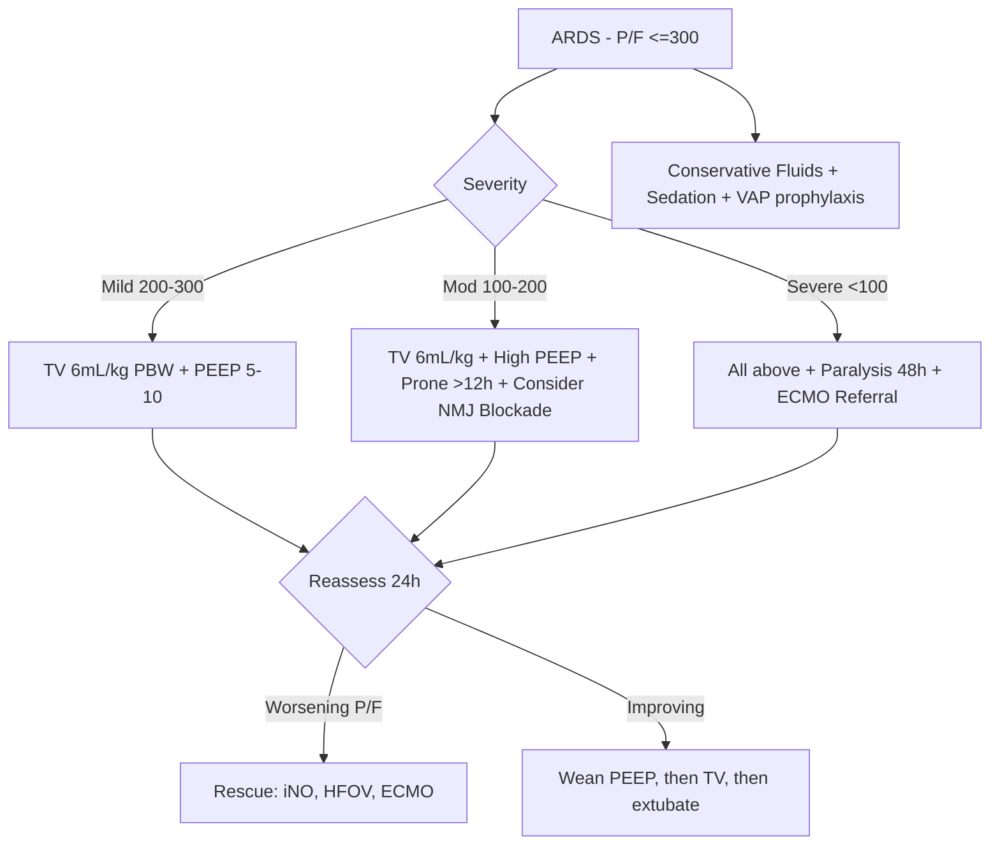

Related: [[Acute Respiratory Failure]], [[Non-Invasive Ventilation (NIV)]], [[Invasive Mechanical Ventilation - Basics]], [[Sepsis and Septic Shock]], [[Critical Care Monitoring]]

> [!important]
> **ARDS = acute, diffuse, inflammatory lung injury** with bilateral infiltrates + non-cardiogenic pulmonary oedema (PaO₂/FiO₂ ≤300, PEEP ≥5) within **1 week** of a known clinical insult. Berlin criteria (2012) — replaces AECC. Lung-protective ventilation (**6 mL/kg PBW**, plateau ≤30 cmH₂O), prone positioning (P/F <150, >12 h/day), conservative fluid strategy. Mortality 30–40%. Key FCPS/MRCP: Berlin criteria, P/F ratios, ARDSnet protocol, prone indication, neuromuscular blockade, ECMO referral criteria.

## 1. Learning Objectives
- Define ARDS using Berlin 2012 criteria
- Identify common precipitants (pulmonary vs extrapulmonary)
- Calculate P/F ratio and grade severity
- Apply lung-protective ventilation (6 mL/kg, plateau ≤30, PEEP titration)
- Know when to use prone positioning, paralysis, ECMO
- Manage conservative vs liberal fluid strategy
- Recognise complications (barotrauma, VAP, multi-organ failure)

## 2. Definition (Berlin 2012)
| Criterion | Definition |
|-----------|------------|
| **Timing** | Within 1 week of a known clinical insult OR new/worsening respiratory symptoms |
| **Chest imaging** | Bilateral opacities not fully explained by effusions, lobar/lung collapse, or nodules (CXR or CT) |
| **Origin of oedema** | Respiratory failure not fully explained by cardiac failure or fluid overload; objective assessment (echo) to exclude hydrostatic oedema |
| **Oxygenation** | P/F ≤300 with PEEP ≥5 cmH₂O |

### Severity (Berlin)
| Severity | P/F Ratio (mmHg) | Mortality (approx) |
|----------|------------------|---------------------|
| **Mild** | 200 < P/F ≤ 300 | 27% |
| **Moderate** | 100 < P/F ≤ 200 | 32% |
| **Severe** | P/F ≤ 100 | 45% |

## 3. Aetiology
**Pulmonary (direct)**
- Pneumonia (bacterial, viral incl. COVID-19, aspiration)
- Inhalational injury (smoke, chemical)
- Pulmonary contusion
- Near-drowning

**Extrapulmonary (indirect)**
- Sepsis (most common, ~40%)
- Severe trauma with shock / massive transfusion
- Pancreatitis
- Major burns
- Drug overdose (salicylates, opioids, tricyclics)
- Transfusion-related acute lung injury (TRALI)
- Cardiopulmonary bypass

## 4. Pathophysiology
1. **Exudative phase** (1–7 days): alveolar capillary leak → protein-rich oedema, hyaline membranes, neutrophil infiltration
2. **Proliferative phase** (1–3 weeks): type II pneumocyte proliferation, fibroblast infiltration
3. **Fibrotic phase** (>3 weeks): collagen deposition, scarring — if persistent, mortality rises

Consequence: **decreased lung compliance**, V/Q mismatch, **intrapulmonary shunting** → refractory hypoxaemia.

## 5. Clinical Features
- Acute onset dyspnoea, tachypnoea
- Severe hypoxaemia (often refractory to oxygen)
- Bilateral crackles
- CXR: bilateral diffuse infiltrates ("white-out")
- Often intubated within hours

## 6. Investigations
- **ABG**: hypoxaemia, A-a gradient ↑↑, PaCO₂ initially low then high (exhaustion)
- **CXR**: bilateral patchy infiltrates
- **CT chest**: heterogeneous consolidation, "baby lung" (dependent atelectasis + spared non-dependent)
- **Echocardiogram**: exclude cardiac cause (normal LV, no significant effusion)
- **BNP/NT-proBNP**: low-normal in ARDS (high in cardiogenic)
- **Swan-Ganz (historical)**: PAWP <18 mmHg = non-cardiogenic
- **Microbiology**: blood, sputum, BAL cultures — identify cause

## 7. Diagnosis / Differential
- Cardiogenic pulmonary oedema (PCWP >18, LV dysfunction, response to diuretics)
- Bilateral pneumonia
- Acute interstitial pneumonia (Hamman-Rich)
- Diffuse alveolar haemorrhage
- Pulmonary vasculitis (GPA, MPA)
- Massive PE
- Transfusion reactions (TRALI/TACO)

## 8. Management — Lung-Protective Ventilation (ARDSnet)

### Tidal Volume & Plateau Pressure
- **Tidal volume: 6 mL/kg predicted body weight (PBW)** — NOT actual weight
- **Plateau pressure (Pplat): ≤30 cmH₂O** (permissive hypercapnia if pH >7.20)
- Calculate PBW: Male = 50 + 0.91 × (height cm − 152.4); Female = 45.5 + 0.91 × (height cm − 152.4)

### PEEP / FiO₂ Titrations (ARDSnet lower PEEP/higher FiO₂ table)
| FiO₂ | 0.3 | 0.4 | 0.4 | 0.5 | 0.5 | 0.6 | 0.7 | 0.7 | 0.7 | 0.8 | 0.9 | 0.9 | 0.9 | 1.0 |
|------|-----|-----|-----|-----|-----|-----|-----|-----|-----|-----|-----|-----|-----|-----|
| PEEP | 5 | 5 | 8 | 8 | 10 | 10 | 10 | 12 | 14 | 14 | 14 | 16 | 18 | 18–24 |

(Use higher PEEP for moderate-severe ARDS)

### Adjunctive Therapies (for moderate-severe, P/F <150)
| Strategy | Indication | Benefit |
|----------|------------|---------|
| **Prone positioning** ≥12 h/day | P/F <150 (PROSEVA trial) | Mortality ↓ 17% (severe ARDS) |
| **Neuromuscular blockade (cisatracurium)** | P/F <150 in first 48 h (RCT ACURASYS) | Mortality ↓ |
| **Inhaled pulmonary vasodilators** (iNO, prostacyclin) | Refractory hypoxaemia (rescue) | Improved oxygenation (no mortality benefit) |
| **ECMO** | Severe ARDS, P/F <80 despite optimisation (EOLIA, CESAR) | Rescue — specialist centres only |
| **Conservative fluid strategy** | After haemodynamic stability | More ventilator-free days |
| **Corticosteroids** | Late persistent ARDS / COVID-19 | Variable evidence; consider if refractory |
| **Recruitment manoeuvres** | Transient ↑ PEEP to 30–40 for 30–40 s | Transient oxygenation improvement |

### Rescue Therapies (Refractory Hypoxaemia)
- Inverse ratio ventilation (I:E 1:1 to 2:1)
- HFOV (no longer recommended routinely — OSCAR/OSCILLATE trials)
- VV-ECMO (refer early if P/F <80, refractory acidosis pH <7.20, barotrauma)

### Supportive Care
- **Sedation** + analgesia (propofol, fentanyl, midazolam)
- **DVT prophylaxis** (LMWH + mechanical if coagulopathic)
- **Stress ulcer prophylaxis** (PPI)
- **Glycaemic control** (target 6–10 mmol/L)
- **Nutrition**: early enteral within 24–48 h
- **Restrictive transfusion** (Hb <70 g/L unless active bleed/ischaemia)
- **Conservative fluid**: diuresis once haemodynamically stable (FACTT trial)

## 9. Complications
- **Barotrauma**: pneumothorax, pneumomediastinum, surgical emphysema
- **Ventilator-associated pneumonia (VAP)**
- **Ventilator-induced lung injury (VILI)**: volutrauma, barotrauma, biotrauma, atelectrauma
- **Multi-organ failure** (most common cause of death)
- **ICU-acquired weakness**
- **Long-term**: pulmonary fibrosis, cognitive dysfunction, PTSD

## 10. Prognosis
- Mortality 30–40% overall (45% in severe)
- Higher with: age, comorbidities, severity (SOFA, APACHE II), multi-organ failure
- Survivors: gradual recovery over 6–12 months; reduced quality of life
- "Baby lung" concept: only ~30% of lung is aerated, normal tidal volume still injures it

## 11. FCPS/MRCP High-Yield Points
1. **Berlin 2012**: P/F ≤300 + PEEP ≥5 + bilateral infiltrates + non-cardiogenic + acute onset (1 week)
2. **Severity**: Mild 200–300, Moderate 100–200, Severe ≤100
3. **TV 6 mL/kg PBW** (not actual weight), Pplat ≤30
4. **Prone ≥12 h** for P/F <150
5. **NMJ blockade** first 48 h for P/F <150
6. **Conservative fluid** after stable (FACTT)
7. **Sepsis = most common cause** (~40%)
8. **PCWP <18** to exclude cardiogenic
9. **ECMO referral** for P/F <80 despite optimisation
10. **VILI mechanisms**: volutrauma, barotrauma, atelectrauma, biotrauma
11. **ARDSnet tables**: low PEEP/higher FiO₂ or high PEEP/lower FiO₂
12. **Corticosteroids** debated; not routine; consider in late/persistent

## 12. Common Viva Questions
1. Berlin criteria and severity classification
2. How do you calculate P/F ratio? When is it severe?
3. ARDSnet low tidal volume protocol
4. Role of prone positioning — which patients, how long?
5. Differentiate ARDS from cardiogenic pulmonary oedema
6. ECMO referral criteria
7. Conservative vs liberal fluid strategy
8. Why PBW and not actual weight for tidal volume?

## 13. Common Confusions / Exam Traps
- **Tidal volume on actual weight** → wrong; use PBW (6 mL/kg PBW)
- **P/F without PEEP** → cannot diagnose ARDS
- **Single CXR** may be unilateral early — repeat in 24–48 h
- **Cardiogenic oedema** must be excluded (echo, BNP, fluid responsiveness)
- **PEEP too low** → repeated derecruitment, hypoxaemia
- **High plateau pressure** → reduce TV to 4 mL/kg, allow permissive hypercapnia
- **Late steroids** (after day 14) → increased mortality
- **HFOV** no longer routine (OSCAR, OSCILLATE)
- **TRALI vs TACO** — TRALI = non-cardiogenic, no fluid overload

## 14. Mnemonics
- **ARDS Berlin "1W5-3"**: 1 Week, 5 PEEP, 3 severities
- **PBW formula**: **M 50** + 0.91 × (H − 152); **F 45.5** + 0.91 × (H − 152)
- **P/F = PaO₂ / FiO₂** × 100
- **TV = 6 mL/kg PBW, Pplat ≤30, pH >7.20**
- **Prone for P/F <150, >12 h, PROSEVA**
- **Paralysis first 48 h** for P/F <150 (ACURASYS)
- **ARDS = S**epsis #1, **T**RANSFUSION, **A**SPIRATION, **P**neumonia, **T**RAUMA
- **VILI**: **B**arotrauma, **V**olutrauma, **A**telectrauma, **B**iotrauma

## 15. Mind Map
```mermaid
mindmap
  root((ARDS))
    Berlin Criteria
      Within 1 week
      Bilateral infiltrates
      Non-cardiogenic (PCWP<18)
      P/F <=300 + PEEP >=5
      Severity: Mild 200-300 / Mod 100-200 / Severe <100
    Causes
      Pulmonary: Pneumonia, Aspiration, Inhalational
      Extrapulmonary: Sepsis (40%), Trauma, Pancreatitis, TRALI
    Pathophysiology
      Exudative (1-7d) -> Proliferative (1-3w) -> Fibrotic (>3w)
      Capillary leak, hyaline membranes
      Decreased compliance, shunting
    Management
      Lung-Protective Ventilation
        TV 6mL/kg PBW
        Pplat <=30
        PEEP titration (ARDSnet)
        Permissive hypercapnia pH>7.20
      Adjuncts (P/F<150)
        Prone >12h/day (PROSEVA)
        NMJ blockade 48h (ACURASYS)
        Conservative fluids (FACTT)
      Rescue
        iNO, Prone, HFOV (not routine)
        VV-ECMO (P/F<80)
      Supportive
        DVT/PUD prophylaxis
        Early enteral nutrition
        Restrictive transfusion (Hb<70)
    Complications
      Barotrauma (PTX)
      VAP
      VILI
      Multi-organ failure
      Pulmonary fibrosis
```

## 16. Flowchart — ARDS Management


## 17. One-Page Revision Summary
- **Berlin 2012**: 1 week, bilateral infiltrates, non-cardiogenic, P/F ≤300 + PEEP ≥5
- **Severity**: Mild 200–300, Moderate 100–200, Severe ≤100
- **TV = 6 mL/kg PBW** (not actual), Pplat ≤30, pH >7.20 (permissive hypercapnia)
- **PEEP/FiO₂** ARDSnet table (low or high PEEP strategies)
- **Prone >12 h** if P/F <150 (PROSEVA)
- **NMJ blockade 48 h** if P/F <150 (ACURASYS)
- **Conservative fluids** (FACTT) once stable
- **ECMO** for P/F <80 refractory
- **Sepsis** = most common cause (~40%)
- **VILI**: barotrauma, volutrauma, atelectrauma, biotrauma

## 24-Hour Recall Prompts
- State Berlin criteria and severity grading
- Calculate P/F ratio and grade
- State ARDSnet tidal volume, plateau pressure, PBW formula
- List adjunctive therapies for moderate-severe ARDS
- Differentiate ARDS from cardiogenic oedema

## 7-Day / 15-Day / 30-Day Revision Tracker
- [ ] Day 1 completed
- [ ] 24-hour recall completed
- [ ] Day 7 revision completed
- [ ] Day 15 revision completed
- [ ] Day 30 revision completed

## 18. Must Know / Should Know / Nice to Know
### Must Know
- Berlin criteria + severity (P/F)
- ARDSnet 6 mL/kg PBW, Pplat ≤30
- Prone >12 h for P/F <150
- Conservative fluid strategy
- Sepsis = most common cause
- Differentiate from cardiogenic oedema (echo, BNP, PCWP <18)

### Should Know
- PEEP/FiO₂ ARDSnet table
- NMJ blockade first 48 h
- ECMO referral criteria
- Complications: VAP, barotrauma, VILI
- ARDSnet high vs low PEEP strategy

### Nice to Know
- Pathophysiology phases (exudative, proliferative, fibrotic)
- PBW calculation formula
- HFOV trials (OSCAR, OSCILLATE)
- iNO, prostacyclin, recruitment manoeuvres
- Long-term outcomes (PICS, fibrosis)

## 19. Self-Test Scorecard
- Understanding: /10
- Recall: /10
- MCQ Performance: /10
- SBA Performance: /10
- Viva Confidence: /10
- Total: /50

> [!tip]
> Interpretation: <35 = weak topic, 35-44 = acceptable but insecure, 45+ = strong exam-ready topic.

## 20. Exam Answer Modes
### Long Answer Skeleton
- Definition (Berlin 2012)
- Aetiology (pulmonary vs extrapulmonary)
- Pathophysiology (3 phases)
- Clinical features + investigations
- Differential diagnosis (cardiogenic oedema)
- Berlin severity classification
- Lung-protective ventilation (TV, Pplat, PEEP, PBW)
- Adjuncts (prone, paralysis, ECMO, fluids, sedation)
- Complications
- Prognosis

### Short Note Skeleton
- Berlin criteria table
- P/F severity
- ARDSnet ventilation parameters
- Prone positioning
- ECMO referral
- Conservative vs liberal fluid

### Viva One-Liners
- "Berlin 2012: 1 week + bilateral infiltrates + non-cardiogenic + P/F ≤300 + PEEP ≥5"
- "Mild 200–300, Moderate 100–200, Severe ≤100"
- "TV 6 mL/kg PBW, Pplat ≤30, permissive hypercapnia pH >7.20"
- "PBW: M 50 + 0.91(H−152); F 45.5 + 0.91(H−152)"
- "Prone >12 h if P/F <150 (PROSEVA)"
- "NMJ blockade 48 h if P/F <150 (ACURASYS)"
- "Conservative fluids once stable (FACTT)"
- "ECMO for P/F <80 refractory"
- "Sepsis is the most common cause (~40%)"
- "PCWP <18 mmHg to exclude cardiogenic"

### Ward-Case Discussion Points
- Severe pneumonia, intubated, P/F 80 on 100% O₂ + PEEP 12 → severe ARDS, prone, paralysis, ECMO referral
- COVID-19 with bilateral infiltrates, P/F 150 → prone, NMJ blockade, conservative fluids
- Post-op aspiration, P/F 220 → mild ARDS, ARDSnet ventilation, monitor
- Differentiate ARDS from fluid overload → echo, BNP, fluid challenge

### Last-Night-Before-Exam Sheet
- Berlin 2012: 1W + bilateral + non-cardiogenic + P/F ≤300 + PEEP ≥5
- Mild 200–300, Mod 100–200, Severe ≤100
- TV 6 mL/kg PBW; Pplat ≤30
- Prone >12 h if P/F <150
- NMJ block 48 h if P/F <150
- Conservative fluids
- ECMO for P/F <80
- Sepsis = #1 cause
- VILI = baro/volu/atelec/bio

## 21. Summary
**ARDS = acute, diffuse, inflammatory lung injury with bilateral infiltrates + non-cardiogenic pulmonary oedema (PaO₂/FiO₂ ≤300, PEEP ≥5) within 1 week of a known clinical insult.** Berlin 2012 criteria; severity: Mild 200–300, Moderate 100–200, Severe ≤100. Sepsis = most common cause (~40%). Pathophysiology: exudative → proliferative → fibrotic phases with capillary leak, hyaline membranes, decreased compliance, intrapulmonary shunting. **Lung-protective ventilation = cornerstone**: TV **6 mL/kg PBW** (PBW formula, not actual weight), **Pplat ≤30 cmH₂O**, permissive hypercapnia (pH >7.20), PEEP titration per ARDSnet table. **Adjuncts for moderate-severe (P/F <150)**: prone positioning ≥12 h/day (PROSEVA), NMJ blockade first 48 h (ACURASYS), conservative fluid strategy (FACTT). **Rescue**: iNO, prone + paralysis, VV-ECMO (P/F <80 refractory). Supportive: sedation, DVT/PUD prophylaxis, early enteral nutrition, restrictive transfusion (Hb <70). Complications: VAP, barotrauma, VILI, multi-organ failure, pulmonary fibrosis. Mortality 30–40% (45% in severe).

## 22. MCQs (10)
1. Berlin criteria for ARDS include all EXCEPT:
   A. Onset within 1 week of clinical insult
   B. Bilateral infiltrates
   C. PCWP >18 mmHg
   D. P/F ratio ≤300 with PEEP ≥5

2. Mild ARDS by P/F ratio:
   A. ≤100
   B. 100–200
   C. 200–300
   D. >300

3. ARDSnet tidal volume per kg **predicted body weight** (PBW):
   A. 4 mL/kg
   B. 6 mL/kg
   C. 8 mL/kg
   D. 10 mL/kg

4. Plateau pressure target in ARDS:
   A. ≤15 cmH₂O
   B. ≤20 cmH₂O
   C. ≤30 cmH₂O
   D. ≤40 cmH₂O

5. The PROSEVA trial demonstrated mortality benefit of:
   A. High-frequency oscillatory ventilation
   B. **Prone positioning >12 h/day for P/F <150**
   C. Inhaled nitric oxide
   D. Steroids

6. Most common cause of ARDS:
   A. Pneumonia
   B. **Sepsis**
   C. Aspiration
   D. Trauma

7. Predicted body weight (PBW) for a 180 cm male:
   A. 60 kg
   B. 70 kg
   C. 75 kg
   D. 80 kg

8. Permissive hypercapnia is acceptable if pH:
   A. >7.10
   B. **>7.20**
   C. >7.30
   D. >7.45

9. ECMO referral threshold in ARDS:
   A. P/F <150
   B. P/F <120
   C. **P/F <80 despite optimisation**
   D. P/F <300

10. Conservative fluid strategy in ARDS is supported by which trial?
    A. ARDSnet
    B. PROSEVA
    C. **FACTT**
    D. ACURASYS

## 23. SBA Questions (10)
1. A 55-year-old man, severe pneumonia, intubated. PaO₂ 60 mmHg on FiO₂ 0.8 + PEEP 10. P/F ratio is:
   A. 60
   B. **75 (severe ARDS)**
   C. 100
   D. 150

2. Berlin severity for P/F 180 with PEEP 8:
   A. Mild
   B. **Moderate**
   C. Severe
   D. Cannot be classified

3. First-line adjunct for moderate-severe ARDS (P/F 120) within 24 h:
   A. Inhaled nitric oxide
   B. **Prone positioning >12 h**
   C. HFOV
   D. ECMO

4. PBW for a 165 cm female:
   A. 50 kg
   B. **55 kg**
   C. 60 kg
   D. 65 kg

5. ARDS lung-protective ventilation: target tidal volume, plateau pressure, pH:
   A. 8 mL/kg, 35, 7.30
   B. **6 mL/kg PBW, ≤30, pH >7.20**
   C. 10 mL/kg, 40, 7.25
   D. 4 mL/kg, 25, 7.35

6. A patient on ARDSnet ventilation has Pplat 35 cmH₂O. Next step:
   A. Increase PEEP
   B. **Reduce tidal volume to 4 mL/kg, allow permissive hypercapnia**
   C. Switch to HFOV
   D. Prone

7. Differentiating ARDS from cardiogenic oedema — all support ARDS EXCEPT:
   A. PCWP <18
   B. Normal echo
   C. **BNP >1000**
   D. Bilateral infiltrates not explained by effusions

8. ACURASYS trial showed benefit of:
   A. Prone positioning
   B. **Early NMJ blockade (cisatracurium) for 48 h in P/F <150**
   C. HFOV
   D. Steroids

9. Severe ARDS with P/F 70 despite optimal ventilation. Next step:
   A. Increase PEEP to 20
   B. HFOV
   C. **ECMO referral**
   D. Continue current management

10. A 60-year-old with pancreatitis, intubated, P/F 220, bilateral infiltrates, normal echo. Diagnosis:
    A. Cardiogenic pulmonary oedema
    B. **Mild ARDS**
    C. Pneumonia only
    D. TRALI

## 24. Flashcards
- Q: Berlin 2012 ARDS criteria
  A: Within 1 week + bilateral infiltrates + non-cardiogenic + P/F ≤300 + PEEP ≥5
- Q: ARDS severity (P/F)
  A: Mild 200–300, Moderate 100–200, Severe ≤100
- Q: ARDSnet TV
  A: 6 mL/kg predicted body weight
- Q: Plateau pressure target
  A: ≤30 cmH₂O
- Q: Permissive hypercapnia
  A: pH >7.20
- Q: PBW for males
  A: 50 + 0.91 × (height cm − 152)
- Q: PBW for females
  A: 45.5 + 0.91 × (height cm − 152)
- Q: Prone positioning indication
  A: P/F <150, >12 h/day (PROSEVA)
- Q: Most common ARDS cause
  A: Sepsis (~40%)
- Q: Conservative fluid trial
  A: FACTT
- Q: NMJ blockade trial
  A: ACURASYS (cisatracurium 48 h)
- Q: ECMO indication
  A: P/F <80 refractory

## 25. Answer Key with Explanations
**MCQ 1**: C — PCWP must be <18 to exclude cardiogenic cause.
**MCQ 2**: C — Mild 200–300, Moderate 100–200, Severe ≤100.
**MCQ 3**: B — ARDSnet 6 mL/kg PBW.
**MCQ 4**: C — Pplat ≤30 cmH₂O.
**MCQ 5**: B — PROSEVA: prone >12 h in P/F <150.
**MCQ 6**: B — Sepsis is most common (~40%); pneumonia is a frequent pulmonary cause.
**MCQ 7**: C — 50 + 0.91 × (180 − 152.4) = 50 + 25.1 = 75 kg.
**MCQ 8**: B — Permissive hypercapnia acceptable if pH >7.20.
**MCQ 9**: C — ECMO for P/F <80 despite optimisation.
**MCQ 10**: C — FACTT trial showed conservative fluid improved ventilator-free days.

**SBA 1**: B — P/F = 60/0.8 = 75, severe ARDS.
**SBA 2**: B — P/F 180 = moderate.
**SBA 3**: B — Prone is first-line adjunct for P/F <150.
**SBA 4**: B — 45.5 + 0.91 × (165 − 152.4) = 45.5 + 11.5 = 57 kg ≈ 55 kg.
**SBA 5**: B — TV 6 mL/kg PBW, Pplat ≤30, pH >7.20.
**SBA 6**: B — Reduce TV to 4 mL/kg, accept permissive hypercapnia.
**SBA 7**: C — High BNP supports cardiogenic cause.
**SBA 8**: B — ACURASYS: cisatracurium 48 h for P/F <150.
**SBA 9**: C — P/F <80 refractory → ECMO referral.
**SBA 10**: B — Berlin criteria met → mild ARDS.

---

**Status**: Full FCPS/MRCP topic note completed — 2026-06-15

## PasTest Scenario SBAs (Clinical Vignettes)

> **Auto-generated PasTest/Mediscope-style scenario SBAs** grounded in the authored source. Each scenario tests a real clinical fact (triad, specific sign, contraindication, trial, first-line Rx) extracted from the topic. *Source: Ch 10: Acute Medicine — Acute Respiratory Distress Syndrome (ARDS)*

**Q1.** Which landmark clinical trial provided evidence relevant to the management of Acute Respiratory Distress Syndrome (ARDS) (specifically: mortality benefit of:
   A)?

  - **A.** PROSEVA trial
  - **B.** A different but related trial in the same area
  - **C.** A guideline (not a trial) addressing the same question
  - **D.** An observational/cohort study addressing similar outcomes

  > **Answer: A** — PROSEVA trial
  >
  > *Source:* The PROSEVA trial demonstrated mortality benefit of:
   A

**Q2.** What is the most appropriate first-line therapy for Acute Respiratory Distress Syndrome (ARDS)?

  - **A.** Neuromuscular blockade
  - **B.** An advanced/surgical therapy reserved for refractory disease
  - **C.** Symptomatic treatment only, no disease-modifying therapy
  - **D.** Empiric broad-spectrum therapy without specific indication

  > **Answer: A** — Neuromuscular blockade
  >
  > *Source:* **Neuromuscular blockade (cisatracurium)**   P/F <150 in first 48 h (RCT ACURASYS)   Mortality ↓

