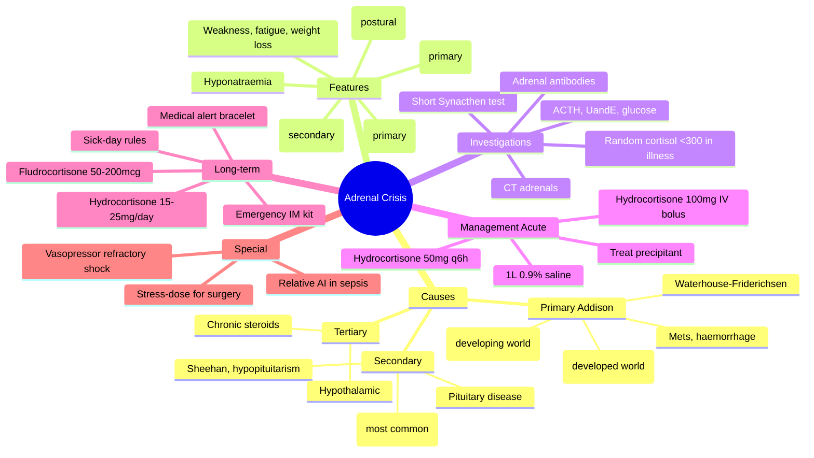
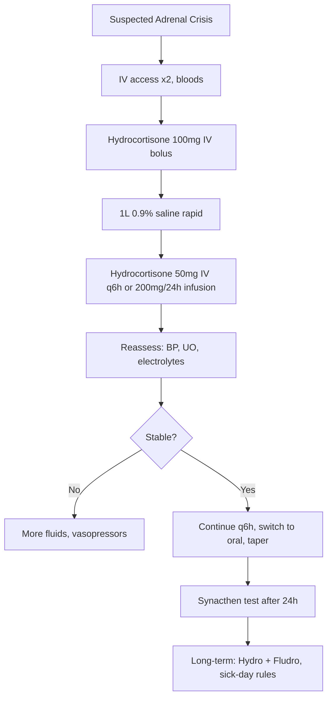

Related: [[Diabetic Emergencies (DKA and HHS)]], [[Acid-Base and Electrolyte Emergencies]], [[Septic Shock]]

> [!important]
> **Adrenal crisis = acute severe illness in setting of adrenal insufficiency + cortisol unable to meet demands.** Triad: **hypotension (often postural) + hyponatraemia + hyperkalaemia** (primary only) ± hypoglycaemia. **Treatment: IV hydrocortisone 100 mg bolus, then 50 mg q6h or 200 mg/24 h infusion + 1 L 0.9% saline rapidly**. **Do NOT wait for Synacthen test result** if strong clinical suspicion. **Long-term: glucocorticoid (hydrocortisone 15-25 mg/day in divided doses) + mineralocorticoid (fludrocortisone 50-200 mcg) in primary**. **Stress-dose steroids** for surgery, trauma, infection in known AI patients. FCPS/MRCP: causes, presentation, immediate Rx, LT management, sick-day rules.

## 1. Learning Objectives
- Recognise adrenal crisis
- Distinguish primary (Addison) vs secondary (ACTH def) vs tertiary (long-term steroid withdrawal)
- Initiate emergency treatment (hydrocortisone + fluids)
- Order investigations (cortisol, ACTH, Synacthen test, electrolytes)
- Plan long-term glucocorticoid + mineralocorticoid replacement
- Counsel patient on sick-day rules and emergency injection
- Identify relative adrenal insufficiency in critical illness

## 2. Definition
- **Adrenal crisis**: severe hypotension unresponsive to fluids + vasopressors + features of adrenal insufficiency + resolves rapidly with parenteral glucocorticoids
- **Biochemical criterion**: random cortisol <300 nmol/L in acute illness (some use <500 nmol/L or <150 nmol/L random in stress)
- **Classic criteria (Allgrove 2003)**: ≥2 of: hypotension (SBP <100), nausea/vomiting, severe fatigue, hyponatraemia, hyperkalaemia (primary)
- **Mortality**: 6–15% even with treatment

## 3. Adrenal Anatomy & Physiology
- **Adrenal cortex**: 3 zones
  - **Zona glomerulosa** (outer): mineralocorticoids (aldosterone)
  - **Zona fasciculata** (middle): glucocorticoids (cortisol)
  - **Zona reticularis** (inner): androgens (DHEA)
- **Adrenal medulla**: catecholamines
- **Cortisol**: glucocorticoid, peak 08:00, nadir 24:00; bound to CBG (~90%)
- **Aldosterone**: regulated by RAAS; K⁺
- **HPA axis**: CRH (hypothalamus) → ACTH (pituitary) → cortisol (adrenal); negative feedback

## 4. Causes

### Primary Adrenal Insufficiency (Addison's) — cortisol + aldosterone both ↓
- **Autoimmune adrenalitis** (most common in developed world) — TB, mets
- **Infections**: TB (world's most common cause), HIV, CMV, histoplasmosis
- **Metastases**: lung, breast, melanoma, kidney
- **Infiltrative**: amyloidosis, sarcoidosis, haemochromatosis
- **Bilateral adrenalectomy**
- **Adrenal haemorrhage**: Waterhouse-Friderichsen syndrome (meningococcal sepsis), antiphospholipid syndrome, anticoagulation
- **Congenital**: CAH (21-hydroxylase deficiency), X-linked adrenoleukodystrophy, Allgrove syndrome

### Secondary (ACTH deficiency) — cortisol ↓, aldosterone normal
- **Long-term exogenous glucocorticoid withdrawal** (most common cause overall)
- **Pituitary disease**: hypopituitarism, pituitary surgery/radiation, Sheehan's syndrome
- **Craniopharyngioma**, sellar masses
- **Empty sella**

### Tertiary (CRH deficiency)
- **Chronic exogenous glucocorticoids** (most common)
- **Hypothalamic disease**

## 5. Clinical Features
| Feature | Primary | Secondary |
|---------|---------|-----------|
| Weakness/fatigue | ✓✓ | ✓ |
| Weight loss | ✓✓ | ✓ |
| Anorexia | ✓✓ | ✓ |
| Hypotension (postural) | ✓✓ | ✓ (mild) |
| Nausea/vomiting | ✓✓ | ✓ |
| Hyponatraemia | ✓✓ | ✓✓ |
| Hyperkalaemia | ✓ | ✗ |
| Hypoglycaemia | ✓ | ✓✓ |
| Hyperpigmentation | ✓✓ (ACTH↑) | ✗ |
| Hypercalcaemia (mild) | ✓ | ✗ |
| Vitiligo, autoimmune features | ✓ | ✗ |
| Aldosterone effects (salt craving) | ✓ | ✗ |

## 6. Adrenal Crisis Triggers
- Infection/sepsis (most common)
- Surgery/trauma
- GI illness (vomiting/diarrhoea → dehydration + oral intake ↓)
- Dehydration
- Stopping/reducing glucocorticoid
- Pregnancy/labour
- Acute MI, stroke
- Emotional stress

## 7. Investigations

### Bedside
- **Blood glucose** (hypoglycaemia)
- **BP** (postural drop)
- **ECG** (hyperkalaemia)

### Lab
| Test | Result in Adrenal Crisis |
|------|--------------------------|
| **Cortisol (random)** | <300 nmol/L in acute illness |
| **ACTH** | ↑ primary, ↓ secondary |
| **Na⁺** | ↓ (135); often <130 |
| **K⁺** | ↑ (5.5-7.0) in primary |
| **Glucose** | <4 mmol/L |
| **Urea/creatinine** | ↑ (prerenal AKI) |
| **Ca²⁺** | ↑ (mild) |
| **TSH** | ↑ (often co-existing autoimmune thyroid) |
| **21-hydroxylase antibodies** | Positive in autoimmune adrenalitis |
| **FBC** | Lymphocytosis, eosinophilia |

### Confirmatory Tests
- **Short Synacthen (tetracosactide) test**: 250 mcg IV, cortisol at 0, 30 min
  - **Pass**: cortisol ≥450–550 nmol/L (varies by lab)
  - **Fail**: <450 nmol/L → adrenal insufficiency
- **Can be done in crisis after initial hydrocortisone replaced** (delay until 24 h after dose if possible)
- **CRH test**: distinguishes secondary (ACTH low) from tertiary
- **CT/MRI adrenals**: autoimmune (small/atrophic), TB/bleed (enlarged), mets/masses
- **Pituitary MRI**: if secondary suspected

## 8. Management — Acute Adrenal Crisis

### Immediate (Do NOT delay)
1. **IV access** × 2
2. **Bloods** (cortisol, ACTH, U&E, glucose, FBC, cultures if sepsis)
3. **Hydrocortisone 100 mg IV bolus immediately**
4. **1 L 0.9% saline IV rapidly** (repeat to SBP ≥90, no obvious fluid overload)
5. **Dextrose** if hypoglycaemic (50% glucose 50 mL)
6. **Continuous monitoring** (BP, HR, urine output)
7. **Reassess** at 30-60 min

### Continued
- **Hydrocortisone 50 mg IV q6h** (or 200 mg/24 h continuous IV infusion)
- **IV fluids** as needed (3-6 L 0.9% saline over 24 h typical)
- **Dextrose** if hypoglycaemia
- **Treat precipitating cause** (antibiotics if sepsis)
- **Dose can be doubled or 100 mg q6h** if severe
- **Switch to oral** when stable and tolerating (then taper to maintenance)

### Stop
- **Don't wait for Synacthen** to give hydrocortisone
- **Don't give fludrocortisone acutely** (high-dose hydrocortisone has mineralocorticoid effect)

## 9. Long-Term Management

### Primary AI (Addison's)
- **Hydrocortisone 15-25 mg/day** in 2-3 divided doses (e.g., 10 mg + 5 mg + 5 mg)
  - Or **prednisolone 3-5 mg/day** (single daily dose)
  - Take with food, first dose on waking
- **Fludrocortisone 50-200 mcg/day** (mineralocorticoid)
- **Titrate** fludrocortisone: BP, K⁺, Na⁺, renin

### Secondary AI
- **Hydrocortisone 15-20 mg/day** (similar)
- **No fludrocortisone** needed (aldosterone preserved)
- **Replace other pituitary hormones** (levothyroxine, GH, sex steroids)

### Sick-Day Rules (patient education)
| Stress | Action |
|--------|--------|
| **Mild illness (cold, fever)** | Double hydrocortisone until well |
| **Vomiting / diarrhoea** | IM/SC hydrocortisone 100 mg + seek medical help |
| **Surgery** | Hydrocortisone 100 mg IV at induction; 50-100 mg q6-8h for 48-72 h |
| **Dental work** | 100 mg IM/SC before procedure |
| **Trauma / major stress** | 100 mg IV bolus then infusion |
| **Travel with fever** | Double oral dose, carry IM kit |
| **Emergency bracelet / card** | Essential |

### Patient Kit
- **Hydrocortisone 100 mg IM/SC emergency injection**
- **Solu-Cortef Act-O-Vial** (preferred) or pre-filled syringes
- **Carry at all times**

## 10. Relative Adrenal Insufficiency in Critical Illness
- **Common in sepsis, severe trauma, surgery**
- **Definition**: random cortisol <300 nmol/L OR delta cortisol <150 nmol/L after Synacthen
- **Treatment**: hydrocortisone 50 mg q6h IV (especially in vasopressor-refractory septic shock)
- **ADRENAL trial (2018)**: hydrocortisone in septic shock → faster shock reversal, no mortality benefit
- **APROCCHSS trial**: hydrocortisone + fludrocortisone → mortality benefit in severe septic shock

## 11. Prognosis
- **Crisis mortality**: 6–15%
- **Quality of life**: often impaired if undertreated
- **Crisis risk**: 5–10 crises/100 patient-years
- **Autoimmune polyglandular syndrome**: monitor for thyroid, T1DM

## 12. FCPS/MRCP High-Yield Points
1. **Adrenal crisis** = severe hypotension + AI features + rapid response to IV hydrocortisone
2. **Hydrocortisone 100 mg IV bolus** = first-line (don't wait for Synacthen)
3. **1 L 0.9% saline rapid bolus** + IV fluids
4. **Then 50 mg IV q6h** or 200 mg/24 h infusion
5. **Do NOT need fludrocortisone acutely** (high-dose hydrocortisone has mineralocorticoid effect)
6. **Primary AI**: hyponatraemia + hyperkalaemia + hyperpigmentation
7. **Secondary AI**: hyponatraemia + hypoglycaemia, NO hyperkalaemia
8. **Most common cause of secondary AI**: chronic steroid withdrawal
9. **Most common cause of primary AI in developing world**: TB
10. **Long-term: hydrocortisone 15-25 mg/day** in divided doses
11. **Fludrocortisone 50-200 mcg/day** for primary AI
12. **Sick-day rules**: double oral dose for mild illness; IM injection if vomiting
13. **Emergency IM hydrocortisone kit** + medical alert bracelet
14. **Addisonian pigmentation**: mucous membranes, palmar creases, scars
15. **Hypercalcaemia** in Addison's (mild, due to volume contraction)

## 13. Common Viva Questions
1. Define adrenal crisis
2. Causes of primary vs secondary AI
3. Immediate management of adrenal crisis
4. Long-term steroid + mineralocorticoid replacement
5. Sick-day rules
6. Synacthen test
7. Waterhouse-Friderichsen syndrome
8. Relative adrenal insufficiency in critical illness
9. Stress-dose steroids in AI patients for surgery
10. Adrenal antibodies in autoimmune Addison's

## 14. Common Confusions / Exam Traps
- **Don't wait for Synacthen** to give hydrocortisone in crisis
- **Hydrocortisone has mineralocorticoid effect** at high doses → no fludrocortisone acutely
- **Prednisolone** = pure glucocorticoid, no mineralocorticoid → can't use as monotherapy in primary AI
- **Dexamethasone** = no mineralocorticoid effect; doesn't interfere with cortisol assay
- **Long-term steroid patient**: ALWAYS ask "have you taken your stress dose?"
- **Pre-op AI patients**: stress-dose steroids (100 mg IV hydrocortisone at induction)
- **TB** is the world's most common cause of Addison's
- **Autoimmune adrenalitis** = most common in developed world; check for other autoimmune disease
- **Hypercalcaemia** in Addison's (volume contraction)
- **Eosinophilia + lymphocytosis** in cortisol deficiency

## 15. Mnemonics
- **Crisis Rx**: **H**ydrocortisone 100 mg IV + **S**aline 1 L
- **Hydrocortisone continuation**: 50 mg q6h
- **Long-term primary AI**: **H**ydrocortisone + **F**ludrocortisone
- **Primary AI features**: **SKIN** (Salt craving, K+↑, Igt pigmNtation, Na↓)
- **Triggers**: **STOP steroids**, **S**epsis, **T**rauma, **O**peration, **P**regnancy
- **Sick-day rule**: **DOUBLE** oral for mild; **IM** if vomiting
- **Surgery**: **100 mg IV** at induction → 50-100 mg q6-8h × 48-72 h
- **Relative AI in sepsis**: hydrocortisone **50 mg IV q6h** (vasopressor refractory)

## 16. Mind Map

## 17. Flowchart — Adrenal Crisis Management

## 18. One-Page Revision Summary
- **Adrenal crisis**: severe hypotension + AI features + responds to IV hydrocortisone
- **Hydrocortisone 100 mg IV bolus** + **1 L 0.9% saline** immediately
- **Then 50 mg IV q6h** or 200 mg/24 h infusion
- **Don't wait for Synacthen** in crisis
- **Primary AI**: hyponatraemia + hyperkalaemia + hyperpigmentation
- **Secondary AI**: hyponatraemia + hypoglycaemia; NO hyperkalaemia
- **Long-term**: Hydrocortisone 15-25 mg/day + Fludrocortisone 50-200 mcg (primary)
- **Sick-day**: double oral for mild; IM if vomiting; 100 mg IV at surgery
- **Most common cause of primary AI in developing world**: TB
- **Most common cause of secondary AI**: chronic steroid withdrawal
- **Relative AI in sepsis**: hydrocortisone 50 mg q6h IV (vasopressor refractory)
- **Waterhouse-Friderichsen**: meningococcal sepsis + adrenal haemorrhage

## 24-Hour Recall Prompts
- List immediate Rx of adrenal crisis
- Distinguish primary vs secondary AI features
- List long-term AI treatment
- State sick-day rules
- List causes of adrenal crisis

## 7-Day / 15-Day / 30-Day Revision Tracker
- [ ] Day 1 completed
- [ ] 24-hour recall completed
- [ ] Day 7 revision completed
- [ ] Day 15 revision completed
- [ ] Day 30 revision completed

## 19. Must Know / Should Know / Nice to Know
### Must Know
- Adrenal crisis definition
- Hydrocortisone 100 mg IV bolus + 1 L saline
- Continuation: 50 mg q6h or 200 mg/24 h infusion
- Don't wait for Synacthen
- Primary vs secondary AI features
- Long-term: hydrocortisone + fludrocortisone
- Sick-day rules and stress-dose
- TB = most common primary cause worldwide
- Chronic steroids = most common secondary cause

### Should Know
- Waterhouse-Friderichsen syndrome
- Synacthen test
- Autoimmune polyglandular syndrome
- Relative AI in septic shock
- Hydrocortisone mineralocorticoid effect at high dose
- Addisonian crisis triggers
- Hypercalcaemia in Addison's
- Eosinophilia, lymphocytosis

### Nice to Know
- APROCCHSS vs ADRENAL trial
- DHEA replacement
- Adrenal antibodies
- ACTH, CRH test
- CAH (21-hydroxylase)
- Adrenoleukodystrophy

## 20. Self-Test Scorecard
- Understanding: /10
- Recall: /10
- MCQ Performance: /10
- SBA Performance: /10
- Viva Confidence: /10
- Total: /50

> [!tip]
> Interpretation: <35 = weak topic, 35-44 = acceptable but insecure, 45+ = strong exam-ready topic.

## 21. Exam Answer Modes
### Long Answer Skeleton
- Definition adrenal crisis
- Pathophysiology + HPA axis
- Causes (primary, secondary, tertiary)
- Clinical features (primary vs secondary)
- Investigations (cortisol, ACTH, U&E, Synacthen)
- Acute management (hydrocortisone 100 mg IV, saline, continuation 50 mg q6h)
- Long-term management (hydrocortisone + fludrocortisone, sick-day rules)
- Special situations (relative AI, stress-dose)

### Short Note Skeleton
- Adrenal crisis acute Rx
- Primary vs secondary AI
- Long-term AI treatment
- Sick-day rules
- Synacthen test

### Viva One-Liners
- "Adrenal crisis = severe hypotension + AI + rapid response to IV hydrocortisone"
- "Hydrocortisone 100 mg IV bolus + 1 L saline immediately"
- "Then 50 mg IV q6h or 200 mg/24 h infusion"
- "Don't wait for Synacthen in crisis"
- "Primary AI: hyponatraemia + hyperkalaemia + hyperpigmentation"
- "Secondary AI: hyponatraemia + hypoglycaemia; NO hyperkalaemia"
- "Long-term: hydrocortisone 15-25 mg/day + fludrocortisone 50-200 mcg (primary)"
- "Sick-day: double oral for mild; IM if vomiting"
- "Surgery: 100 mg IV at induction → 50-100 mg q6-8h × 48-72 h"
- "TB = most common primary cause in developing world"

### Ward-Case Discussion Points
- Vomiting, SBP 80, hyponatraemia, hyperpigmentation → Addison's crisis → 100 mg IV hydrocortisone + saline
- Long-term prednisolone patient, septic shock, vasopressor refractory → relative AI → hydrocortisone 50 mg q6h
- Pre-op AI patient for hip replacement → 100 mg IV at induction, then 50 mg q6h × 48-72 h
- Patient with vomiting and unable to keep oral steroids down → IM hydrocortisone 100 mg

### Last-Night-Before-Exam Sheet
- Crisis = 100 mg IV hydrocortisone + 1 L saline
- Then 50 mg q6h
- Don't wait for Synacthen
- Primary: Na↓, K↑, pigment
- Secondary: Na↓, glucose↓
- Long-term: Hydro + Fludro (primary)
- Sick-day: double oral; IM if vomiting
- Surgery: 100 mg IV
- TB = primary cause (developing)
- Steroid withdrawal = secondary cause

## 22. Summary
**Adrenal crisis** = severe hypotension + features of adrenal insufficiency + rapid response to IV glucocorticoid. **Primary AI (Addison's)**: hyponatraemia + **hyperkalaemia** + hyperpigmentation + hypotension. **Secondary AI (ACTH def)**: hyponatraemia + **hypoglycaemia** + NO hyperkalaemia + NO hyperpigmentation. **Most common primary cause worldwide: TB**; in developed world: autoimmune. **Most common secondary cause: chronic exogenous glucocorticoid withdrawal**. **Acute management**: **Hydrocortisone 100 mg IV bolus immediately** (don't wait for Synacthen) + **1 L 0.9% saline rapid** + **Hydrocortisone 50 mg IV q6h or 200 mg/24 h infusion** + treat precipitant. **Long-term primary AI**: Hydrocortisone **15-25 mg/day** (2-3 divided doses) + **Fludrocortisone 50-200 mcg/day** (mineralocorticoid). **Secondary AI**: Hydrocortisone only (no fludrocortisone needed). **Sick-day rules**: double oral for mild illness; **IM/SC 100 mg if vomiting**; pre-op: 100 mg IV at induction. **Investigations**: random cortisol <300 nmol/L in acute illness, ACTH (high primary, low secondary), Short Synacthen test (cortisol <450-550 nmol/L at 30 min = AI), U&E (Na↓, K↑), glucose, eosinophilia. **Waterhouse-Friderichsen**: meningococcal sepsis + bilateral adrenal haemorrhage. **Relative AI in septic shock**: hydrocortisone 50 mg q6h IV (ADRENAL, APROCCHSS trials).

## 23. MCQs (10)
1. Adrenal crisis first-line immediate treatment:
   A. Oral hydrocortisone 20 mg
   B. **IV hydrocortisone 100 mg bolus + 1 L 0.9% saline**
   C. IV dexamethasone 6 mg
   D. IV fludrocortisone 100 mcg

2. Hydrocortisone continuation dose in adrenal crisis:
   A. 25 mg q6h
   B. **50 mg IV q6h or 200 mg/24 h infusion**
   C. 100 mg q12h
   D. 200 mg q8h

3. Most common cause of primary adrenal insufficiency worldwide:
   A. Autoimmune
   B. **TB**
   C. Metastases
   D. Adrenalectomy

4. Most common cause of secondary adrenal insufficiency:
   A. Pituitary tumour
   B. **Chronic exogenous glucocorticoid withdrawal**
   C. Sheehan's syndrome
   D. Hypophysectomy

5. Primary AI features include all EXCEPT:
   A. Hyponatraemia
   B. Hyperkalaemia
   C. Hyperpigmentation
   D. **Hyperglycaemia**

6. Long-term fludrocortisone dose in primary AI:
   A. 5-10 mcg
   B. **50-200 mcg**
   C. 1-2 mg
   D. 10-20 mg

7. Stress-dose hydrocortisone for major surgery in AI patient:
   A. 10 mg IV
   B. 25 mg IV
   C. **100 mg IV at induction, then 50-100 mg q6-8h × 48-72 h**
   D. 200 mg IV once

8. Short Synacthen test: normal response is cortisol:
   A. <300 nmol/L
   B. **≥450-550 nmol/L at 30 min**
   C. >700 nmol/L
   D. Doubles from baseline

9. Waterhouse-Friderichsen syndrome is associated with:
   A. TB
   B. **Meningococcal sepsis + bilateral adrenal haemorrhage**
   C. Autoimmune
   D. Pituitary apoplexy

10. Relative adrenal insufficiency in septic shock treatment:
    A. Prednisolone 40 mg
    B. **Hydrocortisone 50 mg IV q6h**
    C. Dexamethasone 6 mg
    D. Fludrocortisone 100 mcg

## 24. SBA Questions (10)
1. A 35-year-old woman, vomiting, SBP 80, Na 128, K 5.8, brown buccal pigmentation. Most likely diagnosis:
   A. Septic shock
   B. **Addisonian crisis**
   C. DKA
   D. Hypovolaemic shock

2. Addisonian patient, 6 months stable on hydrocortisone + fludrocortisone, presents with vomiting, can't take oral. Action:
   A. Wait for vomiting to settle
   B. **IM hydrocortisone 100 mg immediately + IV fluids**
   C. Oral ondansetron
   D. Increase oral dose

3. Secondary AI features (chronic steroid withdrawal). Expected finding:
   A. Hyperkalaemia
   B. Hyperpigmentation
   C. **Hypoglycaemia + hyponatraemia without hyperkalaemia**
   D. All of above

4. Pre-op AI patient for hip replacement. Hydrocortisone plan:
   A. Continue oral
   B. **100 mg IV at induction → 50-100 mg IV q6-8h × 48-72 h, then taper**
   C. 200 mg IV once
   D. Stress-dose oral

5. Random cortisol 200 nmol/L in acutely ill hypotensive patient. Interpretation:
   A. Normal
   B. **Inadequate for stress; likely adrenal crisis**
   C. Exogenous steroid effect
   D. Test for Cushing's

6. Addison's disease, optimal fludrocortisone titration based on:
   A. Random cortisol
   B. **BP, Na, K, renin**
   C. ACTH
   D. Glucose

7. Adrenal crisis mortality even with treatment:
   A. <1%
   B. **6-15%**
   C. 30-40%
   D. 50%

8. Autoimmune polyglandular syndrome type 2 (APS-2) includes Addison's plus:
   A. Hypoparathyroidism
   B. **Type 1 DM + autoimmune thyroid disease**
   C. Hypothyroidism only
   D. Pernicious anaemia

9. Long-term AI, mild URTI, no vomiting. Sick-day rule:
   A. Stop hydrocortisone
   B. **Double hydrocortisone until well**
   C. IM 100 mg
   D. Admit for IV

10. Hydrocortisone 200 mg/24 h vs 50 mg q6h in crisis:
    A. Hydro 200 is wrong
    B. **Either is acceptable; some prefer continuous infusion (less glycaemic variability)**
    C. Only bolus
    D. 50 mg q12h is correct

## 25. Flashcards
- Q: Adrenal crisis first-line Rx
  A: Hydrocortisone 100 mg IV + 1 L saline
- Q: Hydrocortisone continuation
  A: 50 mg IV q6h or 200 mg/24 h
- Q: Don't wait for what test in crisis
  A: Synacthen
- Q: Primary AI causes
  A: Autoimmune, TB, mets, haemorrhage
- Q: Secondary AI cause
  A: Chronic steroid withdrawal
- Q: Primary AI features
  A: Na↓, K↑, pigment, hypotensive
- Q: Secondary AI features
  A: Na↓, glucose↓, no K↑
- Q: Long-term primary AI
  A: Hydrocortisone 15-25 mg + Fludrocortisone 50-200 mcg
- Q: Sick-day rules
  A: Double oral; IM if vomiting
- Q: Surgical stress-dose
  A: 100 mg IV at induction
- Q: Waterhouse-Friderichsen
  A: Meningococcal sepsis + adrenal haemorrhage
- Q: Relative AI in sepsis
  A: Hydrocortisone 50 mg q6h
- Q: Synacthen test dose
  A: 250 mcg IV; cortisol 0 and 30 min

## 26. Answer Key with Explanations
**MCQ 1**: B — Hydrocortisone 100 mg IV + 1 L saline immediately.
**MCQ 2**: B — 50 mg IV q6h or 200 mg/24 h.
**MCQ 3**: B — TB is the most common cause worldwide.
**MCQ 4**: B — Chronic steroid withdrawal is the most common cause.
**MCQ 5**: D — Hypoglycaemia is expected; hyperglycaemia is NOT.
**MCQ 6**: B — Fludrocortisone 50-200 mcg.
**MCQ 7**: C — 100 mg IV at induction for surgical stress.
**MCQ 8**: B — Synacthen pass = ≥450-550 nmol/L at 30 min.
**MCQ 9**: B — Meningococcal + adrenal haemorrhage.
**MCQ 10**: B — Hydrocortisone 50 mg IV q6h in relative AI/sepsis.

**SBA 1**: B — Addisonian crisis (Na↓, K↑, pigment, hypotensive).
**SBA 2**: B — IM hydrocortisone if vomiting.
**SBA 3**: C — Secondary: Na↓, glucose↓, NO K↑.
**SBA 4**: B — Surgical stress-dose.
**SBA 5**: B — Cortisol <300 in illness = inadequate.
**SBA 6**: B — BP, Na, K, renin guide fludrocortisone.
**SBA 7**: B — 6-15% mortality.
**SBA 8**: B — APS-2 = Addison + T1DM + autoimmune thyroid.
**SBA 9**: B — Double oral for mild illness.
**SBA 10**: B — Either is acceptable.

---

**Status**: Full FCPS/MRCP topic note completed — 2026-06-15