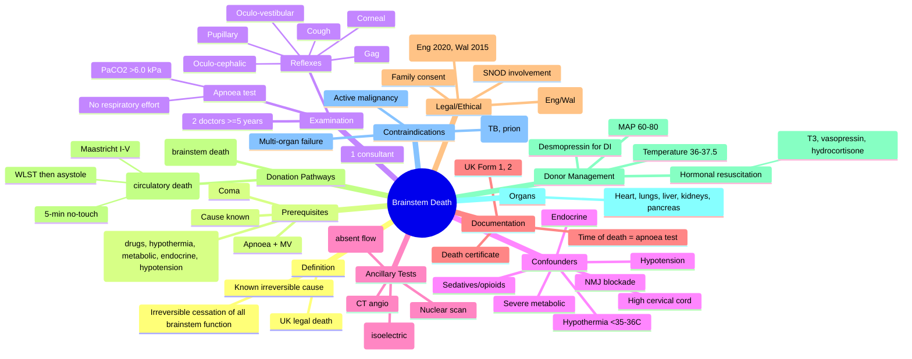
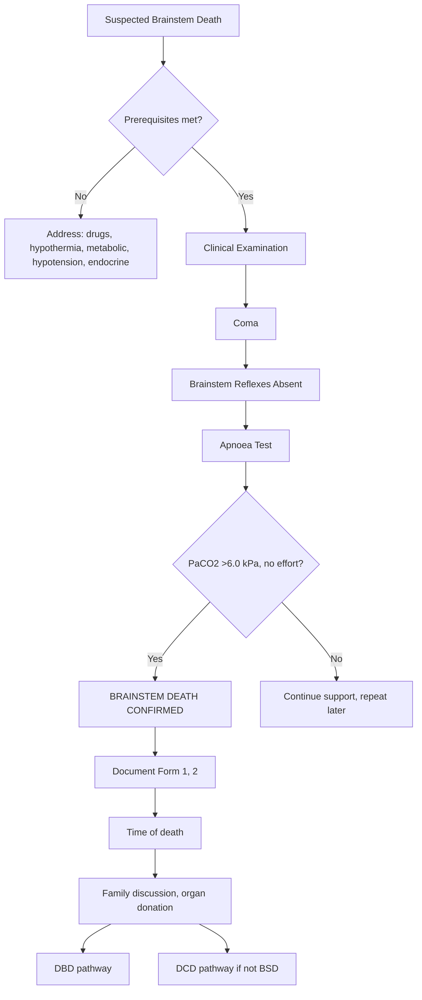

Related: [[Cardiac Arrest & Post-Resuscitation Care]], [[Raised Intracranial Pressure]], [[Coma and Altered Consciousness]]

> [!important]
> **Brainstem death = irreversible cessation of all brainstem function in setting of irreversible brain damage of known cause**. UK: **legal definition of death**. Confirmed by clinical exam (UK Code, Academy of Medical Royal Colleges 2008): **coma + absent brainstem reflexes (pupillary, corneal, oculo-vestibular, oculo-cephalic, gag, cough) + apnoea test (PaCO₂ >6.0 kPa) + irreversible cause + no confounders** (drugs, hypothermia, metabolic, severe metabolic/endocrine). **Two senior doctors**, both ≥5 years post-registration, one consultant, **two examinations separated by interval** (no minimum time but practical). **Apnoea test**: preoxygenate, set PEEP 5 + RR 0, target PaCO₂ >6.0 kPa, observe for respiratory effort. **Organ donation**: opt-out in England/Wales/Scotland; **family consent** still usually sought. **DBD (donation after brainstem death)** vs **DCD (donation after circulatory death)**. FCPS/MRCP: prerequisites, brainstem reflex testing, apnoea test, confounders, legal aspects, organ donation pathways.

## 1. Learning Objectives
- Define brainstem death (UK legal definition of death)
- Identify prerequisites for testing (irreversible cause, no confounders)
- Conduct brainstem reflex testing
- Perform apnoea test safely
- Apply legal and ethical framework
- Distinguish DBD vs DCD
- Counsel family on organ donation

## 2. Definition
- **Brainstem death** (UK Code 2008): **irreversible cessation of all brainstem function** in setting of **irreversible brain damage of known cause**
- **UK legal definition of death**: person is dead when both **brainstem death** (or **circulatory death** in DCD) is confirmed
- **Equivalent in many countries** (US: brain death; some EU: whole-brain death)

## 3. Prerequisites for Testing

### Essential Prerequisites (ALL must be met)
1. **Irreversible brain damage of known cause** (e.g., severe TBI, SAH, hypoxic brain injury, intracranial haemorrhage, brain tumour)
2. **No confounding factors**:
   - **Drugs**: sedatives, opioids, NMJ blockers (≥4-5 t½ clearance)
   - **Hypothermia**: core temp ≥35°C (some say ≥36°C)
   - **Severe metabolic disturbance**: Na⁺, K⁺, Ca²⁺, Mg²⁺, glucose, pH within normal limits
   - **Severe endocrine disturbance**: thyroid, adrenal
   - **Severe hypotension**: SBP ≥90 (some ≥100) mmHg
3. **Apnoea + ventilator dependence** (or severe injury)
4. **Clinical or neuroimaging evidence** of acute CNS catastrophe consistent with irreversible damage

### Confounders to Exclude
| Confounder | Action |
|------------|--------|
| Sedatives/opioids | Stop ≥4-5 t½; check levels (e.g., midazolam, morphine) |
| NMJ blockade | Stop; check TOF (≥4/4) |
| Hypothermia | Warm to ≥35-36°C |
| Severe metabolic | Correct Na⁺, K⁺, glucose, pH, Ca²⁺ |
| Hypotension | Vasopressors to maintain MAP ≥60 |
| Endocrine | Treat thyroid, adrenal crisis |
| High cervical cord injury | Can mimic brainstem death (consider ancillary tests) |

## 4. Clinical Examination (UK Code 2008)

### Required Components
1. **Coma**: GCS 3, unresponsive to stimuli
2. **Brainstem reflexes absent**:
   - **Pupillary**: no response to light (CN II, III)
   - **Corneal**: no blink to corneal stimulation (CN V, VII)
   - **Oculo-vestibular (cold caloric)**: no eye movement to 20-30 mL ice-cold water in ear (CN III, VI, VIII) — **wait 1 min after head 30° elevation; do NOT do if tympanic membrane perforated**
   - **Oculo-cephalic (doll's eyes)**: no eye movement with head turning (CN III, VI, VIII) — **DO NOT do if cervical spine injury**
   - **Gag/pharyngeal**: no response to pharyngeal stimulation (CN IX, X)
   - **Cough**: no response to tracheal suctioning (CN X)
3. **Apnoea test**: no respiratory effort despite PaCO₂ >6.0 kPa

### Two Examiners
- **Both ≥5 years post-registration** (UK Code 2008)
- **One must be consultant**
- **Different disciplines** ideally
- **Two examinations separated by interval** (no minimum time)
- **Document independently**
- **Both must agree** on brainstem death

## 5. Apnoea Test (Detailed)

### Pre-Apnoea
- **Preoxygenate** 100% O₂ for 5-10 min
- **Baseline ABG**
- **Ensure**: normothermia, normotension, no acidaemia, no NMJ blockade, no opioids

### Apnoea Test Procedure
1. Reduce ventilation to RR 0, PEEP 5 cmH₂O
2. **CPAP 5-10 cmH₂O** with 100% O₂ OR T-piece with O₂ at carina
3. Observe for respiratory effort (chest/abdominal movement)
4. **ABG q2-3 min** to ensure PaCO₂ >6.0 kPa
5. **Stop if**: SBP <90, SpO₂ <85%, arrhythmia

### Pass (Confirms Brainstem Death)
- **PaCO₂ ≥6.0 kPa (≥45 mmHg)** AND
- **No respiratory effort**

### Fail
- Respiratory effort observed (NOT brainstem death) → resuscitate

### Precautions
- **Cardiovascular instability** during apnoea common
- **Abort** if: SBP <90, SpO₂ <85%, arrhythmia, PaO₂ <8 kPa
- **Consider ancillary test** if can't complete apnoea safely

## 6. Ancillary Tests (When Clinical Testing Not Possible)
- **EEG** (isoelectric)
- **Transcranial Doppler** (absent diastolic flow, oscillating flow, systolic spikes)
- **CT angiography** (absent intracranial perfusion)
- **MRI/MRA**
- **Nuclear medicine scan** (brain death scintigraphy — absent uptake)
- **SSEP** (bilateral absent N20)
- **NOT routinely required** if clinical exam possible
- **Indication**: severe facial trauma (can't test reflexes), high cervical cord injury, severe COPD (apnoea not tolerated)

## 7. Documentation
- **Form 1** (UK) — clinical examination for brainstem death
- **Form 2** (UK) — ancillary investigation report
- **Death certificate** issued once brainstem death confirmed
- **Time of death** = time apnoea test completed (or second exam)

## 8. Legal and Ethical Framework

### UK Law
- **Death Act 2010** (England, Wales; Northern Ireland different)
- **Human Tissue (Scotland) Act 2006**
- **Academy of Medical Royal Colleges Code (2008)**: definitive clinical guidance
- **Opt-out system (England 2020, Wales 2015, Scotland, NI varies)**: presumed consent unless opted out

### Ethical Principles
- **Dignity** of deceased
- **Family** engagement and consent
- **Duty of care** to patient and family
- **Beneficence** for transplant recipient
- **Non-maleficence** (do not harm patient)
- **Autonomy** (advance decisions, prior wishes)

## 9. Family Discussion
- **Tissue Donor Coordinators (TDC) / Specialist Nurses for Organ Donation (SNOD)** should be involved early
- **Key elements**:
  - Explain brainstem death and irreversibility
  - Confirm time of death
  - Discuss organ donation
  - Allow time, family presence
  - Cultural sensitivity
  - Document discussion
- **Family can override** consent (in practice) — even with opt-out

## 10. Organ Donation Pathways

### DBD (Donation After Brainstem Death)
- **Patient declared brainstem dead** → organs retrieved while on mechanical ventilation
- **Best outcomes** for recipients
- **Organs**: heart, lungs, liver, kidneys, pancreas, intestines
- **Donor optimisation** ("aggressive donor management"): maintain MAP, euvolaemia, vasopressin (for DI), hormonal resuscitation (T3, hydrocortisone, vasopressin), temperature, ventilation

### DCD (Donation After Circulatory Death)
- **Patient not brainstem dead** but **death expected** on withdrawal of life support
- **Withdrawal of life support (WLST)** → cardiac arrest within minutes-hours
- **5-min no-touch period** after asystole → death confirmed
- **Organs**: kidneys, liver (sometimes), lungs (rare), pancreas (rare)
- **Categories (Maastricht)**:
  - I: Dead on arrival
  - II: Unsuccessful resuscitation
  - III: Awaiting cardiac arrest (planned WLST) — **most common**
  - IV: Cardiac arrest after brainstem death
  - V: Controlled circulatory death in hospital
- **Warm ischaemia** time critical

### Donor Management
- **Aggressive donor management** (after brainstem death):
  - **MAP** 60-80 mmHg (noradrenaline, vasopressin)
  - **Euvolaemia**
  - **Hormonal resuscitation**: T3 (liothyronine) 4 mcg IV bolus + 3 mcg/h; vasopressin 0.5-4 U/h; hydrocortisone 100 mg IV then 50 mg q6h; methylprednisolone 15 mg/kg
  - **Temperature** 36-37.5°C
  - **Ventilation**: TV 6-8 mL/kg PBW, PEEP 5-8, SpO₂ ≥95%
  - **Urea, electrolytes, glucose** monitored
  - **DI** (from posterior pituitary failure): desmopressin 1-4 mcg IV/SC
  - **Hypotension** despite fluids → vasopressin, noradrenaline

## 11. Contraindications to Organ Donation

### Absolute (most centres)
- **Active malignancy** (excluding primary CNS tumours, some non-melanoma skin Ca)
- **Untreated/active infection** (TB, HIV in some centres, prion disease, rabies)
- **Multisystem organ failure**
- **Certain CJD**

### Relative
- Age (older donors)
- Positive serology (HBV, HCV, HIV — may still donate to positive recipients)
- Hypertension, diabetes (organ-specific evaluation)
- Malignancy history (depends)

### Per-Organ Considerations
- **Heart**: age, EF, valvular, coronary disease
- **Lungs**: smoking, pneumonia, PEEP, PaO₂/FiO₂
- **Liver**: age, LFT, steatosis, ICU stay
- **Kidneys**: age, proteinuria, eGFR

## 12. Pre-Transplant Workup
- **ABO compatibility**
- **HLA typing** + crossmatch
- **CMV, EBV, HBV, HCV, HIV, HTLV** status
- **Toxoplasma, syphilis, EBV, VZV** serology
- **Imaging** (echo, CXR, USS, CT)

## 13. Special Considerations

### Pregnancy and Brainstem Death
- **Rare** but possible
- **Can support** for organ donation
- **Body changes**: DI, hypotension, hypothermia, coagulopathy
- **Foetal viability** <24 weeks challenging
- **Maternal brain death** = ethical complexity

### DCD for Children
- **DCD III (planned WLST)** rare in children
- **Discussed** by paediatric ICU + SNOD

### Cultural/Religious
- **Some religions** (Orthodox Judaism, Islam) have nuanced views
- **Multi-faith liaison** helpful
- **Opt-out** may not apply in some settings

## 14. Communication with Family
- **Plan** approach, have senior + SNOD present
- **Privacy**, comfort
- **Plain language** (avoid jargon)
- **Allow silence** + questions
- **Offer** to see body, meet recipients (in some cases)
- **No pressure** — offer option of saying no
- **Provide** support (chaplain, social work)

## 15. FCPS/MRCP High-Yield Points
1. **Brainstem death = UK legal death**
2. **Irreversible cessation of all brainstem function** in setting of known irreversible cause
3. **Two senior examiners** (≥5 years post-registration), one consultant
4. **Prerequisites**: known cause + no confounders (drugs, hypothermia, metabolic, endocrine, hypotension)
5. **Brainstem reflexes**: pupillary, corneal, oculo-vestibular, oculo-cephalic, gag, cough
6. **Apnoea test**: PaCO₂ >6.0 kPa, no respiratory effort
7. **Do NOT do oculo-cephalic** in cervical spine injury
8. **Do NOT do oculo-vestibular** in perforated TM
9. **Opt-out system** (England 2020, Wales 2015)
10. **DBD vs DCD**
11. **DI in brainstem death** → desmopressin
12. **Hormonal resuscitation** in donor (T3, vasopressin, hydrocortisone, methylpred)
13. **DCD 5-min no-touch** period after asystole
14. **Ancillary tests**: EEG, TCD, CT angio, nuclear scan
15. **Family consent** still sought despite opt-out

## 16. Common Viva Questions
1. Define brainstem death
2. Prerequisites for testing
3. Brainstem reflexes tested
4. Apnoea test conduct
5. Confounders to exclude
6. DBD vs DCD
7. UK legal framework
8. Opt-out system
9. Donor management
10. Family communication

## 17. Common Confusions / Exam Traps
- **Brainstem death = legal death** in UK
- **Both examiners** required
- **Prerequisites** must be met BEFORE testing
- **Confounders** (drugs, hypothermia) must be excluded
- **Oculo-cephalic** in C-spine injury = NO
- **Oculo-vestibular** in perforated TM = NO
- **Apnoea test**: target **PaCO₂ >6.0 kPa**
- **DI** in brainstem death (common) — treat with desmopressin
- **Hormonal resuscitation** improves organ function
- **DCD 5-min no-touch** in most jurisdictions
- **Opt-out ≠ automatic** — family discussion still occurs
- **Ancillary tests** not routine; only if clinical exam impossible

## 18. Mnemonics
- **Brainstem death = legal death** (UK)
- **Examiners**: **2 doctors, ≥5 years, 1 consultant**
- **Prerequisites**: **Cause known + No confounders + Coma + Apnoea**
- **Brainstem reflexes**: **P**upillary, **C**orneal, **O**culo-vestibular, **O**culo-cephalic, **G**ag, **C**ough
- **Apnoea target**: **PaCO₂ >6.0 kPa**
- **C-spine injury**: **NO** oculo-cephalic
- **Perforated TM**: **NO** oculo-vestibular
- **DBD** = brainstem death → retrieve on MV
- **DCD** = circulatory death after WLST
- **Hormonal resuscitation**: **T3 + Vasopressin + Hydrocortisone + Methylpred**
- **DI in BSD**: **Desmopressin**
- **Opt-out** still requires family discussion

## 19. Mind Map

## 20. Flowchart — Brainstem Death Testing

## 21. One-Page Revision Summary
- **Brainstem death = UK legal death** (irreversible cessation of brainstem function, known cause)
- **Prerequisites**: cause known + no confounders (drugs, hypothermia <35-36°C, metabolic, endocrine, hypotension) + coma + apnoea
- **Examination**: 2 doctors ≥5 years (1 consultant); brainstem reflexes + apnoea test
- **Brainstem reflexes**: pupillary, corneal, oculo-vestibular, oculo-cephalic, gag, cough
- **Apnoea test**: PaCO₂ >6.0 kPa, no respiratory effort
- **Oculo-cephalic** = NO in C-spine injury
- **Oculo-vestibular** = NO in perforated TM
- **Ancillary tests** (EEG, TCD, CT angio) if clinical exam impossible
- **DBD** vs **DCD** (Maastricht III = planned WLST)
- **Opt-out** (Eng 2020, Wal 2015); family discussion still occurs
- **Donor management**: MAP 60-80, hormonal resuscitation (T3, vasopressin, hydrocortisone, methylpred), desmopressin for DI
- **DCD 5-min no-touch** after asystole

## 24-Hour Recall Prompts
- Define brainstem death
- List prerequisites for testing
- Outline brainstem reflexes tested
- Describe apnoea test
- List confounders to exclude
- Differentiate DBD vs DCD
- State donor management

## 7-Day / 15-Day / 30-Day Revision Tracker
- [ ] Day 1 completed
- [ ] 24-hour recall completed
- [ ] Day 7 revision completed
- [ ] Day 15 revision completed
- [ ] Day 30 revision completed

## 22. Must Know / Should Know / Nice to Know
### Must Know
- Brainstem death = UK legal death
- Prerequisites (cause + no confounders)
- Brainstem reflexes (6)
- Apnoea test (PaCO₂ >6.0)
- Confounders to exclude
- 2 examiners (≥5 years, 1 consultant)
- DBD vs DCD
- Opt-out (Eng 2020, Wal 2015)
- Family consent
- Donor management basics

### Should Know
- Oculo-cephalic contraindication (C-spine)
- Oculo-vestibular contraindication (TM)
- Ancillary tests (EEG, TCD, CT angio)
- DI in BSD (desmopressin)
- Hormonal resuscitation details
- DCD Maastricht categories
- DCD 5-min no-touch
- Documentation (Form 1, 2)
- Death certificate

### Nice to Know
- UK Code 2008
- Death Act 2010
- Organ-specific contraindications
- Pre-transplant workup
- HLA typing
- CMV, EBV serology
- Religious considerations
- Maternal BSD
- Paediatric donation
- DCD outcome data

## 23. Self-Test Scorecard
- Understanding: /10
- Recall: /10
- MCQ Performance: /10
- SBA Performance: /10
- Viva Confidence: /10
- Total: /50

> [!tip]
> Interpretation: <35 = weak topic, 35-44 = acceptable but insecure, 45+ = strong exam-ready topic.

## 24. Exam Answer Modes
### Long Answer Skeleton
- Definition brainstem death
- Legal status (UK Code 2008)
- Prerequisites (cause + no confounders)
- Clinical examination (coma, reflexes, apnoea)
- Brainstem reflexes (6)
- Apnoea test conduct
- Confounders to exclude
- Ancillary tests
- Documentation
- Family discussion
- DBD vs DCD
- Opt-out system
- Donor management

### Short Note Skeleton
- Apnoea test
- Brainstem reflexes
- Prerequisite checklist
- DBD vs DCD
- Hormonal resuscitation

### Viva One-Liners
- "Brainstem death = UK legal death (irreversible cessation of brainstem function)"
- "Prerequisites: cause known + no confounders + coma + apnoea"
- "6 brainstem reflexes: pupillary, corneal, oculo-vestibular, oculo-cephalic, gag, cough"
- "Apnoea test: PaCO₂ >6.0 kPa, no respiratory effort"
- "2 doctors ≥5 years, 1 consultant"
- "Oculo-cephalic NO in C-spine; oculo-vestibular NO in perforated TM"
- "Opt-out in England (2020) and Wales (2015)"
- "DBD vs DCD (DCD Maastricht III = planned WLST)"
- "Donor management: MAP 60-80, hormonal resuscitation, desmopressin for DI"
- "DCD 5-min no-touch after asystole"

### Ward-Case Discussion Points
- 30-year-old severe TBI, GCS 3, off sedation, no response → prerequisites check → brainstem testing
- C-spine injury patient, suspected BSD → no oculo-cephalic, consider ancillary tests
- DI in BSD patient → desmopressin
- Family discussion on BSD and organ donation → SNOD involvement
- DCD pathway for non-BSD donor after WLST

### Last-Night-Before-Exam Sheet
- Brainstem death = UK legal death
- Prerequisites: cause + no confounders + coma + apnoea
- 2 doctors, ≥5 years, 1 consultant
- 6 reflexes + apnoea test
- PaCO₂ >6.0 kPa
- C-spine: no oculo-cephalic
- Perforated TM: no oculo-vestibular
- Opt-out: Eng 2020, Wal 2015
- DBD vs DCD
- DCD 5-min no-touch
- Hormonal resuscitation: T3 + vasopressin + HC + methylpred
- DI → desmopressin

## 25. Summary
**Brainstem death** = **irreversible cessation of all brainstem function** in setting of known irreversible brain damage (e.g., severe TBI, SAH, hypoxic). **UK legal definition of death** (Academy of Medical Royal Colleges Code 2008, Death Act 2010). **Prerequisites**: known cause + no confounders (sedatives, NMJ blockers, hypothermia <35-36°C, severe metabolic, endocrine, hypotension) + coma + apnoea + MV. **Examination**: **2 doctors ≥5 years post-registration**, one consultant; **6 brainstem reflexes absent**: pupillary, corneal, oculo-vestibular (cold caloric), oculo-cephalic (doll's eyes), gag, cough. **Apnoea test**: preoxygenate, observe for respiratory effort at **PaCO₂ >6.0 kPa (≥45 mmHg)**. **Ancillary tests** (EEG, TCD, CT angiography, nuclear scan) only if clinical exam impossible. **DO NOT do oculo-cephalic in C-spine injury** or oculo-vestibular in perforated TM. **Donation pathways**: **DBD (donation after brainstem death)** — organs retrieved on MV (heart, lungs, liver, kidneys, pancreas); **DCD (donation after circulatory death)** — Maastricht III = planned WLST, **5-min no-touch** after asystole, organs limited to kidneys/liver/lungs. **Opt-out system**: England 2020, Wales 2015; family discussion still occurs. **Donor management**: MAP 60-80, **hormonal resuscitation** (T3 4 mcg + 3 mcg/h, vasopressin 0.5-4 U/h, hydrocortisone 100 mg + 50 mg q6h, methylpred 15 mg/kg), **desmopressin for DI**, temperature 36-37.5°C, lung-protective ventilation. **Contraindications**: active malignancy (except primary CNS), active infection (TB, prion, rabies), multi-organ failure. **Documentation**: UK Forms 1, 2; time of death = apnoea test completion.

## 26. MCQs (10)
1. Brainstem death in UK is:
   A. Clinical syndrome
   B. **Legal definition of death**
   C. Reversible
   D. Confirmatory of cardiac death

2. Number of doctors required for brainstem death testing:
   A. 1
   B. **2**
   C. 3
   D. 4

3. Apnoea test target PaCO₂:
   A. >4.5 kPa
   B. >5.0 kPa
   C. **>6.0 kPa (≥45 mmHg)**
   D. >8.0 kPa

4. Brainstem reflex testing excludes:
   A. Pupillary
   B. Corneal
   C. Oculo-vestibular
   D. **Plantar**

5. Oculo-cephalic reflex testing is contraindicated in:
   A. Coma
   B. **Cervical spine injury**
   C. Apnoea
   D. Confirmed brain death

6. England opt-out system for organ donation:
   A. 2015
   B. **2020**
   C. 2025
   D. 2010

7. DCD Maastricht III refers to:
   A. Dead on arrival
   B. **Awaiting cardiac arrest (planned WLST)**
   C. Failed resuscitation
   D. Cardiac arrest after BSD

8. DCD no-touch period after asystole:
   A. 1 min
   B. 2 min
   C. **5 min**
   D. 10 min

9. Donor hormonal resuscitation includes:
   A. Insulin, glucose
   B. **T3, vasopressin, hydrocortisone, methylpred**
   C. Dopamine, T4
   D. Adrenaline

10. DI in brainstem death treated with:
    A. Fluid restriction
    B. **Desmopressin**
    C. Vasopressin
    D. Hydrocortisone

## 27. SBA Questions (10)
1. Severe TBI patient, GCS 3, no sedation, on noradrenaline. MAP 75, temp 36°C, normal labs. Next:
   A. Declare brain death now
   B. **Check prerequisites (cause + confounders), proceed to brainstem testing**
   C. Tracheostomy
   D. Palliative care

2. C-spine injury patient, suspected BSD. Oculo-cephalic testing:
   A. Required
   B. **Contraindicated (do not perform)**
   C. Do under anaesthetic
   D. With C-spine protection

3. Perforated tympanic membrane. Oculo-vestibular testing:
   A. Proceed
   B. **Avoid (use alternative)**
   C. Both sides
   D. Use warm water

4. Apnoea test aborted due to SpO₂ 82%. Next:
   A. Continue
   B. **Resuscitate, repeat later or use ancillary test**
   C. Declare BSD
   D. Increase O₂

5. 50-year-old, severe SAH, brainstem testing confirms BSD. Family discussion should include:
   A. Patient's wishes, opt-out, family consent, SNOD involvement
   B. Only senior doctor
   C. Quick conversation
   D. Skip organ donation

6. DBD pathway: organs typically retrieved:
   A. After cardiac arrest
   B. **On mechanical ventilation after brainstem death**
   C. After WLST
   D. After 24 h

7. Donor management target MAP:
   A. 40-50
   B. **60-80 mmHg**
   C. 100-120
   D. >120

8. Family overrides opt-out. Action:
   A. Override family
   B. **Respect family wishes (in practice)**
   C. Court order
   D. Stop organ donation

9. Ancillary test for BSD when clinical exam not possible:
   A. CXR
   B. **EEG, TCD, CT angiography**
   C. ABG
   D. ECG

10. Documentation: time of death in BSD is:
    A. Onset of coma
    B. **Time of apnoea test completion (or second examination)**
    C. Family arrival
    D. WLST

## 28. Flashcards
- Q: Brainstem death in UK
  A: Legal definition of death
- Q: Number of doctors
  A: 2
- Q: Apnoea test PaCO2
  A: >6.0 kPa
- Q: 6 brainstem reflexes
  A: Pupillary, Corneal, Oculo-vestibular, Oculo-cephalic, Gag, Cough
- Q: Oculo-cephalic contraindication
  A: Cervical spine injury
- Q: Oculo-vestibular contraindication
  A: Perforated tympanic membrane
- Q: England opt-out
  A: 2020
- Q: DCD Maastricht III
  A: Awaiting cardiac arrest (planned WLST)
- Q: DCD no-touch period
  A: 5 min
- Q: Hormonal resuscitation
  A: T3, vasopressin, hydrocortisone, methylpred
- Q: DI in BSD
  A: Desmopressin
- Q: Donor MAP target
  A: 60-80 mmHg

## 29. Answer Key with Explanations
**MCQ 1**: B — Brainstem death = legal death in UK.
**MCQ 2**: B — 2 doctors.
**MCQ 3**: C — PaCO₂ >6.0 kPa.
**MCQ 4**: D — Plantar is not a brainstem reflex.
**MCQ 5**: B — C-spine injury.
**MCQ 6**: B — 2020.
**MCQ 7**: B — Maastricht III = planned WLST.
**MCQ 8**: C — 5 min.
**MCQ 9**: B — Hormonal resuscitation.
**MCQ 10**: B — Desmopressin.

**SBA 1**: B — Check prerequisites.
**SBA 2**: B — Oculo-cephalic contraindicated in C-spine.
**SBA 3**: B — Oculo-vestibular avoided in perforated TM.
**SBA 4**: B — Abort apnoea, repeat or ancillary test.
**SBA 5**: A — Comprehensive family discussion.
**SBA 6**: B — DBD on MV after BSD.
**SBA 7**: B — MAP 60-80.
**SBA 8**: B — Respect family wishes in practice.
**SBA 9**: B — EEG, TCD, CT angio.
**SBA 10**: B — Apnoea test completion.

---

**Status**: Full FCPS/MRCP topic note completed — 2026-06-15