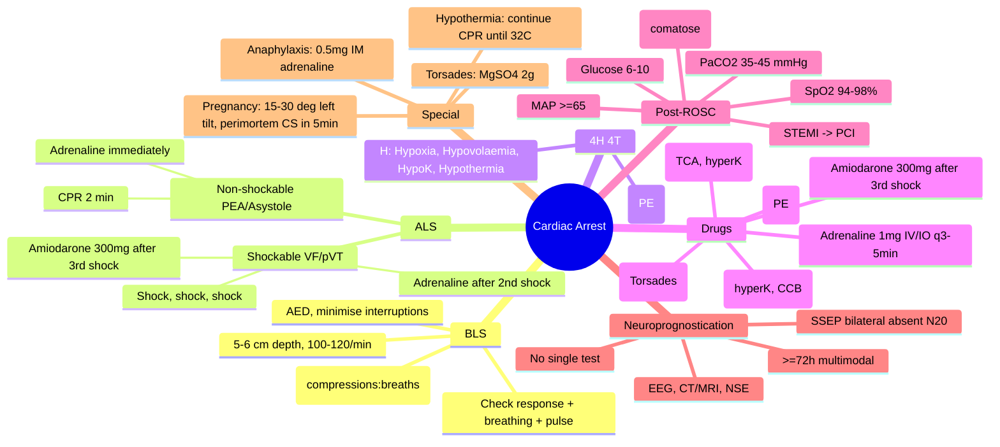
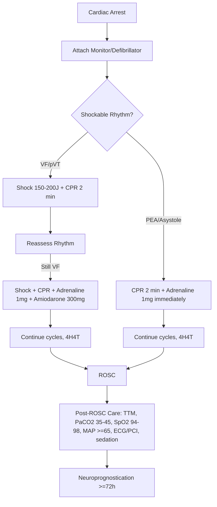

Related: [[Acute Coronary Syndromes in Critical Care]], [[Coma and Altered Consciousness]], [[Brainstem Death and Organ Donation]]

> [!important]
> Cardiac arrest = **sudden cessation of effective cardiac output**. **BLS → ALS algorithm** (Resuscitation Council UK 2021): 4Hs + 4Ts reversible causes, high-quality CPR (depth 5-6 cm, rate 100-120/min, full recoil, minimise interruptions, rotate compressor every 2 min), Adrenaline 1 mg IV every 3-5 min, **Amiodarone 300 mg IV** after 3rd shock in refractory VF/pVT. **Post-ROSC care**: **targeted temperature management (TTM) 32-36°C × 24h** for comatose, controlled oxygenation (SpO₂ 94-98%) and ventilation (PaCO₂ 35-45 mmHg), early **coronary angiography** for STEMI/high suspicion, **neuroprognostication ≥72h** multimodal. Key FCPS/MRCP: shockable vs non-shockable, 4H 4T, adrenaline timing, TTM 32-36°C, prognostication rules.

## 1. Learning Objectives
- Recognise cardiac arrest and call for help (ABCDE → collapse → BLS)
- Apply adult BLS algorithm (chest compressions, rescue breaths, AED)
- Apply adult ALS algorithm (shockable: VF/pVT vs non-shockable: PEA/asystole)
- Identify and treat reversible causes (4Hs and 4Ts)
- Manage post-ROSC care (TTM, ventilation, haemodynamics, PCI)
- Apply neuroprognostication multimodal approach
- Counsel family, document, escalate appropriately

## 2. Definitions
- **Cardiac arrest**: sudden cessation of effective cardiac output → unresponsiveness + apnoea/gasping + no pulse
- **VF (ventricular fibrillation)**: chaotic ventricular activity, no coordinated contraction
- **pVT (pulseless VT)**: organised VT without cardiac output
- **PEA (pulseless electrical activity)**: electrical activity on ECG but no mechanical output
- **Asystole**: no electrical activity (flat line)
- **ROSC (return of spontaneous circulation)**: palpable pulse, measurable BP, organised rhythm

## 3. BLS (Adult)
1. **Safety** — check scene
2. **Response** — shake and shout
3. **Call for help** — 2222 (hospital) / 999 (community)
4. **Check pulse + breathing** — max 10 s; if uncertain, start CPR
5. **Chest compressions**: centre of chest, **5–6 cm depth**, **rate 100–120/min**, full recoil, minimise interruptions
6. **Rescue breaths** (if trained): 30:2 ratio
7. **AED** — attach, follow prompts, shock if advised
8. **Continue** until ALS arrives or ROSC

## 4. ALS Algorithm (Resuscitation Council UK 2021)

### Initial Actions
- **Confirm cardiac arrest** (no pulse, unresponsive, not breathing normally)
- **Call resuscitation team**, attach defibrillator/monitor
- **High-quality CPR** while charging
- **IV/IO access**

### Shockable (VF / pVT)
| Step | Action |
|------|--------|
| 1 | CPR + **shock (biphasic 150–200 J)**, resume CPR immediately |
| 2 | CPR 2 min, rhythm check |
| 3 | If still VF/pVT → **shock**, resume CPR |
| 4 | **Adrenaline 1 mg IV/IO** + Amiodarone **300 mg IV/IO** after 3rd shock (then 150 mg × 1 after 5th) |
| 5 | Continue cycles; consider 4Hs/4Ts |

### Non-Shockable (Asystole / PEA)
| Step | Action |
|------|--------|
| 1 | CPR 2 min |
| 2 | Rhythm check |
| 3 | If asystole/PEA → **Adrenaline 1 mg IV/IO immediately**, continue CPR |
| 4 | Repeat every 3–5 min |
| 5 | Treat reversible causes |

## 5. Reversible Causes — 4Hs and 4Ts

### 4 H's
- **Hypoxia** — intubate, 100% O₂
- **Hypovolaemia** — fluids, blood
- **Hypo/Hyperkalaemia** (and metabolic) — Ca gluconate, insulin/dextrose, NaHCO₃
- **Hypothermia** — rewarming

### 4 T's
- **Tension pneumothorax** — needle decompression 2nd ICS MCL
- **Tamponade** — pericardiocentesis
- **Toxins** — specific antidotes (e.g., digoxin Fab, naloxone, glucagon for β-blocker)
- **Thrombosis (PE)** — thrombolysis (tenecteplase 50 mg, then consider further)

## 6. Drugs in Cardiac Arrest
| Drug | Dose | Indication |
|------|------|------------|
| **Adrenaline** | 1 mg IV/IO every 3–5 min | All rhythms; **after 2nd shock** in VF/pVT, **immediately** in asystole/PEA |
| **Amiodarone** | 300 mg IV/IO bolus (after 3rd shock) | Refractory VF/pVT |
| **Lidocaine** | 1 mg/kg (alternative) | If amiodarone unavailable |
| **Calcium gluconate 10%** | 10 mL IV | Hyperkalaemia, hypocalcaemia, CCB overdose |
| **Sodium bicarbonate 8.4%** | 50 mL (1 mmol/kg) | Severe acidosis, hyperkalaemia, TCA overdose |
| **Magnesium sulphate** | 2 g (8 mmol) IV | Torsades de pointes, hypomagnesaemia |
| **Thrombolytics** | Tenecteplase 50 mg bolus | Suspected/confirmed massive PE |
| **Fluids** | 0.9% saline 1 L bolus | Hypovolaemia |

## 7. Post-ROSC Care (Integrated)

### Immediate
- **Airway**: intubate if not already; confirm with waveform capnography (target PaCO₂ 35–45 mmHg)
- **Breathing**: 100% O₂ initially, titrate to **SpO₂ 94–98%** (avoid hyperoxia)
- **Circulation**: IV access (×2), 12-lead ECG, BP target **MAP ≥65 mmHg** (fluids + vasopressors)
- **Targeted Temperature Management (TTM)**: **32–36°C × 24 h** for comatose (GCS ≤8) post-ROSC
- **Capnography**: target ETCO₂ 35–45 mmHg (avoid hypocapnia)
- **Glucose**: target 6–10 mmol/L (avoid hypo- and hyperglycaemia)
- **Sedation + analgesia** (e.g., propofol + fentanyl) — required for TTM

### Specific Therapies
- **STEMI on post-ROSC ECG** → **immediate primary PCI** (regardless of coma)
- **High suspicion of MI without ST elevation** → early coronary angiography (COACT, EMERGE trials)
- **Seizure control** → levetiracetam/phenytoin; EEG monitoring (non-convulsive status)
- **Continued TTM** for 24 h, then **slow rewarming** (0.25 °C/h) to normothermia

### ICU Care
- **Mechanical ventilation** lung-protective
- **Haemodynamic targets**: MAP ≥65, lactate <2, UO ≥0.5 mL/kg/h
- **DVT/PUD prophylaxis**
- **Glycaemic control**
- **Nutrition** (start enteral within 24–48 h)
- **Avoid**: hypoxia, hyperoxia, hypocapnia, hyperthermia (fever), hypotension, hypoglycaemia, anaemia, hyponatraemia

## 8. Targeted Temperature Management (TTM)
- **Indication**: comatose (GCS ≤8) adult post-ROSC from any rhythm
- **Target**: 32–36°C × 24 h (any in this range acceptable per TTM-2)
- **Methods**: surface cooling (ice packs, cooling blankets), intravascular cooling catheter
- **Sedation/analgesia/NMB** required to prevent shivering
- **Rewarming**: 0.25 °C/h to normothermia (avoid rebound hyperthermia)
- **Avoid** in: active bleeding, severe sepsis, pre-existing coagulopathy (relative)
- **Contraindications**: DNR, severe neurological injury (clinical decision)

## 9. Neuroprognostication (Multimodal, ≥72h post-ROSC)
No single test is sufficient. **Multimodal approach**:
| Modality | Findings suggesting poor outcome |
|----------|----------------------------------|
| **Clinical** | Absent pupillary/corneal reflexes at ≥72 h |
| **Somatosensory evoked potentials (SSEP)** | Bilateral absent N20 |
| **EEG** | Burst-suppression, status epilepticus, generalised suppression |
| **CT/MRI brain** | Diffuse cortical ischaemia, cytotoxic oedema |
| **Biomarkers** | NSE >90 μg/L, S100B elevated |
| **Withdrawal of life support** | Only after ≥72 h with consistent findings |

## 10. Special Situations

### Cardiac Arrest in Pregnancy
- **Aortocaval compression** >20 weeks — left lateral tilt 15–30° or manual uterine displacement
- **Perimortem Caesarean section** within 5 min if ROSC not achieved
- 4Hs/4Ts same, plus consider: amniotic fluid embolism, eclampsia, magnesium toxicity

### Drowning
- 5 rescue breaths first (water in airways)
- Then standard BLS/ALS

### Hypothermia
- Handle gently (arrhythmogenic)
- Continue CPR until core temp ≥32°C ("not dead until warm and dead")
- Severe (<30°C) → consider ECMO rewarming

### Anaphylaxis
- **Adrenaline 0.5 mg IM** (NOT 1 mg IV) — this is the exception to standard ALS
- IV fluids, antihistamines, steroids (secondary)

## 11. Special Circumstances — Tachycardia
| Rhythm | Treatment |
|--------|-----------|
| **Stable VT** | Amiodarone 300 mg IV over 20–60 min |
| **SVT** | Vagal manoeuvres → adenosine 6 mg → 12 mg → 12 mg |
| **AF with rapid rate** | Rate control (β-blocker, CCB, digoxin) |
| **Torsades** | Magnesium 2 g IV; overdrive pacing; isoprenaline |

## 12. Outcome
- **Out-of-hospital VF arrest**: 20–40% ROSC, 10–20% survival
- **In-hospital arrest**: 15–25% survival to discharge
- **Asystole/PEA**: worse prognosis
- **Bystander CPR doubles survival**
- **Bystander AED + shockable rhythm**: 50–70% survival

## 13. FCPS/MRCP High-Yield Points
1. **BLS**: 5–6 cm depth, 100–120/min, full recoil
2. **Adrenaline 1 mg every 3–5 min** (after 2nd shock in VF; immediately in PEA/asystole)
3. **Amiodarone 300 mg** after 3rd shock in refractory VF/pVT
4. **4Hs**: Hypoxia, Hypovolaemia, Hypo/hyperK+metabolic, Hypothermia
5. **4Ts**: Tension PTX, Tamponade, Toxins, Thrombosis (PE)
6. **Capnography** confirms tracheal intubation + monitors CPR quality (target ETCO₂ >10 mmHg)
7. **Post-ROSC**: TTM 32–36°C × 24 h for comatose
8. **SpO₂ target 94–98%** (avoid hyperoxia)
9. **PaCO₂ 35–45 mmHg** (avoid hypocapnia)
10. **STEMI post-ROSC** → immediate PCI
11. **MAP ≥65 mmHg**, UO ≥0.5 mL/kg/h
12. **Neuroprognostication ≥72h multimodal**
13. **Perimortem C-section** in pregnancy within 5 min
14. **Anaphylaxis arrest** = IM adrenaline (not IV bolus)
15. **Torsades** = magnesium 2 g IV

## 14. Common Viva Questions
1. Outline the adult BLS algorithm
2. Shockable vs non-shockable rhythm management
3. 4H and 4T reversible causes
4. Drug doses: Adrenaline, Amiodarone
5. Post-ROSC care bundle
6. TTM target and duration
7. Neuroprognostication: when, how
8. Cardiac arrest in pregnancy
9. Calcium in cardiac arrest
10. Anaphylaxis cardiac arrest

## 15. Common Confusions / Exam Traps
- **Adrenaline 1 mg IV, NOT 0.5 mg** (in cardiac arrest; anaphylaxis uses 0.5 mg IM)
- **Adrenaline given immediately in PEA/asystole** but **after 2nd shock in VF**
- **Amiodarone after 3rd shock** (not 1st)
- **Waveform capnography** mandatory for intubation confirmation
- **Avoid hyperoxia** post-ROSC (SpO₂ 94–98%)
- **Hypothermia** is reversible — "not dead until warm and dead"
- **Perimortem C-section** = within 5 min
- **Bilateral absent N20 SSEP** = poor prognosis
- **Single predictor** = insufficient for withdrawal of care
- **Adrenaline every 3–5 min** (not every 1 min)

## 16. Mnemonics
- **4 H's**: **H**ypoxia, **H**ypovolaemia, **H**ypo/hyperK, **H**ypothermia
- **4 T's**: **T**ension PTX, **T**amponade, **T**oxins, **T**hrombosis
- **Adrenaline timing**: **PEA/Asystole = immediately**; **VF/pVT = after 2nd shock**
- **Amiodarone**: after **3rd shock** → 300 mg; after **5th shock** → 150 mg
- **TTM target**: **32–36°C × 24 h** (any in range)
- **Post-ROSC SpO₂**: 94–98% (avoid hyperoxia)
- **PaCO₂ post-ROSC**: 35–45 mmHg
- **MAP post-ROSC**: ≥65 mmHg
- **Drugs**: **A**drenaline + **A**miodarone
- **Anaphylaxis arrest**: **0.5 mg IM**, NOT 1 mg IV

## 17. Mind Map

## 18. Flowchart — Adult ALS

## 19. One-Page Revision Summary
- **BLS**: 5–6 cm depth, 100–120/min, 30:2 ratio, minimise interruptions
- **Adrenaline 1 mg IV/IO every 3–5 min** (after 2nd shock in VF; immediately in PEA/asystole)
- **Amiodarone 300 mg** after 3rd shock in refractory VF/pVT (150 mg after 5th)
- **4H 4T**: Hypoxia, Hypovolaemia, Hypo/hyperK, Hypothermia / Tension PTX, Tamponade, Toxins, Thrombosis
- **Post-ROSC**: TTM **32–36°C × 24 h** for comatose, SpO₂ 94–98%, PaCO₂ 35–45, MAP ≥65
- **STEMI post-ROSC → immediate PCI**
- **Neuroprognostication ≥72h multimodal** (SSEP, EEG, MRI, NSE)
- **Capnography** for intubation confirmation + CPR quality
- **Pregnancy**: left lateral tilt + perimortem CS within 5 min
- **Anaphylaxis arrest**: 0.5 mg IM (not 1 mg IV)

## 24-Hour Recall Prompts
- List 4H 4T reversible causes
- State adrenaline and amiodarone doses and timing
- Outline post-ROSC care bundle
- State TTM target and duration
- List 3 neuroprognostication modalities

## 7-Day / 15-Day / 30-Day Revision Tracker
- [ ] Day 1 completed
- [ ] 24-hour recall completed
- [ ] Day 7 revision completed
- [ ] Day 15 revision completed
- [ ] Day 30 revision completed

## 20. Must Know / Should Know / Nice to Know
### Must Know
- BLS algorithm
- ALS algorithm (shockable + non-shockable)
- Adrenaline 1 mg IV q3-5 min
- Amiodarone 300 mg after 3rd shock
- 4H 4T reversible causes
- Post-ROSC care bundle
- TTM 32–36°C × 24 h
- STEMI post-ROSC → PCI

### Should Know
- Capnography
- SpO₂ 94–98% / PaCO₂ 35–45
- Calcium in hyperkalaemia arrest
- Magnesium in Torsades
- Thrombolysis in PE arrest
- Pregnancy modifications (left tilt, perimortem CS)
- Anaphylaxis arrest = IM adrenaline

### Nice to Know
- Neuroprognostication timing and modalities (SSEP, EEG, MRI, NSE)
- ECMO in refractory arrest (ECPR)
- Hypothermia management
- Reversible causes of asystole vs PEA

## 21. Self-Test Scorecard
- Understanding: /10
- Recall: /10
- MCQ Performance: /10
- SBA Performance: /10
- Viva Confidence: /10
- Total: /50

> [!tip]
> Interpretation: <35 = weak topic, 35-44 = acceptable but insecure, 45+ = strong exam-ready topic.

## 22. Exam Answer Modes
### Long Answer Skeleton
- Definition cardiac arrest
- BLS algorithm (chest compressions, breaths, AED)
- ALS algorithm (shockable VF/pVT vs non-shockable PEA/asystole)
- 4H 4T reversible causes
- Drugs (adrenaline, amiodarone, calcium, bicarbonate, magnesium)
- Post-ROSC care (TTM, oxygenation, ventilation, haemodynamics, PCI, sedation)
- Neuroprognostication (≥72h, multimodal)
- Special situations (pregnancy, anaphylaxis, hypothermia)

### Short Note Skeleton
- ALS algorithm flowchart
- 4H 4T table
- Drug doses
- Post-ROSC bundle
- TTM target

### Viva One-Liners
- "Adrenaline 1 mg IV every 3–5 min in cardiac arrest"
- "Amiodarone 300 mg after 3rd shock in refractory VF"
- "4H: Hypoxia, Hypovolaemia, Hypo/hyperK, Hypothermia"
- "4T: Tension PTX, Tamponade, Toxins, Thrombosis"
- "TTM 32–36°C × 24 h for comatose post-ROSC"
- "SpO₂ 94–98%, PaCO₂ 35–45 mmHg post-ROSC"
- "MAP ≥65 post-ROSC"
- "STEMI post-ROSC → immediate PCI"
- "Neuroprognostication ≥72h multimodal"
- "Anaphylaxis arrest: 0.5 mg IM adrenaline, NOT 1 mg IV"
- "Pregnancy: 15–30° left tilt, perimortem C-section in 5 min"
- "Capnography confirms intubation + monitors CPR quality"

### Ward-Case Discussion Points
- VF arrest, ROSC after 3 shocks → ICU, TTM 33°C, SpO₂ 96%, PaCO₂ 40, MAP 70 → PCI
- Asystole arrest, PEA cause: massive PE → perimortem thrombolysis (tenecteplase 50 mg)
- Anaphylaxis arrest → IM adrenaline 0.5 mg, IV fluids, observe for 4–8 h
- Hypothermic arrest (snow, exposure) → continue CPR, transfer to ECMO centre
- Pregnancy 32 weeks cardiac arrest → left lateral tilt, perimortem C-section

### Last-Night-Before-Exam Sheet
- BLS: 5–6 cm, 100–120/min, 30:2
- Adrenaline 1 mg IV/IO q3–5 min
- Amiodarone 300 mg after 3rd shock
- 4H: Hypoxia, Hypovolaemia, Hypo/hyperK, Hypothermia
- 4T: Tension PTX, Tamponade, Toxins, Thrombosis
- TTM 32–36°C × 24 h
- SpO₂ 94–98% / PaCO₂ 35–45
- MAP ≥65 / STEMI → PCI
- Neuroprognostication ≥72h
- Anaphylaxis = 0.5 mg IM
- Pregnancy = 15–30° tilt + perimortem CS in 5 min

## 23. Summary
**Cardiac arrest** = sudden cessation of effective cardiac output. **BLS**: 5–6 cm depth, 100–120/min, 30:2, minimise interruptions, AED. **ALS algorithm** (RCUK 2021): **Shockable (VF/pVT)**: shock → CPR 2 min → shock → CPR + Adrenaline after 2nd shock + Amiodarone 300 mg after 3rd shock. **Non-shockable (PEA/asystole)**: CPR 2 min + Adrenaline immediately. **Reversible causes — 4H 4T**: Hypoxia, Hypovolaemia, Hypo/hyperK, Hypothermia / Tension PTX, Tamponade, Toxins, Thrombosis (PE). **Drugs**: Adrenaline 1 mg IV/IO every 3–5 min, Amiodarone 300 mg (then 150 mg), Ca gluconate (hyperK/CCB), NaHCO₃ (TCA/hyperK), MgSO₄ 2 g (Torsades), thrombolysis (PE). **Post-ROSC integrated care**: **TTM 32–36°C × 24 h** for comatose, SpO₂ **94–98%** (avoid hyperoxia), PaCO₂ **35–45 mmHg**, MAP **≥65 mmHg**, glycaemic control 6–10 mmol/L, sedation + analgesia. **STEMI on post-ROSC ECG → immediate PCI** (regardless of coma). **Neuroprognostication**: ≥72 h multimodal — SSEP (bilateral absent N20), EEG, MRI, NSE. **Capnography** confirms intubation + monitors CPR quality. **Special situations**: pregnancy (left tilt, perimortem C-section in 5 min), anaphylaxis (0.5 mg IM adrenaline), hypothermia (continue CPR to 32°C), drowning (5 initial breaths).

## 24. MCQs (10)
1. Adult chest compression depth and rate:
   A. 3–4 cm, 80–100/min
   B. **5–6 cm, 100–120/min**
   C. 6–7 cm, 120–140/min
   D. 4–5 cm, 60–80/min

2. Adrenaline dose in adult cardiac arrest:
   A. 0.5 mg IV
   B. **1 mg IV/IO every 3–5 min**
   C. 5 mg IV bolus
   D. 1 mg IM

3. Amiodarone is given in cardiac arrest:
   A. After 1st shock
   B. After 2nd shock
   C. **After 3rd shock in refractory VF/pVT**
   D. Only in PEA

4. 4H reversible causes include all EXCEPT:
   A. Hypoxia
   B. Hypovolaemia
   C. **Tamponade**
   D. Hypothermia

5. TTM target post-ROSC for comatose patient:
   A. 28–30°C × 12 h
   B. **32–36°C × 24 h**
   C. 37°C normothermia
   D. 35°C × 48 h

6. SpO₂ target post-ROSC:
   A. >98%
   B. **94–98%**
   C. 88–92%
   D. 100%

7. STEMI on post-ROSC ECG, comatose patient. Best management:
   A. Wait 24 h
   B. **Immediate primary PCI regardless of coma**
   C. Thrombolysis
   D. CT head first

8. Neuroprognostication post-ROSC should be performed:
   A. Immediately
   B. At 24 h
   C. **≥72 h multimodal**
   D. At 1 week

9. Anaphylactic cardiac arrest — first drug:
   A. Adrenaline 1 mg IV
   B. **Adrenaline 0.5 mg IM**
   C. Hydrocortisone IV
   D. Chlorpheniramine IV

10. Cardiac arrest in 32-week pregnant woman. First action:
    A. Perimortem C-section
    B. **Left lateral tilt 15–30° + standard ALS**
    C. CTG
    D. Magnesium

## 25. SBA Questions (10)
1. A 60-year-old VF arrest, 3 shocks, 3 doses adrenaline, ROSC achieved. Post-ROSC GCS 4. Next step:
   A. Extubate
   B. **TTM 32–36°C × 24 h + ICU care**
   C. Normothermia
   D. MRI brain first

2. Pulseless arrest, ECG shows narrow QRS at 60/min. Cause likely:
   A. VF
   B. **PEA — look for reversible cause (PE, tamponade, tension PTX)**
   C. Sinus rhythm
   D. Asystole

3. Torsades de pointes cardiac arrest. Best drug:
   A. Adrenaline
   B. Amiodarone
   C. **Magnesium sulphate 2 g IV**
   D. Lignocaine

4. Witnessed VF arrest, immediate bystander CPR + AED shock at 4 min, ROSC at 8 min. Best outcome:
   A. 10% survival
   B. 30% survival
   C. **Best — early CPR + defibrillation → 50–70% survival**
   D. Zero

5. Post-ROSC, SpO₂ 100% on 100% O₂. Action:
   A. Continue 100% O₂
   B. **Titrate FiO₂ down to SpO₂ 94–98% (avoid hyperoxia)**
   C. Increase O₂
   D. CPAP

6. Cardiac arrest, 4 Hs and 4 Ts. PE suspected. Drug:
   A. Adrenaline 1 mg
   B. Amiodarone
   C. **Thrombolysis (tenecteplase 50 mg bolus)**
   D. Heparin

7. TTM complication:
   A. Hypertension
   B. Bradycardia (allowed)
   C. Hyperglycaemia
   D. **Shivering (treat with sedation/NMB/magnesium)**

8. Bilateral absent N20 on SSEP post-ROSC indicates:
   A. Favourable outcome
   B. **Poor neurological prognosis (consistent with poor outcome)**
   C. Brain death
   D. Inconclusive

9. Capnography during CPR — ETCO₂ <10 mmHg suggests:
   A. ROSC achieved
   B. **Poor CPR quality / low cardiac output**
   C. Intubation confirmed
   D. Hyperventilation

10. Patient on β-blocker overdose in cardiac arrest. Drug of choice:
    A. Adrenaline
    B. Amiodarone
    C. **Glucagon + high-dose insulin + calcium**
    D. Vasopressin

## 26. Flashcards
- Q: Adult BLS compression depth and rate
  A: 5–6 cm depth, 100–120/min
- Q: Adrenaline dose in cardiac arrest
  A: 1 mg IV/IO every 3–5 min
- Q: Adrenaline timing
  A: VF/pVT = after 2nd shock; PEA/asystole = immediately
- Q: Amiodarone dose
  A: 300 mg IV/IO after 3rd shock (150 mg after 5th)
- Q: 4H 4T
  A: Hypoxia, Hypovolaemia, Hypo/hyperK, Hypothermia / Tension PTX, Tamponade, Toxins, Thrombosis
- Q: TTM target post-ROSC
  A: 32–36°C × 24 h for comatose
- Q: Post-ROSC SpO₂ target
  A: 94–98%
- Q: Post-ROSC PaCO₂ target
  A: 35–45 mmHg
- Q: Post-ROSC MAP target
  A: ≥65 mmHg
- Q: STEMI post-ROSC management
  A: Immediate PCI
- Q: Neuroprognostication timing
  A: ≥72 h multimodal
- Q: Anaphylaxis arrest drug
  A: 0.5 mg IM adrenaline (NOT 1 mg IV)
- Q: Perimortem C-section
  A: Within 5 min if ROSC not achieved
- Q: Torsades treatment
  A: MgSO₄ 2 g IV

## 27. Answer Key with Explanations
**MCQ 1**: B — ERC 2021: 5–6 cm, 100–120/min.
**MCQ 2**: B — Adrenaline 1 mg IV/IO every 3–5 min.
**MCQ 3**: C — Amiodarone 300 mg after 3rd shock.
**MCQ 4**: C — Tamponade is a "T" not "H".
**MCQ 5**: B — TTM 32–36°C × 24 h (TTM-2 trial).
**MCQ 6**: B — Avoid hyperoxia; SpO₂ 94–98%.
**MCQ 7**: B — STEMI post-ROSC → immediate PCI.
**MCQ 8**: C — Neuroprognostication ≥72 h.
**MCQ 9**: B — Anaphylaxis = 0.5 mg IM (NOT 1 mg IV bolus).
**MCQ 10**: B — Left lateral tilt first; perimortem CS in 5 min if no ROSC.

**SBA 1**: B — Comatose post-ROSC → TTM 32–36°C × 24 h.
**SBA 2**: B — Narrow QRS with no pulse = PEA; look for reversible cause.
**SBA 3**: C — Torsades = MgSO₄ 2 g IV.
**SBA 4**: C — Bystander CPR + AED + shockable rhythm = 50–70% survival.
**SBA 5**: B — Avoid hyperoxia post-ROSC; titrate to 94–98%.
**SBA 6**: C — Perimortem thrombolysis for PE.
**SBA 7**: D — Shivering is a TTM complication (treat with sedation/NMB).
**SBA 8**: B — Bilateral absent N20 = poor prognosis.
**SBA 9**: B — ETCO₂ <10 mmHg suggests poor CPR quality.
**SBA 10**: C — β-blocker overdose: glucagon + high-dose insulin + calcium.

---

**Status**: Full FCPS/MRCP topic note completed — 2026-06-15