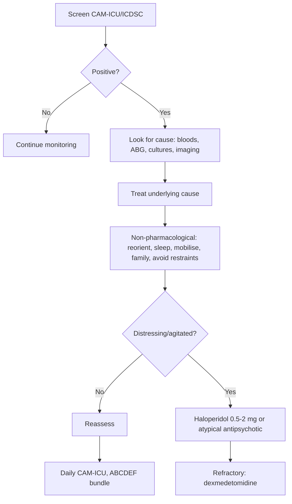

Related: [[Sedation, Analgesia and Neuromuscular Blockade in ICU]], [[Acute Medicine in the Elderly]], [[Coma and Altered Consciousness]]

> [!important]
> **Delirium = acute, fluctuating disturbance of attention, awareness, and cognition** in setting of underlying medical illness. ICU delirium affects **30-80% of mechanically ventilated patients**. **CAM-ICU / ICDSC** for screening. **3 subtypes**: hyperactive (agitated), hypoactive (lethargic, often missed), mixed. **Predisposing**: age, dementia, frailty, alcohol. **Precipitating**: sedation (especially benzodiazepines), sepsis, hypoxaemia, metabolic. **Management**: ABCDE bundle (Awakening, Breathing, Choice of sedation, Delirium, Early mobility), antipsychotics (haloperidol, olanzapine, quetiapine) for distressing symptoms, dexmedetomidine for hyperactive delirium. **Prevention** = best. FCPS/MRCP: CAM-ICU, risk factors, haloperidol cautions (QTc), benzodiazepine avoidance, non-pharmacological management.

## 1. Learning Objectives
- Diagnose delirium using CAM-ICU / ICDSC
- Distinguish hyperactive, hypoactive, mixed subtypes
- Identify predisposing + precipitating risk factors
- Apply prevention (ABCDE bundle, non-pharmacological)
- Manage pharmacological treatment (haloperidol, atypical antipsychotics, dexmedetomidine)
- Avoid benzodiazepines (deliriogenic)
- Treat underlying medical causes
- Counsel family

## 2. Definition (DSM-5)
- **Disturbance of attention, awareness, cognition** (develops over hours-days, fluctuates)
- **Not better explained** by pre-existing neurocognitive disorder
- **Evidence of physiological cause** (substance intoxication/withdrawal, medication, medical condition)
- **Severity**: mild (1 criterion) to severe (multiple criteria)

## 3. Epidemiology
- **General medical inpatients**: 10-30%
- **ICU mechanically ventilated**: 30-80% (up to 80%)
- **Post-operative elderly**: 15-50%
- **Palliative care**: 25-85%
- **Increased mortality**: OR 1.5-2x
- **Increased LOS**, long-term cognitive impairment

## 4. Subtypes
| Subtype | Frequency | Features | Notes |
|---------|-----------|----------|-------|
| **Hyperactive** | 5-25% | Agitation, restlessness, hallucinations, combative | Often drug/withdrawal |
| **Hypoactive** | 25-50% | Lethargy, inattention, reduced motor activity, withdrawal | Often missed; worse prognosis |
| **Mixed** | 30-75% | Fluctuates between hyper- and hypoactive | Most common |
| **Subsyndromal** | Variable | Mild symptoms, not full criteria | At risk of progression |

## 5. Pathophysiology
- **Cholinergic deficiency** (acetylcholine ↓)
- **Dopamine excess**
- **Serotonin dysregulation**
- **Inflammation** (cytokines, SIRS)
- **Direct neuronal injury** (hypoxia, hypoglycaemia, sepsis)
- **Disrupted sleep-wake cycle**

## 6. Risk Factors

### Predisposing (Baseline)
- **Age** (especially >65)
- **Dementia** (strongest single factor)
- **Frailty**
- **Prior delirium, stroke, Parkinson's**
- **Sensory impairment** (vision, hearing)
- **Alcohol, smoking**
- **Polypharmacy**
- **Depression**
- **Malnutrition**

### Precipitating (Acute)
- **Infection/sepsis** (most common)
- **Medications** (especially **benzodiazepines**, anticholinergics, opioids, corticosteroids, antihistamines)
- **Sedation** (deep sedation, prolonged)
- **Metabolic**: hyponatraemia, hypoglycaemia, hypercalcaemia, AKI, liver failure
- **Hypoxia, hypercapnia**
- **Pain** (undertreated or overtreated)
- **Sleep deprivation**
- **Mechanical ventilation**
- **Surgery** (especially cardiac, orthopaedic, hip fracture)
- **Withdrawal** (alcohol, benzodiazepines)
- **Constipation, urinary retention**
- **Lines, tubes, restraints**

## 7. Clinical Features
- **Acute onset** (hours-days), **fluctuating course** (often worse at night — "sundowning")
- **Inattention** (key feature): difficulty focusing, can't follow conversation
- **Disorganised thinking**
- **Altered level of consciousness** (hyper or hypo)
- **Cognitive impairment**: disorientation, memory loss
- **Psychomotor**: agitation OR retardation
- **Perceptual**: hallucinations (visual > auditory), delusions
- **Emotional**: fear, anxiety, depression, lability
- **Sleep-wake disturbance**

## 8. Diagnosis — ICU Screening Tools

### CAM-ICU (Confusion Assessment Method — ICU)
**Feature 1**: Acute change/fluctuating mental status
**Feature 2**: Inattention (letters test, picture test)
**Feature 3**: Altered level of consciousness (RASS)
**Feature 4**: Disorganised thinking
**Positive CAM-ICU = Features 1+2 + (3 or 4)**

### ICDSC (Intensive Care Delirium Screening Checklist)
- 8 items, scored 0-8; ≥4 = delirium; 1-3 = subsyndromal
- Items: altered LOC, inattention, disorientation, hallucination/delusion, psychomotor, speech, sleep-wake, symptom fluctuation

### RASS (Richmond Agitation-Sedation Scale)
- Target **0 to -1** (alert to drowsy)
- **+4** combative, +1 restless, **0** alert, **-1** drowsy, -5 unarousable
- Patient arousable (RASS -3 to +4) → can assess CAM-ICU

## 9. Investigations — Look for Cause
- **Bloods**: FBC, U&E, Ca²⁺, Mg²⁺, glucose, LFTs, ammonia (liver), CRP, blood culture
- **ABG**: hypoxaemia, hypercapnia, acidosis
- **ECG**: QTc (if antipsychotic considered)
- **Imaging**: CXR, CT head (if focal neurology, falls, anticoagulation, head injury)
- **LP** (if fever +/− meningism, immunocompromised)
- **EEG** (if seizures suspected, non-convulsive status)
- **Toxicology screen**

## 10. Management

### Non-Pharmacological (First-Line, All Patients)
1. **Reorientation**: clock, calendar, glasses, hearing aids
2. **Sleep-wake cycle**: day/night lighting, sleep hygiene, minimise night interventions
3. **Early mobilisation** (ABCDEF bundle)
4. **Avoid restraints**, lines, catheters if possible
5. **Treat pain** (analgesia first)
6. **Adequate hydration + nutrition**
7. **Frequent reorientation**, family visits
8. **Avoid benzodiazepines** unless alcohol/benzo withdrawal
9. **Address constipation, urinary retention**
10. **Review medications** (STOP anticholinergics)
11. **Oxygen** if hypoxic
12. **Reassess daily**

### ABCDEF Bundle (SCCM)
- **A**: Assess, prevent, manage pain
- **B**: Both SAT (spontaneous awakening trial) + SBT (spontaneous breathing trial)
- **C**: Choice of analgesia and sedation (light sedation, avoid benzos)
- **D**: Delirium: assess, prevent, manage
- **E**: Early mobility and exercise
- **F**: Family engagement and empowerment

### Pharmacological

| Drug | Dose | Use |
|------|------|-----|
| **Haloperidol** | 0.5-2 mg PO/IV q15-30 min (max 30 mg/24 h ICU) | Hyperactive distressing symptoms; agitation risk to self/others |
| **Olanzapine** | 2.5-5 mg PO/IM | Alternative; less EPS |
| **Quetiapine** | 12.5-50 mg PO q12h | Hypoactive?; low-dose, also for sleep |
| **Risperidone** | 0.5-1 mg PO | Less used in ICU |
| **Dexmedetomidine** | 0.2-1.5 mcg/kg/h IV infusion | Hyperactive; facilitates extubation (DahLBA, MIDEX trials) |
| **Melatonin / Ramelteon** | 3-5 mg PO nocte | Sleep-wake cycle |

> **Avoid** benzodiazepines (deliriogenic). Exception: alcohol/benzodiazepine withdrawal (use diazepam/chlordiazepoxide per CIWA).

### Haloperidol Cautions
- **QTc prolongation** → baseline ECG, monitor (especially with other QT drugs)
- **EPS** (acute dystonia, parkinsonism, tardive dyskinesia with chronic)
- **NMS** (rare but serious)
- **Reduce dose** in elderly, hepatic impairment
- **IV haloperidol** not licensed in UK (use oral/IM/NG)

### Treatment of Underlying Cause
- **Sepsis**: antibiotics, source control
- **Metabolic**: correct Na⁺, glucose, Ca²⁺, Mg²⁺
- **Hypoxia**: oxygen, ventilation
- **Withdrawal**: CIWA protocol
- **Pain**: analgesia (paracetamol, opioids as needed)
- **Constipation/retention**: laxatives, catheter

## 11. Special Situations

### Alcohol Withdrawal Delirium (Delirium Tremens)
- **Onset**: 48-96 h after last drink
- **Features**: agitation, tremor, sweating, tachycardia, visual hallucinations, seizures
- **Rx**: **Chlordiazepoxide** (librium) or **diazepam** (CIWA-Ar protocol)
- **+ Thiamine** (Pabrinex IV 2 pairs tds × 3 days, then oral)
- **+ Beta-blocker/clonidine** for sympathetic overactivity
- **+ Haloperidol** for hallucinations (avoid in withdrawal as monotherapy)
- **DT mortality**: 5-15% untreated

### Benzodiazepine Withdrawal
- **Symptoms**: anxiety, agitation, tremor, seizures
- **Rx**: long-acting benzo (diazepam) tapering OR restart benzo

### Terminal/Palliative Delirium
- **Haloperidol** first-line
- **Levomepromazine** (broad-spectrum antipsychotic) for refractory
- **Midazolam SC** for terminal agitation
- **Family counselling**: often reversible cause

## 12. Prognosis
- **ICU delirium duration** → predictor of long-term cognitive dysfunction
- **In-hospital mortality**: 25-30% (vs 5-10% non-delirious)
- **6-month mortality**: 30-40% in elderly
- **Long-term**: post-ICU cognitive impairment, PTSD, depression
- **Functional decline**: prolonged

## 13. FCPS/MRCP High-Yield Points
1. **Delirium = acute fluctuating disturbance of attention + awareness + cognition**
2. **Hypoactive subtype** = most common, often missed, worst prognosis
3. **Strongest predisposing factor**: dementia
4. **Strongest precipitating factor**: benzodiazepines + sepsis
5. **CAM-ICU = gold standard** screening in ICU (Features 1+2 + 3 or 4)
6. **ICDSC ≥4 = delirium** (1-3 subsyndromal)
7. **RASS target 0 to -1** (light sedation)
8. **First-line Rx**: non-pharmacological (reorientation, sleep-wake, early mobility, family)
9. **Avoid benzodiazepines** (deliriogenic)
10. **Haloperidol** for distressing/agitated symptoms (QTc, EPS risk)
11. **Dexmedetomidine** for hyperactive ICU delirium, facilitates extubation
12. **ABCDEF bundle** = standard of care
13. **DT = alcohol withdrawal** (48-96 h); chlordiazepoxide + thiamine
14. **Thiamine before glucose** (Wernicke's)
15. **Hypoactive delirium**: mortality higher than hyperactive

## 14. Common Viva Questions
1. Define delirium
2. Subtypes of delirium
3. CAM-ICU criteria
4. Predisposing vs precipitating risk factors
5. Non-pharmacological management
6. Pharmacological management (haloperidol, dexmedetomidine)
7. ABCDEF bundle
8. Delirium tremens management
9. Thiamine and Wernicke's
10. Haloperidol adverse effects

## 15. Common Confusions / Exam Traps
- **Hypoactive delirium** often missed (looks "calm")
- **Dementia ≠ delirium** (delirium acute, fluctuating)
- **Benzodiazepines cause delirium** (avoid unless withdrawal)
- **Antipsychotics don't treat underlying cause** — find and treat
- **Haloperidol QTc** — check baseline, monitor
- **IV haloperidol** not licensed in UK (use oral/IM)
- **Thiamine before glucose** to prevent Wernicke's
- **DT mortality 5-15%** untreated
- **Haloperidol** for ALCOHOL withdrawal is adjunct, NOT monotherapy
- **Dexmedetomidine** expensive, ICU-only, bradycardia/hypotension risk
- **Post-ICU cognitive impairment** is a real long-term sequela
- **Restraints WORSEN** delirium

## 16. Mnemonics
- **Delirium DSM-5**: **Attention** (primary) + **Fluctuating** + **Acute** + **Physiological cause**
- **CAM-ICU**: **1+2 + 3 or 4**
- **Hyper hypo mixed**: most common is **MIXED**
- **Strongest risk factor**: **DEMENTIA**
- **Strongest precipitant**: **BENZOS + SEPSIS**
- **ABCDEF bundle**: **A**ssess pain, **B**oth SAT/SBT, **C**hoice of sedation, **D**elirium, **E**arly mobility, **F**amily
- **First-line Rx**: **NON-PHARM** (reorient, sleep, mobilise)
- **Haloperidol cautions**: **QTc, EPS, NMS**
- **DT Rx**: **Benzodiazepine** + **Thiamine**
- **Thiamine before glucose** (Wernicke's)

## 17. Mind Map
```mermaid
mindmap
  root((ICU Delirium))
    Definition
      Acute fluctuating
      Attention + awareness
      Underlying cause
    Subtypes
      Hyperactive (agitation)
      Hypoactive (lethargy) - WORST
      Mixed (most common)
      Subsyndromal
    Risk Factors
      Predisposing
        Dementia
        Age >65
        Frailty
        Polypharmacy
      Precipitating
        Sepsis
        Benzodiazepines
        Sedation depth
        Metabolic
        Hypoxia
        Pain
        Withdrawal
    Diagnosis
      CAM-ICU (1+2+3/4)
      ICDSC >=4
      RASS 0 to -1
    Investigations
      FBC, UE, Ca, Mg
      Glucose, ABG
      CRP, cultures
      CT head, EEG, LP
    Management
      Non-pharmacological
        Reorientation
        Sleep-wake
        Early mobility
        Family
        Avoid restraints
      Pharmacological
        Haloperidol (distressing)
        Atypical antipsychotics
        Dexmedetomidine
      Treat cause
        Sepsis, metabolic
        Withdrawal
    ABCDEF Bundle
      Assess pain
      Both SAT/SBT
      Choice of sedation
      Delirium
      Early mobility
      Family
    Special
      DT: chlordiazepoxide + thiamine
      Terminal: haloperidol, levomepromazine
    Prognosis
      Mortality 25-30%
      Long-term cognitive impairment
```

## 18. Flowchart — Delirium Management


## 19. One-Page Revision Summary
- **Delirium = acute, fluctuating disturbance of attention + awareness + cognition**
- **CAM-ICU = gold standard** (Features 1+2 + 3 or 4)
- **Hypoactive** = most common, often missed, worst prognosis
- **Strongest risk factor**: dementia; **precipitant**: benzodiazepines + sepsis
- **First-line Rx**: non-pharmacological (reorient, sleep, mobilise, family)
- **Avoid benzodiazepines** (deliriogenic; exception: withdrawal)
- **Haloperidol 0.5-2 mg** for distressing/agitated (QTc, EPS risk)
- **Dexmedetomidine** for hyperactive; facilitates extubation
- **ABCDEF bundle** = standard of care
- **DT = alcohol withdrawal** (48-96 h): chlordiazepoxide + thiamine (Pabrinex)
- **Thiamine BEFORE glucose** to prevent Wernicke's

## 24-Hour Recall Prompts
- Define delirium and list 3 subtypes
- List CAM-ICU features
- Outline non-pharmacological management
- State haloperidol dose and cautions
- List ABCDEF bundle components
- Describe DT management

## 7-Day / 15-Day / 30-Day Revision Tracker
- [ ] Day 1 completed
- [ ] 24-hour recall completed
- [ ] Day 7 revision completed
- [ ] Day 15 revision completed
- [ ] Day 30 revision completed

## 20. Must Know / Should Know / Nice to Know
### Must Know
- Delirium definition
- 3 subtypes
- CAM-ICU features
- Risk factors (dementia, benzos, sepsis)
- Non-pharmacological management
- Haloperidol indications and dose
- Avoid benzodiazepines
- DT management (chlordiazepoxide + thiamine)
- Thiamine before glucose

### Should Know
- ICDSC
- RASS target
- ABCDEF bundle
- Atypical antipsychotics (olanzapine, quetiapine)
- Dexmedetomidine use
- Haloperidol adverse effects (QTc, EPS, NMS)
- Wernicke's encephalopathy
- Terminal delirium
- Benzodiazepine withdrawal
- Post-ICU cognitive impairment
- Hypoactive vs hyperactive prognosis

### Nice to Know
- DahLBA, MIDEX trials (dexmedetomidine)
- Propofol-related infusion syndrome
- Long-term PTSD after ICU
- Sleep architecture in ICU
- Anticholinergic burden scale
- Right- vs left-sided limb restraints paradox

## 21. Self-Test Scorecard
- Understanding: /10
- Recall: /10
- MCQ Performance: /10
- SBA Performance: /10
- Viva Confidence: /10
- Total: /50

> [!tip]
> Interpretation: <35 = weak topic, 35-44 = acceptable but insecure, 45+ = strong exam-ready topic.

## 22. Exam Answer Modes
### Long Answer Skeleton
- Definition delirium (DSM-5)
- Pathophysiology
- Subtypes (hyperactive, hypoactive, mixed)
- Risk factors (predisposing + precipitating)
- Diagnosis (CAM-ICU, ICDSC, RASS)
- Investigations (look for cause)
- Management:
  - Non-pharmacological (reorientation, sleep, mobility, family)
  - Pharmacological (haloperidol, atypical, dexmedetomidine)
  - Treat underlying cause
- ABCDEF bundle
- Special situations (DT, terminal, withdrawal)
- Prognosis

### Short Note Skeleton
- CAM-ICU
- ABCDEF bundle
- Haloperidol dose and cautions
- DT management
- Non-pharmacological management

### Viva One-Liners
- "Delirium = acute, fluctuating disturbance of attention + awareness + cognition"
- "CAM-ICU: 1+2 + 3 or 4"
- "Most common subtype: mixed; worst prognosis: hypoactive"
- "Strongest risk factor: dementia"
- "Strongest precipitant: benzodiazepines"
- "First-line Rx: non-pharmacological"
- "Avoid benzodiazepines unless withdrawal"
- "Haloperidol 0.5-2 mg for distressing agitation"
- "Dexmedetomidine for hyperactive ICU delirium"
- "DT: chlordiazepoxide + thiamine (Pabrinex)"
- "Thiamine before glucose (Wernicke's)"

### Ward-Case Discussion Points
- 75-year-old post-op, fluctuating confusion, hallucinations, inattention → CAM-ICU positive, look for sepsis/UTI, haloperidol if distressing
- ICU ventilated, RASS -1, CAM-ICU positive → daily SAT/SBT, dexmedetomidine
- Alcoholic, 48 h post-admission, tremor, sweating, visual hallucinations → DT, chlordiazepoxide, Pabrinex
- ICU survivor, long cognitive issues → post-ICU cognitive impairment, cognitive rehab

### Last-Night-Before-Exam Sheet
- Delirium = acute + fluctuating + attention
- CAM-ICU: 1+2 + 3 or 4
- Mixed = most common
- Hypoactive = worst prognosis
- Dementia = strongest risk
- Benzos = strongest precipitant
- Non-pharm first
- Haloperidol for distressing
- Avoid benzos (except withdrawal)
- DT: chlordiazepoxide + thiamine
- Thiamine before glucose

## 23. Summary
**Delirium** = acute, fluctuating disturbance of attention + awareness + cognition due to physiological cause (DSM-5). **3 subtypes**: **Hyperactive** (agitation, hallucinations, ~5-25%), **Hypoactive** (lethargy, often missed, ~25-50%, **worst prognosis**), **Mixed** (most common, ~30-75%). **Strongest risk factors**: dementia (predisposing), benzodiazepines + sepsis (precipitating). **Diagnosis — CAM-ICU**: Features 1 (acute change) + 2 (inattention) + 3 (altered LOC) or 4 (disorganised thinking) = positive. **RASS target 0 to -1** (light sedation). **Investigations**: FBC, U&E, Ca, Mg, glucose, ABG, CRP, cultures, CT head (if focal), LP (if fever/meningism). **Management**: **Non-pharmacological first** — reorientation (clock, calendar, glasses, hearing aids), sleep-wake cycle, early mobility, family engagement, avoid restraints, treat pain, review meds (stop anticholinergics). **Pharmacological**: **Haloperidol 0.5-2 mg** for distressing/agitated (QTc, EPS, NMS risk); atypical (olanzapine, quetiapine); **dexmedetomidine** for hyperactive ICU delirium. **AVOID benzodiazepines** (deliriogenic) except alcohol/benzodiazepine withdrawal. **ABCDEF bundle**: Assess pain, Both SAT/SBT, Choice of sedation, Delirium, Early mobility, Family. **Delirium Tremens** (48-96 h after last drink): **chlordiazepoxide** (or diazepam) per CIWA + **Pabrinex IV thiamine 2 pairs tds × 3 days** + haloperidol adjunct + thiamine before glucose. **DT mortality 5-15% untreated**. **Wernicke's**: confusion + ataxia + ophthalmoplegia. **Prognosis**: in-hospital mortality 25-30%, long-term cognitive impairment, post-ICU PTSD/depression common.

## 24. MCQs (10)
1. Most common delirium subtype:
   A. Hyperactive
   B. Hypoactive
   C. **Mixed**
   D. Subsyndromal

2. Strongest predisposing risk factor for delirium:
   A. Age
   B. **Dementia**
   C. Polypharmacy
   D. Vision impairment

3. CAM-ICU positive requires:
   A. Features 1+2+3
   B. **Features 1+2 + 3 or 4**
   C. All 4 features
   D. Inattention alone

4. First-line management of ICU delirium:
   A. Haloperidol
   B. Benzodiazepine
   C. **Non-pharmacological (reorientation, sleep, mobility)**
   D. Dexmedetomidine

5. Haloperidol adverse effects include all EXCEPT:
   A. QTc prolongation
   B. EPS
   C. NMS
   D. **Hyperthermia only**

6. ICU delirium mortality rate:
   A. 1-5%
   B. **25-30%**
   C. 50-60%
   D. 80%

7. Delirium tremens onset after last drink:
   A. 6 h
   B. 24 h
   C. **48-96 h**
   D. 2 weeks

8. First-line treatment of delirium tremens:
   A. Haloperidol alone
   B. **Chlordiazepoxide + thiamine (Pabrinex)**
   C. IV glucose
   D. Dexmedetomidine

9. Wernicke's encephalopathy triad:
   A. Confusion, ataxia, ophthalmoplegia
   B. Confusion, seizures, nystagmus
   C. Memory loss, ataxia, neuropathy
   D. Confusion, dysarthria, dysphagia

10. Thiamine must be given before:
    A. Antibiotics
    B. **Glucose**
    C. Haloperidol
    D. Sedation

## 25. SBA Questions (10)
1. ICU ventilated patient, RASS -1, fluctuating attention, disorganised thinking. CAM-ICU:
   A. Negative
   B. **Positive (1+2+4)**
   C. Inconclusive
   D. Subsyndromal

2. Hypoactive delirium in ICU. Most likely:
   A. Missed; high mortality
   B. Easy to diagnose
   C. Agitation present
   D. Haloperidol first-line

3. Haloperidol dose in ICU delirium:
   A. 0.1 mg
   B. **0.5-2 mg (max 30 mg/24 h)**
   C. 10 mg
   D. 100 mg

4. Benzodiazepine for ICU delirium (non-withdrawal):
   A. First-line
   B. **Avoid (deliriogenic)**
   C. IV midazolam
   D. Lorazepam 2 mg

5. Haloperidol contraindication caution:
   A. Diabetes
   B. **QTc prolongation**
   C. Anaemia
   D. Hypothyroidism

6. 65-year-old post-hip surgery, fluctuating confusion at night, disoriented. Most likely:
   A. Dementia
   B. **Delirium (acute, fluctuating)**
   C. Stroke
   D. Depression

7. Dexmedetomidine advantage in ICU:
   A. Cheaper
   B. **Light sedation, facilitates extubation, less delirium**
   C. Anticholinergic
   D. NMJ blocker

8. ABCDEF bundle includes all EXCEPT:
   A. Assess pain
   B. Both SAT/SBT
   C. Choice of sedation
   D. **No antipsychotics**

9. 80-year-old ICU, family at bedside reorienting patient. This is:
   A. Pharmacological Rx
   B. **Non-pharmacological Rx (reorientation + family engagement)**
   C. Restraint
   D. Sedation

10. Thiamine (Pabrinex) IV dose in DT:
    A. 1 pair stat
    B. **2 pairs tds × 3 days, then oral thiamine**
    C. 10 g
    D. Oral only

## 26. Flashcards
- Q: Delirium definition
  A: Acute fluctuating disturbance of attention + awareness + cognition
- Q: Most common delirium subtype
  A: Mixed
- Q: Worst prognosis subtype
  A: Hypoactive
- Q: Strongest risk factor
  A: Dementia
- Q: Strongest precipitant
  A: Benzodiazepines
- Q: CAM-ICU positive
  A: Features 1+2 + 3 or 4
- Q: RASS target
  A: 0 to -1
- Q: First-line Rx
  A: Non-pharmacological
- Q: Haloperidol dose
  A: 0.5-2 mg
- Q: Avoid in ICU delirium (non-withdrawal)
  A: Benzodiazepines
- Q: Dexmedetomidine advantage
  A: Light sedation, less delirium
- Q: DT Rx
  A: Chlordiazepoxide + thiamine
- Q: DT onset
  A: 48-96 h after last drink
- Q: Wernicke's triad
  A: Confusion + ataxia + ophthalmoplegia
- Q: Thiamine before what
  A: Glucose

## 27. Answer Key with Explanations
**MCQ 1**: C — Mixed is most common.
**MCQ 2**: B — Dementia is the strongest predisposing factor.
**MCQ 3**: B — 1+2 + 3 or 4.
**MCQ 4**: C — Non-pharmacological first.
**MCQ 5**: D — QTc, EPS, NMS are all adverse effects.
**MCQ 6**: B — 25-30% mortality.
**MCQ 7**: C — DT 48-96 h.
**MCQ 8**: B — Chlordiazepoxide + Pabrinex.
**MCQ 9**: A — Wernicke's: confusion + ataxia + ophthalmoplegia.
**MCQ 10**: B — Thiamine before glucose.

**SBA 1**: B — CAM-ICU positive: 1+2+4.
**SBA 2**: A — Hypoactive: often missed, high mortality.
**SBA 3**: B — 0.5-2 mg.
**SBA 4**: B — Avoid benzos in non-withdrawal delirium.
**SBA 5**: B — QTc prolongation.
**SBA 6**: B — Delirium is acute and fluctuating.
**SBA 7**: B — Dexmedetomidine: light sedation, less delirium.
**SBA 8**: D — ABCDEF includes antipsychotic consideration.
**SBA 9**: B — Non-pharmacological.
**SBA 10**: B — Pabrinex 2 pairs tds × 3 days.

---

**Status**: Full FCPS/MRCP topic note completed — 2026-06-15