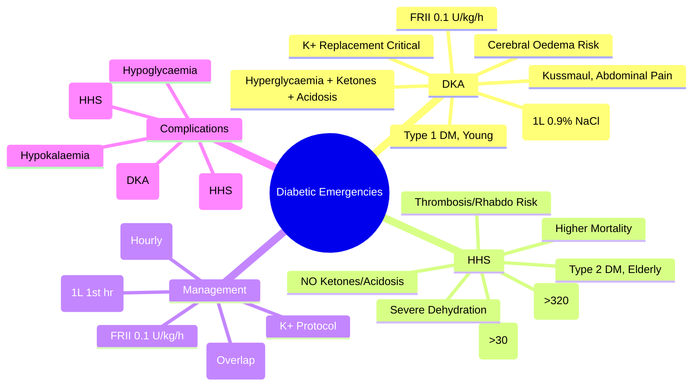
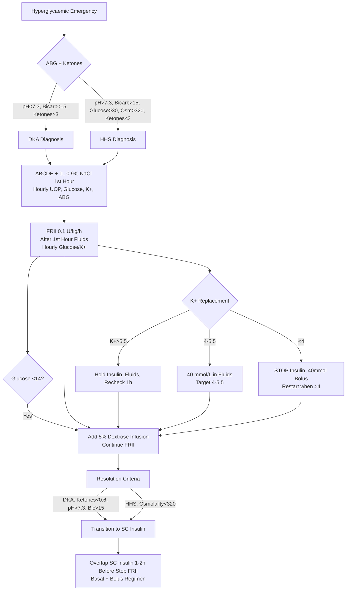

Related: [[Acute Kidney Injury in Critical Illness]], [[Critical Care Monitoring]], [[Fluid Resuscitation Strategies]], [[Acid-Base and Electrolyte Emergencies]]

> [!tip]
> **DKA = hyperglycaemia + ketonaemia + acidosis**. **HHS = severe hyperglycaemia + hyperosmolality + dehydration WITHOUT significant ketoacidosis**. **Fluid resuscitation FIRST** (before insulin). **Fixed-rate insulin infusion (FRII)** 0.1 U/kg/h. **K⁺ replacement CRITICAL** — start early, target 4–5.5 mmol/L. **Cerebral oedema** = rare but fatal (esp. young). Key FCPS/MRCP: diagnostic criteria (DKA vs HHS), fluid resuscitation protocol, FRII, K⁺ replacement algorithm, cerebral oedema prevention, HHS mortality higher.

## 1. Learning Objectives
- Differentiate DKA from HHS using diagnostic criteria
- Apply JBDS/ADA fluid resuscitation protocol (1L in 1st hour, then calculated)
- Manage fixed-rate insulin infusion (FRII) with glucose/K⁺ monitoring
- Apply K⁺ replacement protocol (target 4–5.5 mmol/L)
- Identify and manage cerebral oedema (DKA) and thrombosis risk (HHS)
- Manage transition to subcutaneous insulin

## 2. Definition

| Feature | **DKA** | **HHS** |
|---------|---------|---------|
| **Hyperglycaemia** | >11 mmol/L (200 mg/dL) | **>30 mmol/L (600 mg/dL)** |
| **Ketonaemia** | **≥3 mmol/L** (or significant ketonuria) | <3 mmol/L (absent/minimal) |
| **Acidosis** | **pH <7.3, bicarbonate <15 mmol/L** | pH >7.3, bicarbonate >15 mmol/L |
| **Osmolality** | <320 mOsm/kg | **≥320 mOsm/kg** |
| **Dehydration** | Moderate (5–7 L) | **Severe (8–10+ L)** |
| **Typical patient** | Type 1 DM, younger | Type 2 DM, elderly, comorbidities |
| **Precipitants** | Infection, missed insulin, new diagnosis | Infection, steroids, diuretics, stroke, MI |
| **Mortality** | 1–5% | **10–20%** (older, comorbid) |

> **Overlap**: ~30% have features of both ("mixed DKA/HHS") — treat as DKA.

## 3. Pathophysiology
- **Insulin deficiency** (absolute in DKA, relative in HHS) + **counter-regulatory hormone excess** (glucagon, cortisol, catecholamines, growth hormone)
- **Lipolysis** → FFA → hepatic ketogenesis (β-hydroxybutyrate, acetoacetate) → **ketonaemia + metabolic acidosis** (DKA)
- **Proteolysis** → amino acids → gluconeogenesis
- **Osmotic diuresis** (glucose > renal threshold ~10 mmol/L) → **dehydration, electrolyte loss** (K⁺, Na⁺, PO₄, Mg²⁺)
- **HHS**: residual insulin suppresses lipolysis/ketogenesis but NOT gluconeogenesis → **extreme hyperglycaemia + hyperosmolality**

## 4. Clinical Features

| Feature | DKA | HHS |
|---------|-----|-----|
| **Onset** | Hours | Days |
| **Polyuria/polydipsia** | Yes | Yes (often prolonged) |
| **Nausea/vomiting/abdominal pain** | Common (ketones) | Less common |
| **Kussmaul breathing** | Yes (compensatory) | No |
| **Dehydration signs** | Moderate | **Severe** (dry mucosa, poor turgor, hypotension) |
| **Neurological** | Alert → drowsy | **Confusion, coma, seizures, focal deficits** |
| **Temperature** | Normal/low (infection may cause fever) | May be hypothermic |

## 5. Investigations

### Mandatory (Immediate)
- **Capillary blood glucose** (immediate) + **venous blood gas** (pH, bicarbonate, lactate)
- **Blood ketones** (β-hydroxybutyrate) — **preferred over urine ketones**
- **U&E**: Na⁺, K⁺, creatinine, urea, bicarbonate, Cl⁻
- **Calculated osmolality** = 2×Na + Glucose/18 + Urea/2.8 (mmol/L) + Ethanol/4.6
- **Effective osmolality** = 2×Na + Glucose/18
- **FBC, CRP** (infection screen)
- **ECG** (K⁺ effects, ischaemia)
- **Troponin** (if chest pain/cardiac risk)
- **Blood cultures** (if febrile)
- **CXR** (if respiratory symptoms)
- **Pregnancy test** (women childbearing age)

### Calculated Values
- **Corrected Na⁺** = Measured Na⁺ + (Glucose − 5.5) × 0.016 (or +1.6 per 5.5 mmol/L glucose above 5.5)
- **Anion gap** = Na⁺ − (Cl⁻ + HCO₃⁻) — **elevated in DKA** (ketones, lactate)
- **ΔAG/ΔHCO₃ ratio** ≈ 1 in pure DKA (if >1 → concurrent metabolic alkalosis; if <1 → concurrent normal AG acidosis)

## 6. Diagnostic Criteria

### DKA (JBDS/ADA)
| Severity | Glucose | Ketones (β-OHB) | pH | Bicarbonate |
|----------|---------|-----------------|-----|-------------|
| **Mild** | >11 mmol/L | ≥3 mmol/L | 7.25–7.30 | 15–18 |
| **Moderate** | >11 mmol/L | ≥3 mmol/L | 7.00–7.24 | 10–15 |
| **Severe** | >11 mmol/L | ≥3 mmol/L | <7.00 | <10 |

### HHS
- Glucose **>30 mmol/L (600 mg/dL)**
- Effective osmolality **≥320 mOsm/kg**
- **No significant ketonaemia** (<3 mmol/L)
- **No significant acidosis** (pH >7.3, bicarbonate >15)

## 7. Management

### 1. Initial Assessment & Resuscitation (ABCDE)
- **Airway/Breathing**: Kussmaul breathing → assess work of breathing; intubate if GCS <8 or failing
- **Circulation**: **2 large-bore IV access**, cardiac monitoring, urine catheter (hourly UOP)
- **Disability**: GCS, pupil size (cerebral oedema risk)
- **Exposure**: temperature (hypothermia risk in HHS), skin for infection

### 2. Fluid Resuscitation — **FIRST PRIORITY** (Before Insulin)
| Phase | Fluid | Rate | Target |
|-------|-------|------|--------|
| **0–1h** | 0.9% NaCl | **1 L** | Restore intravascular volume |
| **1–2h** | 0.9% NaCl | 1 L | Continue volume replacement |
| **2–4h** | 0.9% NaCl | 1 L | |
| **4–6h** | 0.9% NaCl | 1 L | |
| **6–12h** | 0.9% NaCl → switch to 0.45% NaCl if Na⁺ rising/normal | 500 mL/h | Match ongoing losses + maintenance |
| **12–24h** | 0.45% NaCl / Hartmann's | 250–500 mL/h | Euvolemia, urine output >0.5 mL/kg/h |

> **Cerebral oedema risk**: in DKA, **avoid rapid Na⁺ rise** — use 0.45% NaCl after initial resuscitation if corrected Na⁺ rising >2 mmol/L/h

### 3. Insulin Therapy — **Fixed-Rate Insulin Infusion (FRII)**
- **Dose**: **0.1 U/kg/h** (based on **actual body weight**)
- **Preparation**: 50 U Actrapid in 49.5 mL 0.9% NaCl = **1 U/mL** (run at mL/h = 0.1 × weight kg)
- **Start**: **After 1st hour of fluids** (or immediately if K⁺ >5.5)
- **Continue FRII** until: **ketones <0.6 mmol/L AND pH >7.3 AND bicarbonate >15** (DKA) OR **osmolality <320** (HHS)
- **Glucose monitoring**: **hourly** (capillary)
  - If glucose <14 mmol/L → add **5% dextrose** (run alongside FRII at 100–125 mL/h)
  - **Do NOT reduce insulin rate** (maintain ketosis suppression)
- **Transition to subcutaneous**: when eating/drinking, ketones <0.6, pH >7.3
  - **Restart SC insulin 1–2h BEFORE stopping FRII** (overlap to prevent rebound)
  - **Basal + bolus** regimen (or pre-mixed if appropriate)

### 4. Potassium Replacement — **CRITICAL**
- **Total body K⁺ depleted** (3–5 mmol/kg) despite normal/high initial serum K⁺ (acidosis shifts K⁺ out of cells)
- **Insulin drives K⁺ into cells** → rapid hypokalaemia risk

| Serum K⁺ | Replacement |
|----------|-------------|
| **>5.5 mmol/L** | **Hold K⁺**, recheck 1h; start insulin |
| **4.0–5.5 mmol/L** | **40 mmol/L** in infusion fluid (20 mmol/h at 500 mL/h) |
| **<4.0 mmol/L** | **Stop insulin**, give **40 mmol IV bolus** (20 mmol/h max), resume insulin when K⁺ >4.0 |

> **Target K⁺**: **4.0–5.5 mmol/L** (check **hourly** × 4h, then 2-hourly)

### 5. Bicarbonate Therapy — **RARELY INDICATED**
- **pH <6.9** (severe acidosis impairing cardiac contractility) — **consider** 50–100 mmol NaHCO₃ in 200 mL 5% dextrose over 1h
- **Risks**: paradoxical CSF acidosis, hypokalaemia, tissue hypoxia, worsened cerebral oedema
- **Most DKA**: resolves with fluids + insulin alone

### 6. Phosphate Replacement
- **Routine replacement NOT recommended**
- **Severe hypophosphataemia** (<0.3 mmol/L) with rhabdo/haemolysis/respiratory failure → consider 0.5 mmol/kg IV over 6h (monitor Ca²⁺)

### 7. Cerebral Oedema (DKA-Specific) — **Rare but Fatal**
- **Risk factors**: children/adolescents, new-onset T1DM, severe acidosis, rapid fluid/insulin, low PaCO₂
- **Signs**: headache, irritability, slowed HR, rising BP, GCS drop, papilloedema, cranial nerve palsies
- **Prevention**: **avoid rapid fluid/insulin**, **avoid rapid Na⁺ rise**, **slow correction** of osmolality
- **Treatment**: **mannitol 0.5–1 g/kg IV** (or hypertonic saline 3% 2–5 mL/kg), **head up 30°**, **reduce fluid rate**, **intubate/hyperventilate** (PaCO₂ 30–35), **ICU**

### 8. HHS-Specific Considerations
- **Thrombosis risk high**: **prophylactic LMWH** (unless contraindicated)
- **Rhabdomyolysis risk**: monitor CK, aggressive fluids, alkalinise urine
- **Higher mortality**: aggressive comorbidity management, cardiac monitoring
- **Insulin resistance**: may need higher FRII (0.15 U/kg/h if poor response)

### 9. Infection Management
- **Precipitant in 30–50%**: UTI, pneumonia, sepsis, skin/soft tissue
- **Cultures** (blood, urine, sputum, wound) before antibiotics
- **Empirical antibiotics** if septic (local guidelines)

## 8. Complications

| Complication | DKA | HHS | Prevention |
|--------------|-----|-----|------------|
| **Cerebral oedema** | Yes (0.5–1%) | Rare | Slow fluid/insulin, slow Na⁺ correction |
| **Hypokalaemia** | Common | Common | Protocol-driven K⁺ replacement |
| **Hypoglycaemia** | If insulin not reduced | Possible | Add dextrose when glucose <14 |
| **Thrombosis** | Risk | **High** | LMWH prophylaxis |
| **Rhabdomyolysis** | Possible | Risk | Fluids, alkalinisation |
| **Aspiration** | If obtunded | Risk | NPO, NGT if ileus |
| **AKI** | Pre-renal → ATN | Common | Early fluid resuscitation |

## 9. Prognosis
- **DKA**: mortality 1–5% (higher if cerebral oedema, elderly, comorbidities)
- **HHS**: mortality 10–20% (elderly, comorbidities, delayed diagnosis)
- **Recurrence**: address precipitant, education, outpatient follow-up

## 10. FCPS/MRCP High-Yield Points
1. **Fluids FIRST, insulin second** (1L 0.9% NaCl in 1st hour)
2. **FRII 0.1 U/kg/h** — do NOT bolus insulin
3. **K⁺ replacement protocol**: >5.5 hold, 4–5.5 = 40 mmol/L, <4 = bolus + stop insulin
4. **Cerebral oedema**: children, rapid correction → mannitol, head up 30°, ICU
5. **HHS mortality higher** (10–20%) — elderly, comorbidities, thrombosis, rhabdo
6. **Effective osmolality** = 2×Na + Glucose/18 ≥320 = HHS
7. **Corrected Na⁺** rises with glucose correction — **avoid rapid rise** (cerebral oedema risk)
7. **Transition to SC insulin**: overlap 1–2h before stopping FRII
8. **Bicarbonate** rarely (pH <6.9 only)
9. **Phosphate**: no routine replacement
10. **HHS thrombosis risk** → LMWH prophylaxis

## 11. Common Viva Questions
1. DKA vs HHS diagnostic criteria
2. Fluid resuscitation protocol (JBDS)
3. FRII dose and monitoring
4. K⁺ replacement algorithm
5. Cerebral oedema prevention and management
6. Bicarbonate indication
8. HHS vs DKA differences
9. Transition to subcutaneous insulin
10. Cerebral oedema management

## 12. Common Confusions / Exam Traps
- **Insulin bolus before fluids** → NO (worsens hypokalaemia, cerebral oedema)
- **Insulin bolus + infusion** → NO, FRII only (0.1 U/kg/h)
- **K⁺ >5.5 = give insulin** → NO, hold insulin, rehydrate, recheck K⁺
- **Bicarbonate for all DKA** → NO, only pH <6.9
- **Rapid Na⁺ correction** → cerebral oedema risk (DKA)
- **Stop insulin when glucose normal** → NO, continue FRII until ketones clear; add dextrose
- **Phosphate routine** → NO replacement
- **HHS = no insulin needed** → NO, FRII still needed (relative insulin deficiency)
- **Subcutaneous insulin immediately** → NO, overlap 1–2h with FRII
- **DKA only in Type 1** → NO, can occur in Type 2 (ketosis-prone)

## 13. Mnemonics
- **DKA vs HHS**: **D**KA = **K**etones + **A**cidosis; **H**HS = **H**yperglycaemia + **H**yperosmolality + **H**yperglycaemia (no ketones)
- **FLUIDS FIRST**: **1**L **0.9%** **N**aCl in **1**st **H**our (before insulin)
- **FRII**: **0.1 U/kg/h** (weight-based, no bolus)
- **K⁺ REPLACEMENT**: **>5.5** Hold; **4–5.5** 40 mmol/L; **<4** Bolus + Stop Insulin
- **CEREBRAL OEDEMA**: **M**annitol, **H**ead up 30°, **S**low fluids/insulin, **S**low Na⁺ correction
- **HHS TRIAD**: **H**yperglycaemia >30, **H**yperosmolality >320, **H**yperglycaemia no ketones

## 14. Mind Map

## 15. Flowchart

## 16. Suggested Visuals / Image Notes
- DKA vs HHS comparison table
- FRII preparation and monitoring card
- K⁺ replacement algorithm card
- Cerebral oedema management algorithm

## 17. Suggested Video References
- JBDS DKA guidelines walkthrough
- HHS management (ADA)
- Cerebral oedema in DKA

## 18. One-Page Revision Summary
- **DKA**: glucose >11, ketones ≥3, pH <7.3, bicarbonate <15
- **HHS**: glucose >30, osmolality >320, NO ketones/acidosis
- **Fluids FIRST**: 1L 0.9% NaCl in 1st hour (before insulin)
- **FRII**: 0.1 U/kg/h (no bolus); hourly glucose/K⁺
- **K⁺ protocol**: >5.5 hold; 4–5.5 = 40 mmol/L; <4 = bolus + stop insulin
- **Cerebral oedema (DKA)**: children, rapid correction → mannitol, head 30°, ICU
- **HHS**: thrombosis risk → LMWH; higher mortality (10–20%)
- **Bicarbonate**: only pH <6.9
- **Transition to SC**: overlap 1–2h before stopping FRII
- **Monitoring**: hourly glucose/K⁺ × 4h, then 2-hourly

## 24-Hour Recall Prompts
- State DKA vs HHS diagnostic criteria
- Recite fluid resuscitation protocol (1st 6h)
- State FRII dose and K⁺ replacement protocol
- List cerebral oedema prevention measures

## 7-Day / 15-Day / 30-Day Revision Tracker
- [ ] Day 1 completed
- [ ] 24-hour recall completed
- [ ] Day 7 revision completed
- [ ] Day 15 revision completed
- [ ] Day 30 revision completed

## 19. Must Know / Should Know / Nice to Know
### Must Know
- DKA vs HHS diagnostic criteria
- Fluids first (1L 0.9% NaCl in 1h) before insulin
- FRII 0.1 U/kg/h (no bolus)
- K⁺ replacement protocol (>5.5 hold, 4–5.5 = 40/L, <4 bolus+stop)
- Cerebral oedema prevention (slow correction)
- Transition overlap 1–2h

### Should Know
- Corrected Na⁺ calculation
- Effective osmolality formula (2×Na + Glucose/18)
- HHS thrombosis → LMWH
- Cerebral oedema management (mannitol, head 30°)
- Bicarbonate pH <6.9 only
- Transition overlap 1–2h

### Nice to Know
- Euglycaemic DKA (SGLT2 inhibitors)
- Mixed DKA/HHS
- Pregnancy DKA (lower threshold)
- Paediatric DKA modifications
- SGLT2 inhibitor DKA risk

## 20. Self-Test Scorecard
- Understanding: /10
- Recall: /10
- MCQ Performance: /10
- SBA Performance: /10
- Viva Confidence: /10
- Total: /50

> [!tip]
> Interpretation: <35 = weak topic, 35-44 = acceptable but insecure, 45+ = strong exam-ready topic.

## 21. Exam Answer Modes
### Long Answer Skeleton
- DKA vs HHS comparison table
- Pathophysiology (insulin deficiency + counter-regulatory hormones)
- Diagnostic criteria
- Management: fluids → FRII → K⁺/glucose monitoring → transition
- Complications (cerebral oedema, thrombosis, hypokalaemia)
- DKA vs HHS differences

### Short Note Skeleton
- DKA vs HHS table
- FRII + K⁺ protocol card
- Fluids timeline
- Cerebral oedema algorithm

### Viva One-Liners
- "DKA = hyperglycaemia + ketones + acidosis; HHS = severe hyperglycaemia + hyperosmolality NO ketones"
- "Fluids FIRST: 1L 0.9% NaCl in 1st hour, THEN insulin"
- "FRII = 0.1 U/kg/h, no bolus, hourly glucose/K⁺"
- "K⁺: >5.5 hold; 4–5.5 = 40 mmol/L; <4 = bolus + stop insulin"
- "Cerebral oedema risk: children, rapid correction → mannitol, head 30°, ICU"
- "HHS: >30 glucose, >320 osmolality, NO ketones, LMWH, higher mortality"
- "Bicarbonate ONLY if pH <6.9"
- "Transition SC: overlap 1–2h before stopping FRII"

### Ward-Case Discussion Points
- 14yo new T1DM, DKA severe → fluids 1L, FRII, K⁺ protocol, head 30°, cerebral oedema watch
- 75yo T2DM, HHS glucose 55, osmolality 340, K⁺ 3.2 → fluids, LMWH, K⁺ bolus, FRII
- DKA resolving, glucose 8, ketones 0.4 → stop FRII? NO, add dextrose, continue FRII until ketones <0.6
- HHS resolved, transition to SC → basal + bolus overlap 2h before stopping FRII

### Last-Night-Before-Exam Sheet
- DKA: Glu>11, Ket>3, pH<7.3, Bic<15
- HHS: Glu>30, Osm>320, No Ket/Ac
- Fluids: 1L 0.9% NaCl 1h (Before Insulin)
- FRII: 0.1 U/kg/h, No Bolus
- K+: >5.5 Hold; 4-5.5 40/L; <4 Bolus+Stop
- Cerebral Oedema: Kids, Slow Correct, Mannitol
- HHS: Thrombosis->LMWH, Mortality Higher
- Bicarb: pH<6.9 Only
- Transition: Overlap 1-2h

## 22. Summary
**DKA** = hyperglycaemia + ketonaemia (≥3 mmol/L) + metabolic acidosis (pH <7.3, bicarbonate <15). **HHS** = severe hyperglycaemia (>30 mmol/L) + hyperosmolality (≥320 mOsm/kg) WITHOUT significant ketosis/acidosis. **Management**: **Fluids FIRST** (1L 0.9% NaCl in 1st hour) → **FRII 0.1 U/kg/h** (no bolus) → **K⁺ protocol** (>5.5 hold, 4–5.5 = 40 mmol/L, <4 bolus + stop insulin) → **hourly glucose/K⁺** until resolution → **transition SC insulin with 1–2h overlap**. **Cerebral oedema** (DKA): slow correction, mannitol, head 30°. **HHS**: higher mortality, thrombosis (LMWH), rhabdo. **Bicarbonate** only pH <6.9.

## 23. MCQs (10)
1. DKA diagnostic criteria include all EXCEPT:
   A. Glucose >11 mmol/L (or >200 mg/dL)
   B. **pH <7.0**
   C. Bicarbonate <15 mmol/L
   D. Ketonaemia ≥3 mmol/L or ketonuria +++

2. HHS diagnostic criteria include all EXCEPT:
   A. Glucose >33 mmol/L
   B. pH >7.3
   C. Bicarbonate >18 mmol/L
   D. **Significant ketonaemia**

3. DKA initial fluid resuscitation:
   A. 0.45% saline
   B. **0.9% saline 1 L in first hour, then adjust**
   C. 5% dextrose first
   D. Albumin

4. Insulin in DKA — when to start:
   A. Immediately
   B. **After K⁺ confirmed ≥3.3 mmol/L (hold insulin if <3.3)**
   C. After 4 h
   D. After 24 h

5. Fixed Rate Insulin Infusion (FRII) in DKA:
   A. 0.05 U/kg/h
   B. **0.1 U/kg/h IV (FRII)**
   C. 1 U/kg/h
   D. Sliding scale

6. When to add 5% dextrose in DKA:
   A. At presentation
   B. **When glucose falls below 14 mmol/L (continue insulin)**
   C. When pH normalises
   D. Never

7. Most important electrolyte to monitor and replace in DKA:
   A. Sodium
   B. **Potassium (insulin drives K⁺ intracellularly)**
   C. Calcium
   D. Magnesium

8. HHS treatment — key difference from DKA:
   A. Insulin dose higher
   B. **More aggressive fluid resuscitation (often 8–12 L deficit) and slower insulin onset**
   C. Bicarbonate
   D. Calcium

9. Cerebral oedema in DKA — risk factors include all EXCEPT:
   A. Age <5
   B. New-onset diabetes
   C. **High sodium**
   D. Bicarbonate use

10. Resolution of DKA is defined as:
    A. Glucose normal
    B. pH normal
    C. **Bicarbonate >18 + pH >7.30 + anion gap closed + patient eating**
    D. Patient feels better

## 24. SBA Questions (10)
1. A 25-year-old T1DM, vomiting, glucose 25, pH 7.10, K⁺ 4.5, ketones 5. Management:
   A. Insulin SC
   B. **IV 0.9% saline + IV insulin infusion (FRII 0.1 U/kg/h) + K⁺ replacement**
   C. Subcutaneous insulin
   D. Saline only

2. DKA, K⁺ 2.8. Insulin:
   A. Start immediately
   B. **HOLD insulin — replace K⁺ first (insulin will cause life-threatening hypokalaemia)**
   C. Reduce dose
   D. Give insulin + K⁺

3. DKA, glucose 14, pH 7.20, on insulin infusion. Next step:
   A. Stop insulin
   B. **Add 5% dextrose 125 mL/h (continue insulin)**
   C. Increase insulin
   D. Stop fluids

4. DKA, pH 6.9. Bicarbonate:
   A. Always give
   B. **Consider if pH <7.0 (controversial; JBDS — pH <6.9 → 100 mmol over 2 h)**
   C. Never
   D. With every insulin dose

5. Cerebral oedema in DKA — features:
   A. Polyuria
   B. **Headache, altered consciousness, bradycardia, seizures**
   C. Sweating
   D. Hypertension only

6. Cerebral oedema in DKA management:
   A. More fluids
   B. **Mannitol 0.5–1 g/kg + hypertonic saline + reduce fluid rate + intubate**
   C. Insulin SC
   D. Steroids

7. HHS, glucose 50, Na⁺ corrected 145, severe dehydration. Management:
   A. D5
   B. **Aggressive 0.9% saline (8–12 L deficit) + insulin infusion + K⁺ replacement + D5 when glucose <14**
   C. SC insulin
   D. Bicarbonate

8. Corrected sodium in hyperglycaemia formula:
   A. Na⁺ × 1.5
   B. **Na⁺ + 1.6 × ((glucose − 5.5)/5.5) (or × 2.4 for glucose in mg/dL)**
   C. Na⁺ × 2
   D. Na⁺ − 5

9. Euglycaemic DKA in T1DM on SGLT2 inhibitor:
   A. Give insulin
   B. **Recognise — glucose <14 + ketones; DKA protocol with 5% dextrose from start**
   C. Discharge
   D. Stop SGLT2 only

10. DKA patient eating, well, pH 7.32, bicarbonate 20, AG closed. Next:
    A. Continue IV insulin 24 h
    B. **Switch to subcutaneous insulin (overlap IV for 1–2 h)**
    C. Discharge
    D. Stop all insulin

## 25. Flashcards
- Q: DKA criteria
  A: Glucose >11, pH <7.30, HCO₃ <15, ketones ≥3 or ketonuria +++
- Q: HHS criteria
  A: Glucose >33, pH >7.30, HCO₃ >18, osm >320, minimal ketones
- Q: Initial fluid in DKA
  A: 0.9% saline 1 L in first hour
- Q: Insulin in DKA
  A: 0.1 U/kg/h IV (FRII), only if K⁺ ≥3.3
- Q: K⁺ in DKA
  A: Add 20–40 mmol/h if K⁺ 3.5–5.5; hold insulin if K⁺ <3.3
- Q: When to add dextrose
  A: When glucose <14 (continue insulin)
- Q: HHS vs DKA fluid
  A: HHS = more aggressive (8–12 L deficit)
- Q: Cerebral oedema risk
  A: Age <5, new T1DM, severe acidosis, high BUN, bicarbonate use
- Q: Cerebral oedema Rx
  A: Mannitol 0.5–1 g/kg + hypertonic saline
- Q: Bicarbonate in DKA
  A: Consider if pH <7.0 (JBDS <6.9)
- Q: Corrected Na⁺
  A: Na⁺ + 1.6 × ((glucose − 5.5)/5.5)
- Q: DKA resolution
  A: HCO₃ >18 + pH >7.30 + AG closed + eating

## 26. Answer Key with Explanations
### MCQs
1. **B** — DKA criteria don't require pH <7.0 (DKA is pH <7.30).
2. **D** — HHS: minimal/no ketones (NOT significant ketonaemia).
3. **B** — DKA: 0.9% saline 1 L in first hour.
4. **B** — Hold insulin if K⁺ <3.3 (risk of life-threatening hypokalaemia).
5. **B** — FRII: 0.1 U/kg/h IV insulin.
6. **B** — Add 5% dextrose when glucose <14 (continue insulin to clear ketones).
7. **B** — K⁺ is the most important — insulin drives K⁺ intracellularly.
8. **B** — HHS = more fluid (deficit 8–12 L) and slower insulin.
9. **C** — High sodium is NOT a risk factor; rather, hyponatraemia.
10. **C** — Resolution: HCO₃ >18 + pH >7.30 + AG closed + eating.

### SBAs
1. **B** — DKA: IV saline + IV insulin + K⁺ replacement.
2. **B** — Hold insulin until K⁺ ≥3.3.
3. **B** — Add 5% dextrose at glucose 14 (continue insulin).
4. **B** — Bicarbonate only if pH <7.0 (consider <6.9).
5. **B** — Cerebral oedema: headache, altered consciousness, bradycardia, seizures.
6. **B** — Cerebral oedema: mannitol + hypertonic saline + reduce fluid + intubate.
7. **B** — HHS: aggressive fluids + insulin + K⁺ + D5 when glucose <14.
8. **B** — Corrected Na⁺ = Na⁺ + 1.6 × ((glucose − 5.5)/5.5).
9. **B** — Euglycaemic DKA: DKA protocol with D5 from start.
10. **B** — Switch to SC insulin with 1–2 h overlap.