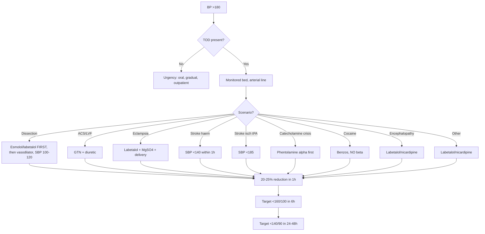

Related: [[Acute Coronary Syndromes in Critical Care]], [[Cardiogenic Shock]], [[Acute Medicine in Pregnancy]]

> [!important]
> **Hypertensive emergency = SBP >180 + acute target organ damage** (TOD): encephalopathy, ICH, ischaemic stroke, MI, ACS, acute LVF, dissection, AKI, eclampsia. **Hypertensive urgency = severe HTN (>180/120) WITHOUT TOD**. **Reduce BP by 20-25% in 1st hour, then to 160/100 over next 2-6 h, then to <140/90 over 24-48 h** — NOT too fast (cerebral hypoperfusion). **First-line IV drugs**: **labetalol** (most), **nicardipine**, **nitroprusside**, **nitroglycerin** (ACS), **urapidil**, **phentolamine** (catecholamine crisis). **Specific**: **Aortic dissection: SBP 100-120 + HR <60** (labetalol + esmolol). **Eclampsia: labetalol + magnesium + delivery**. **Stroke (ischaemic, tPA-eligible): SBP <185, then <180 × 24 h**. **Stroke (haemorrhagic): SBP <140 within 1 h** (INTERACT3, ATACH-2). **ACS/Acute LVF: nitroglycerin**. **Catecholamine crisis: phentolamine**. **Avoid sublingual nifedipine** (unpredictable, stroke risk). **Hypertensive urgency = oral treatment, NOT IV**.

## 1. Learning Objectives
- Define hypertensive emergency vs urgency
- Identify target organ damage (TOD)
- Apply BP reduction strategy (timing, target)
- Choose IV antihypertensive based on scenario
- Manage specific emergencies: dissection, eclampsia, stroke, ACS, catecholamine crisis, encephalopathy
- Avoid common pitfalls (sublingual nifedipine, rapid drop)
- Counsel on hypertensive urgency

## 2. Definition

### Hypertensive Emergency
- **SBP >180 mmHg** (or DBP >120 mmHg) **+ acute target organ damage (TOD)**
- **TOD**: end-organ ischaemia or damage
- **Life-threatening**, requires **IV therapy** in monitored setting

### Hypertensive Urgency
- **SBP >180 mmHg** (or DBP >120 mmHg) **WITHOUT TOD**
- **NOT** life-threatening
- **Oral therapy**, gradual reduction

### Malignant Hypertension
- **Severe HTN + papilloedema + retinopathy (grade III/IV) ± AKI**
- **Subset** of hypertensive emergency
- **Microangiopathic haemolytic anaemia** (MAHA)

## 3. Aetiology
- **Essential hypertension** (chronic, undiagnosed/uncontrolled)
- **Renal**: renal artery stenosis, glomerulonephritis, polycystic
- **Endocrine**: phaeochromocytoma, Cushing's, primary hyperaldosteronism, thyrotoxicosis
- **Drugs**: cocaine, amphetamines, MAOI + tyramine, OCP, NSAID, decongestants, sympathomimetics
- **Pregnancy**: pre-eclampsia, eclampsia
- **Withdrawal**: β-blocker, clonidine, alcohol, methyldopa
- **Aortic dissection**
- **CNS**: stroke, trauma, raised ICP
- **Burns, severe pain**
- **Renal transplant** (transplant renal artery stenosis)
- **Autonomic dysreflexia** (spinal cord injury)

## 4. Pathophysiology
- **Acute BP rise** → exceeds autoregulation → endothelial injury
- **Fibrinoid necrosis** of arterioles
- **Ischaemia** of brain (encephalopathy), heart (ACS), kidneys (AKI), retina
- **Catecholamine surge** (sympathetic activation)
- **RAAS activation** → vasoconstriction, sodium retention

## 5. Clinical Features (TOD)

### Neurological
- **Hypertensive encephalopathy** (headache, confusion, seizures, visual disturbance, papilloedema)
- **Stroke** (ischaemic, haemorrhagic, TIA)
- **Subarachnoid haemorrhage**

### Cardiovascular
- **Acute LV failure / pulmonary oedema**
- **Acute coronary syndrome** (MI, unstable angina)
- **Aortic dissection**
- **Aortic aneurysm** rupture

### Renal
- **Acute kidney injury** (AKI)
- **Haematuria, proteinuria**
- **Acute renal failure**

### Other
- **Retinopathy** (grade III/IV, papilloedema, exudates, haemorrhages)
- **Microangiopathic haemolytic anaemia (MAHA)**
- **DIC**

## 6. Investigations

### Urgent
- **Bloods**: FBC, U&E, creatinine, glucose, urate, TSH
- **FBC with film** (schistocytes, MAHA)
- **Urinalysis** (proteinuria, haematuria)
- **Cardiac**: ECG (LVH, ischaemia), troponin
- **CXR** (cardiomegaly, pulmonary oedema, widened mediastinum for dissection)
- **CT head** (encephalopathy, bleed, stroke)
- **CT aortogram** (dissection)
- **Echocardiography** (LV function, regional wall motion)

### Specific
- **Renal ultrasound, Doppler** (renal artery stenosis)
- **Plasma metanephrines, urinary VMA** (phaeochromocytoma)
- **Pregnancy test** (eclampsia)
- **Toxicology screen** (cocaine, amphetamines)
- **Aldosterone, renin** (Conn's syndrome)

## 7. Management Principles

### General
- **Monitored bed** (HDU/ICU)
- **IV access** × 2
- **Arterial line** for continuous BP
- **Urinary catheter** (urine output)
- **Treat pain, anxiety, hypoxia** (sympathetic)
- **Identify + treat cause**
- **Don't drop too fast** (cerebral hypoperfusion)

### BP Reduction Targets
| Phase | Target |
|-------|--------|
| **First hour** | ↓ 20-25% from baseline |
| **2-6 hours** | <160/100 mmHg |
| **24-48 hours** | <140/90 mmHg (chronic levels) |
| **Aortic dissection** | SBP **100-120** + HR <60 (rapidly, within 20 min) |
| **Stroke (ischaemic, tPA)** | SBP <185 (pre-tPA), then <180 × 24 h |
| **Stroke (haemorrhagic)** | SBP <140 within 1 h |
| **Eclampsia** | <160/110, then MAP 80-100 |
| **Catecholamine crisis** | gradual (avoid hypotension) |

### Why Not Too Fast?
- **Cerebral autoregulation** shifts right in chronic HTN
- **Rapid drop** → watershed cerebral infarcts, stroke, blindness
- **Aim: gradual reduction** over hours to days

## 8. IV Antihypertensive Drugs

| Drug | Dose | Onset | Use |
|------|------|-------|-----|
| **Labetalol** | 10-20 mg IV bolus, then 1-2 mg/min infusion OR 20 mg q5min | 5-10 min | **First-line**; most scenarios; pregnancy-safe; asthma (β-blocker) |
| **Nicardipine** | 5-15 mg/h IV infusion | 5-10 min | Most scenarios; post-op; **avoid in acute LVF** |
| **Sodium nitroprusside** | 0.5-10 mcg/kg/min IV infusion | <1 min | Most severe; **monitor cyanide toxicity**; not first-line |
| **Nitroglycerin (GTN)** | 5-200 mcg/min IV infusion | 2-5 min | **ACS, acute LVF**; not great for cerebral |
| **Hydralazine** | 5-10 mg IV q20min | 10-20 min | **Pregnancy** (eclampsia); reflex tachycardia |
| **Phentolamine** | 2.5-5 mg IV q5-15min | 1-2 min | **Catecholamine crisis** (phaeo, MAOI) |
| **Esmolol** | 500 mcg/kg bolus, then 50-200 mcg/kg/min | 1-2 min | **Aortic dissection** (rate control); perioperative |
| **Urapidil** | 10-50 mg IV bolus, then 5-40 mg/h | 5 min | Europe; alternative to labetalol |
| **Clevidipine** | 1-32 mg/h IV | 1-2 min | Perioperative |

### Drug Choice by Scenario
| Scenario | First-line |
|----------|------------|
| **Most emergencies** | **Labetalol** or **nicardipine** |
| **Aortic dissection** | **Labetalol** + **esmolol** (rate + BP) |
| **Acute coronary syndrome** | **Nitroglycerin (GTN)** + β-blocker |
| **Acute LVF / pulmonary oedema** | **Nitroglycerin** + diuretics, ± labetalol |
| **Eclampsia** | **Labetalol** + **magnesium** + delivery |
| **Stroke (ischaemic, tPA)** | **Labetalol** (SBP <185) |
| **Stroke (haemorrhagic)** | **Labetalol** (SBP <140) |
| **Catecholamine crisis** | **Phentolamine** ± β-blocker |
| **Encephalopathy** | **Labetalol** or **nicardipine** |
| **Renal failure** | **Labetalol**, **nicardipine**, **urapidil** (avoid nitroprusside) |
| **Pregnancy** | **Labetalol**, **hydralazine**, **nifedipine** |
| **Post-op** | **Clevidipine**, **nicardipine** |

## 9. Specific Emergencies

### Aortic Dissection
- **SBP 100-120 + HR <60** (rapidly, within 20-30 min)
- **IV β-blocker FIRST**: esmolol or labetalol (reduce dP/dt)
- **Then** vasodilator (nicardipine or nitroprusside)
- **Pain control** (morphine)
- **Surgical consultation** for Type A
- **Type B**: medical management, β-blocker + CCB

### Hypertensive Encephalopathy
- **Exclude**: stroke, bleed, mass (CT head first)
- **IV labetalol or nicardipine**
- **20-25% reduction in MAP** in first hour
- **Seizure control** (lorazepam, levetiracetam)
- **Avoid** nitroprusside (↑ICP)

### Stroke (Ischaemic)
- **Not tPA**: lower BP only if >220/120 (for tPA-eligible, <185/110)
- **tPA candidate**: SBP <185, then <180 × 24 h
- **Mechanical thrombectomy**: similar BP targets
- **IV labetalol, nicardipine**
- **AVOID** rapid drop (worsen ischaemia)
- **Permissive** HTN if not thrombolysed (up to 220/120)

### Stroke (Haemorrhagic)
- **INTERACT3, ATACH-2**: SBP <140 within 1-2 h
- **Reduces haematoma expansion**
- **IV labetalol, nicardipine, urapidil**
- **Reversal** of anticoagulation if needed
- **Neurosurgery** referral

### Acute Coronary Syndrome
- **GTN** (nitroglycerin) IV + β-blocker (metoprolol IV)
- **Aspirin**, **heparin**, **P2Y12**, **statin** per ACS protocol
- **PCI** if STEMI

### Acute LVF / Pulmonary Oedema
- **GTN** IV + **diuretics** (furosemide)
- **CPAP/BiPAP**
- **± Morphine**
- **Labetalol** if HTN coexists

### Acute Kidney Injury
- **Treat cause**
- **IV labetalol, nicardipine**
- **Avoid** ACE-i/ARB in AKI
- **Dobutamine** if cardiogenic component

### Eclampsia (see [[Acute Medicine in Pregnancy]])
- **MgSO₄ 4 g IV over 5 min** (load), then 1 g/h infusion
- **BP control**: **labetalol** (first-line) or **hydralazine** or **nifedipine**
- **Delivery** definitive treatment
- **HELLP syndrome**: deliver + supportive

### Catecholamine Crisis (Phaeochromocytoma, MAOI)
- **α-blockade FIRST**: **phentolamine** 2.5-5 mg IV OR phenoxybenzamine
- **Then β-blocker** (esmolol/labetalol) — NEVER β alone (unopposed α)
- **Avoid**: morphine (histamine), metoclopramide, glucagon
- **Pre-op** preparation: α-blockade × 10-14 days, then β

### Sympathomimetic Toxidrome (Cocaine, Amphetamine)
- **Benzodiazepines** (first-line): lorazepam, diazepam
- **Nitroglycerin** (CCB controversial in cocaine: ↑CNS toxicity)
- **Phentolamine** for severe HTN
- **AVOID β-blockers** (unopposed α)

### Autonomic Dysreflexia (SCI)
- **Sit up** + remove tight clothing + empty bladder
- **Nifedipine** SL (or chew)
- **Treat cause**: full bladder, constipation, noxious stimulus

## 10. Hypertensive Urgency
- **NOT** life-threatening
- **Oral therapy**: amlodipine, losartan, atenolol, etc.
- **Reduce over 24-48 h** to <160/100
- **Outpatient** if no TOD
- **AVOID** IV therapy (rapid drop → stroke)

## 11. Complications of Therapy
- **Cerebral hypoperfusion** (rapid drop)
- **Ischaemic stroke**
- **Retinal infarction**
- **Myocardial ischaemia**
- **Rebound HTN** (clonidine, β-blocker withdrawal)
- **Cyanide toxicity** (nitroprusside >4 mcg/kg/min >24 h)

## 12. Contraindicated Drugs
- **Sublingual nifedipine** (unpredictable absorption, stroke risk)
- **β-blocker in catecholamine crisis** (unopposed α)
- **Nitroprusside in renal failure** (cyanide)
- **Nitroprusside in pregnancy** (cyanide crosses placenta)

## 13. Prognosis
- **Without treatment**: 1-year mortality 90% in malignant HTN
- **With treatment**: 5-year survival 60-80%
- **TOD improves** with BP control (some, e.g., LVH)
- **Aortic dissection**: 1-month mortality 50% (Type A) or 10% (Type B)

## 14. FCPS/MRCP High-Yield Points
1. **Emergency = SBP >180 + TOD** (vs urgency = no TOD)
2. **Reduction target**: ↓ 20-25% in 1st hour, <160/100 in 6 h, <140/90 in 24-48 h
3. **Most emergencies: labetalol or nicardipine**
4. **Aortic dissection: SBP 100-120 + HR <60** (β-blocker first: esmolol/labetalol)
5. **Eclampsia: labetalol + MgSO₄ + delivery**
6. **Stroke (ischaemic, tPA): SBP <185**
7. **Stroke (haemorrhagic): SBP <140 within 1 h**
8. **ACS/Acute LVF: GTN**
9. **Catecholamine crisis: phentolamine** (α first, then β)
10. **Cocaine/amphetamines: benzodiazepines, AVOID β-blockers**
11. **Sublingual nifedipine: AVOID** (unpredictable)
12. **Malignant HTN = papilloedema + retinopathy + AKI + MAHA**
13. **Avoid rapid drop** (cerebral hypoperfusion)
14. **Hypertensive urgency: oral Rx, NOT IV**
15. **Nitroprusside: monitor cyanide** (>4 mcg/kg/min >24 h)

## 15. Common Viva Questions
1. Hypertensive emergency vs urgency
2. BP reduction targets
3. First-line drugs
4. Aortic dissection management
5. Eclampsia management
6. Stroke BP targets
7. Catecholamine crisis
8. Cocaine HTN
9. Why avoid sublingual nifedipine
10. Malignant hypertension

## 16. Common Confusions / Exam Traps
- **Emergency = TOD present**, not just BP level
- **Avoid rapid drop** (cerebral hypoperfusion)
- **β-blocker alone in catecholamine crisis = unopposed α**
- **Sublingual nifedipine** = dangerous (unpredictable)
- **Aortic dissection** = β-blocker first (esmolol/labetalol), then vasodilator
- **Nitroprusside** in renal failure = cyanide toxicity
- **Encephalopathy**: exclude stroke/bleed first
- **Stroke ischaemic**: permissive HTN (220/120) unless tPA
- **Stroke haemorrhagic**: SBP <140 (INTERACT3)
- **Cocaine**: benzodiazepines, not β-blockers
- **Eclampsia**: MgSO₄ (NOT diazepam/phenytoin for seizure)
- **Malignant HTN**: MAHA + AKI + retinopathy
- **Hypertensive urgency**: oral, NOT IV

## 17. Mnemonics
- **Emergency = TOD**, Urgency = no TOD
- **BP targets**: **20-25% in 1 h**, <160/100 in 6 h, <140/90 in 24-48 h
- **Most**: **Labetalol** or **Nicardipine**
- **Aortic dissection**: **SBP 100-120 + HR <60** (β first)
- **Eclampsia**: **Labetalol + MgSO₄ + Delivery**
- **Stroke (isch, tPA)**: **SBP <185**
- **Stroke (haem)**: **SBP <140**
- **ACS/LVF**: **GTN**
- **Catecholamine crisis**: **α first** (phentolamine)
- **Cocaine**: **Benzos, NO β-blocker**
- **Malignant HTN**: **MAHA + AKI + retinopathy**
- **AVOID**: **sublingual nifedipine**
- **Nitroprusside**: **monitor cyanide**

## 18. Mind Map
```mermaid
mindmap
  root((Hypertensive Emergencies))
    Definitions
      Emergency: SBP>180 + TOD
      Urgency: SBP>180 no TOD
      Malignant: papilloedema + retinopathy
    Causes
      Essential
      Renal (RAS, GN)
      Endocrine (phaeo, Cushing)
      Drugs (cocaine, MAOI)
      Pregnancy (eclampsia)
      Aortic dissection
      Withdrawal
    Features
      TOD
        Encephalopathy
        Stroke
        ACS
        LVF
        Dissection
        AKI
        Retinopathy
        MAHA
    Investigations
      FBC, UandE, glucose
      Urinalysis
      ECG, troponin
      CXR
      CT head
      CT aortogram (dissection)
      Echo
      Plasma metanephrines
    Targets
      20-25% in 1h
      <160/100 in 6h
      <140/90 in 24-48h
      Dissection: 100-120
      Eclampsia: <160/110
      Stroke tPA: <185
      Stroke haem: <140
    Drugs
      Labetalol (most)
      Nicardipine
      Nitroprusside (cyanide)
      GTN (ACS/LVF)
      Esmolol (dissection)
      Phentolamine (phaeo)
      Hydralazine (pregnancy)
    Specific
      Dissection: SBP 100-120, HR <60
      Eclampsia: labetalol + MgSO4 + delivery
      Stroke isch (tPA): SBP <185
      Stroke haem: SBP <140
      ACS: GTN + beta-blocker
      LVF: GTN + diuretic
      Catecholamine: alpha first (phentolamine)
      Cocaine: benzos, no beta
    Pitfalls
      Avoid rapid drop
      Sublingual nifedipine (NO)
      Beta alone in phaeo (NO)
      Nitroprusside in renal failure (NO)
```

## 19. Flowchart — Hypertensive Emergency


## 20. One-Page Revision Summary
- **Emergency = SBP >180 + TOD**; **urgency = no TOD** (oral Rx)
- **Reduction**: 20-25% in 1st hour, <160/100 in 6 h, <140/90 in 24-48 h
- **Most emergencies: labetalol or nicardipine**
- **Aortic dissection: SBP 100-120 + HR <60** (β-blocker first)
- **Eclampsia: labetalol + MgSO₄ + delivery**
- **Stroke ischaemic (tPA): SBP <185**; **haemorrhagic: SBP <140 within 1 h**
- **ACS/LVF: GTN + β-blocker**
- **Catecholamine crisis: α first (phentolamine)**, then β
- **Cocaine: benzos, AVOID β-blockers**
- **Malignant HTN**: MAHA + AKI + retinopathy
- **AVOID sublingual nifedipine** (unpredictable)
- **Avoid rapid drop** (cerebral hypoperfusion)
- **Nitroprusside**: monitor cyanide (>4 mcg/kg/min >24 h)
- **Hypertensive urgency: oral, NOT IV**

## 24-Hour Recall Prompts
- Define hypertensive emergency vs urgency
- State BP reduction targets
- Outline aortic dissection management
- Describe eclampsia management
- List stroke BP targets
- Outline catecholamine crisis Rx
- State cocaine HTN management
- List contraindications

## 7-Day / 15-Day / 30-Day Revision Tracker
- [ ] Day 1 completed
- [ ] 24-hour recall completed
- [ ] Day 7 revision completed
- [ ] Day 15 revision completed
- [ ] Day 30 revision completed

## 21. Must Know / Should Know / Nice to Know
### Must Know
- Emergency vs urgency
- BP reduction targets
- Labetalol/nicardipine first-line
- Aortic dissection (SBP 100-120, HR <60)
- Eclampsia (labetalol + MgSO₄)
- Stroke BP targets (ischaemic, haemorrhagic)
- ACS/LVF (GTN)
- Catecholamine crisis (α first)
- Cocaine (benzos, no β)
- Malignant HTN
- AVOID sublingual nifedipine
- Avoid rapid drop

### Should Know
- Hydralazine in pregnancy
- Nitroprusside (cyanide)
- Esmolol (rate control)
- Autonomic dysreflexia
- Phentolamine dose
- HELLP syndrome
- Phaeochromocytoma pre-op
- Drug choice by scenario
- Sympathomimetic toxidrome
- Hypertensive urgency Rx

### Nice to Know
- INTERACT3, ATACH-2 trials
- Clevidipine
- Cyanide toxicity
- Rebound HTN
- Nitroprusside monitoring
- Watershed infarcts
- Urapidil
- Renal failure dosing
- MAHA
- ESRD/HD patients

## 22. Self-Test Scorecard
- Understanding: /10
- Recall: /10
- MCQ Performance: /10
- SBA Performance: /10
- Viva Confidence: /10
- Total: /50

> [!tip]
> Interpretation: <35 = weak topic, 35-44 = acceptable but insecure, 45+ = strong exam-ready topic.

## 23. Exam Answer Modes
### Long Answer Skeleton
- Definitions (emergency vs urgency vs malignant)
- Pathophysiology
- Causes
- Clinical features (TOD)
- Investigations
- BP reduction targets (timing, %)
- IV antihypertensive drugs (table)
- Specific emergencies:
  - Aortic dissection
  - Eclampsia
  - Stroke (ischaemic + haemorrhagic)
  - ACS / LVF
  - Catecholamine crisis
  - Cocaine
  - Encephalopathy
  - AKI
- Avoid pitfalls (sublingual nifedipine, rapid drop, β alone in phaeo)
- Hypertensive urgency (oral, not IV)

### Short Note Skeleton
- Hypertensive emergency Rx
- Aortic dissection HTN Rx
- Eclampsia HTN Rx
- Stroke BP targets
- Catecholamine crisis Rx
- Malignant HTN

### Viva One-Liners
- "Emergency = SBP >180 + TOD; urgency = no TOD"
- "Reduce 20-25% in 1st hour, <160/100 in 6 h, <140/90 in 24-48 h"
- "Labetalol or nicardipine first-line for most"
- "Aortic dissection: SBP 100-120, HR <60, β-blocker first"
- "Eclampsia: labetalol + MgSO₄ + delivery"
- "Stroke ischaemic (tPA): SBP <185; haemorrhagic: SBP <140"
- "ACS/LVF: GTN + β-blocker"
- "Catecholamine crisis: α first (phentolamine), then β"
- "Cocaine: benzos, NO β-blockers"
- "Malignant HTN: MAHA + AKI + retinopathy"
- "AVOID sublingual nifedipine"
- "Hypertensive urgency: oral, NOT IV"

### Ward-Case Discussion Points
- 60-year-old, SBP 220, headache, papilloedema → encephalopathy → IV labetalol, monitor
- Aortic dissection, SBP 220, HR 110 → esmolol + labetalol, target SBP 100-120
- Eclampsia 32 weeks, BP 170/110, seizures → MgSO₄ + labetalol + delivery
- Stroke ICH, SBP 180 → SBP <140 within 1 h, labetalol
- Cocaine chest pain + HTN → benzos, GTN, avoid β
- Phaeochromocytoma intra-op, BP 240/130 → phentolamine
- Hypertensive urgency SBP 180, asymptomatic → oral amlodipine, gradual, outpatient

### Last-Night-Before-Exam Sheet
- Emergency = TOD, urgency = no TOD
- Reduce 20-25% in 1h
- Most: labetalol/nicardipine
- Dissection: SBP 100-120, HR <60
- Eclampsia: labetalol + MgSO₄ + delivery
- Stroke isch (tPA): SBP <185
- Stroke haem: SBP <140
- ACS/LVF: GTN
- Catecholamine: α first
- Cocaine: benzos, no β
- Malignant: MAHA + AKI
- NO sublingual nifedipine
- NO rapid drop
- Nitroprusside → cyanide

## 24. Summary
**Hypertensive emergency** = **SBP >180 + acute target organ damage (TOD)**; **urgency** = severe HTN without TOD (oral Rx, gradual). **TOD**: encephalopathy, stroke (ischaemic/haemorrhagic), ACS, acute LVF, aortic dissection, AKI, retinopathy (grade III/IV), MAHA. **Malignant HTN**: severe HTN + papilloedema + retinopathy + AKI + MAHA. **BP reduction targets**: ↓ 20-25% in 1st hour → <160/100 in 6 h → <140/90 in 24-48 h. **Avoid rapid drop** (cerebral hypoperfusion → watershed infarcts). **First-line IV drugs**: **labetalol** (10-20 mg bolus, 1-2 mg/min infusion; first-line in most + pregnancy), **nicardipine** (5-15 mg/h; most scenarios), **GTN** (5-200 mcg/min; ACS/LVF), **esmolol** (dissection), **phentolamine** (catecholamine crisis), **hydralazine** (pregnancy alt), **nitroprusside** (most severe; monitor cyanide >4 mcg/kg/min >24 h). **Specific emergencies**: **Aortic dissection** → SBP 100-120 + HR <60 (β-blocker first: **esmolol/labetalol**, then vasodilator). **Eclampsia** → **labetalol** + **MgSO₄ 4 g IV load** + 1 g/h + delivery. **Stroke ischaemic (tPA-eligible)** → SBP <185 (pre), then <180 × 24 h; **non-tPA** → permissive HTN up to 220/120. **Stroke haemorrhagic** → SBP <140 within 1 h (INTERACT3, ATACH-2). **ACS/LVF** → GTN + β-blocker. **Catecholamine crisis** (phaeo, MAOI) → **α-blockade FIRST (phentolamine 2.5-5 mg IV)**, then β. **Cocaine/amphetamines** → **benzodiazepines** (NOT β-blockers — unopposed α). **Autonomic dysreflexia** (SCI) → sit up + empty bladder + nifedipine SL. **Hypertensive urgency**: oral therapy (amlodipine, losartan, atenolol), gradual reduction, **NOT IV** (rapid drop → stroke). **AVOID sublingual nifedipine** (unpredictable absorption, stroke risk). **AVOID** rapid drop, β-blocker alone in phaeo, nitroprusside in renal failure/pregnancy (cyanide). **Prognosis**: 1-year mortality 90% untreated malignant HTN, 5-yr survival 60-80% treated.

## 25. MCQs (10)
1. Hypertensive emergency defined as:
   A. SBP >180
   B. **SBP >180 + acute target organ damage**
   C. DBP >100
   D. Malignant HTN

2. First-line IV drug in most hypertensive emergencies:
   A. Sodium nitroprusside
   B. **Labetalol or nicardipine**
   C. Hydralazine
   D. GTN

3. Aortic dissection BP target:
   A. <140/90
   B. <160/100
   C. **SBP 100-120 + HR <60**
   D. <120/80

4. Eclampsia treatment includes:
   A. Diazepam
   B. Phenytoin
   C. **MgSO₄ + labetalol + delivery**
   D. β-blocker only

5. Catecholamine crisis first drug:
   A. β-blocker
   B. **α-blocker (phentolamine)**
   C. Calcium channel blocker
   D. ACE inhibitor

6. Cocaine-induced HTN first-line:
   A. β-blocker
   B. **Benzodiazepine**
   C. Nitroprusside
   D. Phentolamine

7. Stroke (ischaemic, tPA-eligible) SBP target:
   A. <140
   B. **<185**
   C. <220
   D. <120

8. Stroke (haemorrhagic) SBP target:
   A. <180
   B. **<140 within 1 h**
   C. <220
   D. <120

9. Sublingual nifedipine in hypertensive emergency:
   A. First-line
   B. Safe
   C. **AVOIDED (unpredictable, stroke risk)**
   D. Cheap and effective

10. Malignant hypertension features include all EXCEPT:
    A. Papilloedema
    B. Grade IV retinopathy
    C. **Bradycardia**
    D. MAHA

## 26. SBA Questions (10)
1. 60-year-old, SBP 220, headache, papilloedema, no focal deficit, AKI. Diagnosis:
   A. Hypertensive urgency
   B. **Hypertensive emergency (encephalopathy + AKI)**
   C. Stroke
   D. Migraine

2. Aortic dissection, SBP 220, HR 110. First drug:
   A. Nitroprusside
   B. **Esmolol or labetalol (β-blocker first)**
   C. Hydralazine
   D. GTN

3. Eclampsia, 32 weeks, BP 170/110, seizures. First-line seizure Rx:
   A. Diazepam
   B. Phenytoin
   C. **MgSO₄ 4 g IV over 5 min**
   D. Levetiracetam

4. ICH stroke, SBP 180. Target:
   A. <180
   B. **<140 within 1 h (INTERACT3)**
   C. <220
   D. <120

5. Phaeochromocytoma, BP 240/130 intra-op. First drug:
   A. Esmolol
   B. **Phentolamine (α first)**
   C. Nitroprusside
   D. Labetalol

6. Cocaine chest pain, BP 180/110, SOB. Rx:
   A. β-blocker
   B. **Benzodiazepine + GTN**
   C. Aspirin
   D. Morphine

7. Hypertensive urgency, SBP 180, asymptomatic. Rx:
   A. IV labetalol
   B. **Oral amlodipine, gradual reduction, outpatient**
   C. Sublingual nifedipine
   D. Admit + IV

8. Nitroprusside >4 mcg/kg/min for >24 h risk:
   A. Methaemoglobinaemia
   B. **Cyanide toxicity**
   C. HyperK
   D. Rhabdomyolysis

9. Autonomic dysreflexia, SCI, BP 200/120. First action:
   A. IV hydralazine
   B. **Sit up + remove tight clothing + empty bladder + nifedipine**
   C. Intubate
   D. Anaesthesia

10. ESRD patient, hypertensive emergency. Drug to avoid:
    A. Labetalol
    B. Nicardipine
    C. **Nitroprusside (cyanide accumulation)**
    D. Urapidil

## 27. Flashcards
- Q: Hypertensive emergency definition
  A: SBP >180 + acute TOD
- Q: BP reduction targets
  A: 20-25% in 1h, <160/100 in 6h, <140/90 in 24-48h
- Q: First-line IV drugs
  A: Labetalol or nicardipine
- Q: Aortic dissection target
  A: SBP 100-120 + HR <60
- Q: Aortic dissection first drug
  A: Esmolol/labetalol (β first)
- Q: Eclampsia Rx
  A: Labetalol + MgSO4 + delivery
- Q: MgSO4 dose
  A: 4 g IV load, then 1 g/h
- Q: Catecholamine crisis first drug
  A: Phentolamine (α first)
- Q: Cocaine HTN Rx
  A: Benzodiazepine
- Q: Stroke (isch, tPA) SBP target
  A: <185
- Q: Stroke (haem) SBP target
  A: <140
- Q: Malignant HTN features
  A: Papilloedema + retinopathy + AKI + MAHA
- Q: AVOID drug
  A: Sublingual nifedipine
- Q: Hypertensive urgency Rx
  A: Oral, gradual, outpatient

## 28. Answer Key with Explanations
**MCQ 1**: B — Emergency = SBP >180 + TOD.
**MCQ 2**: B — Labetalol or nicardipine first-line.
**MCQ 3**: C — Dissection: SBP 100-120 + HR <60.
**MCQ 4**: C — MgSO₄ + labetalol + delivery.
**MCQ 5**: B — α-blocker (phentolamine) first in catecholamine crisis.
**MCQ 6**: B — Benzodiazepine in cocaine.
**MCQ 7**: B — Stroke isch (tPA): SBP <185.
**MCQ 8**: B — Stroke haem: SBP <140.
**MCQ 9**: C — Sublingual nifedipine avoided.
**MCQ 10**: C — Bradycardia is not a feature of malignant HTN.

**SBA 1**: B — Emergency (TOD = encephalopathy + AKI).
**SBA 2**: B — β-blocker first in dissection.
**SBA 3**: C — MgSO₄ 4 g IV.
**SBA 4**: B — ICH: SBP <140 within 1 h.
**SBA 5**: B — Phentolamine (α first) in phaeo.
**SBA 6**: B — Benzos + GTN in cocaine.
**SBA 7**: B — Oral, gradual, outpatient.
**SBA 8**: B — Nitroprusside >24 h = cyanide.
**SBA 9**: B — Sit up + empty bladder + nifedipine.
**SBA 10**: C — Nitroprusside avoided in ESRD.

---

**Status**: Full FCPS/MRCP topic note completed — 2026-06-15