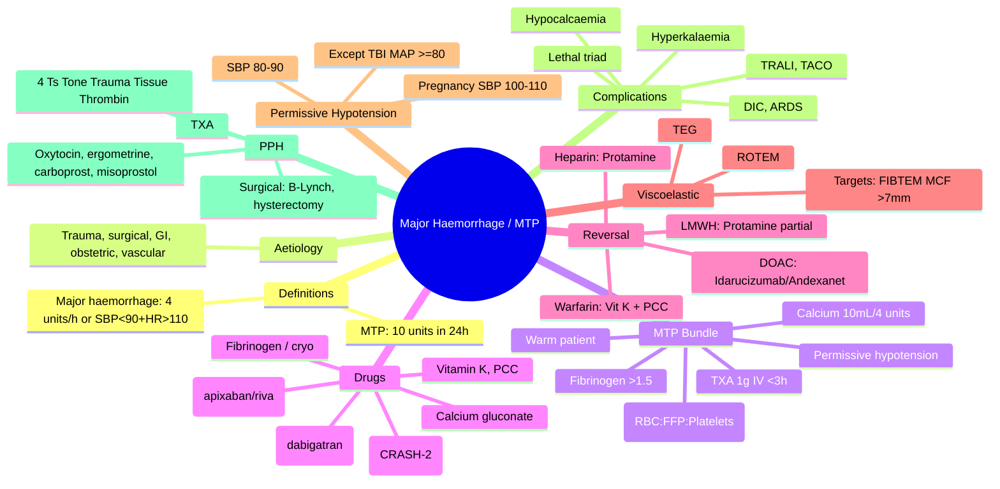
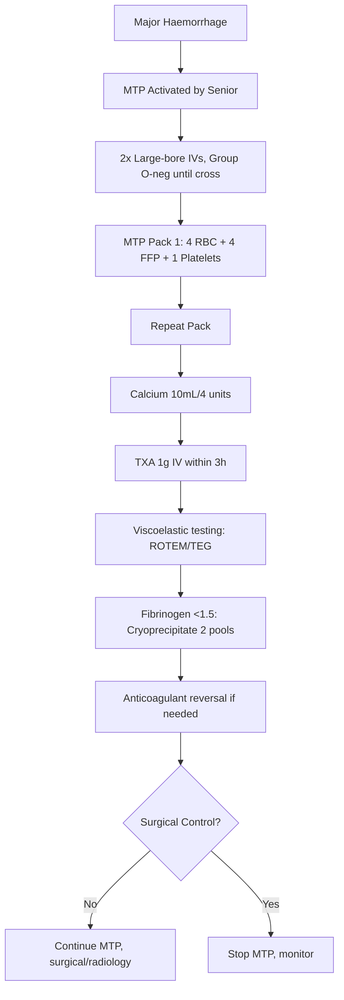

Related: [[Hypovolaemic Shock]], [[Acid-Base and Electrolyte Emergencies]]

> [!important]
> **Major haemorrhage = life-threatening bleed; MTP activation when ≥4-10 units RBC in 24 h, ≥4 units in 1 h, or anticipated need (trauma, ruptured AAA, postpartum).** **1:1:1 ratio (RBC:FFP:Platelets) for damage control resuscitation**. **TXA 1 g IV within 3 h of injury** (CRASH-2). **Fibrinogen 2-4 g if Clauss fibrinogen <1.5 g/L** (target >1.5-2.0). **Calcium gluconate 10 mL per 4 units RBC** (citrate toxicity → hypocalcaemia). **Permissive hypotension (SBP 80-90)** until surgical control, except TBI (MAP ≥80). **Warm patient, warm fluids, avoid acidosis + coagulopathy + hypothermia = "lethal triad"**. FCPS/MRCP: MTP criteria, 1:1:1, TXA timing, calcium, fibrinogen threshold, viscoelastic testing (ROTEM/TEG), reversal of anticoagulants (vitamin K, PCC, idarucizumab, andexanet).

## 1. Learning Objectives
- Define major haemorrhage and MTP activation criteria
- Apply damage control resuscitation (1:1:1, permissive hypotension, TXA)
- Recognise and treat coagulopathy (hypothermia, acidosis, hypocalcaemia)
- Reverse anticoagulants in major bleeding
- Use viscoelastic testing (ROTEM/TEG) for targeted transfusion
- Identify and treat hyperkalaemia, hypocalcaemia, TRALI, TACO
- Manage obstetric haemorrhage specifically

## 2. Definitions
- **Major haemorrhage (BCSH)**: bleed requiring ≥4 units RBC in <1 h OR ongoing bleeding + SBP <90 + HR >110 + base deficit >-6
- **Massive transfusion**: ≥10 units RBC in 24 h OR ≥4 units in 1 h
- **Damage control resuscitation (DCR)**: balanced blood product transfusion to mimic whole blood, permissive hypotension, avoid crystalloid
- **Lethal triad**: hypothermia + acidosis + coagulopathy

## 3. Aetiology
| Category | Examples |
|----------|----------|
| **Trauma** | Road traffic accident, falls, penetrating injury |
| **Surgical** | Vascular rupture, intra-op bleed |
| **GI** | Variceal bleed, peptic ulcer, diverticular, aortoenteric fistula |
| **Obstetric** | Postpartum haemorrhage (PPH), ectopic, abruption |
| **Vascular** | Ruptured AAA, aortic dissection |
| **Haematological** | Coagulopathy, DIC, ITP |
| **Anticoagulant-related** | Warfarin, DOAC overdose |

## 4. Initial Assessment — ABCDE
1. **Airway + C-spine** protection
2. **Breathing**: high-flow O₂, treat tension PTX
3. **Circulation**: 2 large-bore IVs (14-16G) or central access; bloods including crossmatch, FBC, coagulation, fibrinogen, U&E, lactate, ABG, calcium
4. **Disability**: GCS, pupils
5. **Exposure**: full exam, log roll, warm patient

## 5. Investigations
- **FBC**: Hb may be normal initially (not diluted yet)
- **Coagulation**: PT, aPTT, INR
- **Fibrinogen (Clauss)**: target >1.5 g/L (obstetric >2.0)
- **U&E**: K⁺ (hyperkalaemia from stored blood)
- **ABG/lactate**: tissue hypoperfusion marker
- **Ionised calcium**: citrate in stored blood binds Ca²⁺ → hypocalcaemia
- **Viscoelastic testing** (ROTEM/TEG): rapid, point-of-care; guides targeted transfusion
- **Group and save / crossmatch** (uncrossmatched O-negative if critical)

## 6. Massive Transfusion Protocol (MTP)

### Activation Criteria
- ≥4 units RBC in <1 h
- ≥10 units RBC anticipated in 24 h
- SBP <90 + HR >110 + base deficit >-6
- Activated by senior clinician (ED, anaesthetics, surgery)

### MTP Bundle (Damage Control Resuscitation)

| Component | Initial Action |
|-----------|----------------|
| **RBC** | Group O-neg until crossmatched; switch to type-specific |
| **FFP** | 1:1 ratio with RBC (15 mL/kg) |
| **Platelets** | 1:1:1 ratio; aim >50 × 10⁹/L (>100 in TBI/eye/CNS) |
| **Cryoprecipitate/fibrinogen** | 2 pools (10 units) if fibrinogen <1.5 g/L (target >1.5) |
| **TXA** | 1 g IV within 3 h of injury, then 1 g over 8 h |
| **Calcium** | 10% Ca gluconate 10 mL per 4 units RBC (or 1 g CaCl₂) |
| **Warm fluids** | Bair Hugger, fluid warmers, ambient warming |
| **Permissive hypotension** | SBP 80-90 (MAP 50-60) until surgical control (EXCEPT TBI) |

### 1:1:1 Ratio (PROPPR Trial)
- **RBC : FFP : Platelets = 1:1:1**
- Equivalent to whole blood
- Reduced death from exsanguination at 24 h vs 1:1:2
- Reduced death from haemorrhage

## 7. Specific Therapies

### TXA (Tranexamic Acid)
- **Indication**: major trauma bleeding within 3 h of injury
- **Dose**: 1 g IV over 10 min, then 1 g over 8 h
- **Mechanism**: antifibrinolytic, blocks plasminogen activation
- **CRASH-2 trial**: reduced all-cause mortality (14.5% vs 16.0%) when given <3 h
- **Caution**: increased mortality if given >3 h
- **WOMAN trial (PPH)**: 1 g IV; reduced death from bleeding
- **Contraindications**: active thromboembolic disease, subarachnoid haemorrhage

### Calcium
- **Why**: citrate in stored blood → binds Ca²⁺ → hypocalcaemia
- **Dose**: 10% Ca gluconate 10 mL per 4 units RBC (or 1 g CaCl₂ central line)
- **Target**: ionised Ca²⁺ >1.1 mmol/L
- **Important**: hypocalcaemia worsens coagulopathy + cardiac depression

### Fibrinogen
- **Threshold**: <1.5 g/L (obstetric <2.0 g/L) → give cryoprecipitate or fibrinogen concentrate
- **Dose**: 2 pools cryoprecipitate (10 units, ~4 g fibrinogen) OR 2-4 g fibrinogen concentrate
- **Source**: cryo (FFP precipitate) or concentrate (Riastap)

### Platelets
- **Threshold**: <50 × 10⁹/L (or <100 in TBI/eye)
- **Dose**: 1 adult dose (typically 1 pool of 5-6 donations or apheresis)
- **Continuous infusion** in some MTP protocols

## 8. Reversal of Anticoagulants in Major Bleeding

| Anticoagulant | Reversal Agent | Dose |
|---------------|----------------|------|
| **Warfarin** | Vitamin K + PCC (4-factor) | Vit K 5-10 mg IV + PCC 25-50 U/kg |
| **Dabigatran** | Idarucizumab | 5 g IV (2 × 2.5 g) |
| **Apixaban** | Andexanet alfa (or PCC 4-factor 50 U/kg) | Andexanet bolus + infusion; PCC alternative |
| **Rivaroxaban** | Andexanet alfa (or PCC 4-factor 50 U/kg) | Andexanet bolus + infusion; PCC alternative |
| **Heparin (UFH)** | Protamine | 1 mg per 100 U heparin (last 2-3 h) |
| **LMWH (enoxaparin)** | Protamine (partial) | 1 mg per 1 mg enoxaparin; 50% reversal |
| **Aspirin/clopidogrel** | Platelet transfusion (consider) | 1 adult dose |
| **TPA/streptokinase** | Cryoprecipitate, FFP, TXA | Supportive |

## 9. Permissive Hypotension
- **Target SBP 80-90 mmHg** until bleeding controlled
- **Mechanism**: avoid "pop the clot" by elevating BP
- **EXCEPTIONS**:
  - **Traumatic brain injury**: SBP ≥110 (or MAP ≥80)
  - **Spinal cord injury**: MAP ≥85
  - **Pregnancy**: SBP 100-110 (uterine perfusion)
  - **Penetrating torso**: shorter time to OR → less fluid

## 10. Viscoelastic Testing (ROTEM/TEG)
- **Point-of-care** tests of whole blood clot formation
- **ROTEM**: EXTEM (extrinsic), INTEM (intrinsic), FIBTEM (fibrinogen), HEPTEM (heparin effect)
- **TEG**: kaolin, rapid TEG, functional fibrinogen
- **Advantages** over standard coagulation: faster, functional, identifies hyperfibrinolysis
- **Guides** targeted transfusion (e.g., FIBTEM MCF <7 mm → give fibrinogen)

## 11. Obstetric Haemorrhage (PPH)
- **Definition**: >500 mL (vaginal) or >1000 mL (CS) blood loss, or any bleed causing haemodynamic compromise
- **Primary** (24 h) vs **secondary** (24 h-6 weeks)
- **Causes**: 4 T's — **Tone** (atony, 70%), **Trauma** (lacerations), **Tissue** (retained), **Thrombin** (coagulopathy)
- **Management**:
  1. **2 large-bore IVs**, crossmatch 4-6 units
  2. **Oxytocin 5 U IV** + 40 U in 500 mL over 4 h
  3. **Ergometrine 0.2 mg IV/IM** (avoid in HTN)
  4. **Carboprost (Hemabate) 250 mcg IM** q15-90 min (avoid in asthma)
  5. **Misoprostol 800 mcg PR** if other uterotonics fail
  6. **TXA 1 g IV** (WOMAN trial)
  7. **Bimanual compression**, intrauterine balloon (Bakri), B-Lynch suture
  8. **Surgical**: uterine artery ligation, B-Lynch suture, hysterectomy
  9. **Activate MTP**

## 12. Complications of Massive Transfusion

| Complication | Cause | Management |
|--------------|-------|------------|
| **Hypothermia** | Cold products | Warm fluids, blanket, ambient |
| **Hypocalcaemia** | Citrate toxicity | 10 mL Ca gluconate per 4 units RBC |
| **Hyperkalaemia** | Stored blood lysis | Insulin/dextrose, Ca²⁺, dialysis |
| **Acidosis** | Tissue hypoperfusion + stored blood | Treat underlying, consider NaHCO₃ |
| **Coagulopathy** | Dilutional, consumption | FFP, platelets, cryo |
| **TRALI** | Donor antibodies | Supportive, O₂, ventilation |
| **TACO** | Volume overload | Diuretics, slow transfusion |
| **DIC** | Underlying shock | Treat cause, blood products |
| **ARDS** | SIRS, transfusions | Supportive ventilation |

## 13. Special Situations

### Ruptured AAA
- **Permissive hypotension** + **activate MTP**
- **Endovascular (EVAR) vs open repair**
- **Allowed SBP 80-100**

### Variceal Bleeding
- See [[Acute Medicine in Pregnancy]]/GI bleeding chapter
- **Resuscitate** to Hb 70-80 (restrictive)
- **Terlipressin 2 mg IV** bolus, then 1-2 mg q4h
- **Antibiotics** (ceftriaxone)
- **Endoscopic band ligation**

### Anticoagulant-Related Bleeding
- See table above for reversal

## 14. Prognosis
- **Trauma haemorrhage mortality**: 30-50% if uncontrolled
- **MTP with 1:1:1**: 24 h mortality 17% (PROPPR)
- **Trauma deaths**: 30% pre-hospital, 30% intra-op, 30% post-op (coagulopathy, SIRS)

## 15. FCPS/MRCP High-Yield Points
1. **Major haemorrhage**: ≥4 units RBC in <1 h OR ongoing bleeding + SBP <90 + HR >110
2. **MTP activation**: senior clinician
3. **Damage control resuscitation (DCR)**: 1:1:1 (RBC:FFP:Platelets) + permissive hypotension + avoid crystalloid
4. **TXA 1 g IV within 3 h of injury** (CRASH-2)
5. **Fibrinogen target >1.5 g/L** (obstetric >2.0)
6. **Calcium 10 mL 10% per 4 units RBC**
7. **Lethal triad**: hypothermia + acidosis + coagulopathy
8. **Permissive hypotension SBP 80-90** (EXCEPT TBI MAP ≥80, pregnancy SBP 100-110)
9. **Group O-neg until crossmatched**
10. **Viscoelastic testing (ROTEM/TEG)** for targeted transfusion
11. **Warfarin reversal**: Vitamin K 5-10 mg IV + PCC 4-factor
12. **Dabigatran reversal**: Idarucizumab 5 g
13. **Apixaban/rivaroxaban reversal**: Andexanet alfa (or PCC)
14. **Heparin reversal**: Protamine 1 mg/100 U
15. **PPH 4 T's**: Tone, Trauma, Tissue, Thrombin
16. **CRASH-2**: TXA within 3 h
17. **WOMAN trial**: TXA 1 g IV in PPH

## 16. Common Viva Questions
1. Define massive transfusion
2. List MTP activation criteria
3. Damage control resuscitation components
4. TXA indications, dose, timing
5. Reversal of warfarin, dabigatran, apixaban
6. Fibrinogen threshold and replacement
7. Permissive hypotension indications
8. ROTEM/TEG interpretation
9. PPH 4 T's and management
10. Complications of massive transfusion

## 17. Common Confusions / Exam Traps
- **Hb may be normal initially** in acute bleed (not yet haemodiluted)
- **TXA only within 3 h** (mortality ↑ if later)
- **Calcium is essential** (citrate toxicity)
- **Permissive hypotension EXCEPT in TBI** (MAP ≥80)
- **FFP and platelets 1:1:1 with RBC** (not 1:1:2)
- **Cryoprecipitate for fibrinogen** (FFP alone won't raise fibrinogen adequately)
- **Fibrinogen target higher in obstetric** (>2.0)
- **Vitamin K + PCC for warfarin** (not vitamin K alone if active bleed)
- **Andexanet for DOAC reversal** (factor Xa inhibitors)
- **Idarucizumab for dabigatran** (direct thrombin inhibitor)
- **TRALI vs TACO**: TRALI = acute lung injury; TACO = fluid overload
- **Stored blood has no platelets/function** → need platelet transfusion

## 18. Mnemonics
- **MTP criteria**: **4 units in 1 h, OR 10 in 24 h**
- **DCR components**: **1:1:1**, **TXA**, **Calcium**, **Warm**, **Permissive hypotension**
- **TXA**: **1 g IV within 3 h, then 1 g over 8 h**
- **Calcium**: **10 mL per 4 units RBC**
- **Fibrinogen**: **>1.5** (>2.0 obstetric)
- **Lethal triad**: **HAC** (Hypothermia, Acidosis, Coagulopathy)
- **PPH 4 T's**: **Tone, Trauma, Tissue, Thrombin**
- **Warfarin reversal**: **Vitamin K + PCC**
- **Dabigatran**: **Idarucizumab**
- **Apixaban/Rivaroxaban**: **Andexanet** (or PCC)
- **Permissive hypotension**: **SBP 80-90** (TBI excluded)

## 19. Mind Map

## 20. Flowchart — MTP Activation

## 21. One-Page Revision Summary
- **Major haemorrhage**: ≥4 units/h, SBP <90, HR >110, ongoing bleeding
- **MTP = 1:1:1** (RBC:FFP:Platelets) = damage control resuscitation
- **TXA 1 g IV within 3 h** (CRASH-2)
- **Calcium 10 mL 10% per 4 units RBC**
- **Fibrinogen target >1.5 g/L** (>2.0 obstetric)
- **Permissive hypotension SBP 80-90** (TBI exception: MAP ≥80)
- **Warm patient** (lethal triad: hypothermia, acidosis, coagulopathy)
- **Warfarin**: Vitamin K + PCC; **Dabigatran**: Idarucizumab; **Apixaban/Riva**: Andexanet (or PCC)
- **Viscoelastic testing** (ROTEM/TEG) for targeted transfusion
- **PPH 4 T's**: Tone, Trauma, Tissue, Thrombin

## 24-Hour Recall Prompts
- State MTP activation criteria
- Describe damage control resuscitation
- List reversal of warfarin, dabigatran, apixaban
- State TXA dose and timing
- Outline PPH 4 T's and management

## 7-Day / 15-Day / 30-Day Revision Tracker
- [ ] Day 1 completed
- [ ] 24-hour recall completed
- [ ] Day 7 revision completed
- [ ] Day 15 revision completed
- [ ] Day 30 revision completed

## 22. Must Know / Should Know / Nice to Know
### Must Know
- Major haemorrhage definition
- MTP activation criteria
- 1:1:1 ratio (RBC:FFP:Platelets)
- TXA 1 g within 3 h
- Calcium 10 mL per 4 units RBC
- Fibrinogen target >1.5
- Permissive hypotension (SBP 80-90)
- Lethal triad (HAC)
- PPH 4 T's

### Should Know
- Reversal of warfarin, dabigatran, apixaban
- ROTEM/TEG interpretation
- FIBTEM MCF target
- LMWH reversal (protamine partial)
- TRALI vs TACO
- PPH pharmacological ladder
- Permissive hypotension exclusions (TBI)
- PPH surgical options (B-Lynch, hysterectomy)
- Stored blood electrolyte issues
- Citrate toxicity

### Nice to Know
- PROPPR trial details
- CRASH-2 mortality numbers
- Andexanet dosing details
- Viscoelastic test parameters
- Cryoprecipitate composition
- EVAR in ruptured AAA
- rFVIIa (off-label)
- Fibrinogen concentrate (Riastap)
- Viscoelastic algorithm details

## 23. Self-Test Scorecard
- Understanding: /10
- Recall: /10
- MCQ Performance: /10
- SBA Performance: /10
- Viva Confidence: /10
- Total: /50

> [!tip]
> Interpretation: <35 = weak topic, 35-44 = acceptable but insecure, 45+ = strong exam-ready topic.

## 24. Exam Answer Modes
### Long Answer Skeleton
- Definition major haemorrhage + MTP
- Aetiology (trauma, surgical, GI, obstetric, vascular, haematological)
- Initial assessment (ABCDE)
- Investigations (FBC, coag, fibrinogen, ABG, ionised Ca, ROTEM/TEG)
- MTP bundle (1:1:1, TXA, calcium, warm, permissive hypotension)
- Reversal of anticoagulants
- PPH 4 T's and management
- Complications (TRALI, TACO, hyperkalaemia, hypocalcaemia, ARDS)
- Viscoelastic testing

### Short Note Skeleton
- MTP activation criteria
- Damage control resuscitation
- TXA dose and timing
- Reversal of warfarin, DOACs
- PPH management

### Viva One-Liners
- "MTP: ≥4 units/h or 10 units in 24 h"
- "DCR: 1:1:1, TXA, calcium, warm, permissive hypotension"
- "TXA 1 g IV within 3 h (CRASH-2)"
- "Calcium 10 mL per 4 units RBC"
- "Fibrinogen target >1.5 g/L"
- "Permissive hypotension SBP 80-90 (TBI excluded)"
- "Lethal triad: hypothermia, acidosis, coagulopathy"
- "Warfarin reversal: Vit K + PCC"
- "Dabigatran reversal: Idarucizumab"
- "Apixaban/rivaroxaban reversal: Andexanet (or PCC)"
- "PPH 4 T's: Tone, Trauma, Tissue, Thrombin"

### Ward-Case Discussion Points
- Trauma MTP: 1:1:1 + TXA + calcium + warm + permissive hypotension
- Warfarin + GI bleed: Vit K + PCC + endoscopy
- DOAC + intracranial bleed: PCC or specific antidote (Andexanet/Idarucizumab)
- PPH: 4 T's, uterotonics, TXA, balloon, surgery if needed
- Ruptured AAA: permissive hypotension, MTP, EVAR vs open

### Last-Night-Before-Exam Sheet
- MTP criteria: 4 units/h
- 1:1:1 ratio
- TXA 1 g IV <3 h
- Calcium 10 mL/4 units
- Fibrinogen >1.5
- Permissive SBP 80-90 (TBI excluded)
- HAC = lethal triad
- Warfarin → Vit K + PCC
- Dabigatran → Idarucizumab
- Apixaban/Riva → Andexanet
- PPH 4 T's

## 25. Summary
**Major haemorrhage** = life-threatening bleed requiring rapid, balanced transfusion. **MTP activation criteria**: ≥4 units RBC in <1 h, ≥10 units in 24 h, or anticipated need (SBP <90, HR >110, base deficit >-6). **Damage Control Resuscitation (DCR)**: 1:1:1 (RBC:FFP:Platelets) (PROPPR), permissive hypotension (SBP 80-90), avoid crystalloid, **TXA 1 g IV within 3 h** (CRASH-2), then 1 g over 8 h. **Calcium 10 mL 10% per 4 units RBC** (citrate toxicity). **Fibrinogen target >1.5 g/L** (obstetric >2.0) — give cryoprecipitate 2 pools. **Lethal triad**: Hypothermia + Acidosis + Coagulopathy. **Permissive hypotension EXCEPTIONS**: TBI (MAP ≥80), pregnancy (SBP 100-110), spinal cord injury. **Viscoelastic testing** (ROTEM/TEG) for targeted transfusion (FIBTEM MCF >7 mm). **Anticoagulant reversal**: Warfarin → Vit K 5-10 mg + PCC 25-50 U/kg; Dabigatran → Idarucizumab 5 g; Apixaban/Rivaroxaban → Andexanet (or PCC); Heparin → Protamine 1 mg/100 U; LMWH → Protamine partial. **Complications**: hypocalcaemia, hyperkalaemia, TRALI, TACO, DIC, ARDS. **PPH 4 T's**: Tone (70%, atony), Trauma, Tissue (retained), Thrombin. **PPH Rx**: Oxytocin + Ergometrine + Carboprost + Misoprostol + TXA + balloon/B-Lynch/hysterectomy. **Group O-neg until crossmatched**.

## 26. MCQs (10)
1. Massive transfusion definition:
   A. ≥4 units RBC in 24 h
   B. **≥10 units RBC in 24 h OR ≥4 units in 1 h**
   C. ≥20 units in 24 h
   D. ≥2 units/h

2. Damage control resuscitation ratio:
   A. 1:1:2 (RBC:FFP:Platelets)
   B. **1:1:1 (RBC:FFP:Platelets)**
   C. 2:1:1
   D. 3:1:0

3. TXA dose in major trauma:
   A. 500 mg IV
   B. **1 g IV within 3 h of injury, then 1 g over 8 h**
   C. 2 g bolus
   D. 4 g infusion

4. Fibrinogen target in major haemorrhage (non-obstetric):
   A. >1.0 g/L
   B. **>1.5 g/L**
   C. >2.5 g/L
   D. >3.0 g/L

5. Calcium replacement in massive transfusion:
   A. 5 mL per 4 units
   B. **10 mL of 10% Ca gluconate per 4 units RBC**
   C. 20 mL per unit
   D. Not needed

6. Permissive hypotension target (non-TBI):
   A. SBP 50-60
   B. **SBP 80-90 mmHg**
   C. SBP 100-110
   D. SBP 120

7. Warfarin reversal in major bleed:
   A. Vitamin K alone
   B. **Vitamin K 5-10 mg IV + PCC 4-factor 25-50 U/kg**
   C. FFP alone
   D. Protamine

8. Dabigatran reversal:
   A. Andexanet
   B. PCC
   C. **Idarucizumab 5 g IV**
   D. Vitamin K

9. PPH 4 T's include all EXCEPT:
   A. Tone
   B. Trauma
   C. **Toxins**
   D. Thrombin

10. CRASH-2 trial showed TXA in trauma:
    A. Increased mortality
    B. **Reduced all-cause mortality (when given <3 h)**
    C. No effect
    D. Increased VTE

## 27. SBA Questions (10)
1. Trauma MTP activated. First pack contents:
   A. 4 RBC + 2 FFP + 1 Platelets
   B. **4 RBC + 4 FFP + 1 Platelets (1:1:1)**
   C. 6 RBC + 2 FFP
   D. 10 RBC

2. PPH, uterine atony. First-line uterotonic:
   A. Ergometrine
   B. **Oxytocin 5 U IV**
   C. Carboprost
   D. Misoprostol

3. Massive transfusion, ionised Ca drops to 0.8 mmol/L. Action:
   A. Continue
   B. **Give 10% Ca gluconate 10 mL IV**
   C. Stop transfusion
   D. Vitamin D

4. ROTEM FIBTEM MCF <7 mm. Indicates need for:
   A. Platelets
   B. **Fibrinogen (cryoprecipitate or concentrate)**
   C. FFP
   D. RBC

5. Trauma patient on apixaban with intracranial bleed. Best reversal:
   A. Vitamin K
   B. Idarucizumab
   C. **Andexanet alfa (or PCC 4-factor 50 U/kg)**
   D. Protamine

6. Permissive hypotension contraindication:
   A. Penetrating trauma
   B. **Traumatic brain injury (need MAP ≥80)**
   C. Young patient
   D. Female patient

7. PPH, oxytocin and ergometrine failed. Next uterotonic:
   A. **Carboprost 250 mcg IM (avoid in asthma)**
   B. Misoprostol
   C. Surgery
   D. TXA

8. Major haemorrhage, body temperature 33°C. Action:
   A. Continue
   B. **Active warming (Bair Hugger, fluid warmers, ambient)**
   C. Cool patient
   D. No action needed

9. Stored blood transfusion causing hyperkalaemia (K 6.8). Rx:
   A. Calcium only
   B. **Insulin/dextrose + calcium + consider dialysis**
   C. Stop
   D. Salbutamol only

10. Fibrinogen <1.5, obstetric haemorrhage. Target:
    A. >1.5
    B. **>2.0 g/L (higher in obstetric)**
    C. >2.5
    D. >3.0

## 28. Flashcards
- Q: Massive transfusion definition
  A: ≥10 units RBC in 24 h or ≥4 units in 1 h
- Q: DCR ratio
  A: 1:1:1 (RBC:FFP:Platelets)
- Q: TXA dose
  A: 1 g IV within 3 h, then 1 g over 8 h
- Q: Calcium replacement
  A: 10 mL 10% Ca gluconate per 4 units RBC
- Q: Fibrinogen target
  A: >1.5 g/L (obstetric >2.0)
- Q: Permissive hypotension
  A: SBP 80-90 (TBI excluded)
- Q: Lethal triad
  A: Hypothermia, Acidosis, Coagulopathy
- Q: Warfarin reversal
  A: Vitamin K + PCC
- Q: Dabigatran reversal
  A: Idarucizumab 5 g
- Q: Apixaban reversal
  A: Andexanet (or PCC)
- Q: PPH 4 T's
  A: Tone, Trauma, Tissue, Thrombin
- Q: FIBTEM MCF <7 mm
  A: Fibrinogen needed

## 29. Answer Key with Explanations
**MCQ 1**: B — ≥10 units in 24 h or ≥4 in 1 h.
**MCQ 2**: B — 1:1:1 (PROPPR).
**MCQ 3**: B — TXA 1 g IV <3 h, then 1 g over 8 h.
**MCQ 4**: B — >1.5 g/L.
**MCQ 5**: B — 10 mL Ca gluconate per 4 units RBC.
**MCQ 6**: B — SBP 80-90.
**MCQ 7**: B — Vit K + PCC.
**MCQ 8**: C — Idarucizumab for dabigatran.
**MCQ 9**: C — "Toxins" not a T; PPH 4 T's are Tone, Trauma, Tissue, Thrombin.
**MCQ 10**: B — CRASH-2 reduced mortality <3 h.

**SBA 1**: B — 1:1:1 first pack.
**SBA 2**: B — Oxytocin first.
**SBA 3**: B — Ca gluconate.
**SBA 4**: B — FIBTEM MCF <7 mm = low fibrinogen.
**SBA 5**: C — Andexanet or PCC for apixaban.
**SBA 6**: B — TBI excluded.
**SBA 7**: A — Carboprost (avoid in asthma).
**SBA 8**: B — Active warming.
**SBA 9**: B — Insulin/dextrose + Ca + dialysis if needed.
**SBA 10**: B — Fibrinogen target >2.0 in obstetric.

---

**Status**: Full FCPS/MRCP topic note completed — 2026-06-15