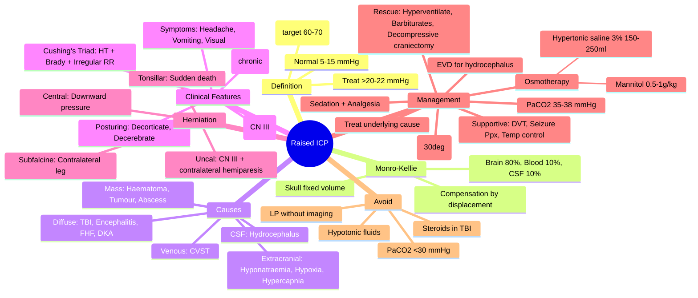
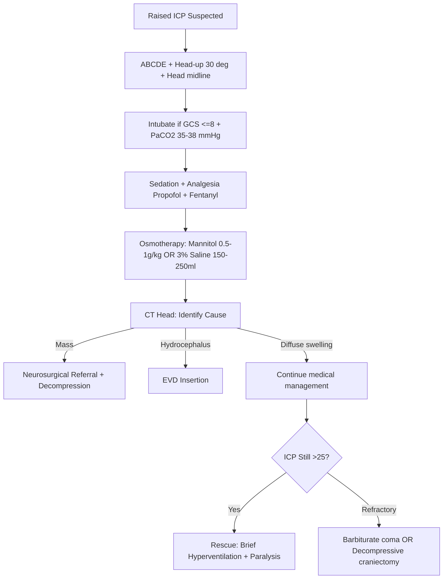

Related: [[Coma and Altered Consciousness]], [[Status Epilepticus]], [[Critical Care Monitoring]], [[Acute Medicine in Pregnancy]]

> [!important]
> **Raised ICP is a life-threatening emergency** causing cerebral ischaemia and brainstem herniation. Monro-Kellie doctrine: skull is fixed-volume (brain 80%, blood 10%, CSF 10%); any ↑ in one component must be compensated by ↓ in others or ICP rises. Normal ICP 5–15 mmHg (≤20 in adults). Cushing's triad = hypertension + bradycardia + irregular respirations. Management: head-up 30°, osmotherapy (mannitol/hypertonic saline), controlled ventilation (PaCO₂ 4.5–5.0 kPa), treat underlying cause. Key FCPS/MRCP: Monro-Kellie, Cushing's triad, herniation syndromes, osmotherapy, hyperventilation as rescue only.

## 1. Learning Objectives
- Define raised ICP and its pathophysiology (Monro-Kellie)
- Identify causes (focal, diffuse)
- Recognise clinical signs (Cushing's triad, herniation syndromes)
- Apply stepwise management (positioning, osmotherapy, ventilation)
- Know indications for surgical decompression
- Differentiate from mimics

## 2. Definition
- **Normal ICP**: 5–15 mmHg (supine)
- **Sustained >20 mmHg** = raised ICP (pathological)
- **Refractory >25 mmHg** despite treatment
- **Brain Trauma Foundation**: treat ICP >22 mmHg (target <22)
- Cerebral perfusion pressure (CPP) = MAP − ICP; target **CPP 60–70 mmHg**

## 3. Monro-Kellie Doctrine
The skull is a fixed-volume container with 3 components:
| Component | % Volume | Compensation |
|-----------|----------|--------------|
| Brain parenchyma | 80% | Limited (compliance) |
| Blood | 10% | Vasoconstriction, venous drainage |
| CSF | 10% | Displacement into spinal canal |

**Any increase in one component must be offset by decrease in another** (or ICP rises). When compliance exhausted, small volume changes cause large ICP rises.

## 4. Aetiology

### Intracranial (3 categories)
| Category | Examples |
|----------|----------|
| **Focal mass** | Haematoma (extradural, subdural, intracerebral), tumour, abscess |
| **Diffuse brain swelling** | Traumatic brain injury (TBI), hypoxic-ischaemic injury, encephalitis, fulminant hepatic failure, Reye syndrome, DKA |
| **CSF flow obstruction** | Hydrocephalus (obstructive, communicating), Chiari, aqueduct stenosis |
| **Venous** | Cerebral venous sinus thrombosis (CVST) |

### Extracranial Causes
- **Hypoxia, hypercarbia** (cerebral vasodilation)
- **Hyponatraemia** (cerebral oedema)
- **Hepatic/renal failure** (encephalopathy, oedema)
- **Malignant hypertension** (PRES)
- **High altitude cerebral oedema**

## 5. Pathophysiology
1. **Volume increase** (mass, blood, oedema, CSF)
2. **Initial compensation**: CSF displacement, venous collapse
3. **Compliance exhausted** → ICP rises steeply
4. **Reduced CPP** → cerebral ischaemia
5. **Herniation syndromes** (see below)
6. **Cushing's reflex**: systemic hypertension → reflex bradycardia (preserves CPP)
7. **Brainstem compression** → irregular respirations, death

## 6. Clinical Features

### Symptoms
- **Headache** (worse on lying, coughing, Valsalva; worse in morning)
- **Vomiting** (often without nausea — "positional")
- **Visual disturbance** (transient obscurations, diplopia — CN VI palsy from stretch)
- **Altered consciousness** (lethargy → coma)
- **Seizures**

### Signs
- **Papilloedema** (often late — absent in acute rises)
- **Cushing's triad** (late, ominous):
  1. Hypertension (widened pulse pressure)
  2. Bradycardia
  3. Irregular respirations (Cheyne-Stokes, central neurogenic hyperventilation, apneustic, ataxic)
- **Pupillary changes** (uncal herniation: ipsilateral fixed dilated pupil)
- **Decorticate / decerebrate posturing**
- **Upward gaze palsy** (Parinaud — dorsal midbrain)

### Cushing's Triad — Explained
- **Hypertension** = compensatory to maintain CPP
- **Bradycardia** = baroreceptor response to hypertension
- **Irregular respirations** = brainstem (medulla) compression
- **All three = impending herniation** — treat immediately

## 7. Herniation Syndromes
| Syndrome | Cause | Features |
|----------|-------|----------|
| **Uncal (transtentorial)** | Temporal lobe through tentorial notch | Ipsilateral CN III palsy (fixed dilated pupil), contralateral hemiparesis, decreased consciousness |
| **Central transtentorial** | Diffuse downward pressure | Bilateral pinpoint pupils → midposition fixed, decorticate → decerebrate, Cushing's, death |
| **Tonsillar (coning)** | Cerebellar tonsils through foramen magnum | Neck stiffness, cardiac arrest, sudden death |
| **Subfalcine (cingulate)** | Cingulate gyrus under falx | Contralateral leg weakness, ACA territory infarct |
| **Upward transtentorial** | Posterior fossa mass pushing up | Coma, small pupils, Parinaud's |

## 8. Investigations
- **CT head** (urgent, non-contrast): mass effect, midline shift, effaced sulci, basal cisterns
- **MRI brain**: better for posterior fossa, infiltrative disease
- **CT venogram / MRV**: if CVST suspected
- **LP** — **contraindicated** if raised ICP suspected (herniation risk); only after imaging
- **Fundoscopy**: papilloedema (chronic), but may be absent in acute
- **ICP monitoring**: gold standard (ventricular catheter, parenchymal bolt) — for TBI in ICU
- **ABG, U&E, glucose, LFT, ammonia, ABG**: identify extracranial causes
- **EEG**: non-convulsive status epilepticus

## 9. Management

### Step 1: ABCDE + Position
- **Airway**: intubate if GCS ≤8 or deteriorating
- **Breathing**: controlled ventilation, target **PaCO₂ 4.5–5.0 kPa (35–38 mmHg)**
- **Head-up 30°**, head midline (avoid jugular compression)
- **Loosen neck ties / cervical collars** (venous drainage)
- Avoid hypotension: MAP target for CPP

### Step 2: Osmotherapy
| Agent | Dose | Onset | Notes |
|-------|------|-------|-------|
| **Mannitol 20%** | 0.5–1 g/kg IV bolus (250–500 mL) | 15–30 min | Osmotic diuretic; monitor UO, Na⁺ |
| **Hypertonic saline 3%** | 150–250 mL IV over 10–20 min | 5–15 min | Preferred in hypovolaemia; target Na⁺ 145–155 |
| **Hypertonic saline 23.4%** | 30 mL IV over 10–20 min | Rapid | Central line required |

> **Hold mannitol if serum osmolality >320 mOsm/kg** (renal failure risk)

### Step 3: Sedation + Analgesia
- **Propofol** (reduces cerebral metabolism, ICP)
- **Fentanyl / morphine** (analgesia, ICP ↓)
- **Midazolam** if paralysed

### Step 4: Treat Underlying Cause
- **Mass lesion** → neurosurgical decompression
- **Hydrocephalus** → external ventricular drain (EVD) / shunt
- **CVST** → anticoagulation (LMWH even with haemorrhage)
- **Infection** → antibiotics, abscess drainage
- **Metabolic** → correct sodium, glucose, ammonia
- **TBI** → decompressive craniectomy if refractory

### Step 5: Rescue Therapies (Refractory ICP)
- **Hyperventilation** to PaCO₂ 4.0–4.5 kPa (transient only — vasoconstriction, risk of ischaemia; do NOT <4.0 kPa)
- **Therapeutic hypothermia** (35–36°C) — controversial, rebound ICP
- **Barbiturate coma** (thiopentone) — last resort, EEG monitoring
- **Decompressive craniectomy** (e.g., DECRA trial — refractory ICP)
- **External ventricular drain (EVD)** for hydrocephalus
- **Paralysis** (cisatracurium infusion)

### Step 6: Supportive Care
- **DVT prophylaxis** (mechanical, then LMWH when safe)
- **Seizure prophylaxis** (levetiracetam — phenytoin not in TBI)
- **Stress ulcer prophylaxis** (PPI)
- **Glycaemic control** (6–10 mmol/L)
- **Temperature control** (fever worsens ICP)
- **Maintain CPP 60–70** (vasopressors if needed)
- **Avoid**: hypoxia, hyperthermia, hyponatraemia, hyperglycaemia, hypovolaemia, anaemia

## 10. Red Flags
- **Cushing's triad** (impending herniation)
- **Fixed dilated pupil**
- **GCS drop >2 points**
- **Decerebrate posturing**
- **Apnoea / irregular respirations**

## 11. Complications
- **Brainstem herniation** → death
- **Cerebral ischaemia / infarction**
- **Hydrocephalus** (post-haemorrhagic, post-meningitis)
- **Hypopituitarism** (pituitary apoplexy, surgery)
- **Central venous thrombosis** (dehydration, immobility)
- **Visual loss** (prolonged papilloedema, optic atrophy)

## 12. Prognosis
- Outcome depends on cause, duration, CPP, age
- TBI: GCS, pupillary response, age, CT findings (Marshall classification) predict outcome
- 6-month outcome: GOSE (Extended Glasgow Outcome Scale)

## 13. FCPS/MRCP High-Yield Points
1. **Monro-Kellie doctrine**: skull fixed volume — brain 80%, blood 10%, CSF 10%
2. **Cushing's triad**: HT + Brady + Irregular RR = impending herniation
3. **Normal ICP**: 5–15 mmHg; treat >20–22 mmHg
4. **CPP = MAP − ICP**; target 60–70 mmHg
5. **Head-up 30°** + head midline
6. **Mannitol 0.5–1 g/kg** OR **3% saline 150–250 mL** for osmotherapy
7. **Hyperventilation** to PaCO₂ 35–38 mmHg (do NOT <30)
8. **Drain CSF** via EVD if hydrocephalus
9. **Decompressive craniectomy** for refractory ICP (DECRA)
10. **Avoid hypoxia, hyperthermia, hyponatraemia, anaemia**
11. **Pupillary changes** (CN III) = uncal herniation
12. **LP contraindicated** without imaging

## 14. Common Viva Questions
1. Define raised ICP. What is the Monro-Kellie doctrine?
2. List causes of raised ICP
3. Describe Cushing's triad and pathophysiology
4. Outline the management of raised ICP step-by-step
5. What are the herniation syndromes?
6. How do you calculate CPP? What is the target?
7. Indications for decompressive craniectomy
8. Why avoid LP in suspected raised ICP?

## 15. Common Confusions / Exam Traps
- **Confusing ICP and CPP targets** — CPP = MAP − ICP, target 60–70
- **Hyperventilation below PaCO₂ 4.0 kPa** → cerebral ischaemia
- **Mannitol in hypovolaemia** → hypoperfusion; use hypertonic saline
- **Hypotonic fluids** (5% dextrose) worsen cerebral oedema — use 0.9% NaCl
- **LP without imaging** → tonsillar herniation
- **Head-down positioning** → ↑ ICP
- **Sedation reduces ICP** but must be titrated, not withheld
- **Steroids** in TBI no benefit; only for vasogenic oedema (tumour)
- **Hypoxia + hypercapnia** → cerebral vasodilation → ↑ ICP

## 16. Mnemonics
- **MONRO-KELLIE**: 3 compartments — **B**rain 80%, **B**lood 10%, **C**SF 10%
- **CUSHING's triad**: **H**ypertension, **B**radycardia, **I**rregular RR
- **CPP = MAP − ICP**, target **60–70**
- **MANNITOL**: **M**annitol 0.5–1 g/kg; **N**a⁺ 145–155 if hypertonic saline
- **UNCAL HERNIATION**: **CN III** palsy (fixed dilated pupil) + contralateral hemiparesis
- **CINGULATE/SUBFALCINE**: contralateral leg weakness
- **Tonsillar**: sudden death
- **TBI steroids**: NO (CRASH trial)
- **LP contraindications**: raised ICP, mass lesion, coagulopathy, infection at site
- **Avoid**: hypotonic fluids, hypoxia, hyperthermia, hyponatraemia, hypoglycaemia

## 17. Mind Map

## 18. Flowchart — Raised ICP Management

## 19. One-Page Revision Summary
- **Normal ICP**: 5–15 mmHg; treat >20–22 mmHg
- **CPP = MAP − ICP**; target 60–70
- **Monro-Kellie**: Brain 80%, Blood 10%, CSF 10% in fixed skull
- **Cushing's triad**: HT + Bradycardia + Irregular RR = herniation imminent
- **Uncal**: CN III palsy (fixed dilated pupil) + contralateral hemiparesis
- **Tonsillar**: sudden death
- **Stepwise management**: ABCDE + Head-up 30° → Sedation → Osmotherapy (mannitol 0.5–1 g/kg OR 3% saline 150–250 mL) → PaCO₂ 35–38 mmHg → EVD for hydrocephalus → Decompressive craniectomy
- **Avoid**: LP without imaging, hypotonic fluids, steroids in TBI, PaCO₂ <30 mmHg
- **Treat underlying cause** (mass, hydrocephalus, CVST, infection)

## 24-Hour Recall Prompts
- State Monro-Kellie doctrine
- List Cushing's triad and its significance
- Outline the management of raised ICP
- Describe uncal herniation signs
- Calculate CPP and state target

## 7-Day / 15-Day / 30-Day Revision Tracker
- [ ] Day 1 completed
- [ ] 24-hour recall completed
- [ ] Day 7 revision completed
- [ ] Day 15 revision completed
- [ ] Day 30 revision completed

## 20. Must Know / Should Know / Nice to Know
### Must Know
- Monro-Kellie doctrine
- Cushing's triad
- CPP calculation and target (60–70)
- Stepwise management: head-up, sedation, osmotherapy, ventilation
- Mannitol 0.5–1 g/kg + hypertonic saline 3% doses
- Herniation syndromes (uncal, tonsillar, central, subfalcine)
- Avoid LP without imaging

### Should Know
- Decompressive craniectomy (DECRA trial)
- Barbiturate coma for refractory ICP
- EVD for hydrocephalus
- Avoid steroids in TBI
- PaCO₂ target 35–38 mmHg

### Nice to Know
- ICP monitoring devices (ventricular catheter, parenchymal bolt)
- Therapeutic hypothermia (controversial)
- GOSE outcome scale
- Marshall CT classification in TBI
- PRES, hepatic encephalopathy specifics

## 21. Self-Test Scorecard
- Understanding: /10
- Recall: /10
- MCQ Performance: /10
- SBA Performance: /10
- Viva Confidence: /10
- Total: /50

> [!tip]
> Interpretation: <35 = weak topic, 35-44 = acceptable but insecure, 45+ = strong exam-ready topic.

## 22. Exam Answer Modes
### Long Answer Skeleton
- Definition of raised ICP
- Monro-Kellie doctrine
- Aetiology (mass, diffuse, CSF, venous, extracranial)
- Pathophysiology
- Clinical features (symptoms + signs)
- Cushing's triad explanation
- Herniation syndromes
- Investigations (CT, MRI, ICP monitoring)
- Stepwise management
- Complications + prognosis

### Short Note Skeleton
- Monro-Kellie doctrine diagram
- Cushing's triad box
- Herniation syndromes table
- Osmotherapy doses
- ICP/CPP targets

### Viva One-Liners
- "Normal ICP 5–15 mmHg, treat >20"
- "CPP = MAP − ICP, target 60–70"
- "Cushing's triad = HT + Brady + Irregular RR"
- "Uncal: CN III palsy + contralateral hemiparesis"
- "Mannitol 0.5–1 g/kg OR 3% saline 150–250 mL"
- "PaCO₂ target 35–38 mmHg"
- "Head-up 30°, head midline"
- "LP contraindicated without imaging"
- "Monro-Kellie: brain 80, blood 10, CSF 10"
- "Tonsillar herniation = sudden death"

### Ward-Case Discussion Points
- TBI, GCS 6, blown right pupil → intubate, mannitol, urgent CT, neurosurgical decompression
- Subarachnoid haemorrhage, GCS 13, severe headache → CT angio, nimodipine, EVD if hydrocephalus
- Fulminant hepatic failure, confusion, hyperventilation → ammonia, treat as raised ICP, hypertonic saline
- Post-op craniopharyngioma, Na⁺ 128, GCS 10 → hyponatraemia, DDAVP withheld, fluid restrict, MRI

### Last-Night-Before-Exam Sheet
- ICP 5–15; treat >20
- CPP = MAP − ICP, target 60–70
- Monro-Kellie: 80/10/10
- Cushing's: HT + Brady + Irregular RR
- Uncal: CN III + contralateral hemi
- Head-up 30° + head midline
- Mannitol 0.5–1 g/kg OR 3% saline 150–250 mL
- PaCO₂ 35–38 mmHg
- No LP without imaging
- No steroids in TBI

## 23. Summary
**Raised ICP is a life-threatening emergency** causing cerebral ischaemia and brainstem herniation. **Monro-Kellie doctrine**: skull is a fixed-volume container (brain 80%, blood 10%, CSF 10%); any ↑ in one component must be offset by ↓ in another. **Normal ICP**: 5–15 mmHg; treat >20–22 mmHg. **CPP = MAP − ICP**; target 60–70 mmHg. **Cushing's triad** (late, ominous): hypertension + bradycardia + irregular respirations. **Herniation syndromes**: uncal (CN III palsy + contralateral hemiparesis), central, tonsillar (sudden death), subfalcine. **Stepwise management**: ABCDE + head-up 30° + head midline → intubation + controlled ventilation (PaCO₂ 4.5–5.0 kPa / 35–38 mmHg) → sedation + analgesia → osmotherapy (**mannitol 0.5–1 g/kg** OR **hypertonic saline 3% 150–250 mL**) → identify and treat underlying cause (mass → surgical decompression; hydrocephalus → EVD) → rescue therapies (brief hyperventilation, paralysis, barbiturate coma, decompressive craniectomy). **Avoid**: LP without imaging, hypotonic fluids, steroids in TBI (CRASH), PaCO₂ <30 mmHg. Supportive: DVT/PUD prophylaxis, seizure prophylaxis, temperature control, glycaemic control.

## 24. MCQs (10)
1. Monro-Kellie doctrine: cranial cavity components in proportion:
   A. Brain 70%, Blood 20%, CSF 10%
   B. **Brain 80%, Blood 10%, CSF 10%**
   C. Brain 60%, Blood 30%, CSF 10%
   D. Brain 90%, Blood 5%, CSF 5%

2. Cushing's triad includes all EXCEPT:
   A. Hypertension
   B. Bradycardia
   C. Irregular respirations
   D. **Tachycardia**

3. Normal ICP in adults:
   A. 0–5 mmHg
   B. **5–15 mmHg**
   C. 20–30 mmHg
   D. 30–40 mmHg

4. CPP is calculated by:
   A. ICP − MAP
   B. **MAP − ICP**
   C. MAP + ICP
   D. MAP / ICP

5. Target CPP in raised ICP:
   A. 30–40 mmHg
   B. 50–60 mmHg
   C. **60–70 mmHg**
   D. 80–90 mmHg

6. Mannitol dose in raised ICP:
   A. 0.1 g/kg
   B. **0.5–1 g/kg**
   C. 2 g/kg
   D. 5 g/kg

7. Uncal herniation classically presents with:
   A. Pinpoint pupils bilaterally
   B. **Ipsilateral fixed dilated pupil + contralateral hemiparesis**
   C. Cheyne-Stokes respiration
   D. Bilateral leg weakness

8. PaCO₂ target in controlled ventilation for raised ICP:
   A. 25–30 mmHg
   B. **35–38 mmHg**
   C. 45–50 mmHg
   D. 50–55 mmHg

9. Steroids in raised ICP due to traumatic brain injury:
   A. Recommended at high dose
   B. Recommended at low dose
   C. **Not recommended (CRASH trial)**
   D. Recommended only in children

10. LP is contraindicated in suspected raised ICP because of risk of:
    A. Infection
    B. **Tonsillar herniation**
    C. Bleeding
    D. Hypotension

## 25. SBA Questions (10)
1. A 25-year-old with severe TBI, intubated, ICP 28 mmHg, MAP 80 mmHg. CPP is:
   A. 50 mmHg
   B. **52 mmHg (below target 60–70)**
   C. 100 mmHg
   D. 108 mmHg

2. A patient with raised ICP has Cushing's triad. Most likely herniation type:
   A. Subfalcine
   B. **Tonsillar / uncal**
   C. Upward
   D. None

3. Hypertonic saline 3% dose in raised ICP:
   A. 50 mL
   B. **150–250 mL over 10–20 min**
   C. 1 L
   D. 5 mL

4. A patient with obstructive hydrocephalus and raised ICP — best treatment:
   A. Mannitol only
   B. **External ventricular drain (EVD)**
   C. Lumbar puncture
   D. Steroids

5. Cushing's triad is a sign of:
   A. Early raised ICP
   B. **Impending herniation (late)**
   C. Hyperventilation
   D. Sleep

6. Mannitol should be held if serum osmolality exceeds:
   A. 280 mOsm/kg
   B. 300 mOsm/kg
   C. **320 mOsm/kg**
   D. 350 mOsm/kg

7. A patient with fulminant hepatic failure develops confusion. Most likely raised ICP cause:
   A. Mass lesion
   B. **Cerebral oedema (hyperammonaemia)**
   C. Hydrocephalus
   D. CVST

8. Brief hyperventilation in raised ICP:
   A. Sustained therapy
   B. **Rescue therapy only (transient, risk of ischaemia)**
   C. First-line
   D. Never used

9. Decompressive craniectomy is indicated in:
   A. **Refractory raised ICP despite medical management**
   B. All TBI
   C. Stroke
   D. Meningitis only

10. A patient on mannitol develops hypovolaemia. Better alternative:
    A. More mannitol
    B. **Hypertonic saline 3%**
    C. 5% dextrose
    D. 0.45% saline

## 26. Flashcards
- Q: Monro-Kellie doctrine
  A: Brain 80%, Blood 10%, CSF 10% in fixed skull
- Q: Normal ICP
  A: 5–15 mmHg (treat >20)
- Q: CPP formula
  A: CPP = MAP − ICP
- Q: CPP target
  A: 60–70 mmHg
- Q: Cushing's triad
  A: Hypertension + Bradycardia + Irregular respirations
- Q: Mannitol dose
  A: 0.5–1 g/kg IV
- Q: Hypertonic saline 3% dose
  A: 150–250 mL over 10–20 min
- Q: PaCO₂ target
  A: 35–38 mmHg (4.5–5.0 kPa)
- Q: Uncal herniation
  A: CN III palsy (fixed dilated pupil) + contralateral hemiparesis
- Q: Tonsillar herniation
  A: Sudden death
- Q: Head position in raised ICP
  A: Head-up 30°, head midline
- Q: Steroids in TBI
  A: NOT recommended (CRASH trial)
- Q: Decompressive craniectomy
  A: Refractory raised ICP despite medical management

## 27. Answer Key with Explanations
**MCQ 1**: B — Monro-Kellie: brain 80%, blood 10%, CSF 10%.
**MCQ 2**: D — Cushing's = HT + Brady + Irregular RR (NOT tachycardia).
**MCQ 3**: B — Normal ICP 5–15 mmHg.
**MCQ 4**: B — CPP = MAP − ICP.
**MCQ 5**: C — CPP target 60–70 mmHg.
**MCQ 6**: B — Mannitol 0.5–1 g/kg.
**MCQ 7**: B — Uncal: ipsilateral CN III + contralateral hemiparesis.
**MCQ 8**: B — PaCO₂ 35–38 mmHg.
**MCQ 9**: C — CRASH trial: steroids ↑ mortality in TBI.
**MCQ 10**: B — LP can cause tonsillar herniation.

**SBA 1**: B — CPP = 80 − 28 = 52 mmHg, below target.
**SBA 2**: B — Cushing's = impending herniation.
**SBA 3**: B — 150–250 mL over 10–20 min.
**SBA 4**: B — EVD is definitive for hydrocephalus.
**SBA 5**: B — Cushing's = late/impending herniation.
**SBA 6**: C — Hold mannitol if osmolality >320.
**SBA 7**: B — Hyperammonaemia causes cerebral oedema in FHF.
**SBA 8**: B — Brief hyperventilation = rescue only.
**SBA 9**: A — Refractory raised ICP despite medical management.
**SBA 10**: B — Hypertonic saline 3% — preferred in hypovolaemia.

---

**Status**: Full FCPS/MRCP topic note completed — 2026-06-15

## PasTest Scenario SBAs (Clinical Vignettes)

> **Auto-generated PasTest/Mediscope-style scenario SBAs** grounded in the authored source. Each scenario tests a real clinical fact (triad, specific sign, contraindication, trial, first-line Rx) extracted from the topic. *Source: Ch 10: Acute Medicine — Raised Intracranial Pressure*

**Q1.** What is the most appropriate first-line therapy for Raised Intracranial Pressure?

  - **A.** Airway + Breathing + PaCO₂
  - **B.** An advanced/surgical therapy reserved for refractory disease
  - **C.** Symptomatic treatment only, no disease-modifying therapy
  - **D.** Empiric broad-spectrum therapy without specific indication

  > **Answer: A** — Airway + Breathing + PaCO₂
  >
  > *Source:* ### Step 1: ABCDE + Position
- **Airway**: intubate if GCS ≤8 or deteriorating
- **Breathing**: controlled ventilation, target **PaCO₂ 4.5–5.0 kPa (35–38 mmHg)**
- **Head-up 30°**, head midline (avoid

