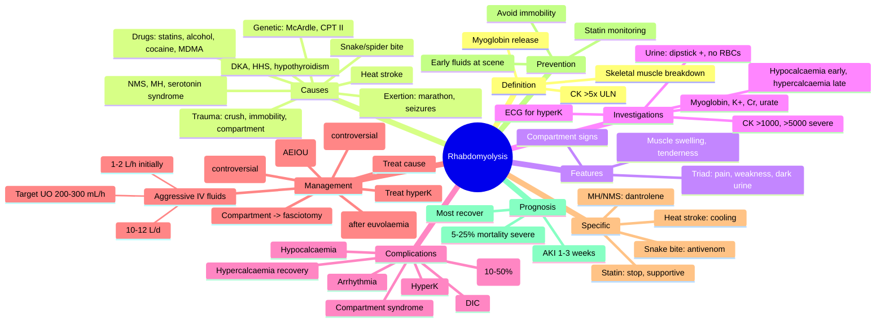
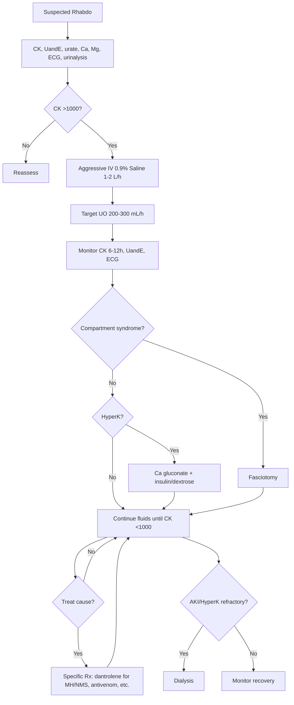

Related: [[Acute Kidney Injury in Critical Illness]], [[Acid-Base and Electrolyte Emergencies]], [[Malignant Hyperthermia Neuroleptic Malignant Syndrome]]

> [!important]
> **Rhabdomyolysis = skeletal muscle breakdown releasing myoglobin, CK, K⁺, phosphate, urate into circulation**. **CK >5× ULN (>1000 U/L)** is diagnostic; CK often >5000 in established rhabdo. **Triad: muscle pain + weakness + dark (tea-coloured) urine**. **Major complications**: **AKI (myoglobinuric)** in 10-50%, **hyperkalaemia** (life-threatening arrhythmia), **compartment syndrome**, **DIC**, **hypocalcaemia** (early, then hypercalcaemia recovery). **Treatment: AGGRESSIVE IV fluids early** (1-2 L/h initially, target UO 200-300 mL/h, total 10-12 L/d). **Urine alkalinisation** (NaHCO₃, pH >6.5) controversial. **Mannitol, loop diuretics** in severe cases. **Dialysis** if AKI/refractory hyperK. FCPS/MRCP: causes (crush, prolonged immobility, drugs, malignant hyperthermia, NMS, statins, exertion, alcohol, snake bite), CK thresholds, AKI mechanism, treatment, complications.

## 1. Learning Objectives
- Define rhabdomyolysis
- Identify common causes (trauma, exertional, drugs, metabolic, genetic)
- Recognise clinical features (muscle pain, weakness, dark urine)
- Investigate (CK, myoglobin, U&E, urate, LDH, AST/ALT, urinalysis)
- Manage: aggressive IV fluids, urine alkalinisation, electrolyte correction
- Prevent and treat complications (AKI, compartment syndrome, hyperK, DIC)
- Identify when to dialyse
- Counsel on statin-induced rhabdo

## 2. Definition
- **Rhabdomyolysis = skeletal muscle injury with release of intracellular contents** (myoglobin, CK, K⁺, phosphate, urate, LDH, AST) into systemic circulation
- **Diagnostic CK threshold**: **>5× ULN (>1000 U/L)**; some use **>5000 U/L** for "significant"
- **Severe rhabdo**: CK >5000 U/L OR CK >10,000 U/L with AKI risk

## 3. Pathophysiology
- **Direct muscle injury** (crush, trauma) → membrane disruption → myoglobin, CK, electrolytes release
- **ATP depletion** → Na⁺/K⁺-ATPase failure → cell swelling, Ca²⁺ influx → proteases, phospholipases → cell death
- **Myoglobin → kidney injury**:
  - Renal vasoconstriction
  - Tubular obstruction (cast formation)
  - Oxidative damage (ferryl myoglobin, lipid peroxidation)
  - Worsened by hypovolaemia, acidosis, low UO
- **Release of K⁺** → hyperkalaemia
- **Phosphate release** → binds Ca²⁺ → hypocalcaemia
- **Hepatic haptoglobin** binds free myoglobin → cleared (saturable)

## 4. Causes (Mnemonic: "CRUSH MY LEGS" or systematic)

### Trauma / Compression
- **Crush injury** (RTA, building collapse, industrial)
- **Prolonged immobility** (stroke on floor, intoxicated, post-op)
- **Compartment syndrome**
- **Burns, electrical injury**
- **Severe exertion** (marathon, military training, seizures)
- **Physical torture, abuse**

### Exertional / Environmental
- **Heat stroke** (exertional or classic)
- **Strenuous exercise** (marathon, weightlifting, status epilepticus)
- **Status asthmaticus** (work of breathing)
- **Severe dystonia, tetanus, neuroleptic malignant syndrome**
- **Hypothermia**

### Drugs / Toxins
- **Statins** (especially with fibrates, CYP inhibitors, hypothyroidism)
- **Antipsychotics** (NMS — clozapine, haloperidol)
- **Antidepressants** (SSRI, TCA, MAOI — serotonin syndrome)
- **Alcohol** (acute intoxication, chronic)
- **Illicit**: cocaine, amphetamines, heroin, MDMA
- **Snake/spider bite** (viper, brown recluse)
- **Carbon monoxide, cyanide**
- **Salicylate, paracetamol**
- **Colchicine**
- **Daptomycin**

### Metabolic / Endocrine
- **DKA, HHS** (osmotic, phosphate)
- **Severe electrolyte abnormalities**: K⁺, Na⁺, Ca²⁺, phosphate
- **Hypothyroidism** (statin risk)
- **Cushing's, hyperaldosteronism**
- **Inborn errors**: McArdle's (GSD V), carnitine palmitoyltransferase II def, mitochondrial

### Inflammatory / Autoimmune
- **Polymyositis, dermatomyositis**
- **Vasculitis** (polyarteritis nodosa)
- **SLE, RA**

### Infectious
- **Influenza, COVID-19, HIV, EBV, CMV, HSV**
- **Staph, Strep, Clostridium** (gas gangrene)
- **Legionella**

### Genetic / Muscular Dystrophies
- **Duchenne, Becker**
- **Limb-girdle, facioscapulohumeral**
- **Rhabdomyolysis with metabolic stress**

## 5. Clinical Features

### Classic Triad
- **Muscle pain** (myalgia) — often severe
- **Muscle weakness**
- **Dark, tea-coloured urine** (myoglobinuria) — visible when >100 mg/dL myoglobin

### Other Features
- **Muscle swelling, tenderness**
- **Stiffness, contracture**
- **Fever** (inflammatory)
- **Nausea, vomiting** (electrolyte disturbance)
- **Confusion, agitation** (electrolyte, uraemia)
- **Cardiac arrhythmia** (hyperK)
- **Oliguria / anuria** (AKI)
- **Compartment syndrome signs** (pain out of proportion, pain on passive stretch, tense swelling, paresthesia, pulselessness late)

## 6. Investigations

### Lab
| Test | Result in Rhabdo |
|------|------------------|
| **CK (creatine kinase)** | **>1000 U/L (5× ULN)**, often >10,000; peaks 24-72 h |
| **Myoglobin** | ↑ in serum + urine (urine dipstick + for blood, no RBCs) |
| **U&E** | K⁺ ↑, urea ↑, Cr ↑ (AKI), phosphate ↑ |
| **Calcium** | ↓ early (binds phosphate), ↑ late (recovery) |
| **Urate** | ↑ |
| **LDH, AST, ALT** | ↑ (muscle source) |
| **Aldolase** | ↑ |
| **DIC screen** | PT/PTT ↑, fibrinogen ↓, D-dimer ↑ |
| **Urinalysis** | Blood + on dipstick (myoglobin), no RBCs on microscopy |
| **ABG** | Metabolic acidosis (high anion gap) |
| **Creatinine** | ↑ in AKI (CK release cross-reacts) |

### Imaging
- **CT/MRI** of muscle (suspected compartment, deep muscle involvement)
- **Compartment pressure** measurement if suspected
- **ECG**: peaked T, wide QRS, sine wave (hyperK)

### Other (Specific Causes)
- **Toxicology screen** (drugs, alcohol)
- **TSH, free T4** (thyroid)
- **VBG/lactate** (DKA, sepsis)
- **Autoimmune screen** (polymyositis)
- **Genetic testing** (recurrent)

## 7. Diagnosis
- **Clinical suspicion** + **CK >1000 U/L** (5× ULN) + features
- **Urine dipstick + for blood without RBCs** (myoglobin) — sensitive but non-specific
- **Exclude** MI (CK-MB), stroke, thyroid storm

## 8. Complications
| Complication | Mechanism | Management |
|--------------|-----------|------------|
| **AKI** (10-50%) | Myoglobin nephrotoxic, hypovolaemia | Aggressive fluids, dialysis |
| **Hyperkalaemia** | K⁺ release, AKI | Ca gluconate, insulin/dextrose, dialysis |
| **Hypocalcaemia** (early) | Phosphate binding Ca²⁺ | Generally NO replacement (causes ectopic calcification) |
| **Hypercalcaemia** (recovery) | Mobilised Ca²⁺ | Hydration, bisphosphonates if severe |
| **Compartment syndrome** | Muscle swelling | Fasciotomy |
| **DIC** | Tissue factor, thromboplastin release | FFP, cryoprecipitate, platelets |
| **Arrhythmia** | HyperK, electrolyte disturbance | Treat hyperK |
| **Hepatic dysfunction** | Shock, cytokines | Supportive |
| **ARDS** | SIRS | Supportive ventilation |
| **Sepsis** | Tissue necrosis, infection | Antibiotics, source control |

## 9. Management

### Initial (within 6 hours ideally)
1. **ABC + IV access** (2 large-bore)
2. **Aggressive IV crystalloid** (0.9% saline): 1-2 L bolus, then 200-500 mL/h
   - **Target UO**: 200-300 mL/h (adult)
   - **Some centres**: maintain UO 3-5 mL/kg/h
3. **Treat hyperkalaemia**: Ca gluconate 10% 10 mL IV, insulin/dextrose
4. **Monitor**: UO, U&E, CK (6-12 h), Ca²⁺, ECG
5. **Correct hypovolaemia** (often 10-12 L/day needed)
6. **Drainage** if localised muscle bleed (e.g., femoral)

### Ongoing
- **Continue IV fluids** until CK <1000 U/L AND UO stable
- **Urine alkalinisation** (controversial): NaHCO₃ 100-150 mmol/L in fluid; target **urine pH >6.5** (some use >7.0)
  - **Theoretical benefit**: less myoglobin precipitation
  - **Concerns**: volume overload, hypocalcaemia, alkalosis
  - **Not routinely recommended** (Brown 2004)
- **Mannitol** 0.5-1 g/kg IV (controversial; if severe, no diuresis despite fluids)
  - **Reduces** muscle swelling, tubular obstruction
  - **Use** if fluid overload risk with crystalloid
- **Loop diuretics** (furosemide) ONLY after volume repletion; not first-line
- **Dialysis** for refractory AKI/hyperK (not prevented by myoglobin clearance — CK is cleared)

### Specific Treatments by Cause
- **Malignant hyperthermia**: dantrolene 2-2.5 mg/kg IV bolus, then 1 mg/kg q6h
- **NMS**: dantrolene, bromocriptine, supportive, dantrolene or amantadine
- **Serotonin syndrome**: cyproheptadine, cooling
- **Heat stroke**: cooling, dantrolene controversial
- **Statin-induced**: stop statin, supportive
- **Snake bite**: antivenom
- **Crush injury**: MTP if active bleed, surgical debridement
- **Compartment syndrome**: **fasciotomy** (urgent)

### Indications for Dialysis
- **AEIOU**: Acidosis, Electrolytes (hyperK), Ingestion, Overload, Uraemia
- **Standard AKI criteria** (KDIGO 2-3 with complications)

## 10. Prevention
- **Early IV fluids** at scene (crush injury)
- **Cool patient** (heat illness)
- **Avoid** nephrotoxins (NSAIDs, contrast)
- **DVT prophylaxis** when appropriate
- **Statin monitoring** (baseline CK, with symptoms)
- **Avoid prolonged immobility** (turn stroke patients)
- **Dantrolene** for MH-susceptible surgery

## 11. Prognosis
- **Most recover** with supportive care
- **AKI recovery**: usually within 1-3 weeks
- **Mortality**: 5-25% in severe rhabdo (especially with multi-organ failure)
- **Long-term**: chronic kidney disease risk, recurrent rhabdo (genetic causes)

## 12. FCPS/MRCP High-Yield Points
1. **Rhabdo = skeletal muscle breakdown** with intracellular release
2. **CK >5× ULN (>1000 U/L)** diagnostic; >5000 severe
3. **Triad**: muscle pain + weakness + dark urine
4. **Urine dipstick + for blood, NO RBCs on microscopy** (myoglobin)
5. **Major complications**: AKI (10-50%), hyperK, compartment syndrome, DIC
6. **Aggressive IV fluids** EARLY (1-2 L/h, target UO 200-300 mL/h, 10-12 L/d)
7. **Hyperkalaemia** is life-threatening
8. **Early hypocalcaemia** (don't replace — causes ectopic calcification)
9. **Late hypercalcaemia** during recovery
10. **Urine alkalinisation** controversial (not routine)
11. **Mannitol** in severe cases (controversial)
12. **Loop diuretics** only after euvolaemia
13. **Compartment syndrome → fasciotomy**
14. **Malignant hyperthermia → dantrolene**
15. **Statin + fibrate = rhabdo risk**

## 13. Common Viva Questions
1. Define rhabdomyolysis
2. List common causes
3. Classic triad
4. Investigations
5. Complications (AKI, hyperK)
6. Initial management
7. Aggressive IV fluids rationale
8. Indications for dialysis
9. Compartment syndrome
10. Statin-induced rhabdo

## 14. Common Confusions / Exam Traps
- **CK >1000** = diagnostic threshold (5× ULN)
- **Urine dipstick + for blood, NO RBCs** = myoglobin
- **DON'T replace calcium** early (causes ectopic calcification)
- **HyperK** is the immediate life threat
- **Fluids EARLY** (within 6 h = best outcome)
- **Urine alkalinisation** controversial; not routine
- **Mannitol** controversial
- **Loop diuretics** not first-line (only after euvolaemia)
- **Compartment syndrome** = clinical diagnosis; measure pressure if unsure
- **Dantrolene** for MH, NMS, heat stroke
- **Statin alone** rarely causes rhabdo; + fibrate, hypothyroidism ↑ risk
- **CK peaks 24-72 h**
- **AKI mortality** higher in elderly, sepsis, multi-organ failure
- **Crush injury**: aggressive fluids at scene
- **Recurrent rhabdo** = genetic workup (McArdle, CPT II)

## 15. Mnemonics
- **Causes**: **CRASH** (Crush, Rhabdomyolysis of statin/Seizures, Alcohol, Statins, Heat stroke) + **S**nake bite, **I**mmobility, **T**rauma, **E**xertion, **N**MS, **H**ypothyroidism
- **Triad**: **Pain + Weakness + Dark urine**
- **CK threshold**: **5× ULN (>1000)**
- **Urine**: **Dipstick + for blood, NO RBCs**
- **Initial Rx**: **Aggressive IV fluids (1-2 L/h, UO 200-300 mL/h)**
- **DON'T** replace early Ca²⁺
- **Complications**: **AKI + HyperK + Compartment + DIC**
- **Dialysis**: **AEIOU** (Acidosis, Electrolytes, Ingestion, Overload, Uraemia)
- **MH/NMS**: **Dantrolene**
- **Statin + fibrate**: high risk

## 16. Mind Map

## 17. Flowchart — Rhabdo Management

## 18. One-Page Revision Summary
- **Rhabdo = muscle breakdown with CK >5× ULN (>1000 U/L)**; myoglobin release
- **Triad**: pain + weakness + dark urine
- **Causes**: crush, immobility, exertion, heat stroke, drugs (statins, alcohol, cocaine), NMS, MH, snake bite, DKA, genetic
- **Urine dipstick + for blood, NO RBCs** (myoglobin)
- **Major complications**: AKI (10-50%), hyperK, compartment syndrome, DIC
- **Early hypocalcaemia** (DON'T replace); **late hypercalcaemia** recovery
- **Aggressive IV fluids** EARLY: 1-2 L/h, UO 200-300 mL/h, 10-12 L/day
- **Treat hyperK** urgently
- **Urine alkalinisation, mannitol** controversial
- **Loop diuretics** only after euvolaemia
- **Dialysis** if AEIOU
- **Compartment syndrome → fasciotomy**
- **MH/NMS → dantrolene**
- **Statin + fibrate** = high risk

## 24-Hour Recall Prompts
- Define rhabdo and CK threshold
- List common causes
- Outline classic triad
- Describe initial management
- List major complications
- State dialysis indications
- Differentiate early/late Ca²⁺ changes

## 7-Day / 15-Day / 30-Day Revision Tracker
- [ ] Day 1 completed
- [ ] 24-hour recall completed
- [ ] Day 7 revision completed
- [ ] Day 15 revision completed
- [ ] Day 30 revision completed

## 19. Must Know / Should Know / Nice to Know
### Must Know
- Definition + CK threshold
- Classic triad
- Urine dipstick + for blood, no RBCs
- Major complications (AKI, hyperK, compartment, DIC)
- Aggressive IV fluids
- Don't replace early Ca²⁺
- Late hypercalcaemia
- Treat hyperK
- Compartment → fasciotomy
- MH/NMS → dantrolene

### Should Know
- Causes (crush, immobility, exertional, drugs)
- Statin + fibrate risk
- AKI mechanism
- Mannitol/urine alkalinisation controversy
- Loop diuretic use
- Dialysis indications (AEIOU)
- Heat stroke management
- Snake bite
- Recurrent rhabdo → genetic
- Crush injury pre-hospital fluids

### Nice to Know
- Pathophysiology of myoglobin AKI
- Brown 2004 (urine alkalinisation)
- McArdle disease
- CPT II deficiency
- Dantrolene mechanism
- Statin + fibrate pharmacokinetics
- DIC in rhabdo
- Long-term CKD risk
- Ectopic calcification
- Risk factors for AKI in rhabdo

## 20. Self-Test Scorecard
- Understanding: /10
- Recall: /10
- MCQ Performance: /10
- SBA Performance: /10
- Viva Confidence: /10
- Total: /50

> [!tip]
> Interpretation: <35 = weak topic, 35-44 = acceptable but insecure, 45+ = strong exam-ready topic.

## 21. Exam Answer Modes
### Long Answer Skeleton
- Definition + CK threshold
- Pathophysiology
- Causes (trauma, exertional, drugs, metabolic, genetic, autoimmune, infective)
- Clinical features (triad, other)
- Investigations (CK, myoglobin, U&E, urinalysis, ECG)
- Complications (AKI, hyperK, compartment, DIC, hypo/hypercalcaemia)
- Management:
  - Aggressive IV fluids (1-2 L/h, UO 200-300, 10-12 L/d)
  - Treat hyperK
  - Treat cause
  - Compartment → fasciotomy
  - Dialysis (AEIOU)
  - Specific (dantrolene for MH/NMS, antivenom)
- Prevention
- Prognosis

### Short Note Skeleton
- Rhabdo triad + management
- AKI mechanism
- Compartment syndrome
- Statin-induced rhabdo
- Malignant hyperthermia

### Viva One-Liners
- "Rhabdo = muscle breakdown with CK >5× ULN"
- "Triad: pain + weakness + dark urine"
- "Urine dipstick + for blood, no RBCs (myoglobin)"
- "Aggressive IV fluids 1-2 L/h, UO 200-300 mL/h"
- "Don't replace early Ca²⁺ (causes ectopic calcification)"
- "Late hypercalcaemia during recovery"
- "HyperK is the immediate life threat"
- "Compartment syndrome → fasciotomy"
- "MH/NMS → dantrolene"
- "Statin + fibrate = high rhabdo risk"

### Ward-Case Discussion Points
- Crush injury patient, RTA, prolonged extraction → pre-hospital IV fluids, ICU
- 25-year-old marathon, dark urine, CK 25,000 → aggressive fluids, monitor AKI
- Statin + fibrate patient, myalgia, CK 8,000 → stop both, fluids, monitor
- 18-year-old, NMS after haloperidol → dantrolene, cooling, supportive
- Compartment syndrome in forearm after snake bite → fasciotomy

### Last-Night-Before-Exam Sheet
- Rhabdo = CK >5× ULN
- Triad: pain + weakness + dark urine
- Dipstick + blood, no RBCs
- Aggressive IV fluids (1-2 L/h, UO 200-300)
- 10-12 L/d
- Don't replace early Ca²⁺
- Late hypercalcaemia
- Treat hyperK
- Compartment → fasciotomy
- MH/NMS → dantrolene
- Statin + fibrate high risk
- Dialysis: AEIOU

## 22. Summary
**Rhabdomyolysis** = skeletal muscle breakdown with release of intracellular contents (myoglobin, CK, K⁺, phosphate, urate, LDH, AST) into circulation. **Diagnostic**: **CK >5× ULN (>1000 U/L)**; >5000 severe. **Triad**: muscle pain + weakness + dark (tea-coloured) urine. **Urine dipstick + for blood, NO RBCs on microscopy** (myoglobin). **Causes**: crush injury, prolonged immobility, compartment syndrome, severe exertion, heat stroke, **drugs (statins + fibrates, alcohol, cocaine, MDMA, antipsychotics)**, NMS, malignant hyperthermia, DKA/HHS, hypothyroidism, snake/spider bite, genetic (McArdle, CPT II), polymyositis, infections (influenza, COVID). **Pathophysiology**: ATP depletion → cell swelling, Ca²⁺ influx, cell death → myoglobin nephrotoxicity (vasoconstriction, tubular cast, oxidative damage) + AKI. **Complications**: **AKI (10-50%)**, **hyperK** (life-threatening arrhythmia), compartment syndrome, DIC, **early hypocalcaemia** (don't replace — ectopic calcification), **late hypercalcaemia** (recovery). **Management**: **Aggressive IV crystalloid EARLY** (1-2 L/h, target UO 200-300 mL/h, 10-12 L/day), continue until CK <1000; **treat hyperK** (Ca gluconate, insulin/dextrose); **compartment → fasciotomy**; **dialysis** if AEIOU (Acidosis, Electrolytes, Ingestion, Overload, Uraemia). **Urine alkalinisation** (NaHCO₃, pH >6.5) and **mannitol** controversial; **loop diuretics** only after euvolaemia. **Specific Rx**: dantrolene for MH/NMS, antivenom for snake bite, cooling for heat stroke. **Prognosis**: most recover, 5-25% mortality in severe (multi-organ failure), AKI recovers 1-3 weeks, long-term CKD risk.

## 23. MCQs (10)
1. Rhabdo diagnostic CK threshold:
   A. >500 U/L
   B. **>1000 U/L (5× ULN)**
   C. >300 U/L
   D. >200 U/L

2. Classic triad of rhabdo:
   A. **Muscle pain + weakness + dark urine**
   B. Fever + vomiting + abdominal pain
   C. Headache + photophobia + neck stiffness
   D. Confusion + ataxia + nystagmus

3. Urine dipstick in rhabdo:
   A. **+ for blood, NO RBCs on microscopy (myoglobin)**
   B. - for blood
   C. RBCs present
   D. WBCs present

4. Most serious early complication of rhabdo:
   A. AKI
   B. **Hyperkalaemia (life-threatening arrhythmia)**
   C. Hypocalcaemia
   D. DIC

5. Early hypocalcaemia in rhabdo:
   A. Treat with calcium IV
   B. **Do NOT replace (ectopic calcification risk)**
   C. Bisphosphonates
   D. Vitamin D

6. Aggressive IV fluid target UO in rhabdo:
   A. 50-100 mL/h
   B. 100-150 mL/h
   C. **200-300 mL/h**
   D. 500-700 mL/h

7. Compartment syndrome in rhabdo requires:
   A. Analgesia
   B. **Fasciotomy**
   C. Mannitol
   D. Calcium

8. Malignant hyperthermia treated with:
   A. Bromocriptine
   B. **Dantrolene**
   C. Cyproheptadine
   D. Naloxone

9. Statin + fibrate combination increases risk of:
   A. GI bleeding
   B. **Rhabdomyolysis**
   C. Diabetes
   D. Hypothyroidism

10. Late recovery complication of rhabdo:
    A. Hyperkalaemia
    B. Hypocalcaemia
    C. **Hypercalcaemia**
    D. Hyponatraemia

## 24. SBA Questions (10)
1. 30-year-old, marathon, dark urine, CK 25,000. First management:
   A. Stop
   B. **Aggressive IV 0.9% saline 1-2 L/h, monitor UO**
   C. Calcium IV
   D. Dialysis

2. Crush injury patient, 6 h post-extraction, CK 50,000, K 6.8. Priority:
   A. Calcium
   B. **Treat hyperK + aggressive IV fluids**
   C. Dialysis
   D. Mannitol

3. Forearm swelling, pain on passive stretch, paraesthesia after snake bite. Next:
   A. Analgesia
   B. **Fasciotomy (compartment syndrome)**
   C. Antivenom only
   D. Calcium

4. Recurrent rhabdo on statins, no clear cause. Workup:
   A. **Genetic testing (McArdle, CPT II)**
   B. Stop all exercise
   C. Dialysis
   D. Liver biopsy

5. AKI in rhabdo not improving with fluids, K 7.0 refractory. Next:
   A. More fluids
   B. **Dialysis (AEIOU)**
   C. Calcium only
   D. Bicarbonate

6. Statin + fibrate patient with myalgia, CK 8,000. Action:
   A. Continue both
   B. **Stop both, IV fluids, monitor**
   C. Reduce statin
   D. Vitamin D

7. Crush syndrome at building collapse scene. Pre-hospital:
   A. CPR
   B. **IV fluids before release of compression**
   C. Tourniquet
   D. Wait for rescue

8. 18-year-old, MH intra-op, masseter rigidity, hyperthermia. Rx:
   A. Stop surgery
   B. **Dantrolene 2-2.5 mg/kg IV + cooling**
   C. Cool only
   D. Naloxone

9. NMS after haloperidol, CK 30,000, T 39.5°C. Rx:
   A. Haloperidol
   B. **Dantrolene/bromocriptine + supportive + cooling**
   C. Cyproheptadine
   D. Aspirin

10. Rhabdo + severe AKI, on fluid 12 L/d, urine pH 5.0. Add:
    A. Calcium
    B. **NaHCO3 (urine alkalinisation, controversial)**
    C. Mannitol mandatory
    D. Insulin

## 25. Flashcards
- Q: CK threshold
  A: >1000 U/L (5× ULN)
- Q: Classic triad
  A: Pain + weakness + dark urine
- Q: Urine dipstick
  A: + for blood, no RBCs (myoglobin)
- Q: Most serious early complication
  A: Hyperkalaemia
- Q: Don't replace early
  A: Calcium
- Q: Late recovery complication
  A: Hypercalcaemia
- Q: Target UO
  A: 200-300 mL/h
- Q: Initial fluid
  A: Aggressive 0.9% saline 1-2 L/h
- Q: Compartment syndrome Rx
  A: Fasciotomy
- Q: MH/NMS Rx
  A: Dantrolene
- Q: Statin + fibrate risk
  A: Rhabdomyolysis
- Q: Dialysis indications
  A: AEIOU

## 26. Answer Key with Explanations
**MCQ 1**: B — >1000 U/L (5× ULN).
**MCQ 2**: A — Triad: pain + weakness + dark urine.
**MCQ 3**: A — + for blood, no RBCs (myoglobin).
**MCQ 4**: B — HyperK is most immediately life-threatening.
**MCQ 5**: B — Don't replace early Ca²⁺ (ectopic calcification).
**MCQ 6**: C — Target UO 200-300 mL/h.
**MCQ 7**: B — Fasciotomy.
**MCQ 8**: B — Dantrolene for MH.
**MCQ 9**: B — Statin + fibrate = high rhabdo risk.
**MCQ 10**: C — Late hypercalcaemia.

**SBA 1**: B — Aggressive fluids.
**SBA 2**: B — Treat hyperK + fluids.
**SBA 3**: B — Fasciotomy.
**SBA 4**: A — Genetic testing.
**SBA 5**: B — Dialysis (AEIOU).
**SBA 6**: B — Stop both, fluids, monitor.
**SBA 7**: B — IV fluids before release.
**SBA 8**: B — Dantrolene.
**SBA 9**: B — Dantrolene + supportive.
**SBA 10**: B — NaHCO3 (controversial).

---

**Status**: Full FCPS/MRCP topic note completed — 2026-06-15

## PasTest Scenario SBAs (Clinical Vignettes)

> **Auto-generated PasTest/Mediscope-style scenario SBAs** grounded in the authored source content. Each scenario is a clinical vignette with 4 options. **Source: Ch 10: Acute Medicine / Rhabdomyolysis**

**Q1.** A patient is being evaluated for Rhabdomyolysis. Based on standard diagnostic approach, what is the most appropriate first-line investigation?

  - **A.** Approach described in standard diagnostic workup
  - **B.** An advanced/invasive test as first-line
  - **C.** Empirical treatment without investigation
  - **D.** Watchful waiting without further testing

  > **Answer: A** — Approach described in standard diagnostic workup

**Q2.** Which of the following best describes the underlying pathophysiology / definition of Rhabdomyolysis?

  - **A.** **Rhabdomyolysis = skeletal muscle injury with release of intracellular contents** (myoglobin, CK, K⁺, phosphate, urate, LDH, AST) into systemic circulation
  - **B.** A common misattribution to a similar but distinct condition
  - **C.** An outdated or disproven mechanism
  - **D.** A complication rather than the underlying disease process

  > **Answer: A** — **Rhabdomyolysis = skeletal muscle injury with release of intracellular contents** (myoglobin, CK, K⁺, phosphate, urate, LDH, AST) into systemic circu

