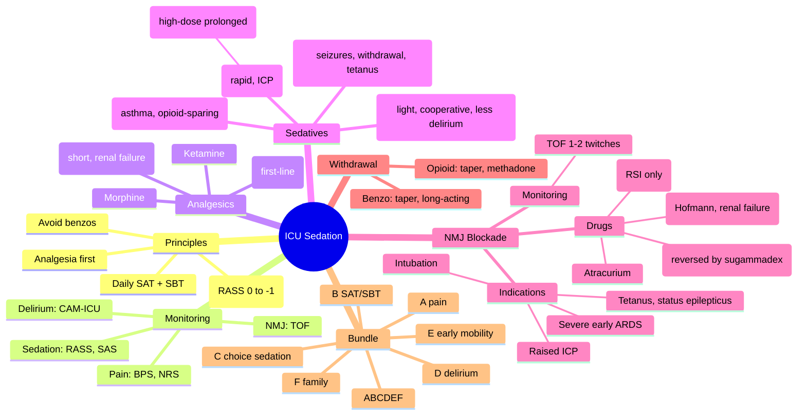
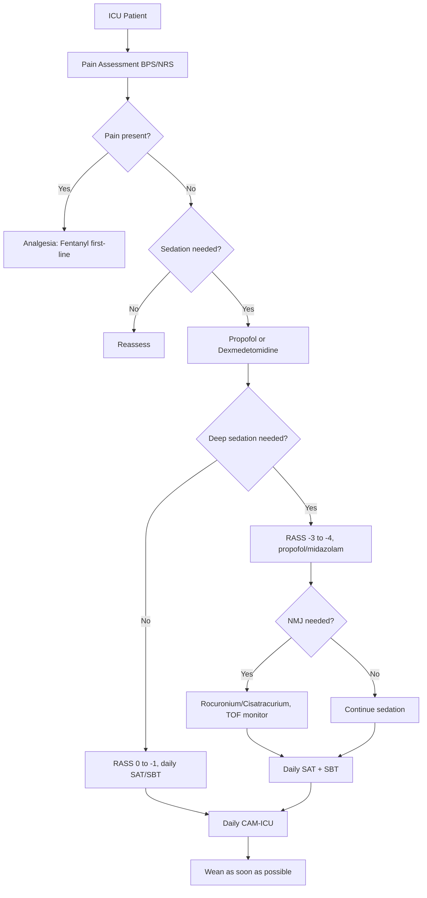

Related: [[Invasive Mechanical Ventilation - Basics]], [[Weaning from Mechanical Ventilation]], [[Delirium in Critical Care]]

> [!important]
> **ICU sedation goals: pain control first (analgesia-first), light sedation, patient-comfort, ventilator synchrony, amnesia (when needed).** RASS target **0 (alert) to -1 (drowsy)** for most patients; **-2 to -3** for severe ARDS/sync with vent. **First-line analgesia: fentanyl or morphine** (remifentanil in renal failure/short-term). **First-line sedation: propofol** (short-term, <48-72 h) or **dexmedetomidine** (lighter, less delirium) or **midazolam** (status epilepticus, alcohol withdrawal). **Avoid benzodiazepines** when possible (deliriogenic). **NMJ blockade** (rocuronium, cisatracurium) only for specific indications: **early severe ARDS (PaO₂/FiO₂ <150, ROSE criteria), intubation, raised ICP, tetanus**. **Daily SAT (Spontaneous Awakening Trial) + SBT (Spontaneous Breathing Trial)** reduce LOS and mortality. **Monitor**: BPS/NRS for pain, RASS/SAS for sedation, CAM-ICU for delirium, TOF for NMJ. FCPS/MRCP: light vs deep sedation, propofol infusion syndrome (PRIS), dexmedetomidine, NMJ monitoring.

## 1. Learning Objectives
- Apply analgesia-first principle (BPS/NRS for pain monitoring)
- Choose appropriate sedative (propofol, dexmedetomidine, midazolam, ketamine)
- Use RASS/SAS for sedation monitoring
- Identify indications for NMJ blockade
- Monitor NMJ with TOF (train-of-four)
- Prevent and recognise propofol infusion syndrome (PRIS)
- Perform daily SAT + SBT
- Recognise and manage withdrawal syndromes

## 2. Principles (PADIS 2018)
1. **Pain first** (analgesia-first) — if comfortable, may not need sedative
2. **Light sedation** (RASS 0 to -1) preferred; deep only when required
3. **Avoid benzodiazepines** (deliriogenic) — use propofol/dexmedetomidine
4. **Daily SAT + SBT** — standard of care
5. **NMJ blockade** only for specific indications
6. **Monitor pain, sedation, delirium** routinely
7. **Wean as soon as possible**

## 3. Monitoring Tools

### Pain
- **BPS (Behavioural Pain Scale)** for intubated/unconscious
- **NRS/VAS** for communicative
- **CPOT (Critical-Care Pain Observation Tool)**
- **Goal**: BPS ≤5 or NRS ≤3

### Sedation
| RASS | SAS | Description |
|------|-----|-------------|
| +4 | 7 | Combative, violent |
| +3 | 6 | Very agitated, pulling lines |
| +2 | 5 | Agitated, frequent non-purposeful movement |
| +1 | 4 | Restless, anxious |
| **0** | **3** | **Alert and calm** |
| **-1** | **2** | **Drowsy, eyes open to voice** |
| -2 | 1 | Light sedation, briefly awakens to voice |
| -3 | - | Moderate sedation, movement to voice |
| -4 | - | Deep sedation, no response to voice |
| -5 | - | Unarousable |

**Target**: RASS 0 to -1 (most) or -2 to -3 (severe ARDS, ICP, vent asynchrony)

### Delirium
- **CAM-ICU** or **ICDSC** (see Delirium topic)

### NMJ Blockade
- **TOF (Train-of-Four)**: 4 supramaximal stimuli at 2 Hz
  - **4/4 twitches**: 100% reversal (excess dose)
  - **3/4**: 75% (ideal deep block)
  - **2/4**: 80% block
  - **1/4**: 90% block
  - **0/4**: 100% block (no reversal)
- **Adequate surgical block**: 1-2 twitches
- **Titrated to clinical effect** (e.g., 1 twitch)

## 4. Analgesics (First — Pain Control)

| Drug | Dose | Notes |
|------|------|-------|
| **Fentanyl** | 25-100 mcg IV bolus, 25-200 mcg/h infusion | **First-line in ICU**; stable haemodynamics, no histamine release |
| **Morphine** | 1-10 mg IV, 1-5 mg/h infusion | Active metabolite (M6G) accumulates in renal failure |
| **Hydromorphone** | 0.2-1 mg IV | Alternative to morphine |
| **Remifentanil** | 0.5-15 mcg/kg/h | Ultra-short (t½ 3-4 min); use in renal failure, neurosurgical, frequent wake-up |
| **Paracetamol** | 1 g q6h IV/PO | Adjunct; reduces opioid requirement |
| **Ketamine** | 0.1-0.5 mg/kg bolus, 0.1-1 mg/kg/h infusion | Analgesic + NMDA antagonist; bronchodilator; preserves airway reflexes |

## 5. Sedatives

### Propofol
- **Dose**: 1-3 mg/kg/h (induction 1-2.5 mg/kg)
- **Mechanism**: GABA-A agonist
- **Onset**: <1 min; **t½**: 10-30 min (terminal 4-7 h after prolonged)
- **Advantages**: rapid onset/offset, easy titration, decreases ICP
- **Adverse**: **hypotension** (vasodilation, cardiac depression), **PRIS** (see below), hypertriglyceridaemia, pancreatitis
- **Avoid** in: egg/soy allergy, severe haemodynamic instability
- **Limit**: 4 mg/kg/h in adults; 48-72 h to reduce PRIS risk

### Dexmedetomidine
- **Dose**: 0.2-1.5 mcg/kg/h IV infusion (load 1 mcg/kg over 10 min optional)
- **Mechanism**: α2-adrenergic agonist (centrally acting)
- **Advantages**: **light sedation**, **cooperative** (rousable), preserves respiration, **less delirium** (vs benzo), opioid-sparing
- **Adverse**: **bradycardia**, hypotension, dry mouth, rebound hypertension on abrupt stop
- **Use**: weaning from ventilation, hyperactive delirium, procedural sedation
- **DahLBA, MIDEX, PRODEX trials**: non-inferior, less delirium

### Midazolam
- **Dose**: 0.02-0.1 mg/kg/h infusion (load 0.05-0.1 mg/kg)
- **Mechanism**: GABA-A agonist (benzodiazepine)
- **Advantages**: amnestic, anticonvulsant, stable haemodynamics
- **Adverse**: **deliriogenic**, accumulates (active metabolites, esp. renal failure), respiratory depression, withdrawal
- **Use**: status epilepticus, alcohol withdrawal, tetanus, severe asthma
- **Avoid** for routine ICU sedation (delirium risk)

### Ketamine
- **Dose**: 1-2 mg/kg bolus, 1-3 mg/kg/h infusion
- **Mechanism**: NMDA antagonist
- **Advantages**: bronchodilator, opioid-sparing, preserves airway reflexes
- **Adverse**: emergence phenomena (nightmares, hallucinations), ↑ICP (theoretical), salivation
- **Use**: severe asthma, procedural sedation, refractory pain, opioid-sparing

### Volatile Anaesthetics (e.g., Isoflurane)
- **Use**: occasional, via AnaConDa/Sedaconda
- **Dose**: 0.3-0.5 MAC
- **Advantage**: titratable, bronchodilator
- **Disadvantage**: requires scavenging, complex delivery

## 6. Propofol Infusion Syndrome (PRIS)
- **Definition**: rare, serious, often fatal complication of prolonged high-dose propofol
- **Risk factors**: high dose (>4 mg/kg/h), prolonged (>48 h), young age, severe illness, catecholamines, steroids
- **Features**: 
  - **Cardiac**: bradycardia → asystole, Brugada-like ECG
  - **Metabolic**: metabolic acidosis, hyperkalaemia, hypertriglyceridaemia
  - **Renal**: rhabdomyolysis, AKI
  - **Other**: fever
- **Mechanism**: impaired mitochondrial fatty acid oxidation
- **Management**: **STOP propofol**, supportive (haemofiltration for rhabdomyolysis, pacemaker for bradycardia)
- **Mortality**: 30-80%

## 7. NMJ Blockade (Neuromuscular Blocking Agents, NMBAs)

### Indications
- **Endotracheal intubation** (RSI)
- **Severe early ARDS** (PaO₂/FiO₂ <150 mmHg, ROSE criteria)
- **Raised ICP** (frequent coughing/asynchrony)
- **Tetanus, status epilepticus** (refractory)
- **Severe hypothermia** (shivering control)
- **Intra-operative**
- **Abdominal compartment syndrome** (surgical)
- **Transport** (unstable)

### Agents

| Drug | Dose | Notes |
|------|------|-------|
| **Rocuronium** | 0.6-1.2 mg/kg bolus, 8-12 mcg/kg/min infusion | **First-line**; rapid onset (60 s); reversable with sugammadex 16 mg/kg |
| **Cisatracurium** | 0.15-0.2 mg/kg bolus, 0.06-0.18 mg/kg/h infusion | **Preferred in renal/hepatic failure**; organ-independent metabolism (Hofmann elimination) |
| **Atracurium** | 0.4-0.5 mg/kg bolus, 0.3-0.6 mg/kg/h | Alternative; histamine release |
| **Succinylcholine (suxamethonium)** | 1-1.5 mg/kg (RSI only) | Depolarising; short-acting; **contraindications**: hyperkalaemia, burns (>24 h), denervation, malignant hyperthermia, muscular dystrophy |

### Monitoring
- **TOF (Train-of-Four)** at adductor pollicis
- **Target**: 1-2 twitches
- **Titrated** to clinical effect
- **Avoid** prolonged deep block (ICU-acquired weakness)

### Complications
- **ICU-acquired weakness** (CIP, CIM) — prolonged NMJ blockade + sepsis + immobility
- **Residual paralysis** post-stop
- **VTE**, pressure sores (immobility)
- **Awareness** (if paralysed without sedation)
- **Anaphylaxis**

### Reversal
- **Sugammadex** for rocuronium, vecuronium (16 mg/kg)
- **Neostigmine + glycopyrrolate** (older)
- **Spontaneous recovery** for atracurium/cisatracurium

## 8. Daily SAT + SBT

### SAT (Spontaneous Awakening Trial)
- **Stop all sedatives** for 4 h
- **Hold** if: active seizures, agitation, active withdrawal, paralysis, ↑ICP
- **Pass**: patient comfortable, no distress
- **Fail**: anxiety, agitation, distress, hypoxia, arrhythmia → restart at 50% previous dose

### SBT (Spontaneous Breathing Trial)
- **CPAP/PS trial** 30-120 min
- **Pass criteria**: RR <35, SpO₂ ≥90%, no distress, HR <140, no change in mental status
- **Hold if**: agitation, hypoxia, ↑work of breathing
- **Extubate** if pass

### ABCDEF Bundle (Combined)
- A: Assess pain
- B: Both SAT + SBT
- C: Choice of sedation (light, avoid benzos)
- D: Delirium assessment
- E: Early mobility
- F: Family engagement

## 9. Sedation in Specific Situations

### Severe ARDS
- **Deep sedation** (RASS -3 to -4) + NMJ blockade × 24-48 h
- **Propofol + fentanyl** first-line
- **Cisatracurium** (ROSE trial) or **Rocuronium**
- **Prone positioning**
- **Lung-protective ventilation**

### Raised ICP
- **Deep sedation** (RASS -3 to -4) + analgesia
- **Propofol** preferred (↓ICP)
- **NMJ blockade** for asynchrony/coughing
- **Avoid ketamine** (theoretical ↑ICP)

### Status Epilepticus
- **Midazolam** or **propofol** (anaesthetic doses)
- **Levetiracetam/phenytoin** for seizures
- **Continuous EEG** monitoring
- **Intubation** if anaesthetic doses

### Tetanus
- **Deep sedation** + **NMJ blockade**
- **Magnesium** infusion
- **Midazolam** (often high dose)
- **Wound debridement** + immunoglobulin

### Alcohol Withdrawal
- **Benzodiazepine** (diazepam/chlordiazepoxide) per CIWA
- **Avoid haloperidol monotherapy**
- **Thiamine** (Pabrinex)
- **Dexmedetomidine** adjunct

### Procedural Sedation
- **Ketamine** or **propofol** (low dose)
- **Fentanyl/morphine** for pain

## 10. Withdrawal Syndromes
- **Opioid withdrawal**: agitation, tachycardia, sweating, dilated pupils, yawning
- **Benzodiazepine withdrawal**: anxiety, tremor, seizures
- **Management**: taper gradually, convert to long-acting, symptom-triggered protocol
- **Risk**: prolonged high-dose ICU sedation (>3-7 days)

## 11. Prognosis
- **Deep sedation**: ↑mortality, ↑LOS, ↑delirium, ↑long-term cognitive dysfunction
- **Light sedation**: ↓mortality, ↓LOS, ↓delirium, ↓PTSD
- **ICU-acquired weakness**: 25-50% of prolonged ICU stays

## 12. FCPS/MRCP High-Yield Points
1. **Analgesia-first** (BPS, NRS for pain)
2. **Light sedation** (RASS 0 to -1) for most patients
3. **Deep sedation** (RASS -3 to -4) only when required (severe ARDS, ICP)
4. **First-line analgesic**: fentanyl (ICU)
5. **First-line sedative**: propofol OR dexmedetomidine
6. **Avoid benzodiazepines** when possible (deliriogenic)
7. **Dexmedetomidine**: light, cooperative, less delirium
8. **Midazolam**: status epilepticus, alcohol withdrawal, tetanus
9. **Daily SAT + SBT** reduce LOS, mortality
10. **TOF monitoring** for NMJ blockade (target 1-2 twitches)
11. **Rocuronium** first-line NMJ (rapid onset, reversible with sugammadex)
12. **Cisatracurium** in renal/hepatic failure (Hofmann)
13. **PRIS**: propofol >4 mg/kg/h, >48 h; bradycardia, metabolic acidosis, rhabdomyolysis
14. **NMJ blockade for**: severe early ARDS, ↑ICP, tetanus, status epilepticus
15. **ICU-acquired weakness**: prolonged NMJ + immobility + sepsis

## 13. Common Viva Questions
1. PADIS guidelines principles
2. RASS target for most ICU patients
3. First-line analgesic and sedative in ICU
4. Propofol infusion syndrome (PRIS)
5. Indications for NMJ blockade
6. TOF interpretation
7. Dexmedetomidine vs propofol
8. Sugammadex reversal
9. Daily SAT + SBT
10. ABCDEF bundle

## 14. Common Confusions / Exam Traps
- **Analgesia first** (fentanyl) before sedative
- **Benzodiazepines deliriogenic** (avoid unless withdrawal/seizures)
- **Propofol reduces ICP** (preferred for neuro-ICU)
- **Ketamine**: preserves airway reflexes, bronchodilator
- **Cisatracurium** in renal failure (Hofmann elimination)
- **Rocuronium reversed by sugammadex** (rapid)
- **Suxamethonium** contraindicated in burns (>24 h), denervation, hyperkalaemia, MH
- **TOF 0-1 twitches**: deep block; TOF 4: excess dose
- **PRIS**: high dose + prolonged propofol; stop + supportive
- **Deep sedation** ↑mortality, ↑delirium (target light unless necessary)
- **Dexmedetomidine**: no respiratory depression (allows weaning)

## 15. Mnemonics
- **PADIS principles**: **P**ain first, **A**void benzos, **D**aily SAT/SBT, **I**ndividualise, **S**creen delirium
- **RASS target**: **0 to -1** (most), **-3 to -4** (severe ARDS, ICP)
- **First-line**: **Fentanyl** + **Propofol/Dex**
- **Avoid benzos** unless: status epilepticus, alcohol withdrawal, tetanus
- **PRIS**: **High-dose propofol + prolonged + critically ill**
- **NMJ indications**: **AR**, **ICP**, **T**etanus, **S**tatus, **I**ntubation
- **Rocuronium** reversed by **Sugammadex**
- **Cisatracurium** = **Hofmann** (organ-independent)
- **TOF target**: 1-2 twitches
- **ABCDEF**: **A**ssess pain, **B**oth SAT/SBT, **C**hoice of sedation, **D**elirium, **E**arly mobility, **F**amily

## 16. Mind Map

## 17. Flowchart — ICU Sedation

## 18. One-Page Revision Summary
- **Analgesia first** (fentanyl); **light sedation** (RASS 0 to -1) for most
- **First-line sedative**: propofol OR dexmedetomidine
- **Avoid benzodiazepines** (deliriogenic) except: status, withdrawal, tetanus
- **Deep sedation** (RASS -3 to -4) for severe ARDS, ICP
- **NMJ blockade** for: severe early ARDS, ICP, tetanus, status, intubation
- **Rocuronium** (sugammadex reversible); **Cisatracurium** in renal failure
- **TOF** for NMJ monitoring (target 1-2 twitches)
- **PRIS**: high-dose prolonged propofol → bradycardia, acidosis, rhabdomyolysis
- **Daily SAT + SBT** + **ABCDEF bundle**
- **Dexmedetomidine**: light, cooperative, less delirium, facilitates extubation

## 24-Hour Recall Prompts
- State PADIS principles
- List first-line analgesic + sedative
- Outline ABCDEF bundle
- List NMJ indications
- State PRIS risk factors and management
- Describe TOF interpretation

## 7-Day / 15-Day / 30-Day Revision Tracker
- [ ] Day 1 completed
- [ ] 24-hour recall completed
- [ ] Day 7 revision completed
- [ ] Day 15 revision completed
- [ ] Day 30 revision completed

## 19. Must Know / Should Know / Nice to Know
### Must Know
- Analgesia-first principle
- RASS target (0 to -1 most; -3 to -4 severe)
- Fentanyl first-line
- Propofol vs dexmedetomidine
- Avoid benzodiazepines (except seizures, withdrawal)
- PRIS risk factors and features
- NMJ indications
- TOF monitoring
- Daily SAT + SBT

### Should Know
- ABCDEF bundle
- Sugammadex reversal
- Cisatracurium in renal failure
- Suxamethonium contraindications
- Ketamine advantages (asthma, opioid-sparing)
- ICU-acquired weakness
- Withdrawal syndromes
- Midazolam uses
- PRIS management (stop propofol, supportive)
- Volatile anaesthetics in ICU
- Dexmedetomidine in hyperactive delirium

### Nice to Know
- PADIS 2018 details
- DahLBA, MIDEX, PRODEX trials
- ROSE trial (early NMJ in ARDS)
- AnConDa/Sedaconda
- BPS scoring
- ICU-acquired weakness prevention
- ICU PTSD

## 20. Self-Test Scorecard
- Understanding: /10
- Recall: /10
- MCQ Performance: /10
- SBA Performance: /10
- Viva Confidence: /10
- Total: /50

> [!tip]
> Interpretation: <35 = weak topic, 35-44 = acceptable but insecure, 45+ = strong exam-ready topic.

## 21. Exam Answer Modes
### Long Answer Skeleton
- PADIS principles (analgesia first, light sedation, avoid benzos, daily SAT/SBT, monitor)
- Pain assessment (BPS, NRS)
- Sedation assessment (RASS, SAS, target 0 to -1 most, -3 to -4 severe)
- Delirium screening (CAM-ICU)
- Analgesics (fentanyl first-line)
- Sedatives (propofol, dexmedetomidine, midazolam, ketamine)
- NMJ blockade (indications, drugs, monitoring)
- PRIS (risk factors, features, management)
- Daily SAT + SBT, ABCDEF bundle
- Withdrawal syndromes

### Short Note Skeleton
- RASS scoring
- PRIS risk factors and management
- NMJ indications
- TOF interpretation
- ABCDEF bundle
- PRIS vs NMS

### Viva One-Liners
- "Analgesia first; RASS 0 to -1 for most patients"
- "Fentanyl first-line analgesic"
- "Propofol or dexmedetomidine first-line sedative"
- "Avoid benzodiazepines unless status, withdrawal, tetanus"
- "PRIS: high-dose propofol >48 h; bradycardia, acidosis, rhabdo"
- "NMJ indications: ARDS, ICP, tetanus, status, intubation"
- "Rocuronium reversed by sugammadex; cisatracurium in renal failure"
- "TOF target 1-2 twitches"
- "ABCDEF bundle: pain, SAT/SBT, sedation, delirium, mobility, family"
- "Daily SAT + SBT reduce mortality"

### Ward-Case Discussion Points
- 60-year-old ventilated for ARDS, deep sedation + cisatracurium → 24 h, prone, lung-protective vent
- 45-year-old post-op, agitated on vent → analgesia first, then propofol or dexmedetomidine, daily SAT
- 70-year-old delirium in ICU → dexmedetomidine, avoid benzos, ABCDEF bundle
- Tetanus: deep sedation + NMJ blockade + magnesium + wound debridement + Ig

### Last-Night-Before-Exam Sheet
- Analgesia first; RASS 0 to -1
- Fentanyl + propofol/dex
- Avoid benzos (except status, withdrawal, tetanus)
- PRIS: high-dose propofol >48 h
- NMJ: ARDS, ICP, tetanus, status
- Rocuronium = sugammadex
- Cisatracurium = renal failure (Hofmann)
- TOF 1-2 twitches
- ABCDEF bundle
- Daily SAT + SBT

## 22. Summary
**ICU sedation principles** (PADIS 2018): **Analgesia first** (BPS, NRS), **light sedation** (RASS 0 to -1), avoid benzodiazepines, daily SAT + SBT, monitor pain + sedation + delirium, individualise. **First-line analgesic**: **Fentanyl** (haemodynamic stability, no histamine). **First-line sedatives**: **Propofol** (rapid onset, ↓ICP, watch for PRIS) or **Dexmedetomidine** (light, cooperative, less delirium, facilitates extubation). **Midazolam** reserved for status epilepticus, alcohol withdrawal, tetanus. **Deep sedation** (RASS -3 to -4) for severe ARDS, raised ICP. **NMJ blockade** indications: severe early ARDS (PaO₂/FiO₂ <150), raised ICP, tetanus, status epilepticus, intubation, intra-op. **First-line NMJ**: **Rocuronium** (rapid, reversible with **sugammadex** 16 mg/kg); **Cisatracurium** in renal/hepatic failure (Hofmann elimination). **TOF monitoring**: target 1-2 twitches. **PRIS**: high-dose propofol (>4 mg/kg/h) for >48 h → bradycardia, metabolic acidosis, hyperkalaemia, rhabdomyolysis, Brugada-like ECG. **Stop propofol**, supportive (dialysis for rhabdo, pacemaker). **Avoid suxamethonium** in burns (>24 h), denervation, hyperkalaemia, malignant hyperthermia. **ABCDEF bundle**: Assess pain, Both SAT/SBT, Choice of sedation, Delirium, Early mobility, Family. **Withdrawal syndromes** after prolonged sedation. **ICU-acquired weakness** from prolonged NMJ + immobility + sepsis.

## 23. MCQs (10)
1. First-line ICU analgesic:
   A. Morphine
   B. **Fentanyl**
   C. Pethidine
   D. Tramadol

2. RASS target for most ICU patients:
   A. -3 to -4
   B. **0 to -1**
   C. +1 to +2
   D. -5

3. Propofol infusion syndrome (PRIS) risk factors include:
   A. Low dose
   B. **High dose (>4 mg/kg/h) for >48 h**
   C. Short duration
   D. Healthy patient

4. First-line NMJ agent in ICU:
   A. Suxamethonium
   B. Atracurium
   C. **Rocuronium**
   D. Pancuronium

5. Sugammadex reverses:
   A. Suxamethonium
   B. **Rocuronium**
   C. Cisatracurium
   D. Atracurium

6. Cisatracurium advantage:
   A. Cheaper
   B. **Hofmann elimination (organ-independent)**
   C. Faster onset
   D. Reversible by sugammadex

7. Suxamethonium contraindication:
   A. Young patient
   B. **Burns (>24 h), hyperkalaemia, denervation, MH**
   C. Diabetes
   D. Old age

8. Dexmedetomidine advantage over propofol:
   A. Cheaper
   B. **Light sedation, less delirium, cooperative**
   C. Deeper sedation
   D. Reversible

9. TOF target for NMJ blockade:
   A. 4 twitches
   B. **1-2 twitches**
   C. 0 twitches
   D. Pain response

10. Daily SAT + SBT benefit:
    A. Increased LOS
    B. **Reduced mortality and LOS**
    C. Increased delirium
    D. No effect

## 24. SBA Questions (10)
1. Patient on propofol 5 mg/kg/h × 3 days, bradycardic, lactate 8, K 6.5, urine myoglobin. Diagnosis:
   A. Sepsis
   B. **PRIS**
   C. Malignant hyperthermia
   D. NMS

2. Severe ARDS, PaO₂/FiO₂ 100 mmHg. Next step:
   A. Continue sedation
   B. **Deep sedation + NMJ blockade (cisatracurium) + prone ventilation**
   C. Stop sedation
   D. extubate

3. Post-op ventilated patient, RASS +3, agitated. First step:
   A. Haloperidol
   B. **Assess pain + give analgesia**
   C. Dexmedetomidine
   D. Restraints

4. Daily SAT: hold if:
   A. Patient comfortable
   B. **Active seizures, agitation, paralysis, ↑ICP**
   C. Morning
   D. Evening

5. NMJ for ARDS monitoring:
   A. EEG
   B. **TOF (train-of-four)**
   C. BP
   D. SpO₂

6. 24 h post-intubation, on midazolam 5 mg/h + fentanyl 100 mcg/h. RASS -2. Best action:
   A. Increase sedation
   B. **Daily SAT trial**
   C. NMJ
   D. Continue

7. Tetanus patient. Best sedation:
   A. Propofol alone
   B. **Midazolam + NMJ blockade**
   C. Dexmedetomidine
   D. Haloperidol

8. Sugammadex dose for rocuronium reversal:
   A. 4 mg/kg
   B. 8 mg/kg
   C. **16 mg/kg**
   D. 50 mg/kg

9. ICU patient on fentanyl 200 mcg/h × 10 days, suddenly stopped. Symptoms:
   A. Sedation
   B. **Agitation, tachycardia, sweating, dilated pupils (opioid withdrawal)**
   C. Hypotension
   D. Apnoea

10. RASS -2 means:
    A. Combative
    B. Alert
    C. **Drowsy, eyes open to voice (light sedation)**
    D. Unarousable

## 25. Flashcards
- Q: First-line ICU analgesic
  A: Fentanyl
- Q: RASS target most patients
  A: 0 to -1
- Q: First-line ICU sedatives
  A: Propofol or dexmedetomidine
- Q: Avoid benzos except
  A: Status, withdrawal, tetanus
- Q: PRIS risk factors
  A: High-dose propofol >4 mg/kg/h × >48 h
- Q: PRIS features
  A: Bradycardia, acidosis, hyperK, rhabdo
- Q: First-line NMJ
  A: Rocuronium
- Q: Sugammadex reverses
  A: Rocuronium
- Q: Cisatracurium advantage
  A: Hofmann elimination (renal safe)
- Q: TOF target
  A: 1-2 twitches
- Q: NMJ indications
  A: ARDS, ICP, tetanus, status, intubation
- Q: Daily SAT + SBT benefit
  A: Reduce mortality and LOS

## 26. Answer Key with Explanations
**MCQ 1**: B — Fentanyl is first-line.
**MCQ 2**: B — RASS 0 to -1.
**MCQ 3**: B — High-dose propofol >48 h.
**MCQ 4**: C — Rocuronium is first-line (rapid, reversible).
**MCQ 5**: B — Sugammadex reverses rocuronium.
**MCQ 6**: B — Cisatracurium is Hofmann (organ-independent).
**MCQ 7**: B — Suxamethonium contraindicated in burns, hyperK, denervation, MH.
**MCQ 8**: B — Dexmedetomidine: light, less delirium, cooperative.
**MCQ 9**: B — TOF target 1-2 twitches.
**MCQ 10**: B — Daily SAT + SBT reduce mortality/LOS.

**SBA 1**: B — PRIS: high-dose prolonged propofol + bradycardia + acidosis + rhabdo.
**SBA 2**: B — Deep sedation + NMJ + prone for severe ARDS.
**SBA 3**: B — Pain first.
**SBA 4**: B — SAT held for active issues.
**SBA 5**: B — TOF for NMJ.
**SBA 6**: B — Daily SAT trial.
**SBA 7**: B — Midazolam + NMJ for tetanus.
**SBA 8**: C — Sugammadex 16 mg/kg.
**SBA 9**: B — Opioid withdrawal.
**SBA 10**: C — RASS -2 = drowsy, light sedation.

---

**Status**: Full FCPS/MRCP topic note completed — 2026-06-15