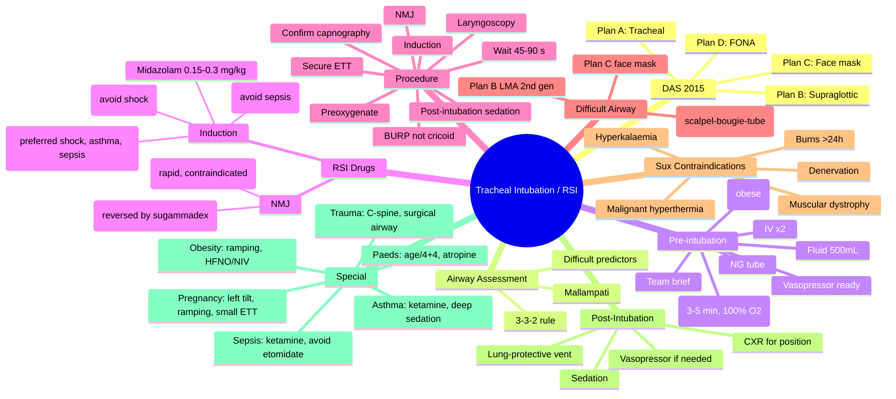
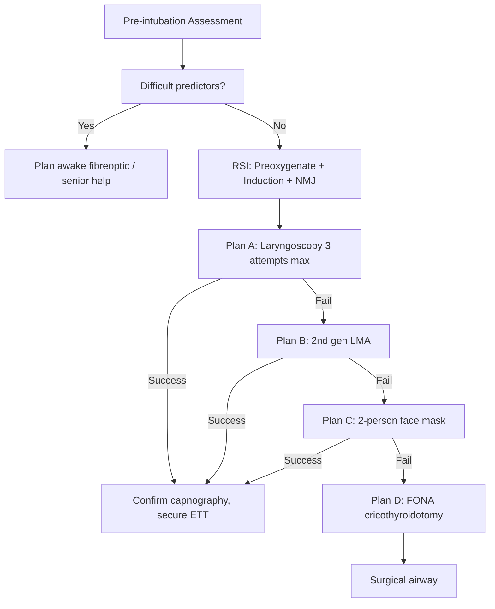
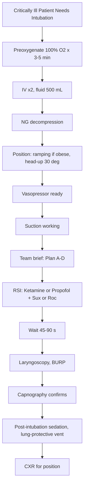

Related: [[Cardiac Arrest & Post-Resuscitation Care]], [[Sedation, Analgesia and Neuromuscular Blockade in ICU]]

> [!important]
> **Critically ill intubation = high-risk procedure** (10-20% complications: hypotension, hypoxia, aspiration, cardiac arrest). **DAS 2015 airway assessment** + **plan A, B, C, D** (surgical airway). **RSI = Rapid Sequence Induction**: preoxygenate (100% O₂ 3-5 min) + induction agent + **suxamethonium 1-1.5 mg/kg** (or **rocuronium 1.2 mg/kg**) + intubation. **Pre-intubation optimisation** ("crash induction"): 500 mL fluid, pre-load, vasopressor ready, **NG tube if gastric distension**, ramping (obese/pregnant), head-up. **Induction agents**: propofol (haemodynamic instability concerns), **ketamine 1-2 mg/kg** (preferred in shock, asthma, sepsis; preserves airway reflexes), etomidate (controversial in sepsis — adrenal suppression), midazolam. **Cricoid pressure** controversial; **BURP** (back-up-right-pressure) better. **Confirm with waveform capnography** + bilateral breath sounds + SpO₂. **Plan B**: 2nd generation LMA, fibreoptic. **Plan C**: face mask. **Plan D**: FONA (front-of-neck access, cricothyroidotomy). FCPS/MRCP: DAS algorithms, RSI drugs, cricoid vs BURP, difficult airway predictors, post-intubation management.

## 1. Learning Objectives
- Apply DAS 2015 airway assessment
- Conduct pre-intubation optimisation
- Perform RSI with appropriate drug doses
- Manage difficult airway (Plan A-D)
- Recognise and manage post-intubation complications
- Document airway assessment
- Plan extubation strategy

## 2. Why Critically Ill Intubation Is High Risk
- **Cardiovascular collapse** (30-40% hypotension post-RSI): ↓sympathetic tone + ↓venous return + positive pressure ventilation
- **Hypoxaemia** (10-30%): ↑shunt physiology, ↓FRC, aspiration
- **Aspiration risk** (full stomach, ileus, gastric distension)
- **Difficult airway** (3-5%): anatomical, physiological
- **Cardiac arrest** in 1-3% (especially shock)
- **Physiological reserve** exhausted

## 3. Pre-Intubation Checklist (Crash Induction)

### Preparation (5-7 minutes)
- **Drugs drawn up** + checked
- **Equipment**: bag-mask, suction, ETT (7.0-8.0), laryngoscope (Mac + Miller), bougie, supraglottic (LMA/i-gel), 2nd gen LMA
- **Monitoring**: SpO₂, ECG, BP (cycling), capnography
- **IV access** × 2
- **Suction working** (large-bore Yankauer)
- **Plan A-D verbalised**
- **Team briefed**
- **Pre-oxygenation** (3-5 min, 100% O₂ via non-rebreather or NIV/HFNO)

### Patient Optimisation
- **IV fluid**: 500 mL crystalloid bolus (if no overload risk)
- **Vasopressor ready** (noradrenaline)
- **NG tube** to decompress stomach
- **Positioning**: Ramping (obese, pregnant), head-up 30°
- **Cardiac arrest rescue** (CPR plan, difficult airway trolley)
- **NG decompression**
- **C-spine precautions** if trauma
- **Glycaemic control**
- **Anticipate hypotension** → give vasopressor early

## 4. DAS 2015 Airway Assessment

### Look-Evaluate-Add-Optimise-Plan-Verify (LEAP-FV)
- **L**: Look (facial features, scars)
- **E**: Evaluate (3-3-2 rule)
- **A**: Add (fentanyl "bulldozer")
- **O**: Optimise (positioning, ramping)
- **P**: Plan (verbalise Plan A, B, C, D)
- **V**: Verify (supraglottic rescue)

### 3-3-2 Rule
- **3** fingers mouth opening (>3 cm)
- **3** fingers hyoid-mental distance (>3 fingers)
- **2** fingers thyroid-hyoid distance (>2 fingers)

### Predictors of Difficult Intubation
| Category | Features |
|----------|----------|
| **Anatomical** | Short neck, thick neck, obesity, micrognathia, retrognathia, limited mouth opening, large tongue, prominent teeth, narrow palate |
| **Pathological** | Tumour, abscess, trauma, oedema, radiation, previous surgery |
| **Physiological** | Hypoxia, shock, agitation |
| **Infective** | Epiglottitis, Ludwig's angina, retropharyngeal abscess |
| **Dynamic** | Bleeding, vomiting |
| **DAS 2015** (specific) | Restricted neck mobility + reduced mouth opening + jaw protrusion + Mallampati 3-4 + prominent incisors + beard + OSA |

### Mallampati Score
- **I**: Tonsils, uvula, soft palate visible
- **II**: Soft palate, partial uvula
- **III**: Soft palate only
- **IV**: Hard palate only
- **III-IV** = difficult intubation

## 5. Preoxygenation

### Methods
- **100% O₂ via non-rebreather mask** × 3-5 min
- **NIV (CPAP/BiPAP)** for shunted lungs (ARDS, pulmonary oedema)
- **HFNO (high-flow nasal oxygen)** during apnoeic period
- **Bag-mask with 100% O₂** (less effective)

### Goals
- **O₂ reserve**: SpO₂ >95% (or as high as achievable)
- **Time to desaturation**: 8-10 min in healthy; **30-60 s in critically ill**
- **End-tidal O₂** >85%

## 6. RSI Drugs (Doses)

### Induction Agents

| Drug | Dose | Notes |
|------|------|-------|
| **Ketamine** | 1-2 mg/kg IV | **Preferred in shock, sepsis, asthma**; preserves airway reflexes, bronchodilator |
| **Propofol** | 0.5-1.5 mg/kg IV | Reduce dose in shock; hypotension risk |
| **Etomidate** | 0.3 mg/kg IV | Stable haemodynamics but **adrenal suppression** (avoid in sepsis) |
| **Midazolam** | 0.15-0.3 mg/kg IV | Slower onset, more hypotension, amnestic |
| **Thiopentone** | 3-5 mg/kg IV | Historical; hypotension |

### NMJ Blockers

| Drug | Dose | Onset | Notes |
|------|------|-------|-------|
| **Suxamethonium** | 1-1.5 mg/kg IV | 30-60 s | **Depolarising**; contraindicated in burns (>24 h), denervation, hyperK, MH, muscular dystrophy; fasciculations; ↑ICP/↑IOP |
| **Rocuronium** | 1.2 mg/kg IV | 45-60 s | **Non-depolarising**; rapid; **reversible with sugammadex 16 mg/kg** |
| **Vecuronium** | 0.1 mg/kg IV | Slower | Less used |

### Adjuncts
- **Fentanyl** 1-3 mcg/kg IV (blunt laryngoscopy response, ↓ICP); titrate to haemodynamics
- **Atropine** 0.5-1 mg IV (bradycardia, succinylcholine, paediatric)
- **Lidocaine** 1-1.5 mg/kg IV (↓ICP, ↓IOP, ↓airway response)

## 7. RSI Procedure (Step by Step)

### Pre-Phase (5-7 min)
1. **Pre-oxygenate** 100% O₂ × 3-5 min
2. **IV access** × 2
3. **IV fluid bolus** 500 mL
4. **NG tube** decompression
5. **Position**: ramping (obese), head-up 30°
6. **Suction working**
7. **Brief team** (Plan A-D)
8. **Pre-load drugs**: fentanyl, atropine, lidocaine as needed

### Induction Phase
1. **Pre-oxygenate** final 1-2 min
2. **Induction agent** IV push
3. **NMJ blocker** IV push (immediately after)
4. **Cricoid pressure** (10 N, applied on induction) — **controversial** (DAS 2015: not routine)
5. **Wait 45-60 s** (suxamethonium) or 60-90 s (rocuronium)
6. **Verify paralysis** (TOF = 0)

### Laryngoscopy Phase
1. **Position** (sniffing position)
2. **Laryngoscope** (Mac 4 blade standard)
3. **Bougie** if needed
4. **BURP** (back-up-right-pressure) instead of cricoid
5. **Confirm ETT position**:
   - **Waveform capnography** (mandatory)
   - **Bilateral breath sounds**
   - **SpO₂**
   - **Depth at teeth** (22 cm male, 20 cm female)
6. **Cuff** inflated, ETT secured
7. **Cricoid pressure release**

### Post-Intubation
1. **Continue sedation** + analgesia
2. **Lung-protective ventilation** (6 mL/kg PBW, PEEP, plateau <30)
3. **Vasopressor** if MAP <65
4. **CXR** to confirm ETT position
5. **NG tube** to suction
6. **Documentation** (grade, ETT size, depth, drugs)

## 8. DAS 2015 Plan A-D

### Plan A: Tracheal Intubation
- Laryngoscopy (Mac 4 first; video laryngoscope available)
- **Bougie** if needed
- **Max 3 attempts** (1 operator, 2 operators)
- **Declare failure** if: failed within 3 attempts

### Plan B: Supraglottic Airway
- **2nd generation LMA** (i-gel, ProSeal, LMA Supreme)
- **Max 3 attempts**
- **Don't push** if supraglottic not working → Plan C

### Plan C: Face Mask Ventilation
- **2-person technique**
- **OPA/NPA**
- **Plan for awakening** if face mask works
- **Max 2 attempts** if no awakening

### Plan D: Front-of-Neck Access (FONA)
- **Cricothyroidotomy** (scalpel-bougie-tube technique)
- **No time** for delay
- **15 mm ETT 6.0-7.0** or tracheostomy tube
- **Surgical FONA > needle** in adults

## 9. Cricoid Pressure
- **Traditional**: Sellick manoeuvre (10-20 N on cricoid)
- **Aim**: occlude upper oesophagus, prevent aspiration
- **DAS 2015**: not routine, may impede ventilation/laryngoscopy
- **Use** only if: cricoid (not thyroid) cartilage, relaxed patient
- **Burp** if: distorted view, can't intubate

## 10. Failed Intubation Drill
1. **Call for help**
2. **Declare failure** (3 attempts, 3 minutes)
3. **Bag-mask ventilation** (2-person, OPA/NPA)
4. **Plan B**: LMA
5. **If Plan B fails** → **Plan C** (face mask) or **Plan D** (FONA)
6. **Consider awakening** (reverse NMJ if able)

## 11. Post-Intubation Complications

| Complication | Management |
|--------------|------------|
| **Hypotension** (30-50%) | IV fluid + vasopressor (noradrenaline) |
| **Hypoxia** | Pre-oxygenate, reposition, exclude oesophageal intubation |
| **Oesophageal intubation** | Capnography, remove, re-intubate |
| **Aspiration** | Suction, antibiotics if needed |
| **Arrhythmia** | Treat cause (hypoxia, hyperK) |
| **Cardiac arrest** | CPR per ALS |
| **Right mainstem intubation** | Pull back, auscultate |
| **Pneumothorax** | Chest drain |
| **Dental trauma** | Manage, document |
| **Sore throat** | Supportive |
| **Hoarseness/vocal cord paralysis** | ENT referral |
| **Laryngeal oedema** | Steroids, extubation care |
| **Tracheal stenosis** (late) | ENT, surgical |

## 12. Awake Fibreoptic Intubation
- **Indication**: known difficult airway, unstable C-spine, oral/pharyngeal cancer
- **Technique**: topical anaesthesia (lignocaine 4%) + sedation (remifentanil/midazolam)
- **Equipment**: fibrescope, oral/nasal approach
- **Reserve** for elective or semi-elective intubation

## 13. Extubation
- **Plan** from start (DAS 2015: extubation strategy)
- **Cuff leak test** (see [[Weaning from Mechanical Ventilation]])
- **Postextubation stridor**: racemic adrenaline, dexamethasone, Heliox
- **Advanced techniques**: extubation to supraglottic (Bailey manoeuvre), staged extubation set
- **Re-intubation** if necessary

## 14. Difficult Airway Society (DAS) Documentation
- **Airway assessment** recorded
- **Plan A-D** documented
- **Failed attempts**: number, technique
- **Final outcome** (intubated, FONA, awakened)
- **Follow-up**: ICU, surgical airway
- **ICU review** by airway-trained specialist

## 15. Special Situations

### Cardiac Arrest
- **No RSI needed** — proceed with intubation if skilled
- **Waveform capnography** mandatory
- **Drugs**: minimal sedation needed

### Trauma
- **C-spine immobilisation**
- **Aspiration risk** (full stomach, blood)
- **Awake fibreoptic** if known difficult
- **Surgical airway** if orofacial trauma + can't intubate

### Pregnancy
- **Reduced FRC** (desaturates fast)
- **Aspiration risk** (full stomach, ↑progesterone)
- **Left lateral tilt** >20 weeks
- **Smaller ETT** (6.5-7.0)
- **Pre-oxygenate** thoroughly
- **Difficult airway** (oedema, weight gain)
- **Ramping** mandatory

### Sepsis
- **Ketamine** preferred (preserves haemodynamics)
- **Avoid etomidate** (adrenal suppression)
- **Aggressive fluid + vasopressor**
- **Lactate, MAP target**

### Asthma
- **Ketamine** preferred (bronchodilator)
- **RSI**, not elective fibreoptic
- **Ventilation** strategy: low RR, low Vt, long expiratory time
- **Permissive hypercapnia** OK
- **Avoid** tube irritation (deep sedation + NMB)

### Morbid Obesity
- **Ramping** (ear-to-sternal-notch)
- **HFNO + NIV** for preoxygenation
- **Difficult airway** (BMI >40)
- **Postural** (reverse Trendelenburg, head up)
- **Smaller ETT** (airway oedema)
- **Difficult ventilation** (obstructive, ↓FRC)

## 16. Paediatric Considerations
- **Narrowest part**: cricoid (not vocal cords)
- **Uncuffed** below 8 years
- **Age/4 + 4** formula (e.g., 1 y → 1+4 = 4.0, 4 y → 4+4 = 4.0, etc.)
- **Atropine** 0.5-1 mg (bradycardia)
- **Suxamethonium** OK (no contraindications usually)
- **Difficult airway** rare (mostly congenital syndromes)
- **Family** presence for non-emergent

## 17. FCPS/MRCP High-Yield Points
1. **Critically ill intubation = high risk** (10-20% complications)
2. **DAS 2015 algorithm**: Plan A-D (Intubation, Supraglottic, Face mask, FONA)
3. **3-3-2 rule** for airway assessment
4. **Mallampati III-IV** = difficult intubation
5. **RSI**: preoxygenate + induction + NMJ blocker
6. **Suxamethonium 1-1.5 mg/kg** (contraindications: burns >24 h, denervation, hyperK, MH)
7. **Rocuronium 1.2 mg/kg** (reversible with sugammadex 16 mg/kg)
8. **Ketamine 1-2 mg/kg** preferred in shock, sepsis, asthma
9. **Etomidate** avoids in sepsis (adrenal suppression)
10. **Cricoid pressure** controversial (not routine per DAS 2015)
11. **BURP** better for laryngoscopy
12. **Waveform capnography** mandatory for confirmation
13. **Pre-intubation optimisation**: 500 mL fluid, NG decompression, ramping, vasopressor ready
14. **Pregnancy**: left lateral tilt + ramping + smaller ETT
15. **Plan D = cricothyroidotomy (scalpel-bougie-tube)**

## 18. Common Viva Questions
1. DAS 2015 Plan A-D
2. RSI procedure step by step
3. Difficult airway predictors
4. Induction agent choice in shock
5. Suxamethonium contraindications
6. Cricoid pressure controversy
7. Pre-intubation optimisation
8. FONA technique
9. Post-intubation complications
10. Pregnancy intubation

## 19. Common Confusions / Exam Traps
- **Capnography** mandatory (not auscultation alone)
- **Waveform capnography** = oesophageal vs tracheal
- **Suxamethonium** contraindicated in burns (>24 h), denervation, hyperK, MH
- **Etomidate** avoid in sepsis (single dose → adrenal suppression)
- **Ketamine** preferred in shock (preserves sympathetic tone)
- **Propofol** ↓BP (avoid in shock at full dose)
- **Cricoid pressure** may impair view — use BURP instead
- **Ramping** in obese (ear-to-sternal-notch)
- **Pregnancy**: left lateral tilt + small ETT + rapid desat
- **Failed intubation** = 3 attempts, declare early
- **Plan D** = scalpel-bougie-tube FONA (not needle)
- **Sugammadex 16 mg/kg** reverses rocuronium
- **Paediatric**: age/4 + 4 for ETT, atropine
- **Asthma**: ketamine (bronchodilator)

## 20. Mnemonics
- **3-3-2 rule**: **3 fingers** mouth, **3 fingers** hyoid-mental, **2 fingers** thyroid-hyoid
- **DAS Plan A-D**: **A** tracheal, **B** supraglottic, **C** face mask, **D** FONA
- **RSI**: **Preox** + **Induction** + **NMJ** + **Wait** + **Laryngoscopy** + **Confirm**
- **Suxamethonium dose**: **1-1.5 mg/kg**
- **Rocuronium dose**: **1.2 mg/kg**
- **Sugammadex**: **16 mg/kg** for rocuronium
- **Ketamine**: **1-2 mg/kg** (shock, asthma, sepsis)
- **Pre-intubation**: **500 mL fluid, NG, vasopressor, ramping**
- **Capnography** mandatory
- **BURP** not cricoid (routine)
- **C-spine**: no sniffing position
- **Pregnancy**: left lateral + ramping
- **FONA**: scalpel-bougie-tube

## 21. Mind Map

## 22. Flowchart — DAS 2015

## 23. Flowchart — Pre-Intubation Optimisation

## 24. One-Page Revision Summary
- **Critically ill intubation = high risk** (10-20% complications)
- **DAS 2015**: Plan A (intubation), Plan B (LMA), Plan C (face mask), Plan D (FONA)
- **3-3-2 rule** for airway assessment; **Mallampati III-IV** difficult
- **Pre-intubation**: preoxygenate 100% O₂ 3-5 min, IV x2, fluid 500 mL, NG, vasopressor, ramping, team brief
- **RSI**: preoxygenate + induction + NMJ blocker
- **Ketamine 1-2 mg/kg** (preferred in shock, sepsis, asthma)
- **Propofol** (avoid in shock at full dose)
- **Etomidate** avoid in sepsis (adrenal suppression)
- **Suxamethonium 1-1.5 mg/kg** (burns >24 h, denervation, hyperK, MH = NO)
- **Rocuronium 1.2 mg/kg** (reversible with sugammadex 16 mg/kg)
- **Cricoid pressure** controversial (not routine per DAS 2015); **BURP** better
- **Waveform capnography** mandatory for confirmation
- **FONA** = scalpel-bougie-tube cricothyroidotomy
- **Pregnancy**: left lateral tilt + ramping + small ETT
- **Asthma/sepsis**: ketamine preferred

## 24-Hour Recall Prompts
- List DAS 2015 Plan A-D
- State RSI drug doses (ketamine, propofol, suxamethonium, rocuronium)
- List suxamethonium contraindications
- Outline pre-intubation optimisation
- Describe FONA technique
- State pregnancy intubation considerations

## 7-Day / 15-Day / 30-Day Revision Tracker
- [ ] Day 1 completed
- [ ] 24-hour recall completed
- [ ] Day 7 revision completed
- [ ] Day 15 revision completed
- [ ] Day 30 revision completed

## 25. Must Know / Should Know / Nice to Know
### Must Know
- DAS 2015 Plan A-D
- 3-3-2 rule
- Mallampati
- RSI procedure
- Ketamine 1-2 mg/kg in shock
- Suxamethonium 1-1.5 mg/kg
- Rocuronium 1.2 mg/kg
- Suxamethonium contraindications
- Capnography mandatory
- FONA scalpel-bougie-tube
- Pre-intubation optimisation

### Should Know
- Cricoid pressure controversy
- BURP
- Etomidate avoid in sepsis
- Sugammadex 16 mg/kg
- Pregnancy considerations
- Asthma/sepsis
- Morbid obesity ramping
- Paediatric intubation
- Awake fibreoptic
- Failed intubation drill
- Post-intubation complications

### Nice to Know
- DAS 2015 algorithm details
- Difficult airway predictors (obesity, beard, OSA)
- LEAP-FV (DAS 2015)
- Video laryngoscopy
- Cricothyroidotomy anatomy
- Bailey manoeuvre
- Extubation strategy
- Airway documentation

## 26. Self-Test Scorecard
- Understanding: /10
- Recall: /10
- MCQ Performance: /10
- SBA Performance: /10
- Viva Confidence: /10
- Total: /50

> [!tip]
> Interpretation: <35 = weak topic, 35-44 = acceptable but insecure, 45+ = strong exam-ready topic.

## 27. Exam Answer Modes
### Long Answer Skeleton
- Critically ill intubation risks
- DAS 2015 Plan A-D
- Airway assessment (3-3-2, Mallampati, predictors)
- Pre-intubation optimisation
- RSI procedure
- Drugs (induction + NMJ)
- Confirmation (capnography)
- Difficult airway management
- FONA technique
- Special situations (pregnancy, sepsis, asthma, obesity, trauma)
- Post-intubation management
- Documentation

### Short Note Skeleton
- DAS 2015 algorithm
- RSI drug doses
- Suxamethonium contraindications
- FONA technique
- Pre-intubation optimisation

### Viva One-Liners
- "DAS 2015: A intubation, B LMA, C face mask, D FONA"
- "3-3-2 rule: 3 fingers mouth, 3 fingers hyoid-mental, 2 fingers thyroid-hyoid"
- "RSI: preoxygenate + induction + NMJ"
- "Ketamine 1-2 mg/kg preferred in shock"
- "Suxamethonium 1-1.5 mg/kg; contraindicated in burns >24 h, hyperK, MH, denervation"
- "Rocuronium 1.2 mg/kg; sugammadex 16 mg/kg reversal"
- "Capnography mandatory for ETT confirmation"
- "BURP, not cricoid (controversial per DAS 2015)"
- "FONA: scalpel-bougie-tube cricothyroidotomy"
- "Pregnancy: left lateral + ramping + small ETT"

### Ward-Case Discussion Points
- 65-year-old septic shock, hypoxia, requires intubation → ketamine + rocuronium, fluid + noradrenaline
- 80-year-old predicted difficult, oropharyngeal cancer → awake fibreoptic, senior
- Failed intubation, 3 attempts, can't ventilate → LMA → face mask → FONA
- Morbid obese, ORIF femur, BMI 50 → ramping + HFNO + senior + awake fibreoptic
- Pregnancy 32 weeks, eclampsia, seizure → left lateral, small ETT, RSI
- Anaphylaxis airway oedema → early intubation; if fails, FONA

### Last-Night-Before-Exam Sheet
- DAS A-D: Intubation, LMA, Face mask, FONA
- 3-3-2 rule
- RSI: preox + induction + NMJ
- Ketamine 1-2 mg/kg (shock, sepsis, asthma)
- Sux 1-1.5 mg/kg (NO burns, hyperK, MH, denervation)
- Roc 1.2 mg/kg (sugammadex 16 mg/kg)
- Etomidate avoid in sepsis
- BURP not cricoid
- Capnography mandatory
- FONA: scalpel-bougie-tube
- Pregnancy: left tilt, ramping, small ETT
- Pre-intubation: 500 mL fluid, NG, vasopressor

## 28. Summary
**Critically ill intubation = high-risk procedure** (10-20% complications: hypotension 30-50%, hypoxia, aspiration, cardiac arrest 1-3%). **DAS 2015 algorithm**: **Plan A** tracheal intubation (3 attempts max), **Plan B** 2nd gen LMA (i-gel, ProSeal), **Plan C** 2-person face mask, **Plan D** FONA (front-of-neck access, scalpel-bougie-tube cricothyroidotomy). **Airway assessment**: **3-3-2 rule** (3 fingers mouth opening, 3 fingers hyoid-mental distance, 2 fingers thyroid-hyoid); **Mallampati III-IV** difficult; look for obesity, beard, OSA, neck mobility. **Pre-intubation optimisation** ("crash induction"): 100% O₂ × 3-5 min, IV × 2, 500 mL fluid, NG decompression, ramping (obese, pregnant), vasopressor ready, suction working, team brief (Plan A-D). **RSI drugs**: **Induction** — **ketamine 1-2 mg/kg** (preferred in shock, sepsis, asthma), propofol 0.5-1.5 mg/kg (avoid in shock at full dose), etomidate 0.3 mg/kg (avoid in sepsis — adrenal suppression); **NMJ** — **suxamethonium 1-1.5 mg/kg** (contraindicated in burns >24 h, denervation, hyperK, MH, muscular dystrophy) or **rocuronium 1.2 mg/kg** (reversible with **sugammadex 16 mg/kg**). **Cricoid pressure** controversial (not routine per DAS 2015); **BURP** (back-up-right-pressure) preferred. **Waveform capnography** mandatory for ETT confirmation (not auscultation alone). **Pregnancy**: left lateral tilt >20 weeks, ramping, smaller ETT (6.5-7.0), rapid desaturation. **Asthma**: ketamine (bronchodilator), deep sedation + NMB. **Sepsis**: ketamine, avoid etomidate, vasopressor ready. **Morbid obesity**: ramping, HFNO/NIV preoxygenation, smaller ETT. **Post-intubation**: lung-protective ventilation (6 mL/kg PBW, PEEP, plateau <30), sedation, vasopressor, CXR.

## 29. MCQs (10)
1. DAS 2015 Plan A is:
   A. Supraglottic
   B. **Tracheal intubation**
   C. Face mask
   D. FONA

2. RSI standard NMJ blocker:
   A. Rocuronium 0.6 mg/kg
   B. **Suxamethonium 1-1.5 mg/kg**
   C. Cisatracurium
   D. Pancuronium

3. Sugammadex reverses:
   A. Suxamethonium
   B. **Rocuronium**
   C. Cisatracurium
   D. Atracurium

4. Preferred induction agent in septic shock:
   A. Propofol
   B. Etomidate
   C. **Ketamine**
   D. Thiopentone

5. Etomidate is avoided in sepsis because of:
   A. Hypertension
   B. **Adrenal suppression**
   C. Bronchospasm
   D. HyperK

6. Suxamethonium contraindication:
   A. Pregnancy
   B. **Burns >24 h, hyperK, MH, denervation**
   C. Diabetes
   D. Hypertension

7. Capnography is mandatory to confirm:
   A. Anaesthesia depth
   B. **Tracheal intubation (vs oesophageal)**
   C. Block level
   D. O₂ saturation

8. BURP stands for:
   A. Bag-Up-Right-Pressure
   B. **Back-Up-Right-Pressure**
   C. Bilateral-Under-Right-Pressure
   D. Bougie-Use-Right-Position

9. 3-3-2 rule describes:
   A. **Airway assessment**
   B. Cricothyroidotomy
   C. Suxamethonium dose
   D. Paediatric intubation

10. FONA technique in DAS Plan D:
    A. Needle cricothyroidotomy
    B. **Scalpel-bougie-tube cricothyroidotomy**
    C. Tracheostomy
    D. LMA

## 30. SBA Questions (10)
1. 60-year-old septic shock, hypoxia, requires intubation. Best induction:
   A. Propofol 2 mg/kg
   B. Etomidate
   C. **Ketamine 1-2 mg/kg**
   D. Thiopentone

2. Obese patient (BMI 50) for emergency intubation. Best preoxygenation:
   A. 100% O₂ via mask
   B. **NIV/HFNO + ramping**
   C. Bag-mask
   D. Wait

3. Pregnant 32 weeks, eclampsia, seizure. Intubation considerations:
   A. Standard
   B. **Left lateral tilt + ramping + small ETT (6.5-7.0)**
   C. Avoid intubation
   D. Fibreoptic only

4. Failed intubation, 3 attempts, face mask not working. Next:
   A. Try again
   B. **Plan D: FONA (scalpel-bougie-tube)**
   C. Wait
   D. Wake up

5. 25-year-old asthma exacerbation, severe, requires intubation. Best induction:
   A. Propofol
   B. **Ketamine 1-2 mg/kg (bronchodilator)**
   C. Etomidate
   D. Thiopentone

6. Post-intubation hypotension 70/40, MAP 50. First:
   A. Trendelenburg
   B. **IV fluid + noradrenaline**
   C. Stop sedation
   D. Re-intubate

7. Burns patient >24 h, RSI. Best NMJ:
   A. **Suxamethonium is CONTRAINDICATED; use rocuronium**
   B. Suxamethonium
   C. Vecuronium
   D. Cisatracurium

8. C-spine injury + need for intubation. Best approach:
   A. Cricoid pressure
   B. **Awake fibreoptic OR video laryngoscope with manual in-line stabilisation**
   C. Sniffing position
   D. Face mask

9. Crashing airway, can't intubate, can't ventilate. Next:
   A. Wait
   B. **FONA (cricothyroidotomy)**
   C. LMA attempt
   D. Wake up

10. Paediatric intubation, 4-year-old, ETT size:
    A. 6.5
    B. **4.5 (4/4 + 4)**
    C. 7.0
    D. 5.5

## 31. Flashcards
- Q: DAS 2015 Plan A
  A: Tracheal intubation
- Q: DAS 2015 Plan D
  A: FONA (scalpel-bougie-tube)
- Q: Suxamethonium dose
  A: 1-1.5 mg/kg
- Q: Rocuronium dose
  A: 1.2 mg/kg
- Q: Sugammadex dose
  A: 16 mg/kg
- Q: Preferred induction in shock
  A: Ketamine
- Q: Etomidate avoid in
  A: Sepsis (adrenal suppression)
- Q: Sux contraindications
  A: Burns >24h, hyperK, MH, denervation, muscular dystrophy
- Q: BURP
  A: Back-Up-Right-Pressure
- Q: Capnography for
  A: ETT confirmation
- Q: 3-3-2 rule
  A: Airway assessment
- Q: Pregnancy intubation
  A: Left lateral + ramping + small ETT

## 32. Answer Key with Explanations
**MCQ 1**: B — Plan A is tracheal intubation.
**MCQ 2**: B — Suxamethonium 1-1.5 mg/kg is standard.
**MCQ 3**: B — Sugammadex reverses rocuronium.
**MCQ 4**: C — Ketamine in shock.
**MCQ 5**: B — Etomidate causes adrenal suppression.
**MCQ 6**: B — Sux contraindicated in burns >24h, hyperK, MH, denervation.
**MCQ 7**: B — Capnography confirms tracheal vs oesophageal.
**MCQ 8**: B — Back-Up-Right-Pressure.
**MCQ 9**: A — 3-3-2 is airway assessment.
**MCQ 10**: B — FONA = scalpel-bougie-tube.

**SBA 1**: C — Ketamine in shock.
**SBA 2**: B — NIV/HFNO + ramping for obese.
**SBA 3**: B — Left lateral + ramping + small ETT.
**SBA 4**: B — Plan D: FONA.
**SBA 5**: B — Ketamine in asthma (bronchodilator).
**SBA 6**: B — IV fluid + noradrenaline.
**SBA 7**: A — Sux contraindicated in burns; use rocuronium.
**SBA 8**: B — Awake fibreoptic or video laryngoscope.
**SBA 9**: B — FONA.
**SBA 10**: B — 4/4 + 4 = 4.5.

---

**Status**: Full FCPS/MRCP topic note completed — 2026-06-15