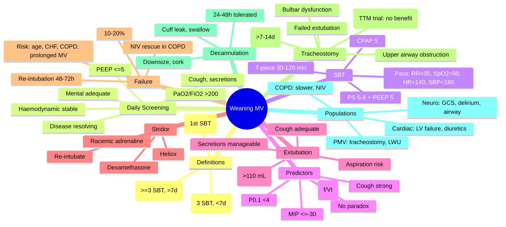
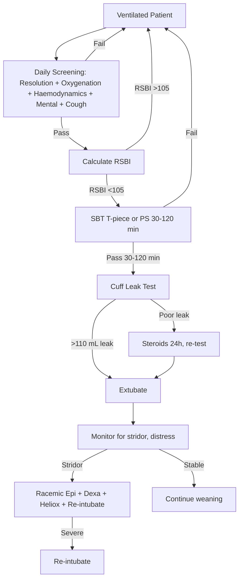
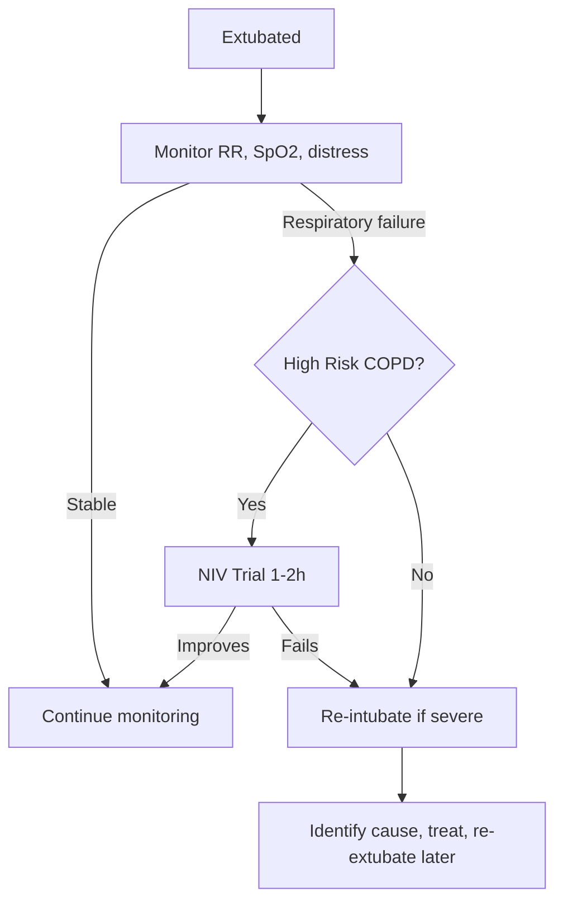

Related: [[Invasive Mechanical Ventilation - Basics]], [[Non-Invasive Ventilation (NIV)]], [[Sedation, Analgesia and Neuromuscular Blockade in ICU]]

> [!important]
> **Weaning = process of reducing ventilatory support → extubation** (or tracheostomy decannulation). **40-50% of ICU time** spent weaning. **Daily screening** for SBT (Spontaneous Breathing Trial) eligibility: **resolution of underlying disease + adequate oxygenation (PaO₂/FiO₂ >200, PEEP ≤5) + haemodynamic stability + spontaneous breathing effort**. **SBT: T-piece 30-120 min OR PS 5-8 cmH₂O + PEEP 5 cmH₂O for 30-120 min**. **Predictors of success**: **RSBI (Rapid Shallow Breathing Index) <105** (f/Vt). **Extubate** if SBT passed. **20-30% fail extubation**; risk factors: age, CHF, COPD, prolonged MV, delirium, **failed cuff leak test** (airway oedema). **NIV as rescue** post-extubation in high-risk COPD. **Tracheostomy** for prolonged MV (>7-14 days). FCPS/MRCP: SBT criteria, RSBI, cuff leak test, extubation failure, post-extubation stridor, NIV rescue, tracheostomy timing.

## 1. Learning Objectives
- Identify when patient is ready to wean
- Apply daily screening for SBT eligibility
- Conduct SBT (T-piece vs PS)
- Interpret RSBI
- Identify extubation failure and management
- Perform cuff leak test
- Manage post-extubation stridor
- Decide tracheostomy timing
- Apply NIV as rescue post-extubation

## 2. Definitions (Boles 2007)
- **Weaning**: process of reducing ventilator support → extubation
- **Simple weaning**: successful extubation after first SBT (~70%)
- **Difficult weaning**: failure of first SBT, success within 3 SBTs or ≤7 days (~20%)
- **Prolonged weaning**: failure of ≥3 SBTs OR >7 days weaning (~10%)

## 3. Pathophysiology of Weaning Failure
- **Respiratory**: increased work of breathing, muscle fatigue, gas exchange failure
- **Cardiac**: weaning-induced cardiac dysfunction (↑venous return, LV failure)
- **Neuro**: depressed drive, delirium, anxiety
- **Airway**: oedema, secretions, obstruction
- **Metabolic**: electrolyte abnormalities, malnutrition
- **Infective**: VAP, sepsis

## 4. Daily Screening for SBT Eligibility

### Pre-Weaning Criteria
1. **Underlying cause** of respiratory failure resolving/improved
2. **Adequate oxygenation**: PaO₂/FiO₂ >200, PEEP ≤5 cmH₂O, FiO₂ ≤0.4-0.5
3. **Haemodynamic stability**: no/minimal vasopressors, MAP ≥65
4. **Spontaneous breathing effort** present
5. **Mental status**: arousable, GCS ≥8, able to follow commands
6. **No acidaemia**: pH ≥7.30
7. **Adequate cough**, manageable secretions
8. **Afebrile** or improving infection

### SBT Contraindications (Hold)
- Active cardiac ischaemia, arrhythmia
- Severe agitation, distress
- Active seizures
- Increased ICP
- Active withdrawal
- Aggressive suctioning needs
- Recent major surgery (≤24 h)

## 5. Conducting SBT

### Method
| Mode | Settings | Duration |
|------|----------|----------|
| **T-piece** | T-piece with O₂ (no PS/PEEP) | 30-120 min |
| **PS + PEEP** | PS 5-8 cmH₂O + PEEP 5 cmH₂O | 30-120 min |
| **CPAP** | CPAP 5 cmH₂O | 30-120 min |
| **ATC (Automatic Tube Compensation)** | Compensation for ETT resistance | 30-120 min |

### Pass Criteria
- **RR** ≤30-35/min
- **SpO₂** ≥90% (FiO₂ ≤0.4)
- **HR** <120-140, no new arrhythmia
- **SBP** 90-180 mmHg
- **No distress** (no use of accessory muscles, paradoxical breathing, diaphoresis)
- **No change in mental status**
- **Stable pH** ≥7.30

### Fail Criteria
- RR >35 for >5 min
- SpO₂ <90% on FiO₂ >0.4
- HR >140 or <50, new arrhythmia
- SBP >180 or <90
- Agitation, panic, diaphoresis
- Increased work of breathing
- pH <7.30 or PaCO₂ rise >10 mmHg

## 6. Predictors of Successful Weaning

### RSBI (Rapid Shallow Breathing Index)
- **Formula**: f/Vt (RR / Tidal Volume in L)
- **Threshold**: **RSBI <105** predicts successful extubation
- **Measure**: 1 min of spontaneous breathing on T-piece or PS 0/PEEP 0
- **Sensitivity** ~80%, **Specificity** ~60%
- **High negative predictive value**

### Other Predictors
| Test | Threshold | Notes |
|------|-----------|-------|
| **RSBI** | <105 | Most useful single test |
| **MIP (Max Inspiratory Pressure)** | ≤-30 cmH₂O | Respiratory muscle strength |
| **C20/Cdyn ratio** | C20/Cdyn >0.8 | Detect flow limitation |
| **P0.1** (airway occlusion pressure) | <4-6 cmH₂O | Drive; high = fatiguing |
| **Abdominal paradox** | Absent | Good |
| **Cough strength** | Strong | Predicts extubation success |

## 7. Extubation

### Pre-Extubation Checklist
- SBT passed
- **Cough strength** adequate
- **Secretions** manageable
- **Cuff leak test** (if high risk of laryngeal oedema)
- **Mental status** adequate (GCS ≥8)
- **Aspiration risk** assessed
- **No airway obstruction** concern

### Cuff Leak Test
- **Why**: detect laryngeal oedema → post-extubation stridor
- **How**: deflate cuff, measure leak volume (difference between inspired and expired tidal volume)
- **Positive leak** (adequate): leak volume >110-130 mL or >10-15% of Vt
- **Negative leak** (poor): high risk of post-extubation stridor
- **High risk**: prolonged intubation, traumatic intubation, large ETT, female gender, asthma
- **If negative**: consider steroids (e.g., methylprednisolone 20-40 mg q4-6h × 24 h pre-extubation)

### Extubation Steps
1. Pre-oxygenate
2. Suction oropharyngeal and tracheal
3. Deflate cuff
4. Remove ETT at end-inspiration (cough)
5. Supplemental O₂ (mask, NC)
6. Monitor (RR, SpO₂, stridor, distress)
7. If stridor: **stridor → racemic adrenaline, helium-O₂, re-intubate**

## 8. Post-Extubation Management

### Monitoring
- RR, SpO₂, work of breathing q1h initially
- ABG at 1-2 h post-extubation
- Watch for **stridor, distress, aspiration**

### Post-Extubation Stridor
- **Cause**: laryngeal oedema, laryngospasm, secretions
- **Risk factors**: prolonged MV (>7 days), traumatic intubation, large ETT, female, asthma
- **Management**:
  - Mild: cool mist, reassurance
  - Moderate: **nebulised racemic adrenaline** (0.5-1 mL of 2.25% in 3 mL saline) + **dexamethasone 8 mg IV**
  - Severe: **Heliox (helium-oxygen 70:30 or 80:20)**, prepare re-intubation
- **Re-intubate** if SpO₂ <90%, exhaustion, severe distress

### Extubation Failure
- **Definition**: need for re-intubation within **48-72 h** post-extubation
- **Rate**: 10-20% overall
- **Risk factors**: age >65, CHF, COPD, prolonged MV, APACHE II, weak cough, abundant secretions, delirium, positive fluid balance
- **Causes**: upper airway oedema, residual sedation, respiratory muscle weakness, cardiac failure, aspiration, VAP
- **Management**:
  - Treat cause (steroids for oedema, diuretics for cardiac, antibiotics for VAP)
  - **NIV rescue** (in COPD especially)
  - **Re-intubate** if failure

### NIV as Rescue Post-Extubation
- **Indication**: **high-risk COPD patients** developing post-extubation respiratory failure
- **Evidence**: Esteban 2004 — NIV delays but doesn't reduce mortality in mixed; Ferrer 2009 — early NIV in high-risk reduces re-intubation
- **Apply early** in at-risk patients (prophylactic)
- **Avoid** in: post-extubation in non-COPD (worse outcomes)
- **Be ready to intubate** if fails

## 9. Tracheostomy

### Indications
- **Prolonged MV** (>7-14 days expected)
- **Failed extubation** (multiple)
- **Severe upper airway obstruction** (tumour, bilateral vocal cord palsy)
- **Airway protection** (severe bulbar dysfunction, neuromuscular disease)
- **Secretion management** (ineffective cough)
- **Failed SBT** due to airway/secretion issues

### Timing
- **Early (≤7 days)**: no clear mortality benefit; may reduce sedation, ICU LOS
- **Late (≥10-14 days)**: standard for most
- **TTM trial**: early tracheostomy did not improve 30-day mortality
- **Decision**: individualise; consider patient trajectory

### Types
- **Percutaneous** (Ciaglia, Griggs): bedside, ICU; less infection
- **Surgical**: theatre, severe cervical spine injury, obesity, anatomical difficulties

### Decannulation
- Patient passing SBT + cuff leak + swallowing assessment
- **Downsize** to smaller tube, then **cork** for 24-48 h
- **If tolerated** → decannulate
- **Monitor** for stridor, distress

## 10. Weaning Strategies

### Pressure Support Weaning
- **Gradual reduction** in PS (e.g., 2-4 cmH₂O/day)
- Most common, smooth, easy

### T-piece Weaning
- **Incremental** (e.g., 5 min/h → 30 min/h → 2 h → 4 h → 24 h)
- Or **once daily** T-piece trial
- Esteban 1995: once daily SBT equivalent to multiple

### Protocolised Weaning
- **Nurse/therapist-driven** protocols reduce duration vs physician-driven
- **Standardised** daily screening, SBT, extubation criteria

## 11. Specific Populations

### COPD Weaning
- **Slower** weaning (respiratory muscle fatigue risk)
- **NIV** as rescue (BTS evidence-based)
- **Watch** for weaning-induced cardiac dysfunction
- **BiPAP** 5-15 cmH₂O + 5 cmH₂O EPAP for 1-2 h initially, then longer

### Cardiac Weaning
- **Weaning-induced cardiac dysfunction**: ↑venous return + ↓afterload reversal → LV failure
- **Risk**: pre-existing LV dysfunction
- **Manage**: diuretics, vasodilators, slower weaning
- **Trial**: extubate with BiPAP support

### Neuro-Weaning
- **GCS** must be adequate (≥8)
- **Delirium** screen (CAM-ICU)
- **Airway protection** in bulbar dysfunction
- **Tracheostomy** common in stroke, TBI, neuromuscular disease

### Prolonged MV (PMV)
- **Definition**: MV ≥21 days (or ≥14 days in some definitions)
- **Tracheostomy** usual
- **Long-term weaning** units (LWU)
- **Slow** weaning, individualised
- **Psychological** support (anxiety, depression common)

## 12. Complications of Prolonged MV/Weaning
- **VAP** (ventilator-associated pneumonia)
- **VILI** (ventilator-induced lung injury)
- **Diaphragm atrophy/disuse myotrauma**
- **ICU-acquired weakness** (CIP, CIM)
- **Delirium**, PTSD, depression
- **Tracheostomy complications**: bleeding, displacement, stenosis, fistula

## 13. Prognosis
- **Simple weaning**: 60-70% success
- **Difficult weaning**: 20% success
- **Prolonged weaning**: 10% success
- **Extubation failure**: ↑mortality (especially if re-intubated)
- **NIV rescue** reduces re-intubation in COPD

## 14. FCPS/MRCP High-Yield Points
1. **Daily screening for SBT** (resolution of disease + PaO₂/FiO₂ >200 + PEEP ≤5 + haemodynamic stability)
2. **SBT**: T-piece 30-120 min OR PS 5-8 + PEEP 5 × 30-120 min
3. **RSBI <105** = best single predictor of extubation success
4. **Simple vs difficult vs prolonged weaning** (Boles classification)
5. **Cuff leak test**: leak volume >110-130 mL → safe to extubate
6. **Negative cuff leak** → steroids pre-extubation
7. **Post-extubation stridor**: racemic adrenaline, dexamethasone, Heliox, re-intubate
8. **Extubation failure**: re-intubation within 48-72 h
9. **NIV rescue** in high-risk COPD (not non-COPD)
10. **Tracheostomy**: prolonged MV (>7-14 days)
11. **Early tracheostomy**: no mortality benefit (TTM trial)
12. **Once-daily SBT** equivalent to multiple (Esteban)
13. **Protocolised weaning** reduces duration
14. **Weaning-induced cardiac dysfunction**: LV failure, manage with diuretics
15. **MIP ≤-30 cmH₂O** = adequate respiratory muscle strength

## 15. Common Viva Questions
1. SBT criteria and conduct
2. RSBI calculation and interpretation
3. Cuff leak test
4. Extubation failure causes
5. Post-extubation stridor management
6. NIV rescue post-extubation
7. Tracheostomy indications and timing
8. Weaning-induced cardiac dysfunction
9. Difficult vs prolonged weaning
10. TTM trial (early tracheostomy)

## 16. Common Confusions / Exam Traps
- **RSBI <105 predicts success** (not 100%)
- **SBT duration 30-120 min** (not 5 min)
- **Cuff leak negative** = high-risk oedema
- **NIV rescue** in **COPD only** (worse in non-COPD)
- **Re-intubate** if SpO₂ <90%, exhaustion
- **Once-daily SBT** equivalent to multiple
- **Early tracheostomy** does NOT reduce mortality
- **Tracheostomy decannulation** requires cuff leak + swallow + SBT
- **Heliox** for severe stridor (not first-line in mild)
- **Steroids** before extubation if negative cuff leak
- **Weaning failure** ≠ extubation failure
- **Weaning-induced pulmonary oedema** in cardiac patients

## 17. Mnemonics
- **SBT pass**: **35, 90, 140, 180** (RR<35, SpO₂>90, HR<140, SBP<180)
- **RSBI <105** = success
- **Cuff leak >110 mL** = safe
- **Stridor Rx**: **Racemic Epi + Dexa + Heliox + Re-intubate**
- **NIV rescue** in **COPD**
- **Tracheostomy** = **prolonged MV**
- **Weaning 3 types**: **Simple, Difficult, Prolonged**
- **BTS/ICS**: **Once-daily SBT** equivalent
- **Daily screening**: **Resolution + Oxygenation + Haemodynamics + Mental + Cough**
- **Cuff leak** if prolonged MV, large ETT, female, asthma

## 18. Mind Map

## 19. Flowchart — Weaning

## 20. Flowchart — Post-Extubation

## 21. One-Page Revision Summary
- **Daily screening**: Disease resolving + PaO₂/FiO₂ >200 + PEEP ≤5 + haemodynamic + mental
- **SBT**: T-piece or PS 5-8/PEEP 5 × 30-120 min
- **RSBI <105** predicts success
- **Cuff leak test**: leak >110-130 mL = safe
- **Extubation failure**: re-intubation 48-72 h, 10-20%
- **Post-extubation stridor**: racemic adrenaline + dexamethasone + Heliox
- **NIV rescue** in **high-risk COPD** (not non-COPD)
- **Tracheostomy**: prolonged MV (>7-14 d)
- **Early tracheostomy**: no mortality benefit (TTM trial)
- **3 weaning types**: Simple / Difficult / Prolonged

## 24-Hour Recall Prompts
- List daily SBT screening criteria
- State RSBI threshold and calculation
- Outline cuff leak test
- Describe post-extubation stridor management
- List tracheostomy indications

## 7-Day / 15-Day / 30-Day Revision Tracker
- [ ] Day 1 completed
- [ ] 24-hour recall completed
- [ ] Day 7 revision completed
- [ ] Day 15 revision completed
- [ ] Day 30 revision completed

## 22. Must Know / Should Know / Nice to Know
### Must Know
- Daily SBT screening criteria
- SBT methods (T-piece, PS)
- RSBI <105
- Cuff leak test
- Extubation failure definition
- Post-extubation stridor management
- NIV rescue (COPD)
- Tracheostomy indications
- Weaning 3 types (Simple/Difficult/Prolonged)

### Should Know
- Cuff leak negative → steroids
- Cuff leak thresholds (>110-130 mL)
- Risk factors for extubation failure
- T-piece vs PS for SBT
- Once-daily SBT equivalent
- Early vs late tracheostomy
- Tracheostomy decannulation steps
- Weaning-induced cardiac dysfunction
- MIP ≤-30

### Nice to Know
- Boles 2007 classification
- Esteban 1995 once-daily SBT
- TTM trial
- C20/Cdyn ratio
- P0.1
- ATC mode
- Heliox
- BTS/ICS guidelines

## 23. Self-Test Scorecard
- Understanding: /10
- Recall: /10
- MCQ Performance: /10
- SBA Performance: /10
- Viva Confidence: /10
- Total: /50

> [!tip]
> Interpretation: <35 = weak topic, 35-44 = acceptable but insecure, 45+ = strong exam-ready topic.

## 24. Exam Answer Modes
### Long Answer Skeleton
- Definitions of weaning (Simple, Difficult, Prolonged)
- Pathophysiology of weaning failure
- Daily screening criteria for SBT
- SBT methods (T-piece vs PS)
- Pass/fail criteria
- Predictors of success (RSBI, MIP, P0.1, cough)
- Extubation checklist (cuff leak, secretions, mental)
- Cuff leak test (negative → steroids)
- Post-extubation stridor management
- Extubation failure (10-20%, risk factors, management)
- NIV rescue (COPD)
- Tracheostomy (indications, timing, decannulation)
- Specific populations (COPD, cardiac, neuro, PMV)

### Short Note Skeleton
- SBT screening criteria
- RSBI calculation
- Cuff leak test
- Stridor management
- Tracheostomy timing

### Viva One-Liners
- "RSBI <105 predicts extubation success"
- "Cuff leak >110-130 mL = safe to extubate"
- "SBT: T-piece or PS 5-8 + PEEP 5 × 30-120 min"
- "Extubation failure: re-intubation 48-72 h, 10-20%"
- "Post-extubation stridor: racemic epi + dexamethasone + Heliox"
- "NIV rescue in high-risk COPD (not non-COPD)"
- "Tracheostomy for prolonged MV (>7-14 d)"
- "Early tracheostomy: no mortality benefit (TTM)"
- "Once-daily SBT equivalent to multiple (Esteban)"
- "Daily screening: resolution + PaO₂/FiO₂ >200 + PEEP ≤5"

### Ward-Case Discussion Points
- 65-year-old ventilated for pneumonia, day 5, P/F 280, PEEP 5, RASS 0 → daily screening → SBT → extubate
- 70-year-old COPD, 10 days MV, RSBI 80, cuff leak 150 mL → extubate, NIV if needed
- 60-year-old traumatic intubation, 14 days MV, cuff leak 50 mL → methylprednisolone 24 h, re-test
- Prolonged MV, day 12 → consider tracheostomy
- Post-extubation stridor → racemic epi + dexa + Heliox, re-intubate if severe

### Last-Night-Before-Exam Sheet
- SBT: T-piece or PS/PEEP × 30-120 min
- RSBI <105 = success
- Cuff leak >110 mL = safe
- Stridor: racemic + dexa + Heliox
- NIV rescue: COPD
- Tracheostomy: >7-14 d
- Early trach: no benefit
- Simple/Difficult/Prolonged weaning
- Cuff leak negative → steroids

## 25. Summary
**Weaning = process of reducing ventilator support → extubation**. **3 types** (Boles 2007): **Simple** (success on first SBT, ~70%), **Difficult** (3 SBTs, ≤7 d, ~20%), **Prolonged** (≥3 SBTs, >7 d, ~10%). **Daily screening for SBT**: underlying disease resolving + PaO₂/FiO₂ >200 + PEEP ≤5 + haemodynamic stability (MAP ≥65, minimal vasopressors) + GCS ≥8 + adequate cough + manageable secretions. **SBT methods**: T-piece 30-120 min OR PS 5-8 + PEEP 5 cmH₂O 30-120 min OR CPAP 5 cmH₂O. **Pass**: RR <35, SpO₂ ≥90%, HR <140, SBP <180, no distress. **RSBI (Rapid Shallow Breathing Index) <105** = best single predictor of success (f/Vt). **MIP ≤-30 cmH₂O** = adequate muscle strength. **Extubation**: ensure cuff leak >110-130 mL (if negative → methylprednisolone 20-40 mg q4-6h × 24 h pre-extubation). **Post-extubation stridor**: racemic adrenaline + dexamethasone + Heliox + re-intubate if severe. **Extubation failure**: 10-20%, re-intubation within 48-72 h, risk factors (age, CHF, COPD, prolonged MV, weak cough, delirium). **NIV rescue** in high-risk COPD only (worse in non-COPD). **Tracheostomy**: prolonged MV (>7-14 d), failed extubation, severe upper airway obstruction, bulbar dysfunction. **Early tracheostomy (TTM)**: no mortality benefit. **Decannulation**: cuff leak + swallow assessment + SBT pass. **Specific populations**: COPD (slow, NIV), cardiac (weaning-induced LV failure, diuretics), neuro (GCS, delirium, airway protection), PMV (LWU).

## 26. MCQs (10)
1. RSBI <105 indicates:
   A. Failure
   B. **Likely successful extubation**
   C. Tracheostomy needed
   D. Prolonged MV

2. Cuff leak volume <110 mL suggests:
   A. Safe to extubate
   B. **High risk of post-extubation stridor**
   C. Re-intubate now
   D. No concern

3. SBT typically lasts:
   A. 5 min
   B. 15 min
   C. **30-120 min**
   D. 4-6 h

4. Extubation failure defined as re-intubation within:
   A. 6 h
   B. **48-72 h**
   C. 1 week
   D. 1 month

5. First-line post-extubation stridor management:
   A. Re-intubate
   B. **Nebulised racemic adrenaline + dexamethasone**
   C. Heliox only
   D. Heliox first

6. NIV rescue post-extubation is effective in:
   A. All patients
   B. **High-risk COPD**
   C. Heart failure
   D. Young patients

7. Tracheostomy indication:
   A. <24 h MV
   B. **Prolonged MV (>7-14 days)**
   C. Pneumonia
   D. Hyperkalaemia

8. Early tracheostomy (TTM trial):
   A. Reduced mortality
   B. **Did not reduce mortality**
   C. Reduced VAP
   D. Always indicated

9. Once-daily SBT is equivalent to:
   A. Continuous T-piece
   B. **Multiple SBTs (Esteban 1995)**
   C. Pressure support
   D. CPAP

10. Negative cuff leak pre-extubation management:
    A. Immediate extubation
    B. **Steroids 24 h pre-extubation, re-test**
    C. Re-intubate
    D. Tracheostomy

## 27. SBA Questions (10)
1. 65-year-old 5 days MV, PaO₂/FiO₂ 280, PEEP 5, RASS 0, RSBI 75. Next:
   A. Tracheostomy
   B. **SBT (T-piece or PS)**
   C. Continue MV
   D. NMJ blockade

2. 60-year-old, 14 days MV, RSBI 80, cuff leak 80 mL. Best action:
   A. Immediate extubation
   B. **Steroids × 24 h, re-test, then extubate**
   C. Tracheostomy
   D. Continue MV

3. Post-extubation, inspiratory stridor, SpO₂ 90%. First action:
   A. Re-intubate
   B. **Nebulised racemic adrenaline + dexamethasone**
   C. Heliox
   D. Tracheostomy

4. COPD patient, post-extubation, RR 30, SpO₂ 88%, distress. Next:
   A. Re-intubate
   B. **Trial of NIV (high-risk COPD)**
   C. Morphine
   D. Heliox

5. 12 days MV, failed 2 SBTs, RSBI 90. Plan:
   A. Extubate
   B. **Continue weaning, daily SBT; consider tracheostomy if >14-21 d**
   C. NMJ blockade
   D. Tracheostomy now

6. SBT fail criteria include all EXCEPT:
   A. RR >35
   B. SpO₂ <90%
   C. HR >140
   D. **RR <20**

7. Weaning classification (Boles 2007): simple weaning = success on:
   A. 2nd SBT
   B. **1st SBT**
   C. 3rd SBT
   D. >3 SBTs

8. Tracheostomy decannulation requires:
   A. Just SBT
   B. **Cuff leak + swallow assessment + SBT pass**
   C. Nothing
   D. Bronchoscopy

9. Weaning-induced cardiac dysfunction in cardiac patients managed by:
   A. Stop weaning
   B. **Diuretics, vasodilators, slower weaning**
   C. NMJ blockade
   D. β-blockers only

10. MIP ≤-30 cmH₂O indicates:
    A. Failure
    B. **Adequate respiratory muscle strength**
    C. Tracheostomy
    D. Severe weakness

## 28. Flashcards
- Q: RSBI threshold
  A: <105
- Q: Cuff leak volume
  A: >110-130 mL = safe
- Q: SBT duration
  A: 30-120 min
- Q: Extubation failure defined
  A: Re-intubation 48-72 h
- Q: Stridor Rx
  A: Racemic epi + dexa + Heliox
- Q: NIV rescue
  A: High-risk COPD
- Q: Tracheostomy indication
  A: Prolonged MV >7-14 d
- Q: Early tracheostomy
  A: No mortality benefit (TTM)
- Q: Weaning 3 types
  A: Simple / Difficult / Prolonged
- Q: Negative cuff leak
  A: Steroids 24 h
- Q: Once-daily SBT
  A: Equivalent to multiple (Esteban)

## 29. Answer Key with Explanations
**MCQ 1**: B — RSBI <105 predicts success.
**MCQ 2**: B — Negative cuff leak = high stridor risk.
**MCQ 3**: C — SBT 30-120 min.
**MCQ 4**: B — Extubation failure 48-72 h.
**MCQ 5**: B — Racemic adrenaline + dexamethasone.
**MCQ 6**: B — NIV rescue in COPD.
**MCQ 7**: B — Prolonged MV >7-14 d.
**MCQ 8**: B — Early trach: no benefit (TTM).
**MCQ 9**: B — Once-daily SBT = multiple.
**MCQ 10**: B — Negative cuff leak → steroids.

**SBA 1**: B — SBT.
**SBA 2**: B — Steroids first.
**SBA 3**: B — Racemic + dexa.
**SBA 4**: B — NIV trial in COPD.
**SBA 5**: B — Continue weaning; consider trach if prolonged.
**SBA 6**: D — RR <20 is normal.
**SBA 7**: B — Simple = 1st SBT.
**SBA 8**: B — Cuff leak + swallow + SBT.
**SBA 9**: B — Diuretics + vasodilators.
**SBA 10**: B — MIP ≤-30 = adequate.

---

**Status**: Full FCPS/MRCP topic note completed — 2026-06-15