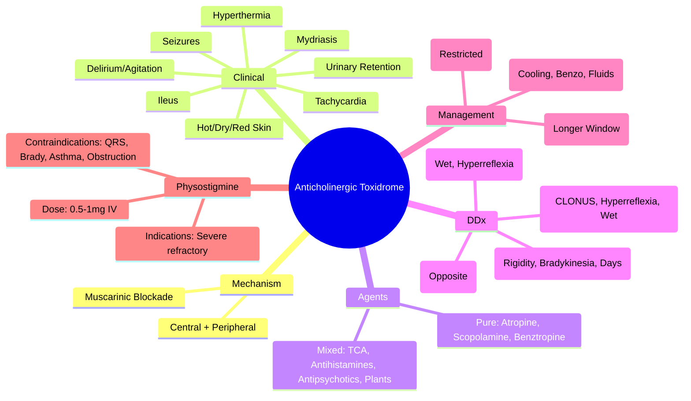
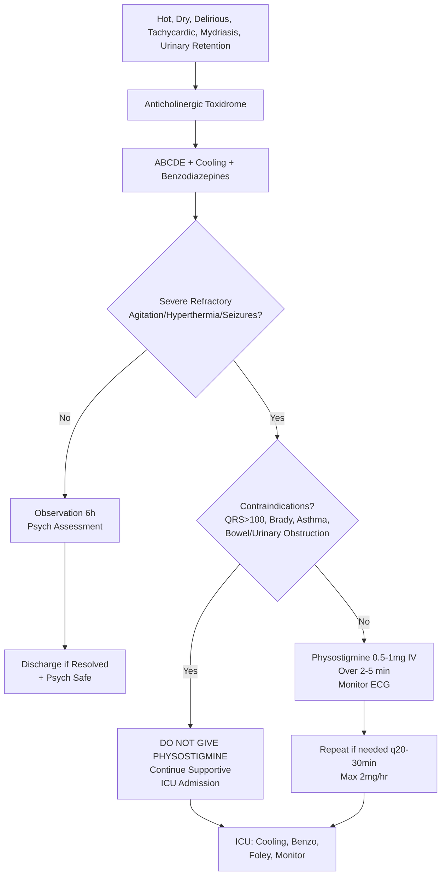

Related: [[General Principles of Poisoning Management]], [[Cholinergic Toxidrome (Organophosphate-Carbamate)]], [[Antidotes Overview]], [[Neuroleptic Malignant Syndrome]] (DDx hyperthermia), [[Serotonin Syndrome]] (DDx hyperthermia/agitation)

> [!tip]
> Think: "hot, dry, red, blind, mad, full" — blocked muscarinic receptors. Pure anticholinergic vs mixed (TCA, antihistamines). Physostigmine for severe ONLY, fatal if missed contraindications (QRS widening, asthma, bradycardia).

## 1. Learning Objectives
- Recognize classic anticholinergic toxidrome
- Differentiate pure anticholinergic from mixed (TCA, antihistamines)
- Identify indications for physostigmine and its CONTRAINDICATIONS
- Contrast with cholinergic, sympathomimetic, serotonin, NMS

## 2. Definition
Anticholinergic toxidrome = clinical syndrome from competitive blockade of muscarinic acetylcholine receptors (central and peripheral).

## 3. Core Physiology
- **Mechanism**: competitive antagonism at muscarinic receptors (M1-M5)
- **Central** (M1, M4): delirium, agitation, hallucinations, seizures, coma
- **Peripheral** (M2, M3): tachycardia, dry skin/mucous membranes, mydriasis, ileus, urinary retention, hyperthermia (impaired sweating)
- **Agents**: atropine, scopolamine, benztropine, biperiden, trihexyphenidyl; **Tricyclic antidepressants** (strong anticholinergic + Na channel blockade); **Antihistamines** (diphenhydramine, promethazine, hydroxyzine); **Antipsychotics** (clozapine, olanzapine, chlorpromazine); **Antispasmodics** (hyoscine, dicyclomine); **Plants** (Datura, Belladonna, Jimson weed); **Antiparkinson** (benztropine, trihexyphenidyl); **Myrianth** (OTC cold meds)

## 4. Clinical Features (The "Anticholinergic Mnemonic")

### Classic: "Red as a beet, Dry as a bone, Blind as a bat, Mad as a hatter, Hot as a hare, Full as a flask"
| Feature | Mechanism |
|---------|-----------|
| **Hyperthermia** | Impaired sweating (anhidrosis) + heat production from agitation |
| **Flushed, dry, hot skin** | Vasodilation + anhidrosis |
| **Mydriasis** (dilated pupils) | Loss of parasympathetic tone to iris sphincter |
| **Blurred vision / Photophobia** | Cycloplegia (loss of accommodation) |
| **Tachycardia** | M2 blockade in SA node (loss of vagal tone) |
| **Urinary retention** | Detrusor relaxation (M3) |
| **Ileus / Constipation** | Decreased GI motility (M3) |
| **Delirium / Agitation / Hallucinations** | Central M1/M4 blockade |
| **Seizures** | Severe central blockade (esp. diphenhydramine, TCA) |
| **Coma** | Severe |
| **Myoclonus / Choreoathetosis** | Central |

### Key Differentiators
| Feature | Pure Anticholinergic | TCA | Sympathomimetic | Serotonin | NMS |
|---------|---------------------|-----|-----------------|-----------|-----|
| **Skin** | Hot, dry, flushed | Hot, dry | Diaphoretic | Diaphoretic | Diaphoretic |
| **Pupils** | Dilated (mydriasis) | Dilated | Dilated | Normal/dilated | Normal |
| **Bowel sounds** | Absent | Absent | Normal/increased | Normal | Normal |
| **Reflexes** | Normal | Normal | Hyperreflexic | **Hyperreflexic + Clonus** | Normal/increased tone |
| **Muscle tone** | Normal | Normal | Normal | Normal | **Rigidity (lead-pipe)** |
| **QRS** | Normal | **WIDENED** | Normal | Normal | Normal |
| **Onset** | Rapid | Rapid | Rapid | Rapid (hrs) | Days |

## 5. Differential Diagnosis
- **Cholinergic**: opposite (wet, brady, miosis, bronchorrhea) → physostigmine indicated
- **Sympathomimetic**: diaphoresis, hyperreflexia, not dry/bladder retention
- **Serotonin Syndrome**: **CLONUS** (spontaneous/inducible/ocular), hyperreflexia, diaphoresis, rapid onset + serotonergic agent
- **NMS**: **lead-pipe rigidity**, bradykinesia, gradual onset (days), dopaminergic withdrawal/blockade
- **Malignant hyperthermia**: anesthetic trigger, rigid, hyperkalemia, rhabdo
- **Heat stroke**: environmental, anhidrosis, no anticholinergic agent
- **Encephalitis/meningitis**: fever, altered mental status, meningeal signs

## 6. Investigations
- **Clinical diagnosis** — toxidrome recognition
- **ECG**: sinus tachycardia, **QRS normal** (if widened → think TCA, not pure anticholinergic)
- **ABG**: respiratory alkalosis (agitation), metabolic acidosis (seizures, rhabdo)
- **CK**: if rhabdo (seizures, agitation)
- **Urine drug screen**: diphenhydramine, TCA, others (limited utility)
- **Paracetamol level** (always)
- **Trop/BNP** if cardiac concern

## 7. Management

### 1. Supportive Care (Mainstay)
- **ABCDE**: airway protection if GCS < 8 or seizure
- **Cooling**: active cooling if T > 39°C (evaporative, ice packs, cold IV fluids) — **primary life threat**
- **Benzodiazepines**: **1st line for agitation/seizures** — Lorazepam 2-4 mg IV or Diazepam 5-10 mg IV. Repeat prn.
- **IV fluids**: hydration, rhabdo prevention
- **Foley catheter**: urinary retention
- **Monitor**: continuous ECG, temp, GCS

### 2. Physostigmine (Acetylcholinesterase Inhibitor) — **CONTROVERSIAL, RESTRICTED USE**
- **Mechanism**: reversible AChE inhibitor → ↑ ACh → overcomes competitive blockade. Crosses BBB → treats central delirium.
- **Indications**: **SEVERE** anticholinergic toxicity unresponsive to benzodiazepines:
  - Refractory agitation/delirium with risk of harm
  - Severe hyperthermia (> 40°C) unresponsive to cooling
  - Seizures uncontrolled by benzodiazepines
- **Contraindications (ABSOLUTE — FATAL IF IGNORED)**:
  - **QRS widening** (> 100 ms) — TCA co-ingestion risk → precipitates asystole/V-fib
  - **Bradycardia / Heart block** — cholinergic excess
  - **Bronchospasm / Asthma / COPD** — bronchoconstriction
  - **Bowel obstruction** — increased motility → perforation
  - **Urinary obstruction** (BPH) — increased tone
  - **Pregnancy** (uterine stimulation)
- **Dose**: 0.5-1 mg IV slowly over 2-5 min (child 0.02 mg/kg). Repeat q20-30 min (max 2 mg/hr, 5 mg/24h).
- **Onset**: 2-5 min (IV), peaks 30 min. Duration 30-60 min → may need repeat.
- **Monitor**: continuous ECG during/after. Atropine at bedside.
- **Consult toxicology** before use.

### 3. Decontamination
- **Activated charcoal**: 1 g/kg if < 1-2h, intact airway. Many anticholinergics delay gastric emptying → may be effective later than usual.
- **Gastric lavage**: rarely indicated.
- **WBI**: body packers, sustained-release (rare).

### 4. Monitoring & Disposition
- Observe 6h after resolution of symptoms (long duration agents: TCA, antihistamines, plants)
- Psychiatric assessment if intentional
- Admit if: persistent delirium, hyperthermia, rhabdo, TCA co-ingestion suspected (QRS), unreliable history

## 8. Complications
- Rhabdomyolysis → AKI (agitation, hyperthermia, seizures)
- Aspiration pneumonia (ileus, decreased gag, sedation)
- Seizure injury
- Hyperthermia → multi-organ failure, DIC
- Falls/trauma (elderly on anticholinergics)
- TCA cardiotoxicity if co-ingested

## 9. Prognosis
- Excellent with supportive care
- Mortality rare (< 1%) — usually from hyperthermia, rhabdo, or TCA co-ingestion
- Full recovery typical

## 10. FCPS/MRCP High-Yield Points
1. **Classic mnemonic**: "Red as a beet, dry as a bone, blind as a bat, mad as a hatter, hot as a hare, full as a flask"
2. **Benzodiazepines = 1st line** for agitation/seizures (physostigmine is 2nd line, restricted)
3. **Physostigmine contraindications are examinable**: QRS widening, bradycardia, asthma, bowel obstruction, urinary obstruction, pregnancy
4. **QRS widening = think TCA** → physostigmine CONTRAINDICATED
5. **Skin**: dry vs diaphoretic (sympathomimetic/serotonin/NMS)
6. **Clonus/hyperreflexia = serotonin**, Rigidity = NMS
7. **Anticholinergic burden in elderly**: falls, delirium, dementia worsening — Beer's criteria
8. **Diphenhydramine**: seizures common at high dose
9. **TCA = mixed** (anticholinergic + Na channel blockade) — manage as TCA (NaHCO₃ for QRS)
10. **Activated charcoal effective longer** (anticholinergics delay gastric emptying)

## 11. Common Viva Questions
1. Anticholinergic toxidrome features (mnemonic)
2. Differentiate from sympathomimetic, serotonin syndrome, NMS
3. Physostigmine indications AND contraindications
4. Why is physostigmine dangerous in TCA co-ingestion?
5. Management of hyperthermia in anticholinergic poisoning
6. Role of activated charcoal
7. Anticholinergic burden in elderly

## 12. Common Confusions / Exam Traps
- **Physostigmine in TCA** → fatal arrhythmia (QRS widening)
- **Physostigmine in asthma/COPD** → bronchospasm
- **Skin wet vs dry**: anticholinergic = DRY; sympathomimetic/serotonin/NMS = WET
- **Reflexes**: anticholinergic = normal; serotonin = hyperreflexia + CLONUS; NMS = normal/increased tone
- **Pupils**: anticholinergic = dilated; opioid = constricted; sympathomimetic = dilated
- **Onset**: NMS = days, Serotonin = hours
- **Rigidity**: NMS = lead-pipe; Serotonin = normal tone + clonus

## 13. Mnemonics
- **Red as a beet, Dry as a bone, Blind as a bat, Mad as a hatter, Hot as a hare, Full as a flask**
- **PHYSOSTIGMINE CONTRAINDICATIONS**: "Q-BAB-P" = **Q**RS widening, **B**radycardia/block, **A**sthma/bronchospasm, **B**owel obstruction, **P**regnancy/Prostatic obstruction
- **MEANT** (anticholinergic agents): **M**uscarinic antagonists (atropine), **E**lderly meds (anticholinergic burden), **A**ntihistamines (1st gen), **N**euroleptics (low potency), **T**ricyclics, **T**oxic plants (Datura)

## 14. Mind Map

## 15. Flowchart

## 16. Suggested Visuals / Image Notes
- Comparison table: anticholinergic vs sympathomimetic vs serotonin vs NMS
- Physostigmine contraindications poster

## 17. Suggested Video References
- Anticholinergic toxidrome review (EM:RAP, ToxTalks)
- Physostigmine decision algorithm

## 18. One-Page Revision Summary
- **Toxidrome**: hot, dry, red, blind, mad, hot, full (mnemonic)
- **Key**: dry skin, mydriasis, tachycardia, urinary retention, ileus, delirium, hyperthermia
- **DDx**: Sympathomimetic (wet), Serotonin (clonus/hyperreflexia/wet), NMS (rigidity/days), Cholinergic (opposite)
- **Benzos 1st line** (lorazepam/diazepam) for agitation/seizures
- **Physostigmine**: 0.5-1mg IV, ONLY if severe refractory, CONTRAINDICATED: QRS>100, bradycardia, asthma, bowel/urinary obstruction, pregnancy
- **QRS widening = TCA = NO physostigmine**
- **Charcoal**: longer window (delayed gastric emptying)
- **Cooling critical** for hyperthermia

## 24-Hour Recall Prompts
- Recite anticholinergic mnemonic
- List 5 physostigmine contraindications
- Contrast anticholinergic vs serotonin vs NMS (skin, reflexes, rigidity, onset)
- State physostigmine dose and monitoring

## 7-Day / 15-Day / 30-Day Revision Tracker
- [ ] Day 1 completed
- [ ] 24-hour recall completed
- [ ] Day 7 revision completed
- [ ] Day 15 revision completed
- [ ] Day 30 revision completed

## 19. Must Know / Should Know / Nice to Know
### Must Know
- Anticholinergic mnemonic
- Clinical features (hot, dry, red, blind, mad, full)
- DDx table (skin, reflexes, pupils, clonus, rigidity, onset)
- Benzodiazepines 1st line
- Physostigmine indications + CONTRAINDICATIONS (QRS, brady, asthma, obstruction)
- TCA = mixed, QRS widening → NaHCO₃ not physostigmine

### Should Know
- Physostigmine dose: 0.5-1mg IV over 2-5 min, repeat q20-30 min
- Agents: pure vs mixed (TCA, antihistamines, antipsychotics, plants)
- Anticholinergic burden in elderly (Beer's criteria)
- Charcoal window extended

### Nice to Know
- Central vs peripheral muscarinic receptors
- Physostigmine pharmacokinetics (BBB penetration, short duration)
- Specific plant toxins (Datura, Belladonna)
- Diphenhydramine seizure threshold

## 20. Self-Test Scorecard
- Understanding: /10
- Recall: /10
- MCQ Performance: /10
- SBA Performance: /10
- Viva Confidence: /10
- Total: /50

> [!tip]
> Interpretation: <35 = weak topic, 35-44 = acceptable but insecure, 45+ = strong exam-ready topic.

## 21. Exam Answer Modes
### Long Answer Skeleton
- Definition + mechanism
- Clinical features (mnemonic)
- Differential diagnosis table
- Investigations (clinical diagnosis, ECG for QRS)
- Management: supportive → benzos → physostigmine (restricted)
- Physostigmine: mechanism, dose, indications, contraindications (emphasize)
- Complications + prognosis

### Short Note Skeleton
- Anticholinergic mnemonic
- Physostigmine contraindications list
- Comparison table: 4 toxidromes

### Viva One-Liners
- "Anticholinergic: hot as a hare, dry as a bone, red as a beet, blind as a bat, mad as a hatter, full as a flask"
- "Physostigmine contraindicated: QRS widening, bradycardia, asthma, bowel/urinary obstruction, pregnancy"
- "Dry skin = anticholinergic; Wet skin = sympathomimetic/serotonin/NMS"
- "Clonus = serotonin; Rigidity = NMS"
- "TCA overdose: QRS widening → NaHCO₃, NOT physostigmine"
- "QRS > 100 ms + anticholinergic features = TCA co-ingestion = physostigmine fatal"

### Ward-Case Discussion Points
- Elderly on multiple anticholinergics → delirium, falls (Beer's criteria)
- Unknown overdose with anticholinergic features — check ECG for QRS
- Cooling + benzos before considering physostigmine

### Last-Night-Before-Exam Sheet
- Mnemonic: Red/Dry/Blind/Mad/Hot/Full
- Physostigmine NO-GO: QRS, Brady, Asthma, Obstruction, Pregnancy
- Wet vs Dry skin
- Clonus vs Rigidity
- Benzos 1st line

## 22. Summary
Anticholinergic toxidrome = muscarinic blockade → hot/dry/red/blind/mad/full. Benzodiazepines 1st line for agitation/seizures. Physostigmine reserved for severe refractory cases BUT contraindicated if QRS widening (TCA), bradycardia, asthma, bowel/urinary obstruction, pregnancy. Key exam: mnemonic, physostigmine contraindications, differentiation from sympathomimetic/serotonin/NMS (skin moisture, reflexes, clonus, rigidity, onset).

## 23. MCQs (10)
1. Anticholinergic toxidrome mnemonic?
   A. SLUDGE
   B. Red as a beet, dry as a bone, blind as a bat, mad as a hatter, hot as a hare, full as a flask
   C. MUDPILES
   D. FEVER
   **Answer: B**
   *Explanation: Classic: Hot as a hare (hyperthermia), dry as a bone (anhidrosis), red as a beet (flushing), blind as a bat (mydriasis/cycloplegia), mad as a hatter (delirium), full as a flask (urinary retention). Also: tachycardia, ileus.*

2. Anticholinergic vs cholinergic - key differentiating feature?
   A. Both have miosis
   B. Anticholinergic: dry skin, mydriasis, tachycardia. Cholinergic: wet (SLUDGE), miosis, bradycardia
   C. Both have bradycardia
   D. Both have diaphoresis
   **Answer: B**
   *Explanation: Anticholinergic: dry/hot/red/blind/mad/full + tachycardia. Cholinergic: SLUDGE + miosis + bradycardia + fasciculations.*

3. Physostigmine for anticholinergic - when indicated?
   A. All anticholinergic cases
   B. ONLY severe (seizure, severe agitation, hyperthermia >40°C) AND no contraindications
   C. Mild cases only
   D. Never indicated
   **Answer: B**
   *Explanation: Physostigmine 1-2mg IV over 5min: ONLY for severe cases (seizure, severe agitation, hyperthermia) AND no contraindications (QRS widening, asthma, bradycardia, bowel obstruction). Risk: seizures, bradycardia, asystole, bronchospasm.*

4. Physostigmine contraindications?
   A. Only in children
   B. QRS widening (TCA), asthma, bradycardia, bowel obstruction
   C. Only with seizures
   D. None
   **Answer: B**
   *Explanation: Contraindicated: QRS widening (TCA co-ingestion → asystole risk), asthma (bronchospasm), bradycardia (worsens), bowel obstruction (↑ tone). Also avoid in cardiac conduction disease.*

5. Diphenhydramine overdose - specific features?
   A. Pure anticholinergic
   B. Anticholinergic + Na channel blockade (QRS widening, seizures)
   C. Only sedation
   D. Cholinergic
   **Answer: B**
   *Explanation: Diphenhydramine: anticholinergic + sodium channel blockade → QRS widening, seizures, wide-complex tachycardia. Treat seizures with benzos, QRS with NaHCO₃. Physostigmine contraindicated if QRS widened.*

6. Anticholinergic delirium - management?
   A. Haloperidol
   B. Benzodiazepines (lorazepam) for agitation
   C. Physostigmine first line
   D. Antipsychotics
   **Answer: B**
   *Explanation: Agitation/delirium: benzodiazepines 1st line (lorazepam 1-2mg IV). Avoid antipsychotics (lower seizure threshold, anticholinergic side effects). Physostigmine only for severe + no contraindications.*

7. Jimson weed (Datura) poisoning?
   A. Opioid-like
   B. Anticholinergic (atropine, scopolamine)
   C. Cholinergic
   D. Sympathomimetic
   **Answer: B**
   *Explanation: Jimson weed (Datura stramonium): contains atropine, scopolamine, hyoscyamine → anticholinergic toxidrome. Common in adolescents experimenting.*

8. Anticholinergic + TCA co-ingestion - physostigmine?
   A. Safe
   B. CONTRAINDICATED (QRS widening → asystole)
   C. First line
   D. Only for seizures
   **Answer: B**
   *Explanation: TCA = Na channel blockade → QRS widening. Physostigmine + QRS widening = asystole risk. CONTRAINDICATED. Treat TCA cardiotoxicity with NaHCO₃.*

9. Atropine (therapeutic) vs anticholinergic poisoning - difference?
   A. Atropine doesn't cross BBB
   B. Atropine crosses BBB → central effects (delirium) in poisoning
   C. No difference
   D. Poisoning has no peripheral effects
   **Answer: B**
   *Explanation: Therapeutic atropine: peripheral mainly (poor BBB penetration). Poisoning/overdose: high dose → crosses BBB → central anticholinergic syndrome (delirium, hallucinations, seizures).*

10. Anticholinergic hyperthermia - mechanism?
   A. ↑ metabolic rate
   B. Anhidrosis (loss of sweating) + central thermoregulatory dysfunction
   C. Muscle rigidity
   D. Thyroid storm
   **Answer: B**
   *Explanation: Hyperthermia: anhidrosis (blocks muscarinic sweat glands) + central hypothalamic thermoregulatory dysfunction. Treat with active cooling (evaporative, ice packs). Antipyretics ineffective.*

11. Anticholinergic toxidrome - urinary retention management?
   A. Catheterization
   B. Bethanechol
   C. Physostigmine
   D. Wait for resolution
   **Answer: A**
   *Explanation: Urinary retention: catheterization (straight cath or Foley). Bethanechol/physostigmine not used for this. Resolves as drug clears.*

## 24. SBA Questions (10)
1. Adolescent found agitated, hallucinating, hot, dry skin, dilated pupils, tachycardic 130. Empty diphenhydramine bottle. QRS 110ms. Management?
   A. Physostigmine 1mg IV
   B. Benzodiazepines + NaHCO₃ for QRS + cooling
   C. Haloperidol
   D. Atropine
   **Answer: B**
   *Explanation: Diphenhydramine = anticholinergic + Na channel blockade (QRS 110ms). Physostigmine CONTRAINDICATED (QRS widening). Treat: benzos for agitation/seizures, NaHCO₃ for QRS > 100ms, active cooling. Haloperidol lowers seizure threshold.*

2. Pure anticholinergic poisoning (jimson weed tea). Severe agitation, hyperthermia 40.5°C, no QRS widening, no asthma. Physostigmine?
   A. Contraindicated
   B. Indicated - 1-2mg IV over 5min for severe agitation/hyperthermia
   C. Only if seizures
   D. Never in plant poisoning
   **Answer: B**
   *Explanation: Pure anticholinergic (no TCA, no QRS widening, no asthma, no bradycardia, no bowel obstruction): physostigmine 1-2mg IV over 5min INDICATED for severe agitation, hyperthermia >40°C, seizures. Monitor for bradycardia, bronchorrhea.*

3. Anticholinergic poisoning with seizures. First-line?
   A. Phenytoin
   B. Benzodiazepines (lorazepam/diazepam)
   C. Physostigmine
   D. Levetiracetam
   **Answer: B**
   *Explanation: Anticholinergic seizures: benzos 1st line. Physostigmine risky (seizure side effect). Phenytoin not needed unless Na channel blockade (diphenhydramine).*

4. Elderly on multiple anticholinergic meds (oxynbutynin, amitriptyline, diphenhydramine). Confused, dry mouth, constipation. Management?
   A. Physostigmine
   B. Stop offending agents, supportive, hydration
   C. Bethanechol
   D. Rivastigmine
   **Answer: B**
   *Explanation: Chronic anticholinergic burden in elderly: stop offending agents, supportive care, hydration. Physostigmine not for chronic use. Rivastigmine (AChE inhibitor) for dementia, not acute poisoning.*

5. Atropine 10mg IV given for organophosphate. Patient now delirious, hallucinating, hot, dry. Diagnosis?
   A. Organophosphate worsening
   B. Atropine toxicity (central anticholinergic syndrome)
   C. New stroke
   D. Sepsis
   **Answer: B**
   *Explanation: High-dose atropine crosses BBB → central anticholinergic syndrome (delirium, hallucinations, hyperthermia, mydriasis). Therapeutic atropine usually peripheral. Reduce atropine dose if possible.*

6. Anticholinergic + QRS widening. Drug most likely?
   A. Atropine
   B. Scopolamine
   C. Diphenhydramine (or TCA)
   D. Benztropine
   **Answer: C**
   *Explanation: Diphenhydramine: anticholinergic + Na channel blockade → QRS widening, seizures. TCA also. Pure anticholinergics (atropine, scopolamine, benztropine) don't cause QRS widening.*

7. Anticholinergic hyperthermia 41°C. Cooling method?
   A. Paracetamol
   B. Ibuprofen
   C. Active evaporative cooling + ice packs (antipyretics ineffective)
   D. Dantrolene
   **Answer: C**
   *Explanation: Anticholinergic hyperthermia: anhidrosis + central dysregulation. Antipyretics INEFFECTIVE (not prostaglandin-mediated). Active cooling: evaporative, ice packs, cold IV fluids. Dantrolene for NMS/MH.*

8. Benztropine overdose (anticholinergic for EPS). Seizures. Physostigmine?
   A. Yes, first line
   B. Only if no QRS widening
   C. Contraindicated (benztropine has Na channel blockade?)
   D. No - benzos first
   **Answer: D**
   *Explanation: Benztropine: anticholinergic, minimal Na channel effect. Seizures: benzos 1st line. Physostigmine only if severe agitation/hyperthermia AND no contraindications. Not first line for seizures.*

9. Anticholinergic poisoning - bowel sounds?
   A. Hyperactive
   B. Absent (ileus)
   C. Normal
   D. Tympany only
   **Answer: B**
   *Explanation: Anticholinergic: blocks muscarinic → ↓ GI motility → ileus (absent bowel sounds), constipation, urinary retention. 'Full as a flask' = urinary retention.*

## 25. Flashcards
- Q: Anticholinergic mnemonic?
  A: Hot as a hare (hyperthermia), dry as a bone (anhidrosis), red as a beet (flushing), blind as a bat (mydriasis), mad as a hatter (delirium), full as a flask (urinary retention). + tachycardia, ileus.
- Q: Anticholinergic vs cholinergic?
  A: Anticholinergic: dry, hot, red, blind, mad, full + tachycardia. Cholinergic: SLUDGE + miosis + bradycardia + fasciculations.
- Q: Physostigmine indications?
  A: ONLY severe: seizure, severe agitation, hyperthermia >40°C. AND no contraindications (QRS widening, asthma, bradycardia, bowel obstruction). 1-2mg IV over 5min.
- Q: Physostigmine contraindications?
  A: QRS widening (TCA/diphenhydramine → asystole), asthma (bronchospasm), bradycardia (worsens), bowel obstruction (↑ tone), cardiac conduction disease.
- Q: Diphenhydramine specific?
  A: Anticholinergic + Na channel blockade → QRS widening, seizures, wide-complex tachycardia. Treat: benzos + NaHCO₃ for QRS. Physostigmine contraindicated.
- Q: Anticholinergic delirium treatment?
  A: Benzos 1st line (lorazepam 1-2mg IV). Avoid antipsychotics (lower seizure threshold, anticholinergic SE). Physostigmine only severe + no contraindications.
- Q: Jimson weed (Datura)?
  A: Atropine, scopolamine, hyoscyamine → anticholinergic toxidrome. Adolescents experimenting.
- Q: Atropine toxicity (high dose)?
  A: Crosses BBB → central anticholinergic syndrome: delirium, hallucinations, hyperthermia, mydriasis. Reduce dose if possible.
- Q: Anticholinergic hyperthermia mechanism?
  A: Anhidrosis (blocks sweat glands) + central hypothalamic dysregulation. Antipyretics INEFFECTIVE. Active cooling.
- Q: Urinary retention in anticholinergic?
  A: Catheterization. Bethanechol/physostigmine not used. Resolves as drug clears.
- Q: Bowel sounds in anticholinergic?
  A: Absent (ileus). Muscarinic blockade → ↓ GI motility.
- Q: Benztropine overdose?
  A: Anticholinergic for EPS. Minimal Na channel effect. Seizures: benzos. Physostigmine only severe + no contraindications.
- Q: Chronic anticholinergic burden elderly?
  A: Stop offending agents, supportive, hydration. Physostigmine not for chronic. Rivastigmine for dementia.
- Q: Anticholinergic + TCA?
  A: Physostigmine CONTRAINDICATED (QRS widening → asystole). NaHCO₃ for TCA cardiotoxicity.
- Q: Anticholinergic pupil?
  A: Mydriasis (dilated), cycloplegia (blurred near vision) - 'blind as a bat'. NOT pinpoint.
- Q: Anticholinergic skin?
  A: Dry, hot, flushed - 'dry as a bone, red as a beet, hot as a hare'. Anhidrosis.
## 26. Answer Key with Explanations
### MCQs
1. **B** - Classic: Hot as a hare (hyperthermia), dry as a bone (anhidrosis), red as a beet (flushing), blind as a bat (mydriasis/cycloplegia), mad as a hatter (delirium), full as a flask (urinary retention). Also: tachycardia, ileus.
2. **B** - Anticholinergic: dry/hot/red/blind/mad/full + tachycardia. Cholinergic: SLUDGE + miosis + bradycardia + fasciculations.
3. **B** - Physostigmine 1-2mg IV over 5min: ONLY for severe cases (seizure, severe agitation, hyperthermia) AND no contraindications (QRS widening, asthma, bradycardia, bowel obstruction). Risk: seizures, bradycardia, asystole, bronchospasm.
4. **B** - Contraindicated: QRS widening (TCA co-ingestion → asystole risk), asthma (bronchospasm), bradycardia (worsens), bowel obstruction (↑ tone). Also avoid in cardiac conduction disease.
5. **B** - Diphenhydramine: anticholinergic + sodium channel blockade → QRS widening, seizures, wide-complex tachycardia. Treat seizures with benzos, QRS with NaHCO₃. Physostigmine contraindicated if QRS widened.
6. **B** - Agitation/delirium: benzodiazepines 1st line (lorazepam 1-2mg IV). Avoid antipsychotics (lower seizure threshold, anticholinergic side effects). Physostigmine only for severe + no contraindications.
7. **B** - Jimson weed (Datura stramonium): contains atropine, scopolamine, hyoscyamine → anticholinergic toxidrome. Common in adolescents experimenting.
8. **B** - TCA = Na channel blockade → QRS widening. Physostigmine + QRS widening = asystole risk. CONTRAINDICATED. Treat TCA cardiotoxicity with NaHCO₃.
9. **B** - Therapeutic atropine: peripheral mainly (poor BBB penetration). Poisoning/overdose: high dose → crosses BBB → central anticholinergic syndrome (delirium, hallucinations, seizures).
10. **B** - Hyperthermia: anhidrosis (blocks muscarinic sweat glands) + central hypothalamic thermoregulatory dysfunction. Treat with active cooling (evaporative, ice packs). Antipyretics ineffective.
11. **A** - Urinary retention: catheterization (straight cath or Foley). Bethanechol/physostigmine not used for this. Resolves as drug clears.

### SBAs
1. **B** - Diphenhydramine = anticholinergic + Na channel blockade (QRS 110ms). Physostigmine CONTRAINDICATED (QRS widening). Treat: benzos for agitation/seizures, NaHCO₃ for QRS > 100ms, active cooling. Haloperidol lowers seizure threshold.
2. **B** - Pure anticholinergic (no TCA, no QRS widening, no asthma, no bradycardia, no bowel obstruction): physostigmine 1-2mg IV over 5min INDICATED for severe agitation, hyperthermia >40°C, seizures. Monitor for bradycardia, bronchorrhea.
3. **B** - Anticholinergic seizures: benzos 1st line. Physostigmine risky (seizure side effect). Phenytoin not needed unless Na channel blockade (diphenhydramine).
4. **B** - Chronic anticholinergic burden in elderly: stop offending agents, supportive care, hydration. Physostigmine not for chronic use. Rivastigmine (AChE inhibitor) for dementia, not acute poisoning.
5. **B** - High-dose atropine crosses BBB → central anticholinergic syndrome (delirium, hallucinations, hyperthermia, mydriasis). Therapeutic atropine usually peripheral. Reduce atropine dose if possible.
6. **C** - Diphenhydramine: anticholinergic + Na channel blockade → QRS widening, seizures. TCA also. Pure anticholinergics (atropine, scopolamine, benztropine) don't cause QRS widening.
7. **C** - Anticholinergic hyperthermia: anhidrosis + central dysregulation. Antipyretics INEFFECTIVE (not prostaglandin-mediated). Active cooling: evaporative, ice packs, cold IV fluids. Dantrolene for NMS/MH.
8. **D** - Benztropine: anticholinergic, minimal Na channel effect. Seizures: benzos 1st line. Physostigmine only if severe agitation/hyperthermia AND no contraindications. Not first line for seizures.
9. **B** - Anticholinergic: blocks muscarinic → ↓ GI motility → ileus (absent bowel sounds), constipation, urinary retention. 'Full as a flask' = urinary retention.

## PasTest Scenario SBAs (Clinical Vignettes)

> **Auto-generated PasTest/Mediscope-style scenario SBAs** grounded in the authored source. Each scenario tests a real clinical fact (triad, specific sign, contraindication, trial, first-line Rx) extracted from the topic. *Source: Ch 11: Poisoning — Anticholinergic Toxidrome*

**Q1.** What is the most appropriate first-line therapy for Anticholinergic Toxidrome?

  - **A.** Consult toxicology
  - **B.** An advanced/surgical therapy reserved for refractory disease
  - **C.** Symptomatic treatment only, no disease-modifying therapy
  - **D.** Empiric broad-spectrum therapy without specific indication

  > **Answer: A** — Consult toxicology
  >
  > *Source:* **Consult toxicology** before use.

