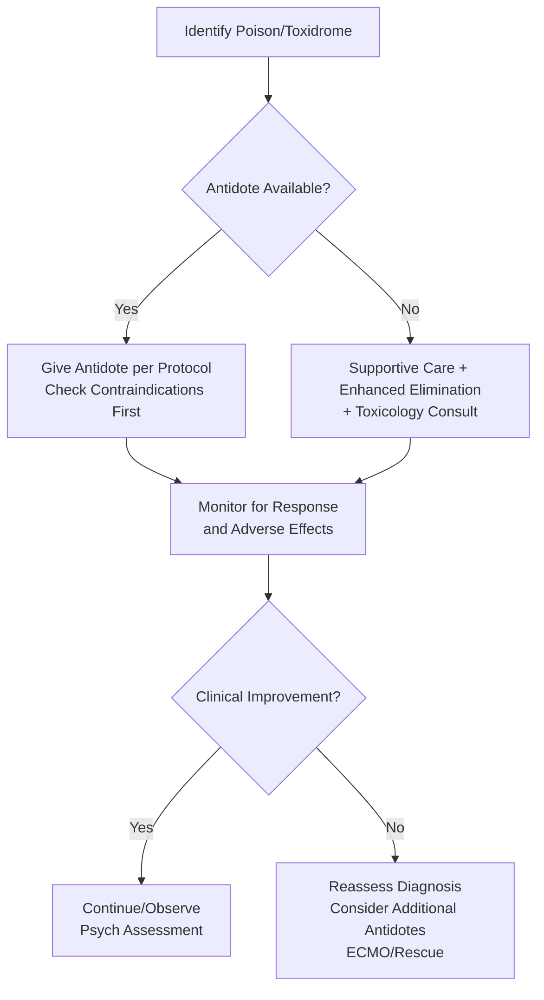

Related: [[General Principles of Poisoning Management]], [[Gastrointestinal Decontamination]], [[Enhanced Elimination (Dialysis, Hemoperfusion)]]

> [!tip]
> **Memorize these key antidotes** — examinable in FCPS/MRCP. Know: **indication, dose, contraindication, monitoring**. Stocking list for ED/ICU. Many antidotes have specific restrictions (e.g., flumazenil, physostigmine, nitrites).

## 1. Learning Objectives
- Recall key antidotes, doses, and indications
- Identify contraindications and monitoring requirements
- Know ED/ICU antidote stocking list
- Apply antidote decision-making in specific poisonings

## 2. Antidote Quick Reference Table

| Poison/Antidote | Antidote | Dose (Adult) | Key Indication | Contraindication/Caution |
|---|---|---|---|---|
| **Paracetamol** | **N-acetylcysteine (NAC)** | IV SNAP: 200mg/kg/4h + 100mg/kg/16h (300mg/kg/20h) | Level > treatment line, staggered, >24h with ALT↑ | Anaphylactoid (Bag 1) — stop, chlorphenamine/salbutamol, restart half rate |
| **Opioid** | **Naloxone** | 0.04-0.1mg IV bolus, repeat q2-3min to RR>10; infusion 2/3 bolus/hr | Respiratory depression (RR<10) | Precipitated withdrawal — titrate low; re-sedation common (shorter half-life) |
| **Benzodiazepine** | **Flumazenil** | 0.2mg IV q1min max 1mg, then 1mg/hr if re-sedation | **ONLY**: procedural oversedation, diagnostic uncertainty | **TCA co-ingestion (QRS>100), seizure hx, chronic benzo use, head injury** — SEIZURE RISK |
| **TCA** | **Sodium bicarbonate** | 1-2mEq/kg IV bolus, target pH 7.50-7.55, QRS<100ms; infusion to maintain | QRS>100ms, R aVR>3mm, VT/VF, refractory hypotension | Volume overload, alkalemia >7.55, hypokalemia |
| **Organophosphate** | **Atropine + Pralidoxime** | Atropine 1-2mg IV q5-10min to dry secretions/HR>80 (NO max); Pralidoxime 1-2g IV + 0.5-1g/hr x24-48h | Muscarinic + nicotinic signs | Pralidoxime: NOT in carbamate (avoid) |
| **Cyanide** | **Hydroxocobalamin** | 5g IV over 15min (Cyanokit), repeat 5g if needed max 10g | Smoke inhalation, industrial, ingestion | Red urine/skin (harmless, lab interference) |
| | **Nitrite + Thiosulfate** | Nitrite 300mg IV + Thiosulfate 12.5g IV | **IF hydroxocobalamin unavailable** | **CONTRAINDICATED in fire/CO** (MetHb+COHb=fatal); anemia, G6PD |
| **CO** | **100% O₂** | NRB 15L/min (half-life 30min) | All symptomatic | — |
| | **HBO** | 2.5-3.0 ATA 90-120min | COHb>25%, LOC, cardiac, pregnancy>15%, neuro, acidosis | Chamber availability |
| **Methanol/EG** | **Fomepizole** | 15mg/kg load then 10mg/kg q12h (dialysis: 1mg/kg/hr or 15mg/kg q12h) | Level>20mg/dL, acidosis, visual (MeOH), renal (EG) | Cost; dose adjust in dialysis |
| | **Ethanol** | 10% central line, target 100-150mg/dL | If fomepizole unavailable | CNS depression, hypoglycemia, thrombophlebitis |
| | **Folinic acid** | 50mg IV q6h | Methanol/EG adjunct | — |
| **Beta-blocker** | **Glucagon** | 5-10mg IV bolus + 5-15mg/hr infusion + antiemetic | Bradycardia, hypotension | Tachyphylaxis, nausea/vomiting, supply |
| | **HIET** | Insulin 1U/kg bolus + D50W 25g → 1-10U/kg/hr + dextrose (glucose 150-250), K⁺>2.8 | Refractory shock | Hypoglycemia, hypokalemia — monitor q15-30min |
| **CCB** | **Calcium chloride** | 1g (10mL 10%) IV central q10-20min, then infusion 20-50mg/kg/hr | Hypotension, bradycardia/heart block | Hypercalcemia; gluconate 3x less Ca²⁺, peripheral OK |
| | **HIET** | Same as BB | Refractory shock | Same |
| **Digoxin** | **Digoxin-specific Fab** | Empirical: 10-20 vials; Calculated: (level ng/mL × weight kg)/100 | Life-threatening arrhythmia, K⁺>5.5, level>10/6, ingest>10mg | Renal failure → Fab-digoxin complex accumulates (may need dialysis) |
| **Iron** | **Deferoxamine** | 15mg/kg/hr IV infusion (max 80mg/kg/24h), NO bolus | Systemic toxicity, level>500µg/dL, >60mg/kg ingest | Hypotension (rapid), ARDS (>24h), Yersinia, red urine |
| **Hydrogen sulfide** | **Nitrite** | Same as cyanide (induces MetHb) | H₂S inhalation | Same as nitrite cautions |
| **Methemoglobinemia** | **Methylene blue** | 1-2mg/kg IV (0.1-0.2mL/kg 1%) over 5min, repeat if needed | MetHb>30% or symptomatic | G6PD deficiency (hemolysis), high dose → metHb |
| **Anticholinergic** | **Physostigmine** | 0.5-1mg IV over 2-5min, repeat q20-30min max 2mg/hr | **SEVERE refractory** anticholinergic | **QRS>100, bradycardia, asthma, bowel/urinary obstruction, pregnancy** |
| **Warfarin** | **Vitamin K1 (Phytomenadione)** | 10mg IV (slow) + FFP/PCC if bleeding | INR>10 or bleeding | Anaphylaxis (rare, slow IV) |
| **Heparin** | **Protamine** | 1mg per 100U heparin (max 50mg) IV over 10min | Heparin overdose/bleeding | Hypotension, anaphylaxis (fish allergy) |
| **Beta-agonist** | **Propranolol/Esmolol** | Esmolol 50mcg/kg/min infusion | Theophylline, BB overdose (cautious) | Avoid in CCB, asthma |
| **Lithium** | **Hemodialysis** | Standard HD | Level>4 acute / >2.5 chronic + neuro/renal | — |
| **Ethylene glycol** | **Thiamine 100mg + Pyridoxine 50mg** | IV q6h each | Adjunct to fomepizole | — |
| **Isoniazid** | **Pyridoxine** | 1g IV per 1g INH ingested (max 5g) | INH seizures | — |

## 3. ED/ICU Antidote Stocking List (Minimum)

| **Must Have (Immediate Access)** | **Should Have (Pharmacy - 30 min)** | **Specialized (Toxicology/Regional)** |
|---|---|---|
| Naloxone | Hydroxocobalamin (Cyanokit) | Digoxin Fab (DigiFab/Digibind) |
| Flumazenil | Fomepizole (Antizol) | Deferoxamine |
| Sodium bicarbonate (8.4%) | Glucagon (multiple vials) | Pralidoxime |
| Atropine (multiple vials) | Calcium chloride 10% | Physostigmine |
| N-acetylcysteine (IV/PO) | Sodium nitrite + thiosulfate | Methylene blue |
| 100% O₂ + NRB | Methylene blue | Dicobalt edetate |
| Regular insulin + D50W/D10W/D20W | Pyridoxine (high dose) | Vasopressors (NE, Epi, Vasopressin) |
| Vitamin K1 | Thiamine | ECMO capability |
| Protamine | | |

## 4. Monitoring Requirements by Antidote

| Antidote | Monitor | Frequency |
|---|---|---|
| **NAC** | Anaphylactoid signs, LFTs, INR, renal | During infusion, then 20-24h |
| **Naloxone** | RR, GCS, withdrawal | q5-15min during titration, then q30-60min |
| **Flumazenil** | Seizures, GCS, re-sedation, ECG | Continuous during/after, 2-4h post |
| **NaHCO₃ (TCA)** | pH (target 7.50-7.55), QRS, K⁺, ECG | q15-30min |
| **Pralidoxime** | Secretions, HR, muscle strength, cholinesterase | q30-60min |
| **Hydroxocobalamin** | BP, urine color, labs (colorimetric interference) | q1-2h |
| **Nitrite** | MetHb (target 10-20%), BP, SpO₂ (co-oximetry) | Continuous |
| **Glucagon** | Nausea/vomiting, glucose, HR/BP | q15-30min |
| **HIET** | Glucose q15-30min (2h), K⁺ q1-2h, Mg²⁺, Ca²⁺, fluid balance | Intensive |
| **Calcium** | Ionized Ca²⁺, ECG (QT), mental status | q30-60min |
| **Digoxin Fab** | K⁺ q1-2h (rebound hypokalemia), arrhythmias, dig level at 24h | 24h |
| **Deferoxamine** | Urine color (vin rosé), BP, ARDS signs, Yersinia | q1-2h |
| **Methylene blue** | MetHb, Hb, G6PD status | q1-2h |

## 5. Antidote Contraindications Quick Reference (HIGH YIELD)

| **Antidote** | **ABSOLUTE Contraindications** |
|---|---|
| **Flumazenil** | TCA co-ingestion (QRS>100), seizure disorder, chronic benzo use, head injury |
| **Phenytoin** | **TCA, BB, CCB, Diphenhydramine, Cocaine** (Na channel blockers) |
| **Physostigmine** | QRS>100, bradycardia/block, asthma/COPD, bowel obstruction, urinary obstruction, pregnancy |
| **Nitrites** | **Fire victims / CO poisoning** (MetHb+COHb), anemia, G6PD, cardiovascular disease |
| **Calcium** | Digoxin toxicity (stone heart) |
| **Beta-blockers** | Cocaine, amphetamine, alpha-stimulant toxicity (unopposed alpha) |
| **Atropine** | Glaucoma (relative), obstructive GI/GU (relative) |
| **Methylene blue** | G6PD deficiency (high dose) |

## 6. Antidote Decision Flowchart (General)

## 7. Suggested Visuals / Image Notes
- Antidote stocking list poster for ED
- Contraindications quick card
- Monitoring requirements table

## 8. Suggested Video References
- Antidote administration workshop
- Toxicology pharmacy stocking

## 9. One-Page Revision Summary
- **NAC**: SNAP 2-bag 300mg/kg/20h; anaphylactoid Bag 1 → restart half rate
- **Naloxone**: 0.04-0.1mg IV → RR>10; re-sedation common; infusion 2/3 bolus/hr
- **Flumazenil**: 0.2mg IV max 1mg; **NO: TCA, seizure, chronic benzo, head injury**
- **NaHCO₃ (TCA)**: 1-2mEq/kg → pH 7.50-7.55, QRS<100
- **Atropine/Pralidoxime (OP)**: Atropine to dry/HR>80 (NO max); Pralidoxime 1-2g load + infusion (OP only)
- **Hydroxocobalamin (CN)**: 5g IV (Cyanokit); **safe in CO**; red urine/skin
- **Nitrites (CN)**: **CONTRAINDICATED in fire/CO** (MetHb+COHb)
- **100% O₂ (CO)**: half-life 30min; HBO: COHb>25%, LOC, cardiac, preg>15%, neuro
- **Fomepizole (MeOH/EG)**: 15 load, 10 q12h; dialysis: 1mg/kg/hr
- **Glucagon (BB)**: 5-10mg bolus + 5-15mg/hr + antiemetic
- **HIET (BB/CCB)**: Insulin 1U/kg + D50W → 1-10U/kg/hr, glucose 150-250, K⁺>2.8
- **Calcium (CCB)**: Cl 1g IV central q10-20min (Glu 3x less, peripheral)
- **Digoxin Fab**: 10-20 vials empirical OR level×wt/100; **HyperK = Fab FIRST**
- **Deferoxamine (Fe)**: 15mg/kg/hr IV; vin rosé urine
- **Physostigmine**: 0.5-1mg IV; **NO: QRS>100, brady, asthma, obstruction**
- **Methylene blue**: 1-2mg/kg; **NO: G6PD**

## 24-Hour Recall Prompts
- List 5 antidotes with absolute contraindications
- State digoxin Fab empirical vs calculated dose
- Explain why nitrites contraindicated in fire victims
- Differentiate flumazenil vs naloxone indications/contraindications

## 7-Day / 15-Day / 30-Day Revision Tracker
- [ ] Day 1 completed
- [ ] 24-hour recall completed
- [ ] Day 7 revision completed
- [ ] Day 15 revision completed
- [ ] Day 30 revision completed

## 10. Must Know / Should Know / Nice to Know
### Must Know
- All antidotes in quick reference table (indication, dose, contraindication)
- Flumazenil NO-GO list
- Nitrites contraindicated in CO/fire
- Calcium contraindicated in digoxin
- Phenytoin contraindicated in Na channel blocker toxicity
- Hydroxocobalamin preferred for CN (safe in CO)
- Digoxin Fab for hyperkalemia in digoxin toxicity
- HIET protocol (BB/CCB)
- Deferoxamine + vin rosé urine

### Should Know
- ED stocking list
- Monitoring requirements per antidote
- Glucagon tachyphylaxis
- Fab monitoring (K⁺ rebound)
- Colorimetric interference (hydroxocobalamin, methylene blue)

### Nice to Know
- Obidoxime alternative
- Dicobalt edetate (historical)
- Specific pediatric doses
- Antidote shortages/alternatives

## 11. Self-Test Scorecard
- Understanding: /10
- Recall: /10
- MCQ Performance: /10
- SBA Performance: /10
- Viva Confidence: /10
- Total: /50

> [!tip]
> Interpretation: <35 = weak topic, 35-44 = acceptable but insecure, 45+ = strong exam-ready topic.

## 12. Exam Answer Modes
### Long Answer Skeleton
- Table of antidotes by category
- Contraindications emphasized
- Monitoring protocols
- Stocking list

### Short Note Skeleton
- Contraindications table
- Dosing card
- Stocking list

### Viva One-Liners
- "Flumazenil NO: TCA, seizure, chronic benzo, head injury"
- "Nitrites NO in fire/CO: MetHb+COHb=fatal"
- "Calcium NO in digoxin: stone heart"
- "Phenytoin NO in TCA/BB/CCB/cocaine: Na channel"
- "Hydroxocobalamin 5g IV: CN preferred, safe in CO, red urine"
- "Digoxin Fab: 10-20 vials empirical OR level×wt/100; HyperK=Fab FIRST"
- "HIET: Insulin 1U/kg+D50W → 1-10U/kg/hr, glu 150-250, K>2.8"
- "Glucagon BB: 5-10mg + 5-15mg/hr + antiemetic"
- "CCB Calcium: Cl 1g central q10-20min (Glu 3x less)"
- "Deferoxamine Fe: 15mg/kg/hr IV, vin rosé urine"
- "Physostigmine NO: QRS>100, brady, asthma, obstruction"
- "Methylene blue: 1-2mg/kg, NO G6PD"

### Ward-Case Discussion Points
- Unknown overdose: naloxone trial + flumazenil ONLY if no contraindications
- Fire victim: hydroxocobalamin + 100% O₂ + HBO for CO
- Digoxin toxicity with K⁺ 7.0: Fab immediate, NO calcium/insulin
- TCA QRS 140ms: NaHCO₃ bolus, NO phenytoin/flumazenil

### Last-Night-Before-Exam Sheet
- Flumazenil NO: TCA, Sz, Chronic, Head
- Nitrites NO: Fire/CO
- Calcium NO: Digoxin
- Phenytoin NO: TCA/BB/CCB/Cocaine
- Hydroxocobalamin: 5g, Safe CO, Red urine
- Fab: 10-20 vials / Level×Wt/100; HyperK=Fab
- HIET: 1U/kg, 1-10U/kg/hr, Glu150-250, K>2.8
- Glucagon: 5-10mg + 5-15mg/hr
- CCB Ca: Cl 1g central q10-20min
- Deferoxamine: 15mg/kg/hr, Vin rosé
- Physostigmine NO: QRS, Brady, Asthma, Obs
- Methylene blue: G6PD NO

## 13. Summary
Key antidotes for FCPS/MRCP: NAC (paracetamol), naloxone (opioid), flumazenil (benzo — restricted), NaHCO₃ (TCA), atropine/pralidoxime (OP), hydroxocobalamin (CN — preferred), nitrites (CN — contraindicated in CO/fire), 100% O₂/HBO (CO), fomepizole (MeOH/EG), glucagon/HIET (BB), calcium/HIET (CCB), digoxin Fab, deferoxamine (Fe), physostigmine (anticholinergic — restricted), methylene blue (MetHb). Critical contraindications: flumazenil in TCA/seizure/chronic/head injury; nitrites in CO/fire; calcium in digoxin; phenytoin in Na channel blocker toxicity; beta-blockers in cocaine.

## 14. MCQs (10)
1. N-acetylcysteine is the antidote for:
   A. Salicylate
   B. Paracetamol
   C. Opioid
   D. Benzodiazepine
   **Answer: B**
   *Explanation: NAC for paracetamol. Mechanisms: GSH precursor, direct NAPQI scavenging, antioxidant, improves hepatic perfusion.*

2. Flumazenil dose for benzo reversal?
   A. 0.2 mg IV, repeat to max 3 mg
   B. 2 mg IV once
   C. 10 mg IV
   D. 0.04 mg IV
   **Answer: A**
   *Explanation: Flumazenil: 0.2 mg IV over 15 sec, repeat 0.2 mg q1min to max 3 mg. CONTRAINDICATED: TCA co-ingestion, seizure disorder, chronic benzo use.*

3. Naloxone initial IV dose for opioid overdose?
   A. 0.4-2 mg
   B. 0.04-0.1 mg
   C. 2-4 mg
   D. 4-8 mg
   **Answer: B**
   *Explanation: TITRATED naloxone: 0.04-0.1 mg IV (child 0.01 mg/kg). Goal RR > 10-12, NOT full arousal. Avoid precipitated withdrawal.*

4. Sodium bicarbonate for TCA - target?
   A. pH 7.35-7.45
   B. pH 7.50-7.55 + QRS < 100 ms
   C. pH > 7.60
   D. Normalize K⁺ only
   **Answer: B**
   *Explanation: NaHCO₃ 1-2 mEq/kg bolus → target pH 7.50-7.55 AND QRS < 100 ms. Alkalemia ↑ protein binding, Na⁺ overcomes channel blockade.*

5. Atropine + pralidoxime for:
   A. Cyanide
   B. Organophosphate
   C. Iron
   D. Methanol
   **Answer: B**
   *Explanation: Organophosphate: atropine (till secretions dry, HR>80, no bronchospasm) + pralidoxime 1-2g IV over 30min (within 24-48h). IMS day 1-4, OPIDN weeks.*

6. Fomepizole for:
   A. Methanol and ethylene glycol
   B. Paracetamol
   C. Salicylate
   D. Iron
   **Answer: A**
   *Explanation: Fomepizole (ADH inhibitor): methanol, ethylene glycol. 15 mg/kg load, 10 mg/kg q12h. Dialysis if pH<7.3, renal failure, visual (methanol), level>50mmol/L.*

7. Digoxin-specific Fab dose calculation?
   A. Level × weight / 100
   B. Serum level (ng/mL) × weight (kg) / 100 = vials, OR empirical 10-20 vials
   C. 1 vial per mg digoxin
   D. Fixed 10 vials for all
   **Answer: B**
   *Explanation: Fab dose = (serum level ng/mL × weight kg) / 100 = number of vials. Or empirical 10-20 vials if level unknown/acute massive ingestion.*

8. Hydroxocobalamin for:
   A. Cyanide
   B. Carbon monoxide
   C. Iron
   D. Methanol
   **Answer: A**
   *Explanation: Hydroxocobalamin 5g IV (2.5g/100mL over 15min) for cyanide. Binds CN⁻ → cyanocobalamin (excreted renally). Alternative: nitrites + sodium thiosulfate.*

9. Deferoxamine for iron - urine color change?
   A. Red
   B. Blue
   C. Vin rosé (pink/red)
   D. Green
   **Answer: C**
   *Explanation: Deferoxamine: chelates iron → ferrioxamine excreted in urine → VIN ROSÉ (pink/red) urine. Indicated if systemic toxicity (shock, metabolic acidosis) or level > 500 µg/dL.*

10. Glucagon + HIET for:
   A. Beta-blocker / Calcium channel blocker
   B. Opioid
   C. Benzodiazepine
   D. TCA
   **Answer: A**
   *Explanation: Glucagon 5-10mg IV then 5-15mg/hr infusion (BB). HIET: insulin 1U/kg/hr + dextrose (maintain glucose 5-10mmol/L) + K⁺ replacement. For BB/CCB cardiogenic shock.*

## 15. SBA Questions (10)
1. Paracetamol overdose, 4h level above treatment line. NAC protocol preferred in UK?
   A. Oral 72-hour
   B. IV 3-bag traditional
   C. IV SNAP 2-bag (NHSE 2021+)
   D. Methionine
   **Answer: C**
   *Explanation: UK NHSE 2021+ prefers SNAP 2-bag: 200mg/kg/4h + 100mg/kg/16h = 300mg/kg/20h. Less anaphylactoid, shorter duration. Oral alternative if IV access difficult.*

2. Benzo overdose, pure, no seizure risk, no TCA. Flumazenil given, patient wakes. 1 hour later, seizures. Why?
   A. Flumazenil causes seizures
   B. Flumazenil short half-life (0.7-1.3h) vs benzo → re-sedation then withdrawal seizures
   C. Undiagnosed epilepsy
   D. Flumazenil dose too high
   **Answer: B**
   *Explanation: Flumazenil t½ 0.7-1.3h < benzo t½ → re-sedation. Also acute benzo withdrawal can cause seizures. Monitor 2-3h post-flumazenil. Contraindicated in chronic benzo use.*

3. Opioid overdose, naloxone 0.4mg IV given, patient arousable but RR 8. Next step?
   A. More naloxone
   B. Intubate
   C. Observe
   D. Give flumazenil
   **Answer: A**
   *Explanation: Titrate naloxone to RR > 10-12. 0.4mg may be insufficient. Repeat 0.1, 0.2, 0.4, 0.8, 2mg q2-3min. Max 10mg. If no response → reconsider diagnosis.*

4. TCA overdose, QRS 130ms. NaHCO₃ bolus given. Target for repeat bolus?
   A. QRS < 120ms
   B. QRS < 100ms AND pH 7.50-7.55
   C. pH > 7.60
   D. BP normal
   **Answer: B**
   *Explanation: NaHCO₃ target: pH 7.50-7.55 AND QRS < 100 ms. Repeat bolus if QRS not narrowing. Infusion to maintain. Hyperventilate intubated patients to same pH target.*

5. Organophosphate poisoning, atropine 10mg given, secretions still wet. Next?
   A. Stop atropine
   B. Continue atropine - NO max dose, titrate to dry secretions/HR>80
   C. Give pralidoxime only
   D. Intubate
   **Answer: B**
   *Explanation: Atropine: NO MAX DOSE. Titrate to dry secretions, HR > 80, no bronchospasm. Pralidoxime 1-2g IV over 30min (within 24-48h) - reactivates AChE. IMS day 1-4.*

6. Methanol poisoning, pH 7.25, creatinine rising. Antidote + dialysis?
   A. Fomepizole + observe
   B. Fomepizole + hemodialysis
   C. Ethanol + observe
   D. Dialysis only
   **Answer: B**
   *Explanation: Methanol/EG: fomepizole 15mg/kg load + 10mg/kg q12h. Dialysis if pH < 7.3, renal failure, visual symptoms (methanol), level > 50 mmol/L. This patient meets dialysis criteria (pH 7.25, rising Cr).*

7. Digoxin overdose, level 6 ng/mL, K⁺ 6.2, bradycardic. Management?
   A. Insulin/dextrose + calcium for K⁺
   B. Digoxin-specific Fab 10-20 vials empirically
   C. Atropine for bradycardia
   D. Pacemaker
   **Answer: B**
   *Explanation: Digoxin hyperkalemia = Fab FIRST (reverses Na/K-ATPase blockade → K⁺ shifts into cells). Standard hyperK measures can be dangerous. Bradycardia: atropine if hemodynamically unstable, but Fab is definitive.*

8. Cyanide poisoning from house fire. Antidote?
   A. Hydroxocobalamin 5g IV
   B. Amyl nitrite inhalant
   C. Sodium thiosulfate alone
   D. Naloxone
   **Answer: A**
   *Explanation: Hydroxocobalamin 5g IV (2.5g/100mL over 15min) preferred. Binds CN⁻ → cyanocobalamin. Alternative: nitrites (amyl/sodium) + sodium thiosulfate. CO also common in fires - 100% O₂.*

9. Iron overdose, 6h post-ingestion, vomiting, metabolic acidosis, level 600 µg/dL. Management?
   A. Observe
   B. Deferoxamine infusion
   C. Hemodialysis
   D. Whole bowel irrigation
   **Answer: B**
   *Explanation: Deferoxamine if systemic toxicity (shock, metabolic acidosis, coma) OR level > 500 µg/dL. Vin rosé urine. WBI if recent large ingestion (iron tablets radiopaque). HD not effective.*

10. Propranolol overdose, refractory hypotension. Glucagon dose?
   A. 1 mg IV
   B. 5-10 mg IV then 5-15 mg/hr infusion
   C. 20 mg IV
   D. 0.5 mg IV
   **Answer: B**
   *Explanation: Glucagon: 5-10 mg IV over 1-2 min, then 5-15 mg/hr infusion. Bypasses β-receptor. Side effect: vomiting (protect airway). HIET additive for myocardial support.*

## 16. Flashcards
- Q: Paracetamol antidote?
  A: N-acetylcysteine (IV SNAP 2-bag or 3-bag, oral 72h). Mechanisms: GSH precursor, NAPQI scavenging, antioxidant, hepatic perfusion.
- Q: Benzo antidote?
  A: Flumazenil 0.2mg IV q1min to max 3mg. CONTRAINDICATED: TCA co-ingestion, seizure disorder, chronic benzo use.
- Q: Opioid antidote?
  A: Naloxone 0.04-0.1mg IV titrated to RR>10. Max 10mg. Duration 30-90min < opioid → re-sedation common. Infusion 2/3 bolus/hr.
- Q: TCA cardiotoxicity antidote?
  A: Sodium bicarbonate 1-2 mEq/kg bolus → target pH 7.50-7.55, QRS < 100ms. Alkalemia ↑ protein binding, Na⁺ overcomes channel block.
- Q: Organophosphate antidotes?
  A: Atropine (NO max dose, titrate to dry secretions/HR>80) + Pralidoxime 1-2g IV over 30min (within 24-48h). IMS day 1-4, OPIDN weeks.
- Q: Methanol/EG antidote?
  A: Fomepizole 15mg/kg load, 10mg/kg q12h. Dialysis if pH<7.3, renal failure, visual (methanol), level>50mmol/L. Ethanol alternative.
- Q: Digoxin antidote?
  A: Digoxin-specific Fab. Dose = (level ng/mL × weight kg) / 100 = vials. Or empirical 10-20 vials. HyperK = give Fab FIRST.
- Q: Cyanide antidote?
  A: Hydroxocobalamin 5g IV (preferred). Alternative: nitrites + sodium thiosulfate. Smoke inhalation = CN⁻ + CO.
- Q: Iron antidote?
  A: Deferoxamine. Vin rosé urine. Indicated: systemic toxicity OR level >500µg/dL. WBI for recent large ingestion.
- Q: BB/CCB cardiogenic shock?
  A: BB: Glucagon 5-10mg IV + infusion + HIET. CCB: Calcium + HIET. Both: vasopressors (NE) for refractory shock.
- Q: Salicylate enhanced elimination?
  A: Urinary alkalinization (urine pH 7.5-8.0, replace K⁺). HD if pH<7.2, renal failure, CNS toxicity, level>700(acute)/>400(chronic).
- Q: Lithium enhanced elimination?
  A: Hemodialysis. Acute >4mmol/L, Chronic >2.5 + neuro/renal/elderly. Lithium rebounds post-HD (redistributes).
- Q: Methotrexate antidote?
  A: Leucovorin (folinic acid) rescue. Urinary alkalinization enhances elimination. Hydration.
- Q: Anticholinergic severe?
  A: Physostigmine 1-2mg IV over 5min (ONLY if severe AND no QRS widening/asthma/bradycardia/bowel obstruction). Risk: seizures, bradycardia, asystole.
- Q: Serotonin syndrome antidote?
  A: Cyproheptadine 12mg PO/NG then 2mg q2h PRN. Supportive: benzos, cooling, paralysis if severe. Stop serotonergic drugs.
## 17. Answer Key with Explanations
### MCQs
1. **B** - NAC for paracetamol. Mechanisms: GSH precursor, direct NAPQI scavenging, antioxidant, improves hepatic perfusion.
2. **A** - Flumazenil: 0.2 mg IV over 15 sec, repeat 0.2 mg q1min to max 3 mg. CONTRAINDICATED: TCA co-ingestion, seizure disorder, chronic benzo use.
3. **B** - TITRATED naloxone: 0.04-0.1 mg IV (child 0.01 mg/kg). Goal RR > 10-12, NOT full arousal. Avoid precipitated withdrawal.
4. **B** - NaHCO₃ 1-2 mEq/kg bolus → target pH 7.50-7.55 AND QRS < 100 ms. Alkalemia ↑ protein binding, Na⁺ overcomes channel blockade.
5. **B** - Organophosphate: atropine (till secretions dry, HR>80, no bronchospasm) + pralidoxime 1-2g IV over 30min (within 24-48h). IMS day 1-4, OPIDN weeks.
6. **A** - Fomepizole (ADH inhibitor): methanol, ethylene glycol. 15 mg/kg load, 10 mg/kg q12h. Dialysis if pH<7.3, renal failure, visual (methanol), level>50mmol/L.
7. **B** - Fab dose = (serum level ng/mL × weight kg) / 100 = number of vials. Or empirical 10-20 vials if level unknown/acute massive ingestion.
8. **A** - Hydroxocobalamin 5g IV (2.5g/100mL over 15min) for cyanide. Binds CN⁻ → cyanocobalamin (excreted renally). Alternative: nitrites + sodium thiosulfate.
9. **C** - Deferoxamine: chelates iron → ferrioxamine excreted in urine → VIN ROSÉ (pink/red) urine. Indicated if systemic toxicity (shock, metabolic acidosis) or level > 500 µg/dL.
10. **A** - Glucagon 5-10mg IV then 5-15mg/hr infusion (BB). HIET: insulin 1U/kg/hr + dextrose (maintain glucose 5-10mmol/L) + K⁺ replacement. For BB/CCB cardiogenic shock.

### SBAs
1. **C** - UK NHSE 2021+ prefers SNAP 2-bag: 200mg/kg/4h + 100mg/kg/16h = 300mg/kg/20h. Less anaphylactoid, shorter duration. Oral alternative if IV access difficult.
2. **B** - Flumazenil t½ 0.7-1.3h < benzo t½ → re-sedation. Also acute benzo withdrawal can cause seizures. Monitor 2-3h post-flumazenil. Contraindicated in chronic benzo use.
3. **A** - Titrate naloxone to RR > 10-12. 0.4mg may be insufficient. Repeat 0.1, 0.2, 0.4, 0.8, 2mg q2-3min. Max 10mg. If no response → reconsider diagnosis.
4. **B** - NaHCO₃ target: pH 7.50-7.55 AND QRS < 100 ms. Repeat bolus if QRS not narrowing. Infusion to maintain. Hyperventilate intubated patients to same pH target.
5. **B** - Atropine: NO MAX DOSE. Titrate to dry secretions, HR > 80, no bronchospasm. Pralidoxime 1-2g IV over 30min (within 24-48h) - reactivates AChE. IMS day 1-4.
6. **B** - Methanol/EG: fomepizole 15mg/kg load + 10mg/kg q12h. Dialysis if pH < 7.3, renal failure, visual symptoms (methanol), level > 50 mmol/L. This patient meets dialysis criteria (pH 7.25, rising Cr).
7. **B** - Digoxin hyperkalemia = Fab FIRST (reverses Na/K-ATPase blockade → K⁺ shifts into cells). Standard hyperK measures can be dangerous. Bradycardia: atropine if hemodynamically unstable, but Fab is definitive.
8. **A** - Hydroxocobalamin 5g IV (2.5g/100mL over 15min) preferred. Binds CN⁻ → cyanocobalamin. Alternative: nitrites (amyl/sodium) + sodium thiosulfate. CO also common in fires - 100% O₂.
9. **B** - Deferoxamine if systemic toxicity (shock, metabolic acidosis, coma) OR level > 500 µg/dL. Vin rosé urine. WBI if recent large ingestion (iron tablets radiopaque). HD not effective.
10. **B** - Glucagon: 5-10 mg IV over 1-2 min, then 5-15 mg/hr infusion. Bypasses β-receptor. Side effect: vomiting (protect airway). HIET additive for myocardial support.