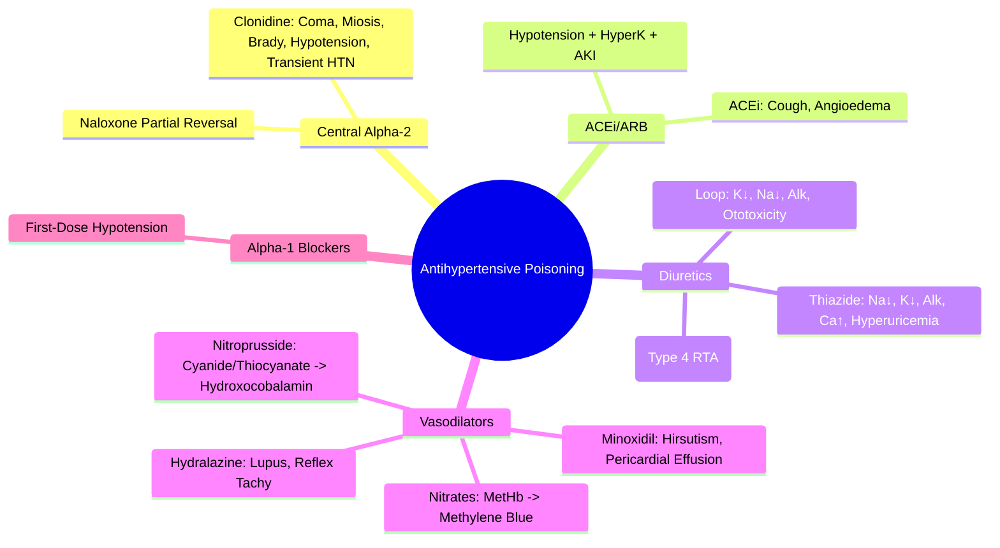

Related: [[General Principles of Poisoning Management]], [[Beta-Blocker Poisoning]], [[Calcium Channel Blocker Poisoning]], [[Alpha-2 Agonist (Clonidine) Poisoning]], [[ACE Inhibitor/ARB Poisoning]], [[Diuretic Poisoning]], [[Antidotes Overview]]

> [!tip]
> **Diverse mechanisms** — management tailored to class. **Clonidine** = α₂ agonist → CNS depression, bradycardia, hypotension, miosis, transient hypertension → **supportive, naloxone may help**. **ACEi/ARB** = hypotension, hyperkalemia, AKI → **fluids, vasopressors**. **Diuretics** = electrolytes (hypokalemia, hyponatremia, metabolic alkalosis) → **replace**. **Vasodilators** (hydralazine, minoxidil, nitroprusside) = reflex tachycardia, hypotension → **fluids, vasopressors**. Key FCPS/MRCP: **Clonidine mimics opioid** (miosis, respiratory depression) but **naloxone partially reverses**; **ACEi cough**; **thiazide hyponatremia**; **nitroprusside cyanide/thiocyanate**.

## 1. Learning Objectives
- Recognize toxicity by antihypertensive class
- Apply class-specific management (clonidine, ACEi/ARB, diuretics, vasodilators)
- Differentiate clonidine from opioid poisoning
- Manage electrolyte disturbances from diuretics
- Identify nitroprusside cyanide/thiocyanate toxicity

## 2. Definition
Antihypertensive poisoning = toxicity from blood pressure-lowering agents causing **hypotension, bradycardia, electrolyte disturbances, and end-organ hypoperfusion**.

## 3. Core Physiology & Toxicity by Class

### 1. Central α₂ Agonists — **Clonidine, Guanfacine, Methyldopa**
- **Mechanism**: central α₂ agonism → ↓ sympathetic outflow → ↓ BP, ↓ HR
- **OD**: **CNS depression** (coma, respiratory depression), **bradycardia**, **hypotension**, **miosis**, **transient hypertension** (peripheral α₂ agonism), **hypothermia**
- **Clonidine**: most toxic; **guanfacine** less; **methyldopa** rare OD
- **Naloxone**: **partial reversal** of CNS/respiratory depression (mechanism unclear)

### 2. ACE Inhibitors / ARBs
- **Mechanism**: ↓ angiotensin II → vasodilation, ↓ aldosterone
- **OD**: **hypotension** (refractory), **hyperkalemia** (↓ aldosterone), **AKI** (↓ glomerular filtration), **cough** (ACEi, bradykinin), **angioedema** (ACEi)
- **Lisinopril, enalapril, ramipril, perindopril** (ACEi); **losartan, valsartan, candesartan** (ARB)

### 3. Diuretics
| Type | Mechanism | Key Toxicity |
|------|-----------|--------------|
| **Loop** (furosemide, bumetanide) | NKCC2 inhibition | **Hypokalemia**, hyponatremia, metabolic alkalosis, ototoxicity (high dose), volume depletion |
| **Thiazide** (hydrochlorothiazide, indapamide) | NCC inhibition | **Hyponatremia**, hypokalemia, metabolic alkalosis, hypercalcemia, hyperglycemia, hyperuricemia |
| **K⁺-sparing** (spironolactone, amiloride, triamterene) | ENaC/aldosterone antagonism | **Hyperkalemia** (esp. with ACEi/ARB), metabolic acidosis (type 4 RTA), gynecomastia (spironolactone) |
| **Osmotic** (mannitol) | Osmotic gradient | Volume depletion, hypernatremia, pulmonary edema (if HF) |

### 4. Direct Vasodilators
- **Hydralazine**: direct arterial vasodilation → **reflex tachycardia, hypotension, lupus-like syndrome, headache**
- **Minoxidil**: K⁺ channel opener → **hirsutism, pericardial effusion, fluid retention**
- **Nitroprusside**: NO donor → **severe hypotension, cyanide toxicity (thiocyanate), methemoglobinemia**
- **Nitrates** (GTN, isosorbide): venodilation > arterial → **headache, hypotension, methemoglobinemia**

### 5. Other
- **Alpha-1 blockers** (prazosin, doxazosin, terazosin): **first-dose hypotension**, reflex tachycardia, IFIS (intraoperative floppy iris syndrome)
- **Centrally acting** (moxonidine, rilmenidine): similar to clonidine but less toxic

## 4. Clinical Features Summary
| Class | Key Features |
|-------|--------------|
| **Clonidine** | Coma, miosis, bradycardia, hypotension, transient HTN, respiratory depression, hypothermia |
| **ACEi/ARB** | Hypotension, hyperkalemia, AKI, cough (ACEi), angioedema |
| **Loop/Thiazide** | Hypokalemia, hyponatremia (thiazide), metabolic alkalosis, volume depletion |
| **K⁺-sparing** | Hyperkalemia, metabolic acidosis |
| **Vasodilators** | Hypotension, reflex tachycardia, cyanide (nitroprusside) |
| **Alpha-1 blockers** | First-dose hypotension, syncope |

## 5. Investigations
- **ECG**: bradycardia, QT (some agents)
- **Electrolytes**: **K⁺, Na⁺, Mg²⁺, Ca²⁺** (critical for diuretics)
- **Renal function**: creatinine, urea (AKI, hyperkalemia)
- **ABG/VBG**: pH, lactate (perfusion)
- **Cyanide/thiocyanate** (nitroprusside > 48h or renal failure)
- **Methemoglobin** (nitrates, nitroprusside, dapsone)
- **Paracetamol level** (always)

## 6. Management

### 1. General Supportive Care
- **ABCDE**: continuous monitoring, airway protection
- **IV fluids**: **first-line for hypotension** (NS 500-1000 mL bolus)
- **Vasopressors**: **norepinephrine** (α₁ + β₁) if fluid-refractory; **vasopressin** adjunct
- **Atropine** 0.5-1 mg IV for symptomatic bradycardia

### 2. Class-Specific

#### **Clonidine / Central α₂ Agonists**
- **Naloxone**: **0.4-2 mg IV** (repeat q2-3 min) — **partial reversal** of CNS/respiratory depression; may need **infusion 0.4-1 mg/hr**
- **Supportive**: ventilation if respiratory depression, fluids/vasopressors for hypotension
- **NO flumazenil** (not benzo)

#### **ACEi/ARB**
- **Fluids + vasopressors** (NE) for hypotension
- **Hyperkalemia**: standard measures (insulin/dextrose, calcium if ECG changes, salbutamol, kayexalate, dialysis if severe)
- **AKI**: stop nephrotoxins, optimize volume, renal replacement if indicated

#### **Diuretics**
- **Electrolyte replacement**: **K⁺, Mg²⁺, Na⁺** guided by levels
- **Hypokalemia**: KCl 20-40 mEq/hr (IV) + Mg²⁺ replacement
- **Hyponatremia** (thiazide): fluid restriction, hypertonic saline if severe symptomatic
- **Hyperkalemia** (K⁺-sparing): standard measures
- **Volume depletion**: NS resuscitation

#### **Nitroprusside**
- **Cyanide surveillance**: if > 2 mcg/kg/min or > 48h or renal failure
- **Thiocyanate** level if prolonged/renal failure
- **Treatment**: stop infusion, hydroxocobalamin 5g IV (if cyanide suspected)

#### **Nitrates**
- **Methemoglobinemia**: if > 30% or symptomatic → **methylene blue 1-2 mg/kg IV**

#### **Hydralazine/Minoxidil**
- **Lupus-like**: stop drug, NSAIDs/steroids if severe
- **Reflex tachycardia**: β-blocker if needed (cautious)

#### **Alpha-1 Blockers**
- **First-dose effect**: supine positioning, fluids, slow titration

### 3. Decontamination
- **Activated charcoal**: 1 g/kg if < 1-2h (most antihypertensives)
- **WBI**: sustained-release formulations (clonidine, some ACEi/ARB, doxazosin)

### 4. Monitoring & Disposition
- **Continuous ECG, BP, SpO₂, GCS**
- **Electrolytes q4-6h** (diuretics)
- **Observe 12-24h** (longer for SR, clonidine)
- **Psych assessment** if DSH

## 7. Complications
- Cardiogenic shock (refractory hypotension)
- Severe hyperkalemia (K⁺-sparing + ACEi/ARB, AKI)
- Hyponatremia seizures (thiazide)
- Cyanide toxicity (nitroprusside)
- Methemoglobinemia (nitrates)
- Angioedema (ACEi) — airway compromise

## 8. Prognosis
- **Generally good** with supportive care
- **Clonidine**: full recovery typical
- **ACEi/ARB**: recovery with fluids/vasopressors
- **Diuretics**: electrolyte correction → recovery
- **Nitroprusside cyanide**: good if recognized early

## 9. FCPS/MRCP High-Yield Points
1. **Clonidine**: miosis + coma + bradycardia + hypotension + **transient HTN** + **naloxone partially reverses**
2. **ACEi/ARB**: hypotension + **hyperkalemia** + AKI + **cough (ACEi)**
3. **Thiazide**: **hyponatremia** + hypokalemia + metabolic alkalosis
4. **Loop**: hypokalemia + metabolic alkalosis + ototoxicity
4. **K⁺-sparing**: **hyperkalemia** (additive with ACEi/ARB) + metabolic acidosis
5. **Nitroprusside**: **cyanide → hydroxocobalamin; thiocyanate in renal failure**
6. **Nitrates**: methemoglobinemia → methylene blue
7. **Hydralazine**: lupus-like syndrome, reflex tachycardia
8. **Alpha-1 blockers**: first-dose hypotension
9. **Naloxone for clonidine** (partial reversal) — differentiates from opioid
10. **Minoxidil**: hirsutism, pericardial effusion

## 10. Common Viva Questions
1. Clonidine toxidrome and naloxone role
2. ACEi vs ARB overdose differences
3. Thiazide vs loop diuretic electrolyte patterns
4. Nitroprusside cyanide/thiocyanate monitoring
5. Methemoglobinemia management
6. Differentiate clonidine from opioid

## 11. Common Confusions / Exam Traps
- **Clonidine = opioid** → miosis + respiratory depression BUT **transient HTN**, **naloxone partial**, **no pinpoint pupils persist**
- **Naloxone fully reverses clonidine** → NO, **partial**, may need infusion
- **ACEi cough = ARB cough** → NO, **ARB no cough**
- **Thiazide hypercalcemia** → YES (unlike loop hypocalcemia)
- **K⁺-sparing + ACEi = hyperkalemia** — common dangerous combo
- **Nitroprusside cyanide = all patients** → only > 2 mcg/kg/min, > 48h, renal failure
- **Methylene blue for all metHb** → G6PD deficiency contraindicated

## 12. Mnemonics
- **CLONIDINE**: **C**oma, **M**iosis, **B**radycardia, **H**ypotension, **T**ransient **H**TN, **N**aloxone **P**artial
- **ACEi/ARB**: **A**ngioedema, **C**ough, **E**lectrolytes (K↑), **R**enal
- **DIURETICS**: **L**oop = **K**↓, **Alk**alosis; **T**hiazide = **Na**↓, **K**↓, **Alk**alosis, **Ca**↑; **K**-sparing = **K**↑, **A**cidosis
- **NITROPRUSSIDE**: **C**yanide → **H**ydroxocobalamin; **T**hiocyanate (renal)
- **METHEMOGLOBINEMIA**: **M**ethylene **B**lue 1-2mg/kg (NO G6PD)

## 13. Mind Map


## 14. Flowchart
```mermaid
flowchart TD
  A[Hypotensive Overdose] --> B[ABCDE + Fluids + Vasopressors (NE)\nElectrolytes, Renal, ECG]
  B --> C{Identify Class}
  C -->|Clonidine| D[Naloxone 0.4-2mg IV\nPartial Reversal\nMay Need Infusion\nSupportive]
  C -->|ACEi/ARB| E[Fluids + NE\nHyperK Management\nAKI Monitoring]
  C -->|Loop/Thiazide| F[Electrolyte Replacement\nK, Mg, Na\nVolume Resuscitation]
  C -->|K-Sparing| G[HyperK Management\nStop ACEi/ARB\nDialysis if Severe]
  C -->|Nitroprusside| H[Cyanide/Thiocyanate Monitor\nHydroxocobalamin if CN]
  C -->|Nitrates| I[MetHb Check\nMethylene Blue if >30%]
  C -->|Hydralazine| J[Lupus: Stop + Steroids\nReflex Tachy: BB]
  C -->|Alpha-1 Blocker| K[Fluids, Supine, Slow Titration]
  D --> L[Observe 12-24h\nPsych Assessment]
  E --> L
  F --> L
  G --> L
  H --> L
  I --> L
  J --> L
  K --> L
```

## 15. Suggested Visuals / Image Notes
- Antihypertensive class comparison table
- Electrolyte patterns by diuretic type
- Clonidine vs opioid comparison
- Nitroprusside cyanide/thiocyanate timeline

## 16. Suggested Video References
- Antihypertensive overdose management (Toxbase)

## 17. One-Page Revision Summary
- **Clonidine**: miosis, coma, brady/hypotension, transient HTN → **naloxone partial**
- **ACEi/ARB**: hypotension, hyperK, AKI; ACEi = cough + angioedema
- **Thiazide**: hyponatremia, hypokalemia, metabolic alkalosis, hypercalcemia
- **Loop**: hypokalemia, metabolic alkalosis, ototoxicity
- **K-sparing**: hyperkalemia, metabolic acidosis
- **Nitroprusside**: cyanide/thiocyanate → hydroxocobalamin
- **Nitrates**: methemoglobinemia → methylene blue (NO G6PD)
- **Hydralazine**: lupus, reflex tachycardia
- **Alpha-1 blockers**: first-dose hypotension

## 24-Hour Recall Prompts
- State clonidine toxidrome (5 features)
- List thiazide vs loop electrolyte differences
- Explain nitroprusside cyanide monitoring
- Differentiate clonidine from opioid

## 7-Day / 15-Day / 30-Day Revision Tracker
- [ ] Day 1 completed
- [ ] 24-hour recall completed
- [ ] Day 7 revision completed
- [ ] Day 15 revision completed
- [ ] Day 30 revision completed

## 18. Must Know / Should Know / Nice to Know
### Must Know
- Clonidine: miosis + coma + transient HTN + naloxone partial
- ACEi/ARB: hypotension + hyperK + AKI; ACEi = cough
- Thiazide: hyponatremia + hypokalemia + alkalosis
- Loop: hypokalemia + alkalosis
- K-sparing: hyperkalemia + acidosis
- Nitroprusside: cyanide/thiocyanate → hydroxocobalamin
- Naloxone for clonidine (partial)

### Should Know
- Thiazide hypercalcemia (vs loop hypocalcemia)
- Hydralazine lupus
- Minoxidil hirsutism/pericardial effusion
- Alpha-1 blocker first-dose effect
- MetHb: methylene blue (NO G6PD)

### Nice to Know
- Methyldopa/guanfacine less toxic than clonidine
- Moxonidine/rilmenidine newer central agents
- Minoxidil pericardial effusion
- Angioedema ACEi mechanism (bradykinin)

## 19. Self-Test Scorecard
- Understanding: /10
- Recall: /10
- MCQ Performance: /10
- SBA Performance: /10
- Viva Confidence: /10
- Total: /50

> [!tip]
> Interpretation: <35 = weak topic, 35-44 = acceptable but insecure, 45+ = strong exam-ready topic.

## 20. Exam Answer Modes
### Long Answer Skeleton
- Classification table with mechanisms
- Clonidine toxidrome + naloxone
- ACEi vs ARB + diuretic electrolyte table
- Nitroprusside/nitrate specific toxicities
- Management by class

### Short Note Skeleton
- Clonidine vs opioid table
- Diuretic electrolyte comparison
- Nitroprusside monitoring card

### Viva One-Liners
- "Clonidine: miosis + coma + brady/hypotension + transient HTN → naloxone partial"
- "ACEi/ARB: hypotension + hyperK + AKI; ACEi cough/angioedema"
- "Thiazide: hyponatremia + hypokalemia + alkalosis + hypercalcemia"
- "Loop: hypokalemia + alkalosis + ototoxicity"
- "K-sparing: hyperkalemia + acidosis (Type 4 RTA)"
- "Nitroprusside: cyanide/thiocyanate → hydroxocobalamin"
- "Nitrates: methemoglobinemia → methylene blue (NO G6PD)"
- "Hydralazine: lupus + reflex tachycardia"
- "Alpha-1 blockers: first-dose hypotension"
- "Naloxone for clonidine = partial reversal"

### Ward-Case Discussion Points
- Elderly on thiazide + ACEi → hyponatremia + hyperkalemia
- Nitroprusside infusion 72h, renal failure → thiocyanate toxicity
- Clonidine patch ingestion child → naloxone + observe 24h

### Last-Night-Before-Exam Sheet
- Clonidine: Miosis, Coma, Brady, HTN transient, Naloxone Partial
- ACEi: Cough, HyperK, AKI
- Thiazide: Na↓, K↓, Alk, Ca↑
- Loop: K↓, Alk
- K-sparing: K↑, Acid
- Nitroprusside: CN -> Hydroxocobalamin
- Nitrate: MetHb -> Methylene Blue

## 21. Summary
Antihypertensive poisoning: **Clonidine** (α₂) → miosis, coma, transient HTN → **naloxone partial**; **ACEi/ARB** → hypotension, hyperK, AKI (ACEi = cough); **Thiazide** → hyponatremia, hypokalemia, alkalosis, hypercalcemia; **Loop** → hypokalemia, alkalosis; **K-sparing** → hyperkalemia, acidosis; **Nitroprusside** → cyanide/thiocyanate → hydroxocobalamin; **Nitrates** → metHb → methylene blue; **Hydralazine** → lupus; **Alpha-1 blockers** → first-dose hypotension.

## 22. MCQs (10)
1. Question 1
   A. Option A
   B. Option B
   C. Option C
   D. Option D
   **Answer: A**
   *Explanation: Explanation 1*

2. Question 2
   A. Option A
   B. Option B
   C. Option C
   D. Option D
   **Answer: B**
   *Explanation: Explanation 2*

3. Question 3
   A. Option A
   B. Option B
   C. Option C
   D. Option D
   **Answer: C**
   *Explanation: Explanation 3*

4. Question 4
   A. Option A
   B. Option B
   C. Option C
   D. Option D
   **Answer: D**
   *Explanation: Explanation 4*

5. Question 5
   A. Option A
   B. Option B
   C. Option C
   D. Option D
   **Answer: A**
   *Explanation: Explanation 5*

6. Question 6
   A. Option A
   B. Option B
   C. Option C
   D. Option D
   **Answer: B**
   *Explanation: Explanation 6*

7. Question 7
   A. Option A
   B. Option B
   C. Option C
   D. Option D
   **Answer: C**
   *Explanation: Explanation 7*

8. Question 8
   A. Option A
   B. Option B
   C. Option C
   D. Option D
   **Answer: D**
   *Explanation: Explanation 8*

9. Question 9
   A. Option A
   B. Option B
   C. Option C
   D. Option D
   **Answer: A**
   *Explanation: Explanation 9*

10. Question 10
   A. Option A
   B. Option B
   C. Option C
   D. Option D
   **Answer: B**
   *Explanation: Explanation 10*


## 23. SBA Questions (10)
1. Scenario 1
   A. Option A
   B. Option B
   C. Option C
   D. Option D
   **Answer: A**
   *Explanation: Explanation 1*

2. Scenario 2
   A. Option A
   B. Option B
   C. Option C
   D. Option D
   **Answer: B**
   *Explanation: Explanation 2*

3. Scenario 3
   A. Option A
   B. Option B
   C. Option C
   D. Option D
   **Answer: C**
   *Explanation: Explanation 3*

4. Scenario 4
   A. Option A
   B. Option B
   C. Option C
   D. Option D
   **Answer: D**
   *Explanation: Explanation 4*

5. Scenario 5
   A. Option A
   B. Option B
   C. Option C
   D. Option D
   **Answer: A**
   *Explanation: Explanation 5*

6. Scenario 6
   A. Option A
   B. Option B
   C. Option C
   D. Option D
   **Answer: B**
   *Explanation: Explanation 6*

7. Scenario 7
   A. Option A
   B. Option B
   C. Option C
   D. Option D
   **Answer: C**
   *Explanation: Explanation 7*

8. Scenario 8
   A. Option A
   B. Option B
   C. Option C
   D. Option D
   **Answer: D**
   *Explanation: Explanation 8*

9. Scenario 9
   A. Option A
   B. Option B
   C. Option C
   D. Option D
   **Answer: A**
   *Explanation: Explanation 9*

10. Scenario 10
   A. Option A
   B. Option B
   C. Option C
   D. Option D
   **Answer: B**
   *Explanation: Explanation 10*


## 24. Flashcards
- Q: Flashcard 1 question
  A: Flashcard 1 answer
- Q: Flashcard 2 question
  A: Flashcard 2 answer
- Q: Flashcard 3 question
  A: Flashcard 3 answer
- Q: Flashcard 4 question
  A: Flashcard 4 answer
- Q: Flashcard 5 question
  A: Flashcard 5 answer
- Q: Flashcard 6 question
  A: Flashcard 6 answer
- Q: Flashcard 7 question
  A: Flashcard 7 answer
- Q: Flashcard 8 question
  A: Flashcard 8 answer
- Q: Flashcard 9 question
  A: Flashcard 9 answer
- Q: Flashcard 10 question
  A: Flashcard 10 answer
- Q: Flashcard 11 question
  A: Flashcard 11 answer
- Q: Flashcard 12 question
  A: Flashcard 12 answer
- Q: Flashcard 13 question
  A: Flashcard 13 answer
- Q: Flashcard 14 question
  A: Flashcard 14 answer
- Q: Flashcard 15 question
  A: Flashcard 15 answer

## 25. Answer Key with Explanations
### MCQs
1. **A** - Explanation 1
2. **B** - Explanation 2
3. **C** - Explanation 3
4. **D** - Explanation 4
5. **A** - Explanation 5
6. **B** - Explanation 6
7. **C** - Explanation 7
8. **D** - Explanation 8
9. **A** - Explanation 9
10. **B** - Explanation 10


### SBAs
1. **A** - Explanation 1
2. **B** - Explanation 2
3. **C** - Explanation 3
4. **D** - Explanation 4
5. **A** - Explanation 5
6. **B** - Explanation 6
7. **C** - Explanation 7
8. **D** - Explanation 8
9. **A** - Explanation 9
10. **B** - Explanation 10

## PasTest Scenario SBAs (Clinical Vignettes)

> **Auto-generated PasTest/Mediscope-style scenario SBAs** grounded in the authored source. Each scenario tests a real clinical fact (triad, specific sign, contraindication, trial, first-line Rx) extracted from the topic. *Source: Ch 11: Poisoning — Antihypertensive Poisoning*

**Q1.** What is the most appropriate first-line therapy for Antihypertensive Poisoning?

  - **A.** ABCDE + IV fluids + first-line for hypotension
  - **B.** An advanced/surgical therapy reserved for refractory disease
  - **C.** Symptomatic treatment only, no disease-modifying therapy
  - **D.** Empiric broad-spectrum therapy without specific indication

  > **Answer: A** — ABCDE + IV fluids + first-line for hypotension
  >
  > *Source:* General Supportive Care
- **ABCDE**: continuous monitoring, airway protection
- **IV fluids**: **first-line for hypotension** (NS 500-1000 mL bolus)
- **Vasopressors**: **norepinephrine** (α₁ + β₁) if

