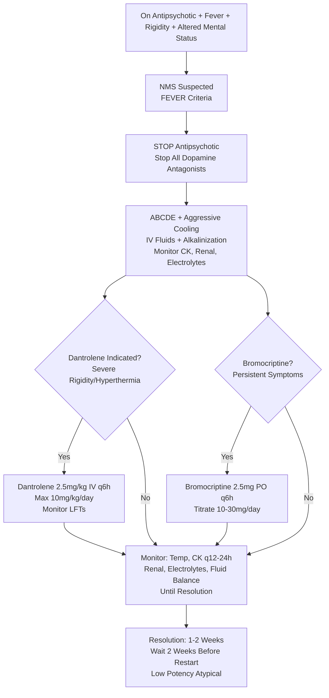

Related: [[General Principles of Poisoning Management]], [[Antidotes Overview]], [[Serotonin Syndrome]], [[Sedative-Hypnotic Toxidrome]], [[Sympathomimetic Toxidrome]]

> [!tip]
> **NMS = dopamine D₂ blockade** — **FEVER mnemonic**: **F**ever, **E**ncephalopathy, **V**itals unstable, **E**nzymes (CK ↑), **R**igidity (lead-pipe). **Onset DAYS** (vs serotonin hours). **Dantrolene** + **bromocriptine** = specific treatments. **Antipsychotic OD**: mainly sedation, hypotension, QT prolongation, seizures (clozapine, olanzapine, quetiapine > risperidone > haloperidol). Key FCPS/MRCP: **rigidity + hyperreflexia = serotonin; rigidity + normal reflexes = NMS**; **onset days vs hours**; **dantrolene 2.5 mg/kg IV q6h**; bromocriptine 2.5 mg PO q6h; avoid depot injections recent.

## 1. Learning Objectives
- Recognize NMS using FEVER criteria
- Differentiate NMS from serotonin syndrome, malignant hyperthermia, sepsis
- Apply dantrolene and bromocriptine protocols
- Manage antipsychotic overdose (sedation, hypotension, QT, seizures)
- Identify high-risk agents (clozapine, olanzapine, depot injections)

## 2. Definition
Neuroleptic Malignant Syndrome (NMS) = idiosyncratic, life-threatening reaction to dopamine D₂ receptor blockade causing **hyperthermia, rigidity, altered mental status, autonomic instability**. Antipsychotic poisoning = overdose toxicity (sedation, hypotension, QT prolongation, seizures).

## 3. Core Physiology
- **NMS**: **D₂ blockade** in nigrostriatal (rigidity), hypothalamic (hyperthermia), mesocortical (encephalopathy) pathways → **abrupt dopamine withdrawal effect**
- **Risk factors**: **high potency** (haloperidol, fluphenazine), **rapid dose escalation**, **depot injections**, **dehydration**, **agitation/restraint**, **concurrent lithium**, **young males**
- **Antipsychotic OD**:
  - **Typical (high potency)**: haloperidol, fluphenazine, trifluoperazine → EPS, QT prolongation, hypotension
  - **Atypical**: clozapine, olanzapine, quetiapine → sedation, hypotension, anticholinergic, seizures (clozapine/olanzapine), metabolic syndrome
  - **Depot**: fluphenazine decanoate, haloperidol decanoate, risperidone microspheres → prolonged toxicity

## 4. Clinical Features

### NMS (FEVER Mnemonic)
| Feature | Description |
|---------|-------------|
| **F**ever | **Hyperthermia > 38.5°C** (often > 40°C) — **universal** |
| **E**ncephalopathy | **Altered mental status** (confusion → coma) — universal |
| **V**itals unstable | Tachycardia, labile BP (HTN → hypotension), tachypnea, diaphoresis |
| **E**nzymes | **CK markedly elevated** (often > 10,000, up to 100,000+) — rhabdomyolysis |
| **R**igidity | **Lead-pipe rigidity** (uniform, all directions) — **universal** |

**Additional**: dysphagia, sialorrhea, incontinence, leukocytosis, elevated LFTs, metabolic acidosis

### Antipsychotic Overdose
- **Sedation/coma** (atypical > typical)
- **Hypotension** (α₁ blockade — atypical > typical)
- **QT prolongation** (risk torsades — thioridazine, ziprasidone, haloperidol IV)
- **Seizures** (clozapine, olanzapine, quetiapine — **lower threshold**)
- **Anticholinergic**: dry mouth, blurred vision, urinary retention, tachycardia (atypical > typical)
- **EPS**: dystonia, parkinsonism, akathisia (typical > atypical)

## 5. Differential Diagnosis
| Feature | NMS | Serotonin Syndrome | Malignant Hyperthermia | Sepsis |
|---------|-----|-------------------|------------------------|--------|
| **Onset** | **Days** (gradual) | **Hours** (rapid) | **Minutes** (anesthetic trigger) | Hours-days |
| **Rigidity** | **Lead-pipe** (uniform) | Variable | **Masseter spasm** → generalized | No |
| **Reflexes** | Normal/↓ | **Hyperreflexia + CLONUS** | Normal | Normal |
| **Clonus** | **NO** | **YES (Hallmark)** | No | No |
| **Trigger** | Dopamine blocker/withdrawal | Serotonergic drug | Volatile anesthetic/succinylcholine | Infection |
| **CK** | **Markedly ↑** | Mild-moderate ↑ | **Massively ↑** | Mild ↑ |

## 6. Investigations
- **CK** — **markedly elevated** (diagnostic clue for NMS)
- **Renal function** — AKI (rhabdo)
- **Electrolytes** — K⁺, Ca²⁺, PO₄³⁻ (rhabdo)
- **LFTs** — transaminitis
- **ABG/VBG** — metabolic acidosis
- **ECG** — QT prolongation, tachycardia
- **Blood cultures** — exclude sepsis
- **CT head** — if focal neuro signs
- **Paracetamol level** (always)
- **Antipsychotic level** — not routinely available

## 7. Management

### 1. Immediate: Stop Offending Agent
- **Discontinue ALL antipsychotics** (and dopamine antagonists: metoclopramide, prochlorperazine)

### 2. Supportive Care (Mainstay)
- **ABCDE**: airway protection (dysphagia, coma), ventilation if needed
- **Aggressive cooling** for hyperthermia > 39°C (evaporative, ice packs, cold IV fluids, paralysis + ventilation if refractory)
- **IV fluids**: aggressive hydration for rhabdo (target UOP 2-3 mL/kg/hr), alkalinize urine (NaHCO₃)
- **Correct electrolytes**: K⁺, Ca²⁺, PO₄³⁻
- **Monitor**: continuous ECG, temp, CK q12-24h, renal function, fluid balance

### 3. Specific Treatments for NMS
#### **Dantrolene** (Muscle Relaxant)
- **Mechanism**: inhibits Ca²⁺ release from sarcoplasmic reticulum → ↓ muscle rigidity → ↓ heat production
- **Dose**: **2.5 mg/kg IV** (max 10 mg/kg/day) q6h; **PO 25-50 mg q6h** if IV unavailable
- **Duration**: until rigidity resolves (usually 1-3 days)
- **Adverse**: hepatotoxicity (monitor LFTs), muscle weakness, sedation

#### **Bromocriptine** (Dopamine Agonist)
- **Mechanism**: D₂ agonist — reverses dopamine blockade
- **Dose**: **2.5 mg PO/NG q6h** (titrate to 10-30 mg/day)
- **Duration**: 5-10 days (taper slowly to avoid rebound)
- **Caution**: hypotension, nausea, psychiatric worsening

#### **Alternative/Adjunct**
- **Amantadine** (dopamine release/agonist) — 100-200 mg PO bid
- **Levodopa/carbidopa** — historical
- **ECT** — refractory cases

### 4. Antipsychotic Overdose Management
- **Activated charcoal**: 1 g/kg if < 1-2h (delayed gastric emptying from anticholinergic)
- **QT prolongation**: magnesium sulfate 2g IV, correct K⁺/Mg²⁺, avoid QT-prolonging drugs
- **Seizures**: benzodiazepines (lorazepam/diazepam) — avoid phenytoin
- **Hypotension**: fluids → norepinephrine (avoid pure α-agonists due to α₁ blockade)
- **Dystonia**: benztropine 1-2 mg IV/IM or diphenhydramine 25-50 mg IV

### 5. Decontamination
- **WBI**: depot injections not applicable; consider for sustained-release oral (rare)

### 6. Reintroduction of Antipsychotic
- **Wait 2 weeks** after NMS resolution
- **Low potency atypical** (quetiapine, aripiprazole) preferred
- **Avoid** high potency typical, depot initially
- **Low dose, slow titration**

## 8. Complications
- Rhabdomyolysis → AKI (major)
- DIC (severe hyperthermia)
- Aspiration pneumonia (dysphagia, sedation)
- DVT/PE (immobility)
- Permanent neurological deficits (rare)
- Death (5-20% if untreated)

## 9. Prognosis
- **Good with early recognition** — most recover fully in 1-2 weeks
- **Mortality**: 5-10% (delayed recognition, severe hyperthermia, DIC)
- **Recurrence risk** if rechallenged with same agent (~30%)

## 10. FCPS/MRCP High-Yield Points
1. **FEVER** = NMS mnemonic (Fever, Encephalopathy, Vitals unstable, Enzymes↑, Rigidity)
2. **Lead-pipe rigidity** = NMS; **clonus + hyperreflexia** = serotonin syndrome
3. **Onset**: NMS = **days**; serotonin = **hours**
4. **Dantrolene 2.5 mg/kg IV q6h** (max 10 mg/kg/day)
5. **Bromocriptine 2.5 mg PO q6h** (titrate to 10-30 mg/day)
6. **CK markedly elevated** (often > 10,000) in NMS
6. **Clozapine/olanzapine** = seizures, hypotension, sedation (atypical OD)
7. **Depot injections** = prolonged toxicity (weeks)
8. **Wait 2 weeks** before restarting antipsychotic post-NMS
9. **Avoid** dopamine antagonists (metoclopramide) during NMS
10. **Differentiate MH**: anesthetic trigger, masseter spasm, succinylcholine

## 11. Common Viva Questions
1. FEVER mnemonic for NMS
2. Differentiate NMS from serotonin syndrome
3. Dantrolene dosing and monitoring
4. Bromocriptine dosing
6. Antipsychotic overdose management (clozapine/olanzapine)
7. Depot injection toxicity
8. Reintroduction of antipsychotic after NMS

## 12. Common Confusions / Exam Traps
- **NMS = serotonin syndrome** → NO (clonus vs rigidity, onset hours vs days)
- **Dantrolene for serotonin syndrome** → NO (no role)
- **Cyproheptadine for NMS** → NO (serotonin drug)
- **Bromocriptine IV** → NO, PO/NG only
- **Depot = immediate toxicity** → NO, prolonged (weeks)
- **High CK = rhabdo only** → in NMS, CK massive = diagnostic
- **Rechallenge same drug** → 30% recurrence

## 13. Mnemonics
- **FEVER**: **F**ever, **E**ncephalopathy, **V**itals unstable, **E**nzymes (CK), **R**igidity
- **NMS vs SEROTONIN**: **N**MS = **R**igidity (lead-pipe), **D**ays; **S**erotonin = **C**lonus, **H**yperreflexia, **H**ours
- **DANTROLENE**: **2.5 mg/kg IV q6h**, **Max 10 mg/kg/day**
- **BROMOCRIPTINE**: **2.5 mg PO q6h**, **Titrate to 10-30 mg/day**

## 14. Mind Map
```mermaid
mindmap
  root((Antipsychotic Poisoning / NMS))
    NMS
      Mechanism: D2 Blockade
      FEVER: Fever, Encephalopathy, Vitals, Enzymes(CK), Rigidity
      Onset: Days
      Rigidity: Lead-pipe
      CK: Markedly Elevated
      DDx: Serotonin (Clonus, Hours), MH (Anesthetic)
    Antipsychotic OD
      Typical: EPS, QT, Hypotension
      Atypical: Sedation, Hypotension, Seizures (Clozapine/Olanzapine), Anticholinergic
      Depot: Prolonged
    Treatment NMS
      Stop Drug
      Cooling
      Dantrolene 2.5mg/kg IV q6h
      Bromocriptine 2.5mg PO q6h
      Fluids + Alkalinization
    Antipsychotic OD
      Charcoal
      QT: Mg, K
      Seizures: Benzo
      Hypotension: Fluids -> NE
```

## 15. Flowchart


## 16. Suggested Visuals / Image Notes
- FEVER mnemonic card
- NMS vs Serotonin vs MH comparison table
- Dantrolene/bromocriptine dosing card

## 17. Suggested Video References
- NMS recognition and management (Toxicology, EM:RAP)

## 18. One-Page Revision Summary
- **NMS**: D₂ blockade → FEVER (Fever, Encephalopathy, Vitals, Enzymes↑, Rigidity)
- **Lead-pipe rigidity** (vs serotonin clonus)
- **Onset DAYS** (vs serotonin hours)
- **CK markedly ↑** (often > 10,000)
- **Dantrolene 2.5 mg/kg IV q6h** (max 10 mg/kg/day)
- **Bromocriptine 2.5 mg PO q6h** (titrate to 10-30 mg/day)
- **Clozapine/olanzapine OD**: seizures, hypotension
- **Depot** = prolonged toxicity
- **Wait 2 weeks** before restarting antipsychotic

## 24-Hour Recall Prompts
- Recite FEVER mnemonic
- State dantrolene and bromocriptine doses
- List 3 differences NMS vs serotonin syndrome
- Describe clozapine/olanzapine OD features

## 7-Day / 15-Day / 30-Day Revision Tracker
- [ ] Day 1 completed
- [ ] 24-hour recall completed
- [ ] Day 7 revision completed
- [ ] Day 15 revision completed
- [ ] Day 30 revision completed

## 19. Must Know / Should Know / Nice to Know
### Must Know
- FEVER mnemonic
- Lead-pipe rigidity (NMS) vs clonus (serotonin)
- Onset days vs hours
- Dantrolene 2.5mg/kg IV q6h
- Bromocriptine 2.5mg PO q6h
- CK markedly elevated
- Clozapine/olanzapine = seizures

### Should Know
- Dantrolene hepatotoxicity monitoring
- Bromocriptine titration
- Depot injection prolonged toxicity
- 2-week wait before restarting antipsychotic
- Avoid dopamine antagonists during NMS

### Nice to Know
- Amantadine alternative
- ECT for refractory NMS
- Malignant hyperthermia differentiation
- Recurrence risk ~30%

## 20. Self-Test Scorecard
- Understanding: /10
- Recall: /10
- MCQ Performance: /10
- SBA Performance: /10
- Viva Confidence: /10
- Total: /50

> [!tip]
> Interpretation: <35 = weak topic, 35-44 = acceptable but insecure, 45+ = strong exam-ready topic.

## 21. Exam Answer Modes
### Long Answer Skeleton
- NMS definition, mechanism (D₂ blockade)
- FEVER criteria detail
- DDx table (NMS vs Serotonin vs MH vs Sepsis)
- Antipsychotic OD features (typical vs atypical)
- Management: supportive → dantrolene → bromocriptine
- Complications, prognosis, rechallenge

### Short Note Skeleton
- FEVER box
- NMS vs Serotonin table
- Dantrolene/Bromocriptine dosing
- Antipsychotic OD features

### Viva One-Liners
- "NMS: FEVER = Fever, Encephalopathy, Vitals, Enzymes(CK), Rigidity"
- "Lead-pipe rigidity = NMS; Clonus/hyperreflexia = Serotonin"
- "Onset: NMS = days; Serotonin = hours"
- "Dantrolene: 2.5mg/kg IV q6h, max 10mg/kg/day"
- "Bromocriptine: 2.5mg PO q6h, titrate to 10-30mg/day"
- "CK > 10,000 = NMS clue"
- "Clozapine/olanzapine OD = seizures, hypotension"
- "Depot = prolonged (weeks)"
- "Wait 2 weeks before restarting antipsychotic"

### Ward-Case Discussion Points
- Patient on haloperidol + lithum + dehydrated → NMS risk
- Clozapine OD → monitor for seizures, QT, myocarditis (rare)
- NMS resolving → when to restart antipsychotic? (2 weeks, low potency atypical)

### Last-Night-Before-Exam Sheet
- FEVER: Fever, Enceph, Vitals, Enzymes, Rigidity
- Lead-pipe = NMS; Clonus = Serotonin
- Dantrolene: 2.5mg/kg IV q6h
- Bromocriptine: 2.5mg PO q6h
- Onset: Days (NMS) vs Hours (Serotonin)
- Clozapine/Olanzapine = Seizures

## 22. Summary
NMS = dopamine D₂ blockade → FEVER (Fever, Encephalopathy, Vitals unstable, Enzymes/CK↑, Rigidity lead-pipe). Onset DAYS. **Dantrolene 2.5 mg/kg IV q6h**; **Bromocriptine 2.5 mg PO q6h**. Antipsychotic OD: atypical (clozapine/olanzapine) = seizures, hypotension; typical = EPS, QT. Depot = prolonged. **Lead-pipe = NMS; Clonus = Serotonin**; **Days = NMS; Hours = Serotonin**. Wait 2 weeks before restarting antipsychotic.

## 23. MCQs (10)
1. Question 1
   A. Option A
   B. Option B
   C. Option C
   D. Option D
   **Answer: A**
   *Explanation: Explanation 1*

2. Question 2
   A. Option A
   B. Option B
   C. Option C
   D. Option D
   **Answer: B**
   *Explanation: Explanation 2*

3. Question 3
   A. Option A
   B. Option B
   C. Option C
   D. Option D
   **Answer: C**
   *Explanation: Explanation 3*

4. Question 4
   A. Option A
   B. Option B
   C. Option C
   D. Option D
   **Answer: D**
   *Explanation: Explanation 4*

5. Question 5
   A. Option A
   B. Option B
   C. Option C
   D. Option D
   **Answer: A**
   *Explanation: Explanation 5*

6. Question 6
   A. Option A
   B. Option B
   C. Option C
   D. Option D
   **Answer: B**
   *Explanation: Explanation 6*

7. Question 7
   A. Option A
   B. Option B
   C. Option C
   D. Option D
   **Answer: C**
   *Explanation: Explanation 7*

8. Question 8
   A. Option A
   B. Option B
   C. Option C
   D. Option D
   **Answer: D**
   *Explanation: Explanation 8*

9. Question 9
   A. Option A
   B. Option B
   C. Option C
   D. Option D
   **Answer: A**
   *Explanation: Explanation 9*

10. Question 10
   A. Option A
   B. Option B
   C. Option C
   D. Option D
   **Answer: B**
   *Explanation: Explanation 10*


## 24. SBA Questions (10)
1. Scenario 1
   A. Option A
   B. Option B
   C. Option C
   D. Option D
   **Answer: A**
   *Explanation: Explanation 1*

2. Scenario 2
   A. Option A
   B. Option B
   C. Option C
   D. Option D
   **Answer: B**
   *Explanation: Explanation 2*

3. Scenario 3
   A. Option A
   B. Option B
   C. Option C
   D. Option D
   **Answer: C**
   *Explanation: Explanation 3*

4. Scenario 4
   A. Option A
   B. Option B
   C. Option C
   D. Option D
   **Answer: D**
   *Explanation: Explanation 4*

5. Scenario 5
   A. Option A
   B. Option B
   C. Option C
   D. Option D
   **Answer: A**
   *Explanation: Explanation 5*

6. Scenario 6
   A. Option A
   B. Option B
   C. Option C
   D. Option D
   **Answer: B**
   *Explanation: Explanation 6*

7. Scenario 7
   A. Option A
   B. Option B
   C. Option C
   D. Option D
   **Answer: C**
   *Explanation: Explanation 7*

8. Scenario 8
   A. Option A
   B. Option B
   C. Option C
   D. Option D
   **Answer: D**
   *Explanation: Explanation 8*

9. Scenario 9
   A. Option A
   B. Option B
   C. Option C
   D. Option D
   **Answer: A**
   *Explanation: Explanation 9*

10. Scenario 10
   A. Option A
   B. Option B
   C. Option C
   D. Option D
   **Answer: B**
   *Explanation: Explanation 10*


## 25. Flashcards
- Q: Flashcard 1 question
  A: Flashcard 1 answer
- Q: Flashcard 2 question
  A: Flashcard 2 answer
- Q: Flashcard 3 question
  A: Flashcard 3 answer
- Q: Flashcard 4 question
  A: Flashcard 4 answer
- Q: Flashcard 5 question
  A: Flashcard 5 answer
- Q: Flashcard 6 question
  A: Flashcard 6 answer
- Q: Flashcard 7 question
  A: Flashcard 7 answer
- Q: Flashcard 8 question
  A: Flashcard 8 answer
- Q: Flashcard 9 question
  A: Flashcard 9 answer
- Q: Flashcard 10 question
  A: Flashcard 10 answer
- Q: Flashcard 11 question
  A: Flashcard 11 answer
- Q: Flashcard 12 question
  A: Flashcard 12 answer
- Q: Flashcard 13 question
  A: Flashcard 13 answer
- Q: Flashcard 14 question
  A: Flashcard 14 answer
- Q: Flashcard 15 question
  A: Flashcard 15 answer

## 26. Answer Key with Explanations
### MCQs
1. **A** - Explanation 1
2. **B** - Explanation 2
3. **C** - Explanation 3
4. **D** - Explanation 4
5. **A** - Explanation 5
6. **B** - Explanation 6
7. **C** - Explanation 7
8. **D** - Explanation 8
9. **A** - Explanation 9
10. **B** - Explanation 10


### SBAs
1. **A** - Explanation 1
2. **B** - Explanation 2
3. **C** - Explanation 3
4. **D** - Explanation 4
5. **A** - Explanation 5
6. **B** - Explanation 6
7. **C** - Explanation 7
8. **D** - Explanation 8
9. **A** - Explanation 9
10. **B** - Explanation 10