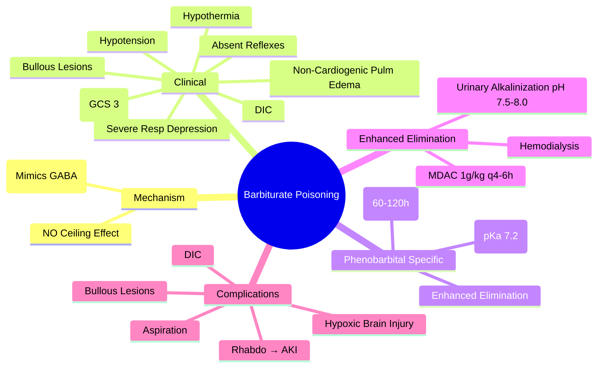
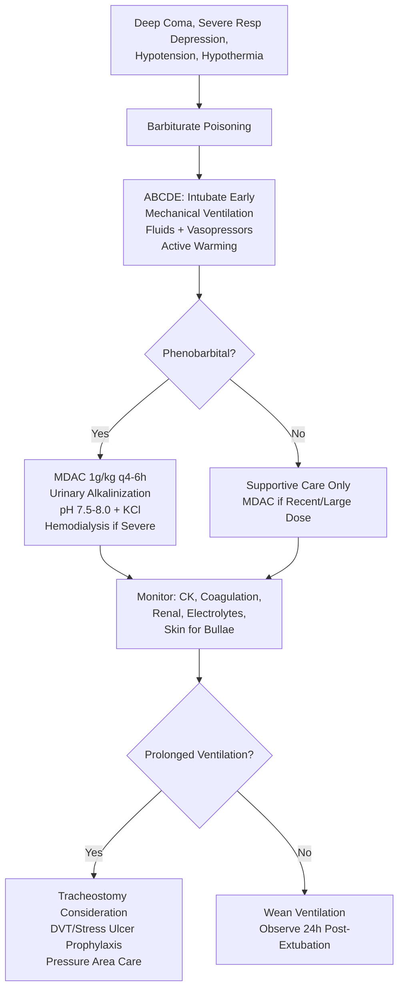

Related: [[General Principles of Poisoning Management]], [[Sedative-Hypnotic Toxidrome]], [[Antidotes Overview]], [[Enhanced Elimination (Dialysis, Hemoperfusion)]]

> [!tip]
> **NO ceiling effect** on respiratory depression (unlike benzodiazepines). **More lethal** than benzo OD. **Phenobarbital** = long-acting, acidic → **MDAC + urinary alkalinization + hemodialysis** enhance elimination. **Bullous skin lesions** from pressure necrosis. **No specific antidote**. Supportive care + enhanced elimination for phenobarbital. Key FCPS/MRCP: coma, respiratory depression, hypotension, hypothermia, bullous lesions, non-cardiogenic pulmonary edema, DIC; phenobarbital MDAC/alkalinization/dialysis.

## 1. Learning Objectives
- Recognize barbiturate toxidrome (deeper coma, severe respiratory depression vs benzo)
- Apply enhanced elimination for phenobarbital (MDAC, alkalinization, dialysis)
- Identify characteristic complications (bullous lesions, pulmonary edema, DIC)
- Differentiate from benzodiazepine poisoning

## 2. Definition
Barbiturate poisoning = toxicity from barbiturates (phenobarbital, thiopental, secobarbital, amobarbital) causing profound CNS depression, respiratory failure, cardiovascular collapse, and multi-organ dysfunction. **No ceiling effect** on respiratory depression.

## 3. Core Physiology
- **Mechanism**: bind GABAₐ receptor β subunit → ↑ duration of Cl⁻ channel opening → **mimics GABA at high dose** (unlike benzos which require GABA)
- **No ceiling effect** → fatal respiratory depression even alone
- **Pharmacokinetics**: 
  - **Ultra-short** (thiopental): rapid redistribution, short duration
  - **Short/Intermediate** (secobarbital, amobarbital): 3-6h
  - **Long-acting** (phenobarbital): **half-life 60-120h**, weak acid (pKa 7.2), renal elimination enhanced by alkalinization
- **Protein binding**: high (phenobarbital ~50%, others higher)
- **Enzyme induction**: chronic use induces CYP450 → tolerance, withdrawal on cessation

## 4. Clinical Features
- **CNS**: **deep coma** (often GCS 3), **absent reflexes**, fixed dilated pupils (late), hypotonia
- **Respiratory**: **severe depression/apnea** (no ceiling), non-cardiogenic pulmonary edema (common)
- **Cardiovascular**: hypotension (vasodilation, myocardial depression), bradycardia, arrhythmias
- **Temperature**: **hypothermia**
- **Skin**: **bullous lesions** (pressure necrosis from prolonged immobilization)
- **Coagulation**: **DIC** (barbiturate effect on coagulation factors)
- **GI**: ileus, aspiration risk
- **Metabolic**: hypoglycemia (children), metabolic acidosis

## 5. Differential Diagnosis
- **Benzodiazepine**: milder coma, preserved reflexes, less respiratory depression, ceiling effect
- **Opioid**: miosis, naloxone responsive
- **Alcohol**: odor, hypoglycemia, ketoacidosis
- **GHB**: rapid coma → rapid arousal (2-4h), myoclonus
- **Structural/Metabolic**: stroke, hypoglycemia, hepatic encephalopathy

## 6. Investigations
- **ABG/VBG**: respiratory acidosis, metabolic acidosis, lactate
- **Electrolytes**: K⁺, glucose (hypoglycemia)
- **Renal function**: AKI (rhabdo, hypotension)
- **Coagulation**: PT/INR, fibrinogen, D-dimer (DIC)
- **CK**: rhabdomyolysis
- **LFTs**: transaminitis
- **CXR**: pulmonary edema, aspiration
- **Phenobarbital level**: if available (guides dialysis)
- **Paracetamol level** (always)

## 7. Management

### 1. Supportive Care (Mainstay)
- **Airway**: **intubate early** (GCS < 8, severe respiratory depression) — **prolonged ventilation often needed**
- **Breathing**: mechanical ventilation, PEEP for pulmonary edema
- **Circulation**: IV fluids for hypotension, **vasopressors (NE)** if refractory
- **Temperature**: active warming for hypothermia
- **Glucose**: monitor q2-4h, treat hypoglycemia
- **Skin**: frequent turning, pressure relief (prevent bullous lesions)
- **DVT prophylaxis**, stress ulcer prophylaxis

### 2. No Specific Antidote
- **Flumazenil**: **NO EFFECT** (not benzo receptor)
- **Naloxone**: no effect

### 3. Decontamination
- **Activated charcoal**: 1 g/kg if < 1-2h (delayed absorption possible)
- **Multiple-dose activated charcoal (MDAC)**: **INDICATED FOR PHENOBARBITAL** — 1 g/kg q4-6h
- **Whole bowel irrigation**: sustained-release formulations

### 4. Enhanced Elimination — **FOR PHENOBARBITAL**
| Method | Indication |
|--------|------------|
| **MDAC** | Phenobarbital (1 g/kg q4-6h) — interrupts enterohepatic recirculation |
| **Urinary alkalinization** | Phenobarbital (pKa 7.2) — target urine pH 7.5-8.0, increases renal clearance 5-10x |
| **Hemodialysis** | Phenobarbital: severe toxicity (coma, refractory hypotension, AKI), level > 100 mg/L, chronic toxicity |
| **Hemoperfusion** | Historical for phenobarbital (charcoal cartridge) |

**Alkalinization protocol**: NaHCO₃ 150 mEq in 1L D5W at 150-250 mL/hr + KCl 20-40 mEq/L, target urine pH 7.5-8.0

### 5. Specific Complication Management
- **Bullous lesions**: wound care, prevent infection, surgical débridement if needed
- **Non-cardiogenic pulmonary edema**: PEEP, diuretics if fluid overloaded
- **DIC**: FFP, platelets, cryoprecipitate, treat underlying cause
- **Rhabdomyolysis**: fluids, alkalinization, monitor CK, K⁺, Ca²⁺
- **DIC**: treat with blood products

## 8. Complications
- Aspiration pneumonia
- Rhabdomyolysis → AKI
- Non-cardiogenic pulmonary edema
- Bullous skin lesions → infection, scarring
- DIC → bleeding/thrombosis
- Hypoxic brain injury
- Death (respiratory failure, cardiovascular collapse)

## 9. Prognosis
- **Higher mortality than benzo** (10-20% for severe phenobarbital)
- **Good with aggressive support + enhanced elimination**
- Chronic phenobarbital toxicity: prolonged course due to long half-life

## 10. FCPS/MRCP High-Yield Points
1. **NO ceiling effect** on respiratory depression → more lethal than benzo
2. **Deeper coma, absent reflexes, severe hypotension** vs benzo
3. **Bullous skin lesions** = characteristic (pressure necrosis)
4. **Non-cardiogenic pulmonary edema** common
5. **DIC** = barbiturate-specific
6. **Phenobarbital enhanced elimination**: **MDAC + urinary alkalinization + hemodialysis**
7. **Urinary alkalinization target pH 7.5-8.0** (phenobarbital pKa 7.2)
8. **MDAC 1 g/kg q4-6h** for phenobarbital
9. **Hypothermia** common
10. **No antidote** (flumazenil/naloxine ineffective)

## 11. Common Viva Questions
1. Barbiturate vs benzodiazepine poisoning differences
2. Phenobarbital enhanced elimination methods
3. Urinary alkalinization for phenobarbital (target pH, K⁺ replacement)
4. Characteristic complications (bullous lesions, pulmonary edema, DIC)
5. Why no flumazenil?

## 12. Common Confusions / Exam Traps
- **Flumazenil works for barbiturates** → NO (different receptor site)
- **Ceiling effect like benzo** → NO, NO ceiling
- **Charcoal alone sufficient for phenobarbital** → NO, needs MDAC + alkalinization + dialysis
- **Urine acidification for phenobarbital** → WRONG, needs ALKALINIZATION
- **All barbiturates same** → phenobarbital unique (long half-life, acidic, dialyzable)

## 13. Mnemonics
- **BARBITURATE**: **B**ullous lesions, **A**pnea (no ceiling), **R**espiratory depression, **B**ullous, **I**ntubation, **T**emperature (hypo), **U**rinary alkalinization (phenobarbital), **R**habdo, **A**cidosis, **T**oxicity higher than benzo, **E**nzyme induction
- **PHENOBARBITAL ELIMINATION**: **M**DAC, **A**lkalinization, **D**ialysis
- **BENZO VS BARB**: **B**enzo = **C**eiling (safer); **B**arb = **B**ad (no ceiling)

## 14. Mind Map

## 15. Flowchart

## 16. Suggested Visuals / Image Notes
- Barbiturate vs benzodiazepine comparison table
- Phenobarbital enhanced elimination flowchart
- Bullous lesion photo

## 17. Suggested Video References
- Barbiturate overdose management (Toxbase)

## 18. One-Page Revision Summary
- **NO ceiling effect** on respiratory depression
- **Deeper coma, absent reflexes, severe hypotension** vs benzo
- **Bullous lesions** = pressure necrosis
- **Non-cardiogenic pulmonary edema** common
- **DIC** = characteristic
- **Phenobarbital**: MDAC 1g/kg q4-6h + urinary alkalinization pH 7.5-8.0 + hemodialysis
- **Hypothermia** common
- **No antidote** (flumazenil/naloxone ineffective)
- **Higher mortality** than benzo (10-20%)

## 24-Hour Recall Prompts
- List 4 differences barbiturate vs benzodiazepine
- State phenobarbital enhanced elimination (3 methods)
- Describe bullous lesions mechanism
- Explain why flumazenil doesn't work

## 7-Day / 15-Day / 30-Day Revision Tracker
- [ ] Day 1 completed
- [ ] 24-hour recall completed
- [ ] Day 7 revision completed
- [ ] Day 15 revision completed
- [ ] Day 30 revision completed

## 19. Must Know / Should Know / Nice to Know
### Must Know
- No ceiling effect on respiratory depression
- Deeper coma, absent reflexes vs benzo
- Bullous lesions, pulmonary edema, DIC
- Phenobarbital: MDAC + alkalinization + dialysis
- Urine pH target 7.5-8.0 for phenobarbital
- No flumazenil, no naloxone

### Should Know
- Hypothermia management
- Non-cardiogenic pulmonary edema = PEEP
- DIC management
- Prolonged ventilation needs tracheostomy

### Nice to Know
- Thiopental ultra-short redistribution
- Barbiturate withdrawal syndrome
- Enzyme induction chronic use

## 20. Self-Test Scorecard
- Understanding: /10
- Recall: /10
- MCQ Performance: /10
- SBA Performance: /10
- Viva Confidence: /10
- Total: /50

> [!tip]
> Interpretation: <35 = weak topic, 35-44 = acceptable but insecure, 45+ = strong exam-ready topic.

## 21. Exam Answer Modes
### Long Answer Skeleton
- Mechanism (GABA-A duration ↑, no ceiling)
- Clinical features (deep coma, resp depression, hypotension)
- Differentiation from benzo
- Phenobarbital specific (half-life, elimination)
- Enhanced elimination (MDAC, alkalinization, HD)
- Complications (bullous, pulmonary edema, DIC)
- Prognosis

### Short Note Skeleton
- Barbiturate vs benzo table
- Phenobarbital elimination box
- Complications list

### Viva One-Liners
- "Barbiturate: NO ceiling effect on respiratory depression — more lethal"
- "Barbiturate vs benzo: deeper coma, absent reflexes, hypotension, bullous lesions"
- "Phenobarbital elimination: MDAC + urinary alkalinization (pH 7.5-8) + hemodialysis"
- "Flumazenil NO effect on barbiturates (different receptor)"
- "Bullous lesions = pressure necrosis from prolonged immobilization"
- "Non-cardiogenic pulmonary edema and DIC characteristic"

### Ward-Case Discussion Points
- Phenobarbital OD with level 120 mg/L → MDAC + alkalinization + HD
- Patient with bullous lesions on back/buttocks → pressure relief, wound care
- Elderly on phenobarbital + ACEi → toxicity at "therapeutic" level

### Last-Night-Before-Exam Sheet
- NO Ceiling Effect
- Deep Coma, Absent Reflexes
- Bullous, Pulm Edema, DIC
- Phenobarbital: MDAC + Alk + HD
- Urine pH 7.5-8.0
- No Flumazenil

## 22. Summary
Barbiturate poisoning = GABAₐ duration ↑ (mimics GABA) → **NO ceiling on respiratory depression**. Deeper coma, absent reflexes, severe hypotension, hypothermia vs benzo. **Bullous lesions, non-cardiogenic pulmonary edema, DIC** characteristic. **Phenobarbital**: long half-life, weak acid → **MDAC 1g/kg q4-6h + urinary alkalinization pH 7.5-8.0 + hemodialysis**. No antidote. Higher mortality (10-20%).

## 23. MCQs (10)
1. Question 1
   A. Option A
   B. Option B
   C. Option C
   D. Option D
   **Answer: A**
   *Explanation: Explanation 1*

2. Question 2
   A. Option A
   B. Option B
   C. Option C
   D. Option D
   **Answer: B**
   *Explanation: Explanation 2*

3. Question 3
   A. Option A
   B. Option B
   C. Option C
   D. Option D
   **Answer: C**
   *Explanation: Explanation 3*

4. Question 4
   A. Option A
   B. Option B
   C. Option C
   D. Option D
   **Answer: D**
   *Explanation: Explanation 4*

5. Question 5
   A. Option A
   B. Option B
   C. Option C
   D. Option D
   **Answer: A**
   *Explanation: Explanation 5*

6. Question 6
   A. Option A
   B. Option B
   C. Option C
   D. Option D
   **Answer: B**
   *Explanation: Explanation 6*

7. Question 7
   A. Option A
   B. Option B
   C. Option C
   D. Option D
   **Answer: C**
   *Explanation: Explanation 7*

8. Question 8
   A. Option A
   B. Option B
   C. Option C
   D. Option D
   **Answer: D**
   *Explanation: Explanation 8*

9. Question 9
   A. Option A
   B. Option B
   C. Option C
   D. Option D
   **Answer: A**
   *Explanation: Explanation 9*

10. Question 10
   A. Option A
   B. Option B
   C. Option C
   D. Option D
   **Answer: B**
   *Explanation: Explanation 10*

## 24. SBA Questions (10)
1. Scenario 1
   A. Option A
   B. Option B
   C. Option C
   D. Option D
   **Answer: A**
   *Explanation: Explanation 1*

2. Scenario 2
   A. Option A
   B. Option B
   C. Option C
   D. Option D
   **Answer: B**
   *Explanation: Explanation 2*

3. Scenario 3
   A. Option A
   B. Option B
   C. Option C
   D. Option D
   **Answer: C**
   *Explanation: Explanation 3*

4. Scenario 4
   A. Option A
   B. Option B
   C. Option C
   D. Option D
   **Answer: D**
   *Explanation: Explanation 4*

5. Scenario 5
   A. Option A
   B. Option B
   C. Option C
   D. Option D
   **Answer: A**
   *Explanation: Explanation 5*

6. Scenario 6
   A. Option A
   B. Option B
   C. Option C
   D. Option D
   **Answer: B**
   *Explanation: Explanation 6*

7. Scenario 7
   A. Option A
   B. Option B
   C. Option C
   D. Option D
   **Answer: C**
   *Explanation: Explanation 7*

8. Scenario 8
   A. Option A
   B. Option B
   C. Option C
   D. Option D
   **Answer: D**
   *Explanation: Explanation 8*

9. Scenario 9
   A. Option A
   B. Option B
   C. Option C
   D. Option D
   **Answer: A**
   *Explanation: Explanation 9*

10. Scenario 10
   A. Option A
   B. Option B
   C. Option C
   D. Option D
   **Answer: B**
   *Explanation: Explanation 10*

## 25. Flashcards
- Q: Flashcard 1 question
  A: Flashcard 1 answer
- Q: Flashcard 2 question
  A: Flashcard 2 answer
- Q: Flashcard 3 question
  A: Flashcard 3 answer
- Q: Flashcard 4 question
  A: Flashcard 4 answer
- Q: Flashcard 5 question
  A: Flashcard 5 answer
- Q: Flashcard 6 question
  A: Flashcard 6 answer
- Q: Flashcard 7 question
  A: Flashcard 7 answer
- Q: Flashcard 8 question
  A: Flashcard 8 answer
- Q: Flashcard 9 question
  A: Flashcard 9 answer
- Q: Flashcard 10 question
  A: Flashcard 10 answer
- Q: Flashcard 11 question
  A: Flashcard 11 answer
- Q: Flashcard 12 question
  A: Flashcard 12 answer
- Q: Flashcard 13 question
  A: Flashcard 13 answer
- Q: Flashcard 14 question
  A: Flashcard 14 answer
- Q: Flashcard 15 question
  A: Flashcard 15 answer

## 26. Answer Key with Explanations
### MCQs
1. **A** - Explanation 1
2. **B** - Explanation 2
3. **C** - Explanation 3
4. **D** - Explanation 4
5. **A** - Explanation 5
6. **B** - Explanation 6
7. **C** - Explanation 7
8. **D** - Explanation 8
9. **A** - Explanation 9
10. **B** - Explanation 10

### SBAs
1. **A** - Explanation 1
2. **B** - Explanation 2
3. **C** - Explanation 3
4. **D** - Explanation 4
5. **A** - Explanation 5
6. **B** - Explanation 6
7. **C** - Explanation 7
8. **D** - Explanation 8
9. **A** - Explanation 9
10. **B** - Explanation 10

## PasTest Scenario SBAs (Clinical Vignettes)

> **Auto-generated PasTest/Mediscope-style scenario SBAs** grounded in the authored source. Each scenario tests a real clinical fact (triad, specific sign, contraindication, trial, first-line Rx) extracted from the topic. *Source: Ch 11: Poisoning — Barbiturate Poisoning*

**Q1.** What is the most appropriate first-line therapy for Barbiturate Poisoning?

  - **A.** Glucose
  - **B.** An advanced/surgical therapy reserved for refractory disease
  - **C.** Symptomatic treatment only, no disease-modifying therapy
  - **D.** Empiric broad-spectrum therapy without specific indication

  > **Answer: A** — Glucose
  >
  > *Source:* **Glucose**: monitor q2-4h, treat hypoglycemia

