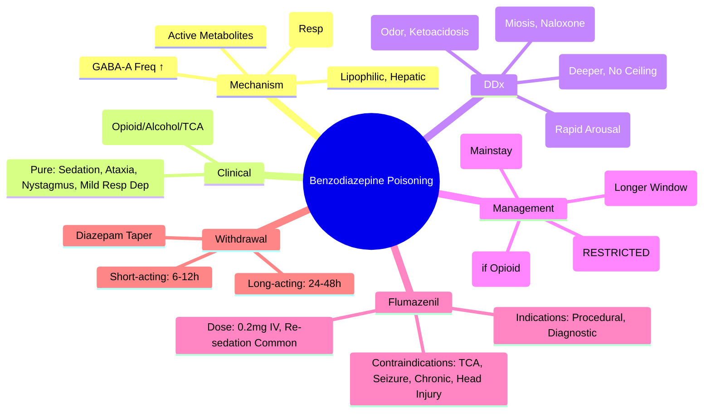

Related: [[General Principles of Poisoning Management]], [[Sedative-Hypnotic Toxidrome]], [[Antidotes Overview]], [[Flumazenil]], [[Opioid Toxidrome]] (mixed OD)

> [!tip]
> Benzodiazepine OD alone is **rarely fatal** (ceiling effect on respiratory depression). Fatalities almost always from **mixed OD** (opioid, alcohol, TCA). Flumazenil is **NOT recommended for routine reversal** — indications: iatrogenic procedural oversedation, diagnostic uncertainty. CONTRAINDICATED: TCA co-ingestion (QRS widening), seizure disorder, chronic benzo use, head injury. Key FCPS/MRCP: supportive care, airway protection, Observe 6h+ (longer if active metabolites). Psych assessment mandatory.

## 1. Learning Objectives
- Recognize benzodiazepine toxidrome (CNS depression, ataxia, dysarthria, nystagmus)
- Differentiate pure benzo OD from mixed OD (opioid, alcohol, TCA)
- Apply flumazenil indications and CONTRAINDICATIONS
- Manage respiratory depression, hypotension
- Determine observation duration based on half-life and active metabolites
- Address withdrawal in chronic users

## 2. Definition
Benzodiazepine poisoning = excessive GABAₐ receptor potentiation causing dose-dependent CNS depression (sedation → coma), ataxia, dysarthria, nystagmus, anterograde amnesia, with ceiling effect on respiratory depression when ingested alone.

## 3. Core Physiology
- **Mechanism**: bind α/γ subunit interface → ↑ frequency of Cl⁻ channel opening (require GABA present)
- **Ceiling effect**: maximal respiratory depression ~30-40% below baseline (alone) — **not fatal alone**
- **Pharmacokinetics**: lipophilic → rapid CNS entry; hepatic metabolism (CYP3A4, CYP2C19); **active metabolites** (diazepam → nordazepam, oxazepam, temazepam; half-life up to 100h)
- **Receptor subtypes**: BZ1 (α₁) = sedation, hypnosis, anterograde amnesia; BZ2 (α₂, α₃, α₅) = anxiolysis, muscle relaxant, anticonvulsant
- **Synergy**: additive/supra-additive with **opioids, alcohol, barbiturates, GHB, antidepressants** → fatal respiratory depression

## 4. Clinical Features

### Pure Benzodiazepine OD
- **CNS**: drowsiness → coma (GCS 8-15 typically), **paradoxical agitation** (elderly, children, high dose)
- **Motor**: ataxia, dysarthria, **nystagmus** (horizontal gaze), hypotonia, hyporeflexia
- **Respiratory**: mild depression (RR 8-12) — **severe only with co-ingestants**
- **Cardiovascular**: mild hypotension (vasodilation), bradycardia — **rarely shock**
- **Pupils**: normal or slightly constricted (not pinpoint)
- **GI**: nausea, vomiting

### Mixed OD (COMMON in DSH)
- **Benzo + Opioid**: profound respiratory depression, pinpoint pupils, coma
- **Benzo + Alcohol**: severe CNS depression, respiratory depression, hypotension
- **Benzo + TCA**: QRS widening, seizures, anticholinergic features, coma
- **Benzo + Barbiturate**: profound coma, respiratory failure, hypotension

## 5. Differential Diagnosis
- **Opioid**: pinpoint pupils, naloxone responsive
- **Barbiturate**: deeper coma, severe respiratory depression, hypotension, no ceiling
- **Alcohol**: odor, metabolic acidosis (ketoacidosis), hypoglycemia
- **GHB/GBL**: rapid coma → rapid arousal (2-4h), myoclonus, vomiting
- **Anticholinergic**: dry, hot, dilated, delirium, tachy
- **Metabolic**: hypoglycemia, hepatic encephalopathy, uremia
- **Structural**: stroke, ICH

## 6. Investigations
- **Glucose** (bedside) — mandatory
- **VBGA**: respiratory acidosis (if mixed), usually normal in pure
- **Paracetamol level** (always)
- **Ethanol level**
- **Urine drug screen**: benzodiazepines (qualitative; oxazepam/nordazepam detected; **misses some**: alprazolam, clonazepam, lorazepam, midazolam — limited utility)
- **ECG**: usually normal; QRS widening → TCA co-ingestion
- **Specific levels**: not routinely available acutely
- **CXR**: aspiration

## 7. Management

### 1. Supportive Care (MAINSTAY)
- **Airway**: protect if GCS < 8, loss of gag, respiratory depression — **intubate**
- **Breathing**: high-flow O₂, NIV/ventilation if needed
- **Circulation**: IV fluids for hypotension (rare); vasopressors if refractory
- **Temperature**: warming if hypothermic
- **Thiamine 100mg IV** → glucose if hypoglycemic
- **Monitoring**: continuous SpO₂, ECG, GCS q15-30min

### 2. Flumazenil — **RESTRICTED INDICATIONS**
- **Mechanism**: competitive antagonist at BZD site on GABAₐ receptor
- **Indications (ONLY)**:
  1. **Iatrogenic procedural oversedation** (endoscopy, ICU sedation reversal) — **preferred**
  2. **Diagnostic uncertainty** in coma (exclude benzo) — controversial, some guidelines support
  3. **Pediatric accidental ingestion** — some guidelines support (risk of seizures low in naive)
- **CONTRAINDICATIONS (ABSOLUTE — SEIZURE RISK)**:
  - **TCA co-ingestion** (or unknown OD with QRS > 100 ms) — unmasks TCA seizure potential
  - **Known seizure disorder / epilepsy**
  - **Chronic benzodiazepine use / dependence** — precipitated withdrawal (seizures, delirium)
  - **Head injury / raised ICP** — seizure risk
  - **Cyclic antidepressant ingestion** (same as TCA)
  - **Pregnancy** (relative — uterine stimulation)
- **Dose**: 0.2 mg IV over 30 sec, repeat 0.3 mg q1 min (max 1 mg, then 1 mg q1h if re-sedation). Child: 0.01 mg/kg (max 0.2 mg).
- **Onset**: 1-2 min. Peak: 6-10 min. **Duration**: 30-60 min (shorter than benzo) → **re-sedation COMMON** → monitor 2-4h post last dose.
- **Reversal incomplete** in mixed OD (opioid/alcohol component unaffected)

### 3. Naloxone Trial
- If opioid co-ingestion suspected: 0.04-0.4 mg IV titrated to RR > 10

### 4. Decontamination
- **Activated charcoal**: 1 g/kg if < 1-2h, airway protected. **Benzo delay gastric emptying** → may be effective up to 4-6h post-ingestion.
- **Gastric lavage**: rarely indicated
- **WBI**: sustained-release formulations (rare), body packers

### 5. Enhanced Elimination
- **NOT effective**: hemodialysis, hemoperfusion, MDAC (high protein binding, large Vd)
- **Flumazenil infusion** NOT recommended for elimination

### 6. Withdrawal (Chronic User)
- **Onset**: short-acting (alprazolam, lorazepam) 6-12h; long-acting (diazepam) 24-48h
- **Features**: anxiety, insomnia, tremor, tachycardia, hypertension, nausea, seizures, delirium, psychosis
- **Management**: **Diazepam taper** (long half-life, active metabolites). Convert to diazepam equivalent, reduce 10-25% every 1-2 weeks.
- **Acute withdrawal in OD setting**: diazepam 10-20 mg IV/PO q6h PRN (CIWA-B adapted). Avoid flumazenil.

## 8. Complications
- Aspiration pneumonia (loss of gag, vomiting)
- Rhabdomyolysis (prolonged immobilization)
- Hypothermia
- Anoxic brain injury (if mixed OD with respiratory depression)
- Pressure ulcers, nerve compression
- Withdrawal seizures, delirium (chronic users)
- Paradoxical agitation (elderly, children)

## 9. Prognosis
- **Pure benzo OD**: excellent — supportive care, rarely fatal
- **Mixed OD**: mortality from co-ingestants (opioid, alcohol, TCA)
- **Chronic use**: withdrawal complications if not managed

## 10. FCPS/MRCP High-Yield Points
1. **Pure benzo OD rarely fatal** — ceiling effect on respiratory depression
2. **Fatalities = mixed OD** (opioid, alcohol, TCA, barbiturate)
3. **Flumazenil NOT for routine OD** — indications: procedural oversedation, diagnostic uncertainty
4. **Flumazenil CONTRAINDICATIONS** (examinable): TCA/QRS widening, seizure disorder, chronic benzo use, head injury
5. **Re-sedation common** post-flumazenil (duration 30-60 min < benzo) → monitor 2-4h
6. **Active metabolites**: diazepam → nordazepam/oxazepam (half-life up to 100h) → prolonged effect
7. **Urine screen misses**: alprazolam, clonazepam, lorazepam, midazolam
8. **Observation**: 6h minimum; longer if long-acting (diazepam, clonazepam) or active metabolites
9. **Psych assessment mandatory** for DSH
10. **Paradoxical agitation**: elderly, children, high dose

## 11. Common Viva Questions
1. Why is pure benzodiazepine overdose rarely fatal?
2. Flumazenil indications AND contraindications
3. Why is flumazenil not recommended for routine overdose reversal?
4. Mixed OD presentations (benzo+opioid, benzo+alcohol, benzo+TCA)
5. Observation duration based on half-life
6. Active metabolites of diazepam
7. Benzodiazepine withdrawal management
8. Urine drug screen limitations

## 12. Common Confusions / Exam Traps
- **Flumazenil for routine benzo OD** → NO (no mortality benefit, re-sedation, seizure risk)
- **Flumazenil in unknown OD** → dangerous if TCA co-ingestion (QRS widening = NO flumazenil)
- **Flumazenil in chronic user** → precipitated withdrawal seizures
- **Naloxone in pure benzo OD** → no effect (but give if opioid possible)
- **"Awake" post-flumazenil ≠ safe** → re-sedation in 30-60 min
- **Urine screen negative ≠ no benzo** (misses alprazolam, clonazepam, lorazepam, midazolam)
- **Diazepam long half-life** → observe 12-24h if large ingestion

## 13. Mnemonics
- **FLUMAZENIL NO-GO**: **T**CA/QRS, **S**eizure Hx, **C**hronic Benzo, **H**ead Injury, **P**regnancy (relative)
- **BENZO CEILING**: **B**enzo = **C**eiling effect on respiratory depression (alone)
- **MIXED OD = DEATH**: **B**enzo + **O**pioid/**A**lcohol/**T**CA = **F**atal
- **DIAZEPAM METABOLITES**: **N**ordazepam, **O**xazepam, **T**emazepam = **N**OT short (long half-lives)
- **URINE SCREEN MISSES**: **A**lprazolam, **C**lonazepam, **L**orazepam, **M**idazolam = **A**-**C**-**L**-**M**

## 14. Mind Map


## 15. Flowchart
```mermaid
flowchart TD
  A[Sedated, Ataxic, Nystagmus, Normal Pupils, Mild Resp Dep] --> B[Benzodiazepine Toxidrome]
  B --> C[ABCDE: Intubate if GCS<8 or RR<10\nThiamine → Glucose\nParacetamol Level\nEthanol Level]
  C --> D{Mixed OD Suspected?}
  D -->|Opioid Co-ingestion| E[Naloxone 0.04-0.4mg IV\nTitrate to RR>10]
  D -->|Alcohol| F[Supportive\nThiamine, Electrolytes]
  D -->|TCA (QRS>100)| G[NaHCO3 for QRS\nNO FLUMAZENIL]
  D -->|Pure/Unknown| H[Supportive Care\nObserve 6-12h\nLonger if Diazepam/Clonazepam]
  E --> I[Monitor for Re-sedation\nObs 6h Post Naloxone]
  F --> H
  G --> H
  H --> J{Flumazenil Indicated?}
  J -->|Procedural/Diagnostic\nNO Contraindications| K[Flumazenil 0.2mg IV\nRepeat q1min max 1mg\nMonitor 2-4h Post]
  J -->|Contraindications\nor Routine OD| L[NO Flumazenil\nSupportive Only]
  K --> M[Re-sedation Expected]
  L --> M
  M --> N[Obs: 6h Min\n12-24h Long-acting\nPsych Assessment if DSH]
```

## 16. Suggested Visuals / Image Notes
- Flumazenil contraindications poster
- Diazepam metabolic pathway
- Observation duration by agent

## 17. Suggested Video References
- Flumazenil debate (EM:RAP, Toxicology)
- Benzodiazepine withdrawal management

## 18. One-Page Revision Summary
- **Pure benzo OD**: sedation, ataxia, nystagmus, mild resp dep — **rarely fatal** (ceiling effect)
- **Mixed OD = fatal** (opioid, alcohol, TCA)
- **Flumazenil**: INDICATIONS = procedural oversedation, diagnostic uncertainty ONLY
- **CONTRAINDICATIONS**: TCA/QRS>100, seizure hx, chronic benzo, head injury
- **Dose**: 0.2mg IV q1min max 1mg; re-sedation common (30-60 min duration) → monitor 2-4h
- **Active metabolites**: diazepam → nordazepam, oxazepam (half-life up to 100h)
- **Urine screen misses**: alprazolam, clonazepam, lorazepam, midazolam
- **Obs**: 6h min; 12-24h if long-acting/active metabolites
- **Withdrawal**: diazepam taper; acute = diazepam PRN

## 24-Hour Recall Prompts
- List 5 flumazenil contraindications
- Why is pure benzo OD rarely fatal?
- Contrast flumazenil indications vs contraindications
- State observation duration by agent type

## 7-Day / 15-Day / 30-Day Revision Tracker
- [ ] Day 1 completed
- [ ] 24-hour recall completed
- [ ] Day 7 revision completed
- [ ] Day 15 revision completed
- [ ] Day 30 revision completed

## 19. Must Know / Should Know / Nice to Know
### Must Know
- Pure benzo OD = ceiling effect = rarely fatal
- Fatalities = mixed OD (opioid, alcohol, TCA)
- Flumazenil restricted indications (procedural, diagnostic)
- Flumazenil contraindications (TCA, seizure hx, chronic use, head injury)
- Re-sedation post-flumazenil
- Active metabolites of diazepam
- Urine screen limitations
- Psych assessment mandatory

### Should Know
- Flumazenil dose and monitoring
- Mixed OD specific management
- Withdrawal: diazepam taper, CIWA-B
- Paradoxical agitation (elderly, kids)
- Charcoal window extended

### Nice to Know
- Specific agent half-lives (alprazolam 11h, lorazepam 12h, clonazepam 30-40h, diazepam 48h+)
- Flumazenil in pediatric accidental ingestion
- Dexmedetomidine for withdrawal
- Z-drugs vs benzo differences

## 20. Self-Test Scorecard
- Understanding: /10
- Recall: /10
- MCQ Performance: /10
- SBA Performance: /10
- Viva Confidence: /10
- Total: /50

> [!tip]
> Interpretation: <35 = weak topic, 35-44 = acceptable but insecure, 45+ = strong exam-ready topic.

## 21. Exam Answer Modes
### Long Answer Skeleton
- Definition + mechanism + ceiling effect
- Clinical features (pure vs mixed)
- DDx table
- Investigations
- Management: supportive → flumazenil (restricted) → naloxone trial → charcoal
- Flumazenil: mechanism, dose, indications, CONTRAINDICATIONS (emphasize)
- Withdrawal
- Complications + prognosis

### Short Note Skeleton
- Flumazenil contraindications
- Pure vs mixed OD outcomes
- Diazepam metabolites
- Urine screen misses

### Viva One-Liners
- "Pure benzo OD: ceiling on respiratory depression — rarely fatal"
- "Flumazenil: ONLY for procedural oversedation or diagnostic uncertainty"
- "Flumazenil NO-GO: TCA/QRS>100, seizure history, chronic benzo use, head injury"
- "Re-sedation post-flumazenil: duration 30-60 min, monitor 2-4h"
- "Diazepam metabolites: nordazepam, oxazepam — half-life up to 100h"
- "Urine screen misses: ACLM (alprazolam, clonazepam, lorazepam, midazolam)"
- "Mixed benzo+opioid+alcohol = fatal respiratory depression"

### Ward-Case Discussion Points
- Unknown coma → flumazenil decision depends on ECG (QRS) and history
- Chronic benzo user found comatose → flumazenil = withdrawal seizures
- "Awake" post-flumazenil → must observe 2-4h for re-sedation

### Last-Night-Before-Exam Sheet
- Ceiling effect = pure benzo safe
- Mixed = fatal
- Flumazenil: Procedural/Diagnostic ONLY
- NO-GO: TCA, Seizure, Chronic, Head
- Re-sedation: 30-60 min
- Diazepam → Nord/Oxa (long)
- Screen misses: ACLM
- Obs: 6h min, 12-24h long-acting
- Psych mandatory

## 22. Summary
Benzodiazepine poisoning alone has ceiling effect on respiratory depression — rarely fatal. Fatalities from mixed OD (opioid, alcohol, TCA). Flumazenil restricted to procedural oversedation and diagnostic uncertainty; CONTRAINDICATED in TCA co-ingestion (QRS widening), seizure disorder, chronic benzo use, head injury. Re-sedation common (30-60 min duration). Active metabolites of diazepam prolong effect. Urine screen misses ACLM. Observe 6h+ (longer for long-acting). Psych assessment mandatory for DSH.

## 23. MCQs (10)
1. Benzodiazepine toxidrome?
   A. Mydriasis, tachycardia, hypertension
   B. CNS depression, respiratory depression (mild), normal/small pupils, hypotonia
   C. Pinpoint pupils, severe respiratory depression
   D. Hyperthermia, rigidity, hyperreflexia
   **Answer: B**
   *Explanation: Benzo: CNS depression, mild respiratory depression (usually not severe alone), normal or small pupils (NOT pinpoint), hypotonia, ataxia. Synergy with alcohol/opioids.*

2. Flumazenil use criteria?
   A. All benzo overdoses
   B. Pure benzo overdose ONLY, no seizure risk, no TCA co-ingestion, not chronic benzo use
   C. Only in children
   D. Only with opioid co-ingestion
   **Answer: B**
   *Explanation: Flumazenil ONLY for: pure benzo overdose, no seizure risk, no TCA co-ingestion, not chronic benzo use. Contraindicated in TCA (unmasks seizures), seizure disorder (withdrawal seizures), chronic use (withdrawal).*

3. Flumazenil dose?
   A. 0.2 mg IV over 15 sec, repeat q1min to max 3 mg
   B. 2 mg IV once
   C. 10 mg IV
   D. 0.04 mg IV
   **Answer: A**
   *Explanation: Flumazenil: 0.2 mg IV over 15 sec, repeat 0.2 mg q1min to max 3 mg. Onset 1-2 min, duration 0.7-1.3h (shorter than benzos → re-sedation common).*

4. Benzo + opioid overdose - naloxone given, patient arousable but still respiratory depression. Why?
   A. Naloxone dose too low
   B. Benzo respiratory depression not reversed by naloxone
   C. Opioid tolerance
   D. Sepsis
   **Answer: B**
   *Explanation: Mixed OD common. Naloxone reverses ONLY opioid component. Benzo/alcohol respiratory depression persists. Supportive ventilation. Flumazenil ONLY if pure benzo criteria met.*

5. Z-drug (zolpidem/zopiclone) overdose - management?
   A. Flumazenil ineffective
   B. Flumazenil partially effective (same GABA-A site)
   C. Specific antidote zolpidem-reverser
   D. Naloxone
   **Answer: B**
   *Explanation: Z-drugs act on GABA-A (BZ1/ω1) subtype. Flumazenil partially reverses but less predictable. Supportive care mainstay. Respiratory depression less than benzos.*

6. Chronic benzo use + flumazenil = ?
   A. Safe reversal
   B. Withdrawal seizures risk
   C. No effect
   D. Prolonged sedation
   **Answer: B**
   *Explanation: Flumazenil in chronic benzo use → acute withdrawal → seizures, agitation, delirium. Contraindicated. Supportive care + slow taper for chronic use.*

7. Benzo withdrawal syndrome (PRIME)?
   A. Psychosis, Rebound anxiety, Insomnia, Myoclonus, Epilepsy (seizures)
   B. Panic, Restlessness, Irritability, Muscle aches, Exhaustion
   C. Paranoia, Rhabdo, Infection, Malaise, Edema
   D. Pain, Rigors, Incontinence, Mydriasis, Euphoria
   **Answer: A**
   *Explanation: PRIME: Psychosis, Rebound anxiety, Insomnia, Myoclonus, Epilepsy (seizures). Onset 6-12h (short-acting) to 2-3 days (long-acting). Treat with benzo taper.*

8. Alprazolam overdose - specific feature?
   A. More respiratory depression
   B. More seizures in withdrawal
   C. No difference from other benzos
   D. Cardiogenic shock
   **Answer: B**
   *Explanation: Alprazolam (short-acting, high potency) → more severe withdrawal, higher seizure risk. Also more depressive CNS effects in overdose.*

9. Benzo overdose - primary cause of death?
   A. Respiratory depression alone
   B. Mixed overdose (opioids, alcohol) → synergistic respiratory depression
   C. Cardiac arrhythmia
   D. Seizures
   **Answer: B**
   *Explanation: Benzo alone rarely causes fatal respiratory depression. Death usually from SYNERGISTIC respiratory depression with opioids, alcohol, other sedatives.*

10. Flumazenil half-life vs benzo half-life?
   A. Flumazenil longer
   B. Flumazenil shorter (0.7-1.3h) → re-sedation common
   C. Equal
   D. Unpredictable
   **Answer: B**
   *Explanation: Flumazenil t½ 0.7-1.3h < most benzos → re-sedation COMMON. Monitor 2-3h post-flumazenil. Consider infusion if repeated doses needed.*

11. Benzo overdose - activated charcoal role?
   A. Always indicated
   B. Rarely indicated (poor adsorption, aspiration risk in sedated)
   C. Only if < 1h
   D. Contraindicated
   **Answer: B**
   *Explanation: Charcoal poorly adsorbs benzos. Aspiration risk high in sedated patients. Rarely indicated. Supportive care mainstay.*

## 24. SBA Questions (10)
1. Patient found drowsy with empty diazepam bottle. GCS 10, RR 12, pupils normal. Best management?
   A. Flumazenil 0.2mg IV
   B. Supportive care, observe, psych assessment
   C. Naloxone
   D. Activated charcoal
   **Answer: B**
   *Explanation: Pure benzo overdose: supportive care. Flumazenil rarely needed (short duration, re-sedation, contraindications). Observe for respiratory depression (synergy with alcohol). Psych assessment mandatory.*

2. Benzo + alcohol overdose. RR 8, GCS 6. Naloxone 0.4mg given, no response. Next?
   A. More naloxone
   B. Intubate + supportive ventilation
   C. Flumazenil
   D. Charcoal
   **Answer: B**
   *Explanation: Naloxone reverses opioid only. This is benzo + alcohol (no opioid). Flumazenil contraindicated if seizure risk/unknown co-ingestion. Intubate, supportive ventilation. Most recover with support.*

3. Chronic diazepam user given flumazenil for overdose. 30 min later, generalized seizure. Why?
   A. Flumazenil pro-convulsant
   B. Acute benzo withdrawal precipitated by flumazenil
   C. Diazepam toxicity
   D. Hypoglycemia
   **Answer: B**
   *Explanation: Flumazenil in chronic benzo use → acute withdrawal → seizures. Contraindicated. Supportive care + benzo taper for chronic use.*

4. Zolpidem overdose. Patient confused, ataxic, normal pupils. Flumazenil?
   A. Not effective
   B. Partially effective (GABA-A BZ1 subtype)
   C. Contraindicated
   D. First line
   **Answer: B**
   *Explanation: Z-drugs act on GABA-A BZ1/ω1 subtype. Flumazenil partially reverses but less predictable than benzos. Supportive care mainstay. Not first-line.*

5. Alprazolam overdose vs diazepam - difference?
   A. Alprazolam longer half-life
   B. Alprazolam more severe withdrawal, higher seizure risk
   C. No difference
   D. Alprazolam less respiratory depression
   **Answer: B**
   *Explanation: Alprazolam: short-acting, high potency → more severe withdrawal, higher seizure risk, more depressive CNS effects. Withdrawal onset 6-12h.*

6. Benzo overdose, GCS 8, RR 10. Intubate?
   A. Yes, GCS < 8
   B. No, benzos rarely need intubation alone
   C. Only if flumazenil fails
   D. Only if opioid co-ingestion
   **Answer: A**
   *Explanation: GCS < 8 = airway protection needed regardless of agent. Intubate. But pure benzo alone rarely causes severe resp depression - check for co-ingestion.*

7. Flumazenil given, patient wakes, 1 hour later drowsy again. Why?
   A. Benzo re-absorption
   B. Flumazenil half-life (0.7-1.3h) shorter than benzo → re-sedation
   C. New pill ingestion
   D. Flumazenil tolerance
   **Answer: B**
   *Explanation: Flumazenil t½ 0.7-1.3h < benzo t½ → re-sedation common. Monitor 2-3h. Consider infusion if repeated boluses needed (rare).*

8. Mixed benzo + TCA overdose. Seizures occur. Give flumazenil?
   A. Yes, for benzo reversal
   B. NO - CONTRAINDICATED (unmasks TCA seizures)
   C. Only if seizures not controlled
   D. Yes, with phenytoin
   **Answer: B**
   *Explanation: Flumazenil CONTRAINDICATED in TCA co-ingestion → unmasks TCA seizures + lowers seizure threshold. Also contraindicated: seizure disorder, chronic benzo use.*

9. Benzo withdrawal - when does it peak for short-acting (alprazolam)?
   A. 6-12 hours
   B. 24-48 hours
   C. 3-5 days
   D. 1-2 weeks
   **Answer: A**
   *Explanation: Short-acting (alprazolam, lorazepam): withdrawal onset 6-12h, peak 24-48h. Long-acting (diazepam): onset 2-3 days, peak 5-7d. PRIME mnemonic.*

10. Benzo overdose + unknown co-ingestion. Safest approach?
   A. Flumazenil + naloxone empirically
   B. Supportive care + psych assessment
   C. Charcoal + flumazenil
   D. Intubate all
   **Answer: B**
   *Explanation: Unknown co-ingestion = flumazenil risky (TCA, seizure disorder). Supportive care (airway, ventilation) + observation + psych assessment is safest. Most recover with support.*

## 25. Flashcards
- Q: Benzo toxidrome?
  A: CNS depression, mild resp depression, normal/small pupils (NOT pinpoint), hypotonia, ataxia. Synergy with alcohol/opioids.
- Q: Flumazenil indications?
  A: Pure benzo ONLY. No seizure risk, no TCA co-ingestion, not chronic use. Rarely needed (supportive mainstay).
- Q: Flumazenil dose?
  A: 0.2mg IV over 15sec, repeat q1min to max 3mg. t½ 0.7-1.3h < benzo → re-sedation common.
- Q: Flumazenil contraindications?
  A: TCA co-ingestion (unmasks seizures), seizure disorder (withdrawal seizures), chronic benzo use (withdrawal).
- Q: Benzo + opioid OD - naloxone effect?
  A: Reverses ONLY opioid component. Benzo resp depression persists. Supportive ventilation.
- Q: Z-drugs + flumazenil?
  A: Partial reversal (GABA-A BZ1/ω1). Less predictable. Supportive care mainstay.
- Q: Chronic benzo + flumazenil?
  A: Acute withdrawal → seizures, agitation. CONTRAINDICATED. Slow taper for chronic use.
- Q: Benzo withdrawal PRIME?
  A: Psychosis, Rebound anxiety, Insomnia, Myoclonus, Epilepsy (seizures). Onset: short-acting 6-12h, long-acting 2-3d.
- Q: Alprazolam specific?
  A: Short-acting, high potency → more severe withdrawal, higher seizure risk, more CNS depression.
- Q: Benzo alone - fatal resp depression?
  A: Rare. Death from SYNERGISTIC resp depression with opioids/alcohol/other sedatives.
- Q: Charcoal in benzo OD?
  A: Poor adsorption. Aspiration risk in sedated. Rarely indicated. Supportive care mainstay.
- Q: Flumazenil re-sedation?
  A: Flumazenil t½ 0.7-1.3h < benzo → re-sedation COMMON. Monitor 2-3h post-dose.
- Q: TCA + benzo OD + seizures?
  A: Flumazenil CONTRAINDICATED. Benzo for seizures (lorazepam). NaHCO₃ for TCA cardiotoxicity.
- Q: Benzo OD + unknown pills?
  A: Supportive care + observation + psych assessment. Avoid empirical flumazenil/naloxone if co-ingestion unknown.
- Q: Benzo OD disposition?
  A: Recover with support → psych assessment mandatory (DSH). Observe for re-sedation if flumazenil given.
## 26. Answer Key with Explanations
### MCQs
1. **B** - Benzo: CNS depression, mild respiratory depression (usually not severe alone), normal or small pupils (NOT pinpoint), hypotonia, ataxia. Synergy with alcohol/opioids.
2. **B** - Flumazenil ONLY for: pure benzo overdose, no seizure risk, no TCA co-ingestion, not chronic benzo use. Contraindicated in TCA (unmasks seizures), seizure disorder (withdrawal seizures), chronic use (withdrawal).
3. **A** - Flumazenil: 0.2 mg IV over 15 sec, repeat 0.2 mg q1min to max 3 mg. Onset 1-2 min, duration 0.7-1.3h (shorter than benzos → re-sedation common).
4. **B** - Mixed OD common. Naloxone reverses ONLY opioid component. Benzo/alcohol respiratory depression persists. Supportive ventilation. Flumazenil ONLY if pure benzo criteria met.
5. **B** - Z-drugs act on GABA-A (BZ1/ω1) subtype. Flumazenil partially reverses but less predictable. Supportive care mainstay. Respiratory depression less than benzos.
6. **B** - Flumazenil in chronic benzo use → acute withdrawal → seizures, agitation, delirium. Contraindicated. Supportive care + slow taper for chronic use.
7. **A** - PRIME: Psychosis, Rebound anxiety, Insomnia, Myoclonus, Epilepsy (seizures). Onset 6-12h (short-acting) to 2-3 days (long-acting). Treat with benzo taper.
8. **B** - Alprazolam (short-acting, high potency) → more severe withdrawal, higher seizure risk. Also more depressive CNS effects in overdose.
9. **B** - Benzo alone rarely causes fatal respiratory depression. Death usually from SYNERGISTIC respiratory depression with opioids, alcohol, other sedatives.
10. **B** - Flumazenil t½ 0.7-1.3h < most benzos → re-sedation COMMON. Monitor 2-3h post-flumazenil. Consider infusion if repeated doses needed.
11. **B** - Charcoal poorly adsorbs benzos. Aspiration risk high in sedated patients. Rarely indicated. Supportive care mainstay.

### SBAs
1. **B** - Pure benzo overdose: supportive care. Flumazenil rarely needed (short duration, re-sedation, contraindications). Observe for respiratory depression (synergy with alcohol). Psych assessment mandatory.
2. **B** - Naloxone reverses opioid only. This is benzo + alcohol (no opioid). Flumazenil contraindicated if seizure risk/unknown co-ingestion. Intubate, supportive ventilation. Most recover with support.
3. **B** - Flumazenil in chronic benzo use → acute withdrawal → seizures. Contraindicated. Supportive care + benzo taper for chronic use.
4. **B** - Z-drugs act on GABA-A BZ1/ω1 subtype. Flumazenil partially reverses but less predictable than benzos. Supportive care mainstay. Not first-line.
5. **B** - Alprazolam: short-acting, high potency → more severe withdrawal, higher seizure risk, more depressive CNS effects. Withdrawal onset 6-12h.
6. **A** - GCS < 8 = airway protection needed regardless of agent. Intubate. But pure benzo alone rarely causes severe resp depression - check for co-ingestion.
7. **B** - Flumazenil t½ 0.7-1.3h < benzo t½ → re-sedation common. Monitor 2-3h. Consider infusion if repeated boluses needed (rare).
8. **B** - Flumazenil CONTRAINDICATED in TCA co-ingestion → unmasks TCA seizures + lowers seizure threshold. Also contraindicated: seizure disorder, chronic benzo use.
9. **A** - Short-acting (alprazolam, lorazepam): withdrawal onset 6-12h, peak 24-48h. Long-acting (diazepam): onset 2-3 days, peak 5-7d. PRIME mnemonic.
10. **B** - Unknown co-ingestion = flumazenil risky (TCA, seizure disorder). Supportive care (airway, ventilation) + observation + psych assessment is safest. Most recover with support.