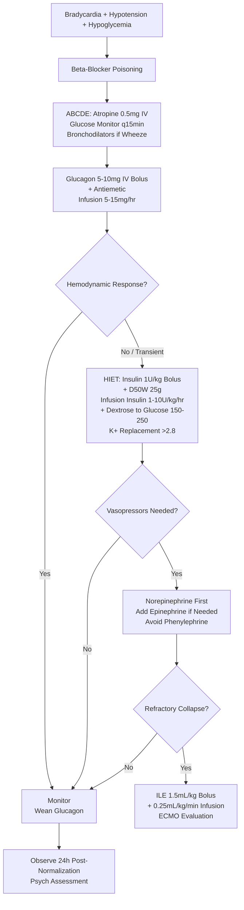

Related: [[General Principles of Poisoning Management]], [[Calcium Channel Blocker Poisoning]], [[Antidotes Overview]], [[High-Dose Insulin Euglycemia Therapy (HIET)]], [[Digoxin Poisoning]]

> [!tip]
> **Bradycardia + hypotension** = hallmark. **Glucagon** (first-line specific) → **High-Dose Insulin Euglycemia Therapy (HIET)** → vasopressors. Key FCPS/MRCP: Glucagon 5-10 mg IV bolus then infusion 5-15 mg/hr; HIET insulin 1 U/kg bolus then 1-10 U/kg/hr + dextrose; avoid calcium (no benefit); pacing usually ineffective; lipid emulsion (ILE) as rescue.

## 1. Learning Objectives
- Recognize beta-blocker toxidrome (bradycardia, hypotension, hypoglycemia, bronchospasm)
- Apply glucagon protocol (dosing, mechanism, limitations)
- Initiate High-Dose Insulin Euglycemia Therapy (HIET)
- Select appropriate vasopressors (norepinephrine, epinephrine)
- Differentiate from calcium channel blocker poisoning
- Identify indications for lipid emulsion (ILE) and mechanical support

## 2. Definition
Beta-blocker poisoning = toxicity from β-adrenergic antagonists (propranolol, metoprolol, atenolol, bisoprolol, carvedilol, nebivolol, sotalol) causing **bradycardia, hypotension, hypoglycemia, bronchospasm, and cardiac conduction abnormalities**.

## 3. Core Physiology
- **Mechanism**: competitive antagonism at β₁ (cardiac) and β₂ (pulmonary, metabolic, vascular) receptors
- **Cardiac**: ↓ cAMP → ↓ Ca²⁺ influx → **negative inotropy, negative chronotropy, negative dromotropy** → bradycardia, hypotension, heart block, decreased contractility
- **Metabolic**: β₂ blockade → **hypoglycemia** (impaired glycogenolysis/gluconeogenesis), **hyperkalemia** (impaired K⁺ shift into cells)
- **Pulmonary**: β₂ blockade → **bronchospasm** (especially non-selective: propranolol, sotalol, carvedilol, labetalol)
- **CNS**: lipophilic agents (propranolol, metoprolol) → seizures, coma (Na channel blockade at high dose — propranolol)
- **Agent specifics**:
  - **Propranolol**: non-selective, lipophilic, Na channel blockade (QRS widening), **most toxic**
  - **Sotalol**: non-selective + **Class III (K⁺ channel blockade) → QT prolongation, Torsades**
  - **Carvedilol/Labetalol**: α₁ + β blockade → vasodilation, less reflex tachycardia
  - **Atenolol/Bisoprolol**: β₁-selective, hydrophilic, less CNS, less toxic
  - **Nebivolol**: β₁-selective + NO-mediated vasodilation

## 4. Clinical Features
- **Bradycardia** (sinus brady, junctional, heart block, asystole)
- **Hypotension** (refractory to fluids)
- **Hypoglycemia** (especially children, elderly, diabetic, fasting)
- **Bronchospasm** (wheeze, respiratory distress — non-selective)
- **CNS**: drowsiness, confusion, seizures (propranolol), coma
- **Hyperkalemia**
- **Heart failure exacerbation** (acute on chronic)
- **Cardiogenic shock** (severe)

## 5. Differential Diagnosis
- **Calcium channel blocker**: similar but **hyperglycemia** (not hypoglycemia), less bronchospasm
- **Digoxin**: bradycardia + AV block + **hyperkalemia** + nausea/vomiting/visual changes
- **Clonidine/α₂ agonists**: bradycardia, hypotension, **miosis**, CNS depression, transient hypertension
- **Organophosphate**: bradycardia + **secretions, miosis, bronchospasm, fasciculations**
- **Hypothyroidism/myxedema**: bradycardia, hypotension, hypothermia, altered mental status

## 6. Investigations
- **ECG** — continuous: bradycardia, PR/QRS/QT prolongation (sotalol, propranolol)
- **Glucose** (bedside) — **MANDATORY, frequent** (hypoglycemia common)
- **Electrolytes** — K⁺ (hyperkalemia), Na⁺, Mg²⁺, Ca²⁺
- **ABG/VBG** — lactate (shock), pH
- **Renal function**
- **Paracetamol level** (always)
- **CXR** — pulmonary edema, aspiration
- **Specific drug level** — not routinely available

## 7. Management

### 1. Resuscitation (ABCDE)
- **Airway**: intubate if GCS < 8, respiratory failure (bronchospasm, pulmonary edema)
- **Breathing**: high-flow O₂, **bronchodilators** (salbutamol/ipratropium neb) for bronchospasm
- **Circulation**: IV fluids (cautious — cardiogenic shock risk), **vasopressors early**

### 2. Glucagon — **FIRST-LINE SPECIFIC ANTIDOTE**
- **Mechanism**: activates adenylate cyclase → ↑ cAMP **independent of β-receptor** → ↑ Ca²⁺ influx → positive inotropy/chronotropy
- **Dose**:
  - **Bolus**: **5-10 mg IV** over 1-2 min (child 50-150 µg/kg, max 1 mg)
  - **Infusion**: **5-15 mg/hr** (titrate to HR/BP) — prepare by adding bolus dose to 50-100 mL NS
- **Onset**: 1-2 min; peak 5-10 min
- **Adverse**: **nausea/vomiting** (very common — give antiemetic ondansetron 4 mg IV prophylactically), hyperglycemia, hypokalemia
- **Limitations**: tachyphylaxis (receptor downregulation) → effect wanes over hours; large doses may deplete hospital supply

### 3. High-Dose Insulin Euglycemia Therapy (HIET) — **MAINSTAY FOR REFRACTORY SHOCK**
- **Mechanism**: insulin → ↑ myocardial glucose uptake/utilization → ↑ ATP → improved contractility; also ↑ Ca²⁺ handling
- **Indications**: **refractory hypotension/bradycardia despite glucagon + fluids**
- **Protocol**:
  1. **Bolus**: **Regular insulin 1 U/kg IV** + **D50W 0.5 g/kg (25 g)** IV
  2. **Infusion**: **Insulin 1-10 U/kg/hr** (start 1 U/kg/hr, titrate to hemodynamic response) + **Dextrose 0.5 g/kg/hr** (adjust to maintain glucose 150-250 mg/dL / 8-14 mmol/L)
  3. **Monitor**: glucose **q15-30 min** (first 2h), then q1h; K⁺ q1-2h (replace to keep > 2.8 mmol/L); Mg²⁺, Ca²⁺
  4. **Potassium**: **replete proactively** (insulin drives K⁺ into cells) — 20-40 mEq/hr if K⁺ < 4.0
- **Duration**: continue 12-24h after hemodynamic stability; wean gradually
- **Adverse**: hypoglycemia (monitor!), hypokalemia, hypophosphatemia, fluid overload

### 4. Vasopressors
- **Norepinephrine** (α₁ + β₁) — **first-line** (supports BP, some β₁ inotropy)
- **Epinephrine** (α₁ + β₁ + β₂) — **add if NE insufficient** (more inotropy, chronotropy; β₂ may cause tachyarrhythmias)
- **Dopamine** — less preferred (arrhythmogenic)
- **Vasopressin** — adjunct (vasopressor-sparing)
- **Avoid pure α-agonists** (phenylephrine) — no inotropy, reflex bradycardia

### 5. Bradycardia / Conduction Disturbances
- **Atropine** 0.5-1 mg IV (repeat to max 3 mg) — **often ineffective** (β-blockade mediated)
- **Transcutaneous pacing** — **often ineffective** (myocardial non-capture due to β-blockade)
- **Transvenous pacing** — consider if high-grade block + hemodynamic compromise
- **Isoproterenol** (β₁/β₂ agonist) — can overcome blockade BUT increases O₂ demand, arrhythmias; rarely used
- **Calcium** — **NO proven benefit** (unlike CCB)

### 6. Specific Agent Complications
- **Propranolol**: Na channel blockade → **QRS widening** → NaHCO₃ 1-2 mEq/kg if QRS > 100 ms; seizures → benzos
- **Sotalol**: **QT prolongation → Torsades** → MgSO₄ 2g IV, pacing, avoid QT-prolonging drugs; consider lidocaine
- **Carvedilol/Labetalol**: α₁ blockade → **vasodilatory shock** component; NE preferred

### 7. Intralipid Emulsion (ILE) — **RESCUE THERAPY**
- **Indication**: **refractory cardiovascular collapse** despite glucagon + HIET + vasopressors
- **Dose**: **20% lipid emulsion 1.5 mL/kg bolus** (100 mL for 70 kg) over 1 min, then **infusion 0.25 mL/kg/min** (1000 mL/hr for 70 kg) for 30-60 min
- **Max**: 10 mL/kg (first 30 min) — repeat bolus x2 if persistent arrest
- **Mechanism**: "lipid sink" — sequesters lipophilic drug

### 8. Mechanical Circulatory Support
- **VA-ECMO** / **Impella** / **IABP** — for refractory cardiogenic shock unresponsive to medical therapy
- **Early discussion with ICU/ECMO team**

### 9. Decontamination
- **Activated charcoal**: 1 g/kg if < 1-2h (extended-release: consider WBI)
- **WBI**: sustained-release formulations (metoprolol SR, propranolol LA)

### 10. Monitoring & Disposition
- **Continuous ECG, glucose q1-2h, K⁺ q2-4h**
- **Observe 24h** post-normalization (longer for SR, sotalol)
- **Psych assessment** (DSH common)

## 8. Complications
- Cardiogenic shock
- Severe bradycardia/asystole
- Hypoglycemia → seizures, brain injury
- Bronchospasm → respiratory failure
- Torsades (sotalol)
- Pulmonary edema

## 9. Prognosis
- Good with early glucagon + HIET
- Mortality: ~5-10% (higher with propranolol, sotalol, co-ingestants)
- Refractory shock → ECMO as bridge

## 10. FCPS/MRCP High-Yield Points
1. **Bradycardia + hypotension + hypoglycemia** = classic triad
2. **Glucagon**: 5-10 mg IV bolus → 5-15 mg/hr infusion; **antiemetic prophylactically**
3. **HIET**: insulin 1 U/kg bolus + D50W → infusion 1-10 U/kg/hr + dextrose to maintain glucose 150-250 mg/dL; **K⁺ replacement critical**
4. **Vasopressors**: NE first, add epinephrine
5. **Pacing usually ineffective** (myocardial non-capture)
6. **Calcium NO benefit** (unlike CCB)
7. **Atropine often ineffective**
8. **Propranolol**: QRS widening → NaHCO₃; seizures
9. **Sotalol**: QT → Torsades → MgSO₄
10. **ILE rescue**: 1.5 mL/kg bolus + 0.25 mL/kg/min infusion
11. **Hypoglycemia** — monitor q1-2h (children, elderly, diabetics at highest risk)

## 11. Common Viva Questions
1. Beta-blocker toxidrome features
2. Glucagon dosing and mechanism
3. HIET protocol (insulin dose, dextrose, glucose target, K⁺ monitoring)
4. Vasopressor choice (NE vs epinephrine)
5. Why pacing often fails?
6. Why calcium not helpful?
7. Propranolol-specific (QRS, seizures)
8. Sotalol-specific (QT, Torsades)
9. ILE indications and dosing
10. Differentiate from CCB poisoning

## 12. Common Confusions / Exam Traps
- **Calcium for BB poisoning** → NO (works for CCB, not BB)
- **Atropine works well** → often ineffective
- **Pacing works** → often ineffective (non-capture)
- **Glucagon alone sufficient for severe** → NO, tachyphylaxis, need HIET
- **HIET → hypoglycemia risk** → MUST monitor glucose q15-30min, dextrose infusion
- **HIET → hypokalemia** → MUST replace K⁺ proactively
- **Dextrose concentration** → D50W for bolus, D10-D20 for infusion
- **Propranolol QRS widening** → NaHCO₃ (like TCA)
- **Sotalol = BB + Class III** → QT prolongation, Torsades

## 13. Mnemonics
- **BB TRIAD**: **B**radycardia, **H**ypotension, **H**ypoglycemia
- **GLUCAGON**: **G**lucagon **B**olus 5-10mg → **I**nfusion 5-15mg/hr → **A**ntiemetic
- **HIET**: **H**igh **I**nsulin **E**uglycemia **T**herapy: **1 U/kg bolus**, **1-10 U/kg/hr**, **Glucose 150-250**, **K+ > 2.8**
- **VASOPRESSORS**: **N**E first, **E**pi add-on, **AVOID** phenylephrine
- **PROPANOLOL**: **Q**RS widening → **N**aHCO3; **S**eizures → **B**enzos
- **SOTALOL**: **Q**T prolongation → **T**orsades → **M**gSO4

## 14. Mind Map
```mermaid
mindmap
  root((Beta-Blocker Poisoning))
    Mechanism
      Beta-1: Brady, Hypotension, Low Contractility
      Beta-2: Hypoglycemia, Bronchospasm, HyperK
      Lipophilic (Propranolol): CNS, Na Channel
    Clinical
      Bradycardia + Hypotension + Hypoglycemia
      Bronchospasm (Non-selective)
      Seizures/Coma (Propranolol)
      QT/Torsades (Sotalol)
    Management
      Glucagon (1st Line Specific)
      HIET (Refractory Shock)
      Vasopressors (NE, Epi)
      Pacing (Often Fails)
      ILE (Rescue)
      ECMO (Bridge)
    Specific Agents
      Propranolol: Na Channel, CNS
      Sotalol: QT, Torsades
      Carvedilol/Labetalol: Alpha + Beta
```

## 15. Flowchart


## 16. Suggested Visuals / Image Notes
- HIET protocol card
- Glucagon dosing card
- BB vs CCB comparison table

## 17. Suggested Video References
- Beta-blocker overdose management (Toxbase, EM:RAP)
- HIET practical protocol

## 18. One-Page Revision Summary
- **Triad**: bradycardia, hypotension, hypoglycemia
- **Glucagon**: 5-10mg bolus → 5-15mg/hr infusion + antiemetic
- **HIET**: insulin 1U/kg bolus + D50W → 1-10U/kg/hr + dextrose (glucose 150-250), K⁺ > 2.8
- **Vasopressors**: NE → add epinephrine
- **Pacing/atropine/calcium**: often ineffective
- **Propranolol**: QRS widening → NaHCO₃; seizures → benzos
- **Sotalol**: QT → Torsades → MgSO₄
- **ILE rescue**: 1.5 mL/kg bolus + 0.25 mL/kg/min
- **ECMO** for refractory shock

## 24-Hour Recall Prompts
- Recite glucagon bolus and infusion dose
- State HIET protocol (insulin, dextrose, glucose target, K⁺)
- List vasopressor hierarchy
- Contrast propranolol vs sotalol specific features

## 7-Day / 15-Day / 30-Day Revision Tracker
- [ ] Day 1 completed
- [ ] 24-hour recall completed
- [ ] Day 7 revision completed
- [ ] Day 15 revision completed
- [ ] Day 30 revision completed

## 19. Must Know / Should Know / Nice to Know
### Must Know
- Triad: bradycardia, hypotension, hypoglycemia
- Glucagon 5-10mg bolus + 5-15mg/hr infusion
- HIET: 1U/kg bolus, 1-10U/kg/hr, glucose 150-250, K⁺ > 2.8
- Vasopressors: NE first, add epinephrine
- Pacing/atropine/calcium often ineffective
- Propranolol: QRS widening → NaHCO₃
- Sotalol: QT → Torsades → MgSO₄
- ILE rescue dosing
- Hypoglycemia monitoring q15-30min

### Should Know
- Glucagon tachyphylaxis
- Sotalol = BB + Class III
- Carvedilol/labetalol α₁ blockade
- WBI for SR formulations
- Antiemetic with glucagon

### Nice to Know
- Nebivolol NO-mediated vasodilation
- Lipid emulsion mechanisms (sink vs metabolic)
- ECMO timing/indications
- Specific β₁-selective vs non-selective differences

## 20. Self-Test Scorecard
- Understanding: /10
- Recall: /10
- MCQ Performance: /10
- SBA Performance: /10
- Viva Confidence: /10
- Total: /50

> [!tip]
> Interpretation: <35 = weak topic, 35-44 = acceptable but insecure, 45+ = strong exam-ready topic.

## 21. Exam Answer Modes
### Long Answer Skeleton
- Mechanism (β₁, β₂, lipophilic CNS)
- Clinical features (triad + agent-specific)
- Investigations (glucose, ECG, electrolytes)
- Management: glucagon → HIET → vasopressors → pacing/ILE/ECMO
- Agent-specific: propranolol, sotalol, carvedilol
- Monitoring/disposition

### Short Note Skeleton
- Glucagon protocol box
- HIET protocol box
- Vasopressor table
- Propranolol/sotalol specifics

### Viva One-Liners
- "BB triad: bradycardia, hypotension, hypoglycemia"
- "Glucagon: 5-10mg bolus → 5-15mg/hr + antiemetic"
- "HIET: 1U/kg bolus, 1-10U/kg/hr, glucose 150-250, K⁺ > 2.8"
- "NE first, add epinephrine; pacing/atropine/calcium often fail"
- "Propranolol: QRS widening → NaHCO₃; seizures → benzos"
- "Sotalol: QT prolongation → Torsades → MgSO₄"
- "ILE rescue: 1.5mL/kg bolus + 0.25mL/kg/min"
- "Calcium works for CCB, NOT for BB"

### Ward-Case Discussion Points
- BB overdose + hypoglycemia → glucose monitoring critical
- Sotalol ingestion → ECG for QT, magnesium ready
- Refractory shock despite glucagon/HIET/vasopressors → ILE + ECMO discussion

### Last-Night-Before-Exam Sheet
- Triad: Brady, Hypotension, Hypoglycemia
- Glucagon: 5-10mg → 5-15mg/hr
- HIET: 1U/kg → 1-10U/kg/hr, Glu 150-250, K>2.8
- NE → Epi
- Pacing/Atropine/Ca: Fail
- Propranolol: QRS→NaHCO3
- Sotalol: QT→MgSO4
- ILE: 1.5mL/kg + 0.25mL/kg/min

## 22. Summary
Beta-blocker poisoning = β₁/β₂ blockade → bradycardia, hypotension, hypoglycemia, bronchospasm. Glucagon 5-10mg bolus + 5-15mg/hr infusion (with antiemetic). HIET for refractory shock: insulin 1U/kg bolus + D50W → 1-10U/kg/hr + dextrose (glucose 150-250), aggressive K⁺ replacement. Vasopressors: NE → epinephrine. Pacing/atropine/calcium often ineffective. Propranolol: QRS widening → NaHCO₃; sotalol: QT → MgSO₄. ILE rescue: 1.5mL/kg bolus + 0.25mL/kg/min. ECMO for refractory.

## 23. MCQs (10)
1. Beta-blocker overdose - characteristic hemodynamic profile?
   A. Hypertension, tachycardia
   B. Hypotension, bradycardia
   C. Hypotension, tachycardia
   D. Hypertension, bradycardia
   **Answer: B**
   *Explanation: BB overdose: β₁ blockade → ↓ contractility, ↓ HR, ↓ AV conduction → hypotension + bradycardia. Also β₂ blockade → bronchospasm, hypoglycemia (masked tachycardic response).*

2. Glucagon dose for BB overdose?
   A. 1 mg IV
   B. 0.04-0.1 mg IV
   C. 5-10 mg IV then 5-15 mg/hr infusion
   D. 50 mg IV
   **Answer: C**
   *Explanation: Glucagon: 5-10 mg IV over 1-2 min, then 5-15 mg/hr infusion. Bypasses β-receptor → ↑ cAMP → ↑ contractility, HR, AV conduction. Side effect: vomiting (protect airway).*

3. HIET (High-Dose Insulin Euglycemic Therapy) for BB/CCB - insulin dose?
   A. 0.1 U/kg/hr
   B. 1 U/kg/hr
   C. 10 U/kg/hr
   D. 100 U/kg/hr
   **Answer: B**
   *Explanation: HIET: Insulin 1 U/kg/hr IV + dextrose (maintain glucose 5-10 mmol/L) + K⁺ replacement (insulin drives K⁺ into cells). Improves myocardial glucose utilization, contractility. Works for BB and CCB.*

4. BB overdose - which beta-blocker is MOST cardiotoxic?
   A. Atenolol
   B. Metoprolol
   C. Propranolol
   D. Bisoprolol
   **Answer: C**
   *Explanation: Propranolol: lipophilic, CNS penetration (seizures, coma), sodium channel blockade (QRS widening), no ISA. Most cardiotoxic. Sotalol = QT prolongation.*

5. BB overdose with bronchospasm in asthmatic - management?
   A. Salbutamol only
   B. Salbutamol + IV fluids
   C. Salbutamol + consider glucagon/HIET (β₂ blockade not reversed by β-agonists fully)
   D. Intubate immediately
   **Answer: C**
   *Explanation: Non-selective BB block β₂ → bronchospasm. Salbutamol helps but β₂ receptors occupied. Glucagon/HIET bypass receptor. Severe cases: intubation, consider ECMO.*

6. Sotalol overdose - specific risk?
   A. Only bradycardia
   B. QT prolongation → Torsades de Pointes
   C. Only hypotension
   D. Seizures only
   **Answer: B**
   *Explanation: Sotalol = non-selective BB + Class III antiarrhythmic (K⁺ channel block) → QT prolongation → Torsades. Correct K⁺/Mg²⁺ aggressively. Pacing/isoproterenol if Torsades.*

7. BB overdose refractory to fluids, glucagon, HIET, vasopressors. Next?
   A. Give more fluids
   B. Consider ECMO
   C. Atropine
   D. Calcium
   **Answer: B**
   *Explanation: Refractory cardiogenic shock despite maximal medical therapy (fluids, glucagon, HIET, vasopressors) → consider mechanical circulatory support (ECMO, IABP, Impella).*

8. BB overdose + hypoglycemia - mechanism?
   A. ↑ insulin release
   B. Masked tachycardic response + ↓ glycogenolysis/gluconeogenesis
   C. ↓ glucose absorption
   D. Renal glucose loss
   **Answer: B**
   *Explanation: BB masks adrenergic hypoglycemia symptoms (tachycardia, tremor). Also ↓ glycogenolysis and gluconeogenesis (β₂). Check glucose q1-2h. Treat with dextrose.*

9. Calcium for BB overdose - role?
   A. First line
   B. Adjunct for refractory hypotension
   C. Contraindicated
   D. Only for CCB
   **Answer: B**
   *Explanation: Calcium (gluconate 3g or chloride 1g IV) is FIRST LINE for CCB. For BB: adjunct for refractory hypotension (improves contractility via Ca²⁺ influx). Less effective than in CCB.*

10. BB overdose - atropine for bradycardia?
   A. First line
   B. Often ineffective (not vagally mediated), try glucagon/HIET
   C. Contraindicated
   D. Only if HR < 40
   **Answer: B**
   *Explanation: BB bradycardia = β₁ blockade (not vagal). Atropine often INEFFECTIVE. Glucagon/HIET/pacing are better. Atropine may help if vagal component.*

## 24. SBA Questions (10)
1. 50yo man, propranolol 5g overdose. BP 70/40, HR 42, GCS 10. Fluids 2L given, no improvement. Next?
   A. Atropine 1mg IV
   B. Glucagon 5-10mg IV + infusion + HIET + norepinephrine
   B. Calcium 3g IV
   D. Pacemaker
   **Answer: A**
   *Explanation: Propranolol: lipophilic, Na channel block (QRS widening), CNS effects. Glucagon 5-10mg IV then 5-15mg/hr + HIET (insulin 1U/kg/hr + dextrose + K⁺) + vasopressors (NE). Atropine often fails. Calcium adjunct. Pacemaker if refractory.*

2. Sotalol 2g overdose. ECG: QRS 100ms, QT 580ms, HR 50. Management?
   A. Glucagon only
   B. Correct K⁺/Mg²⁺ aggressively, pacing/isoproterenol if Torsades, avoid QT-prolonging drugs
   C. Naloxone
   D. Flumazenil
   **Answer: B**
   *Explanation: Sotalol = BB + Class III → QT prolongation → Torsades. Correct K⁺ >4.0, Mg²⁺ >2.0. Avoid QT-prolonging drugs. Pacing/isoproterenol for Torsades. Glucagon/HIET for BB component.*

3. BB overdose with severe bronchospasm in known asthmatic. Salbutamol nebs not helping. Why?
   A. Wrong diagnosis
   B. β₂ receptors occupied by BB - salbutamol can't bind effectively
   C. Need IV aminophylline
   D. Need intubation
   **Answer: B**
   *Explanation: Non-selective BB occupies β₂ receptors → bronchospasm. Salbutamol (β₂ agonist) competes but BB has high affinity. Glucagon/HIET bypass receptor. Severe: intubation, consider ECMO.*

4. Metoprolol 2g overdose. Hypotension, bradycardia. Glucagon given, vomiting. Airway protection?
   A. Not needed
   B. NPA/OPA
   C. NPA/OPA - glucagon causes vomiting in 30-50%, protect airway
   D. Intubate prophylactically
   **Answer: C**
   *Explanation: Glucagon: vomiting 30-50%. Airway protection ESSENTIAL (NPA/OPA, suction ready). Consider antiemetic (ondansetron) prophylactically.*

5. Refractory BB/CCB shock - vasopressor of choice?
   A. Dopamine
   B. Norepinephrine
   C. Phenylephrine
   D. Vasopressin
   **Answer: B**
   *Explanation: Norepinephrine (α₁ + β₁) preferred. Phenylephrine (pure α) may worsen myocardial depression. Vasopressin adjunct. Avoid dopamine (arrhythmogenic).*

6. BB overdose + hypoglycemia 2.5 mmol/L. Glucose given. Monitor?
   A. Once
   B. q1-2h (BB masks hypoglycemia symptoms, ongoing risk)
   C. q6h
   D. Only if symptoms
   **Answer: B**
   *Explanation: BB masks adrenergic hypoglycemia symptoms (tachycardia, tremor). Also impairs glycogenolysis/gluconeogenesis. Check glucose q1-2h. Dextrose infusion if recurrent.*

7. Carvedilol overdose - specific features?
   A. Pure β₁ block
   B. α₁ + β block → more vasodilation, hypotension
   C. ISA only
   D. No CNS effects
   **Answer: B**
   *Explanation: Carvedilol = non-selective β + α₁ blockade → more vasodilation, profound hypotension. Also antioxidant. Lipophilic → CNS effects (seizures). Manage like propranolol.*

8. BB overdose - when is calcium FIRST LINE?
   A. Always
   B. Never - only for CCB
   C. Adjunct for refractory hypotension in BB, FIRST LINE for CCB
   D. Only if hyperkalemia
   **Answer: C**
   *Explanation: Calcium: FIRST LINE for CCB overdose. For BB: adjunct for refractory hypotension (less effective). CCB: calcium directly competes at L-type channel.*

9. BB overdose + seizures. Drug choice?
   A. Phenytoin
   B. Benzodiazepines (lorazepam/diazepam)
   C. Levetiracetam
   D. Phenobarbital
   **Answer: B**
   *Explanation: BB seizures (esp propranolol, carvedilol - lipophilic, CNS): benzos 1st line. Avoid phenytoin (Na channel effects). Phenobarbital/propofol 2nd line.*

10. Hypotension + bradycardia + QRS widening in BB overdose. Which BB?
   A. Atenolol
   B. Metoprolol
   C. Propranolol
   D. Bisoprolol
   **Answer: C**
   *Explanation: Propranolol: lipophilic → CNS (seizures, coma), membrane stabilizing (Na channel block → QRS widening). Most cardiotoxic. Sotalol = QT prolongation.*

## 25. Flashcards
- Q: BB overdose hemodynamic profile?
  A: Hypotension + bradycardia (β₁ blockade → ↓ contractility, ↓ HR, ↓ AV conduction). Also hypoglycemia (masked symptoms), bronchospasm (non-selective).
- Q: Glucagon dose for BB?
  A: 5-10 mg IV over 1-2 min, then 5-15 mg/hr infusion. Bypasses β-receptor. Side effect: vomiting 30-50% → protect airway.
- Q: HIET for BB/CCB?
  A: Insulin 1 U/kg/hr + dextrose (glucose 5-10 mmol/L) + K⁺ replacement. Improves myocardial glucose utilization, contractility.
- Q: Most cardiotoxic BB?
  A: Propranolol: lipophilic, CNS (seizures, coma), Na channel block (QRS widening), no ISA. Sotalol = QT prolongation → Torsades.
- Q: Sotalol specific risk?
  A: BB + Class III (K⁺ channel block) → QT prolongation → Torsades. Correct K⁺/Mg²⁺ aggressively. Pacing/isoproterenol for Torsades.
- Q: BB bronchospasm - salbutamol limited?
  A: Non-selective BB occupies β₂ receptors. Salbutamol competes but BB high affinity. Glucagon/HIET bypass receptor.
- Q: Refractory BB shock → ECMO?
  A: Fluids + glucagon + HIET + vasopressors (NE) → if refractory → mechanical support (ECMO, IABP, Impella).
- Q: BB hypoglycemia - mechanism?
  A: Masks adrenergic symptoms (tachycardia, tremor) + ↓ glycogenolysis/gluconeogenesis (β₂). Check glucose q1-2h.
- Q: Calcium in BB vs CCB?
  A: FIRST LINE for CCB. Adjunct for refractory hypotension in BB (less effective). CCB: competes at L-type channel.
- Q: Atropine for BB bradycardia?
  A: Often INEFFECTIVE (β₁ blockade, not vagal). Glucagon/HIET/pacing better. May help if vagal component.
- Q: Glucagon vomiting?
  A: 30-50% vomit. Airway protection essential (NPA/OPA, suction). Consider ondansetron prophylactically.
- Q: Vasopressor for BB/CCB shock?
  A: Norepinephrine (α₁+β₁) preferred. Avoid pure α (phenylephrine) - may worsen myocardial depression.
- Q: Carvedilol specific?
  A: α₁ + β block → more vasodilation, profound hypotension. Lipophilic → CNS effects (seizures). Manage like propranolol.
- Q: BB seizures - drug?
  A: Benzos 1st line (lorazepam/diazepam). Avoid phenytoin (Na channel). Phenobarbital/propofol 2nd line.
- Q: BB overdose disposition?
  A: Observe 6-12h post-normalization. Psych assessment mandatory. Asymptomatic 6h post-ingestion → discharge if low risk.
## 26. Answer Key with Explanations
### MCQs
1. **B** - BB overdose: β₁ blockade → ↓ contractility, ↓ HR, ↓ AV conduction → hypotension + bradycardia. Also β₂ blockade → bronchospasm, hypoglycemia (masked tachycardic response).
2. **C** - Glucagon: 5-10 mg IV over 1-2 min, then 5-15 mg/hr infusion. Bypasses β-receptor → ↑ cAMP → ↑ contractility, HR, AV conduction. Side effect: vomiting (protect airway).
3. **B** - HIET: Insulin 1 U/kg/hr IV + dextrose (maintain glucose 5-10 mmol/L) + K⁺ replacement (insulin drives K⁺ into cells). Improves myocardial glucose utilization, contractility. Works for BB and CCB.
4. **C** - Propranolol: lipophilic, CNS penetration (seizures, coma), sodium channel blockade (QRS widening), no ISA. Most cardiotoxic. Sotalol = QT prolongation.
5. **C** - Non-selective BB block β₂ → bronchospasm. Salbutamol helps but β₂ receptors occupied. Glucagon/HIET bypass receptor. Severe cases: intubation, consider ECMO.
6. **B** - Sotalol = non-selective BB + Class III antiarrhythmic (K⁺ channel block) → QT prolongation → Torsades. Correct K⁺/Mg²⁺ aggressively. Pacing/isoproterenol if Torsades.
7. **B** - Refractory cardiogenic shock despite maximal medical therapy (fluids, glucagon, HIET, vasopressors) → consider mechanical circulatory support (ECMO, IABP, Impella).
8. **B** - BB masks adrenergic hypoglycemia symptoms (tachycardia, tremor). Also ↓ glycogenolysis and gluconeogenesis (β₂). Check glucose q1-2h. Treat with dextrose.
9. **B** - Calcium (gluconate 3g or chloride 1g IV) is FIRST LINE for CCB. For BB: adjunct for refractory hypotension (improves contractility via Ca²⁺ influx). Less effective than in CCB.
10. **B** - BB bradycardia = β₁ blockade (not vagal). Atropine often INEFFECTIVE. Glucagon/HIET/pacing are better. Atropine may help if vagal component.

### SBAs
1. **A** - Propranolol: lipophilic, Na channel block (QRS widening), CNS effects. Glucagon 5-10mg IV then 5-15mg/hr + HIET (insulin 1U/kg/hr + dextrose + K⁺) + vasopressors (NE). Atropine often fails. Calcium adjunct. Pacemaker if refractory.
2. **B** - Sotalol = BB + Class III → QT prolongation → Torsades. Correct K⁺ >4.0, Mg²⁺ >2.0. Avoid QT-prolonging drugs. Pacing/isoproterenol for Torsades. Glucagon/HIET for BB component.
3. **B** - Non-selective BB occupies β₂ receptors → bronchospasm. Salbutamol (β₂ agonist) competes but BB has high affinity. Glucagon/HIET bypass receptor. Severe: intubation, consider ECMO.
4. **C** - Glucagon: vomiting 30-50%. Airway protection ESSENTIAL (NPA/OPA, suction ready). Consider antiemetic (ondansetron) prophylactically.
5. **B** - Norepinephrine (α₁ + β₁) preferred. Phenylephrine (pure α) may worsen myocardial depression. Vasopressin adjunct. Avoid dopamine (arrhythmogenic).
6. **B** - BB masks adrenergic hypoglycemia symptoms (tachycardia, tremor). Also impairs glycogenolysis/gluconeogenesis. Check glucose q1-2h. Dextrose infusion if recurrent.
7. **B** - Carvedilol = non-selective β + α₁ blockade → more vasodilation, profound hypotension. Also antioxidant. Lipophilic → CNS effects (seizures). Manage like propranolol.
8. **C** - Calcium: FIRST LINE for CCB overdose. For BB: adjunct for refractory hypotension (less effective). CCB: calcium directly competes at L-type channel.
9. **B** - BB seizures (esp propranolol, carvedilol - lipophilic, CNS): benzos 1st line. Avoid phenytoin (Na channel effects). Phenobarbital/propofol 2nd line.
10. **C** - Propranolol: lipophilic → CNS (seizures, coma), membrane stabilizing (Na channel block → QRS widening). Most cardiotoxic. Sotalol = QT prolongation.

## PasTest Scenario SBAs (Clinical Vignettes)

> **Auto-generated PasTest/Mediscope-style scenario SBAs** grounded in the authored source. Each scenario tests a real clinical fact (triad, specific sign, contraindication, trial, first-line Rx) extracted from the topic. *Source: Ch 11: Poisoning — Beta-Blocker Poisoning*

**Q1.** What is the most appropriate first-line therapy for Beta-Blocker Poisoning?

  - **A.** Adverse + nausea/vomiting
  - **B.** An advanced/surgical therapy reserved for refractory disease
  - **C.** Symptomatic treatment only, no disease-modifying therapy
  - **D.** Empiric broad-spectrum therapy without specific indication

  > **Answer: A** — Adverse + nausea/vomiting
  >
  > *Source:* **Adverse**: **nausea/vomiting** (very common — give antiemetic ondansetron 4 mg IV prophylactically), hyperglycemia, hypokalemia

