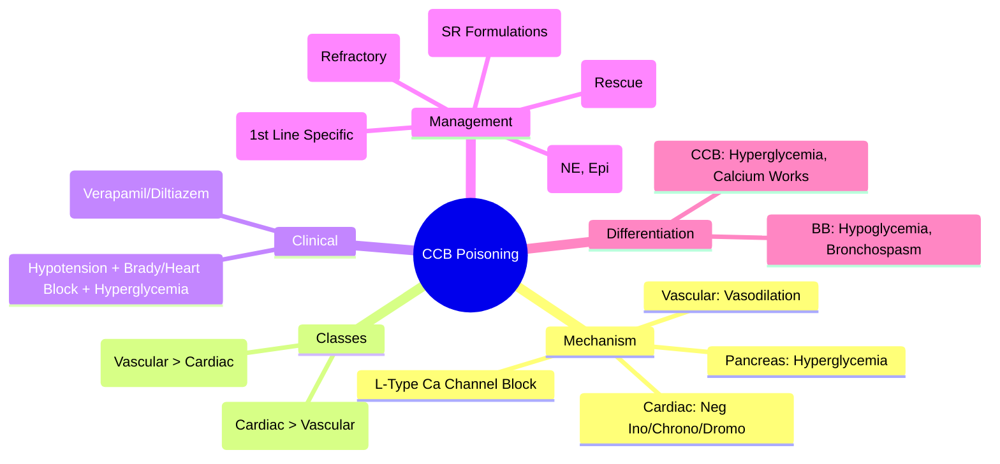

Related: [[General Principles of Poisoning Management]], [[Beta-Blocker Poisoning]], [[Antidotes Overview]], [[High-Dose Insulin Euglycemia Therapy (HIET)]], [[Digoxin Poisoning]]

> [!tip]
> **Hypotension + bradycardia/heart block + hyperglycemia** = CCB triad (vs BB: hypoglycemia). **Calcium** (first-line specific) → **HIET** → vasopressors. Key FCPS/MRCP: Calcium chloride 1g (10mL 10%) IV q10-20min (prefer over gluconate - more Ca²⁺); HIET same as BB; NE/epinephrine; atropine/pacing often ineffective; ILE rescue; ECMO bridge. Differentiate from BB: **hyperglycemia** (not hypoglycemia), less bronchospasm.

## 1. Learning Objectives
- Recognize CCB toxidrome (hypotension, bradycardia/heart block, hyperglycemia)
- Apply calcium therapy (chloride vs gluconate, dosing, limitations)
- Initiate High-Dose Insulin Euglycemia Therapy (HIET)
- Select appropriate vasopressors
- Differentiate from beta-blocker poisoning
- Identify indications for ILE and mechanical support

## 2. Definition
Calcium channel blocker poisoning = toxicity from L-type calcium channel antagonists (verapamil, diltiazem, amlodipine, nifedipine, felodipine, nimodipine, nicardipine) causing **vasodilatory shock, negative inotropy/chronotropy/dromotropy, and hyperglycemia**.

## 3. Core Physiology
- **Mechanism**: blocks L-type Ca²⁺ channels in vascular smooth muscle (vasodilation → hypotension) and cardiac myocytes (↓ Ca²⁺ influx → **negative inotropy, negative chronotropy, negative dromotropy**)
- **Metabolic**: **hyperglycemia** (impaired insulin release from pancreatic β-cells — Ca²⁺ dependent) — **KEY DIFFERENTIATOR FROM BB**
- **Agent classes**:
  - **Non-DHP (rate-limiting)**: **Verapamil** (most cardiac depression), **Diltiazem** (moderate cardiac + vascular)
  - **DHP (vascular selective)**: Amlodipine, nifedipine, felodipine — **profound vasodilatory shock**, reflex tachycardia initially (then bradycardia in severe), less cardiac depression
- **Pharmacokinetics**: verapamil/diltiazem have high first-pass, sustained-release forms common → **delayed/prolonged toxicity** (12-24h+); amlodipine very long half-life (30-50h) → prolonged course

## 4. Clinical Features
- **Hypotension** (refractory, vasodilatory + cardiogenic components)
- **Bradycardia / Heart block** (SA/AV node depression — **non-DHP > DHP**; DHP may have initial reflex tachycardia)
- **Hyperglycemia** (impaired insulin secretion) — **hallmark vs BB hypoglycemia**
- **Non-cardiogenic pulmonary edema** (verapamil/diltiazem)
- **Metabolic acidosis** (shock)
- **Renal impairment** (hypoperfusion)
- **CNS**: drowsiness, confusion (less than BB, except severe shock)

## 5. Differential Diagnosis
| Feature | CCB | Beta-Blocker |
|---------|-----|--------------|
| **Glucose** | **Hyperglycemia** | **Hypoglycemia** |
| **Bronchospasm** | Rare | Common (non-selective) |
| **Heart block** | Prominent (verapamil/diltiazem) | Common |
| **Reflex tachycardia** | Early (DHP) | Absent (β₁ blocked) |
| **Calcium** | **Specific antidote** | No benefit |
| **HIET** | Effective | Effective |

- **Digoxin**: hyperkalemia, nausea/vomiting/visual, specific Fab
- **Clonidine**: miosis, transient hypertension, CNS depression
- **Organophosphate**: secretions, miosis, fasciculations

## 6. Investigations
- **ECG** — continuous: bradycardia, PR prolongation, AV block, QRS widening (verapamil)
- **Glucose** (bedside) — **hyperglycemia** (key clue)
- **Electrolytes** — K⁺ (may be normal/high), Ca²⁺, Mg²⁺
- **ABG/VBG** — lactate, pH
- **Renal function**
- **Paracetamol level** (always)
- **CXR** — pulmonary edema

## 7. Management

### 1. Resuscitation (ABCDE)
- **Airway**: intubate if GCS < 8, pulmonary edema, respiratory failure
- **Breathing**: high-flow O₂, NIV/ventilation for pulmonary edema
- **Circulation**: IV fluids (cautious — cardiogenic + vasodilatory shock), **calcium**, **vasopressors early**

### 2. Calcium — **FIRST-LINE SPECIFIC ANTIDOTE**
- **Mechanism**: ↑ extracellular Ca²⁺ → overcomes competitive channel blockade via mass action
- **Preferred**: **Calcium chloride 10% (1g = 10 mL = 6.8 mmol Ca²⁺/13.6 mEq)** — **central line preferred** (extravasation → necrosis). **Calcium gluconate 10% (1g = 10 mL = 2.25 mmol Ca²⁺/4.5 mEq)** — 3x less Ca²⁺, safer peripheral.
- **Dose**:
  - **Bolus**: **Calcium chloride 1 g (10 mL 10%) IV** over 5-10 min (child 20 mg/kg = 0.2 mL/kg 10% CaCl₂)
  - **Repeat** q10-20 min **as needed** for hemodynamic response (max 3-4 g in first hour)
  - **Infusion**: if bolus effective → **calcium chloride 20-50 mg/kg/hr** (or gluconate 60-150 mg/kg/hr) to maintain ionized Ca²⁺ > 1.5 mmol/L
- **Monitor**: ionized Ca²⁺ q30-60 min (target > 1.5 mmol/L), ECG (QT shortening), mental status
- **Limitations**: transient effect, tachyphylaxis, hypercalcemia risk

### 3. High-Dose Insulin Euglycemia Therapy (HIET) — **MAINSTAY FOR REFRACTORY SHOCK**
- **Same protocol as BB** — **see [[Beta-Blocker Poisoning]] for details**
- **Insulin 1 U/kg bolus + D50W 25g** → **Infusion 1-10 U/kg/hr + dextrose to glucose 150-250 mg/dL** + **K⁺ replacement to > 2.8 mmol/L**
- **Mechanism**: insulin → ↑ myocardial glucose utilization → ↑ ATP → improved contractility; also ↑ Ca²⁺ handling

### 4. Vasopressors
- **Norepinephrine** (α₁ + β₁) — **first-line** (vasoconstriction + some inotropy)
- **Epinephrine** (α₁ + β₁ + β₂) — **add if NE insufficient** (more inotropy/chronotropy)
- **Vasopressin** — adjunct (vasopressor-sparing, V₁ receptors)
- **Dopamine** — less preferred
- **Avoid pure α-agonists** (phenylephrine) — reflex bradycardia, no inotropy

### 5. Bradycardia / Heart Block
- **Atropine** 0.5-1 mg IV (max 3 mg) — **often ineffective** (Ca²⁺ channel blockade at node)
- **Transcutaneous pacing** — **often ineffective** (myocardial non-capture)
- **Transvenous pacing** — consider if high-grade block + hemodynamic compromise
- **Isoproterenol** — β-agonist, can overcome but ↑ O₂ demand, arrhythmias; rarely used
- **Calcium** — may improve conduction (primary therapy)

### 6. Intralipid Emulsion (ILE) — **RESCUE THERAPY**
- **Indication**: **refractory cardiovascular collapse** despite calcium + HIET + vasopressors
- **Dose**: **20% lipid emulsion 1.5 mL/kg bolus** (100 mL for 70 kg) over 1 min, then **infusion 0.25 mL/kg/min** (1000 mL/hr for 70 kg) for 30-60 min
- **Max**: 10 mL/kg first 30 min; repeat bolus x2 if persistent arrest

### 7. Mechanical Circulatory Support
- **VA-ECMO** / **Impella** / **IABP** — refractory cardiogenic shock
- **Early discussion** with ICU/ECMO team

### 8. Decontamination
- **Activated charcoal**: 1 g/kg if < 1-2h — **SR formulations common → consider up to 4-6h**
- **Whole bowel irrigation**: **strongly indicated for SR/ER formulations** (verapamil SR, diltiazem ER, amlodipine) — 1-2 L/hr until clear effluent

### 9. Monitoring & Disposition
- **Continuous ECG, glucose q1-2h, ionized Ca²⁺ q1-2h, K⁺ q2-4h**
- **Observe 24h+** post-normalization (longer for SR, amlodipine 24-48h)
- **Psych assessment** (DSH common)

## 8. Complications
- Refractory vasodilatory + cardiogenic shock
- High-grade AV block / asystole
- Non-cardiogenic pulmonary edema (verapamil/diltiazem)
- Hyperglycemia → osmotic diuresis, dehydration
- Acute kidney injury
- Prolonged toxicity (SR formulations, amlodipine long half-life)

## 9. Prognosis
- Good with early calcium + HIET
- Mortality: ~10-15% (higher with verapamil, SR formulations, co-ingestants)
- Amlodipine: prolonged course (half-life 30-50h) → extended monitoring

## 10. FCPS/MRCP High-Yield Points
1. **Triad**: hypotension + bradycardia/heart block + **hyperglycemia** (vs BB hypoglycemia)
2. **Calcium chloride 1g IV** (prefer over gluconate — 3x Ca²⁺) q10-20 min, then infusion
3. **HIET** same as BB: insulin 1U/kg bolus + D50W → 1-10U/kg/hr, glucose 150-250, K⁺ > 2.8
4. **Vasopressors**: NE → epinephrine; avoid phenylephrine
5. **Atropine/pacing often ineffective** (calcium channel blockade at node/myocardium)
6. **Calcium gluconate if no central line** (3x less Ca²⁺, safer peripheral)
7. **WBI strongly indicated for SR formulations** (verapamil SR, diltiazem ER)
8. **Amlodipine**: very long half-life (30-50h) → prolonged monitoring 24-48h+
9. **Non-cardiogenic pulmonary edema** (verapamil/diltiazem)
10. **ILE rescue**: 1.5 mL/kg bolus + 0.25 mL/kg/min infusion
11. **Hyperglycemia = key differentiator from BB**

## 11. Common Viva Questions
1. CCB toxidrome features
2. Calcium chloride vs gluconate (dosing, route, Ca²⁺ content)
3. HIET protocol (same as BB)
4. Why atropine/pacing often fail?
3. Differentiate CCB from BB poisoning
4. SR formulation management (WBI, prolonged obs)
5. Amlodipine-specific (long half-life, vasodilatory shock)
6. Verapamil vs diltiazem vs DHP differences
7. ILE indications and dosing
8. Non-cardiogenic pulmonary edema management

## 12. Common Confusions / Exam Traps
- **Calcium gluconate = calcium chloride** → NO, gluconate has 1/3 Ca²⁺, need central line for chloride
- **Calcium works for BB** → NO, no benefit in BB
- **Atropine works for CCB bradycardia** → often ineffective
- **Pacing works** → often ineffective (non-capture)
- **HIET different from BB** → SAME protocol
- **Glucose hypoglycemia in CCB** → NO, HYPERglycemia
- **DHP = bradycardia** → DHP initially reflex tachycardia; verapamil/diltiazem = bradycardia
- **WBI not needed for SR** → STRONGLY indicated for CCB SR
- **Amlodipine short obs** → 24-48h+ due to half-life 30-50h

## 13. Mnemonics
- **CCB TRIAD**: **H**ypotension, **B**radycardia/Heart Block, **H**yperglycemia
- **CALCIUM**: **C**hloride **1g IV** (Central) **Q**10-20min → **I**nfusion; **G**luconate **3x less**, **P**eripheral OK
- **HIET**: **1 U/kg bolus**, **1-10 U/kg/hr**, **Glu 150-250**, **K > 2.8**
- **CCB vs BB**: **CCB = Hyperglycemia**, **BB = Hypoglycemia**
- **SR FORMULATIONS**: **W**BI, **P**rolonged **O**bs (24-48h+)
- **VERAPAMIL/DILTIAZEM**: **C**ardiac **D**epression **>** Vascular; **N**CPE

## 14. Mind Map


## 15. Flowchart
```mermaid
flowchart TD
  A[Hypotension + Brady/Heart Block + Hyperglycemia] --> B[CCB Poisoning]
  B --> C[ABCDE: Atropine Trial\nGlucose Monitor q1-2h\nCXR for NCPE]
  C --> D[Calcium Chloride 1g IV\n(Central Line Preferred)\nq10-20min PRN]
  D --> E{Hemodynamic Response?}
  E -->|No / Transient| F[HIET: Insulin 1U/kg Bolus\n+ D50W 25g\nInfusion 1-10U/kg/hr\n+ Dextrose Glu 150-250\nK+ > 2.8]
  E -->|Yes| G[Calcium Infusion\nMonitor Ionized Ca q1-2h]
  F --> H{Vasopressors Needed?}
  H -->|Yes| I[Norepinephrine First\nAdd Epinephrine\nAvoid Phenylephrine]
  H -->|No| G
  I --> J{Refractory Collapse?}
  J -->|Yes| K[ILE 1.5mL/kg Bolus\n+ 0.25mL/kg/min Infusion\nECMO Evaluation]
  J -->|No| G
  G --> L[WBI if SR Formulation\nObserve 24-48h+ (Amlodipine)\nPsych Assessment]
```

## 16. Suggested Visuals / Image Notes
- Calcium chloride vs gluconate comparison
- CCB vs BB comparison table
- HIET protocol card
- SR formulation WBI algorithm

## 17. Suggested Video References
- CCB overdose management (Toxbase, EM:RAP)
- Calcium dosing demonstration
- WBI for sustained-release CCB

## 18. One-Page Revision Summary
- **Triad**: hypotension, bradycardia/heart block, **hyperglycemia** (vs BB hypoglycemia)
- **Calcium chloride 1g IV** (central) q10-20min → infusion; gluconate 1/3 Ca²⁺, peripheral OK
- **HIET**: same as BB (1U/kg bolus, 1-10U/kg/hr, glu 150-250, K⁺ > 2.8)
- **Vasopressors**: NE → epinephrine
- **Atropine/pacing often fail**
- **WBI for SR formulations** (verapamil SR, diltiazem ER)
- **Amlodipine**: half-life 30-50h → obs 24-48h+
- **Non-DHP**: verapamil/diltiazem = cardiac depression, NCPE
- **DHP**: amlodipine/nifedipine = vasodilatory shock
- **ILE rescue**: 1.5mL/kg bolus + 0.25mL/kg/min

## 24-Hour Recall Prompts
- State calcium chloride dose and route (central vs peripheral)
- Contrast CCB vs BB triad (glucose key)
- Recite HIET protocol
- List SR formulation management differences

## 7-Day / 15-Day / 30-Day Revision Tracker
- [ ] Day 1 completed
- [ ] 24-hour recall completed
- [ ] Day 7 revision completed
- [ ] Day 15 revision completed
- [ ] Day 30 revision completed

## 19. Must Know / Should Know / Nice to Know
### Must Know
- Triad: hypotension, bradycardia/heart block, hyperglycemia
- Calcium chloride 1g IV (central) q10-20min
- HIET protocol (identical to BB)
- Vasopressors: NE → epinephrine
- Atropine/pacing often ineffective
- WBI for SR formulations
- Amlodipine long half-life → prolonged obs
- CCB = hyperglycemia, BB = hypoglycemia

### Should Know
- Calcium gluconate 3x less Ca²⁺
- Ionized Ca²⁺ monitoring target > 1.5
- NCPE with verapamil/diltiazem
- Non-DHP vs DHP differences
- ILE rescue dosing

### Nice to Know
- Nimodipine (SAH) specific
- Verapamil QRS widening (Na channel at high dose)
- Specific DHP half-lives
- ECMO outcomes in CCB poisoning

## 20. Self-Test Scorecard
- Understanding: /10
- Recall: /10
- MCQ Performance: /10
- SBA Performance: /10
- Viva Confidence: /10
- Total: /50

> [!tip]
> Interpretation: <35 = weak topic, 35-44 = acceptable but insecure, 45+ = strong exam-ready topic.

## 21. Exam Answer Modes
### Long Answer Skeleton
- Mechanism (L-type Ca channel, vascular vs cardiac vs pancreatic)
- Classes: non-DHP (verapamil/diltiazem) vs DHP (amlodipine/nifedipine)
- Clinical triad + differentiation from BB
- Investigations (glucose key)
- Management: calcium (chloridevs gluconate) → HIET → vasopressors → WBI → ILE/ECMO
- Agent-specific features
- Monitoring/disposition

### Short Note Skeleton
- CCB vs BB comparison table
- Calcium dosing box (chloride vs gluconate)
- HIET protocol box
- SR formulation management

### Viva One-Liners
- "CCB triad: hypotension, bradycardia/heart block, HYPERglycemia"
- "BB triad: bradycardia, hypotension, HYPOglycemia"
- "Calcium chloride 1g IV central q10-20min; gluconate 1/3 Ca²⁺ peripheral"
- "HIET same as BB: 1U/kg bolus, 1-10U/kg/hr, glu 150-250, K⁺ > 2.8"
- "Atropine and pacing often fail in CCB"
- "WBI mandatory for SR verapamil/diltiazem"
- "Amlodipine half-life 30-50h → observe 24-48h+"
- "ILE rescue: 1.5mL/kg bolus + 0.25mL/kg/min"
- "NCPE with verapamil/diltiazem"

### Ward-Case Discussion Points
- Unexplained hyperglycemia + bradycardia + hypotension → think CCB
- Verapamil SR ingestion → WBI + prolonged obs
- Amlodipine ingestion → expect prolonged vasodilatory shock
- Refractory shock despite calcium/HIET/vasopressors → ILE + ECMO

### Last-Night-Before-Exam Sheet
- CCB: Hypotension, Brady/Block, HYPERglycemia
- BB: Brady, Hypotension, HYPOglycemia
- CaCl2: 1g IV central q10-20min
- CaGluconate: 1/3 Ca, peripheral
- HIET: Same as BB
- NE → Epi
- Atropine/Pacing: Fail
- WBI: SR formulations
- Amlodipine: 30-50h half-life
- ILE: 1.5mL/kg + 0.25mL/kg/min

## 22. Summary
CCB poisoning = L-type Ca²⁺ channel blockade → hypotension + bradycardia/heart block + **hyperglycemia** (key vs BB). Calcium chloride 1g IV (central) q10-20min → infusion (preferred over gluconate). HIET identical to BB. Vasopressors: NE → epinephrine. Atropine/pacing often ineffective. WBI for SR formulations. Non-DHP (verapamil/diltiazem): cardiac depression, NCPE. DHP (amlodipine): vasodilatory shock, half-life 30-50h → prolonged obs. ILE rescue: 1.5mL/kg + 0.25mL/kg/min. ECMO for refractory.

## 23. MCQs (10)
1. CCB overdose - characteristic hemodynamic profile?
   A. Hypertension, tachycardia
   B. Hypotension, bradycardia/heart block
   C. Hypotension, tachycardia
   D. Hypertension, bradycardia
   **Answer: B**
   *Explanation: CCB: L-type Ca²⁺ channel block → ↓ contractility, ↓ SA/AV node conduction → hypotension + bradycardia/heart block. Also hyperglycemia (insulin release blocked), metabolic acidosis.*

2. Calcium for CCB overdose - dose?
   A. 1g calcium gluconate
   B. 3g calcium gluconate OR 1g calcium chloride IV
   C. 10g calcium gluconate
   D. Calcium not indicated
   **Answer: B**
   *Explanation: Calcium: 3g calcium gluconate (30mL 10%) OR 1g calcium chloride (10mL 10%) IV over 5-10 min. Repeat q10-20 min to maintain ionized Ca²⁺ > 1.25 mmol/L. FIRST LINE for CCB.*

3. HIET for CCB - same as BB?
   A. No, different dose
   B. Yes - insulin 1 U/kg/hr + dextrose + K⁺
   C. HIET contraindicated in CCB
   D. Only for BB
   **Answer: B**
   *Explanation: HIET identical for CCB: insulin 1 U/kg/hr + dextrose (glucose 5-10 mmol/L) + K⁺ replacement. Improves myocardial carbohydrate utilization, contractility via Ca²⁺-independent pathways.*

4. Which CCB is MOST cardiotoxic?
   A. Amlodipine
   B. Verapamil
   C. Nifedipine
   D. Diltiazem
   **Answer: B**
   *Explanation: Verapamil: most cardiotoxic (strongest negative inotropy/chronotropy). Diltiazem intermediate. Dihydropyridines (amlodipine, nifedipine) = more vasodilation, reflex tachycardia, less direct cardiotoxicity.*

5. CCB overdose + hyperglycemia - mechanism?
   A. ↑ glucagon
   B. Blocks insulin release from pancreatic β-cells
   C. ↑ cortisol
   D. Renal glucose retention
   **Answer: B**
   *Explanation: CCB blocks L-type Ca²⁺ channels in pancreatic β-cells → ↓ insulin release → hyperglycemia. Also contributes to metabolic acidosis (impaired glucose utilization).*

6. Verapamil vs diltiazem vs amlodipine - cardiac conduction effects?
   A. All equal
   B. Verapamil > diltiazem > amlodipine
   C. Amlodipine > verapamil > diltiazem
   D. Diltiazem > amlodipine > verapamil
   **Answer: B**
   *Explanation: Verapamil: strongest SA/AV node depression. Diltiazem: moderate. Amlodipine (DHP): minimal direct cardiac conduction effect (vascular selective), reflex tachycardia common.*

7. CCB overdose refractory to calcium, HIET, vasopressors. Next?
   A. Glucagon
   B. ECMO
   C. Atropine
   D. Sodium bicarbonate
   **Answer: B**
   *Explanation: Maximal medical therapy (calcium, HIET, vasopressors, glucagon adjunct) → refractory shock → mechanical support (ECMO, IABP, Impella). Atropine often ineffective (not vagal).*

8. CCB + beta-blocker co-ingestion - management?
   A. Treat as BB only
   B. Treat as CCB only
   C. Combined therapy: calcium + glucagon + HIET + vasopressors
   D. Observe only
   **Answer: C**
   *Explanation: Combined BB+CCB = synergistic cardiotoxicity. Need ALL: calcium (CCB), glucagon (BB), HIET (both), vasopressors. High mortality. Early ECMO consideration.*

9. Dihydropyridine (amlodipine) overdose - dominant feature?
   A. Bradycardia
   B. Reflex tachycardia + profound hypotension
   C. Heart block
   D. Seizures
   **Answer: B**
   *Explanation: DHP (amlodipine, nifedipine): vascular selective → vasodilation → reflex tachycardia + profound hypotension. Less direct cardiotoxicity than verapamil/diltiazem. Long half-life (amlodipine 30-50h) → prolonged effect.*

10. CCB overdose - atropine for bradycardia?
   A. First line
   B. Often ineffective (not vagally mediated), calcium/HIET/pacing better
   C. Contraindicated
   D. Only if HR < 40
   **Answer: B**
   *Explanation: CCB bradycardia = SA/AV node Ca²⁺ channel block (not vagal). Atropine often INEFFECTIVE. Calcium, HIET, pacing are better.*

## 24. SBA Questions (10)
1. 60yo woman, verapamil SR 2g overdose. BP 65/35, HR 38, 2nd degree AV block. Initial management?
   A. Atropine 1mg IV
   B. Calcium chloride 1g IV + HIET + norepinephrine
   C. Glucagon 5mg IV
   D. Pacemaker immediately
   **Answer: B**
   *Explanation: Verapamil: most cardiotoxic CCB. Calcium FIRST LINE: 3g gluconate or 1g chloride IV. HIET (insulin 1U/kg/hr + dextrose + K⁺). Vasopressors (NE). Atropine often fails. Pacemaker if refractory.*

2. Amlodipine 100mg overdose. BP 70/40, HR 110 (sinus tachy). Why tachycardia?
   A. CCB directly causes tachycardia
   B. Reflex tachycardia from vasodilation (DHP vascular selective)
   C. Co-ingestion
   D. Sepsis
   **Answer: B**
   *Explanation: Dihydropyridines (amlodipine): vascular selective → profound vasodilation → reflex tachycardia. Less direct cardiac depression. Long half-life (30-50h) → prolonged hypotension.*

3. Diltiazem overdose. Calcium given, BP improves transiently then drops. Why?
   A. Calcium short duration
   B. Need continuous calcium infusion to maintain ionized Ca²⁺ > 1.25
   C. Wrong diagnosis
   D. Need glucagon
   **Answer: B**
   *Explanation: Calcium: repeat bolus q10-20min OR continuous infusion to maintain ionized Ca²⁺ > 1.25 mmol/L. Short half-life. HIET + vasopressors needed for sustained effect.*

4. CCB overdose + metabolic acidosis (pH 7.18). Management?
   A. Sodium bicarbonate only
   B. Calcium + HIET + vasopressors + bicarb if pH < 7.15
   C. Intubate only
   D. Dialysis
   **Answer: B**
   *Explanation: CCB → metabolic acidosis (impaired glucose utilization, lactate). Calcium + HIET + vasopressors first. Bicarb if pH < 7.15. Dialysis not effective (high protein binding, large Vd).*

5. Verapamil + metoprolol co-ingestion. Profound shock. Management?
   A. Glucagon only
   B. Calcium only
   C. Calcium + glucagon + HIET + vasopressors + consider ECMO early
   D. Observe
   **Answer: C**
   *Explanation: BB+CCB co-ingestion = synergistic cardiotoxicity. High mortality. Need combined therapy: calcium (CCB), glucagon (BB), HIET (both), NE. Early ECMO consideration.*

6. Amlodipine overdose - observation period?
   A. 4-6 hours
   B. 12-24 hours
   C. 24-48 hours (long half-life 30-50h)
   D. 6-8 hours
   **Answer: C**
   *Explanation: Amlodipine half-life 30-50h → prolonged effect. Observe 24-48h. Extended-release formulations also prolonged. Hypotension can recur.*

7. CCB overdose - insulin dose in HIET?
   A. 0.1 U/kg/hr
   B. 1 U/kg/hr
   C. 10 U/kg/hr
   D. 100 U/kg/hr
   **Answer: B**
   *Explanation: HIET: insulin 1 U/kg/hr IV (same for BB and CCB). + dextrose to maintain glucose 5-10 mmol/L + K⁺ replacement. Improves myocardial metabolism via Ca²⁺-independent pathways.*

8. Verapamil overdose - specific ECG finding?
   A. QT prolongation
   B. PR prolongation, AV block, bradycardia
   C. QRS widening
   D. ST elevation
   **Answer: B**
   *Explanation: Verapamil: strongest SA/AV node depression → sinus brady, PR prolongation, AV block (1st, 2nd, 3rd degree). Diltiazem similar but less.*

9. CCB overdose - when is glucagon used?
   A. First line
   B. Adjunct (bypasses receptor via cAMP), not first line like in BB
   C. Contraindicated
   D. Only for BB
   **Answer: B**
   *Explanation: Glucagon: adjunct in CCB (bypasses receptor via cAMP). FIRST LINE for BB. In CCB: calcium + HIET are primary. Glucagon less effective than in BB.*

## 25. Flashcards
- Q: CCB overdose hemodynamic profile?
  A: Hypotension + bradycardia/heart block (L-type Ca²⁺ block → ↓ contractility, ↓ SA/AV conduction). Hyperglycemia (blocks insulin release). Metabolic acidosis.
- Q: Calcium for CCB - dose?
  A: 3g calcium gluconate (30mL 10%) OR 1g calcium chloride (10mL 10%) IV. Repeat q10-20min or infusion to maintain ionized Ca²⁺ > 1.25 mmol/L. FIRST LINE.
- Q: HIET for CCB?
  A: Same as BB: insulin 1 U/kg/hr + dextrose (glucose 5-10) + K⁺. Ca²⁺-independent inotropic support.
- Q: Most cardiotoxic CCB?
  A: Verapamil: strongest negative inotropy/chronotropy. Diltiazem intermediate. DHPs (amlodipine) = vascular selective, reflex tachycardia.
- Q: Verapamil vs diltiazem vs amlodipine?
  A: Verapamil > diltiazem > amlodipine for cardiac conduction depression. Amlodipine: reflex tachycardia, long t½ (30-50h).
- Q: CCB hyperglycemia mechanism?
  A: Blocks L-type Ca²⁺ channels in pancreatic β-cells → ↓ insulin release → hyperglycemia.
- Q: BB + CCB co-ingestion?
  A: Synergistic cardiotoxicity. High mortality. Combined: calcium + glucagon + HIET + NE. Early ECMO.
- Q: DHP (amlodipine) overdose?
  A: Vascular selective → profound vasodilation → reflex tachycardia + hypotension. Long t½ 30-50h → observe 24-48h.
- Q: Atropine for CCB bradycardia?
  A: Often INEFFECTIVE (SA/AV node Ca²⁺ block, not vagal). Calcium, HIET, pacing better.
- Q: Glucagon in CCB vs BB?
  A: FIRST LINE for BB. Adjunct for CCB (less effective). Calcium + HIET primary for CCB.
- Q: CCB refractory shock → ECMO?
  A: Calcium + HIET + NE + glucagon adjunct → if refractory → ECMO/IABP/Impella.
- Q: CCB metabolic acidosis?
  A: Impaired glucose utilization → lactate. Calcium + HIET + NE first. Bicarb if pH < 7.15.
- Q: CCB + hyperkalemia?
  A: Not typical (unlike digoxin). Hypokalemia more common from insulin in HIET → replace K⁺ aggressively.
- Q: Verapamil ECG?
  A: Sinus brady, PR prolongation, AV block (all degrees). Strongest SA/AV depression.
- Q: CCB disposition?
  A: Observe 6-12h post-normalization (24-48h for amlodipine/ER). Psych assessment mandatory.
## 26. Answer Key with Explanations
### MCQs
1. **B** - CCB: L-type Ca²⁺ channel block → ↓ contractility, ↓ SA/AV node conduction → hypotension + bradycardia/heart block. Also hyperglycemia (insulin release blocked), metabolic acidosis.
2. **B** - Calcium: 3g calcium gluconate (30mL 10%) OR 1g calcium chloride (10mL 10%) IV over 5-10 min. Repeat q10-20 min to maintain ionized Ca²⁺ > 1.25 mmol/L. FIRST LINE for CCB.
3. **B** - HIET identical for CCB: insulin 1 U/kg/hr + dextrose (glucose 5-10 mmol/L) + K⁺ replacement. Improves myocardial carbohydrate utilization, contractility via Ca²⁺-independent pathways.
4. **B** - Verapamil: most cardiotoxic (strongest negative inotropy/chronotropy). Diltiazem intermediate. Dihydropyridines (amlodipine, nifedipine) = more vasodilation, reflex tachycardia, less direct cardiotoxicity.
5. **B** - CCB blocks L-type Ca²⁺ channels in pancreatic β-cells → ↓ insulin release → hyperglycemia. Also contributes to metabolic acidosis (impaired glucose utilization).
6. **B** - Verapamil: strongest SA/AV node depression. Diltiazem: moderate. Amlodipine (DHP): minimal direct cardiac conduction effect (vascular selective), reflex tachycardia common.
7. **B** - Maximal medical therapy (calcium, HIET, vasopressors, glucagon adjunct) → refractory shock → mechanical support (ECMO, IABP, Impella). Atropine often ineffective (not vagal).
8. **C** - Combined BB+CCB = synergistic cardiotoxicity. Need ALL: calcium (CCB), glucagon (BB), HIET (both), vasopressors. High mortality. Early ECMO consideration.
9. **B** - DHP (amlodipine, nifedipine): vascular selective → vasodilation → reflex tachycardia + profound hypotension. Less direct cardiotoxicity than verapamil/diltiazem. Long half-life (amlodipine 30-50h) → prolonged effect.
10. **B** - CCB bradycardia = SA/AV node Ca²⁺ channel block (not vagal). Atropine often INEFFECTIVE. Calcium, HIET, pacing are better.

### SBAs
1. **B** - Verapamil: most cardiotoxic CCB. Calcium FIRST LINE: 3g gluconate or 1g chloride IV. HIET (insulin 1U/kg/hr + dextrose + K⁺). Vasopressors (NE). Atropine often fails. Pacemaker if refractory.
2. **B** - Dihydropyridines (amlodipine): vascular selective → profound vasodilation → reflex tachycardia. Less direct cardiac depression. Long half-life (30-50h) → prolonged hypotension.
3. **B** - Calcium: repeat bolus q10-20min OR continuous infusion to maintain ionized Ca²⁺ > 1.25 mmol/L. Short half-life. HIET + vasopressors needed for sustained effect.
4. **B** - CCB → metabolic acidosis (impaired glucose utilization, lactate). Calcium + HIET + vasopressors first. Bicarb if pH < 7.15. Dialysis not effective (high protein binding, large Vd).
5. **C** - BB+CCB co-ingestion = synergistic cardiotoxicity. High mortality. Need combined therapy: calcium (CCB), glucagon (BB), HIET (both), NE. Early ECMO consideration.
6. **C** - Amlodipine half-life 30-50h → prolonged effect. Observe 24-48h. Extended-release formulations also prolonged. Hypotension can recur.
7. **B** - HIET: insulin 1 U/kg/hr IV (same for BB and CCB). + dextrose to maintain glucose 5-10 mmol/L + K⁺ replacement. Improves myocardial metabolism via Ca²⁺-independent pathways.
8. **B** - Verapamil: strongest SA/AV node depression → sinus brady, PR prolongation, AV block (1st, 2nd, 3rd degree). Diltiazem similar but less.
9. **B** - Glucagon: adjunct in CCB (bypasses receptor via cAMP). FIRST LINE for BB. In CCB: calcium + HIET are primary. Glucagon less effective than in BB.

## PasTest Scenario SBAs (Clinical Vignettes)

> **Auto-generated PasTest/Mediscope-style scenario SBAs** grounded in the authored source. Each scenario tests a real clinical fact (triad, specific sign, contraindication, trial, first-line Rx) extracted from the topic. *Source: Ch 11: Poisoning — Calcium Channel Blocker Poisoning*

**Q1.** Which of the following features is most specific or characteristic of Calcium Channel Blocker Poisoning?

  - **A.** Hyperglycemia
  - **B.** A feature common to many acute inflammatory conditions
  - **C.** A non-specific sign that does not localise the diagnosis
  - **D.** An investigation finding rather than a clinical feature

  > **Answer: A** — Hyperglycemia
  >
  > *Source:* **Hypotension** (refractory, vasodilatory + cardiogenic components)
- **Bradycardia / Heart block** (SA/AV node depression — **non-DHP > DHP**; DHP may have initial reflex tachycardia)
- **Hyperglycem

**Q2.** What is the most appropriate first-line therapy for Calcium Channel Blocker Poisoning?

  - **A.** Calcium
  - **B.** An advanced/surgical therapy reserved for refractory disease
  - **C.** Symptomatic treatment only, no disease-modifying therapy
  - **D.** Empiric broad-spectrum therapy without specific indication

  > **Answer: A** — Calcium
  >
  > *Source:* **Calcium** — may improve conduction (primary therapy)

