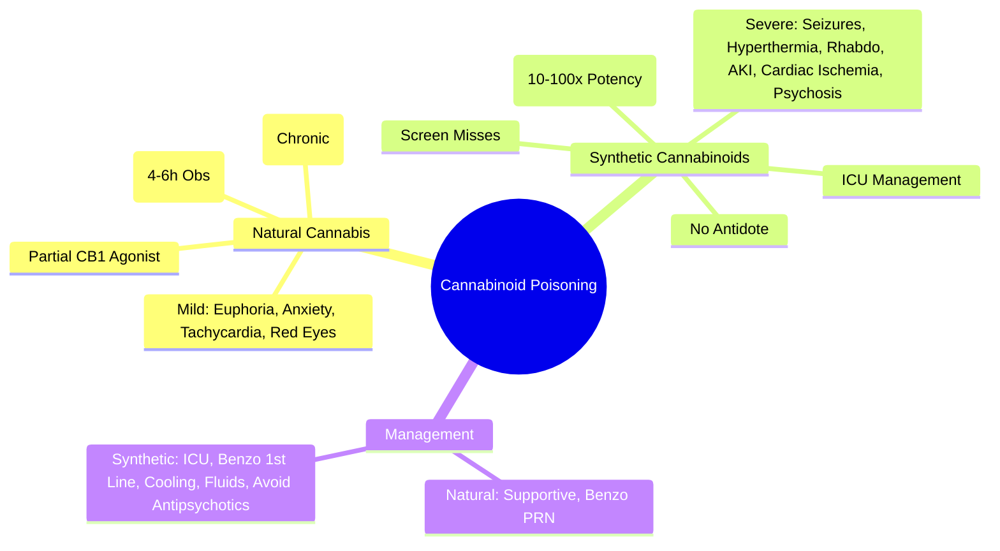
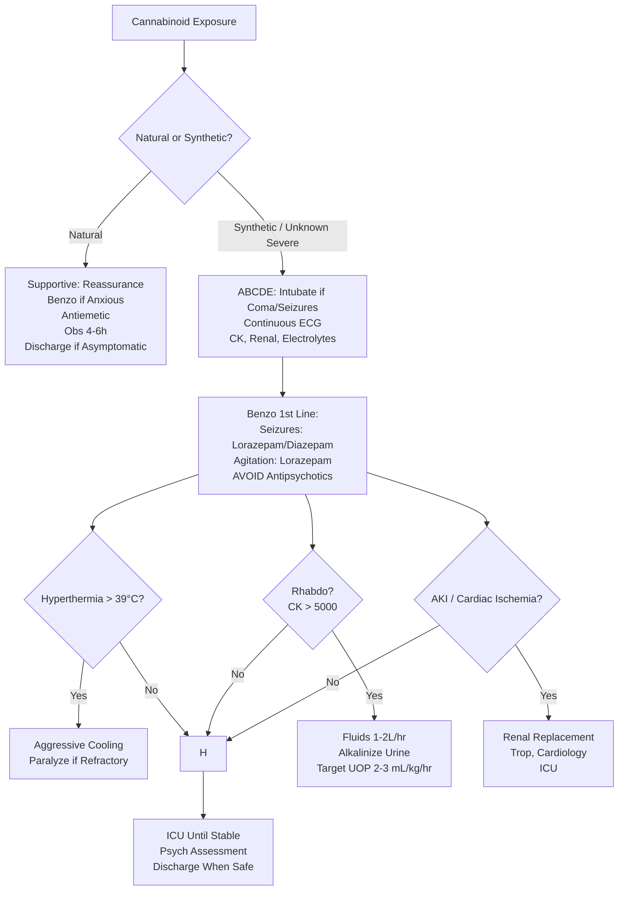

Related: [[General Principles of Poisoning Management]], [[Sedative-Hypnotic Toxidrome]], [[Antidotes Overview]], [[Sympathomimetic Toxidrome]]

> [!tip]
> **Natural cannabis**: generally benign, self-limiting. **Synthetic cannabinoids (K2/Spice)**: **severe toxicity** — seizures, hyperthermia, rhabdo, AKI, psychosis, cardiac ischemia, death. **CB₁ receptor**: natural = partial agonist; synthetic = **full agonist** (higher efficacy, potency). Key FCPS/MRCP: natural = supportive, obs 4-6h; synthetic = treat as severe stimulant/toxic syndrome (benzos, cooling, fluids, rhabdo monitoring); **NO specific antidote**.

## 1. Learning Objectives
- Differentiate natural cannabis from synthetic cannabinoid toxicity
- Recognize severe synthetic cannabinoid syndrome
- Apply supportive management
- Identify when admission/ICU required

## 2. Definition
Cannabinoid poisoning = toxicity from **phytocannabinoids** (Δ⁹-THC from cannabis) or **synthetic cannabinoid receptor agonists** (SCRAs: JWH-018, AM-2201, 5F-ADB, etc.) acting on CB₁/CB₂ receptors causing neuropsychiatric, cardiovascular, and systemic effects.

## 3. Core Physiology
- **Receptors**: **CB₁** (CNS: hippocampus, basal ganglia, cerebellum, cortex) → psychoactive; **CB₂** (immune, peripheral) → immunomodulation
- **Natural cannabis (Δ⁹-THC)**: **partial agonist** at CB₁ (lower efficacy, ceiling effect)
- **Synthetic cannabinoids (SCRAs)**: **full agonists** at CB₁ (higher efficacy, **no ceiling**, 10-100x potency) → **severe, unpredictable toxicity**
- **Pharmacokinetics**: THC lipophilic, large Vd, hepatic metabolism (CYP2C9, CYP3A4) → active metabolites (11-OH-THC), long half-life (days in chronic users)
- **SCRA metabolism**: rapid, variable, unknown toxic metabolites

## 4. Clinical Features

### Natural Cannabis (Generally Mild, Self-Limiting)
- **CNS**: euphoria, relaxation, **anxiety/paranoia**, time distortion, impaired memory/attention, **sedation**
- **Psychiatric**: transient psychosis (high dose, vulnerable individuals), depersonalization
- **Cardiovascular**: **tachycardia** (reflex), mild hypertension → hypotension (orthostatic), **rare MI** (young users)
- **Ocular**: **conjunctival injection** (red eyes), dry mouth
- **GI**: increased appetite ("munchies"), nausea/vomiting (cannabinoid hyperemesis syndrome — chronic)
- **Respiratory**: bronchodilation (acute), chronic bronchitis (smoking)
- **Duration**: peak 30 min (smoked), 1-3h (oral); effects 2-4h (smoked), 6-8h (oral)

### Synthetic Cannabinoids (Severe, Unpredictable)
- **CNS**: **severe agitation, psychosis, delirium, coma, seizures** (common, refractory), catatonia
- **Cardiovascular**: **tachycardia, hypertension, myocardial ischemia/infarction, arrhythmias**, cardiac arrest
- **Autonomic**: **hyperthermia** (often > 40°C), diaphoresis, mydriasis
- **Muscular**: **rhabdomyolysis** (severe, CK > 100,000), muscle rigidity
- **Renal**: **acute kidney injury** (rhabdo, direct tubular toxicity, vasculitis)
- **Hematologic**: **thrombocytopenia**, DIC
- **Electrolyte**: severe hypokalemia, metabolic acidosis
- **Duration**: variable (hours to days), prolonged by unknown metabolites

## 5. Differential Diagnosis
- **Natural cannabis**: mild, self-limiting, anxiety/paranoia, tachycardia, red eyes
- **Synthetic cannabinoid**: severe, seizures, hyperthermia, rhabdo, AKI, psychosis, cardiac ischemia
- **Sympathomimetic**: diaphoresis, hyperreflexia, no conjunctival injection
- **Anticholinergic**: dry, hot, dilated, delirium, urinary retention
- **Serotonin syndrome**: clonus, hyperreflexia, serotonergic agent
- **NMS**: rigidity, bradykinesia, dopamine blocker

## 6. Investigations
- **Urine drug screen**: **THC-COOH** (metabolite) — detects natural cannabis; **most standard screens MISS synthetic cannabinoids** (constantly changing structures)
- **Specialized testing**: LC-MS/MS for specific SCRA (not routinely available acutely)
- **ECG**: tachycardia, ST changes, QT
- **CK**: rhabdo (synthetic)
- **Renal function**: AKI
- **Electrolytes**: K⁺, Na⁺, acid-base
- **CXR**: pulmonary edema
- **Paracetamol level** (always)
- **Trop**: if chest pain

## 7. Management

### Natural Cannabis (Supportive)
- **Observation 4-6h** until asymptomatic
- **Reassurance** for anxiety/paranoia
- **Benzodiazepines** (lorazepam 1-2 mg IV/PO) for severe anxiety/agitation
- **Antiemetics** (ondansetron) for nausea
- **Fluid resuscitation** if dehydrated
- **Discharge** when asymptomatic + psych safe

### Synthetic Cannabinoids (Aggressive Supportive)
- **ABCDE**: **intubate early** for coma, seizures, respiratory failure
- **Seizures**: **benzodiazepines 1st line** (lorazepam/diazepam) → phenobarbital/propofol if refractory
- **Agitation/psychosis**: benzodiazepines; **avoid antipsychotics** (lower seizure threshold, QT prolongation)
- **Hyperthermia**: aggressive cooling (evaporative, ice, cold fluids); **paralyze + ventilate if refractory**
- **Hypertension/tachycardia**: benzodiazepines usually suffice; vasodilators (nicardipine) if refractory
- **Rhabdomyolysis**: aggressive IV fluids (1-2 L/hr), alkalinization, target UOP 2-3 mL/kg/hr
- **AKI**: renal replacement if indicated
- **Electrolytes**: correct K⁺, Mg²⁺, Ca²⁺
- **Cardiac monitoring**: continuous ECG, trop if chest pain
- **ICU admission** for severe cases

### No Specific Antidote
- **Flumazenil**: not effective (not benzo receptor)
- **Naloxone**: not effective
- **Rimonabant** (CB₁ antagonist): withdrawn, not available

## 8. Complications
- **Natural**: transient psychosis, cannabinoid hyperemesis syndrome (chronic), impaired driving
- **Synthetic**: **death** (cardiac arrest, hyperthermia, rhabdo, AKI, DIC), permanent neurological deficit, chronic psychosis, CKD

## 9. Prognosis
- **Natural cannabis**: excellent, full recovery
- **Synthetic cannabinoids**: variable; mortality reported; survivors may have permanent renal/neurological/psychiatric sequelae

## 10. FCPS/MRCP High-Yield Points
1. **Natural cannabis** = generally benign, self-limiting, obs 4-6h
2. **Synthetic cannabinoids** = **full CB₁ agonists** → **severe toxicity** (seizures, hyperthermia, rhabdo, AKI, cardiac ischemia, death)
3. **Standard urine screen MISSES synthetic cannabinoids** (changing structures)
4. **No specific antidote** (flumazenil/naloxone/rimonabant not effective/available)
5. **Management**: benzos 1st line (seizures, agitation, HTN), aggressive cooling, fluids for rhabdo
6. **Avoid antipsychotics** in synthetic (lower seizure threshold)
7. **Conjunctival injection** = natural cannabis clue
8. **Cannabinoid hyperemesis syndrome** = chronic daily use → cyclic vomiting, relieved by hot showers
9. **Synthetic = treat as severe toxic syndrome** (like amphetamine but more unpredictable)

## 11. Common Viva Questions
1. Natural vs synthetic cannabinoid differences
2. Why standard urine screen misses synthetic cannabinoids
3. Management of synthetic cannabinoid toxicity
4. Cannabinoid hyperemesis syndrome
5. Why no specific antidote?

## 12. Common Confusions / Exam Traps
- **Synthetic = natural cannabis** → NO, far more severe, full agonist
- **Urine screen detects synthetic** → NO, misses most
- **Flumazenil works** → NO (different receptor)
- **Antipsychotics for synthetic psychosis** → AVOID (seizure risk)
- **"K2/Spice" = safe** → NO, dangerous
- **Treatment same for both** → NO, synthetic requires aggressive ICU care

## 13. Mnemonics
- **NATURAL CANNABIS**: **R**ed eyes, **E**uphoria, **L**ow toxicity, **A**nxiety/paranoia, **X** (self-limiting)
- **SYNTHETIC CANNABINOID**: **S**eizures, **Y** (why so severe?), **N**o ceiling (full agonist), **T**achy/HTN, **H**yperthermia, **E** (rhabdo/AKI), **T**oxic metabolites, **I**CU, **C**ardiac ischemia
- **CB1 AGONIST**: **C**annabis = **P**artial (safer); **S**ynthetic = **F**ull (deadly)

## 14. Mind Map

## 15. Flowchart

## 16. Suggested Visuals / Image Notes
- Natural vs synthetic comparison table
- Cannabinoid hyperemesis syndrome cycle
- Urine screen limitations

## 17. Suggested Video References
- Synthetic cannabinoid toxicity review (Toxicology, EM:RAP)

## 18. One-Page Revision Summary
- **Natural**: partial agonist, mild, red eyes, anxiety, tachycardia, obs 4-6h
- **Synthetic**: full agonist, severe, seizures, hyperthermia, rhabdo, AKI, cardiac ischemia, death
- **Screen misses synthetic** (changing structures)
- **No antidote** (flumazenil/naloxone no effect)
- **Synthetic management**: benzos 1st line, aggressive cooling, fluids for rhabdo, avoid antipsychotics
- **Natural management**: supportive, benzo PRN, obs 4-6h
- **Cannabinoid hyperemesis**: chronic daily use → cyclic vomiting + hot shower relief

## 24-Hour Recall Prompts
- State key difference: natural (partial) vs synthetic (full) agonist
- List 5 severe features of synthetic cannabinoid toxicity
- Explain why urine screen misses synthetic
- Describe management priorities for synthetic

## 7-Day / 15-Day / 30-Day Revision Tracker
- [ ] Day 1 completed
- [ ] 24-hour recall completed
- [ ] Day 7 revision completed
- [ ] Day 15 revision completed
- [ ] Day 30 revision completed

## 19. Must Know / Should Know / Nice to Know
### Must Know
- Natural = partial agonist, mild; Synthetic = full agonist, severe
- Synthetic = seizures, hyperthermia, rhabdo, AKI, cardiac ischemia
- Screen misses synthetic
- No antidote
- Synthetic: benzos 1st line, cooling, fluids, IVO antipsychotics
- Natural: supportive, obs 4-6h

### Should Know
- Cannabinoid hyperemesis syndrome (hot shower relief)
- CB₁ partial vs full agonist mechanism
- Specific synthetic compounds (JWH-018, AM-2201, 5F-ADB)
- Rhabdo/AKI management in synthetic

### Nice to Know
- Specific synthetic generations (1st: naphthoylindoles; 2nd: adamantoylindoles; 3rd: indazole carboxylates)
- Long-term psychiatric sequelae
- Driving impairment detection

## 20. Self-Test Scorecard
- Understanding: /10
- Recall: /10
- MCQ Performance: /10
- SBA Performance: /10
- Viva Confidence: /10
- Total: /50

> [!tip]
> Interpretation: <35 = weak topic, 35-44 = acceptable but insecure, 45+ = strong exam-ready topic.

## 21. Exam Answer Modes
### Long Answer Skeleton
- CB₁ partial vs full agonist
- Natural: features, management
- Synthetic: features, severe complications
- Screen limitations
- Management algorithms
- Hyperemesis syndrome

### Short Note Skeleton
- Natural vs synthetic comparison table
- Synthetic severe features list
- Management algorithm

### Viva One-Liners
- "Natural cannabis: partial CB₁ agonist, mild, red eyes, obs 4-6h"
- "Synthetic cannabinoids: FULL CB₁ agonists → seizures, hyperthermia, rhabdo, AKI, death"
- "Urine screen MISSES synthetic cannabinoids (constantly changing)"
- "NO specific antidote for cannabinoids"
- "Synthetic: benzos 1st line (seizures, agitation); avoid antipsychotics"
- "Aggressive cooling + fluids for synthetic hyperthermia/rhabdo"
- "Natural: supportive, reassurance, obs 4-6h"
- "Cannabinoid hyperemesis: chronic daily use + cyclic vomiting + hot shower relief"

### Ward-Case Discussion Points
- Young patient with seizures, hyperthermia, AKI after "spice" → synthetic cannabinoid, ICU
- Chronic cannabis user with cyclic vomiting relieved by hot showers → cannabinoid hyperemesis
- "K2/Spice" user with agitation → benzos, avoid haloperidol

### Last-Night-Before-Exam Sheet
- Natural: Partial Agonist, Mild, Red Eyes, Obs 4-6h
- Synthetic: Full Agonist, Severe (Seizures, Hyperthermia, Rhabdo, AKI, Death)
- Screen Misses Synthetic
- No Antidote
- Synthetic: Benzo 1st Line, Cooling, Fluids, NO Antipsychotics
- Hyperemesis: Hot Shower Relief

## 22. Summary
**Natural cannabis** = partial CB₁ agonist → mild, self-limiting (euphoria, anxiety, tachycardia, conjunctival injection), obs 4-6h. **Synthetic cannabinoids** = **full CB₁ agonists** (10-100x potency) → **severe: seizures, hyperthermia, rhabdomyolysis, AKI, cardiac ischemia, death**. **Standard urine screen MISSES synthetic**. **NO specific antidote**. **Synthetic management**: ICU, **benzos 1st line**, aggressive cooling, fluids for rhabdo, **avoid antipsychotics**. **Natural management**: supportive, obs 4-6h. **Cannabinoid hyperemesis syndrome**: chronic daily use → cyclic vomiting relieved by hot showers.

## 23. MCQs (10)
1. Question 1
   A. Option A
   B. Option B
   C. Option C
   D. Option D
   **Answer: A**
   *Explanation: Explanation 1*

2. Question 2
   A. Option A
   B. Option B
   C. Option C
   D. Option D
   **Answer: B**
   *Explanation: Explanation 2*

3. Question 3
   A. Option A
   B. Option B
   C. Option C
   D. Option D
   **Answer: C**
   *Explanation: Explanation 3*

4. Question 4
   A. Option A
   B. Option B
   C. Option C
   D. Option D
   **Answer: D**
   *Explanation: Explanation 4*

5. Question 5
   A. Option A
   B. Option B
   C. Option C
   D. Option D
   **Answer: A**
   *Explanation: Explanation 5*

6. Question 6
   A. Option A
   B. Option B
   C. Option C
   D. Option D
   **Answer: B**
   *Explanation: Explanation 6*

7. Question 7
   A. Option A
   B. Option B
   C. Option C
   D. Option D
   **Answer: C**
   *Explanation: Explanation 7*

8. Question 8
   A. Option A
   B. Option B
   C. Option C
   D. Option D
   **Answer: D**
   *Explanation: Explanation 8*

9. Question 9
   A. Option A
   B. Option B
   C. Option C
   D. Option D
   **Answer: A**
   *Explanation: Explanation 9*

10. Question 10
   A. Option A
   B. Option B
   C. Option C
   D. Option D
   **Answer: B**
   *Explanation: Explanation 10*

## 24. SBA Questions (10)
1. Scenario 1
   A. Option A
   B. Option B
   C. Option C
   D. Option D
   **Answer: A**
   *Explanation: Explanation 1*

2. Scenario 2
   A. Option A
   B. Option B
   C. Option C
   D. Option D
   **Answer: B**
   *Explanation: Explanation 2*

3. Scenario 3
   A. Option A
   B. Option B
   C. Option C
   D. Option D
   **Answer: C**
   *Explanation: Explanation 3*

4. Scenario 4
   A. Option A
   B. Option B
   C. Option C
   D. Option D
   **Answer: D**
   *Explanation: Explanation 4*

5. Scenario 5
   A. Option A
   B. Option B
   C. Option C
   D. Option D
   **Answer: A**
   *Explanation: Explanation 5*

6. Scenario 6
   A. Option A
   B. Option B
   C. Option C
   D. Option D
   **Answer: B**
   *Explanation: Explanation 6*

7. Scenario 7
   A. Option A
   B. Option B
   C. Option C
   D. Option D
   **Answer: C**
   *Explanation: Explanation 7*

8. Scenario 8
   A. Option A
   B. Option B
   C. Option C
   D. Option D
   **Answer: D**
   *Explanation: Explanation 8*

9. Scenario 9
   A. Option A
   B. Option B
   C. Option C
   D. Option D
   **Answer: A**
   *Explanation: Explanation 9*

10. Scenario 10
   A. Option A
   B. Option B
   C. Option C
   D. Option D
   **Answer: B**
   *Explanation: Explanation 10*

## 25. Flashcards
- Q: Flashcard 1 question
  A: Flashcard 1 answer
- Q: Flashcard 2 question
  A: Flashcard 2 answer
- Q: Flashcard 3 question
  A: Flashcard 3 answer
- Q: Flashcard 4 question
  A: Flashcard 4 answer
- Q: Flashcard 5 question
  A: Flashcard 5 answer
- Q: Flashcard 6 question
  A: Flashcard 6 answer
- Q: Flashcard 7 question
  A: Flashcard 7 answer
- Q: Flashcard 8 question
  A: Flashcard 8 answer
- Q: Flashcard 9 question
  A: Flashcard 9 answer
- Q: Flashcard 10 question
  A: Flashcard 10 answer
- Q: Flashcard 11 question
  A: Flashcard 11 answer
- Q: Flashcard 12 question
  A: Flashcard 12 answer
- Q: Flashcard 13 question
  A: Flashcard 13 answer
- Q: Flashcard 14 question
  A: Flashcard 14 answer
- Q: Flashcard 15 question
  A: Flashcard 15 answer

## 26. Answer Key with Explanations
### MCQs
1. **A** - Explanation 1
2. **B** - Explanation 2
3. **C** - Explanation 3
4. **D** - Explanation 4
5. **A** - Explanation 5
6. **B** - Explanation 6
7. **C** - Explanation 7
8. **D** - Explanation 8
9. **A** - Explanation 9
10. **B** - Explanation 10

### SBAs
1. **A** - Explanation 1
2. **B** - Explanation 2
3. **C** - Explanation 3
4. **D** - Explanation 4
5. **A** - Explanation 5
6. **B** - Explanation 6
7. **C** - Explanation 7
8. **D** - Explanation 8
9. **A** - Explanation 9
10. **B** - Explanation 10

## PasTest Scenario SBAs (Clinical Vignettes)

> **Auto-generated PasTest/Mediscope-style scenario SBAs** grounded in the authored source. Each scenario tests a real clinical fact (triad, specific sign, contraindication, trial, first-line Rx) extracted from the topic. *Source: Ch 11: Poisoning — Cannabis and Synthetic Cannabinoid Poisoning*

**Q1.** Which of the following features is most specific or characteristic of Cannabis and Synthetic Cannabinoid Poisoning?

  - **A.** Specialized testing
  - **B.** A feature common to many acute inflammatory conditions
  - **C.** A non-specific sign that does not localise the diagnosis
  - **D.** An investigation finding rather than a clinical feature

  > **Answer: A** — Specialized testing
  >
  > *Source:* cannabis; **most standard screens MISS synthetic cannabinoids** (constantly changing structures)
- **Specialized testing**: LC-MS/MS for specific SCRA (not routinely available acutely)
- **ECG**: tach

