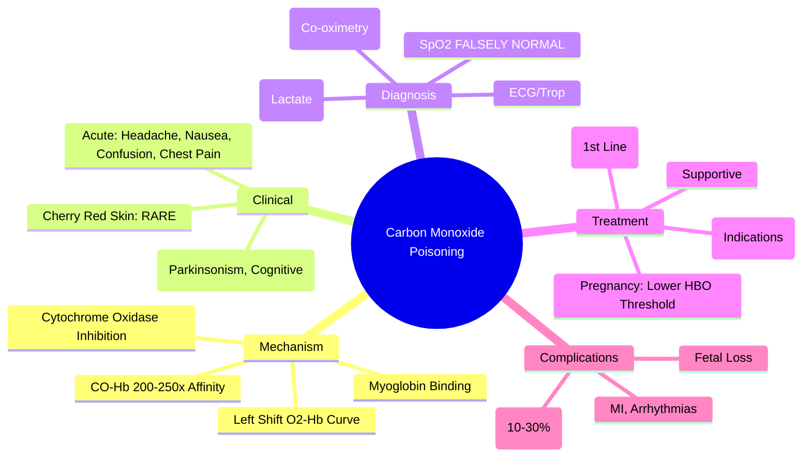
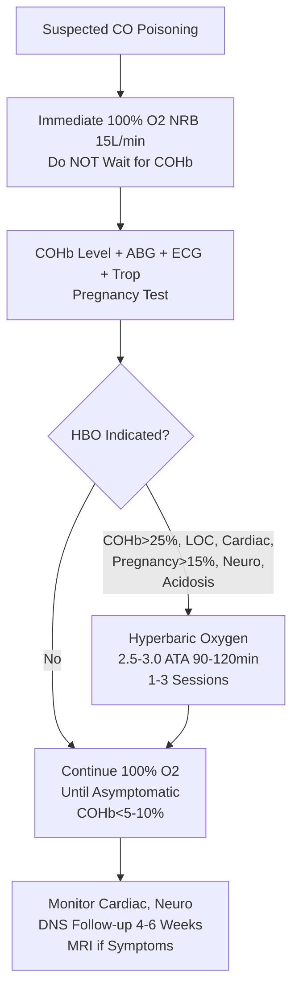

Related: [[General Principles of Poisoning Management]], [[Cyanide Poisoning]], [[Antidotes Overview]], [[Enhanced Elimination (Dialysis, Hemoperfusion)]]

> [!tip]
> **CO binds Hb with 200-250x affinity** → carboxyhemoglobin (COHb) → **tissue hypoxia** + **cytochrome oxidase inhibition**. **100% O₂** = antidote (half-life 30 min vs 4-5h on RA). **HBO (hyperbaric oxygen)** for COHb > 25%, LOC, cardiac ischemia, pregnancy > 15%, persistent neuro symptoms. Key FCPS/MRCP: **cherry-red skin RARE**; normal COHb ≠ excludes CO if on O₂; HBO criteria; pregnancy lower threshold; delayed neurological sequelae (DNS) 2-40 days.

## 1. Learning Objectives
- Recognize CO poisoning (headache, nausea, confusion, cherry-red skin rare)
- Apply 100% oxygen therapy (non-rebreather mask)
- Identify hyperbaric oxygen (HBO) indications
- Understand COHb kinetics and limitations
- Recognize delayed neurological sequelae (DNS)

## 2. Definition
Carbon monoxide poisoning = tissue hypoxia from CO binding to hemoglobin (forming carboxyhemoglobin, COHb) and inhibition of mitochondrial cytochrome c oxidase (Complex IV).

## 3. Core Physiology
- **CO source**: incomplete combustion (fires, generators, car exhaust, faulty heaters, methylene chloride metabolism)
- **CO-Hb affinity**: **200-250x** > O₂-Hb → **COHb** formation
- **Effects**:
  1. **Functional anemia**: Hb bound to CO cannot carry O₂
  2. **Left shift** of O₂-Hb dissociation curve → impaired O₂ offloading to tissues
  3. **Cytochrome c oxidase inhibition** (Complex IV) → **cellular hypoxia** (independent of COHb)
  4. **Myoglobin binding** → cardiac dysfunction
  5. **Inflammatory/immune mediators** → delayed neurological sequelae (DNS)
- **Half-life**:
  - Room air (21% O₂): **4-5 hours**
  - 100% O₂ (NRB): **~30-60 minutes**
  - HBO (2.5-3 ATA): **~15-20 minutes**

## 4. Clinical Features

### Acute
- **Headache** (most common, often frontal)
- **Nausea, vomiting**
- **Dizziness, confusion, ataxia**
- **Chest pain** (cardiac ischemia — COHb > 10-20%)
- **Dyspnea**
- **Cherry-red skin** — **RARE** (< 10%), post-mortem finding mostly
- **Syncope, seizures, coma** (severe)
- **Cardiac**: arrhythmias, MI, heart failure

### Delayed Neurological Sequelae (DNS) — 2-40 days post-exposure
- **Incidence**: 10-30% (higher if LOC, age > 35, COHb > 25%)
- **Features**: cognitive impairment, memory loss, personality change, **parkinsonism**, incontinence, gait disturbance, cortical blindness
- **Pathophysiology**: demyelination (white matter), oxidative stress, inflammation
- **Not prevented by HBO** (evidence mixed)

## 5. Differential Diagnosis
- **Viral illness** (flu-like): headache, nausea, myalgia — **CO clustering** (multiple people, same location)
- **Cyanide**: soot in fires, bitter almond smell, lactic acidosis, **COHb normal**
- **Hydrogen sulfide**: rotten egg smell
- **Alcohol/sedative OD**: no COHb elevation
- **Meningitis/encephalitis**: fever, meningeal signs
- **Stroke**: focal deficits

## 6. Investigations

### Mandatory
1. **Carboxyhemoglobin (COHb)** — **arterial or venous** (difference minimal); **non-invasive CO-oximeter (SpCO)** available but confirm with lab
2. **100% O₂ immediately** — do NOT wait for COHb
3. **ABG/VBG** — pH, lactate (tissue hypoxia marker)
4. **ECG** — ischemia, arrhythmias
5. **Troponin** — if cardiac symptoms
6. **CXR** — aspiration, pulmonary edema
7. **CK** — rhabdo if prolonged immobilization
8. **Paracetamol level** (always)
9. **Pregnancy test** (females childbearing age)

### Interpretation Caveats
- **COHb normal on 100% O₂ ≠ excludes CO poisoning** — half-life 30 min on O₂
- **COHb level correlates poorly with severity** — tissue hypoxia from cytochrome inhibition independent
- **Pulse oximetry (SpO₂) reads FALSELY NORMAL** — reads COHb as oxyhemoglobin (2-wavelength)
- **CO-oximetry (SpCO/COHb) required** — 4+ wavelength

## 7. Management

### 1. Immediate: 100% Oxygen (NRB Mask) — **FIRST-LINE ANTIDOTE**
- **Non-rebreather mask 15 L/min** — **do NOT delay** for COHb level
- **Continue until**: asymptomatic AND COHb < 5% (or < 10% some guidelines)
- **Duration**: typically 4-6 hours (4-5 half-lives)
- **Intubated**: FiO₂ 1.0

### 2. Hyperbaric Oxygen (HBO) — **Indications (Any One)**
- **COHb > 25%** (or > 20% some guidelines)
- **Loss of consciousness** (any duration)
- **Cardiac ischemia** (chest pain, ECG changes, elevated troponin)
- **Pregnancy** with **COHb > 15%** (fetal Hb higher affinity, longer half-life)
- **Persistent neurological symptoms** (confusion, ataxia, memory deficits) after normobaric O₂
- **Metabolic acidosis** (pH < 7.2, lactate > 4)
- **Age > 65** (some guidelines)

**HBO Protocol**: 2.5-3.0 ATA for 90-120 min, 1-3 sessions (controversial; NICE: consider if above criteria)

### 3. Supportive Care
- **Cardiac monitoring** (continuous)
- **Fluid resuscitation** (cautious — pulmonary edema risk)
- **Treat seizures** (benzodiazepines)
- **Correct metabolic acidosis** (bicarbonate if pH < 7.2)
- **Thiamine 100 mg IV** (Wernicke prevention)

### 4. Pregnancy
- **Fetal COHb 10-15% higher than maternal** (higher affinity)
- **Fetal half-life longer** (5-7h on RA)
- **HBO threshold lower**: COHb > 15% OR any symptoms
- **Obstetric consultation** + fetal monitoring

### 5. Delayed Neurological Sequelae (DNS)
- **Follow-up**: 4-6 weeks post-discharge
- **Screen**: cognitive testing (MMSE/MoCA), neurological exam
- **MRI brain** (T2/FLAIR) — white matter hyperintensities (globus pallidus, hippocampus, white matter)
- **Management**: supportive, rehabilitation, neuropsychology

## 8. Complications
- Myocardial infarction
- Arrhythmias
- Rhabdomyolysis
- Pulmonary edema (neurogenic/non-cardiogenic)
- Delayed neurological sequelae (DNS)
- Death

## 9. Prognosis
- **Acute**: good with early 100% O₂
- **Mortality**: < 5% with treatment; higher if cardiac arrest
- **DNS**: 10-30% incidence; may be permanent
- **Pregnancy**: fetal loss risk up to 50% in severe maternal poisoning

## 10. FCPS/MRCP High-Yield Points
1. **100% O₂ via NRB = first-line antidote** (half-life 30 min vs 4-5h RA)
2. **Cherry-red skin RARE** (< 10%) — do not rely on it
3. **HBO indications**: COHb > 25%, LOC, cardiac ischemia, **pregnancy > 15%**, persistent neuro symptoms, acidosis
4. **Pulse oximetry FALSELY NORMAL** — need CO-oximetry
5. **Normal COHb on O₂ ≠ excludes poisoning** (half-life 30 min)
6. **COHb correlates poorly with severity** (cytochrome inhibition independent)
7. **Delayed neurological sequelae (DNS)**: 2-40 days, 10-30%, parkinsonism, cognitive
8. **Pregnancy**: lower HBO threshold (COHb > 15%), fetal risk
9. **Methylene chloride** (paint stripper) metabolized to CO
10. **Fire victims**: consider **cyanide co-exposure** (soot, lactic acidosis)

## 11. Common Viva Questions
1. 100% O₂ half-life vs room air
2. HBO indications (memorize list)
3. Why pulse oximetry misleading?
4. COHb correlation with severity
5. Pregnancy management
6. Delayed neurological sequelae features/timing
7. Methylene chloride connection
8. Fire victim: CO vs cyanide differentiation

## 12. Common Confusions / Exam Traps
- **Cherry-red skin** = common misconception — it's RARE
- **SpO₂ normal = no CO** → FALSE (reads COHb as oxyHb)
- **COHb normal on O₂ = no poisoning** → FALSE (half-life 30 min)
- **HBO for all CO poisoning** → NO, specific indications only
- **COHb > 25% = mandatory HBO** → guideline dependent (some > 20%)
- **DNS prevented by HBO** → evidence mixed, not guaranteed
- **Pregnancy threshold same as adult** → NO, lower (COHb > 15%)
- **Methylene chloride** → metabolized to CO (paint strippers)

## 13. Mnemonics
- **CO PATHOPHYSIOLOGY**: **2**00x **A**ffinity → **COHb** + **C**ytochrome **O**xidase **I**nhibition
- **100% O₂ HALF-LIFE**: **R**oom **A**ir **4-5h** → **1**00% **O₂ 30min** → **H**BO **15-20min**
- **HBO INDICATIONS**: **C**OHb > 25%, **L**OC, **C**ardiac **I**schemia, **P**regnancy > 15%, **N**euro **S**ymptoms, **A**cidosis
- **PREGNANCY**: **F**etal **C**OHb **H**igher, **L**onger **T**½, **H**BO > 15%
- **DNS**: **D**elayed **N**eurological **S**equelae: **2-40 days**, **P**arkinsonism, **C**ognitive

## 14. Mind Map

## 15. Flowchart

## 16. Suggested Visuals / Image Notes
- O₂-Hb dissociation curve left shift
- HBO indications poster
- COHb half-life graph (RA vs 100% O₂ vs HBO)
- DNS timeline

## 17. Suggested Video References
- CO poisoning management (NICE, Toxbase)
- HBO therapy overview

## 18. One-Page Revision Summary
- **Mechanism**: COHb (200x affinity) + cytochrome oxidase inhibition
- **100% O₂ NRB** = antidote (half-life 30 min vs 4-5h RA)
- **HBO**: COHb>25%, LOC, cardiac ischemia, **pregnancy>15%**, neuro symptoms, acidosis
- **Cherry-red skin RARE** (< 10%)
- **SpO₂ FALSELY NORMAL** — need co-oximetry
- **Normal COHb on O₂ ≠ excludes**
- **DNS**: 2-40 days, parkinsonism, cognitive
- **Pregnancy**: fetal COHb higher, HBO > 15%
- **Methylene chloride** → CO
- **Fire victims**: consider cyanide

## 24-Hour Recall Prompts
- State 100% O₂ half-life and HBO half-life
- List 6 HBO indications
- Explain why SpO₂ is falsely normal
- Describe DNS timing and features

## 7-Day / 15-Day / 30-Day Revision Tracker
- [ ] Day 1 completed
- [ ] 24-hour recall completed
- [ ] Day 7 revision completed
- [ ] Day 15 revision completed
- [ ] Day 30 revision completed

## 19. Must Know / Should Know / Nice to Know
### Must Know
- 100% O₂ NRB immediate (half-life 30 min)
- HBO indications (COHb>25%, LOC, cardiac, pregnancy>15%, neuro, acidosis)
- SpO₂ falsely normal
- Cherry-red skin rare
- DNS 2-40 days
- Pregnancy lower threshold
- COHb correlates poorly with severity

### Should Know
- HBO protocol (2.5-3 ATA, 90-120 min)
- Methylene chloride metabolized to CO
- Fire victims: consider cyanide
- Lactate elevation from cytochrome inhibition

### Nice to Know
- DNS pathophysiology (demyelination, inflammation)
- Neuroimaging findings (globus pallidus, hippocampus)
- HBO evidence controversies
- Specific CO sources (generators, heaters, fires)

## 20. Self-Test Scorecard
- Understanding: /10
- Recall: /10
- MCQ Performance: /10
- SBA Performance: /10
- Viva Confidence: /10
- Total: /50

> [!tip]
> Interpretation: <35 = weak topic, 35-44 = acceptable but insecure, 45+ = strong exam-ready topic.

## 21. Exam Answer Modes
### Long Answer Skeleton
- Mechanism (COHb + cytochrome oxidase)
- Clinical (acute + DNS)
- Diagnosis (COHb, SpO₂ limitation, ABG)
- Management: 100% O₂ → HBO (indications) → supportive → pregnancy → DNS follow-up
- Complications/prognosis

### Short Note Skeleton
- HBO indications list
- COHb half-life comparison
- Acute vs DNS features
- Pregnancy box

### Viva One-Liners
- "CO: 200x affinity → COHb + cytochrome oxidase inhibition"
- "100% O₂: half-life 30 min (RA 4-5h); HBO: 15-20 min"
- "HBO: COHb>25%, LOC, cardiac, pregnancy>15%, neuro, acidosis"
- "SpO₂ FALSELY NORMAL (reads COHb as oxyHb) — need co-oximetry"
- "Cherry-red skin RARE (<10%)"
- "Normal COHb on O₂ ≠ excludes (half-life 30 min)"
- "DNS: 2-40 days, parkinsonism, cognitive (10-30%)"
- "Pregnancy: HBO > 15% COHb (fetal Hb higher affinity)"
- "Methylene chloride → CO"
- "Fire victims: think cyanide too"

### Ward-Case Discussion Points
- Family with headache/nausea from faulty heater → all need COHb + 100% O₂
- Patient on 100% O₂ for 2h, COHb 3% → continue until asymptomatic
- Pregnant woman COHb 18% → HBO indicated
- Firefighter with soot, lactate 8, COHb 15% → consider cyanide, HBO for both

### Last-Night-Before-Exam Sheet
- 100% O2: 30min half-life
- HBO: COHb>25, LOC, Cardiac, Preg>15, Neuro, Acidosis
- SpO2: False normal
- Cherry red: Rare
- COHb: Poor severity correlation
- DNS: 2-40 days, Parkinsonism
- Preg: HBO >15%
- Methylene chloride → CO
- Fire: + Cyanide

## 22. Summary
CO poisoning = COHb (200x affinity) + cytochrome oxidase inhibition → tissue hypoxia. 100% O₂ NRB immediate (half-life 30 min). HBO for COHb>25%, LOC, cardiac ischemia, pregnancy>15%, persistent neuro symptoms, acidosis. SpO₂ falsely normal. Cherry-red skin rare. DNS 2-40 days (parkinsonism, cognitive). Pregnancy: fetal risk, HBO > 15%. Methylene chloride → CO. Fire victims: consider cyanide co-exposure.

## 23. MCQs (10)
1. CO poisoning - mechanism of toxicity?
   A. Competitive inhibition of cytochrome oxidase
   B. High-affinity binding to hemoglobin (200-250x O₂) + cytochrome oxidase inhibition
   C. Methemoglobin formation
   D. Direct pulmonary toxicity
   **Answer: B**
   *Explanation: CO: binds Hb with 200-250x affinity vs O₂ → carboxyhemoglobin (COHb) → left shift O₂ dissociation curve (impaired O₂ delivery) + inhibits cytochrome c oxidase (cellular hypoxia).*

2. CO half-life on room air vs 100% O₂ vs HBO?
   A. 4-5h / 60min / 20min
   B. 4-5h / 30min / 20min
   C. 2h / 30min / 10min
   D. 4-5h / 90min / 30min
   **Answer: B**
   *Explanation: COHb half-life: Room air 4-5h, 100% O₂ (NRB) 30-90min, HBO (3 ATA) 20-30min. 100% O₂ first-line.*

3. HBO indications for CO poisoning?
   A. COHb > 10%
   B. COHb > 25% (or >15% pregnancy), LOC, cardiac ischemia, persistent neuro symptoms
   C. COHb > 50% only
   D. Never indicated
   **Answer: B**
   *Explanation: HBO if: COHb > 25% (or >15% in pregnancy), loss of consciousness, cardiac ischemia, persistent neuro symptoms. 100% O₂ first.*

4. CO poisoning - cherry red skin?
   A. Always present
   B. Rare, late sign, NOT reliable
   C. Only in fatal cases
   D. Only with severe acidosis
   **Answer: B**
   *Explanation: Cherry red skin: rare, late, post-mortem finding. NOT reliable for diagnosis. Most patients look normal/pale.*

5. COHb level correlates with clinical severity?
   A. Yes, perfectly
   B. Poorly - clinical picture guides treatment, not level alone
   C. Only > 50%
   D. Only in children
   **Answer: B**
   *Explanation: COHb level correlates POORLY with severity. Clinical picture (LOC, cardiac, neuro) guides HBO decision. Level can be normal if on O₂ before sampling.*

6. CO poisoning in pregnancy - fetal risk?
   A. None
   B. Fetal Hb has higher affinity for CO → fetal COHb 10-15% higher than maternal, longer half-life
   C. Same as maternal
   D. Lower risk
   **Answer: B**
   *Explanation: Fetal Hb has higher affinity for CO → fetal COHb 10-15% higher than maternal, longer half-life. HBO threshold lower (>15% maternal COHb).*

7. Delayed neuropsychiatric syndrome (DNS) post-CO?
   A. Immediate
   B. 2-40 days post-exposure: cognitive deficit, personality change, Parkinsonism, incontinence
   C. Only with HBO
   D. Never occurs
   **Answer: B**
   *Explanation: DNS: 2-40 days after apparent recovery. Cognitive deficit, personality change, Parkinsonism, incontinence, gait disturbance. Up to 30-50% without HBO. HBO reduces incidence.*

8. CO poisoning - cyanide co-exposure?
   A. Never
   B. Common in house fires - treat both
   C. Only in industrial
   D. Only with smoke inhalation
   **Answer: B**
   *Explanation: House fires: CO + cyanide (from plastics, wool, silk). Treat both: 100% O₂ for CO, hydroxocobalamin 5g IV for CN⁻. COHb may be normal if on O₂.*

9. CO poisoning - pulse oximetry reading?
   A. Accurate SpO₂
   B. Falsely NORMAL (reads COHb as O₂Hb) - need CO-oximetry
   C. Falsely low
   D. Cannot read
   **Answer: B**
   *Explanation: Standard pulse ox (2-wavelength) reads COHb as O₂Hb → falsely NORMAL SpO₂. Need CO-oximetry (4-wavelength) or ABG with COHb measurement.*

10. CO poisoning - 100% O₂ duration?
   A. Until COHb < 5%
   B. Until COHb < 10% AND asymptomatic
   C. 6 hours fixed
   D. 24 hours fixed
   **Answer: B**
   *Explanation: 100% O₂ until COHb < 10% AND asymptomatic. If HBO given, continue O₂ after. Monitor for DNS.*

## 24. SBA Questions (10)
1. House fire victim. GCS 10, soot in nares, SpO₂ 98% on RA. COHb 28%. Management?
   A. Observe - SpO₂ normal
   B. 100% O₂ NRB + assess for HBO (COHb > 25%, LOC, fire)
   C. HBO immediately without 100% O₂
   D. Discharge
   **Answer: B**
   *Explanation: SpO₂ falsely normal (COHb reads as O₂Hb). COHb 28% + house fire (CN⁻ risk) + GCS 10 (LOC) = HBO indicated. 100% O₂ immediately, arrange HBO. Also give hydroxocobalamin for CN⁻.*

2. Pregnant woman, COHb 18%, asymptomatic. HBO?
   A. No - asymptomatic
   B. Yes - pregnancy threshold >15%
   C. Only if symptomatic
   D. Only if >25%
   **Answer: B**
   *Explanation: Pregnancy: fetal Hb higher CO affinity → fetal COHb 10-15% higher, longer half-life. HBO threshold >15% maternal COHb (or any symptomatic).*

3. CO poisoning, patient on 100% O₂ for 2h. COHb now 5%, asymptomatic. Discharge?
   A. Yes
   B. No - observe for DNS, neuro assessment, psych if DSH
   C. Only if HBO given
   D. Only if cardiac workup negative
   **Answer: B**
   *Explanation: COHb < 10% + asymptomatic = can stop 100% O₂. BUT: observe for DNS (2-40 days), neuro assessment. If DSH → psych assessment. DNS up to 30-50% without HBO.*

4. Firefighter, smoke inhalation, COHb 35%, lactate 8, unconscious. Cyanide?
   A. Not needed
   B. Give hydroxocobalamin 5g IV empirically (house fire = CN⁻ co-exposure)
   C. Only if COHb > 50%
   D. Sodium thiosulfate only
   **Answer: B**
   *Explanation: House fires: CO + CN⁻ (plastics, wool, silk). Lactate > 10 suggests CN⁻. Hydroxocobalamin 5g IV empirically. 100% O₂ for CO. HBO for CO if indicated.*

5. CO poisoning, patient wakes up, 3 weeks later memory loss, personality change. Diagnosis?
   A. PTSD
   B. Delayed neuropsychiatric syndrome (DNS)
   C. Early dementia
   D. Malingering
   **Answer: B**
   *Explanation: DNS: 2-40 days post-exposure. Cognitive deficit, personality change, Parkinsonism, incontinence. Up to 30-50% without HBO. HBO reduces incidence.*

6. CO poisoning - SpO₂ 99% on RA, but patient confused. Why?
   A. Not CO
   B. Pulse ox reads COHb as O₂Hb → falsely normal. Need CO-oximetry/ABG
   C. Pulse ox broken
   D. Patient not confused
   **Answer: B**
   *Explanation: Standard 2-wavelength pulse ox cannot distinguish COHb from O₂Hb → reads sum as SpO₂ = falsely normal. Need CO-oximetry (4-wavelength) or ABG with COHb.*

7. COHb 30%, patient given 100% O₂. Half-life?
   A. 4-5 hours
   B. 30-90 minutes
   C. 20-30 minutes
   D. 2 hours
   **Answer: B**
   *Explanation: 100% O₂ (NRB 15L): COHb half-life 30-90 min. HBO (3 ATA): 20-30 min. Room air: 4-5h.*

8. CO poisoning - when is HBO NOT available?
   A. Never give 100% O₂
   B. 100% O₂ NRB for 6-12 hours minimum, monitor for DNS
   C. Discharge
   D. Only support
   **Answer: B**
   *Explanation: If HBO unavailable: 100% O₂ NRB for minimum 6-12h (or until COHb < 10% + asymptomatic). Monitor for DNS. 100% O₂ still effective (t½ 30-90min).*

9. CO poisoning + methemoglobinemia (from antidote?)
   A. Not possible
   B. Nitrites for CN⁻ cause metHb - monitor metHb if using nitrite/thiosulfate
   C. HBO causes metHb
   D. 100% O₂ causes metHb
   **Answer: B**
   *Explanation: Nitrites (for CN⁻) oxidize Hb → methemoglobinemia. Monitor metHb if using nitrite/thiosulfate. Hydroxocobalamin preferred (no metHb). 100% O₂ and HBO do not cause metHb.*

10. CO poisoning - discharge criteria?
   A. COHb < 5%
   B. COHb < 10% + asymptomatic + neuro intact + no cardiac ischemia + psych safe if DSH
   C. COHb < 20%
   D. After 6h O₂
   **Answer: B**
   *Explanation: Discharge: COHb < 10% AND asymptomatic AND neuro intact AND no cardiac ischemia AND psych safe (if DSH). Warn re: DNS (2-40 days). Follow-up neuro.*

## 25. Flashcards
- Q: CO mechanism?
  A: Binds Hb 200-250x O₂ affinity → COHb → left shift O₂ curve (impaired delivery) + inhibits cytochrome c oxidase (cellular hypoxia).
- Q: COHb half-lives?
  A: Room air: 4-5h. 100% O₂ (NRB): 30-90min. HBO (3 ATA): 20-30min.
- Q: HBO indications?
  A: COHb >25% (>15% pregnancy), LOC, cardiac ischemia, persistent neuro symptoms. 100% O₂ first.
- Q: Cherry red skin?
  A: Rare, late, post-mortem. NOT reliable. Most patients look normal/pale.
- Q: COHb correlates with severity?
  A: POORLY. Clinical picture guides treatment. Level normal if on O₂ before sampling.
- Q: Pregnancy + CO?
  A: Fetal Hb higher CO affinity → fetal COHb 10-15% higher, longer t½. HBO threshold >15% maternal COHb.
- Q: DNS (delayed neuropsychiatric syndrome)?
  A: 2-40 days post-exposure: cognitive deficit, personality change, Parkinsonism, incontinence. 30-50% without HBO. HBO reduces.
- Q: House fire = CO + CN⁻?
  A: Yes - plastics, wool, silk → CN⁻. Lactate >10 suggests CN⁻. Hydroxocobalamin 5g IV + 100% O₂ for CO.
- Q: Pulse ox in CO poisoning?
  A: Falsely NORMAL (reads COHb as O₂Hb). Need CO-oximetry (4-wavelength) or ABG with COHb.
- Q: 100% O₂ duration?
  A: Until COHb <10% AND asymptomatic. If HBO given, continue O₂ after. Monitor for DNS.
- Q: CO + CN⁻ treatment?
  A: 100% O₂ for CO. Hydroxocobalamin 5g IV for CN⁻ (preferred over nitrites - no metHb). HBO for CO if indicated.
- Q: DNS timing?
  A: 2-40 days after apparent recovery. Not immediate.
- Q: CO poisoning discharge?
  A: COHb <10% + asymptomatic + neuro intact + cardiac normal + psych safe. Warn re DNS. Follow-up.
- Q: No HBO available?
  A: 100% O₂ NRB minimum 6-12h (or COHb <10% + asymptomatic). Monitor DNS. 100% O₂ still effective (t½ 30-90min).
- Q: Nitrites for CN⁻ + CO?
  A: Nitrites cause metHb - avoid if CO (already impaired O₂ delivery). Hydroxocobalamin preferred.
## 26. Answer Key with Explanations
### MCQs
1. **B** - CO: binds Hb with 200-250x affinity vs O₂ → carboxyhemoglobin (COHb) → left shift O₂ dissociation curve (impaired O₂ delivery) + inhibits cytochrome c oxidase (cellular hypoxia).
2. **B** - COHb half-life: Room air 4-5h, 100% O₂ (NRB) 30-90min, HBO (3 ATA) 20-30min. 100% O₂ first-line.
3. **B** - HBO if: COHb > 25% (or >15% in pregnancy), loss of consciousness, cardiac ischemia, persistent neuro symptoms. 100% O₂ first.
4. **B** - Cherry red skin: rare, late, post-mortem finding. NOT reliable for diagnosis. Most patients look normal/pale.
5. **B** - COHb level correlates POORLY with severity. Clinical picture (LOC, cardiac, neuro) guides HBO decision. Level can be normal if on O₂ before sampling.
6. **B** - Fetal Hb has higher affinity for CO → fetal COHb 10-15% higher than maternal, longer half-life. HBO threshold lower (>15% maternal COHb).
7. **B** - DNS: 2-40 days after apparent recovery. Cognitive deficit, personality change, Parkinsonism, incontinence, gait disturbance. Up to 30-50% without HBO. HBO reduces incidence.
8. **B** - House fires: CO + cyanide (from plastics, wool, silk). Treat both: 100% O₂ for CO, hydroxocobalamin 5g IV for CN⁻. COHb may be normal if on O₂.
9. **B** - Standard pulse ox (2-wavelength) reads COHb as O₂Hb → falsely NORMAL SpO₂. Need CO-oximetry (4-wavelength) or ABG with COHb measurement.
10. **B** - 100% O₂ until COHb < 10% AND asymptomatic. If HBO given, continue O₂ after. Monitor for DNS.

### SBAs
1. **B** - SpO₂ falsely normal (COHb reads as O₂Hb). COHb 28% + house fire (CN⁻ risk) + GCS 10 (LOC) = HBO indicated. 100% O₂ immediately, arrange HBO. Also give hydroxocobalamin for CN⁻.
2. **B** - Pregnancy: fetal Hb higher CO affinity → fetal COHb 10-15% higher, longer half-life. HBO threshold >15% maternal COHb (or any symptomatic).
3. **B** - COHb < 10% + asymptomatic = can stop 100% O₂. BUT: observe for DNS (2-40 days), neuro assessment. If DSH → psych assessment. DNS up to 30-50% without HBO.
4. **B** - House fires: CO + CN⁻ (plastics, wool, silk). Lactate > 10 suggests CN⁻. Hydroxocobalamin 5g IV empirically. 100% O₂ for CO. HBO for CO if indicated.
5. **B** - DNS: 2-40 days post-exposure. Cognitive deficit, personality change, Parkinsonism, incontinence. Up to 30-50% without HBO. HBO reduces incidence.
6. **B** - Standard 2-wavelength pulse ox cannot distinguish COHb from O₂Hb → reads sum as SpO₂ = falsely normal. Need CO-oximetry (4-wavelength) or ABG with COHb.
7. **B** - 100% O₂ (NRB 15L): COHb half-life 30-90 min. HBO (3 ATA): 20-30 min. Room air: 4-5h.
8. **B** - If HBO unavailable: 100% O₂ NRB for minimum 6-12h (or until COHb < 10% + asymptomatic). Monitor for DNS. 100% O₂ still effective (t½ 30-90min).
9. **B** - Nitrites (for CN⁻) oxidize Hb → methemoglobinemia. Monitor metHb if using nitrite/thiosulfate. Hydroxocobalamin preferred (no metHb). 100% O₂ and HBO do not cause metHb.
10. **B** - Discharge: COHb < 10% AND asymptomatic AND neuro intact AND no cardiac ischemia AND psych safe (if DSH). Warn re: DNS (2-40 days). Follow-up neuro.