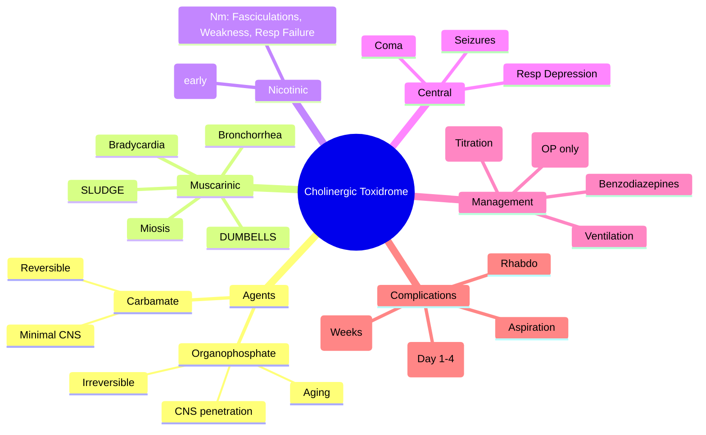

Related: [[General Principles of Poisoning Management]], [[Organophosphate and Carbamate Poisoning]], [[Antidotes Overview]], [[Neuroleptic Malignant Syndrome]] (DDx hyperthermia)

> [!tip]
> Think: "wet and slow" — excessive secretions, bradycardia, miosis, bronchorrhea. Atropine for muscarinic, pralidoxime for nicotinic (NMJ). Key FCPS/MRCP: atropine titration to dry secretions/HR > 80, pralidoxime early, IMS at day 1-4, OPIDN weeks later.

## 1. Learning Objectives
- Recognize cholinergic toxidrome (muscarinic + nicotinic + CNS)
- Differentiate organophosphate vs carbamate (reversibility, CNS penetration)
- Apply atropine titration protocol
- Indicate and dose pralidoxime
- Identify Intermediate Syndrome (IMS) and OPIDN

## 2. Definition
Cholinergic toxidrome = clinical syndrome from excess acetylcholine at muscarinic, nicotinic, and central receptors due to acetylcholinesterase (AChE) inhibition.

## 3. Core Physiology
- **Normal**: ACh released → binds receptor → hydrolyzed by AChE
- **Organophosphate (OP)**: phosphorylates AChE → **irreversible** inhibition (aging: OP-enzyme bond becomes resistant to reactivation, hours to days). Lipophilic → CNS penetration → seizures, coma, respiratory depression.
- **Carbamate**: carbamylates AChE → **reversible** inhibition (spontaneous reactivation hours). Less lipophilic → minimal CNS effects.
- **Muscarinic** (M1-M5): SLUDGE/DUMBELLS — parasympathetic overdrive
- **Nicotinic** (Nm, Nn): Nm = fasciculations, weakness, respiratory failure; Nn = hypertension, tachycardia (initially)
- **Central**: seizures, coma, respiratory center depression (OP > carbamate)

## 4. Clinical Features

### Muscarinic (SLUDGE / DUMBELLS)
- **S**alivation / **S**weating
- **L**acrimation
- **U**rination / **D**efecation
- **D**efecation / **U**rination
- **G**I upset (cramps, diarrhea) / **G**I cramps
- **E**mesis / **E**mesis
- **M**iosis (pinpoint pupils) — *key sign*
- **B**ronchorrhea / **B**ronchospasm → respiratory distress
- **B**radycardia → hypotension

### Nicotinic
- **Nm (skeletal)**: fasciculations (tongue, limbs), muscle weakness, respiratory muscle paralysis → respiratory failure
- **Nn (autonomic ganglia)**: initial hypertension/tachycardia (often masked by muscarinic)

### Central (OP predominant)
- Confusion, agitation, seizures, coma, respiratory depression

## 5. Grading (WHO / POP Scale)
| Grade | Features |
|-------|----------|
| I (Mild) | Muscarinic only (nausea, vomiting, miosis, sweating) |
| II (Moderate) | Muscarinic + nicotinic (fasciculations, mild weakness) |
| III (Severe) | Grade II + CNS (confusion, seizures) + respiratory failure |

## 6. Differential Diagnosis
- **Anticholinergic toxidrome**: opposite (dry, hot, dilated pupils, tachycardia, agitation) — physostigmine for severe
- **Opioid**: miosis + respiratory depression BUT no secretions, no fasciculations, naloxone responsive
- **Nerve agents** (sarin, VX): same toxidrome, weaponized OP
- **Mushroom (muscarine)**: pure muscarinic, self-limiting, no nicotinic/CNS
- **Carbamate**: shorter duration, less CNS, atropine alone often sufficient

## 7. Investigations
- **RBC Cholinesterase (true cholinesterase)**: gold standard, correlates with severity. Low = significant inhibition.
- **Plasma Pseudocholinesterase**: less specific, affected by liver disease, pregnancy, genetic variants.
- **ECG**: bradycardia, heart block, QT prolongation
- **ABG**: respiratory acidosis (bronchorrhea, weakness), metabolic acidosis (seizures, hypoxia)
- **CXR**: aspiration, pulmonary edema (non-cardiogenic + cardiogenic)
- **Paracetamol level** (always)

## 8. Management Algorithm
```mermaid
flowchart TD
  A[Suspected OP/Carbamate] --> B[ABCDE + Decontaminate<br/>PPE for staff!]
  B --> C[Atropine IV 1-2 mg<br/>Repeat q5-10 min<br/>Target: HR > 80, dry secretions, no bronchospasm]
  C --> D{Pralidoxime Indicated?}
  D -->|OP severe<br/>nicotinic signs<br/>within 24-48h| E[Pralidoxime 1-2 g IV over 30 min<br/>then infusion 0.5-1 g/hr<br/>24-48h]
  D -->|Carbamate Only| F[Atropine Alone Usually Sufficient]
  E --> G[Monitor for IMS (Day 1-4)<br/>OPIDN (Weeks)]
  G --> H[ICU: Ventilation, Atropine Infusion,<br/>Seizure Control (Benzo)]
```

## 9. Management

### 1. Decontamination & Staff Protection
- **CRITICAL**: Remove clothes, wash skin/hair with soap/water. Staff: PPE (gown, gloves, mask, eye protection). OP absorbed dermally/inhalation.

### 2. Atropine (Muscarinic Antagonist)
- **Dose**: 1-2 mg IV bolus (child 0.02 mg/kg). Repeat q5-10 min.
- **Titration target**: Heart rate > 80 bpm, **dry secretions** (oral/airway), no bronchospasm, pupils dilated.
- **Dose may be massive** (hundreds of mg in severe OP). NO maximum dose — titrate to effect.
- **Atropine infusion** once stabilized: 10-20% of total bolus dose per hour, titrate.
- **Avoid atropine in pure carbamate** if mild (risk of atropinization: hyperthermia, delirium, ileus).

### 3. Pralidoxime (Oxime — Nicotinic/Reactivator)
- **Mechanism**: Reactivates phosphorylated AChE (before aging). Does NOT cross BBB well (limited CNS effect).
- **Indications**: OP poisoning with **nicotinic signs** (fasciculations, weakness, respiratory failure) or severe muscarinic requiring high atropine. **Early** (< 24-48h, before aging).
- **Dose**: 1-2 g IV over 30 min (child 25-50 mg/kg), then infusion 0.5-1 g/hr (child 10-20 mg/kg/hr) for 24-48h.
- **Contraindicated in carbamate**: may worsen inhibition (controversial, generally avoided).
- **Obidoxime**: alternative (Europe), similar.

### 4. Benzodiazepines (Seizures / CNS)
- **Diazepam** 5-10 mg IV (child 0.2-0.5 mg/kg) or **Lorazepam** 2-4 mg IV for seizures.
- Prophylactic diazepam in severe OP (reduces CNS damage, OPIDN risk).

### 5. Supportive (ICU)
- **Intubation/ventilation**: frequent (respiratory failure from bronchorrhea, bronchospasm, weakness, central depression). High PEEP, suction.
- **Fluids**: cautious (pulmonary edema risk).
- **Atropine infusion** continued.
- **Antibiotics** if aspiration.
- **Physostigmine**: CONTRAINDICATED (cholinergic crisis + physostigmine = more ACh).

### 6. Intermediate Syndrome (IMS)
- **Onset**: 24-96h post-exposure (after apparent recovery).
- **Features**: Proximal muscle weakness (neck flexors, limb girdles), cranial nerve palsies (III, VI, VII, IX-X), respiratory failure. **No fasciculations**.
- **Pathophysiology**: persistent NMJ dysfunction, muscle necrosis.
- **Management**: Ventilatory support, continue atropine/pralidoxime. Recovery days-weeks.
- **Risk factors**: severe OP, delayed pralidoxime, fat-soluble OP (fenthion, parathion).

### 7. Organophosphate-Induced Delayed Neuropathy (OPIDN)
- **Onset**: 2-3 weeks post-exposure.
- **Features**: Distal sensorimotor polyneuropathy (lower > upper), spastic paraparesis, ataxia. **Permanent**.
- **Mechanism**: Inhibition of NTE (neuropathy target esterase) in neurons.
- **Risk**: Specific OPs (chlorpyrifos, tri-ortho-cresyl phosphate - TOCP).
- **Prevention**: Early pralidoxime? Unproven. No treatment.

## 10. Complications
- Respiratory failure (primary cause of death)
- Aspiration pneumonia
- Non-cardiogenic pulmonary edema
- Rhabdomyolysis (prolonged fasciculations, seizures)
- Cardiac arrhythmias (QT prolongation, heart block)
- Pancreatitis (OP-specific)
- IMS, OPIDN

## 11. Prognosis
- Mortality: 5-30% (severe OP), <1% carbamate
- Death usually from respiratory failure (bronchorrhea, bronchospasm, weakness, central)
- Good recovery if survive acute phase (except OPIDN)
- IMS: full recovery typical with support

## 12. FCPS/MRCP High-Yield Points
1. **Atropine titration**: NO max dose — target dry secretions + HR > 80. Do NOT use pupil dilation as sole endpoint (central miosis persists).
2. **Pralidoxime**: ONLY for OP (not carbamate). Give early (< 48h). Dose: 1-2g IV load + infusion 24-48h.
3. **Carbamate vs OP**: reversible, less CNS, atropine alone, shorter duration.
4. **IMS**: day 1-4, proximal weakness, respiratory failure, no fasciculations. Ventilate.
5. **OPIDN**: 2-3 weeks, distal polyneuropathy, permanent. NTE inhibition.
6. **Staff protection**: PPE mandatory — dermal/inhalational absorption.
7. **Diazepam**: for seizures + neuroprotection in severe OP.
8. **Atropinization signs**: hyperthermia, dry skin, delirium, ileus, urinary retention — reduce dose.
9. **Glasgow Coma Scale** unreliable if paralyzed (pralidoxime/neuromuscular blockers) — use pupil/secretions/HR.
10. **Butyrylcholinesterase (plasma) vs AChE (RBC)**: RBC = true cholinesterase, correlates with severity.

## 13. Common Viva Questions
1. Atropine dosing and titration endpoints in OP poisoning
2. Pralidoxime: indications, dose, why not in carbamate
3. Intermediate syndrome: timing, features, management
4. OPIDN: timing, mechanism, prognosis
5. Differences between organophosphate and carbamate poisoning
6. Decontamination and staff protection measures
7. Why physostigmine is contraindicated
8. Atropinization vs under-atropinization

## 14. Common Confusions / Exam Traps
- **Pupil size**: miosis persists despite atropine (central) — do NOT use as titration endpoint
- **Pralidoxime in carbamate**: avoid (may induce carbamylation of AChE)
- **Physostigmine**: contraindicated (increases ACh further)
- **Atropine max dose**: NO maximum — titrate to dry secretions
- **IMS vs OPIDN**: IMS = days, proximal, reversible; OPIDN = weeks, distal, permanent
- **Carbamate duration**: shorter (hours), spontaneous AChE reactivation
- **Fasciculations**: may be absent in severe weakness/IMS

## 15. Mnemonics
- **SLUDGE**: Salivation, Lacrimation, Urination, Defecation, GI upset, Emesis
- **DUMBELLS**: Defecation, Urination, Miosis, Bradycardia, Emesis, Lacrimation, Salivation, Sweating
- **Mt. VW FAIL** (nicotinic): Muscle weakness, Ventilatory failure, Fasciculations, Autonomic (HTN/tachy initially), Involuntary (twitching), Paralysis (flaccid)
- **IMS**: Intermediate Muscle Syndrome (proximal, day 1-4)
- **OPIDN**: Organophosphate-Induced Delayed Neuropathy (weeks, distal, NTE)

## 16. Mind Map


## 17. Flowchart
```mermaid
flowchart TD
  A[Cholinergic Features] --> B{AChE Inhibitor?}
  B -->|Organophosphate| C[Atropine Titration<br/>+ Pralidoxime<br/>+ Diazepam<br/>+ ICU/Ventilation]
  B -->|Carbamate| D[Atropine PRN<br/>Usually No Pralidoxime<br/>Shorter Observation]
  C --> E[Monitor for IMS (Day 1-4)]
  E --> F[Monitor for OPIDN (2-3 Weeks)]
  D --> G[Rapid Recovery Expected]
```

## 18. Suggested Visuals / Image Notes
- Atropine titration flowchart
- IMS vs OPIDN timeline
- OP vs carbamate comparison table
- Pralidoxime mechanism (reactivation before aging)

## 19. Suggested Video References
- Organophosphate poisoning management (Clinical Toxicology, EM:RAP)
- Atropine titration demonstration

## 20. One-Page Revision Summary
- **Toxidrome**: SLUDGE/DUMBELLS + fasciculations/weakness + CNS (OP)
- **OP vs Carbamate**: irreversible+aging+CNS vs reversible+no CNS+shorter
- **Atropine**: 1-2mg IV q5-10min → dry secretions/HR>80, NO max dose
- **Pralidoxime**: 1-2g IV + infusion 24-48h, OP ONLY (nicotinic/severe), early
- **IMS**: day 1-4, proximal weakness, vent support, reversible
- **OPIDN**: 2-3 wks, distal polyneuropathy, permanent, NTE inhibition
- **Staff safety**: PPE mandatory

## 24-Hour Recall Prompts
- List atropine titration targets
- Contrast OP vs carbamate (3 key differences)
- Define IMS and OPIDN timing/features
- State pralidoxime dose and indications

## 7-Day / 15-Day / 30-Day Revision Tracker
- [ ] Day 1 completed
- [ ] 24-hour recall completed
- [ ] Day 7 revision completed
- [ ] Day 15 revision completed
- [ ] Day 30 revision completed

## 21. Must Know / Should Know / Nice to Know
### Must Know
- Cholinergic toxidrome features (SLUDGE/DUMBELLS + nicotinic + CNS)
- Atropine titration (targets, no max dose)
- Pralidoxime: OP only, dose, timing, contraindicated in carbamate
- IMS: day 1-4, proximal weakness, respiratory failure
- OPIDN: weeks, distal, permanent
- OP vs carbamate differences

### Should Know
- Aging concept (OP-enzyme bond resistant to reactivation)
- RBC vs plasma cholinesterase
- Diazepam for seizures + neuroprotection
- Atropinization signs
- Decontamination/PPE

### Nice to Know
- Specific OP agents and lipid solubility (fenthion, parathion = high IMS/OPIDN risk)
- Obidoxime alternative
- Butyrylcholinesterase genetic variants
- TOCP (ginger jake paralysis) historical

## 22. Self-Test Scorecard
- Understanding: /10
- Recall: /10
- MCQ Performance: /10
- SBA Performance: /10
- Viva Confidence: /10
- Total: /50

> [!tip]
> Interpretation: <35 = weak topic, 35-44 = acceptable but insecure, 45+ = strong exam-ready topic.

## 23. Exam Answer Modes
### Long Answer Skeleton
- Definition: AChE inhibition → cholinergic crisis
- Agents: OP (irreversible, CNS, aging) vs Carbamate (reversible, peripheral)
- Clinical: Muscarinic (SLUDGE), Nicotinic (fasciculations, weakness), Central (seizures, depression)
- Grading: WHO I-III
- Dx: Clinical + RBC AChE
- Mgmt: PPE → Atropine titration → Pralidoxime (OP) → Benzodiazepines → Ventilation
- Complications: IMS, OPIDN, aspiration, rhabdo
- Prognosis

### Short Note Skeleton
- Toxidrome table (muscarinic/nicotinic/central)
- Atropine vs pralidoxime indications/dose
- IMS vs OPIDN comparison

### Viva One-Liners
- "Atropine: titrate to dry secretions and HR > 80, no maximum dose"
- "Pralidoxime: OP only, 1-2g IV load then infusion, early < 48h"
- "OP vs carbamate: irreversible+CNS vs reversible+peripheral"
- "IMS: day 1-4, neck/limb girdle weakness, vent; OPIDN: 2-3 wks, distal, permanent"
- "Physostigmine contraindicated — worsens cholinergic crisis"
- "Pupils: central miosis persists, don't use for atropine titration"

### Ward-Case Discussion Points
- "Patient intubated, paralyzed — how to titrate atropine?" → secretions, HR, lung compliance
- "Carbamate — give pralidoxime?" → No, avoid
- "Staff exposure risk?" → PPE, decontaminate patient first

### Last-Night-Before-Exam Sheet
- SLUDGE, DUMBELLS
- Atropine targets: dry secretions, HR > 80
- Pralidoxime: OP only, 1-2g load + 0.5-1g/hr x 24-48h
- IMS: day 1-4, proximal; OPIDN: 2-3 wks, distal
- OP: irreversible, aging, CNS; Carbamate: reversible, no CNS

## 24. Summary
Cholinergic toxidrome = excess ACh from AChE inhibition. OP = irreversible, lipophilic, CNS, aging; Carbamate = reversible, peripheral. Atropine titrated to dry secretions/HR>80 (no max). Pralidoxime reactivates AChE (OP only, early). IMS at day 1-4 (proximal weakness, vent). OPIDN at 2-3 wks (distal polyneuropathy, permanent). Key exam: atropine titration endpoints, pralidoxime indications/contraindications, IMS/OPIDN timing, OP vs carbamate.

## 25. MCQs (10)
1. Organophosphate vs carbamate - key difference?
   A. OP reversible, carbamate irreversible
   B. OP irreversible (aging), carbamate reversible (spontaneous reactivation)
   C. No difference
   D. Carbamate more toxic
   **Answer: B**
   *Explanation: OP: phosphorylates AChE → irreversible (aging in hours). Carbamate: carbamylates AChE → reversible, spontaneous reactivation in hours. OP needs pralidoxime early.*

2. Cholinergic mnemonic?
   A. FEVER
   B. SLUDGE / DUMBELLS
   C. MUDPILES
   D. Hot as a hare...
   **Answer: B**
   *Explanation: SLUDGE: Salivation, Lacrimation, Urination, Defecation, GI upset, Emesis. DUMBELLS: Defecation, Urination, Miosis, Bradycardia, Emesis, Lacrimation, Salivation, Sweating.*

3. Atropine dose for organophosphate?
   A. 0.5 mg IV once
   B. NO MAX DOSE - titrate to dry secretions, HR > 80, no bronchospasm
   C. 2 mg IV max
   D. 10 mg IV max
   **Answer: B**
   *Explanation: Atropine: NO MAX DOSE. Start 1-2mg IV (child 0.05mg/kg), repeat q5-10min. Titrate to: dry secretions, HR > 80, no bronchospasm. May need hundreds of mg.*

4. Pralidoxime (2-PAM) - when to give?
   A. After atropine fully dries secretions
   B. Early, within 24-48h (before aging), 1-2g IV over 30min
   C. Only if atropine fails
   D. Never with carbamate
   **Answer: B**
   *Explanation: Pralidoxime: reactivates AChE (if not aged). Give EARLY (within 24-48h for OP). 1-2g IV over 30min, repeat q4-6h or infusion 0.5g/hr. Less critical for carbamate (spontaneous reactivation).*

5. Intermediate syndrome (IMS) - timing?
   A. Minutes-hours
   B. Day 1-4 post-exposure
   C. Weeks
   D. Only with carbamate
   **Answer: B**
   *Explanation: IMS: Day 1-4. Proximal limb weakness, neck flexors, cranial nerves, respiratory failure. Distinct from acute cholinergic crisis. Requires ventilation. Not prevented by pralidoxime.*

6. OPIDN (Organophosphate-Induced Delayed Neuropathy) - timing?
   A. Hours
   B. Days
   C. 2-3 weeks post-exposure
   D. Only with carbamate
   **Answer: C**
   *Explanation: OPIDN: 2-3 weeks. Distal sensorimotor polyneuropathy (stocking-glove), paralysis. Caused by neuropathy target esterase (NTE) inhibition. Not prevented by atropine/pralidoxime.*

7. Carbamate poisoning - atropine + pralidoxime?
   A. Both needed
   B. Atropine yes, pralidoxime usually not needed (spontaneous reactivation)
   C. Neither needed
   D. Pralidoxime only
   **Answer: B**
   *Explanation: Carbamate: reversible AChE inhibition → spontaneous reactivation. Atropine for symptoms. Pralidoxime usually NOT needed (may even worsen some carbamates).*

8. Organophosphate - intermediate syndrome features?
   A. SLUDGE
   B. Proximal weakness, neck flexors, cranial nerves, respiratory failure
   C. Distal neuropathy
   D. Seizures only
   **Answer: B**
   *Explanation: IMS: Day 1-4. Proximal limb weakness, neck flexor weakness, cranial nerve palsies, respiratory failure. Occurs as acute cholinergic crisis resolves. Requires ventilation.*

9. Cholinergic crisis vs myasthenic crisis - differentiation?
   A. Edrophonium (Tensilon) test: improves in myasthenic, worsens in cholinergic
   B. Both improve with edrophonium
   C. Both worsen
   D. No test available
   **Answer: A**
   *Explanation: Edrophonium (short-acting AChE inhibitor): improves myasthenic crisis (more ACh), worsens cholinergic crisis (more ACh excess). Rarely used now - clinical differentiation.*

10. Organophosphate - decontamination?
   A. Not needed
   B. Critical - remove clothing, wash skin/hair, protect staff (PPE)
   C. Only gastric lavage
   D. Activated charcoal only
   **Answer: B**
   *Explanation: Decontamination CRITICAL: remove all clothing, wash skin/hair with soap/water. Protect staff (PPE, avoid cross-contamination). GI decon if recent ingestion (charcoal).*

## 26. SBA Questions (10)
1. Farmer spraying pesticide, found confused, salivating, bronchorrhea, miotic, bradycardic, incontinent. Diagnosis?
   A. Anticholinergic
   B. Organophosphate poisoning
   C. Opioid
   D. Sepsis
   **Answer: B**
   *Explanation: Classic cholinergic: SLUDGE + miosis + bradycardia + fasciculations + muscle weakness. Organophosphate (or carbamate).*

2. Organophosphate poisoning. Atropine 50mg given, secretions still wet. Next?
   A. Stop atropine
   B. Continue atropine - NO MAX DOSE, titrate to dry secretions/HR>80
   C. Give pralidoxime only
   D. Intubate
   **Answer: B**
   *Explanation: Atropine: NO MAX DOSE. Titrate to dry secretions, HR > 80, no bronchospasm. May need hundreds of mg. PRALIDOXIME also needed early (1-2g IV over 30min).*

3. Same patient, pralidoxime given. When does it stop working?
   A. Immediately
   B. After 'aging' (OP-AChE bond becomes irreversible, hours)
   C. After 24h always
   D. Never stops working
   **Answer: B**
   *Explanation: Pralidoxime reactivates AChE only BEFORE aging (OP-AChE bond becomes irreversible). Aging half-life varies by OP (minutes to hours). Give early (within 24-48h).*

4. Patient recovers from acute cholinergic crisis (day 2). Suddenly develops proximal weakness, neck weakness, can't breathe. Diagnosis?
   A. Recurrent poisoning
   B. Intermediate syndrome (IMS)
   C. OPIDN
   D. Guillain-Barre
   **Answer: B**
   *Explanation: IMS: Day 1-4. Proximal weakness, neck flexors, cranial nerves, respiratory failure. As acute crisis resolves. Not prevented by pralidoxime. Requires ventilation.*

5. Carbamate (carbofuran) poisoning. Pralidoxime needed?
   A. Yes, always
   B. Usually NOT needed (spontaneous reactivation)
   C. Only if severe
   D. Contraindicated
   **Answer: B**
   *Explanation: Carbamate: reversible carbamylation → spontaneous reactivation in hours. Atropine for symptoms. Pralidoxime usually not needed (may worsen some carbamates like carbofuran).*

6. 3 weeks post-OP exposure, patient develops foot drop, stocking-glove sensory loss. Diagnosis?
   A. IMS
   B. OPIDN
   C. Recurrent poisoning
   D. Critical illness neuropathy
   **Answer: B**
   *Explanation: OPIDN: 2-3 weeks. Distal sensorimotor polyneuropathy (stocking-glove), foot drop, paralysis. NTE inhibition. Not prevented by atropine/pralidoxime.*

7. Organophosphate ingestion - GI decontamination?
   A. Charcoal if <1h, protect airway
   B. No charcoal (poor adsorption)
   C. Gastric lavage always
   D. WBI
   **Answer: A**
   *Explanation: Activated charcoal 1g/kg if <1h (or later for liquid formulations). Protect airway (seizure, coma risk). WBI not standard. Skin decon CRITICAL.*

8. Myasthenic vs cholinergic crisis - edrophonium test?
   A. Improves both
   B. Improves myasthenic, worsens cholinergic
   C. Worsens both
   D. No effect either
   **Answer: B**
   *Explanation: Edrophonium (AChE inhibitor): improves myasthenic (more ACh at NMJ), worsens cholinergic (more ACh excess). Rarely used now - clinical differentiation.*

9. OP poisoning - atropine infusion after bolus?
   A. Fixed rate 1mg/hr
   B. 10-20% of total bolus dose per hour, titrate to endpoints
   C. No infusion needed
   D. 1mg/kg/hr
   **Answer: B**
   *Explanation: Atropine infusion: 10-20% of total bolus dose required to achieve endpoints per hour. Titrate to dry secretions, HR > 80, no bronchospasm.*

10. OP poisoning - staff protection?
   A. Standard precautions
   B. Full PPE (gown, gloves, mask, eye protection) - avoid cross-contamination
   C. Only gloves
   D. No special protection
   **Answer: B**
   *Explanation: Decontamination CRITICAL: staff need PPE. Remove patient clothes, wash skin/hair. Avoid cross-contamination. Ventilate area.*

## 27. Flashcards
- Q: OP vs carbamate difference?
  A: OP: phosphorylates AChE → irreversible (aging in hours). Carbamate: carbamylates → reversible, spontaneous reactivation. OP needs pralidoxime early.
- Q: Cholinergic mnemonic?
  A: SLUDGE: Salivation, Lacrimation, Urination, Defecation, GI upset, Emesis. DUMBELLS: Defecation, Urination, Miosis, Bradycardia, Emesis, Lacrimation, Salivation, Sweating.
- Q: Atropine dosing OP?
  A: NO MAX DOSE. Start 1-2mg IV, repeat q5-10min. Titrate to: dry secretions, HR > 80, no bronchospasm. May need hundreds of mg.
- Q: Pralidoxime (2-PAM)?
  A: Reactivates AChE (pre-aging). 1-2g IV over 30min, repeat q4-6h or infusion 0.5g/hr. Early (within 24-48h). Less critical for carbamate.
- Q: OP aging?
  A: OP-AChE bond becomes irreversible (dealkylation). Time varies by OP (minutes-hours). Pralidoxime ineffective after aging.
- Q: Intermediate syndrome (IMS)?
  A: Day 1-4. Proximal weakness, neck flexors, cranial nerves, respiratory failure. As acute crisis resolves. Ventilation needed. Not prevented by pralidoxime.
- Q: OPIDN?
  A: 2-3 weeks. Distal sensorimotor polyneuropathy (stocking-glove), foot drop, paralysis. NTE inhibition. Not prevented by atropine/pralidoxime.
- Q: Carbamate + pralidoxime?
  A: Usually NOT needed (spontaneous reactivation). Atropine for symptoms. May worsen some carbamates.
- Q: Cholinergic vs myasthenic crisis?
  A: Edrophonium: improves myasthenic, worsens cholinergic. Clinical: cholinergic = SLUDGE + miosis + bradycardia + fasciculations.
- Q: OP decontamination?
  A: CRITICAL: remove clothes, wash skin/hair, PPE for staff. Charcoal <1h if ingestion. Protect airway.
- Q: Atropine infusion rate?
  A: 10-20% of total bolus dose required to achieve endpoints per hour. Titrate to endpoints.
- Q: OP muscarinic + nicotinic?
  A: Muscarinic: SLUDGE + miosis + bradycardia. Nicotinic: fasciculations, weakness, respiratory failure, tachycardia/hypertension.
- Q: Fasciculations in OP?
  A: Nicotinic effect at NMJ. Precedes weakness. Not seen in pure anticholinergic.
- Q: OP + seizures?
  A: Benzos 1st line. Atropine may help (muscarinic). Pralidoxime doesn't cross BBB well.
- Q: OP disposition?
  A: Observe 24-48h post-resolution for IMS. Psych if DSH. Carbamate: shorter observation (6-12h).
## 28. Answer Key with Explanations
### MCQs
1. **B** - OP: phosphorylates AChE → irreversible (aging in hours). Carbamate: carbamylates AChE → reversible, spontaneous reactivation in hours. OP needs pralidoxime early.
2. **B** - SLUDGE: Salivation, Lacrimation, Urination, Defecation, GI upset, Emesis. DUMBELLS: Defecation, Urination, Miosis, Bradycardia, Emesis, Lacrimation, Salivation, Sweating.
3. **B** - Atropine: NO MAX DOSE. Start 1-2mg IV (child 0.05mg/kg), repeat q5-10min. Titrate to: dry secretions, HR > 80, no bronchospasm. May need hundreds of mg.
4. **B** - Pralidoxime: reactivates AChE (if not aged). Give EARLY (within 24-48h for OP). 1-2g IV over 30min, repeat q4-6h or infusion 0.5g/hr. Less critical for carbamate (spontaneous reactivation).
5. **B** - IMS: Day 1-4. Proximal limb weakness, neck flexors, cranial nerves, respiratory failure. Distinct from acute cholinergic crisis. Requires ventilation. Not prevented by pralidoxime.
6. **C** - OPIDN: 2-3 weeks. Distal sensorimotor polyneuropathy (stocking-glove), paralysis. Caused by neuropathy target esterase (NTE) inhibition. Not prevented by atropine/pralidoxime.
7. **B** - Carbamate: reversible AChE inhibition → spontaneous reactivation. Atropine for symptoms. Pralidoxime usually NOT needed (may even worsen some carbamates).
8. **B** - IMS: Day 1-4. Proximal limb weakness, neck flexor weakness, cranial nerve palsies, respiratory failure. Occurs as acute cholinergic crisis resolves. Requires ventilation.
9. **A** - Edrophonium (short-acting AChE inhibitor): improves myasthenic crisis (more ACh), worsens cholinergic crisis (more ACh excess). Rarely used now - clinical differentiation.
10. **B** - Decontamination CRITICAL: remove all clothing, wash skin/hair with soap/water. Protect staff (PPE, avoid cross-contamination). GI decon if recent ingestion (charcoal).

### SBAs
1. **B** - Classic cholinergic: SLUDGE + miosis + bradycardia + fasciculations + muscle weakness. Organophosphate (or carbamate).
2. **B** - Atropine: NO MAX DOSE. Titrate to dry secretions, HR > 80, no bronchospasm. May need hundreds of mg. PRALIDOXIME also needed early (1-2g IV over 30min).
3. **B** - Pralidoxime reactivates AChE only BEFORE aging (OP-AChE bond becomes irreversible). Aging half-life varies by OP (minutes to hours). Give early (within 24-48h).
4. **B** - IMS: Day 1-4. Proximal weakness, neck flexors, cranial nerves, respiratory failure. As acute crisis resolves. Not prevented by pralidoxime. Requires ventilation.
5. **B** - Carbamate: reversible carbamylation → spontaneous reactivation in hours. Atropine for symptoms. Pralidoxime usually not needed (may worsen some carbamates like carbofuran).
6. **B** - OPIDN: 2-3 weeks. Distal sensorimotor polyneuropathy (stocking-glove), foot drop, paralysis. NTE inhibition. Not prevented by atropine/pralidoxime.
7. **A** - Activated charcoal 1g/kg if <1h (or later for liquid formulations). Protect airway (seizure, coma risk). WBI not standard. Skin decon CRITICAL.
8. **B** - Edrophonium (AChE inhibitor): improves myasthenic (more ACh at NMJ), worsens cholinergic (more ACh excess). Rarely used now - clinical differentiation.
9. **B** - Atropine infusion: 10-20% of total bolus dose required to achieve endpoints per hour. Titrate to dry secretions, HR > 80, no bronchospasm.
10. **B** - Decontamination CRITICAL: staff need PPE. Remove patient clothes, wash skin/hair. Avoid cross-contamination. Ventilate area.