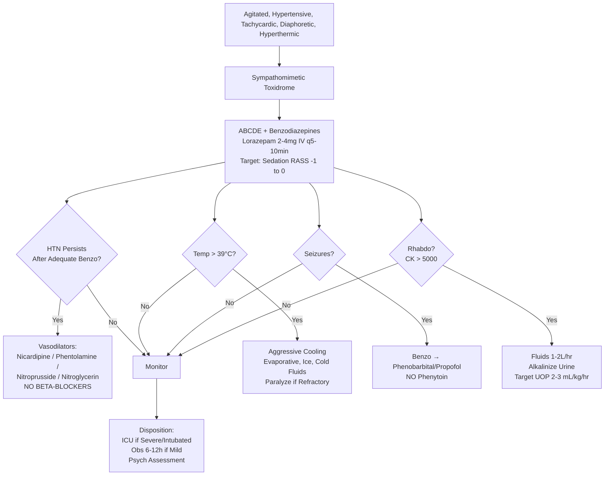

Related: [[General Principles of Poisoning Management]], [[Sympathomimetic Toxidrome]], [[Antidotes Overview]], [[Beta-Blocker Poisoning]]

> [!tip]
> **Sympathomimetic toxidrome**. **Benzodiazepines 1st line for EVERYTHING** (agitation, seizures, HTN, tachycardia). **AVOID beta-blockers** (unopposed α → worse HTN/vasospasm). **Cocaine**: Na⁺ channel blockade → QRS widening; local anesthetic effect. **Amphetamine/meth**: prolonged, more CNS. **MDMA**: serotonin syndrome + hyponatremia + hyperthermia. Key FCPS/MRCP: benzos 1st line; NO beta-blockers in cocaine; phentolamine/nicardipine for HTN; MDMA hyponatremia; hyperthermia aggressive cooling; rhabdo fluids.

## 1. Learning Objectives
- Recognize sympathomimetic toxidrome from cocaine/amphetamines
- Apply benzodiazepine-first management strategy
- Understand why beta-blockers are contraindicated in cocaine
- Manage hypertensive emergency, hyperthermia, rhabdo
- Differentiate cocaine vs amphetamine vs MDMA specific features

## 2. Definition
Cocaine/amphetamine poisoning = toxicity from sympathomimetic stimulants causing **catecholamine excess** → hypertension, tachycardia, hyperthermia, agitation, seizures, and multi-organ dysfunction.

## 3. Core Physiology
- **Cocaine**: **triple reuptake inhibitor** (DA, NE, 5-HT) + **Na⁺ channel blockade** (local anesthetic) → vasoconstriction, ↑ HR/contractility, QRS widening at high dose
- **Amphetamine/Methamphetamine**: **release promoters** (reverse transport via VMAT2/TAAR1) → massive catecholamine release; longer half-life (10-12h)
- **MDMA (Ecstasy)**: **serotonin > dopamine release** → serotonin syndrome risk + **SIADH → hyponatremia** + hyperthermia
- **Cathinones** (bath salts): potent release promoters, severe agitation/psychosis
- **Mechanism**: ↑ synaptic NE/DA/5-HT → α₁ (vasoconstriction), β₁ (tachycardia/contractility), β₂ (bronchodilation/tremor/hypokalemia), central (agitation, hyperthermia, seizures)

## 4. Clinical Features

| Feature | Cocaine | Amphetamine/Meth | MDMA |
|---------|---------|------------------|------|
| **Onset** | Rapid (IV/smoke: sec; intranasal: min) | 30-60 min (oral) | 30-60 min |
| **Duration** | Short (30-60 min high) | **Prolonged** (8-12h+) | 4-6h |
| **Na⁺ Channel Block** | **YES** (QRS widening) | No | No |
| **Serotonin** | Mild | Mild | **Marked release** |
| **Seizure Risk** | Moderate | High | High |
| **Hyponatremia** | No | No | **YES (SIADH)** |
| **Hyperthermia** | Yes | Yes | **Marked** |

### General Sympathomimetic Toxidrome
- **Cardiovascular**: **hypertension** (often severe), **tachycardia**, chest pain (coronary vasospasm/MI), arrhythmias (VT/VF)
- **Neurological**: agitation, anxiety, paranoia, psychosis, **hyperreflexia**, tremor, myoclonus, **seizures**, headache, ICH risk
- **Autonomic**: **diaphoresis** (WET skin — key vs anticholinergic), mydriasis, **hyperthermia** (often > 40°C)
- **Metabolic**: hyperglycemia, hypokalemia, metabolic acidosis (lactic)

## 5. Differential Diagnosis
- **Anticholinergic**: DRY skin, urinary retention, ileus, delirium
- **Serotonin Syndrome**: **CLONUS** (spontaneous/inducible/ocular), hyperreflexia, diaphoresis, rapid onset + serotonergic agent
- **NMS**: lead-pipe rigidity, bradykinesia, gradual onset (days)
- **Thyroid storm**: fever, tachycardia, no drug history

## 6. Investigations
- **ECG**: sinus tachy, ST changes (ischemia), **QRS widening (cocaine)**, QTc
- **ABG/VBG**: metabolic acidosis, lactate↑, K⁺↓, glucose↑
- **CK**: rhabdo screen (hyperthermia, agitation, vasoconstriction)
- **Renal function**: AKI (rhabdo, vasoconstriction)
- **Trop**: if chest pain
- **Coagulation**: DIC risk (hyperthermia)
- **Urine drug screen**: cocaine metabolite (BE), amphetamines (cross-reactivity)
- **Sodium**: **hyponatremia (MDMA)** — check if seizures/confusion
- **Paracetamol level** (always)
- **CXR**: pulmonary edema, aspiration

## 7. Management

### 1. **Benzodiazepines = 1ST LINE FOR EVERYTHING**
- **Lorazepam 2-4 mg IV** q5-10 min OR **Diazepam 5-10 mg IV** q10-15 min
- **Target**: sedation (RASS -1 to 0), control agitation, prevent/treat seizures, lower BP/HR secondarily
- **High doses often needed** (total 10-30+ mg diazepam equivalent)
- **Avoid antipsychotics** (haloperidol, droperidol) — lower seizure threshold, QT prolongation, dystonia, impair heat dissipation

### 2. Hypertension (If Persists After Adequate Benzodiazepines)
- **Vasodilators** (α₁ blockade or direct):
  - **Phentolamine** 5 mg IV bolus, repeat q5-15 min (α-blocker) — classic for cocaine
  - **Nicardipine** infusion (calcium channel blocker) — preferred
  - **Nitroprusside** (if ICP concern — avoid; cyanide risk)
  - **Nitroglycerin** (if ischemic chest pain)
- **AVOID BETA-BLOCKERS** (labetalol, metoprolol, propranolol): **unopposed α₁ → worsened hypertension, coronary vasospasm, peripheral ischemia**. Even mixed α/β (labetalol) has β > α effect → risk.

### 3. Tachycardia/Arrhythmias
- Benzodiazepines usually suffice
- If persistent: **Esmolol** (ultra-short β₁) — ONLY if benzos failed AND no cocaine (controversial)
- **Preferred**: Diltiazem/verapamil (rate control without β-blockade)
- **Ventricular arrhythmias**: standard ACLS (amiodarone, lidocaine). Avoid procainamide (Na⁺ channel blocker like cocaine).

### 4. Hyperthermia (T > 39°C = Emergency)
- **Aggressive cooling**: evaporative (mist + fan), ice packs groin/axilla/neck, cold IV fluids (4°C), cooled ventilator circuits
- **Target**: core < 38.5°C within 30 min
- **Paralysis + sedation** (vecuronium + propofol/midazolam) if refractory — stops muscular heat production
- **Dantrolene**: NOT routinely recommended (no evidence for non-MH hyperthermia)

### 5. Seizures
- Benzodiazepines 1st line (already given)
- 2nd line: **Phenobarbital** 10-20 mg/kg IV or **Propofol** infusion (intubation required)
- **Avoid phenytoin/fosphenytoin** — Na⁺ channel blocker (worsens cocaine/bupropion cardiotoxicity)

### 6. Rhabdomyolysis
- Aggressive IV fluids (NS 1-2 L/hr) → target UOP 2-3 mL/kg/hr
- Alkalinize urine (NaHCO₃) if CK > 5000 or rising
- Monitor CK q6-12h, K⁺, Ca²⁺, renal function

### 7. Cocaine-Specific Chest Pain / MI
- **ASA 300 mg PO** (unless contraindicated)
- **Nitroglycerin** SL/IV for ischemia
- **Benzodiazepines** (reduce sympathetic drive)
- **Avoid beta-blockers** — phentolamine/nitroprusside/nicardipine for HTN
- **PCI** if STEMI (stent preferred — drug-eluting OK; avoid thrombolytics if recent cocaine — bleeding risk)
- **Coronary vasospasm** often resolves with benzos + nitrates

### 8. Hyponatremia (MDMA)
- **Severe** (< 125 mmol/L) + symptoms → 3% saline 100-150 mL bolus
- Fluid restrict if euvolemic SIADH
- Avoid rapid correction (osmotic demyelination)

### 9. Decontamination
- **Activated charcoal**: 1 g/kg if < 1-2h, airway protected (limited benefit, rapid absorption)
- **Gastric lavage**: rarely indicated
- **WBI**: body packers, sustained-release (rare)

## 8. Complications
- Intracranial hemorrhage (SAH, ICH) — cocaine: vasculitis, aneurysm rupture
- MI (cocaine: coronary vasospasm, thrombus, accelerated atherosclerosis)
- Rhabdomyolysis → AKI
- Hyperthermia → multi-organ failure, DIC
- Seizure injury
- Aortic dissection (cocaine)
- Bowel ischemia (mesenteric vasoconstriction)
- Psychiatric: psychosis, depression (crash)

## 9. Prognosis
- Good with early benzo + cooling
- Mortality: 1-5% (mainly hyperthermia, ICH, MI, arrhythmia)
- Cocaine: higher mortality with chest pain + QRS widening

## 10. FCPS/MRCP High-Yield Points
1. **Benzodiazepines = 1st line for EVERYTHING** (agitation, seizures, HTN, tachycardia, hyperthermia adjunct)
2. **Beta-blockers CONTRAINDICATED in cocaine** — unopposed α → worse HTN, coronary vasospasm
3. **Phentolamine** (α-blocker) for cocaine HTN crisis
4. **Skin = WET (diaphoretic)** — differentiates from anticholinergic (DRY)
5. **Hyperthermia > 40°C = medical emergency** — aggressive cooling, consider paralysis
6. **Cocaine + Na channel blockade** → QRS widening → treat like TCA (NaHCO₃) if severe
7. **Avoid phenytoin** (Na channel blocker) for seizures — use phenobarbital/propofol
8. **MDMA**: hyponatremia (SIADH) + serotonin syndrome risk + hyperthermia
9. **Rhabdo**: aggressive fluids, alkalinization
10. **Antipsychotics avoided** — lower seizure threshold, QT, dystonia, impair cooling

## 11. Common Viva Questions
1. Sympathomimetic toxidrome features
2. Why beta-blockers contraindicated in cocaine?
3. Management of cocaine-induced hypertension
4. Hyperthermia management in stimulant overdose
5. Differentiate sympathomimetic from serotonin syndrome, NMS, anticholinergic
6. Seizure management in stimulant overdose (why not phenytoin?)
7. MDMA-specific complications (hyponatremia, serotonin syndrome)
8. Cocaine chest pain workup and management

## 12. Common Confusions / Exam Traps
- **Beta-blockers in cocaine** → NEVER (unopposed alpha)
- **Labetalol** → still has net β > α effect → avoid
- **Phentolamine** = α-blocker = GOOD for cocaine HTN
- **Phenytoin for seizures** → NO (Na channel blocker)
- **Skin**: wet vs dry (anticholinergic)
- **Reflexes/clonus**: sympathomimetic = hyperreflexia NO clonus; serotonin = CLONUS
- **Rigidity**: NMS = lead-pipe; sympathomimetic = normal tone
- **Onset**: NMS = days; sympathomimetic = minutes-hours
- **Dantrolene** → not for sympathomimetic hyperthermia (only MH)

## 13. Mnemonics
- **SYMPATHETIC** (features): **S**weating, **Y** (why? HTN), **M**ydriasis, **P**sychosis, **A**gitation, **T**achycardia, **H**yperthermia, **E**levated BP, **T**remor, **I**schemia (chest pain), **C**onvulsions
- **COCAINE HTN**: **P**hentolamine, **N**icardipine, **N**itroprusside, **N**itroglycerin — **NO BETA-BLOCKERS**
- **SEIZURE DRUGS**: **B**enzos → **P**henobarbital/**P**ropofol — **NO Phenytoin**
- **MDMA TRIAD**: **H**yperthermia, **H**yponatremia, **S**erotonin syndrome

## 14. Mind Map
```mermaid
mindmap
  root((Cocaine/Amphetamine Poisoning))
    Mechanism
      Release (Amphetamine, MDMA)
      Reuptake Block (Cocaine, Bupropion)
      Na Channel Block (Cocaine)
    Clinical
      CV: HTN, Tachy, Chest Pain, Arrhythmia
      Neuro: Agitation, Psychosis, Seizures, Hyperreflexia
      Autonomic: Diaphoresis (WET), Mydriasis, Hyperthermia
      Metabolic: Hyperglycemia, Hypokalemia, Acidosis
    Specific Agents
      Cocaine: Na Channel, Short, Vasospasm
      Amphetamine: Long, More CNS
      MDMA: Serotonin + Hyponatremia + Hyperthermia
    Management
      Benzos (Universal 1st Line)
      Vasodilators (NO Beta-Blockers)
      Cooling (Hyperthermia)
      Fluids + Alkalinization (Rhabdo)
```

## 15. Flowchart


## 16. Suggested Visuals / Image Notes
- Toxidrome comparison table (4 columns)
- Cocaine HTN algorithm
- Hyperthermia cooling methods

## 17. Suggested Video References
- Stimulant toxidrome (EM:RAP, Toxicology Today)
- Cocaine cardiovascular toxicity

## 18. One-Page Revision Summary
- **Toxidrome**: "adrenaline on steroids" — HTN, tachy, diaphoresis (WET), mydriasis, agitation, psychosis, seizures, hyperthermia
- **Benzos 1st line for ALL** (lorazepam/diazepam, high doses)
- **Cocaine HTN**: phentolamine, nicardipine, nitroprusside, NTG — **NO BETA-BLOCKERS** (unopposed α)
- **Seizures**: Benzo → Phenobarbital/Propofol — **NO Phenytoin** (Na channel)
- **Hyperthermia > 39°C**: aggressive cooling, paralyze if refractory
- **Skin WET** vs anticholinergic DRY
- **Reflexes hyper NO clonus** vs serotonin CLONUS
- **Tone normal** vs NMS rigidity
- **MDMA**: hyponatremia + serotonin syndrome + hyperthermia
- **Rhabdo**: fluids + alkalinization

## 24-Hour Recall Prompts
- List 3 vasodilators for cocaine HTN (and what to avoid)
- Contrast sympathomimetic vs anticholinergic vs serotonin vs NMS
- State seizure management sequence in stimulant OD
- Define hyperthermia emergency threshold and cooling

## 7-Day / 15-Day / 30-Day Revision Tracker
- [ ] Day 1 completed
- [ ] 24-hour recall completed
- [ ] Day 7 revision completed
- [ ] Day 15 revision completed
- [ ] Day 30 revision completed

## 19. Must Know / Should Know / Nice to Know
### Must Know
- Sympathomimetic features (diaphoresis = WET)
- Benzo 1st line universal
- Cocaine: NO beta-blockers, phentolamine/nicardipine for HTN
- Seizures: no phenytoin (phenobarbital/propofol)
- Hyperthermia emergency management
- DDx: wet skin, hyperreflexia no clonus, normal tone, rapid onset
- MDMA: hyponatremia, serotonin syndrome risk

### Should Know
- Specific agents: cocaine (Na channel), amphetamine (long), MDMA (serotonin), cathinones (severe)
- Rhabdo management
- Cocaine chest pain: ASA, NTG, benzo, PCI if STEMI
- Antipsychotics avoided

### Nice to Know
- MAOI + tyramine hypertensive crisis
- Bupropion seizure/QRS specifics
- Intracranial hemorrhage risk factors
- Drug-eluting stent in cocaine MI

## 20. Self-Test Scorecard
- Understanding: /10
- Recall: /10
- MCQ Performance: /10
- SBA Performance: /10
- Viva Confidence: /10
- Total: /50

> [!tip]
> Interpretation: <35 = weak topic, 35-44 = acceptable but insecure, 45+ = strong exam-ready topic.

## 21. Exam Answer Modes
### Long Answer Skeleton
- Definition + mechanisms (release, reuptake, direct)
- Clinical features by system
- DDx table (4 toxidromes)
- Investigations
- Management: benzos universal → specific (HTN vasodilators no beta, cooling, seizures no phenytoin, rhabdo)
- Cocaine specifics
- Complications + prognosis

### Short Note Skeleton
- Toxidrome features
- Cocaine HTN algorithm
- Seizure drug sequence
- DDx table

### Viva One-Liners
- "Sympathomimetic: wet, tachy, hypertensive, agitated, hyperthermic"
- "Cocaine HTN: phentolamine, nicardipine, NO beta-blockers (unopposed alpha)"
- "Seizures in stimulant OD: benzo → phenobarbital/propofol, NO phenytoin"
- "Wet skin = sympathomimetic/serotonin/NMS; Dry = anticholinergic"
- "Clonus = serotonin; Rigidity = NMS; Normal tone + hyperreflexia = sympathomimetic"
- "MDMA: watch for hyponatremia (SIADH) and serotonin syndrome"

### Ward-Case Discussion Points
- Unknown stimulant + chest pain → ECG, trop, ASA, NTG, benzo, avoid beta-blockers
- Hyperthermic agitated patient → benzos + cooling BEFORE intubation if possible
- Rhabdo + AKI risk → fluids, alkalinization, monitor K/Ca

### Last-Night-Before-Exam Sheet
- WET skin, mydriasis, HTN, tachy, agitation, hyperthermia
- Benzo 1st line (lorazepam/diazepam)
- Cocaine HTN: NO BETA, phentolamine/nicardipine
- Seizures: NO phenytoin
- Cooling > 39°C
- MDMA: hyponatremia + serotonin

## 22. Summary
Sympathomimetic toxidrome = catecholamine excess → HTN, tachycardia, diaphoresis (WET), agitation, hyperthermia. Benzodiazepines universal 1st line. Cocaine: avoid beta-blockers (unopposed α), use phentolamine/nicardipine. Seizures: avoid phenytoin (Na channel). Hyperthermia > 39°C = aggressive cooling ± paralysis. DDx: wet skin, hyperreflexia NO clonus, normal tone, rapid onset. MDMA adds hyponatremia + serotonin syndrome risk.

## 23. MCQs (10)
1. Cocaine/amph toxidrome?
   A. Sedation, miosis, respiratory depression
   B. Agitation, tachycardia, hypertension, hyperthermia, mydriasis, diaphoresis
   C. Bradycardia, hypotension, bronchospasm
   D. Ataxia, nystagmus, slurred speech
   **Answer: B**
   *Explanation: Sympathomimetic: agitation, tachycardia, hypertension, hyperthermia, mydriasis, diaphoresis, seizures, psychosis. Cocaine: also Na channel blockade (QRS widening), local anesthetic effect.*

2. Cocaine + beta-blockers - why contraindicated?
   A. Causes hypotension
   B. Unopposed α-adrenergic stimulation → severe hypertension, coronary vasospasm
   C. Causes bradycardia
   D. No interaction
   **Answer: B**
   *Explanation: Beta-blockers block β₂ vasodilation → unopposed α₁ vasoconstriction → severe hypertension, coronary vasospasm, possible MI. Use benzos, vasodilators (nitro, phentolamine), calcium channel blockers.*

3. First-line for cocaine/amph agitation/seizures?
   A. Haloperidol
   B. Benzodiazepines (lorazepam/diazepam)
   C. Phenytoin
   D. Propofol
   **Answer: B**
   *Explanation: Benzos 1st line (lorazepam 2-4mg IV, diazepam 5-10mg IV). Treat agitation, seizures, hypertension, tachycardia. Avoid antipsychotics (lower seizure threshold, anticholinergic, QT).*

4. Cocaine-specific cardiac toxicity?
   A. Only tachycardia
   B. Na channel blockade (QRS widening) + coronary vasospasm + myocarditis
   C. Only hypertension
   D. Bradycardia
   **Answer: B**
   *Explanation: Cocaine: Na channel blockade (local anesthetic) → QRS widening, arrhythmias. Also coronary vasospasm → MI (even with normal coronaries). Myocarditis, cardiomyopathy.*

5. Amphetamine hyperthermia - treatment?
   A. Paracetamol
   B. Active cooling (evaporative, ice packs, cold IV fluids) - antipyretics ineffective
   C. Dantrolene
   D. Only fluids
   **Answer: B**
   *Explanation: Hyperthermia: active cooling (evaporative, ice packs, cold IV fluids). Antipyretics INEFFECTIVE (not prostaglandin-mediated). Dantrolene for NMS/MH, not sympathomimetic.*

6. Cocaine chest pain - management?
   A. Beta-blockers
   B. Benzos + nitrates/phentolamine (α-blocker) + calcium channel blockers
   C. Thrombolytics
   D. Aspirin only
   **Answer: B**
   *Explanation: Cocaine chest pain: benzos (reduce sympathetic drive) + nitrates/phentolamine (coronary vasospasm) + CCB. Avoid beta-blockers. Aspirin if MI suspected.*

7. MDMA (ecstasy) - specific risks?
   A. Only sympathomimetic
   B. Serotonin syndrome + hyponatremia (SIADH) + hyperthermia + hepatotoxicity
   C. Only hallucinations
   D. Opioid-like
   **Answer: B**
   *Explanation: MDMA: sympathomimetic + serotonin release → serotonin syndrome risk. SIADH → hyponatremia (cerebral edema). Hyperthermia (malignant). Hepatotoxicity.*

8. Sympathomimetic + serotonin syndrome overlap?
   A. No overlap
   B. MDMA, amphetamines can cause both - Hunter criteria for serotonin syndrome
   C. Serotonin syndrome only with SSRIs
   D. Sympathomimetic never causes serotonin syndrome
   **Answer: B**
   *Explanation: MDMA, amphetamines release serotonin → can cause serotonin syndrome. Hunter criteria: spontaneous clonus OR inducible clonus + agitation/diaphoresis OR ocular clonus + agitation/diaphoresis OR tremor + hyperreflexia + hyperthermia + diaphoresis.*

9. Cocaine + QRS widening - treatment?
   A. Sodium bicarbonate (like TCA)
   B. Avoid NaHCO₃
   C. Phenytoin
   D. Lidocaine
   **Answer: A**
   *Explanation: Cocaine Na channel blockade → QRS widening. Sodium bicarbonate 1-2mEq/kg bolus (same as TCA). Also treat with benzos. Avoid Class Ia/Ic antiarrhythmics.*

10. Amphetamine psychosis - duration?
   A. Hours
   B. Days to weeks after cessation
   C. Permanent
   D. Only while drug present
   **Answer: B**
   *Explanation: Amphetamine psychosis: can persist days to weeks after drug clearance. Treat with benzos, antipsychotics if needed (low dose, avoid if seizure risk). Cocaine psychosis shorter.*

## 24. SBA Questions (10)
1. Young man, agitated, tachy 140, BP 200/110, temp 39.5°C, dilated pupils, diaphoresis. Admits cocaine use. First-line?
   A. Labetalol
   B. Lorazepam 2-4mg IV
   C. Phentolamine
   D. Nitroglycerin
   **Answer: B**
   *Explanation: Benzos 1st line for sympathomimetic: treat agitation, seizures, hypertension, tachycardia. Avoid beta-blockers (unopposed α). Labetalol has β-blockade = contraindicated.*

2. Same patient, develops chest pain. ECG: ST elevation. Management?
   A. Beta-blocker + aspirin
   B. Benzos + nitrates + phentolamine + aspirin + PCI if indicated
   C. Thrombolytics
   D. Calcium channel blocker only
   **Answer: B**
   *Explanation: Cocaine MI: coronary vasospasm + thrombosis. Benzos (reduce sympathetic) + nitrates/phentolamine (vasospasm) + aspirin. PCI if STEMI. Avoid beta-blockers.*

3. Cocaine QRS 130ms. Treat?
   A. Sodium bicarbonate 1-2mEq/kg IV bolus
   B. Lidocaine
   C. Procainamide
   D. Amiodarone
   **Answer: A**
   *Explanation: Cocaine Na channel blockade → QRS widening. NaHCO₃ 1-2mEq/kg bolus (like TCA). Avoid Class Ia/Ic (procainamide, flecainide). Lidocaine acceptable.*

4. MDMA at rave. Confused, temp 40.5°C, rigid, clonus, hyperreflexic. Diagnosis?
   A. NMS
   B. Serotonin syndrome (Hunter criteria)
   C. Malignant hyperthermia
   D. Sympathomimetic only
   **Answer: B**
   *Explanation: MDMA → serotonin release. Hunter criteria: inducible clonus + agitation/diaphoresis + hyperthermia + hyperreflexia = serotonin syndrome. Also sympathomimetic features.*

5. MDMA + hyponatremia 120 mmol/L. Management?
   A. Fluid restrict
   B. Hypertonic saline 3% (severe symptomatic hyponatremia)
   C. Normal saline
   D. Demeclocycline
   **Answer: B**
   *Explanation: MDMA → SIADH → hyponatremia. Severe (<125, symptomatic) = hypertonic saline 3% 100-150mL over 10-20min. Fluid restrict for mild/asymptomatic.*

6. Amphetamine overdose - hyperthermia 41°C. Cooling?
   A. Paracetamol 1g IV
   B. Active evaporative cooling + ice packs + cold IV fluids (antipyretics ineffective)
   C. Dantrolene
   D. Only fluids
   **Answer: B**
   *Explanation: Sympathomimetic hyperthermia: antipyretics INEFFECTIVE. Active cooling: evaporative, ice packs (groin/axilla/neck), cold IV fluids. Dantrolene for NMS/MH.*

7. Cocaine + beta-blocker given inadvertently. BP 240/140. Why?
   A. Beta-blocker overdose
   B. Unopposed α-stimulation (β₂ blockade removes vasodilation)
   C. Cocaine level increased
   D. Pheochromocytoma
   **Answer: B**
   *Explanation: Beta-blocker blocks β₂ vasodilation → unopposed α₁ vasoconstriction → severe hypertension, coronary vasospasm. Treat with phentolamine/nitrates. Never beta-blockers in cocaine.*

8. Sympathomimetic rhabdomyolysis - CK threshold for AKI risk?
   A. > 1000
   B. > 5000
   C. > 10,000
   D. > 50,000
   **Answer: B**
   *Explanation: Rhabdo: CK > 5000 = high AKI risk. Aggressive IV fluids (target urine output > 2-3 mL/kg/hr). Alkalinize urine (NaHCO₃) if CK very high. Monitor K⁺, Ca²⁺, PO₄.*

9. Amphetamine psychosis - persists 2 weeks post-use. Management?
   A. High-dose antipsychotics
   B. Low-dose antipsychotic + benzos, avoid if seizure risk. Usually resolves.
   C. ECT
   D. Only benzos
   **Answer: B**
   *Explanation: Amphetamine psychosis: can persist days-weeks. Low-dose antipsychotic (risperidone, olanzapine) + benzos. Avoid if seizure risk, anticholinergic burden. Most resolve.*

## 25. Flashcards
- Q: Cocaine/amph toxidrome?
  A: Agitation, tachycardia, hypertension, hyperthermia, mydriasis, diaphoresis, seizures, psychosis. Cocaine: also Na channel blockade (QRS widening).
- Q: Cocaine + beta-blockers?
  A: CONTRAINDICATED. Unopposed α → severe hypertension, coronary vasospasm. Use benzos, nitrates, phentolamine, CCB.
- Q: First-line agitation/seizures?
  A: Benzodiazepines (lorazepam/diazepam). Treat agitation, seizures, HTN, tachycardia. Avoid antipsychotics (lower seizure threshold, QT).
- Q: Cocaine cardiac specific?
  A: Na channel blockade → QRS widening, arrhythmias. Coronary vasospasm → MI (normal coronaries). Myocarditis, cardiomyopathy.
- Q: Hyperthermia treatment?
  A: Active cooling: evaporative, ice packs, cold IV fluids. Antipyretics INEFFECTIVE. Dantrolene for NMS/MH only.
- Q: Cocaine chest pain?
  A: Benzos + nitrates/phentolamine + CCB + aspirin. Avoid beta-blockers. PCI if STEMI.
- Q: MDMA specific risks?
  A: Serotonin syndrome + hyponatremia (SIADH) + hyperthermia + hepatotoxicity. Sympathomimetic + serotonin release.
- Q: Serotonin syndrome criteria?
  A: Hunter: spontaneous clonus OR inducible clonus + agitation/diaphoresis OR ocular clonus + agitation/diaphoresis OR tremor + hyperreflexia + hyperthermia + diaphoresis.
- Q: Cocaine QRS widening?
  A: NaHCO₃ 1-2mEq/kg bolus (like TCA). Avoid Class Ia/Ic. Lidocaine acceptable.
- Q: Amphetamine psychosis duration?
  A: Days to weeks post-cessation. Low-dose antipsychotic + benzos. Avoid if seizure risk. Cocaine psychosis shorter.
- Q: MDMA hyponatremia?
  A: SIADH. Severe symptomatic <125 → hypertonic saline 3% 100-150mL. Mild → fluid restrict.
- Q: Sympathomimetic rhabdo?
  A: CK > 5000 = AKI risk. Aggressive IV fluids (urine >2-3 mL/kg/hr). Urine alkalinization if very high. Monitor K⁺, Ca²⁺, PO₄.
- Q: Phentolamine for cocaine?
  A: α-blocker for coronary vasospasm + hypertension. Nitrates also. Avoid beta-blockers.
- Q: Cocaine vs amphetamine?
  A: Cocaine: Na channel block (QRS), local anesthetic, shorter. Amph: longer, more psychosis, more serotonergic (MDMA). Both: sympathomimetic.
## 26. Answer Key with Explanations
### MCQs
1. **B** - Sympathomimetic: agitation, tachycardia, hypertension, hyperthermia, mydriasis, diaphoresis, seizures, psychosis. Cocaine: also Na channel blockade (QRS widening), local anesthetic effect.
2. **B** - Beta-blockers block β₂ vasodilation → unopposed α₁ vasoconstriction → severe hypertension, coronary vasospasm, possible MI. Use benzos, vasodilators (nitro, phentolamine), calcium channel blockers.
3. **B** - Benzos 1st line (lorazepam 2-4mg IV, diazepam 5-10mg IV). Treat agitation, seizures, hypertension, tachycardia. Avoid antipsychotics (lower seizure threshold, anticholinergic, QT).
4. **B** - Cocaine: Na channel blockade (local anesthetic) → QRS widening, arrhythmias. Also coronary vasospasm → MI (even with normal coronaries). Myocarditis, cardiomyopathy.
5. **B** - Hyperthermia: active cooling (evaporative, ice packs, cold IV fluids). Antipyretics INEFFECTIVE (not prostaglandin-mediated). Dantrolene for NMS/MH, not sympathomimetic.
6. **B** - Cocaine chest pain: benzos (reduce sympathetic drive) + nitrates/phentolamine (coronary vasospasm) + CCB. Avoid beta-blockers. Aspirin if MI suspected.
7. **B** - MDMA: sympathomimetic + serotonin release → serotonin syndrome risk. SIADH → hyponatremia (cerebral edema). Hyperthermia (malignant). Hepatotoxicity.
8. **B** - MDMA, amphetamines release serotonin → can cause serotonin syndrome. Hunter criteria: spontaneous clonus OR inducible clonus + agitation/diaphoresis OR ocular clonus + agitation/diaphoresis OR tremor + hyperreflexia + hyperthermia + diaphoresis.
9. **A** - Cocaine Na channel blockade → QRS widening. Sodium bicarbonate 1-2mEq/kg bolus (same as TCA). Also treat with benzos. Avoid Class Ia/Ic antiarrhythmics.
10. **B** - Amphetamine psychosis: can persist days to weeks after drug clearance. Treat with benzos, antipsychotics if needed (low dose, avoid if seizure risk). Cocaine psychosis shorter.

### SBAs
1. **B** - Benzos 1st line for sympathomimetic: treat agitation, seizures, hypertension, tachycardia. Avoid beta-blockers (unopposed α). Labetalol has β-blockade = contraindicated.
2. **B** - Cocaine MI: coronary vasospasm + thrombosis. Benzos (reduce sympathetic) + nitrates/phentolamine (vasospasm) + aspirin. PCI if STEMI. Avoid beta-blockers.
3. **A** - Cocaine Na channel blockade → QRS widening. NaHCO₃ 1-2mEq/kg bolus (like TCA). Avoid Class Ia/Ic (procainamide, flecainide). Lidocaine acceptable.
4. **B** - MDMA → serotonin release. Hunter criteria: inducible clonus + agitation/diaphoresis + hyperthermia + hyperreflexia = serotonin syndrome. Also sympathomimetic features.
5. **B** - MDMA → SIADH → hyponatremia. Severe (<125, symptomatic) = hypertonic saline 3% 100-150mL over 10-20min. Fluid restrict for mild/asymptomatic.
6. **B** - Sympathomimetic hyperthermia: antipyretics INEFFECTIVE. Active cooling: evaporative, ice packs (groin/axilla/neck), cold IV fluids. Dantrolene for NMS/MH.
7. **B** - Beta-blocker blocks β₂ vasodilation → unopposed α₁ vasoconstriction → severe hypertension, coronary vasospasm. Treat with phentolamine/nitrates. Never beta-blockers in cocaine.
8. **B** - Rhabdo: CK > 5000 = high AKI risk. Aggressive IV fluids (target urine output > 2-3 mL/kg/hr). Alkalinize urine (NaHCO₃) if CK very high. Monitor K⁺, Ca²⁺, PO₄.
9. **B** - Amphetamine psychosis: can persist days-weeks. Low-dose antipsychotic (risperidone, olanzapine) + benzos. Avoid if seizure risk, anticholinergic burden. Most resolve.