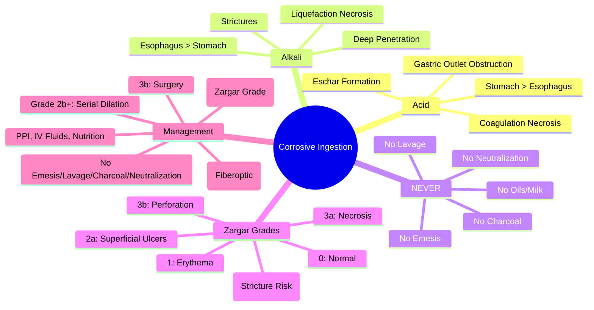
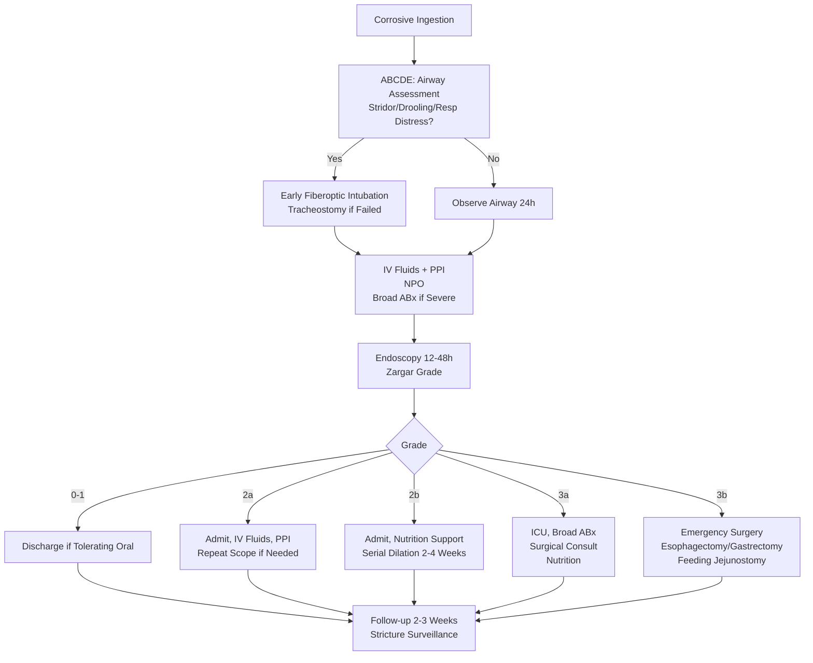

Related: [[General Principles of Poisoning Management]], [[Antidotes Overview]], [[Gastrointestinal Decontamination]]

> [!tip]
> **NEVER induce emesis, NO gastric lavage, NO activated charcoal** — **obscures endoscopy, increases perforation risk**. **Endoscopy within 24h** (ideally 12-24h) = **Zargar grading** guides management. **Alkali** = liquefaction necrosis (deeper, esophagus); **Acid** = coagulation necrosis (stomach, pylorus). **Stricture prevention**: early dilation (controversial), steroids NOT recommended. Key FCPS/MRCP: endoscopy timing (12-48h), Zargar grades 0-3b, grade 2b+ = stricture risk; airway compromise = early intubation; no neutralization.

## 1. Learning Objectives
- Differentiate acid vs alkali injury patterns
- Apply Zargar endoscopic classification
- Determine timing and indications for endoscopy
- Manage airway compromise and perforation
- Understand stricture prevention strategies

## 2. Definition
Corrosive ingestion = tissue injury from **strong acids** (coagulation necrosis) or **strong alkalis** (liquefaction necrosis) causing immediate damage to oropharynx, esophagus, stomach, and airway.

## 3. Core Physiology

### Acid (Coagulation Necrosis)
- **Mechanism**: denatures proteins → forms **eschar** (coagulum) → limits depth of penetration
- **Primary site**: **stomach** (pylorus, antrum) > esophagus
- **Common agents**: hydrochloric (toilet cleaner), sulfuric (drain cleaner), nitric, phosphoric, battery acid
- **Eschar** may slough → perforation risk later

### Alkali (Liquefaction Necrosis)
- **Mechanism**: saponifies fats, solubilizes proteins → **deep penetration**, no eschar → **progressive damage** for 24-48h
- **Primary site**: **esophagus** > stomach (small bowel also)
- **Common agents**: sodium/potassium hydroxide (drain/oven cleaner), sodium hypochlorite (bleach), ammonia, cement, hair relaxers
- **More severe** esophageal injury than acid

## 4. Clinical Features

### Immediate (Oropharyngeal)
- **Severe pain** (mouth, throat, chest, abdomen)
- **Drooling**, dysphagia, odynophagia
- **Oropharyngeal burns** (visible on exam) — **predictive of esophageal injury** but absence ≠ no injury
- **Stridor, hoarseness, respiratory distress** — **airway compromise** (laryngeal edema)

### Delayed (Hours-Days)
- **Esophageal**: chest pain, dysphagia, hematemesis
- **Gastric**: epigastric pain, hematemesis (acid > alkali)
- **Airway**: progressive laryngeal edema → **stridor, respiratory failure** (6-24h peak)
- **Perforation**: mediastinitis, peritonitis, septic shock (crepitus, fever, shock)

## 5. Zargar Endoscopic Classification (Grade 0-3b)
| Grade | Findings | Stricture Risk | Management |
|-------|----------|----------------|------------|
| **0** | Normal | None | Discharge |
| **1** | Erythema, edema | < 5% | Observe, discharge if tolerating oral |
| **2a** | Superficial ulcers, erosions, exudate | 5-10% | Admit, IV fluids, PPI, repeat scope if needed |
| **2b** | **Deep ulcers, circumferential** | **50-100%** | Admit, IV fluids, PPI, **nutrition support, dilation later** |
| **3a** | **Deep ulcers + necrosis** | Near 100% | ICU, broad-spectrum ABx, surgical consult |
| **3b** | **Perforation** | — | **Emergency surgery** |

## 6. Differential Diagnosis
- **Foreign body**: similar drooling, dysphagia, but no burns
- **Infectious esophagitis** (Candida, HSV): odynophagia, immunocompromised
- **Pill esophagitis**: localized, history of pill without water
- **Thermal injury**: hot liquid, similar but history differs
- **Caustic vs foreign body**: both drooling/dysphagia, but foreign body no burns

## 7. Management

### 1. **NEVER** (Absolute Contraindications)
- **NO emesis** (re-exposure, perforation risk)
- **NO gastric lavage** (perforation risk, re-exposure)
- **NO activated charcoal** (obscures endoscopy, no benefit)
- **NO neutralization** (acid + alkali = exothermic reaction → thermal injury, gas → perforation)
- **NO oils/milk/antacids** (no benefit, obscure endoscopy)

### 2. Airway Management (Priority)
- **Assess airway early**: stridor, hoarseness, drooling, respiratory distress
- **Early intubation** if **stridor, respiratory distress, severe oropharyngeal burns** — **delay = impossible intubation** (edema)
- **Fiberoptic intubation** preferred (visualize cords)
- **Tracheostomy** if intubation failed/edema severe
- **Observe 24h** for delayed laryngeal edema

### 3. Endoscopy — **Gold Standard**
- **Timing**: **12-48h post-ingestion** (ideally 12-24h) — **too early (< 12h) = underestimates; too late (> 48h) = sloughing/perforation risk**
- **Mandatory** for all symptomatic patients (drooling, stridor, pain, hematemesis)
- **Zargar grading** → guides management/structure risk
- **Repeat endoscopy** 2-3 weeks if Grade 2b+ (assess strictures)

### 4. Supportive Care
- **NPO** until endoscopy grade known
- **IV fluids**: hydration, maintain urine output
- **PPI** (omeprazole 40mg IV q12h) — reduce acid on injured mucosa
- **Broad-spectrum antibiotics** if Grade 3a/3b (mediastinitis/peritonitis risk)
- **Analgesia**: IV opioids (avoid NSAIDs)
- **Nutrition**: **early enteral** (nasoduodenal/nasojejunal) if Grade 2b+; TPN if unable

### 5. Specific Complications
- **Airway compromise**: early intubation → tracheostomy if prolonged
- **Perforation**: **emergency surgery** (esophagectomy/gastrectomy, cervical esophagostomy, feeding jejunostomy)
- **Strictures** (Grade 2b+): **endoscopic dilation** (start 2-4 weeks, serial), stenting, surgery if refractory
- **Esophageal carcinoma**: long-term risk (20-40 years post-injury) — surveillance endoscopy

### 6. Eye/Skin Exposure
- **Immediate irrigation**: copious water/saline **15+ minutes**
- **Ocular**: emergent ophthalmology consult, continue irrigation during transport
- **Skin**: remove contaminated clothing, wash 15+ min

## 8. Complications
- **Esophageal strictures** (Grade 2b+ = 50-100%)
- **Esophageal carcinoma** (long-term, 1000x risk)
- **Gastric outlet obstruction** (acid > alkali)
- **Tracheoesophageal fistula**
- **Mediastinitis/peritonitis** (perforation)
- **Airway stenosis** (laryngeal injury)

## 9. Prognosis
- **Grade 0-1**: excellent, no strictures
- **Grade 2a**: good, low stricture risk
- **Grade 2b**: moderate, high stricture risk (serial dilation)
- **Grade 3a**: guarded, surgical intervention often needed
- **Grade 3b**: high mortality (perforation, sepsis)

## 10. FCPS/MRCP High-Yield Points
1. **NEVER**: emesis, lavage, charcoal, neutralization, oils/milk
2. **Alkali** = liquefaction necrosis (esophagus) — **deeper**; **Acid** = coagulation necrosis (stomach)
3. **Endoscopy 12-48h** (ideal 12-24h) — **Zargar grading** predicts strictures
4. **Grade 2b+** = high stricture risk (deep circumferential ulcers)
5. **Airway compromise** = **early intubation** (fiberoptic); delay = impossible
5. **NO neutralization** (heat + gas → perforation)
6. **Stricture prevention**: early dilation (2-4 weeks) for Grade 2b+; steroids NOT recommended
6. **Perforation** = emergency surgery
7. **Oropharyngeal burns** predict esophageal injury but absence ≠ no injury
8. **Eye exposure** = immediate irrigation 15+ min + ophthalmology
9. **Zargar Grade 3b** = perforation → emergency surgery

## 11. Common Viva Questions
1. Acid vs alkali injury patterns
2. Zargar classification and stricture risk
3. Endoscopy timing and contraindications
4. Contraindicated interventions (emesis, lavage, charcoal, neutralization)
6. Airway management
7. Stricture prevention and management
8. Eye exposure management

## 12. Common Confusions / Exam Traps
- **Charcoal for corrosives** → NO (obscures endoscopy)
- **Neutralization** → NO (exothermic, gas, worse injury)
- **Emesis/lavage** → NO (re-exposure, perforation)
- **Endoscopy immediately** → NO, too early (< 12h) underestimates
- **Steroids prevent strictures** → NO evidence, NOT recommended
- **Alkali = stomach** → NO, alkali = esophagus; acid = stomach
- **Grade 2a = high stricture risk** → NO, Grade 2b+ = high risk

## 13. Mnemonics
- **CORROSIVE NO-NOs**: **N**o **E**mesis, **N**o **L**avage, **N**o **C**harcoal, **N**o **N**eutralization, **N**o **O**ils/**M**ilk
- **ACID VS ALKALI**: **A**cid = **C**oagulation = **S**tomach; **A**lkali = **L**iquefaction = **E**sophagus
- **ZARGAR GRADES**: **0** Normal, **1** Erythema, **2a** Superficial, **2b** Deep/Circumferential, **3a** Necrosis, **3b** Perforation
- **ENDOSCOPY TIMING**: **12-48h** (Goldilocks: not too early, not too late)
- **STRUCTURE RISK**: **Grade 2b+** = High (Deep circumferential)
- **AIRWAY**: **S**tridor = **I**ntubate **E**arly (Fiberoptic)

## 14. Mind Map

## 15. Flowchart

## 16. Suggested Visuals / Image Notes
- Zargar grading endoscopic images
- Acid vs alkali histology (coagulation vs liquefaction)
- Endoscopy timing diagram
- Stricture dilation algorithm

## 17. Suggested Video References
- Corrosive ingestion endoscopy grading (Zargar)
- Airway management in caustic injury

## 18. One-Page Revision Summary
- **NEVER**: emesis, lavage, charcoal, neutralization, oils/milk
- **Alkali** = liquefaction necrosis (esophagus); **Acid** = coagulation necrosis (stomach)
- **Endoscopy 12-48h** → **Zargar Grade**
- **Grade 2b+** = deep circumferential ulcers = **high stricture risk** (50-100%)
- **Airway**: stridor = **early fiberoptic intubation**
- **NO neutralization** (heat + gas)
- **Grade 3b** = perforation → **emergency surgery**
- **Stricture prevention**: serial dilation (2-4 weeks) for 2b+; steroids NO
- **Eye exposure**: irrigation 15+ min + ophthalmology

## 24-Hour Recall Prompts
- State 3 absolute contraindications in corrosive ingestion
- Explain acid vs alkali injury difference
- List Zargar grades and stricture risk
- When to do endoscopy? When to intubate?

## 7-Day / 15-Day / 30-Day Revision Tracker
- [ ] Day 1 completed
- [ ] 24-hour recall completed
- [ ] Day 7 revision completed
- [ ] Day 15 revision completed
- [ ] Day 30 revision completed

## 19. Must Know / Should Know / Nice to Know
### Must Know
- NEVER: emesis, lavage, charcoal, neutralization, oils/milk
- Alkali = esophagus (liquefaction); Acid = stomach (coagulation)
- Endoscopy 12-48h → Zargar grade
- Grade 2b+ = stricture risk
- Airway: stridor = early intubation
- Grade 3b = perforation = surgery
- Eye: irrigation 15+ min + ophthalmology

### Should Know
- Zargar grading details
- Stricture dilation protocol
- Long-term cancer risk
- Specific agents (bleach, drain cleaner, battery acid)

### Nice to Know
- Surgical techniques for perforation
- Stenting for strictures
- Pediatric considerations
- Cement/alkali skin burns

## 20. Self-Test Scorecard
- Understanding: /10
- Recall: /10
- MCQ Performance: /10
- SBA Performance: /10
- Viva Confidence: /10
- Total: /50

> [!tip]
> Interpretation: <35 = weak topic, 35-44 = acceptable but insecure, 45+ = strong exam-ready topic.

## 21. Exam Answer Modes
### Long Answer Skeleton
- Acid vs alkali pathophysiology
- NEVER list
- Airway management
- Endoscopy timing + Zargar classification
- Grading management (0-3b)
- Complications (stricture, perforation, cancer)
- Eye/skin management

### Short Note Skeleton
- Acid vs alkali table
- NEVER box
- Zargar grade table
- Endoscopy timing box

### Viva One-Liners
- "Corrosive NEVER: emesis, lavage, charcoal, neutralization, oils/milk"
- "Alkali = liquefaction = esophagus; Acid = coagulation = stomach"
- "Endoscopy 12-48h → Zargar grade (0 to 3b)"
- "Grade 2b+ = deep circumferential ulcers = stricture risk 50-100%"
- "Stridor = early fiberoptic intubation"
- "No neutralization (exothermic, gas)"
- "Grade 3b = perforation = emergency surgery"
- "Steroids NOT recommended for stricture prevention"
- "Eye: immediate irrigation 15+ min + ophthalmology"

### Ward-Case Discussion Points
- Child drank bleach → alkali, endoscopy 12-48h, stricture risk
- Adult with battery acid → acid, gastric injury, endoscopy 12-48h
- Persistent drooling/stridor 6h post-ingestion → early intubation
- Eye splash with drain cleaner → immediate irrigation, ophthalmology

### Last-Night-Before-Exam Sheet
- NO: Emesis, Lavage, Charcoal, Neutralization, Oils/Milk
- Alkali = Esophagus (Liquefaction), Acid = Stomach (Coagulation)
- Endoscopy 12-48h, Zargar 0-3b
- 2b+ = Stricture Risk
- Stridor = Intubate Early
- Neutralization = NO
- 3b = Perforation = Surgery
- Eye = Irrigation + Ophtho

## 22. Summary
Corrosive ingestion: **NEVER** emesis, lavage, charcoal, neutralization, oils/milk. **Alkali** = liquefaction necrosis (esophagus); **Acid** = coagulation necrosis (stomach). **Endoscopy 12-48h** → **Zargar grade** (0 normal → 3b perforation). **Grade 2b+** = deep circumferential ulcers = **stricture risk 50-100%**. **Airway**: stridor = **early fiberoptic intubation**. **Grade 3b** = perforation → **emergency surgery**. **Stricture prevention**: serial dilation (2-4 weeks), **steroids NOT recommended**. Eye exposure: immediate irrigation 15+ min + ophthalmology.

## 23. MCQs (10)
1. Question 1
   A. Option A
   B. Option B
   C. Option C
   D. Option D
   **Answer: A**
   *Explanation: Explanation 1*

2. Question 2
   A. Option A
   B. Option B
   C. Option C
   D. Option D
   **Answer: B**
   *Explanation: Explanation 2*

3. Question 3
   A. Option A
   B. Option B
   C. Option C
   D. Option D
   **Answer: C**
   *Explanation: Explanation 3*

4. Question 4
   A. Option A
   B. Option B
   C. Option C
   D. Option D
   **Answer: D**
   *Explanation: Explanation 4*

5. Question 5
   A. Option A
   B. Option B
   C. Option C
   D. Option D
   **Answer: A**
   *Explanation: Explanation 5*

6. Question 6
   A. Option A
   B. Option B
   C. Option C
   D. Option D
   **Answer: B**
   *Explanation: Explanation 6*

7. Question 7
   A. Option A
   B. Option B
   C. Option C
   D. Option D
   **Answer: C**
   *Explanation: Explanation 7*

8. Question 8
   A. Option A
   B. Option B
   C. Option C
   D. Option D
   **Answer: D**
   *Explanation: Explanation 8*

9. Question 9
   A. Option A
   B. Option B
   C. Option C
   D. Option D
   **Answer: A**
   *Explanation: Explanation 9*

10. Question 10
   A. Option A
   B. Option B
   C. Option C
   D. Option D
   **Answer: B**
   *Explanation: Explanation 10*

## 24. SBA Questions (10)
1. Scenario 1
   A. Option A
   B. Option B
   C. Option C
   D. Option D
   **Answer: A**
   *Explanation: Explanation 1*

2. Scenario 2
   A. Option A
   B. Option B
   C. Option C
   D. Option D
   **Answer: B**
   *Explanation: Explanation 2*

3. Scenario 3
   A. Option A
   B. Option B
   C. Option C
   D. Option D
   **Answer: C**
   *Explanation: Explanation 3*

4. Scenario 4
   A. Option A
   B. Option B
   C. Option C
   D. Option D
   **Answer: D**
   *Explanation: Explanation 4*

5. Scenario 5
   A. Option A
   B. Option B
   C. Option C
   D. Option D
   **Answer: A**
   *Explanation: Explanation 5*

6. Scenario 6
   A. Option A
   B. Option B
   C. Option C
   D. Option D
   **Answer: B**
   *Explanation: Explanation 6*

7. Scenario 7
   A. Option A
   B. Option B
   C. Option C
   D. Option D
   **Answer: C**
   *Explanation: Explanation 7*

8. Scenario 8
   A. Option A
   B. Option B
   C. Option C
   D. Option D
   **Answer: D**
   *Explanation: Explanation 8*

9. Scenario 9
   A. Option A
   B. Option B
   C. Option C
   D. Option D
   **Answer: A**
   *Explanation: Explanation 9*

10. Scenario 10
   A. Option A
   B. Option B
   C. Option C
   D. Option D
   **Answer: B**
   *Explanation: Explanation 10*

## 25. Flashcards
- Q: Flashcard 1 question
  A: Flashcard 1 answer
- Q: Flashcard 2 question
  A: Flashcard 2 answer
- Q: Flashcard 3 question
  A: Flashcard 3 answer
- Q: Flashcard 4 question
  A: Flashcard 4 answer
- Q: Flashcard 5 question
  A: Flashcard 5 answer
- Q: Flashcard 6 question
  A: Flashcard 6 answer
- Q: Flashcard 7 question
  A: Flashcard 7 answer
- Q: Flashcard 8 question
  A: Flashcard 8 answer
- Q: Flashcard 9 question
  A: Flashcard 9 answer
- Q: Flashcard 10 question
  A: Flashcard 10 answer
- Q: Flashcard 11 question
  A: Flashcard 11 answer
- Q: Flashcard 12 question
  A: Flashcard 12 answer
- Q: Flashcard 13 question
  A: Flashcard 13 answer
- Q: Flashcard 14 question
  A: Flashcard 14 answer
- Q: Flashcard 15 question
  A: Flashcard 15 answer

## 26. Answer Key with Explanations
### MCQs
1. **A** - Explanation 1
2. **B** - Explanation 2
3. **C** - Explanation 3
4. **D** - Explanation 4
5. **A** - Explanation 5
6. **B** - Explanation 6
7. **C** - Explanation 7
8. **D** - Explanation 8
9. **A** - Explanation 9
10. **B** - Explanation 10

### SBAs
1. **A** - Explanation 1
2. **B** - Explanation 2
3. **C** - Explanation 3
4. **D** - Explanation 4
5. **A** - Explanation 5
6. **B** - Explanation 6
7. **C** - Explanation 7
8. **D** - Explanation 8
9. **A** - Explanation 9
10. **B** - Explanation 10