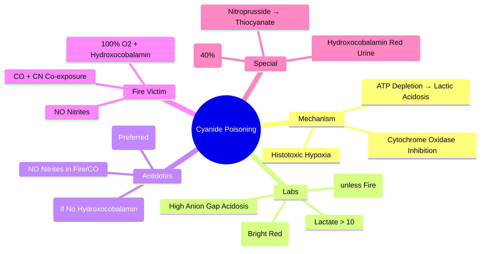

Related: [[General Principles of Poisoning Management]], [[Carbon Monoxide Poisoning]], [[Antidotes Overview]], [[Hydrogen Sulfide Poisoning]]

> [!tip]
> **Cyanide inhibits cytochrome c oxidase (Complex IV)** → **histotoxic hypoxia** (cells cannot use O₂). **High ANION GAP metabolic acidosis + HIGH VENOUS O₂ (venous blood bright red)**. **Hydroxocobalamin** (preferred) or **nitrite/thiosulfate** (traditional). **Fire victims: think CO + CN co-exposure**. Key FCPS/MRCP: hydroxocobalamin 5g IV (Cyanokit) — safe in smoke inhalation (no methemoglobinemia); nitrites CONTRAINDICATED in fire victims (COHb + metHb = worse hypoxia); lactate > 10 = poor prognosis.

## 1. Learning Objectives
- Recognize cyanide poisoning (metabolic acidosis, high venous O₂, bitter almond smell)
- Apply hydroxocobalamin protocol (preferred)
- Apply nitrite/thiosulfate protocol (if hydroxocobalamin unavailable)
- Differentiate from CO poisoning
- Manage fire victim with CO + CN co-exposure

## 2. Definition
Cyanide poisoning = **histotoxic hypoxia** from cyanide (CN⁻) binding to ferric iron (Fe³⁺) in **cytochrome c oxidase (Complex IV)** → blocks mitochondrial electron transport chain → **cells cannot utilize oxygen** despite normal delivery.

## 3. Core Physiology
- **Mechanism**: CN⁻ + Fe³⁺ (cytochrome a₃) → **stable complex** → **arrests oxidative phosphorylation** → ATP depletion → anaerobic metabolism → **lactic acidosis**
- **Venous blood**: **bright red / high O₂ saturation** (O₂ not extracted by tissues)
- **Sources**:
  - **Fire smoke** (polyurethane, wool, silk, nylon combustion) — **most common**
  - **Industrial**: electroplating, metal cleaning, gold mining
  - **Ingestion**: sodium/potassium cyanide salts, amygdalin (apricot pits, bitter almonds)
  - **Iatrogenic**: nitroprusside infusion (prolonged/high dose) → thiocyanate toxicity
- **Detoxification**: **rhodanese** (mitochondrial enzyme) + **thiosulfate** → **thiocyanate** (renally excreted, less toxic)

## 4. Clinical Features
- **Rapid onset** (seconds-minutes inhalation; minutes ingestion)
- **Severe metabolic acidosis** (pH often < 7.0, lactate > 10-15 mmol/L)
- **High venous O₂** (venous pO₂ > arterial pO₂, venous blood bright red)
- **CNS**: headache, confusion, seizures, coma, fixed dilated pupils
- **Cardiac**: bradycardia, hypotension, arrhythmias, cardiac arrest
- **Respiratory**: tachypnea → apnea
- **Bitter almond smell** (only ~40% population can detect — **absence ≠ excludes**)
- **Cherry-red skin** (like CO, but rare)

## 5. Differential Diagnosis
| Feature | Cyanide | Carbon Monoxide | Hydrogen Sulfide |
|---------|---------|-----------------|------------------|
| **Mechanism** | Cytochrome oxidase inhibition | COHb + cytochrome inhibition | Cytochrome oxidase inhibition |
| **Venous O₂** | **High** (bright red) | Normal/low | High |
| **Lactate** | **Very high** (> 10) | High | High |
| **Smell** | Bitter almond (40%) | None | **Rotten egg** |
| **COHb** | Normal | **Elevated** | Normal |
| **Antidote** | Hydroxocobalamin / Nitrite+Thiosulfate | 100% O₂ ± HBO | Nitrites / Hydroxocobalamin |
| **Fire victim** | **Common co-exposure** | **Common** | Rare |

## 6. Investigations
- **ABG/VBG** — **severe metabolic acidosis**, **venous pO₂ high** (venous > arterial), **lactate very high**
- **Lactate** — **> 10 mmol/L = highly suggestive** (specificity > 90% for CN in fire victims)
- **COHb** — **elevated if fire victim** (co-exposure)
- **Cyanide level** — not routinely available acutely (send but don't wait)
- **Thiocyanate** — nitroprusside toxicity
- **ECG** — arrhythmias, ischemia
- **CXR** — pulmonary edema (fire)
- **Paracetamol level** (always)

## 7. Management

### 1. Immediate: 100% Oxygen (NRB) — **Always First**
- High-flow O₂ via NRB — **do not delay for antidote**
- **Mechanism**: competitive displacement of CN from cytochrome oxidase (weak but helps)

### 2. Hydroxocobalamin (Cyanokit) — **PREFERRED ANTIDOTE**
- **Mechanism**: **directly binds CN⁻** → **cyanocobalamin (vitamin B12)** → renally excreted
- **Dose**: **5 g IV** (one 5g vial = Cyanokit) over **15 min** (in 200 mL NS/D5W)
- **Repeat**: second 5g vial if inadequate response (max 10g)
- **Advantages**: **no methemoglobinemia** (safe in CO co-exposure/fire victims), no hypotension, single agent
- **Adverse**: **red skin/urine** (harmless, interferes with colorimetric labs), rash, hypertension (transient)
- **Lab interference**: falsely ↑ bilirubin, creatinine, glucose, lactate (colorimetric) — **use non-colorimetric methods if critical**

### 3. Nitrite + Thiosulfate (Traditional) — **IF Hydroxocobalamin UNAVAILABLE**
- **Sodium nitrite** 300 mg (10 mL of 3%) IV over 5-10 min → **induces methemoglobinemia** (MetHb 10-20%) → metHb binds CN⁻ → cyanomethemoglobin
- **Sodium thiosulfate** 12.5 g (50 mL of 25%) IV over 10-20 min → **sulfur donor for rhodanese** → thiocyanate
- **CONTRAINDICATED in fire victims with CO poisoning** — **MetHb + COHb = worse hypoxia**
- **Contraindicated**: anemia, cardiovascular disease, G6PD deficiency
- **Monitor**: MetHb level (target 10-20%), BP, O₂ saturation

### 4. Dicobalt Edetate (Kelocyanor) — **UK Historical, Rarely Used Now**
- 300 mg IV — cobalt binds CN; **pro-hypertensive, convulsive risk** — **avoid if hydroxocobalamin available**

### 5. Nitroprusside Toxicity
- **Prolonged infusion** > 2 mcg/kg/min or > 24h or renal failure → **thiocyanate accumulation**
- **Features**: metabolic acidosis, confusion, seizures
- **Treatment**: **stop nitroprusside**, **hydroxocobalamin** (binds CN), **dialysis** (thiocyanate dialyzable)

### 6. Supportive Care
- **Intubation/ventilation** (apnea common)
- **Vasopressors** (norepinephrine) for hypotension
- **Seizures**: benzodiazepines
- **Correct acidosis** (bicarbonate if pH < 7.2)
- **Rhythm management** (standard ACLS)

## 8. Complications
- Neurological sequelae (parkinsonism, cognitive deficits, cerebellar)
- Myocardial injury
- Rhabdomyolysis
- Death (rapid if untreated)

## 9. Prognosis
- **Excellent with early hydroxocobalamin**
- Mortality high if delayed (> 50% without antidote)
- **Lactate > 10-15 mmol/L** = poor prognosis
- Neurological sequelae in survivors (basal ganglia, hippocampus)

## 10. FCPS/MRCP High-Yield Points
1. **Histotoxic hypoxia** — cytochrome c oxidase inhibition
2. **Hallmark labs**: **high anion gap metabolic acidosis + HIGH VENOUS O₂** (venous blood bright red)
3. **Lactate > 10 mmol/L** = highly suggestive in fire victim
4. **Hydroxocobalamin 5g IV** = preferred (safe in CO co-exposure, no metHb)
5. **Nitrites CONTRAINDICATED in fire victims** (COHb + MetHb = worse hypoxia)
6. **Fire victims: assume CO + CN co-exposure** — give 100% O₂ + hydroxocobalamin
6. **Bitter almond smell** — only ~40% detect, absence ≠ excludes
7. **Nitroprusside toxicity** → thiocyanate (hydroxocobalamin + dialysis)
8. **Red urine/skin** with hydroxocobalamin = harmless, interferes with colorimetric labs
9. **Venous pO₂ > arterial pO₂** = diagnostic clue

## 11. Common Viva Questions
1. Mechanism of cyanide toxicity
2. Hydroxocobalamin dose and advantages
3. Why nitrites contraindicated in fire victims?
4. Lab findings (lactate, venous O₂)
5. Fire victim management (CO + CN)
6. Nitroprusside toxicity management
7. Differential: CN vs CO vs H₂S

## 12. Common Confusions / Exam Traps
- **Nitrites in fire victims** → **CONTRAINDICATED** (MetHb + COHb = fatal hypoxia)
- **Hydroxocobalamin red urine** → not hemolysis, interferes with colorimetric labs
- **COHb elevated ≠ only CO** — fire victims have both
- **Lactate > 10** = CN until proven otherwise in smoke inhalation
- **Venous blood bright red** = CN (or CO), not arterial
- **Cherry-red skin** = rare in both CN and CO
- **Absence of almond smell ≠ no cyanide**
- **Hydroxocobalamin = vitamin B12 precursor** (cyanocobalamin after binding CN)

## 13. Mnemonics
- **CN MECHANISM**: **C**yanide → **C**ytochrome **O**xidase **I**nhibition → **H**istotoxic **H**ypoxia
- **LABS**: **H**igh **A**nion **G**ap + **H**igh **V**enous **O**₂ + **L**actate **> 10**
- **HYDROXOCOBALAMIN**: **5g IV**, **NO MetHb**, **SAFE in CO**, **RED urine/skin**
- **NITRITES**: **MetHb** → binds CN → **CONTRAINDICATED in CO/Fire**
- **FIRE VICTIM**: **CO + CN** → **100% O₂ + Hydroxocobalamin** (NO nitrites)
- **NITROPRESSIDE**: **Thiocyanate** → **Hydroxocobalamin + Dialysis**

## 14. Mind Map


## 15. Flowchart
```mermaid
flowchart TD
  A[Suspected CN: Acidosis + High Venous O2 + Lactate>10\nFire Victim / Industrial / Ingestion] --> B[Immediate 100% O2 NRB\nIntubate if Needed]
  B --> C{Hydroxocobalamin Available?}
  C -->|Yes| D[Hydroxocobalamin 5g IV\nOver 15 min\nRepeat 5g if Needed\nMax 10g]
  C -->|No| E[Fire Victim / CO Exposure?]
  E -->|Yes| F[NO NITRITES\nSupportive Only\nConsider Dicobalt Edetate if Available]
  E -->|No| G[Nitrite 300mg IV\nThiosulfate 12.5g IV\nMonitor MetHb 10-20%]
  D --> H[Supportive: Vasopressors,\nBicarbonate pH<7.2,\nSeizure Control,\nMonitor Labs (Colorimetric Interference)]
  F --> H
  G --> H
```

## 16. Suggested Visuals / Image Notes
- CN mechanism diagram (cytochrome oxidase)
- Hydroxocobalamin vs nitrite/thiosulfate comparison
- Fire victim algorithm (CO + CN)
- Lactate/venous O₂ interpretation

## 17. Suggested Video References
- Cyanide antidote kit (Cyanokit) demonstration
- Fire victim toxicology (CO + CN)

## 18. One-Page Revision Summary
- **Mechanism**: CN binds cytochrome c oxidase (Fe³⁺) → histotoxic hypoxia
- **Labs**: high anion gap acidosis + **high venous O₂** (bright red) + **lactate > 10**
- **Hydroxocobalamin 5g IV** = preferred (no metHb, safe in CO)
- **Nitrites CONTRAINDICATED in fire/CO** (MetHb + COHb = worse)
- **Fire victim**: assume CO + CN → 100% O₂ + hydroxocobalamin
- **Bitter almond smell** = 40% detect
- **Nitroprusside toxicity** → thiocyanate → hydroxocobalamin + dialysis
- **Hydroxocobalamin**: red urine/skin (harmless, interferes with colorimetric labs)

## 24-Hour Recall Prompts
- State hydroxocobalamin dose and key advantage
- Explain why nitrites are contraindicated in fire victims
- List 3 hallmark lab findings
- Describe fire victim management algorithm

## 7-Day / 15-Day / 30-Day Revision Tracker
- [ ] Day 1 completed
- [ ] 24-hour recall completed
- [ ] Day 7 revision completed
- [ ] Day 15 revision completed
- [ ] Day 30 revision completed

## 19. Must Know / Should Know / Nice to Know
### Must Know
- Mechanism: cytochrome oxidase inhibition → histotoxic hypoxia
- Labs: high anion gap + high venous O₂ + lactate > 10
- Hydroxocobalamin 5g IV = preferred
- Nitrites contraindicated in fire/CO
- Fire victim = CO + CN → hydroxocobalamin
- Bitter almond smell ≤ 40% detection
- Nitroprusside → thiocyanate

### Should Know
- Hydroxocobalamin red urine/skin (lab interference)
- Venous pO₂ > arterial pO₂
- Dicobalt edetate (historical)
- Neurological sequelae (basal ganglia)

### Nice to Know
- Rhodanese/thiosulfate pathway details
- Cobalt-based antidotes
- Specific industrial sources
- Cyanide generation from acrylonitrile

## 20. Self-Test Scorecard
- Understanding: /10
- Recall: /10
- MCQ Performance: /10
- SBA Performance: /10
- Viva Confidence: /10
- Total: /50

> [!tip]
> Interpretation: <35 = weak topic, 35-44 = acceptable but insecure, 45+ = strong exam-ready topic.

## 21. Exam Answer Modes
### Long Answer Skeleton
- Mechanism (cytochrome oxidase, histotoxic hypoxia)
- Clinical features
- Labs (hallmark triad)
- Antidotes: hydroxocobalamin (preferred) vs nitrite/thiosulfate (contraindicated in CO)
- Fire victim algorithm
- Nitroprusside toxicity
- Supportive care

### Short Note Skeleton
- Hallmark labs box
- Hydroxocobalamin vs nitrite comparison
- Fire victim algorithm
- Nitroprusside box

### Viva One-Liners
- "CN: cytochrome oxidase inhibition → histotoxic hypoxia"
- "Labs: high anion gap + HIGH VENOUS O₂ + lactate > 10"
- "Hydroxocobalamin 5g IV: preferred, NO metHb, SAFE in CO"
- "Nitrites: CONTRAINDICATED in fire/CO (MetHb + COHb = fatal)"
- "Fire victim: 100% O₂ + hydroxocobalamin (assume CO + CN)"
- "Lactate > 10 in smoke inhalation = CN until proven otherwise"
- "Venous blood bright red = CN (or CO)"
- "Bitter almond smell: only 40% detect"
- "Nitroprusside toxicity: thiocyanate → hydroxocobalamin + dialysis"
- "Hydroxocobalamin red urine: harmless, interferes with colorimetric labs"

### Ward-Case Discussion Points
- Smoke inhalation patient: lactate 14, COHb 20% → hydroxocobalamin + 100% O₂ + HBO for CO
- Nitroprusside infusion 48h, renal failure, acidosis → stop nitroprusside, hydroxocobalamin, dialysis
- Industrial worker sudden collapse, bitter almond smell → hydroxocobalamin immediately

### Last-Night-Before-Exam Sheet
- CN: Cytochrome oxidase inhibition
- Labs: Anion gap + Venous O2 high + Lactate >10
- Hydroxocobalamin: 5g IV, No MetHb, Safe in CO
- Nitrites: Contraindicated in Fire/CO
- Fire: CO + CN → 100% O2 + Hydroxocobalamin
- Lactate >10 = CN
- Nitroprusside: Thiocyanate
- Red urine = Hydroxocobalamin

## 22. Summary
Cyanide poisoning = cytochrome c oxidase inhibition → histotoxic hypoxia. Hallmark labs: high anion gap metabolic acidosis + **high venous O₂** + **lactate > 10**. **Hydroxocobalamin 5g IV** = preferred antidote (no metHb, safe in CO). **Nitrites CONTRAINDICATED in fire/CO** (metHb + COHb = fatal hypoxia). Fire victims: assume CO + CN → 100% O₂ + hydroxocobalamin. Bitter almond smell ≤ 40% detect. Nitroprusside toxicity → thiocyanate → hydroxocobalamin + dialysis.

## 23. MCQs (10)
1. Cyanide mechanism of toxicity?
   A. Methemoglobin formation
   B. Inhibits cytochrome c oxidase (Complex IV) → cellular hypoxia
   C. Hemoglobin binding
   D. Pulmonary edema
   **Answer: B**
   *Explanation: CN⁻ binds ferric iron (Fe³⁺) in cytochrome c oxidase (Complex IV) → blocks electron transport → cellular hypoxia (histotoxic hypoxia). High O₂ extraction failure → venous blood bright red.*

2. Cyanide classic presentation?
   A. Cherry red skin, metabolic acidosis, coma
   B. Cyanosis, respiratory alkalosis
   C. Mydriasis, tachycardia
   D. Only seizures
   **Answer: A**
   *Explanation: CN⁻: 'cherry red' skin (rare, post-mortem), severe metabolic acidosis (lactic), coma, seizures, cardiovascular collapse. Venous blood bright red (high O₂ content, not extracted). Bitter almond odor (genetic).*

3. Hydroxocobalamin dose for cyanide?
   A. 1 g IV
   B. 5 g IV (2.5g/100mL over 15 min)
   C. 10 g IV
   D. 2.5 g IV
   **Answer: B**
   *Explanation: Hydroxocobalamin 5g IV (2.5g/100mL over 15 min). Binds CN⁻ → cyanocobalamin (excreted renally). Preferred antidote (no metHb). Skin/r urine turns red. Interferes with lab assays (color).*

4. Nitrite + thiosulfate alternative - mechanism?
   A. Nitrite forms metHb → binds CN⁻; thiosulfate → rhodanese → thiocyanate (renally excreted)
   B. Both bind CN⁻ directly
   C. Nitrite displaces CN⁻ from cytochrome
   D. Thiosulfate reactivates cytochrome
   **Answer: A**
   *Explanation: Nitrites (amyl/sodium): oxidize Hb → metHb → binds CN⁻ (forming cyanmetHb). Thiosulfate: sulfur donor for rhodanese → converts CN⁻ → thiocyanate (renal excretion). Risk: metHbemia, hypotension.*

5. Cyanide + carbon monoxide co-exposure?
   A. Treat CN⁻ only
   B. House fires: both common. Hydroxocobalamin for CN⁻ + 100% O₂ for CO. Avoid nitrites (worsen O₂ delivery)
   C. Nitrites help both
   D. HBO contraindicated
   **Answer: B**
   *Explanation: House fires: CO + CN⁻ (plastics, wool, silk). Hydroxocobalamin preferred for CN⁻ (no metHb). 100% O₂ for CO. Nitrites worsen O₂ delivery (metHb + COHb). HBO for CO if indicated.*

6. Cyanide - lactic acidosis mechanism?
   A. Anaerobic metabolism from cellular hypoxia (cytochrome oxidase inhibition)
   B. Seizures only
   C. Liver failure
   D. Renal failure
   **Answer: A**
   *Explanation: CN⁻ blocks cytochrome c oxidase → cells can't use O₂ → anaerobic metabolism → lactic acidosis. Venous O₂ high (bright red blood). Lactate > 10 = strong CN⁻ indicator.*

7. Hydroxocobalamin adverse effects?
   A. Methemoglobinemia
   B. Red skin/urine, hypertension, interference with lab assays (colorimetric)
   C. Seizures
   D. Hypotension
   **Answer: B**
   *Explanation: Hydroxocobalamin: skin/urine turns red (transient), transient hypertension, interferes with colorimetric lab assays (creatinine, bilirubin, glucose, etc.). No metHb.*

8. Cyanide - amyl nitrite pearls?
   A. Oral
   B. Inhalation (break pearl, inhale vapor q1-2min)
   C. IV
   D. IM
   **Answer: B**
   *Explanation: Amyl nitrite: break pearl, inhale vapor for 30 sec q1-2min. Pre-hospital/bridging to IV nitrites. MetHb formation → binds CN⁻.*

9. Cyanide - thiosulfate dose?
   A. 1 g IV
   B. 12.5 g (50 mL of 25%) IV over 10 min
   C. 100 mg IV
   D. 50 mg/kg
   **Answer: B**
   *Explanation: Sodium thiosulfate: 12.5 g (50 mL of 25%) IV over 10 min. Can repeat half dose. Sulfur donor for rhodanese. Give AFTER nitrites (if using nitrite/thiosulfate regimen).*

10. Cyanide - hydroxycobalamin vs nitrites in smoke inhalation?
   A. Nitrites preferred
   B. Hydroxocobalamin preferred (no metHb, COHb already impairing O₂ delivery)
   C. Equal
   D. Nitrites only
   **Answer: B**
   *Explanation: Smoke inhalation = CO + CN⁻. Hydroxocobalamin preferred: no metHb (nitrites worsen O₂ delivery with COHb). 100% O₂ for CO. HBO if CO criteria met.*

## 24. SBA Questions (10)
1. House fire victim. Unconscious, soot in airway, lactate 14, venous blood bright red. COHb 30%. Management?
   A. Hydroxocobalamin 5g IV + 100% O₂ NRB + arrange HBO
   B. Nitrites + thiosulfate + 100% O₂
   C. 100% O₂ only
   D. HBO only
   **Answer: A**
   *Explanation: Smoke inhalation: CO + CN⁻. Lactate > 10 = CN⁻. Hydroxocobalamin 5g IV (no metHb). 100% O₂ for CO. HBO for CO (COHb >25%, LOC). Avoid nitrites (metHb + COHb = worse O₂ delivery).*

2. Industrial worker, sodium cyanide spill. Collapse, seizures, metabolic acidosis. Hydroxocobalamin not available. Alternative?
   A. Amyl nitrite pearls (inhale) → sodium nitrite 300mg IV → sodium thiosulfate 12.5g IV
   B. 100% O₂ only
   C. Methylene blue
   D. Naloxone
   **Answer: A**
   *Explanation: Nitrite/thiosulfate regimen: amyl nitrite inhale (bridge) → sodium nitrite 300mg IV (10mg/kg child) over 5-10min → sodium thiosulfate 12.5g IV. Monitor metHb (keep <30%). Hydroxocobalamin preferred if available.*

3. Cyanide poisoning - hydroxycobalamin given. Lab shows creatinine 300 (baseline 80). Why?
   A. Acute kidney injury from CN⁻
   B. Assay interference (red color) - falsely elevated creatinine
   C. Rhabdomyolysis
   D. Dehydration
   **Answer: B**
   *Explanation: Hydroxocobalamin turns plasma/urine red → interferes with COLORIMETRIC assays: creatinine, bilirubin, glucose, COHb, metHb, etc. Use non-colorimetric methods or interpret with caution.*

4. CN⁻ poisoning - venous blood gas shows pO₂ 80 mmHg (high). Why?
   A. Hyperventilation
   B. Cells can't extract O₂ (cytochrome oxidase blocked) → venous O₂ remains high
   C. Sampling error
   D. CO poisoning
   **Answer: B**
   *Explanation: CN⁻ blocks cytochrome c oxidase → cells can't utilize O₂ → venous blood retains high O₂ content → bright red, high venous pO₂. Classic finding.*

5. Child finds cyanide salts, ingests. Rapid collapse. Antidote?
   A. Hydroxocobalamin 5g IV (weight-based 70mg/kg max 5g)
   B. Nitrites only
   C. Thiosulfate only
   D. Supportive only
   **Answer: A**
   *Explanation: Hydroxocobalamin: pediatric dose 70 mg/kg IV (max 5g). Same for nitrite/thiosulfate (nitrite 10mg/kg, thiosulfate 400mg/kg). Rapid administration critical.*

6. CN⁻ - metHb level after nitrites should be kept?
   A. < 10%
   B. < 30%
   C. < 50%
   D. No limit
   **Answer: B**
   *Explanation: Nitrites → metHb (binds CN⁻). Keep metHb < 30% (monitor). Higher = impaired O₂ delivery. Sodium nitrite 300mg IV → metHb ~10-20%.*

7. Hydroxocobalamin - blood pressure effect?
   A. Hypotension
   B. Transient hypertension
   C. No effect
   D. Bradycardia
   **Answer: B**
   *Explanation: Hydroxocobalamin causes transient hypertension (mechanism unclear, possibly NO scavenging). Monitor BP. Resolves spontaneously.*

8. Cyanide - rhodanese enzyme?
   A. Converts CN⁻ to cyanocobalamin
   B. Converts CN⁻ + thiosulfate → thiocyanate (renal excretion)
   C. Reactivates cytochrome oxidase
   D. Binds CN⁻ in blood
   **Answer: B**
   *Explanation: Rhodanese (sulfurtransferase): uses thiosulfate as sulfur donor → converts CN⁻ → thiocyanate (SCN⁻) → renal excretion. Thiosulfate provides sulfur.*

9. Cyanide - disposition after hydroxocobalamin?
   A. Discharge if asymptomatic
   B. Observe 24h (rebound toxicity possible, monitor lactate, neurologic)
   C. 6h observation
   D. ICU only if intubated
   **Answer: B**
   *Explanation: Observe 24h: CN⁻ can redistribute, rebound toxicity. Monitor lactate, neurologic status, cardiac. Psych if DSH.*

## 25. Flashcards
- Q: Cyanide mechanism?
  A: Binds Fe³⁺ in cytochrome c oxidase (Complex IV) → blocks electron transport → cellular (histotoxic) hypoxia. Cells can't use O₂.
- Q: CN⁻ classic findings?
  A: Metabolic acidosis (lactic), coma, seizures, CV collapse. Venous blood BRIGHT RED (high O₂). Cherry red skin (rare, post-mortem). Bitter almond odor (genetic).
- Q: Lactate > 10 in smoke inhalation?
  A: Strong indicator of CN⁻ poisoning (cellular hypoxia → anaerobic metabolism).
- Q: Hydroxocobalamin?
  A: 5g IV (2.5g/100mL over 15min). Binds CN⁻ → cyanocobalamin (renal excretion). Preferred: no metHb. Skin/urine red. Lab assay interference.
- Q: Nitrite + thiosulfate?
  A: Nitrite → metHb (binds CN⁻). Thiosulfate → rhodanese → thiocyanate (renal). Keep metHb <30%. Hypotension risk.
- Q: CN⁻ + CO co-exposure?
  A: House fires: both. Hydroxocobalamin for CN⁻ (no metHb) + 100% O₂ for CO. Avoid nitrites (worsen O₂ delivery). HBO for CO if indicated.
- Q: CN⁻ venous blood gas?
  A: High venous pO₂ (cells can't extract O₂). Bright red venous blood. Normal/high pO₂ with severe acidosis.
- Q: Hydroxocobalamin lab interference?
  A: Red color interferes with COLORIMETRIC assays: creatinine, bilirubin, glucose, COHb, metHb, etc. Use non-colorimetric methods.
- Q: Amyl nitrite pearls?
  A: Inhalation: break pearl, inhale vapor 30 sec q1-2min. Bridge to IV nitrites. MetHb formation.
- Q: Thiosulfate dose?
  A: 12.5g (50mL 25%) IV over 10min. Sulfur donor for rhodanese. Give after nitrites (if using that regimen).
- Q: Pediatric CN⁻ antidote?
  A: Hydroxocobalamin 70mg/kg IV (max 5g). Nitrite 10mg/kg. Thiosulfate 400mg/kg.
- Q: MetHb target with nitrites?
  A: < 30%. Monitor. Sodium nitrite 300mg IV → ~10-20% metHb.
- Q: Hydroxocobalamin BP effect?
  A: Transient hypertension. Monitor. Resolves spontaneously.
- Q: Rhodanese?
  A: Sulfurtransferase: CN⁻ + thiosulfate → thiocyanate (SCN⁻) → renal excretion. Thiosulfate = sulfur donor.
- Q: CN⁻ disposition?
  A: Observe 24h (rebound toxicity possible). Monitor lactate, neuro, cardiac. Psych if DSH.
## 26. Answer Key with Explanations
### MCQs
1. **B** - CN⁻ binds ferric iron (Fe³⁺) in cytochrome c oxidase (Complex IV) → blocks electron transport → cellular hypoxia (histotoxic hypoxia). High O₂ extraction failure → venous blood bright red.
2. **A** - CN⁻: 'cherry red' skin (rare, post-mortem), severe metabolic acidosis (lactic), coma, seizures, cardiovascular collapse. Venous blood bright red (high O₂ content, not extracted). Bitter almond odor (genetic).
3. **B** - Hydroxocobalamin 5g IV (2.5g/100mL over 15 min). Binds CN⁻ → cyanocobalamin (excreted renally). Preferred antidote (no metHb). Skin/r urine turns red. Interferes with lab assays (color).
4. **A** - Nitrites (amyl/sodium): oxidize Hb → metHb → binds CN⁻ (forming cyanmetHb). Thiosulfate: sulfur donor for rhodanese → converts CN⁻ → thiocyanate (renal excretion). Risk: metHbemia, hypotension.
5. **B** - House fires: CO + CN⁻ (plastics, wool, silk). Hydroxocobalamin preferred for CN⁻ (no metHb). 100% O₂ for CO. Nitrites worsen O₂ delivery (metHb + COHb). HBO for CO if indicated.
6. **A** - CN⁻ blocks cytochrome c oxidase → cells can't use O₂ → anaerobic metabolism → lactic acidosis. Venous O₂ high (bright red blood). Lactate > 10 = strong CN⁻ indicator.
7. **B** - Hydroxocobalamin: skin/urine turns red (transient), transient hypertension, interferes with colorimetric lab assays (creatinine, bilirubin, glucose, etc.). No metHb.
8. **B** - Amyl nitrite: break pearl, inhale vapor for 30 sec q1-2min. Pre-hospital/bridging to IV nitrites. MetHb formation → binds CN⁻.
9. **B** - Sodium thiosulfate: 12.5 g (50 mL of 25%) IV over 10 min. Can repeat half dose. Sulfur donor for rhodanese. Give AFTER nitrites (if using nitrite/thiosulfate regimen).
10. **B** - Smoke inhalation = CO + CN⁻. Hydroxocobalamin preferred: no metHb (nitrites worsen O₂ delivery with COHb). 100% O₂ for CO. HBO if CO criteria met.

### SBAs
1. **A** - Smoke inhalation: CO + CN⁻. Lactate > 10 = CN⁻. Hydroxocobalamin 5g IV (no metHb). 100% O₂ for CO. HBO for CO (COHb >25%, LOC). Avoid nitrites (metHb + COHb = worse O₂ delivery).
2. **A** - Nitrite/thiosulfate regimen: amyl nitrite inhale (bridge) → sodium nitrite 300mg IV (10mg/kg child) over 5-10min → sodium thiosulfate 12.5g IV. Monitor metHb (keep <30%). Hydroxocobalamin preferred if available.
3. **B** - Hydroxocobalamin turns plasma/urine red → interferes with COLORIMETRIC assays: creatinine, bilirubin, glucose, COHb, metHb, etc. Use non-colorimetric methods or interpret with caution.
4. **B** - CN⁻ blocks cytochrome c oxidase → cells can't utilize O₂ → venous blood retains high O₂ content → bright red, high venous pO₂. Classic finding.
5. **A** - Hydroxocobalamin: pediatric dose 70 mg/kg IV (max 5g). Same for nitrite/thiosulfate (nitrite 10mg/kg, thiosulfate 400mg/kg). Rapid administration critical.
6. **B** - Nitrites → metHb (binds CN⁻). Keep metHb < 30% (monitor). Higher = impaired O₂ delivery. Sodium nitrite 300mg IV → metHb ~10-20%.
7. **B** - Hydroxocobalamin causes transient hypertension (mechanism unclear, possibly NO scavenging). Monitor BP. Resolves spontaneously.
8. **B** - Rhodanese (sulfurtransferase): uses thiosulfate as sulfur donor → converts CN⁻ → thiocyanate (SCN⁻) → renal excretion. Thiosulfate provides sulfur.
9. **B** - Observe 24h: CN⁻ can redistribute, rebound toxicity. Monitor lactate, neurologic status, cardiac. Psych if DSH.

## PasTest Scenario SBAs (Clinical Vignettes)

> **Auto-generated PasTest/Mediscope-style scenario SBAs** grounded in the authored source. Each scenario tests a real clinical fact (triad, specific sign, contraindication, trial, first-line Rx) extracted from the topic. *Source: Ch 11: Poisoning — Cyanide Poisoning*

**Q1.** Which of the following features is most specific or characteristic of Cyanide Poisoning?

  - **A.** Lactate
  - **B.** A feature common to many acute inflammatory conditions
  - **C.** A non-specific sign that does not localise the diagnosis
  - **D.** An investigation finding rather than a clinical feature

  > **Answer: A** — Lactate
  >
  > *Source:* * — **severe metabolic acidosis**, **venous pO₂ high** (venous > arterial), **lactate very high**
- **Lactate** — **> 10 mmol/L = highly suggestive** (specificity > 90% for CN in fire victims)
- **COH

**Q2.** What is the most appropriate first-line therapy for Cyanide Poisoning?

  - **A.** Lab interference
  - **B.** An advanced/surgical therapy reserved for refractory disease
  - **C.** Symptomatic treatment only, no disease-modifying therapy
  - **D.** Empiric broad-spectrum therapy without specific indication

  > **Answer: A** — Lab interference
  >
  > *Source:* **Lab interference**: falsely ↑ bilirubin, creatinine, glucose, lactate (colorimetric) — **use non-colorimetric methods if critical**

