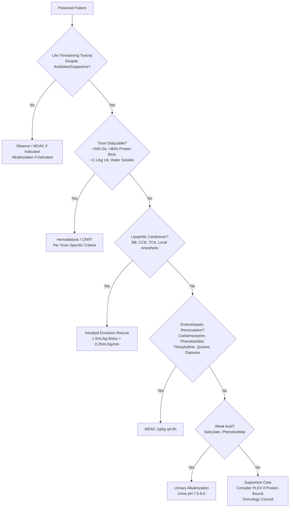

Related: [[General Principles of Poisoning Management]], [[Antidotes Overview]], [[Gastrointestinal Decontamination]], [[Methanol Poisoning]], [[Ethylene Glycol Poisoning]], [[Salicylate (Aspirin) Poisoning]], [[Lithium Poisoning]], [[Theophylline Poisoning]], [[Metformin Poisoning]], [[Valproate Poisoning]]

> [!tip]
> **Dialysis = gold standard** for dialyzable toxins. **MDAC** for specific enterohepatic recirculation toxins. **Urinary alkalinization** for weak acids (salicylate, phenobarbital). **Key FCPS/MRCP**: Dialysis criteria per toxin; drug properties for dialyzability (low protein binding, low Vd, low MW, water soluble); MDAC indications; alkalinization target urine pH 7.5-8.0; ILE for lipophilic cardiotoxic drugs.

## 1. Learning Objectives
- Identify indications for hemodialysis/hemoperfusion in poisoning
- Apply criteria for dialyzability of toxins
- Prescribe urinary alkalinization protocol
- Apply MDAC indications
- Understand ILE (Intralipid) rescue indications

## 2. Methods of Enhanced Elimination

| Method | Principle | Best For |
|---|---|---|
| **Intermittent Hemodialysis (IHD)** | Diffusion across semipermeable membrane | Small, water-soluble, low protein binding, low Vd toxins |
| **Continuous Renal Replacement Therapy (CRRT)** | Convection + diffusion | Hemodynamically unstable; larger molecules |
| **Hemoperfusion (HP)/Hemoadsorption** | Adsorption onto charcoal/resin | Protein-bound, larger molecules (historical: paraquat, phenobarbital) |
| **Plasma Exchange (PLEX/TPE)** | Removal of plasma + replacement | Protein-bound, large Vd (mushroom, TTP-like) |
| **Multiple-Dose Activated Charcoal (MDAC)** | Gut dialysis + enterohepatic interruption | Enterohepatic recirculation toxins |
| **Urinary Alkalinization** | Ion trapping in urine (weak acids) | Salicylate, phenobarbital, chlorpropamide, methotrexate |
| **Intralipid Emulsion (ILE)** | Lipid sink + metabolic support | Lipophilic cardiotoxic drugs (BB, CCB, TCA, LA) |

## 3. Dialyzability Criteria (The "Dialysis Quartet")
A toxin is **well dialyzed** if it has **ALL FOUR**:
1. **Low molecular weight** (< 500 Da)
2. **Low protein binding** (< 80%, ideally < 50%)
3. **Low volume of distribution** (< 1 L/kg, ideally < 0.5 L/kg)
4. **Water soluble** (not highly lipid soluble)

> **Mnemonic**: **"Lo-Pro-Lo-Vol"** (Low MW, Low Protein binding, Low Vd, Water soluble = High dialyzability)

## 4. Hemodialysis Indications by Toxin

### **Methanol / Ethylene Glycol** — **DIALYZE EARLY**
- **pH < 7.30** (persistent despite bicarbonate)
- **Renal failure** (AKI, oliguria/anuria)
- **Visual symptoms** (methanol) — **any degree**
- **Level > 50 mmol/L** (methanol 160 mg/dL; EG 310 mg/dL) — some guidelines > 20 mmol/L with acidosis
- **Refractory electrolyte disturbance**
- **Continue until**: level < 20 mg/dL (6.2 mmol/L) AND pH normal AND asymptomatic

### **Salicylate** — **DIALYZE FOR SEVERE**
- **pH < 7.20** (arterial) despite alkalinization
- **Renal failure**
- **CNS toxicity** (confusion, seizures, coma) — **poorly correlates with level**
- **Serum level**:
  - **Acute**: **> 700 mg/L (70 mg/dL / 5.1 mmol/L)**
  - **Chronic**: **> 400 mg/L (40 mg/dL / 2.9 mmol/L)**
- **Non-cardiogenic pulmonary edema** (refractory)
- **Severe hyperthermia** (> 40°C)

### **Lithium** — **DIALYZE FOR TOXICITY**
- **Acute ingestion**: **level > 4.0 mmol/L**
- **Chronic toxicity**: **level > 2.5 mmol/L** + **neuro symptoms / renal impairment / elderly**
- **Renal failure** (any level)
- **Severe neurotoxicity** (seizures, coma)
- **NOTE**: Lithium redistributes from tissues → **repeat dialysis** often needed (rebound)

### **Theophylline** — **DIALYZE FOR SEVERE**
- **Severe toxicity**: seizures, refractory arrhythmias, hypotension
- **Level > 100 mg/L (550 µmol/L)** acute
- **Chronic**: level > 60 mg/L + toxicity
- **Highly dialyzable** (low protein binding, low Vd)

### **Metformin** — **DIALYZE FOR LACTIC ACIDOSIS**
- **pH < 7.15** (severe lactic acidosis)
- **Lactate > 20 mmol/L**
- **Refractory shock**
- **Renal failure** (metformin accumulates)
- **Highly dialyzable** (low protein binding, low Vd)

### **Valproate** — **DIALYZE FOR SEVERE**
- **Level > 1300 mg/L (9000 µmol/L)** or > 900 mg/L with toxicity
- **Coma (GCS < 8)**
- **Refractory hypotension/shock**
- **Hyperammonemic encephalopathy**
- **CRRT preferred** (high protein binding but low Vd; CVVH better than IHD)

### **Ethanol/Isopropyl Alcohol** — **RARELY DIALYZE**
- Only if **severe metabolic acidosis** unresponsive, **renal failure**, or **hemodynamic collapse**
- Supportive care usually sufficient

### **Carbamazepine** — **MDAC Preferred, Dialysis Refractory**
- **MDAC first-line** (interrupts enterohepatic recirculation)
- **Dialysis/HP** if refractory, coma, refractory seizures, level > 60 mg/L

### **Phenobarbital** — **MDAC + Alkalinization + Dialysis**
- **MDAC** (1g/kg q4-6h)
- **Urinary alkalinization** (pH 7.5-8.0)
- **Dialysis/HP** if refractory, level > 100 mg/L (acute)

### **Digoxin** — **FAB FIRST, DIALYSIS FOR FAB-DIGOXIN COMPLEX**
- **Digoxin-specific Fab** = primary (see [[Digoxin Poisoning]])
- **Dialysis** only if **renal failure** + Fab unavailable OR Fab-digoxin complex accumulation (anuric)

### **Other Dialyzable Toxins**
- **Methotrexate** (high-dose) — dialysis + leucovorin
- **Procainamide** — dialysis (NAC analogue)
- **Chloral hydrate** — dialysis
- **Sotalol** — dialysis (if QT/Torsades refractory)

## 5. Hemodialysis Practical Considerations

### Vascular Access
- **Large-bore catheter** (12-14 Fr) — femoral, IJ, or subclavian
- **Adequate flow** (> 300 mL/min blood, > 500 mL/min dialysate)

### Dialysis Prescription for Poisoning
- **High-efficiency**: high-flux dialyzer, max blood/dialysate flow
- **Duration**: **4-6 hours** per session (longer than renal)
- **Frequency**: **daily** until criteria met
- **Anticoagulation**: citrate preferred (regional) or heparin
- **Rebound**: expect 20-30% level rebound post-dialysis (tissue redistribution) — **repeat if needed**

### CRRT vs IHD
| Feature | IHD | CRRT (CVVHDF) |
|---|---|---|
| **Clearance** | Higher peak | Sustained, lower peak |
| **Hemodynamics** | May cause instability | Better tolerated |
| **Rebound** | Significant | Less |
| **Best for** | Stable, small molecules | Unstable, larger molecules (valproate) |
| **Availability** | Often limited | ICU-based |

## 6. Urinary Alkalinization

### Principle
- **Weak acids** (pKa 3-7) → more ionized in alkaline urine → **ion trapping** → ↑ renal excretion 10-20x
- **Target urine pH**: **7.5-8.0** (check q1-2h with dipstick)

### Indications
1. **Salicylate poisoning** — **primary enhanced elimination**
2. **Phenobarbital** (pKa 7.2) — adjunct to MDAC/dialysis
3. **Chlorpropamide** (sulfonylurea)
4. **Methotrexate** (high-dose) — adjunct to leucovorin
5. **Herbicides** (2,4-D, mecoprop)

### Protocol
- **NaHCO₃ 150 mEq** (3 amps 50 mEq) in **1 L D5W**
- **Infusion rate**: 150-250 mL/hr (adjust to maintain urine pH 7.5-8.0)
- **Add KCl 20-40 mEq/L** — **hypokalemia impairs alkalinization** (K⁺ shifts intracellular)
- **Furosemide 0.5-1 mg/kg** if oliguric (maintain UOP > 2 mL/kg/hr)
- **Monitor**: urine pH q1-2h, serum pH/pCO₂/K⁺/Na⁺/glucose, fluid balance

### Contraindications
- Severe pulmonary edema / heart failure
- Renal failure (anuric)
- Severe metabolic alkalemia (pH > 7.50)

### Urinary Acidification — **AVOID**
- **Not recommended** — risks (worsens acidosis, rhabdo, renal failure) outweigh benefits
- Was used for weak bases (amphetamines, phencyclidine) — **no longer standard**

## 7. Multiple-Dose Activated Charcoal (MDAC)

### Mechanism
1. **Gut dialysis**: charcoal in lumen adsorbs drug diffusing from blood → "dialysis" across gut wall
2. **Enterohepatic interruption**: adsorbs drug excreted in bile → prevents reabsorption

### Indications (Evidence-Based)
- **Carbamazepine**
- **Phenobarbital**
- **Theophylline**
- **Quinine**
- **Dapsone**
- **Digitoxin** (digoxin: Fab preferred)
- **Amanita phalloides** (mushroom) — adjunct

### Dosing
- **Initial**: 1 g/kg (max 50g) with sorbitol (or without)
- **Maintenance**: **1 g/kg (max 25-50g) q4-6h** × 2-6 doses **without sorbitol**
- **Via**: NG tube (if not protecting airway, intubate first)
- **Stop**: when clinical improvement + falling levels

### Contraindications
- Unprotected airway (aspiration risk)
- GI obstruction/perforation
- Ileus
- Charcoal bezoar risk

## 8. Intralipid Emulsion (ILE) — **Rescue Therapy**

### Mechanism
- **"Lipid sink"**: sequesters lipophilic drug in plasma lipid phase
- **Metabolic**: provides fatty acid substrate for myocardial energy

### Indications
- **Refractory cardiovascular collapse** from **lipophilic cardiotoxic** drugs despite:
  - Vasopressors + antidotes (glucagon, HIET, calcium, Fab, NaHCO₃)
- **Agents**: BB (propranolol), CCB (verapamil, amlodipine), TCA, local anesthetics (bupivacaine), others

### Dose (20% Lipid Emulsion)
- **Bolus**: **1.5 mL/kg** (100 mL for 70 kg) over **1 minute**
- **Infusion**: **0.25 mL/kg/min** (1000 mL/hr for 70 kg) for **30-60 minutes**
- **Repeat bolus**: x2 if persistent arrest (max 10 mL/kg first 30 min)
- **Total max**: ~12 mL/kg over 60 min

### Monitoring
- Triglycerides (target < 1000 mg/dL / 11 mmol/L)
- Fat overload syndrome (rare)
- Pancreatitis (rare)
- Interference with lab assays (lipemia)

## 9. Plasmapheresis / Plasma Exchange (PLEX)

### Indications
- **Amanita phalloides** (mushroom) — removes amatoxins (protein-bound)
- **TTP/HUS-like** syndromes from toxins
- **Highly protein-bound, large Vd** toxins where dialysis ineffective

## 10. Decision Algorithm for Enhanced Elimination

## 11. Suggested Visuals / Image Notes
- Dialyzability criteria card
- Dialysis indications table by toxin
- MDAC/alkalinization/ILE dosing cards
- Decision algorithm poster

## 12. Suggested Video References
- Dialysis for poisoning (Toxbase, Nephrology)
- ILE rescue demonstration
- MDAC/alkalinization protocols

## 13. One-Page Revision Summary
- **Dialyzable**: <500 Da, <80% protein bind, <1 L/kg Vd, water soluble (Lo-Pro-Lo-Vol)
- **HD for MeOH/EG**: pH<7.3, renal, visual (MeOH), level>50
- **HD for Salicylate**: pH<7.2, renal, CNS, level>700/400
- **HD for Lithium**: >4 acute, >2.5 chronic+neuro/renal, renal failure
- **HD for Theophylline**: seizures/arrhythmia, level>100
- **HD for Metformin**: pH<7.15, lactate>20
- **HD for Valproate**: coma, level>1300/900, shock (CRRT preferred)
- **MDAC**: carbamazepine, phenobarbital, theophylline, quinine, dapsone
- **Alkalinization**: salicylate, phenobarbital; target urine pH 7.5-8.0, K⁺ replacement
- **ILE rescue**: 1.5mL/kg bolus + 0.25mL/kg/min; BB/CCB/TCA/LA refractory
- **Rebound**: expect 20-30% post-HD — repeat if needed

## 24-Hour Recall Prompts
- List 4 dialyzability criteria
- State dialysis criteria for methanol, salicylate, lithium
- Explain urinary alkalinization target and monitoring
- State ILE dose and indications

## 7-Day / 15-Day / 30-Day Revision Tracker
- [ ] Day 1 completed
- [ ] 24-hour recall completed
- [ ] Day 7 revision completed
- [ ] Day 15 revision completed
- [ ] Day 30 revision completed

## 14. Must Know / Should Know / Nice to Know
### Must Know
- Dialyzability criteria (Lo-Pro-Lo-Vol)
- Dialysis criteria per toxin (MeOH/EG, Salicylate, Lithium, Theophylline, Metformin, Valproate)
- MDAC indications (5 main)
- Urinary alkalinization: target pH 7.5-8.0, K⁺ replacement
- ILE rescue: 1.5mL/kg + 0.25mL/kg/min for lipophilic cardiotoxic refractory
- Rebound phenomenon post-dialysis

### Should Know
- CRRT vs IHD indications
- Plasmapheresis for Amanita
- MDAC dosing (no sorbitol after first)
- Alkalinization contraindications
- Fab-digoxin complex dialysis

### Nice to Know
- Hemoperfusion historical use
- Specific dialyzer characteristics
- Plasmapheresis details
- Toxin-specific clearance values

## 15. Self-Test Scorecard
- Understanding: /10
- Recall: /10
- MCQ Performance: /10
- SBA Performance: /10
- Viva Confidence: /10
- Total: /50

> [!tip]
> Interpretation: <35 = weak topic, 35-44 = acceptable but insecure, 45+ = strong exam-ready topic.

## 16. Exam Answer Modes
### Long Answer Skeleton
- Dialyzability criteria
- Dialysis indications table by toxin
- MDAC/alkalinization/ILE protocols
- Practical HD considerations
- Decision algorithm

### Short Note Skeleton
- Dialyzability box
- Dialysis criteria table
- MDAC/alkaline/ILE dosing cards
- Decision algorithm

### Viva One-Liners
- "Dialyzable: <500 Da, <80% protein, <1 L/kg Vd, water soluble (Lo-Pro-Lo-Vol)"
- "HD MeOH/EG: pH<7.3, renal, visual, level>50"
- "HD Salicylate: pH<7.2, renal, CNS, level>700/400"
- "HD Lithium: >4 acute, >2.5 chronic+neuro/renal, renal failure"
- "HD Theophylline: seizures/arrhythmia, level>100"
- "HD Metformin: pH<7.15, lactate>20"
- "HD Valproate: coma, level>1300, shock (CRRT preferred)"
- "MDAC: Carbamazepine, Phenobarbital, Theophylline, Quinine, Dapsone"
- "Alkalinization: Salicylate, Phenobarbital; urine pH 7.5-8.0, K⁺ replacement"
- "ILE: 1.5mL/kg + 0.25mL/kg/min; BB/CCB/TCA/LA refractory"
- "Rebound: 20-30% post-HD — repeat if needed"

### Ward-Case Discussion Points
- Salicylate pH 7.15 despite alkalinization → HD indicated
- Lithium 3.0 mmol/L chronic with confusion → HD indicated
- Valproate coma level 1500 → CRRT preferred
- Propranolol refractory shock despite glucagon/HIET/NE → ILE
- Carbamazepine level 60 with coma → MDAC + consider HD

### Last-Night-Before-Exam Sheet
- Dialyzable: Lo-Pro-Lo-Vol
- HD MeOH/EG: pH<7.3, Renal, Visual, >50
- HD Sal: pH<7.2, Renal, CNS, >700/400
- HD Li: >4 acute, >2.5 chronic, Renal
- HD Theo: Sz/Arrhythmia, >100
- HD Met: pH<7.15, Lac>20
- HD Val: Coma, >1300 (CRRT)
- MDAC: Carba, Phenob, Theo, Quinine, Dapsone
- Alkalinize: Sal, Phenob; pH 7.5-8.0, K+
- ILE: 1.5 + 0.25; BB/CCB/TCA/LA
- Rebound: 20-30%

## 17. Summary
Enhanced elimination reserved for life-threatening toxicity unresponsive to antidotes/supportive care. **Hemodialysis** for dialyzable toxins (Lo-Pro-Lo-Vol: <500 Da, <80% protein binding, <1 L/kg Vd, water soluble). Specific criteria per toxin: MeOH/EG (pH<7.3, renal, visual, level>50), salicylate (pH<7.2, renal, CNS, level>700/400), lithium (>4 acute, >2.5 chronic+neuro), theophylline, metformin, valproate (CRRT preferred). **MDAC** for enterohepatic recirculation toxins (carbamazepine, phenobarbital, theophylline, quinine, dapsone). **Urinary alkalinization** (pH 7.5-8.0) for weak acids (salicylate, phenobarbital). **ILE rescue** (1.5mL/kg + 0.25mL/kg/min) for refractory lipophilic cardiotoxic collapse. Expect 20-30% rebound post-HD.

## 18. MCQs (10)
1. Question 1
   A. Option A
   B. Option B
   C. Option C
   D. Option D
   **Answer: A**
   *Explanation: Explanation 1*

2. Question 2
   A. Option A
   B. Option B
   C. Option C
   D. Option D
   **Answer: B**
   *Explanation: Explanation 2*

3. Question 3
   A. Option A
   B. Option B
   C. Option C
   D. Option D
   **Answer: C**
   *Explanation: Explanation 3*

4. Question 4
   A. Option A
   B. Option B
   C. Option C
   D. Option D
   **Answer: D**
   *Explanation: Explanation 4*

5. Question 5
   A. Option A
   B. Option B
   C. Option C
   D. Option D
   **Answer: A**
   *Explanation: Explanation 5*

6. Question 6
   A. Option A
   B. Option B
   C. Option C
   D. Option D
   **Answer: B**
   *Explanation: Explanation 6*

7. Question 7
   A. Option A
   B. Option B
   C. Option C
   D. Option D
   **Answer: C**
   *Explanation: Explanation 7*

8. Question 8
   A. Option A
   B. Option B
   C. Option C
   D. Option D
   **Answer: D**
   *Explanation: Explanation 8*

9. Question 9
   A. Option A
   B. Option B
   C. Option C
   D. Option D
   **Answer: A**
   *Explanation: Explanation 9*

10. Question 10
   A. Option A
   B. Option B
   C. Option C
   D. Option D
   **Answer: B**
   *Explanation: Explanation 10*

## 19. SBA Questions (10)
1. Scenario 1
   A. Option A
   B. Option B
   C. Option C
   D. Option D
   **Answer: A**
   *Explanation: Explanation 1*

2. Scenario 2
   A. Option A
   B. Option B
   C. Option C
   D. Option D
   **Answer: B**
   *Explanation: Explanation 2*

3. Scenario 3
   A. Option A
   B. Option B
   C. Option C
   D. Option D
   **Answer: C**
   *Explanation: Explanation 3*

4. Scenario 4
   A. Option A
   B. Option B
   C. Option C
   D. Option D
   **Answer: D**
   *Explanation: Explanation 4*

5. Scenario 5
   A. Option A
   B. Option B
   C. Option C
   D. Option D
   **Answer: A**
   *Explanation: Explanation 5*

6. Scenario 6
   A. Option A
   B. Option B
   C. Option C
   D. Option D
   **Answer: B**
   *Explanation: Explanation 6*

7. Scenario 7
   A. Option A
   B. Option B
   C. Option C
   D. Option D
   **Answer: C**
   *Explanation: Explanation 7*

8. Scenario 8
   A. Option A
   B. Option B
   C. Option C
   D. Option D
   **Answer: D**
   *Explanation: Explanation 8*

9. Scenario 9
   A. Option A
   B. Option B
   C. Option C
   D. Option D
   **Answer: A**
   *Explanation: Explanation 9*

10. Scenario 10
   A. Option A
   B. Option B
   C. Option C
   D. Option D
   **Answer: B**
   *Explanation: Explanation 10*

## 20. Flashcards
- Q: Flashcard 1 question
  A: Flashcard 1 answer
- Q: Flashcard 2 question
  A: Flashcard 2 answer
- Q: Flashcard 3 question
  A: Flashcard 3 answer
- Q: Flashcard 4 question
  A: Flashcard 4 answer
- Q: Flashcard 5 question
  A: Flashcard 5 answer
- Q: Flashcard 6 question
  A: Flashcard 6 answer
- Q: Flashcard 7 question
  A: Flashcard 7 answer
- Q: Flashcard 8 question
  A: Flashcard 8 answer
- Q: Flashcard 9 question
  A: Flashcard 9 answer
- Q: Flashcard 10 question
  A: Flashcard 10 answer
- Q: Flashcard 11 question
  A: Flashcard 11 answer
- Q: Flashcard 12 question
  A: Flashcard 12 answer
- Q: Flashcard 13 question
  A: Flashcard 13 answer
- Q: Flashcard 14 question
  A: Flashcard 14 answer
- Q: Flashcard 15 question
  A: Flashcard 15 answer

## 21. Answer Key with Explanations
### MCQs
1. **A** - Explanation 1
2. **B** - Explanation 2
3. **C** - Explanation 3
4. **D** - Explanation 4
5. **A** - Explanation 5
6. **B** - Explanation 6
7. **C** - Explanation 7
8. **D** - Explanation 8
9. **A** - Explanation 9
10. **B** - Explanation 10

### SBAs
1. **A** - Explanation 1
2. **B** - Explanation 2
3. **C** - Explanation 3
4. **D** - Explanation 4
5. **A** - Explanation 5
6. **B** - Explanation 6
7. **C** - Explanation 7
8. **D** - Explanation 8
9. **A** - Explanation 9
10. **B** - Explanation 10