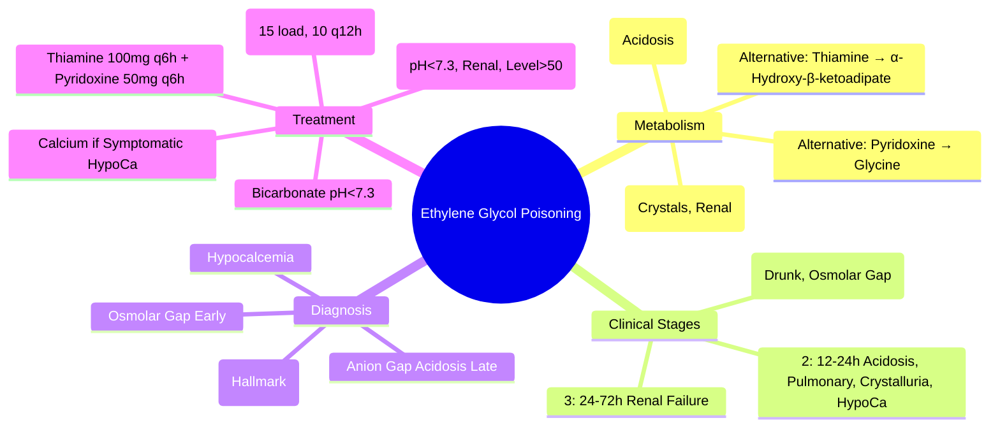
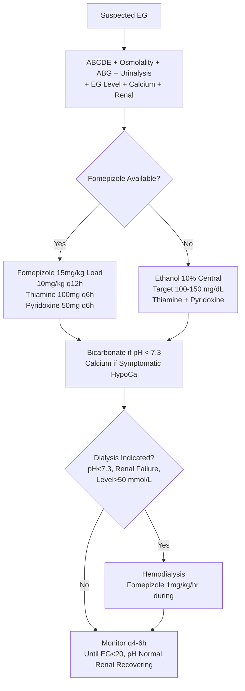

Related: [[General Principles of Poisoning Management]], [[Methanol Poisoning]], [[Isopropyl Alcohol Poisoning]], [[Antidotes Overview]], [[Enhanced Elimination (Dialysis, Hemoperfusion)]]

> [!tip]
> **Ethylene glycol → glycolic acid → oxalic acid**. **Glycolic acid = metabolic acidosis**; **oxalic acid + calcium = calcium oxalate crystals → renal failure**. **Fomepizole** (or ethanol) blocks ADH. **Dialysis** for pH < 7.3, renal failure, level > 50 mmol/L. Key FCPS/MRCP: calcium oxalate crystalluria (envelope/dumbbell); fomepizole same dosing as methanol; thiamine/pyridoxine enhance alternative metabolism; differentiate from methanol (visual) and IPA (ketosis no acidosis).

## 1. Learning Objectives
- Recognize ethylene glycol poisoning (metabolic acidosis, renal failure, crystalluria)
- Apply fomepizole/ethanol protocol
- Identify dialysis indications
- Administer thiamine/pyridoxine adjunct
- Differentiate from methanol and isopropyl alcohol

## 2. Definition
Ethylene glycol poisoning = toxicity from ethylene glycol (antifreeze) metabolized to **glycolic acid** (metabolic acidosis) and **oxalic acid** (calcium oxalate crystallization → renal failure).

## 3. Core Physiology
- **Metabolism**: Ethylene glycol → (ADH) → **Glycoaldehyde** → (ALDH) → **Glycolic acid** → (GO/GDH) → **Glyoxylic acid** → (LDH/GRHPR) → **Oxalic acid**
- **Glycolic acid**: inhibits mitochondrial respiration → **high anion gap metabolic acidosis** (main acid)
- **Oxalic acid**: chelates calcium → **hypocalcemia** + **calcium oxalate crystals** (monohydrate = needle/dumbbell; dihydrate = envelope) → **renal tubular obstruction/necrosis** → AKI
- **Alternative pathways** (thiamine/pyridoxine dependent): glyoxylic acid → glycine (pyridoxine) or α-hydroxy-β-ketoadipate (thiamine) — non-toxic
- **ADH inhibition**: fomepizole/ethanol blocks first step

## 4. Clinical Features (Three Stages)

### Stage 1: Neurological (0-12h) — "Drunkenness"
- Inebriation, ataxia, slurred speech, nystagmus
- Nausea, vomiting
- **No metabolic acidosis yet** (parent compound)
- **Osmolar gap elevated**

### Stage 2: Cardiopulmonary (12-24h)
- **Metabolic acidosis** (glycolic acid accumulation)
- Tachycardia, hypertension/hypotension, pulmonary edema
- **Calcium oxalate crystalluria begins**
- Hypocalcemia (chelated by oxalate) → QT prolongation, tetany

### Stage 3: Renal (24-72h)
- **Acute kidney injury** (oliguric/anuric) — calcium oxalate tubular deposition
- Flank pain, hematuria
- Persistent metabolic acidosis
- Multi-organ failure if untreated

## 5. Differential Diagnosis
- **Methanol**: metabolic acidosis + **visual loss** (no renal failure early, no crystals)
- **Isopropyl alcohol**: **ketosis WITHOUT acidosis**, hemorrhagic gastritis, CNS depression
- **Diabetic ketoacidosis**: hyperglycemia, ketones
- **Sepsis/lactic acidosis**: no osmolar gap, no crystals

## 6. Investigations

### Mandatory
1. **Ethylene glycol level** (if available) > 20 mg/dL (3.2 mmol/L) toxic
2. **Osmolality** → **osmolar gap** > 10 (early)
3. **ABG/VBG** — anion gap metabolic acidosis (late)
4. **Urinalysis** — **calcium oxalate crystals** (envelope/dumbbell/needle) — **HALLMARK**
5. **Electrolytes** — **hypocalcemia** (chelates), K⁺, Na⁺, glucose
6. **Renal function** — creatinine, urea (AKI marker)
7. **Calcium** (ionized) — low
8. **Paracetamol level** (always)
9. **ECG** — QT prolongation (hypocalcemia)

### Calculated
- Osmolar gap = measured - calculated
- Anion gap = Na - (Cl + HCO₃)

## 7. Management

### 1. Resuscitation (ABCDE)
- Airway/breathing/circulation standard
- **Correct hypocalcemia** if symptomatic (tetany, seizures, QT prolongation) — **IV calcium gluconate 10% 10-20 mL**

### 2. Antidote: Fomepizole — **PREFERRED** (Same as Methanol)
- **Loading**: **15 mg/kg IV** over 30 min
- **Maintenance**: **10 mg/kg IV q12h** × 4 doses, then **15 mg/kg q12h** if dialysis planned
- **During dialysis**: **1 mg/kg/hr** infusion OR redose post-dialysis
- **Until**: EG < 20 mg/dL (3.2 mmol/L) AND asymptomatic AND normal pH

### 3. Alternative: Ethanol (if Fomepizole Unavailable)
- Target blood ethanol **100-150 mg/dL** (22-33 mmol/L)
- 10% ethanol central line, monitor q1-2h

### 4. Adjuncts: Thiamine + Pyridoxine (Enhance Alternative Metabolism)
- **Thiamine 100 mg IV q6h** (glyoxylic acid → α-hydroxy-β-ketoadipate)
- **Pyridoxine 50 mg IV q6h** (glyoxylic acid → glycine)
- **Both** enhance non-toxic elimination pathways

### 5. Hemodialysis — **Indications (Any One)**
- **pH < 7.30** (persistent despite bicarbonate)
- **Renal failure** (AKI, oliguria/anuria, rising creatinine)
- **Ethylene glycol level > 50 mmol/L (310 mg/dL)** — some guidelines > 20 mmol/L with acidosis
- **Refractory electrolyte disturbances**
- Continue until EG < 20 mg/dL AND pH normal AND renal recovering

### 6. Supportive
- **Bicarbonate infusion** for pH < 7.3
- **Correct hypocalcemia** (symptomatic)
- **Thiamine 100 mg IV** (Wernicke prevention)
- **Fluids** for renal perfusion (avoid overload if oliguric)

## 8. Complications
- Permanent renal failure (dialysis-dependent)
- Cranial neuropathies (CN VII, VIII, IX, X) — late
- Peripheral neuropathy
- Metabolic acidosis → multi-organ failure
- Death

## 9. Prognosis
- Good if treated **before** significant oxalate crystallization (early fomepizole)
- Renal recovery possible if dialysis initiated early
- Mortality < 10% with early treatment

## 10. FCPS/MRCP High-Yield Points
1. **Ethylene glycol → glycolic acid (acidosis) + oxalic acid (crystals/renal)**
2. **Calcium oxalate crystals in urine** = hallmark (envelope/dumbbell/needle)
3. **Hypocalcemia** (oxalate chelates calcium) → QT prolongation, tetany
4. **Fomepizole**: 15 mg/kg load → 10 mg/kg q12h (same as methanol)
5. **Thiamine 100 mg q6h + Pyridoxine 50 mg q6h** (enhance alternative pathways)
6. **Dialysis**: pH < 7.3, **renal failure**, level > 50 mmol/L
7. **Three stages**: CNS (0-12h) → Cardiopulmonary/acidosis (12-24h) → Renal (24-72h)
8. **Osmolar gap early** → anion gap acidosis + crystalluria late
9. **Ethanol alternative** same as methanol
10. **Differentiate**: Methanol = visual; EG = renal/crystals; IPA = ketosis no acidosis

## 11. Common Viva Questions
1. Ethylene glycol metabolic pathway and toxic metabolites
2. Urinary crystal findings
3. Fomepizole dosing
4. Role of thiamine/pyridoxine
5. Dialysis indications
6. Three clinical stages
7. Hypocalcemia mechanism and management
8. Differentiate from methanol and isopropyl alcohol

## 12. Common Confusions / Exam Traps
- **Oxalic acid causes crystals**, glycolic acid causes acidosis
- **Hypocalcemia** = treat if symptomatic (tetany, seizures)
- **Thiamine/pyridoxine** = adjuncts, not primary antidotes
- **Fomepizole dosing same as methanol** (15 load, 10 q12h)
- **Dialysis for renal failure** even if pH OK
- **Crystals may be absent early** (before metabolism) or late (anuric)
- **Isopropyl alcohol = ketosis NO acidosis** vs EG = acidosis

## 13. Mnemonics
- **EG PATHWAY**: **E**G → **G**lycolic acid (**A**cidosis) + **O**xalic acid (**O**xalate crystals, **R**enal)
- **CRYSTALS**: **C**alcium **O**xalate = **E**nvelope, **D**umbbell, **N**eedle
- **THREE STAGES**: **1** CNS **drunk**, **2** **A**cidosis + **P**ulmonary, **3** **R**enal **F**ailure
- **FOMEPIZOLE**: **1**5 load, **1**0 q12h (same as methanol)
- **ADJUNCTS**: **T**hiamine **1**00 q6h, **P**yridoxine **5**0 q6h
- **DIALYSIS**: **pH < 7.3**, **R**enal failure, **L**evel > 50

## 14. Mind Map

## 15. Flowchart

## 16. Suggested Visuals / Image Notes
- EG metabolic pathway
- Calcium oxalate crystal types (envelope, dumbbell, needle)
- Three stages timeline
- Fomepizole/thiamine/pyridoxine dosing card

## 17. Suggested Video References
- Ethylene glycol poisoning (Toxbase, EM:RAP)
- Crystal identification microscopy

## 18. One-Page Revision Summary
- **Toxic metabolites**: glycolic acid (acidosis) + oxalic acid (crystals → renal failure)
- **Calcium oxalate crystals** = hallmark (envelope/dumbbell/needle)
- **Hypocalcemia** (oxalate chelates Ca²⁺)
- **Fomepizole**: 15 mg/kg load → 10 mg/kg q12h (same as methanol)
- **Thiamine 100 mg q6h + Pyridoxine 50 mg q6h** (alternative pathways)
- **Dialysis**: pH < 7.3, **renal failure**, level > 50 mmol/L
- **Three stages**: CNS drunk → acidosis/pulmonary → renal failure
- **Osmolar gap early → anion gap + crystals late**
- **Differentiate**: Methanol=vision, EG=renal/crystals, IPA=ketosis no acidosis

## 24-Hour Recall Prompts
- State two toxic metabolites and their effects
- Recite fomepizole dosing
- List thiamine/pyridoxine doses
- Name 3 dialysis indications
- Describe urinary crystal types

## 7-Day / 15-Day / 30-Day Revision Tracker
- [ ] Day 1 completed
- [ ] 24-hour recall completed
- [ ] Day 7 revision completed
- [ ] Day 15 revision completed
- [ ] Day 30 revision completed

## 19. Must Know / Should Know / Nice to Know
### Must Know
- Glycolic acid = acidosis; oxalic acid = crystals + renal failure
- Calcium oxalate crystals (envelope/dumbbell/needle)
- Fomepizole: 15 load, 10 q12h (dialysis: 1 mg/kg/hr)
- Thiamine 100mg q6h + Pyridoxine 50mg q6h
- Dialysis: pH<7.3, renal failure, level>50
- Three stages: CNS → Cardiopulmonary → Renal
- Hypocalcemia mechanism

### Should Know
- Crystal absence doesn't rule out (early/late)
- Ethanol alternative protocol
- Cranial neuropathies late sequelae
- Ionized calcium monitoring

### Nice to Know
- Glyoxylic acid intermediate
- GRHPR mutation (primary hyperoxaluria)
- Fomepizole pharmacokinetics details
- Specific crystal morphology timing

## 20. Self-Test Scorecard
- Understanding: /10
- Recall: /10
- MCQ Performance: /10
- SBA Performance: /10
- Viva Confidence: /10
- Total: /50

> [!tip]
> Interpretation: <35 = weak topic, 35-44 = acceptable but insecure, 45+ = strong exam-ready topic.

## 21. Exam Answer Modes
### Long Answer Skeleton
- Metabolic pathway (glycolic + oxalic acid)
- Three clinical stages
- Diagnosis (osmolar gap, anion gap, crystals, hypocalcemia)
- Treatment: fomepizole, thiamine/pyridoxine, bicarbonate, calcium, dialysis
- Complications/prognosis

### Short Note Skeleton
- Metabolic pathway diagram
- Crystal types
- Fomepizole + adjuncts dosing box
- Dialysis criteria
- Three stages table

### Viva One-Liners
- "EG → glycolic acid (acidosis) + oxalic acid (crystals, renal failure)"
- "Calcium oxalate crystals = envelope, dumbbell, needle (hallmark)"
- "Fomepizole: 15 load, 10 q12h (same as methanol)"
- "Thiamine 100mg q6h + Pyridoxine 50mg q6h (alternative pathways)"
- "Dialysis: pH<7.3, renal failure, level>50 mmol/L"
- "Three stages: 1) Drunk, 2) Acidosis/pulmonary, 3) Renal failure"
- "Hypocalcemia: oxalate chelates calcium → treat if symptomatic"
- "Methanol=vision, EG=renal/crystals, IPA=ketosis no acidosis"

### Ward-Case Discussion Points
- "Drunk" patient with anion gap acidosis + crystalluria → EG until proven otherwise
- Hypocalcemia with tetany in "alcoholic" → check for oxalate crystals
- Fomepizole started, patient oliguric → dialysis indicated
- Anuric patient with EG → dialysis for toxin removal (fomepizole alone insufficient)

### Last-Night-Before-Exam Sheet
- Toxic: Glycolic (acidosis) + Oxalic (crystals/renal)
- Crystals: Envelope, Dumbbell, Needle
- Fomepizole: 15 load, 10 q12h
- Thiamine 100 q6h + Pyridoxine 50 q6h
- Dialysis: pH<7.3, Renal, Level>50
- Stages: 1 Drunk, 2 Acidosis, 3 Renal
- HypoCa: Oxalate chelates
- Methanol=Vision, EG=Renal, IPA=Ketosis

## 22. Summary
Ethylene glycol poisoning = glycolic acid (metabolic acidosis) + oxalic acid (calcium oxalate crystals → renal failure + hypocalcemia). Calcium oxalate crystalluria = hallmark. Fomepizole 15 mg/kg load → 10 mg/kg q12h. Thiamine 100 mg q6h + pyridoxine 50 mg q6h enhance alternative metabolism. Dialysis for pH<7.3, renal failure, level>50 mmol/L. Three stages: CNS (0-12h) → cardiopulmonary/acidosis (12-24h) → renal (24-72h). Differentiate: methanol=visual, EG=renal/crystals, IPA=ketosis no acidosis.

## 23. MCQs (10)
1. Ethylene glycol toxic metabolites?
   A. Formic acid
   B. Glycolic acid and oxalic acid
   C. Formaldehyde
   D. Acetone
   **Answer: B**
   *Explanation: EG → ADH → glycolaldehyde → glycolic acid (acidosis) → oxalic acid (calcium oxalate crystals → renal failure, hypocalcemia).*

2. Ethylene glycol classic features?
   A. Visual disturbances
   B. Renal failure, calcium oxalate crystals, hypocalcemia
   C. Pure respiratory alkalosis
   D. Only CNS depression
   **Answer: B**
   *Explanation: EG: high anion gap metabolic acidosis (glycolic acid), renal failure (calcium oxalate crystal deposition), hypocalcemia (oxalate binds Ca²⁺). Envelope-shaped crystals in urine. NO visual symptoms.*

3. EG urine crystals?
   A. Needle-shaped
   B. Envelope-shaped (calcium oxalate monohydrate) and dumbbell-shaped (dihydrate)
   C. Hexagonal
   D. No crystals
   **Answer: B**
   *Explanation: Calcium oxalate monohydrate = envelope/dumbbell shaped. Dihydrate = bipyramidal. Crystalluria = hallmark. Flouresce under Wood's lamp (some EG formulations).*

4. EG hypocalcemia - mechanism?
   A. Renal Ca loss
   B. Oxalate binds ionized calcium → precipitation
   C. PTH suppression
   D. Vitamin D deficiency
   **Answer: B**
   *Explanation: Oxalic acid binds ionized calcium → calcium oxalate precipitation → hypocalcemia. Can cause tetany, QT prolongation. Calcium replacement if symptomatic.*

5. Fomepizole for EG - same as methanol?
   A. No, different dose
   B. Yes - 15 mg/kg load, 10 mg/kg q12h
   C. Only ethanol works for EG
   D. Fomepizole contraindicated
   **Answer: B**
   *Explanation: Fomepizole inhibits ADH for BOTH methanol and EG. Same dosing: 15 mg/kg load, 10 mg/kg q12h. Dialysis criteria similar.*

6. EG dialysis criteria?
   A. pH < 7.3, renal failure, level > 50 mmol/L
   B. Only if anuric
   C. Only if level > 100
   D. Never indicated
   **Answer: A**
   *Explanation: Dialysis for EG: pH < 7.3, renal failure (oliguric/anuric), level > 50 mmol/L (620 mg/dL), refractory acidosis. Also if deteriorating despite fomepizole.*

7. Thiamine and pyridoxine in EG - role?
   A. Antidotes
   B. Cofactors for alternative glycolic acid metabolism (less toxic pathways)
   C. Treat acidosis
   D. Prevent crystallization
   **Answer: B**
   *Explanation: Thiamine 100mg IV q6h + pyridoxine 50mg IV q6h: cofactors for alternative glycolate metabolism → shifts away from oxalate formation. Adjunct.*

8. EG vs methanol - key distinguishing feature?
   A. EG has visual symptoms
   B. Methanol has renal failure
   C. EG = renal failure + crystals, Methanol = visual
   D. Same presentation
   **Answer: C**
   *Explanation: EG: renal failure, calcium oxalate crystals, hypocalcemia. Methanol: visual disturbances. Both: anion gap acidosis, osmolal gap early.*

9. EG propylene glycol (in IV meds) - toxicity?
   A. Not toxic
   B. High doses → lactic acidosis (not glycolic/oxalic), osmolal gap
   C. Same as EG
   D. Causes renal failure only
   **Answer: B**
   *Explanation: Propylene glycol (in IV lorazepam, phenytoin, etc.): metabolized to lactate → lactic acidosis + osmolal gap. Not glycolic/oxalic acid. High infusion rates in ICU.*

10. EG - Wood's lamp urine fluorescence?
   A. All EG
   B. Only if EG contains fluorescein (industrial antifreeze)
   C. Never
   D. Only with methanol
   **Answer: B**
   *Explanation: Some commercial antifreeze contains fluorescein → urine fluoresces under Wood's lamp. Not universal. Diagnostic clue if present.*

## 24. SBA Questions (10)
1. Patient drinks antifreeze (EG). Presents 8h later with confusion, metabolic acidosis (pH 7.18), oliguric. Urine shows envelope-shaped crystals. Management?
   A. Observe
   B. Fomepizole 15mg/kg load + hemodialysis
   C. Ethanol only
   D. Bicarbonate only
   **Answer: B**
   *Explanation: EG: metabolic acidosis + renal failure + crystals = dialysis indicated. Fomepizole load immediately. Thiamine 100mg + pyridoxine 50mg q6h IV adjunct. Correct hypocalcemia if symptomatic.*

2. EG level 60 mmol/L, pH 7.30, no renal failure. Dialysis?
   A. No - pH > 7.3
   B. Yes - level > 50 mmol/L
   C. Only if pH drops
   D. Only if renal failure
   **Answer: B**
   *Explanation: Dialysis criteria: pH < 7.3 OR renal failure OR level > 50 mmol/L. This patient: level 60 = dialysis indicated.*

3. Patient on high-dose IV lorazepam (propylene glycol) in ICU. Develops high anion gap metabolic acidosis, osmolal gap 30. No renal failure, no crystals. Diagnosis?
   A. EG poisoning
   B. Propylene glycol toxicity (lactic acidosis)
   C. Methanol
   D. Lactic acidosis from sepsis
   **Answer: B**
   *Explanation: Propylene glycol (in IV lorazepam, phenytoin, diazepam): metabolized to lactate → lactic acidosis + osmolal gap. No glycolic/oxalic acid, no crystals. Reduce/stop infusion.*

4. EG - hypocalcemia with tetany. Calcium replacement?
   A. Avoid (worsens precipitation)
   B. Give if symptomatic (tetany, QT prolongation) - ionized Ca²⁺ target > 1.0
   C. Only after dialysis
   D. Only oral
   **Answer: B**
   *Explanation: Symptomatic hypocalcemia (tetany, QT prolongation): give IV calcium gluconate 1-2g. Oxalate binds Ca²⁺ but symptomatic hypocalcemia is dangerous. Monitor ionized Ca²⁺.*

5. EG - thiamine/pyridoxine dosing?
   A. Thiamine 100mg IV q6h + pyridoxine 50mg IV q6h
   B. Thiamine 500mg once
   C. Pyridoxine only
   D. Not needed
   **Answer: A**
   *Explanation: Thiamine 100mg IV q6h + pyridoxine 50mg IV q6h: cofactors for alternative glycolate metabolism (glycolate → glycine → less toxic). Adjunct to fomepizole/dialysis.*

6. EG + methanol co-ingestion. Fomepizole?
   A. Only covers methanol
   B. Covers both (ADH inhibitor)
   C. Need separate antidotes
   D. Contraindicated
   **Answer: B**
   *Explanation: Fomepizole inhibits ADH for BOTH methanol and EG. Same dosing. Dialysis criteria apply to each (pH<7.3, renal failure, level>50, visual for methanol).*

7. EG - urine fluoresces under Wood's lamp. Significance?
   A. Confirms EG
   B. Suggests EG with fluorescein additive (some antifreeze)
   C. Confirms methanol
   D. Artifact
   **Answer: B**
   *Explanation: Some antifreeze contains fluorescein → urine fluorescence. Supports EG diagnosis but not universal (not all EG has it). Absence doesn't exclude EG.*

8. EG - osmolal gap vs anion gap timeline?
   A. Both high throughout
   B. Early: high osmolal gap, normal anion gap. Late: osmolal gap normal, high anion gap
   C. Both normal early
   D. Anion gap high early only
   **Answer: B**
   *Explanation: Early: parent alcohol (EG) → high osmolal gap, normal anion gap. As metabolized → glycolic/oxalic acid → anion gap rises, osmolal gap normalizes. Gap = measured - (2×Na + glu/18 + BUN/2.8 + EtOH/4.6).*

9. EG - fomepizole on dialysis?
   A. Stop
   B. Increase to 15 mg/kg q12h (dialyzed out)
   C. Same dose
   D. Double dose
   **Answer: B**
   *Explanation: Fomepizole dialyzed out → increase to 15 mg/kg q12h during/after dialysis. Continue until EG level < 20 mmol/L and pH normal.*

## 25. Flashcards
- Q: EG toxic metabolites?
  A: Glycolic acid (metabolic acidosis) + oxalic acid (calcium oxalate crystals → renal failure, hypocalcemia).
- Q: EG classic triad?
  A: High anion gap metabolic acidosis + renal failure (calcium oxalate crystals) + hypocalcemia. NO visual symptoms.
- Q: EG urine crystals?
  A: Envelope/dumbbell (calcium oxalate monohydrate), bipyramidal (dihydrate). Fluoresce under Wood's lamp if antifreeze has fluorescein.
- Q: EG hypocalcemia mechanism?
  A: Oxalate binds ionized Ca²⁺ → calcium oxalate precipitation → hypocalcemia. Symptomatic = IV calcium.
- Q: Fomepizole for EG?
  A: Same as methanol: 15mg/kg load, 10mg/kg q12h. Increase to 15mg/kg q12h on dialysis. Blocks ADH for both.
- Q: EG dialysis criteria?
  A: pH < 7.3 OR renal failure OR level > 50 mmol/L (620 mg/dL) OR refractory acidosis.
- Q: Thiamine/pyridoxine in EG?
  A: Thiamine 100mg IV q6h + pyridoxine 50mg IV q6h: cofactors for alternative glycolate metabolism (less oxalate).
- Q: EG vs methanol?
  A: EG: renal failure, crystals, hypocalcemia. Methanol: visual. Both: anion gap acidosis, osmolal gap early.
- Q: Propylene glycol toxicity?
  A: IV lorazepam/phenytoin vehicle → lactate → lactic acidosis + osmolal gap. No glycolic/oxalic, no crystals. Reduce infusion.
- Q: EG Wood's lamp?
  A: Fluorescence only if antifreeze contains fluorescein (some brands). Supports diagnosis but absence doesn't exclude.
- Q: EG osmolal/anion gap timeline?
  A: Early: high osmolal gap (parent EG), normal anion gap. Late: osmolal gap normal, high anion gap (acids).
- Q: EG fomepizole on dialysis?
  A: Dialyzed out → increase to 15mg/kg q12h. Continue until EG < 20 mmol/L and pH normal.
- Q: EG calcium replacement?
  A: Only if symptomatic (tetany, QT prolongation). Oxalate binds Ca²⁺ but symptomatic hypocalcemia dangerous.
- Q: EG disposition?
  A: Observe until pH normal, renal function stable, EG level < 20 mmol/L. Psych if DSH. Monitor for delayed renal failure.
- Q: EG crystalluria timing?
  A: May not appear early (need time for metabolism to oxalate). Absence doesn't exclude EG.
## 26. Answer Key with Explanations
### MCQs
1. **B** - EG → ADH → glycolaldehyde → glycolic acid (acidosis) → oxalic acid (calcium oxalate crystals → renal failure, hypocalcemia).
2. **B** - EG: high anion gap metabolic acidosis (glycolic acid), renal failure (calcium oxalate crystal deposition), hypocalcemia (oxalate binds Ca²⁺). Envelope-shaped crystals in urine. NO visual symptoms.
3. **B** - Calcium oxalate monohydrate = envelope/dumbbell shaped. Dihydrate = bipyramidal. Crystalluria = hallmark. Flouresce under Wood's lamp (some EG formulations).
4. **B** - Oxalic acid binds ionized calcium → calcium oxalate precipitation → hypocalcemia. Can cause tetany, QT prolongation. Calcium replacement if symptomatic.
5. **B** - Fomepizole inhibits ADH for BOTH methanol and EG. Same dosing: 15 mg/kg load, 10 mg/kg q12h. Dialysis criteria similar.
6. **A** - Dialysis for EG: pH < 7.3, renal failure (oliguric/anuric), level > 50 mmol/L (620 mg/dL), refractory acidosis. Also if deteriorating despite fomepizole.
7. **B** - Thiamine 100mg IV q6h + pyridoxine 50mg IV q6h: cofactors for alternative glycolate metabolism → shifts away from oxalate formation. Adjunct.
8. **C** - EG: renal failure, calcium oxalate crystals, hypocalcemia. Methanol: visual disturbances. Both: anion gap acidosis, osmolal gap early.
9. **B** - Propylene glycol (in IV lorazepam, phenytoin, etc.): metabolized to lactate → lactic acidosis + osmolal gap. Not glycolic/oxalic acid. High infusion rates in ICU.
10. **B** - Some commercial antifreeze contains fluorescein → urine fluoresces under Wood's lamp. Not universal. Diagnostic clue if present.

### SBAs
1. **B** - EG: metabolic acidosis + renal failure + crystals = dialysis indicated. Fomepizole load immediately. Thiamine 100mg + pyridoxine 50mg q6h IV adjunct. Correct hypocalcemia if symptomatic.
2. **B** - Dialysis criteria: pH < 7.3 OR renal failure OR level > 50 mmol/L. This patient: level 60 = dialysis indicated.
3. **B** - Propylene glycol (in IV lorazepam, phenytoin, diazepam): metabolized to lactate → lactic acidosis + osmolal gap. No glycolic/oxalic acid, no crystals. Reduce/stop infusion.
4. **B** - Symptomatic hypocalcemia (tetany, QT prolongation): give IV calcium gluconate 1-2g. Oxalate binds Ca²⁺ but symptomatic hypocalcemia is dangerous. Monitor ionized Ca²⁺.
5. **A** - Thiamine 100mg IV q6h + pyridoxine 50mg IV q6h: cofactors for alternative glycolate metabolism (glycolate → glycine → less toxic). Adjunct to fomepizole/dialysis.
6. **B** - Fomepizole inhibits ADH for BOTH methanol and EG. Same dosing. Dialysis criteria apply to each (pH<7.3, renal failure, level>50, visual for methanol).
7. **B** - Some antifreeze contains fluorescein → urine fluorescence. Supports EG diagnosis but not universal (not all EG has it). Absence doesn't exclude EG.
8. **B** - Early: parent alcohol (EG) → high osmolal gap, normal anion gap. As metabolized → glycolic/oxalic acid → anion gap rises, osmolal gap normalizes. Gap = measured - (2×Na + glu/18 + BUN/2.8 + EtOH/4.6).
9. **B** - Fomepizole dialyzed out → increase to 15 mg/kg q12h during/after dialysis. Continue until EG level < 20 mmol/L and pH normal.