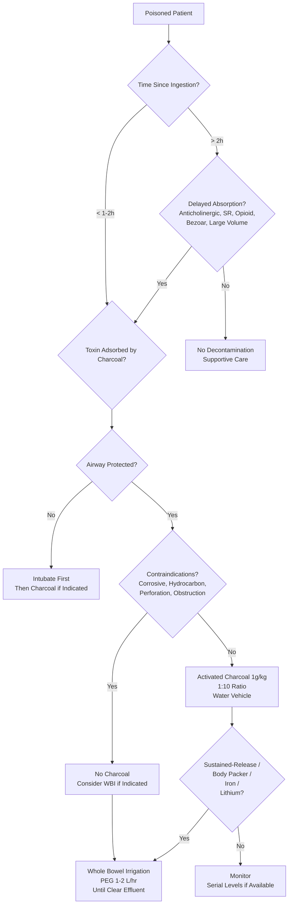

Related: [[General Principles of Poisoning Management]], [[Antidotes Overview]], [[Enhanced Elimination (Dialysis, Hemoperfusion)]], [[Paracetamol (Acetaminophen) Poisoning]], [[Iron Poisoning]]

> [!tip]
> **Activated charcoal (AC) = mainstay** but **NOT for all**. **WBI for sustained-release/body packers/iron/lithium**. **Gastric lavage RARELY**. **No emesis**. Key FCPS/MRCP: AC 1g/kg (max 50g) ideally <1h; 1:10 ratio to dose; contraindications (unprotected airway, corrosives, hydrocarbons, GI perforation); WBI indications; no routine decontamination for all ODs.

## 1. Learning Objectives
- Select appropriate decontamination method for specific poison
- Apply activated charcoal dosing and contraindications
- Identify indications for whole bowel irrigation (WBI)
- Understand why gastric lavage and emesis are NOT routine

## 2. Definition
Gastrointestinal decontamination = interventions to reduce absorption of ingested toxins from the GI tract.

## 3. Methods Comparison

| Method | Indications | Contraindications | Efficacy Window |
|---|---|---|---|
| **Activated Charcoal (AC)** | Most toxins with significant toxicity if <1-2h (up to 4-6h for delayed absorption) | Unprotected airway, **corrosives**, **hydrocarbons**, GI perforation/obstruction, impending endoscopy | <1h ideal; up to 4-6h for delayed (anticholinergic, SR, bezoar) |
| **Whole Bowel Irrigation (WBI)** | **Sustained-release/enteric-coated**, body packers, **iron**, **lithium**, **heavy metals** | Unprotected airway, GI obstruction/perforation, ileus, hemodynamic instability | Any time before transit complete |
| **Gastric Lavage** | **RARE**: Life-threatening ingestion <1h, protected airway, **no** charcoal alternative | **Most ODs**: unprotected airway, corrosives, hydrocarbons, GI perforation, seizures, compromised | <1h only |
| **Emesis (Ipecac)** | **NEVER** (historical) | — | — |

## 4. Activated Charcoal (AC) — **MAINSTAY**

### Mechanism
- **Adsorption** (not absorption) of toxin onto charcoal surface in GI lumen → prevents absorption → fecal excretion
- **Non-selective** — adsorbs most drugs/toxins (exceptions below)

### Dosing
- **1 g/kg** (max 50 g) — **ideal body weight** for obese
- **Ratio**: **1:10** (charcoal:estimated toxin dose) if known
- **Vehicle**: water or sweetened (sorbitol-free preferred — sorbitol causes diarrhea, electrolyte loss)
- **Repeat**: single dose usually sufficient; **MDAC** for specific toxins (see below)

### Timing
- **Ideal**: **< 1 hour** post-ingestion
- **Extended window**: up to **4-6 hours** for:
  - Anticholinergics (delayed gastric emptying)
  - Salicylates (bezoars, pylorospasm)
  - Sustained-release/enteric-coated
  - Opioids (delayed gastric emptying)
  - Large volume ingestions

### Contraindications (ABSOLUTE)
1. **Unprotected airway** (GCS < 8, seizure risk) — **aspiration risk**
2. **Corrosive ingestion** (acid/alkali) — **obscures endoscopic grading**, risk of perforation
3. **Hydrocarbon ingestion** — **aspiration pneumonitis risk** (charcoal doesn't adsorb well anyway)
4. **GI perforation or obstruction**
5. **Impending endoscopy** (charcoal obscures view)

### Poor/No Adsorption (AC NOT Effective)
- **Alcohols**: methanol, ethylene glycol, isopropyl, ethanol
- **Metals**: iron, lithium, lead, arsenic, mercury
- **Acids/alkalis** (corrosives)
- **Cyanide**
- **Hydrocarbons** (petroleum distillates)

### Multiple-Dose Activated Charcoal (MDAC)
- **Mechanism**: interrupts enterohepatic/enteroenteric recirculation; "gut dialysis"
- **Dose**: 1 g/kg (max 50g) **q4-6h** × 2-6 doses (no sorbitol after first)
- **Indications** (Evidence-based):
  - **Carbamazepine**
  - **Phenobarbital**
  - **Theophylline**
  - **Quinine**
  - **Dapsone**
  - **Digitoxin** (not digoxin — Fab preferred)
  - **Amanita phalloides** (mushroom) — adjunct

### Complications
- Aspiration (if airway unprotected)
- Vomiting
- Constipation/obstruction (if inadequate fluids)
- Charcoal bezoar
- Electrolyte loss (with sorbitol)

## 5. Whole Bowel Irrigation (WBI)

### Mechanism
- **Mechanical flushing** of GI tract with iso-osmotic solution → reduces contact time/absorption

### Solution
- **Polyethylene glycol (PEG) 3350** (e.g., GoLYTELY, CoLyte) — **iso-osmotic, non-absorbable**
- **NOT**: saline, tap water, Fleet (electrolyte shifts)

### Dosing
- **Adults**: **1-2 L/hr** via NG tube
- **Children**: **25-40 mL/kg/hr** (max 1-2 L/hr)
- **Until**: **clear rectal effluent** (usually 4-6h, up to 12h)

### Indications (Strong Evidence)
1. **Sustained-release/enteric-coated** preparations (verapamil SR, diltiazem ER, iron SR, lithium, theophylline SR, carbamazepine ER)
2. **Body packers/stuffers** (drug packets)
3. **Iron poisoning** (radiopaque tablets)
4. **Lithium poisoning**
5. **Heavy metals** (lead, arsenic)
6. **Amanita phalloides** (adjunct to charcoal)

### Contraindications
- Unprotected airway
- GI obstruction/perforation
- Ileus
- Hemodynamic instability (risk of aspiration, fluid shifts)
- Bowel ischemia

### Complications
- Aspiration (if airway unprotected)
- Nausea/vomiting
- Electrolyte shifts (minimal with PEG)
- Abdominal distension
- Nasal/oropharyngeal trauma (NG tube)

## 6. Gastric Lavage — **NOT ROUTINE**

### Position (AACT/EAPCCT)
> **"Gastric lavage should not be employed routinely in the management of poisoned patients."**

### Indications (VERY RARE)
- **Life-threatening amount** of toxin **known to be poorly adsorbed by charcoal**
- **Within 1 hour** of ingestion
- **Protected airway** (intubated)
- **Experienced operator**

### Examples Where Considered
- **Iron** (if WBI not available, though WBI preferred)
- **Lithium** (if WBI not available)
- **Potassium** (massive ingestion)
- **Cyanide** (ingestion)

### Contraindications
- Unprotected airway (most cases)
- Corrosives (perforation risk)
- Hydrocarbons (aspiration risk)
- GI perforation/obstruction
- Seizures
- Truncal trauma (risk of perforation)

### Technique (If Done)
- Large-bore orogastric tube (36-40 Fr adult)
- Lavage with **200-300 mL aliquots** warm water/saline
- Until clear effluent (usually 5-10 L)
- **Charcoal after lavage** (if indicated)

## 7. Syrup of Ipecac — **OBSOLETE**
- **Position**: **NOT recommended** — no evidence of improved outcome, delays charcoal, aspiration risk
- **Contraindicated**: corrosives, hydrocarbons, CNS depression, seizures

## 8. Dilution (Water/Milk) — **LIMITED ROLE**
- **Only for**: **corrosive ingestion** (acid/alkali) — small sips water/milk **immediately** (dilute, neutralize)
- **NOT for**: other toxins (may increase absorption rate)

## 9. Decontamination Decision Algorithm

## 10. Specific Poison Decontamination Quick Reference

| Poison | Charcoal | WBI | Lavage |
|---|---|---|---|
| **Paracetamol** | ✓ (<4h) | — | — |
| **Salicylate** | ✓ (<4-6h, bezoars) | — | — |
| **TCA** | ✓ (<4-6h, anticholinergic) | — | — |
| **Benzodiazepine** | ✓ (<4-6h, delayed emptying) | — | — |
| **Iron** | ✗ | **✓ (Strong)** | Rare |
| **Lithium** | ✗ | **✓ (Strong)** | Rare |
| **Methanol/EG** | ✗ | — | — |
| **Hydrocarbons** | ✗ | — | ✗ |
| **Corrosives** | ✗ | — | ✗ |
| **Sustained-release** | ✓ (if early) | **✓** | — |
| **Body packer** | ✓ | **✓** | — |
| **Carbamazepine/Theophylline/Phenobarbital** | **MDAC** | ✓ (SR) | — |
| **Amanita** | ✓ + MDAC | ✓ | — |

## 11. Suggested Visuals / Image Notes
- AC contraindications poster
- WBI setup diagram
- Decontamination decision flowchart
- Specific poison decontamination table

## 12. Suggested Video References
- Activated charcoal administration
- Whole bowel irrigation technique

## 13. One-Page Revision Summary
- **AC 1g/kg** (max 50g) **< 1h ideal**; 1:10 ratio; water vehicle
- **Contraindications**: unprotected airway, **corrosives, hydrocarbons, perforation, obstruction**
- **Poor adsorption**: alcohols, metals (Fe, Li), acids/alkalis, cyanide, hydrocarbons
- **MDAC**: carbamazepine, phenobarbital, theophylline, quinine, dapsone
- **WBI**: PEG 1-2 L/hr until clear; **SR/enteric, body packers, iron, lithium, heavy metals, Amanita**
- **Gastric lavage**: **RARE**, <1h, intubated, life-threatening, charcoal not adsorbed
- **Ipecac**: NEVER
- **Corrosives**: small sips water/milk immediately only

## 24-Hour Recall Prompts
- State AC dose, timing, contraindications
- List 5 indications for WBI
- List 5 indications for MDAC
- Explain why lavage/emesis not routine

## 7-Day / 15-Day / 30-Day Revision Tracker
- [ ] Day 1 completed
- [ ] 24-hour recall completed
- [ ] Day 7 revision completed
- [ ] Day 15 revision completed
- [ ] Day 30 revision completed

## 14. Must Know / Should Know / Nice to Know
### Must Know
- AC 1g/kg <1h, 1:10 ratio, contraindications
- Poor adsorption list (alcohols, metals, corrosives, hydrocarbons, cyanide)
- MDAC indications (carbamazepine, phenobarbital, theophylline, quinine, dapsone)
- WBI indications (SR, body packers, iron, lithium, heavy metals, Amanita)
- Lavage/emesis NOT routine
- Corrosives = no charcoal, no lavage, dilute only

### Should Know
- MDAC dosing (1g/kg q4-6h, no sorbitol after first)
- WBI technique (PEG, 1-2 L/hr, clear effluent)
- Lavage rare indications
- Sorbitol complications

### Nice to Know
- Gut dialysis concept
- Charcoal surface area/activation
- Historical ipecac use
- Body packer management details

## 15. Self-Test Scorecard
- Understanding: /10
- Recall: /10
- MCQ Performance: /10
- SBA Performance: /10
- Viva Confidence: /10
- Total: /50

> [!tip]
> Interpretation: <35 = weak topic, 35-44 = acceptable but insecure, 45+ = strong exam-ready topic.

## 16. Exam Answer Modes
### Long Answer Skeleton
- AC: mechanism, dose, timing, contraindications, exceptions
- MDAC: mechanism, indications, dosing
- WBI: mechanism, solution, indications, technique
- Lavage/emesis: why not routine
- Decision algorithm

### Short Note Skeleton
- AC contraindications box
- MDAC indications list
- WBI indications list
- Decontamination decision table

### Viva One-Liners
- "AC: 1g/kg max 50g, <1h ideal, 1:10 ratio, contraindications: airway, corrosive, hydrocarbon, perforation"
- "AC does NOT adsorb: alcohols, metals (Fe, Li), acids/alkalis, cyanide, hydrocarbons"
- "MDAC: carbamazepine, phenobarbital, theophylline, quinine, dapsone"
- "WBI: PEG 1-2 L/hr until clear; indications: SR/enteric, body packers, iron, lithium, heavy metals"
- "Gastric lavage: NOT routine, RARELY <1h intubated life-threatening no charcoal alternative"
- "Ipecac: NEVER"
- "Corrosives: NO charcoal, NO lavage, dilute with water/milk only"

### Ward-Case Discussion Points
- TCA OD at 3h with drowsiness → AC indicated (anticholinergic delays emptying), protect airway
- Iron OD with pills on AXR → WBI + deferoxamine
- Body packer with cocaine packets → WBI + observation + surgery if packet rupture
- Methanol ingestion at 2h → NO charcoal, NO lavage, fomepizole + bicarbonate + dialysis

### Last-Night-Before-Exam Sheet
- AC: 1g/kg, <1h, 1:10, NO: airway, corrosive, hydrocarbon, perforation
- No AC: alcohols, metals, acids/alkalis, cyanide, hydrocarbons
- MDAC: Carbamazepine, Phenobarbital, Theophylline, Quinine, Dapsone
- WBI: PEG 1-2L/hr, SR, Packets, Iron, Lithium, Heavy metals
- Lavage: Rare, <1h, Intubated
- Ipecac: Never
- Corrosives: Dilute only

## 17. Summary
**Activated charcoal 1g/kg** (max 50g) within 1h (up to 4-6h for delayed absorption) is mainstay. **Contraindications**: unprotected airway, **corrosives, hydrocarbons, GI perforation/obstruction**. **Does NOT adsorb**: alcohols, metals, acids/alkalis, cyanide, hydrocarbons. **MDAC** for carbamazepine, phenobarbital, theophylline, quinine, dapsone. **WBI** (PEG 1-2 L/hr until clear) for **sustained-release, body packers, iron, lithium, heavy metals, Amanita**. **Gastric lavage/emesis NOT routine**. Corrosives: dilute only, no charcoal/lavage.

## 18. MCQs (10)
1. Question 1
   A. Option A
   B. Option B
   C. Option C
   D. Option D
   **Answer: A**
   *Explanation: Explanation 1*

2. Question 2
   A. Option A
   B. Option B
   C. Option C
   D. Option D
   **Answer: B**
   *Explanation: Explanation 2*

3. Question 3
   A. Option A
   B. Option B
   C. Option C
   D. Option D
   **Answer: C**
   *Explanation: Explanation 3*

4. Question 4
   A. Option A
   B. Option B
   C. Option C
   D. Option D
   **Answer: D**
   *Explanation: Explanation 4*

5. Question 5
   A. Option A
   B. Option B
   C. Option C
   D. Option D
   **Answer: A**
   *Explanation: Explanation 5*

6. Question 6
   A. Option A
   B. Option B
   C. Option C
   D. Option D
   **Answer: B**
   *Explanation: Explanation 6*

7. Question 7
   A. Option A
   B. Option B
   C. Option C
   D. Option D
   **Answer: C**
   *Explanation: Explanation 7*

8. Question 8
   A. Option A
   B. Option B
   C. Option C
   D. Option D
   **Answer: D**
   *Explanation: Explanation 8*

9. Question 9
   A. Option A
   B. Option B
   C. Option C
   D. Option D
   **Answer: A**
   *Explanation: Explanation 9*

10. Question 10
   A. Option A
   B. Option B
   C. Option C
   D. Option D
   **Answer: B**
   *Explanation: Explanation 10*

## 19. SBA Questions (10)
1. Scenario 1
   A. Option A
   B. Option B
   C. Option C
   D. Option D
   **Answer: A**
   *Explanation: Explanation 1*

2. Scenario 2
   A. Option A
   B. Option B
   C. Option C
   D. Option D
   **Answer: B**
   *Explanation: Explanation 2*

3. Scenario 3
   A. Option A
   B. Option B
   C. Option C
   D. Option D
   **Answer: C**
   *Explanation: Explanation 3*

4. Scenario 4
   A. Option A
   B. Option B
   C. Option C
   D. Option D
   **Answer: D**
   *Explanation: Explanation 4*

5. Scenario 5
   A. Option A
   B. Option B
   C. Option C
   D. Option D
   **Answer: A**
   *Explanation: Explanation 5*

6. Scenario 6
   A. Option A
   B. Option B
   C. Option C
   D. Option D
   **Answer: B**
   *Explanation: Explanation 6*

7. Scenario 7
   A. Option A
   B. Option B
   C. Option C
   D. Option D
   **Answer: C**
   *Explanation: Explanation 7*

8. Scenario 8
   A. Option A
   B. Option B
   C. Option C
   D. Option D
   **Answer: D**
   *Explanation: Explanation 8*

9. Scenario 9
   A. Option A
   B. Option B
   C. Option C
   D. Option D
   **Answer: A**
   *Explanation: Explanation 9*

10. Scenario 10
   A. Option A
   B. Option B
   C. Option C
   D. Option D
   **Answer: B**
   *Explanation: Explanation 10*

## 20. Flashcards
- Q: Flashcard 1 question
  A: Flashcard 1 answer
- Q: Flashcard 2 question
  A: Flashcard 2 answer
- Q: Flashcard 3 question
  A: Flashcard 3 answer
- Q: Flashcard 4 question
  A: Flashcard 4 answer
- Q: Flashcard 5 question
  A: Flashcard 5 answer
- Q: Flashcard 6 question
  A: Flashcard 6 answer
- Q: Flashcard 7 question
  A: Flashcard 7 answer
- Q: Flashcard 8 question
  A: Flashcard 8 answer
- Q: Flashcard 9 question
  A: Flashcard 9 answer
- Q: Flashcard 10 question
  A: Flashcard 10 answer
- Q: Flashcard 11 question
  A: Flashcard 11 answer
- Q: Flashcard 12 question
  A: Flashcard 12 answer
- Q: Flashcard 13 question
  A: Flashcard 13 answer
- Q: Flashcard 14 question
  A: Flashcard 14 answer
- Q: Flashcard 15 question
  A: Flashcard 15 answer

## 21. Answer Key with Explanations
### MCQs
1. **A** - Explanation 1
2. **B** - Explanation 2
3. **C** - Explanation 3
4. **D** - Explanation 4
5. **A** - Explanation 5
6. **B** - Explanation 6
7. **C** - Explanation 7
8. **D** - Explanation 8
9. **A** - Explanation 9
10. **B** - Explanation 10

### SBAs
1. **A** - Explanation 1
2. **B** - Explanation 2
3. **C** - Explanation 3
4. **D** - Explanation 4
5. **A** - Explanation 5
6. **B** - Explanation 6
7. **C** - Explanation 7
8. **D** - Explanation 8
9. **A** - Explanation 9
10. **B** - Explanation 10