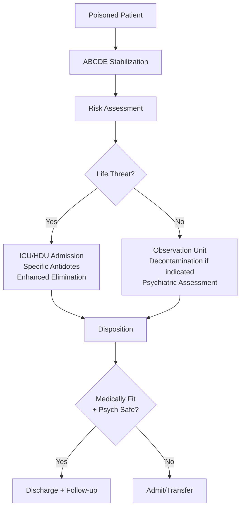
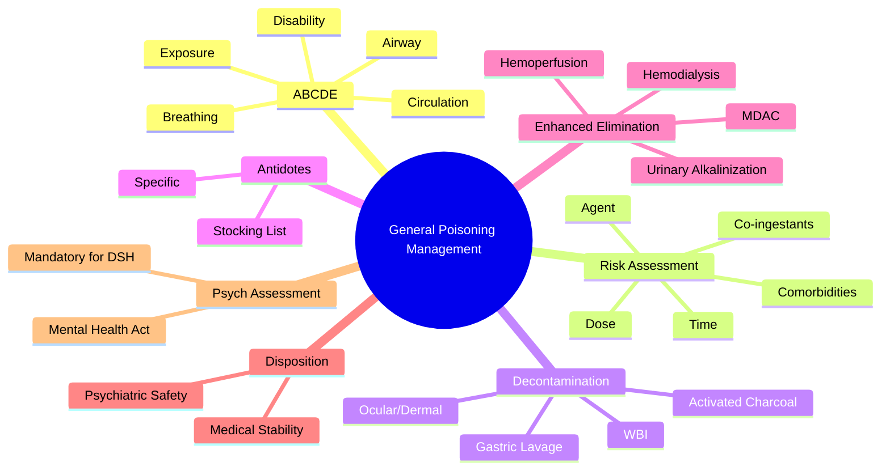

Related: [[Toxidromes]], [[Gastrointestinal Decontamination]], [[Antidotes Overview]], [[Enhanced Elimination (Dialysis, Hemoperfusion)]]

> [!tip]
> Focus on ABCDE approach, risk assessment, decontamination, enhanced elimination, and disposition.

> [!tip]
> Key FCPS/MRCP concepts: supportive care is mainstay; specific antidotes are few; psychiatric assessment mandatory before discharge.

## 1. Learning Objectives
- Apply structured ABCDE approach to poisoned patient
- Perform risk assessment (agent, dose, time, clinical features, co-ingestants)
- Select appropriate decontamination method
- Identify indications for enhanced elimination
- Apply disposition criteria (medical vs psychiatric)

## 2. Definition
Poisoning: exposure to a substance causing harmful effects. Overdose: ingestion > therapeutic dose. Toxicology: study of adverse effects of chemicals.

## 3. Core Approach: ABCDE + F (Focused History)

### A - Airway
- Protect if GCS < 8, seizure risk, aspiration risk
- Intubate early if deteriorating

### B - Breathing
- High-flow O₂ (15L NRB)
- Monitor SpO₂, RR, ABG
- Assist ventilation if respiratory depression

### C - Circulation
- IV access x2 large bore
- Fluid resuscitation for hypotension
- Vasopressors if fluid-refractory (norepinephrine)
- ECG monitoring continuous

### D - Disability
- GCS monitoring q15-30 min
- Pupil size/reactivity
- Blood glucose (must check)
- Temperature

### E - Exposure/Environment
- Full undress, search for patches, needles, containers
- Core temperature
- Decontaminate skin/eyes if dermal/ocular exposure

### F - Focused History (RISK ASSESSMENT)
- **What**: agent(s), formulation (SR/ER), concentration
- **How much**: estimated dose (mg/kg)
- **When**: time of ingestion
- **Why**: intentional vs accidental
- **Co-ingestants**: alcohol, other drugs
- **Past medical**: cardiac, psychiatric, renal, hepatic
- **Current medications**: interactions

## 4. Core Physiology
- Pharmacokinetics altered in overdose: delayed absorption (SR/ER, anticholinergic, opioid), increased volume of distribution, saturable metabolism, reduced clearance
- Ion trapping: weak acids excreted in alkaline urine; weak bases in acidic urine

## 5. Normal Values / Important Cut-offs
- GCS < 8 → intubation
- Paracetamol > 150 mg/kg or > 7.5 g → treat
- Salicylate > 500 mg/kg (moderate), > 700 mg/kg (severe)
- QRS > 100 ms (TCA) → sodium bicarbonate
- pH < 7.2 (salicylate/toxic alcohol) → dialysis consideration
- COHb > 25% (or > 15% in pregnancy) → HBO consideration

## 6. Classification
- **By intent**: accidental, deliberate self-harm (DSH), iatrogenic, occupational, environmental
- **By route**: ingestion, inhalation, dermal, IV, ocular
- **By clinical severity**: minor, moderate, severe (Poisoning Severity Score)
- **By toxidrome**: cholinergic, anticholinergic, sympathomimetic, sedative-hypnotic, opioid, serotonin, NMS

## 7. Risk Assessment Tools
- **Rumack-Matthew Nomogram**: paracetamol (4-24h post-ingestion)
- **Done Nomogram**: salicylate (limited use)
- **Prognostic scores**: PSS, APACHE II (ICU), Glasgow Coma Scale

## 8. Investigations
**Routine** (all significant ingestions):
- VBG/ABG: pH, pCO₂, lactate, glucose, electrolytes
- ECG: rate, rhythm, QRS, QT, terminal R wave in aVR (TCA)
- Paracetamol level (ALL overdoses — co-ingestion common)
- Glucose (bedside)
- U&E, creatinine, LFTs, CK, coagulation, FBC
- Pregnancy test (females childbearing age)

**Targeted** (based on history):
- Specific drug levels: salicylate, lithium, digoxin, theophylline, ethanol, methanol, ethylene glycol (osmolal gap), iron, COHb
- Urine drug screen (limited utility — qualitative only, false +/-)
- CXR (aspiration, hydrocarbon)
- CT head (trauma, coma of unclear cause)

## 9. Interpretation Frameworks
- **Anion gap metabolic acidosis** (MUDPILES): methanol, uremia, DKA, paraldehyde, iron/isoniazid, lactic acidosis, ethylene glycol, salicylate
- **Osmolal gap** = measured osmolality - calculated (2×Na + glucose/18 + BUN/2.8 + EtOH/4.6). >10 suggests toxic alcohol
- **QRS > 100 ms + terminal R in aVR + AV block** = TCA cardiotoxicity
- **Hyperkalemia in digoxin poisoning** = poor prognosis (binds Na⁺/K⁺-ATPase)

## 10. Diagnosis
Clinical diagnosis based on history + toxidrome + targeted investigations. Confirmatory levels guide specific therapy but **do not delay resuscitation**.

## 11. Differential Diagnosis
- Coma: metabolic (hypoglycemia, hepatic encephalopathy, uremia), structural (stroke, hemorrhage), infection (meningitis), seizure (post-ictal)
- Agitation: sympathomimetic, anticholinergic, serotonin, alcohol/sedative withdrawal, encephalitis, thyrotoxicosis
- Seizures: TCA, bupropion, tramadol, theophylline, isoniazid, camphor, withdrawal (alcohol, benzo), hypoglycemia, hyponatremia

## 12. Red Flags / Emergencies
1. **Airway compromise** — GCS < 8, seizure, aspiration
2. **Hemodynamic instability** — refractory hypotension, dysrhythmia
3. **Severe metabolic acidosis** — pH < 7.15
4. **Hyperthermia** — > 39°C (serotonin, NMS, sympathomimetic, anticholinergic)
5. **Rhabdomyolysis** — CK > 5000 (compartment syndrome, renal failure)
6. **Co-ingestion** — always assume multiple agents

## 13. Management Algorithm


## 14. Management

### 1. Resuscitation (ABCDE)
- Airway: intubation if GCS < 8 or failure to protect
- Breathing: O₂, ventilatory support
- Circulation: fluids → vasopressors (NE) → specific (glucagon, HIET, calcium)
- Seizures: benzodiazepines 1st line (lorazepam 2-4 mg IV), then phenobarbital/ propofol (avoid phenytoin in TCA)

### 2. Decontamination (see [[Gastrointestinal Decontamination]])
- **Activated charcoal (AC)**: 1 g/kg (max 50g), ideally < 1h, 1:10 ratio to estimated dose. Indicated for most toxins with significant toxicity. Contraindicated: unprotected airway, corrosives, hydrocarbons, GI perforation/obstruction.
- **Gastric lavage**: RARELY indicated (< 1h post life-threatening ingestion, protected airway). Not routine.
- **Whole bowel irrigation**: sustained-release, enteric-coated, body packers, iron, lithium.
- **Ocular/dermal**: copious irrigation 15+ min.

### 3. Enhanced Elimination (see [[Enhanced Elimination]])
| Method | Indications |
|--------|-------------|
| **MDAC** (multi-dose AC) | Carbamazepine, phenobarbital, theophylline, quinine, dapsone |
| **Urinary alkalinization** (pH 7.5-8) | Salicylate, phenobarbital, chlorpropamide, methotrexate |
| **Urinary acidification** | **Avoid** (risks > benefits). Was used for weak bases (amph/meth). |
| **Hemodialysis** | Methanol, ethylene glycol, salicylate (severe), lithium, theophylline, metformin, valproate |
| **Hemoperfusion/HP** | Carbamazepine, phenobarbital, paraquat (historical) |
| **Plasma exchange** | Mushroom (Amanita), TTP-like syndromes |

### 4. Antidotes (see [[Antidotes Overview]])
Key antidotes to memorize:
- **N-acetylcysteine**: paracetamol
- **Flumazenil**: benzo (CONTRAINDICATED: TCA co-ingestion, seizure disorder, chronic benzo use)
- **Naloxone**: opioid (titrate 0.04-0.4 mg, avoid precipitated withdrawal)
- **Sodium bicarbonate**: TCA (QRS > 100 ms), salicylate (alkalinization)
- **Atropine + pralidoxime**: organophosphate
- **Fomepizole/ethanol**: methanol, ethylene glycol
- **Digoxin-specific Fab**: digoxin (dose = serum level × weight / 100, or empirical 10-20 vials)
- **Hydroxocobalamin**: cyanide
- **Deferoxamine**: iron (vin rosé urine)
- **Glucagon + HIET**: beta-blocker / calcium channel blocker
- **Cyproheptadine**: serotonin syndrome
- **Dantrolene**: NMS (also malignant hyperthermia)

### 5. Supportive Care
- Monitor: continuous ECG, SpO₂, GCS q15-30 min, temp, urine output
- Electrolyte replacement (K⁺, Mg²⁺, PO₄³⁻)
- Thiamine 100 mg IV before glucose (Wernicke prevention)
- DVT prophylaxis, stress ulcer prophylaxis (ICU)
- Temperature management (active cooling if > 39°C)

### 6. Psychiatric Assessment
- **Mandatory** for all intentional overdoses before discharge
- Assess: intent, plan, hopelessness, support, follow-up
- Mental Health Act if high risk and refusing admission
- Liaison psychiatry referral

## 15. Complications
- Aspiration pneumonia (hydrocarbon, sedatives, seizures)
- Rhabdomyolysis → AKI (compartment syndrome, crush, prolonged immobilization)
- Acute kidney injury (hemodynamic, rhabdo, direct nephrotoxins: lithium, ethylene glycol, heavy metals)
- Hepatic failure (paracetamol, Amanita, valproate)
- Cardiac arrhythmias (TCA, BB/CCB, digoxin, K⁺ disturbances)
- Seizure-related injury
- Compartment syndrome (prolonged immobilization, IV extravasation)

## 16. Prognosis
- Most recover with supportive care
- Mortality predictors: age > 65, GCS < 8, cardiac arrest, pH < 7.0, lactate > 10, multi-organ failure
- Paracetamol: excellent if NAC within 8h; poor if > 24h with encephalopathy
- TCA: good with early NaHCO₃; high fatality if delayed
- BB/CCB: high mortality if refractory shock
- Toxic alcohols: good with early fomepizole/dialysis

## 17. FCPS/MRCP High-Yield Points
1. **Paracetamol**: treat on nomogram OR > 75 mg/kg at any time if staggered/uncertain timing; NAC IV/PO protocols (SNAP 2-bag vs 3-bag)
2. **Salicylate**: respiratory alkalosis + metabolic acidosis; alkalinize urine (NaHCO₃) + dialysis if pH < 7.2, renal failure, altered mental status, level > 700 mg/L
3. **TCA**: QRS widening → NaHCO₃ (1-2 mEq/kg bolus, target pH 7.5-7.55, QRS < 100 ms); avoid Class Ia/Ic antiarrhythmics, phenytoin, flumazenil
4. **BB/CCB**: glucagon (BB) 5-10 mg IV then infusion; calcium (CCB); HIET (insulin 1 U/kg/hr + dextrose); vasopressors
5. **Digoxin**: Fab fragments; hyperK = give Fab first (not insulin/dextrose/calcium)
6. **Opioid**: naloxone titration (avoid withdrawal); observe 4-6h post last dose (longer for methadone, SR)
7. **Benzo**: flumazenil ONLY if pure benzo, no seizure risk, no TCA — otherwise supportive
8. **CO**: 100% O₂ (half-life 30 min vs 4-5h on RA); HBO if COHb > 25%, LOC, cardiac ischemia, pregnancy > 15%, persistent neuro symptoms
9. **Organophosphate**: atropine (till secretions dry, HR > 80), pralidoxime (1-2 g IV over 30 min, repeat), IMS (day 1-4), OPIDN (weeks)
10. **Methanol/EG**: fomepizole 15 mg/kg load then 10 mg/kg q12h; dialysis if pH < 7.3, renal failure, visual (methanol), level > 50 mmol/L
11. **Iron**: deferoxamine if systemic toxicity (shock, metabolic acidosis) or level > 500 µg/dL; vin rosé urine
12. **Lithium**: dialysis if > 4 mmol/L (acute) or > 2.5 (chronic) + neuro symptoms / renal impairment / elderly
13. **Cocaine/Amph**: benzos 1st line; avoid beta-blockers (unopposed alpha); treat hyperthermia aggressively
14. **Anticholinergic**: physostigmine ONLY if severe (seizure, severe agitation, hyperthermia) and no contraindication (QRS widening, asthma, bradycardia, bowel obstruction)
15. **Serotonin vs NMS**: serotonergic = hyperreflexia, clonus, rapid onset (Hunter criteria); NMS = lead-pipe rigidity, bradykinesia, gradual onset (FEVER)

## 18. Common Viva Questions
1. Paracetamol nomogram use and limitations (staggered, late presentation)
2. Salicylate acid-base disorder and dialysis criteria
3. TCA overdose: ECG changes, NaHCO₃ dosing, contraindicated drugs
4. Beta-blocker vs calcium channel blocker: management differences
5. Digoxin Fab dosing and hyperkalemia significance
6. CO poisoning: HBO indications
7. Methanol/ethylene glycol: fomepizole vs ethanol, dialysis criteria
8. Organophosphate: atropine vs pralidoxime roles, IMS
9. Flumazenil contraindications
10. Serotonin syndrome vs NMS differentiation
11. Lithium dialysis criteria
12. Anticholinergic toxidrome and physostigmine risks
13. Enhanced elimination methods and indications
14. Approach to unknown overdose (ABCDE + paracetamol level + ECG + ABG)

## 19. Common Confusions / Exam Traps
- **Flumazenil in mixed overdose** → seizures if TCA co-ingestion
- **Phenytoin in TCA** → worsens sodium channel blockade
- **Beta-blocker in cocaine** → unopposed alpha vasoconstriction
- **Urinary acidification** → not recommended (worsens renal elimination of acids, rhabdo risk)
- **Digoxin hyperkalemia** → treat with Fab, NOT standard hyperK measures
- **Paracetamol nomogram < 4h** → not valid (absorption phase); treat if > 75 mg/kg
- **Staggered paracetamol** → nomogram invalid; treat on clinical suspicion + level
- **COHb normal ≠ excludes CO poisoning** (if on O₂ before sample)
- **Physostigmine in anticholinergic** → risk of bradycardia, seizures, bronchospasm; only for severe cases

## 20. Mnemonics
- **MUDPILES** (anion gap acidosis): Methanol, Uremia, DKA, Paraldehyde, Iron/Isoniazid, Lactic acidosis, Ethylene glycol, Salicylate
- **SLUDGE** (cholinergic): Salivation, Lacrimation, Urination, Defecation, GI upset, Emesis
- **DUMBELLS**: Defecation, Urination, Miosis, Bradycardia, Emesis, Lacrimation, Salivation, Sweating
- **Red as a beet, dry as a bone, blind as a bat, mad as a hatter, hot as a hare, full as a flask** (anticholinergic)
- **FEVER** (NMS): Fever, Encephalopathy, Vitals unstable, Elevated Enzymes (CK), Rigidity
- **Hunter criteria** (serotonin): Spontaneous clonus OR inducible clonus + agitation/diaphoresis OR ocular clonus + agitation/diaphoresis OR tremor + hyperreflexia + hyperthermia + diaphoresis
- **PRIME** (benzodiazepine withdrawal): Psychosis, Rebound anxiety, Insomnia, Myoclonus, Epilepsy (seizures)

## 21. Mind Map


## 22. Flowchart
```mermaid
flowchart TD
  A[Patient Presents With Possible Poisoning] --> B[Immediate ABCDE Assessment]
  B --> C{Life-Threatening Features?}
  C -->|Yes| D[Resuscitate + ICU<br/>Specific Antidotes<br/>Enhanced Elimination]
  C -->|No| E[Risk Assessment<br/>History + Exam + Targeted Tests]
  E --> F[Paracetamol Level + ECG + ABG + Glucose]
  F --> G{Significant Ingestion?}
  G -->|Yes| H[Decontamination if < 1-2h<br/>Antidote if Indicated<br/>Observation/Admission]
  G -->|No| I[Discharge if Low Risk<br/>+ Psych Assessment if DSH]
  H --> J[Psychiatric Assessment<br/>(Mandatory for DSH)]
  D --> J
  I --> J
  J --> K{Medically Fit &\nPsych Safe?}
  K -->|Yes| L[Discharge + Follow-up]
  K -->|No| M[Admit/Transfer]
```

## 23. Suggested Visuals / Image Notes
- Rumack-Matthew nomogram
- Salicylate acid-base triad diagram
- TCA ECG progression (wide QRS → sine wave → asystole)
- Organophosphate management algorithm
- Enhanced elimination decision tree

## 24. Suggested Video References
- Toxicology: Approach to the Poisoned Patient (EM:RAP, Life in the Fast Lane)
- Specific antidotes review (Clinical Toxicology rotation)

## 25. One-Page Revision Summary
- ABCDE first, always
- Paracetamol level in ALL overdoses
- Risk assessment: agent, dose, time, co-ingestants
- Charcoal 1g/kg < 1h (most toxins); WBI for SR/body packers
- Key antidotes: NAC, naloxone, NaHCO₃, atropine/pralidoxime, fomepizole, Fab, hydroxocobalamin, deferoxamine, glucagon/HIET, cyproheptadine
- Dialysis: methanol, EG, salicylate (severe), lithium, theophylline, metformin, valproate
- Psych assessment mandatory for DSH
- Contraindications: flumazenil (TCA, seizure hx), phenytoin (TCA), beta-blockers (cocaine), urinary acidification

## 24-Hour Recall Prompts
- Outline ABCDE + risk assessment for poisoned patient
- List 5 indications for hemodialysis in poisoning
- Contrast serotonin syndrome vs NMS
- State TCA ECG changes and NaHCO₃ protocol
- Name flumazenil contraindications

## 7-Day / 15-Day / 30-Day Revision Tracker
- [ ] Day 1 completed
- [ ] 24-hour recall completed
- [ ] Day 7 revision completed
- [ ] Day 15 revision completed
- [ ] Day 30 revision completed

## 26. Must Know / Should Know / Nice to Know
### Must Know
- ABCDE + risk assessment framework
- Paracetamol: nomogram, NAC protocols, staggered ingestion
- Salicylate: acid-base, alkalinization, dialysis criteria
- TCA: QRS > 100 ms → NaHCO₃; avoid phenytoin/flumazenil
- BB/CCB: glucagon, calcium, HIET, vasopressors
- Opioid: naloxone titration, re-sedation risk
- CO: 100% O₂, HBO indications
- Organophosphate: atropine + pralidoxime, IMS
- Methanol/EG: fomepizole, dialysis criteria
- Digoxin: Fab dosing, hyperK significance
- Lithium: dialysis criteria (acute vs chronic)
- Flumazenil contraindications
- Serotonin vs NMS differentiation
- Psych assessment mandatory

### Should Know
- Enhanced elimination indications per toxin
- Anticholinergic toxidrome + physostigmine risks
- Iron: deferoxamine, vin rosé urine
- Cyanide: hydroxocobalamin
- Cocaine/Amph: benzos, avoid beta-blockers
- Toxic alcohol osmolal/anion gap
- Specific antidote stocking list

### Nice to Know
- Mushroom poisoning (Amanita) specifics
- Hydrocarbon aspiration risk
- Corrosive ingestion grading
- Body packer management
- Heavy metal chelation details

## 27. Self-Test Scorecard
- Understanding: /10
- Recall: /10
 - MCQ Performance: /10
 - SBA Performance: /10
 - Viva Confidence: /10
 - Total: /50

> [!tip]
> Interpretation: <35 = weak topic, 35-44 = acceptable but insecure, 45+ = strong exam-ready topic.

## 28. Exam Answer Modes
### Long Answer Skeleton
- Definition + classification
- Risk assessment (agent, dose, time, co-factors)
- Clinical features by toxidrome
- Investigations (targeted)
- Management: resuscitation → decontamination → antidote → enhanced elimination → supportive → psych
- Complications + prognosis
- Disposition

### Short Note Skeleton
- Key toxidrome features (table)
- Antidote + dose + indication
- Dialysis criteria for specific poison

### Viva One-Liners
- "Paracetamol: nomogram 4-24h, staggered = treat empirically"
- "TCA: QRS > 100 ms = NaHCO₃; never give phenytoin or flumazenil"
- "Salicylate: respiratory alkalosis + metabolic acidosis = dialysis if pH < 7.2"
- "Beta-blocker overdose: glucagon + HIET; CCB: calcium + HIET"
- "Digoxin: hyperK = poor prognosis, give Fab not insulin/calcium"
- "CO: 100% O₂, HBO if COHb > 25% or neuro/cardiac/pregnancy"
- "Organophosphate: atropine till dry, pralidoxime 1-2g IV"
- "Methanol/EG: fomepizole, dialysis if pH < 7.3 or end-organ"
- "Lithium: dialysis if > 4 acute / > 2.5 chronic + neuro/renal"
- "Serotonin vs NMS: clonus/hyperreflexia vs rigidity/bradykinesia"

### Ward-Case Discussion Points
- Unknown overdose: paracetamol level + ECG + ABG mandatory
- Staggered paracetamol: do not use nomogram
- Psychiatric clearance before discharge in DSH
- observing methadone/benzo/TCA > 6h post naloxone/flumazenil

### Last-Night-Before-Exam Sheet
- MUDPILES, SLUDGE, DUMBELLS, FEVER, Hunter criteria
- Antidote table (agent, antidote, dose, key indication)
- Dialysis criteria table
- Contraindications table (flumazenil, phenytoin, beta-blockers, physostigmine)

## 29. Summary
General poisoning management is ABCDE-driven supportive care. Specific antidotes exist for few agents and must be given early. Decontamination (charcoal < 1h) and enhanced elimination (dialysis for specific indications) are adjuncts. Psychiatric assessment is mandatory for deliberate self-harm. Key exam areas: paracetamol nomogram/staggered, salicylate acid-base/dialysis, TCA NaHCO₃/contraindications, BB/CCB glucagon/HIET, digoxin Fab/hyperK, CO HBO, organophosphate atropine/pralidoxime/IMS, methanol/EG fomepizole/dialysis, lithium dialysis criteria, flumazenil contraindications, serotonin vs NMS.

## 30. MCQs (10)
1. What is the FIRST step in managing any poisoned patient?
   A. Give activated charcoal
   B. Identify the poison
   C. ABCDE stabilization
   D. Check paracetamol level
   **Answer: C**
   *Explanation: ABCDE stabilization ALWAYS comes first. Resuscitation precedes identification and specific treatment. Paracetamol level in ALL overdoses but after ABCDE.*

2. Paracetamol level should be checked in:
   A. Only paracetamol overdoses
   B. ALL overdoses
   C. Overdoses with hepatic risk factors
   D. Only intentional overdoses
   **Answer: B**
   *Explanation: Paracetamol level in ALL overdoses — co-ingestion is common. Paracetamol often taken with other agents (opioids, benzos, alcohol). Missed paracetamol = missed NAC window.*

3. Activated charcoal dose and optimal timing?
   A. 0.5 g/kg within 4 hours
   B. 1 g/kg ideally < 1 hour
   C. 2 g/kg within 2 hours
   D. 1 g/kg up to 12 hours
   **Answer: B**
   *Explanation: AC 1 g/kg (max 50g), ideally < 1h, 1:10 ratio to estimated dose. Benefit up to 2-4h for some toxins (paracetamol delays gastric emptying, anticholinergics).*

4. Contraindications to activated charcoal?
   A. All overdoses
   B. Unprotected airway, corrosives, hydrocarbons, GI perforation/obstruction
   C. Only in children
   D. Only with SR preparations
   **Answer: B**
   *Explanation: Contraindicated: unprotected airway (aspiration risk), corrosives (obscures endoscopy), hydrocarbons (aspiration pneumonitis risk), GI perforation/obstruction.*

5. Flumazenil contraindications?
   A. Only in children
   B. TCA co-ingestion, seizure disorder, chronic benzo use
   C. Only with alcohol co-ingestion
   D. None - safe in all benzo overdoses
   **Answer: B**
   *Explanation: Flumazenil CONTRAINDICATED: TCA co-ingestion (unmasks seizures), seizure disorder (withdrawal seizures), chronic benzo use (withdrawal). Only for pure benzo overdose, no seizure risk, no TCA.*

6. Hemodialysis indications in poisoning - which agent?
   A. Paracetamol
   B. Methanol, ethylene glycol, salicylate (severe), lithium, theophylline, metformin, valproate
   C. Benzodiazepines
   D. Opioids
   **Answer: B**
   *Explanation: HD for: methanol, ethylene glycol, severe salicylate, lithium, theophylline, metformin, valproate. Also toxic alcohols, iron (rarely). NOT for paracetamol, benzos, opioids (high protein binding/large Vd).*

7. MUDPILES anion gap metabolic acidosis - what does S stand for?
   A. Sepsis
   B. Salicylate
   C. Starvation
   D. Strychnine
   **Answer: B**
   *Explanation: MUDPILES: Methanol, Uremia, DKA, Paraldehyde, Iron/Isoniazid, Lactic acidosis, Ethylene glycol, Salicylate.*

8. Osmolal gap calculation?
   A. Measured - 2×Na
   B. Measured osmolality - calculated (2×Na + glucose/18 + BUN/2.8 + EtOH/4.6)
   C. Calculated - measured
   D. Only measured osmolality
   **Answer: B**
   *Explanation: Osmolal gap = measured osmolality - calculated (2×Na + glucose/18 + BUN/2.8 + EtOH/4.6). > 10 suggests toxic alcohol (methanol, ethylene glycol, isopropanol).*

9. Digoxin poisoning with hyperkalemia - management?
   A. Insulin/dextrose + calcium
   B. Digoxin-specific Fab fragments FIRST
   C. Sodium bicarbonate
   D. Hemodialysis
   **Answer: B**
   *Explanation: Digoxin hyperkalemia = poor prognosis (binds Na⁺/K⁺-ATPase). Treat with Fab FIRST, NOT standard hyperK measures (insulin/dextrose/calcium). Fab reverses the Na⁺/K⁺-ATPase blockade.*

10. CO poisoning - HBO indications?
   A. COHb > 10%
   B. COHb > 25% (or >15% pregnancy), LOC, cardiac ischemia, persistent neuro symptoms
   C. Only if COHb > 50%
   D. Never indicated
   **Answer: B**
   *Explanation: HBO if: COHb > 25% (or >15% in pregnancy), loss of consciousness, cardiac ischemia, persistent neuro symptoms. 100% O₂ first (half-life 30min vs 4-5h on RA).*

## 31. SBA Questions (10)
1. Unknown overdose. Patient comatose, GCS 6. Initial management priority?
   A. Identify the poison
   B. ABCDE - intubate, oxygen, IV access, glucose
   C. Give naloxone + flumazenil empirically
   D. Activated charcoal via NG tube
   **Answer: B**
   *Explanation: ABCDE ALWAYS first. Airway protection (GCS < 8 → intubate). Then risk assessment + targeted tests (paracetamol level + ECG + ABG + glucose mandatory).*

2. DSH overdose, unknown pills. Risk assessment - what is LEAST important?
   A. Agent and formulation (SR/ER)
   B. Estimated dose (mg/kg)
   C. Exact time of ingestion
   D. Patient's favorite color
   **Answer: D**
   *Explanation: Risk assessment: What (agent, formulation), How much (dose mg/kg), When (time), Why (intent), Co-ingestants, Past medical, Current meds. 'Favorite color' is irrelevant.*

3. TCA overdose with QRS 140ms. Which drug is MOST dangerous to give?
   A. Sodium bicarbonate
   B. Lorazepam for seizures
   C. Phenytoin for seizures
   D. Norepinephrine for hypotension
   **Answer: C**
   *Explanation: Phenytoin CONTRAINDICATED in TCA - Na channel blocker worsens cardiotoxicity (QRS widening, VF). NaHCO₃ is treatment. Lorazepam 1st line for seizures. NE for hypotension.*

4. Salicylate poisoning with pH 7.18, level 750 mg/L, confused. Management?
   A. Urinary alkalinization only
   B. Hemodialysis
   C. Observe only
   D. Charcoal only
   **Answer: B**
   *Explanation: Dialysis criteria: pH < 7.2, renal failure, CNS toxicity, level > 700 (acute). This patient meets 3 criteria (pH 7.18, level 750, confusion). Urine alkalinization adjunct but dialysis indicated.*

5. Beta-blocker overdose with hypotension refractory to fluids. Next step?
   A. More fluids
   B. Glucagon 5-10mg IV then infusion + HIET
   C. Norepinephrine only
   D. Atropine
   **Answer: B**
   *Explanation: BB overdose: Glucagon 5-10mg IV then 5-15mg/hr infusion (bypasses β-receptor). HIET (insulin 1U/kg/hr + dextrose) for myocardial support. Vasopressors adjunct.*

6. Calcium channel blocker overdose - specific antidote?
   A. Glucagon
   B. Calcium (IV calcium gluconate/chloride) + HIET
   C. Naloxone
   D. Flumazenil
   **Answer: B**
   *Explanation: CCB overdose: Calcium (IV calcium gluconate 3g or chloride 1g) + HIET (insulin 1U/kg/hr + dextrose). Glucagon less effective than in BB. Vasopressors for refractory shock.*

7. Organophosphate poisoning - atropine dosing target?
   A. HR > 60
   B. Secretions dry, HR > 80, no bronchospasm
   C. Pupils dilated
   D. BP normal
   **Answer: B**
   *Explanation: Atropine: titrate to dry secretions, HR > 80, no bronchospasm. No max dose. Pralidoxime 1-2g IV over 30min (within 24-48h). IMS day 1-4, OPIDN weeks later.*

8. Methanol/ethylene glycol poisoning - fomepizole dose?
   A. 15 mg/kg load then 10 mg/kg q12h
   B. 10 mg/kg load then 5 mg/kg q6h
   C. 20 mg/kg load then 15 mg/kg q24h
   D. 5 mg/kg load then 2 mg/kg q8h
   **Answer: A**
   *Explanation: Fomepizole: 15 mg/kg load, then 10 mg/kg q12h (increase to 15 mg/kg q12h after 48h if on dialysis). Dialysis if pH < 7.3, renal failure, visual symptoms (methanol), level > 50 mmol/L.*

9. Lithium poisoning - dialysis criteria?
   A. Level > 1.5 mmol/L
   B. Acute > 4 mmol/L OR Chronic > 2.5 mmol/L + neuro symptoms/renal impairment/elderly
   C. Level > 3 mmol/L always
   D. Only if anuric
   **Answer: B**
   *Explanation: Lithium dialysis: Acute > 4 mmol/L. Chronic > 2.5 mmol/L + neuro symptoms/renal impairment/elderly. Also if level > 5 mmol/L any case. Lithium rebounds post-dialysis (redistributes).*

10. Cocaine/sympathomimetic toxicity - 1st line for agitation/seizures?
   A. Beta-blockers
   B. Benzodiazepines
   C. Phenytoin
   D. Haloperidol
   **Answer: B**
   *Explanation: Cocaine/amph: Benzodiazepines 1st line (lorazepam/diazepam). AVOID beta-blockers (unopposed α vasoconstriction → hypertension crisis). Treat hyperthermia aggressively (active cooling).*

## 32. Flashcards
- Q: General poisoning management priority?
  A: ABCDE first, ALWAYS. Resuscitation before identification.
- Q: Paracetamol level in ALL overdoses?
  A: Yes - co-ingestion common. Paracetamol often with opioids, benzos, alcohol.
- Q: Activated charcoal dose/timing?
  A: 1 g/kg (max 50g), ideally <1h, 1:10 ratio. Benefit up to 2-4h for some (paracetamol, anticholinergics).
- Q: Charcoal contraindications?
  A: Unprotected airway, corrosives, hydrocarbons, GI perforation/obstruction.
- Q: Flumazenil contraindications?
  A: TCA co-ingestion, seizure disorder, chronic benzo use. Only pure benzo, no seizure risk, no TCA.
- Q: MUDPILES members?
  A: Methanol, Uremia, DKA, Paraldehyde, Iron/Isoniazid, Lactic acidosis, Ethylene glycol, Salicylate.
- Q: Osmolal gap formula?
  A: Measured - (2×Na + glucose/18 + BUN/2.8 + EtOH/4.6). >10 = toxic alcohol.
- Q: Digoxin + hyperkalemia?
  A: Give Fab FIRST, not insulin/dextrose/calcium. HyperK = poor prognosis (Na/K-ATPase blockade).
- Q: CO poisoning HBO criteria?
  A: COHb >25% (>15% pregnancy), LOC, cardiac ischemia, persistent neuro symptoms. 100% O₂ first.
- Q: HD indications in poisoning?
  A: Methanol, EG, salicylate (severe), lithium, theophylline, metformin, valproate. NOT paracetamol, benzos, opioids.
- Q: Serotonin vs NMS differentiation?
  A: Serotonin: hyperreflexia, clonus, rapid onset (Hunter criteria). NMS: lead-pipe rigidity, bradykinesia, gradual onset (FEVER).
- Q: Anticholinergic toxidrome mnemonic?
  A: Red as a beet, dry as a bone, blind as a bat, mad as a hatter, hot as a hare, full as a flask.
- Q: Physostigmine in anticholinergic - when?
  A: ONLY if severe (seizure, severe agitation, hyperthermia) AND no contraindication (QRS widening, asthma, bradycardia, bowel obstruction).
- Q: BB vs CCB overdose key difference?
  A: BB: Glucagon + HIET. CCB: Calcium + HIET. Both: vasopressors for refractory shock.
- Q: Poisoning Severity Score (PSS)?
  A: Grades: 0=none, 1=minor, 2=moderate, 3=severe, 4=fatal. Used for triage/research.
## 33. Answer Key with Explanations
### MCQs
1. **C** - ABCDE stabilization ALWAYS comes first. Resuscitation precedes identification and specific treatment. Paracetamol level in ALL overdoses but after ABCDE.
2. **B** - Paracetamol level in ALL overdoses — co-ingestion is common. Paracetamol often taken with other agents (opioids, benzos, alcohol). Missed paracetamol = missed NAC window.
3. **B** - AC 1 g/kg (max 50g), ideally < 1h, 1:10 ratio to estimated dose. Benefit up to 2-4h for some toxins (paracetamol delays gastric emptying, anticholinergics).
4. **B** - Contraindicated: unprotected airway (aspiration risk), corrosives (obscures endoscopy), hydrocarbons (aspiration pneumonitis risk), GI perforation/obstruction.
5. **B** - Flumazenil CONTRAINDICATED: TCA co-ingestion (unmasks seizures), seizure disorder (withdrawal seizures), chronic benzo use (withdrawal). Only for pure benzo overdose, no seizure risk, no TCA.
6. **B** - HD for: methanol, ethylene glycol, severe salicylate, lithium, theophylline, metformin, valproate. Also toxic alcohols, iron (rarely). NOT for paracetamol, benzos, opioids (high protein binding/large Vd).
7. **B** - MUDPILES: Methanol, Uremia, DKA, Paraldehyde, Iron/Isoniazid, Lactic acidosis, Ethylene glycol, Salicylate.
8. **B** - Osmolal gap = measured osmolality - calculated (2×Na + glucose/18 + BUN/2.8 + EtOH/4.6). > 10 suggests toxic alcohol (methanol, ethylene glycol, isopropanol).
9. **B** - Digoxin hyperkalemia = poor prognosis (binds Na⁺/K⁺-ATPase). Treat with Fab FIRST, NOT standard hyperK measures (insulin/dextrose/calcium). Fab reverses the Na⁺/K⁺-ATPase blockade.
10. **B** - HBO if: COHb > 25% (or >15% in pregnancy), loss of consciousness, cardiac ischemia, persistent neuro symptoms. 100% O₂ first (half-life 30min vs 4-5h on RA).

### SBAs
1. **B** - ABCDE ALWAYS first. Airway protection (GCS < 8 → intubate). Then risk assessment + targeted tests (paracetamol level + ECG + ABG + glucose mandatory).
2. **D** - Risk assessment: What (agent, formulation), How much (dose mg/kg), When (time), Why (intent), Co-ingestants, Past medical, Current meds. 'Favorite color' is irrelevant.
3. **C** - Phenytoin CONTRAINDICATED in TCA - Na channel blocker worsens cardiotoxicity (QRS widening, VF). NaHCO₃ is treatment. Lorazepam 1st line for seizures. NE for hypotension.
4. **B** - Dialysis criteria: pH < 7.2, renal failure, CNS toxicity, level > 700 (acute). This patient meets 3 criteria (pH 7.18, level 750, confusion). Urine alkalinization adjunct but dialysis indicated.
5. **B** - BB overdose: Glucagon 5-10mg IV then 5-15mg/hr infusion (bypasses β-receptor). HIET (insulin 1U/kg/hr + dextrose) for myocardial support. Vasopressors adjunct.
6. **B** - CCB overdose: Calcium (IV calcium gluconate 3g or chloride 1g) + HIET (insulin 1U/kg/hr + dextrose). Glucagon less effective than in BB. Vasopressors for refractory shock.
7. **B** - Atropine: titrate to dry secretions, HR > 80, no bronchospasm. No max dose. Pralidoxime 1-2g IV over 30min (within 24-48h). IMS day 1-4, OPIDN weeks later.
8. **A** - Fomepizole: 15 mg/kg load, then 10 mg/kg q12h (increase to 15 mg/kg q12h after 48h if on dialysis). Dialysis if pH < 7.3, renal failure, visual symptoms (methanol), level > 50 mmol/L.
9. **B** - Lithium dialysis: Acute > 4 mmol/L. Chronic > 2.5 mmol/L + neuro symptoms/renal impairment/elderly. Also if level > 5 mmol/L any case. Lithium rebounds post-dialysis (redistributes).
10. **B** - Cocaine/amph: Benzodiazepines 1st line (lorazepam/diazepam). AVOID beta-blockers (unopposed α vasoconstriction → hypertension crisis). Treat hyperthermia aggressively (active cooling).