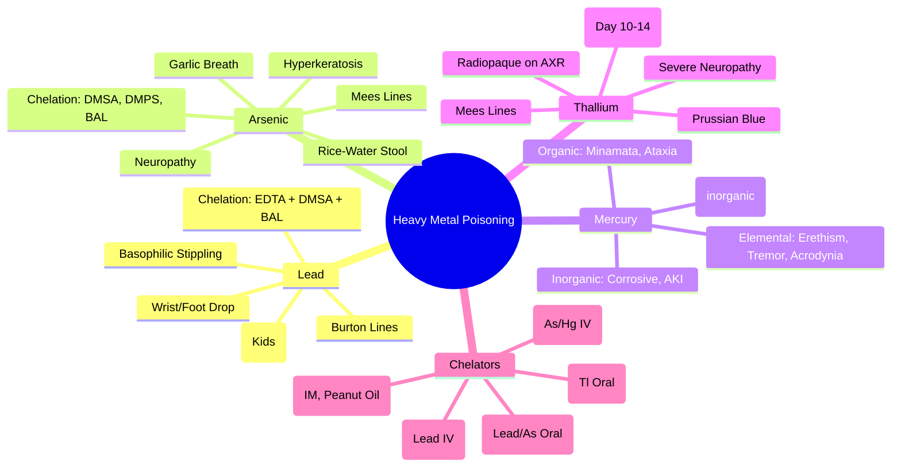

Related: [[General Principles of Poisoning Management]], [[Antidotes Overview]], [[Enhanced Elimination (Dialysis, Hemoperfusion)]], [[Gastrointestinal Decontamination]]

> [!tip]
> **Chelation therapy** = specific antidotes. **Lead**: EDTA + DMSA (succimer), **Arsenic**: DMSA/DMPS, **Mercury**: DMSA/DMPS (inorganic), **Thallium**: Prussian blue. **Key FCPS/MRCP**: Lead = basophilic stippling, wrist/foot drop, abdominal colic; Arsenic = Mees lines, garlic breath, encephalopathy; Mercury = erethism (neuropsych), acrodynia (pink disease); Thallium = alopecia, Mees lines, peripheral neuropathy; Radiopaque on AXR.

## 1. Learning Objectives
- Recognize clinical syndromes of lead, arsenic, mercury, thallium poisoning
- Apply specific chelation protocols (EDTA, DMSA, DMPS, BAL, Prussian blue)
- Identify characteristic signs (Mees lines, basophilic stippling, alopecia, erethism)
- Interpret radiopaque tablets on AXR
- Differentiate acute vs chronic presentations

## 2. Definition
Heavy metal poisoning = toxicity from accumulative heavy metals (lead, arsenic, mercury, thallium) causing multi-system dysfunction via enzyme inhibition, oxidative stress, and protein binding.

## 3. Core Physiology
- **Mechanism**: bind **sulfhydryl (-SH) groups** on enzymes → inhibit cellular respiration, heme synthesis, antioxidant defenses
- **Distribution**: bone (lead), skin/hair/nails (arsenic, thallium), brain/kidney (mercury)
- **Elimination**: renal (arsenic, mercury), biliary/fecal (lead), fecal (thallium)
- **Half-lives**: lead (bone decades), arsenic (weeks), mercury (months), thallium (days-weeks)

## 4. Clinical Features by Metal

### 1. Lead (Pb)
| Form | Features |
|------|----------|
| **Acute** (rare) | Abdominal colic, vomiting, encephalopathy, seizures, coma |
| **Chronic** (common) | **Abdominal colic** (lead colic), **wrist/foot drop** (radial/peroneal neuropathy), **basophilic stippling** anemia, **Burton lines** (gingival lead), hypertension, nephropathy, **encephalopathy** (children), **reduced IQ**, behavioral issues |
| **Hematologic** | Microcytic hypochromic anemia + **basophilic stippling** (inhibits ferrochelatase + pyrimidine-5'-nucleotidase) |
| **Renal** | Chronic interstitial nephropathy, Fanconi syndrome (proximal tubular) |
| **Reproductive** | Infertility, miscarriage, reduced sperm count |

### 2. Arsenic (As)
| Form | Features |
|------|----------|
| **Acute** | **Garlic breath**, severe **gastroenteritis** (rice-water stool), hypotension, **encephalopathy**, seizures, **QT prolongation**, **cardiogenic shock** |
| **Chronic** | **Mees lines** (transverse white bands on nails), **hyperkeratosis** (palms/soles), **hyperpigmentation** (raindrop), **peripheral neuropathy** (stocking-glove), **skin cancer** (Bowen disease), **liver angiosarcoma**, **lung cancer** |
| **Arsine gas** | Acute hemolysis → hemoglobinuria, AKI |

### 3. Mercury (Hg)
| Form | Features |
|------|----------|
| **Elemental (vapor)** | **Erethism** (neuropsych: tremor, irritability, shyness, insomnia, memory loss), **gingivostomatitis**, **proteinuria**, **acrodynia** (pink disease: children — pink extremities, photophobia, irritability) |
| **Inorganic (salts)** | **Corrosive gastroenteritis**, **AKI** (proximal tubular necrosis), hemorrhagic colitis |
| **Organic (methylmercury)** | **Minamata disease**: ataxia, dysarthria, constricted visual fields, hearing loss, paresthesias, **fetal neurotoxicity** |

### 4. Thallium (Tl)
| Form | Features |
|------|----------|
| **Acute** | **Gastroenteritis**, **polyneuropathy** (severe burning pain, then weakness), **alopecia** (day 10-14, characteristic), **Mees lines**, **autonomic dysfunction** (tachycardia, hypertension, sweating), **psychosis**, seizures, **cranial nerve palsies**, **cardiomyopathy** |
| **Radiopaque** | **Visible on AXR** (like lead) |

## 5. Differential Diagnosis
- **Lead vs Arsenic vs Thallium**: all cause neuropathy, abdominal pain, Mees lines (arsenic/thallium)
- **Mercury**: neuropsychiatric (erethism) + tremor
- **Guillain-Barré**: ascending paralysis, albuminocytological dissociation
- **Porphyria**: abdominal pain, neuropathy, photosensitivity

## 6. Investigations
- **Blood/urine levels**: **blood lead level (BLL)** for lead; **24h urine arsenic/mercury/thallium** (seafood abstinence 48h before arsenic)
- **CBC + blood film**: **basophilic stippling** (lead), anemia
- **Renal function**: AKI (mercury inorganic, arsenic)
- **Nerve conduction studies**: peripheral neuropathy
- **AXR**: **radiopaque** (lead, thallium) — **pill count if acute ingestion**
- **Hair/nail analysis**: chronic exposure (arsenic, mercury, thallium)
- **Paracetamol level** (always)

## 7. Management

### 1. General
- **Remove from exposure** (occupational/environmental)
- **Decontamination**: WBI for acute ingestion (radiopaque on AXR)
- **Supportive**: fluids, electrolyte correction, seizure control

### 2. Specific Chelation Therapy

| Metal | Agent | Dose/Route | Key Points |
|-------|-------|------------|------------|
| **Lead** | **CaNa₂EDTA** | 1-1.5 g/m²/day IV infusion (or 25 mg/kg/day IM/IV divided q12h) × 5 days | **Nephrotoxic** — hydrate well, monitor renal; combine with DMSA for encephalopathy |
| | **DMSA (Succimer)** | **10 mg/kg PO q8h × 5d**, then q12h × 14d | **Oral, less nephrotoxic**, preferred for non-encephalopathic; **avoid if G6PD** |
| | **BAL (Dimercaprol)** | **3-5 mg/kg IM q4h** (with EDTA for encephalopathy) | **Painful IM**, peanut oil vehicle, ↑ lead in brain if used alone |
| **Arsenic** | **DMSA** | 10 mg/kg PO q8h × 5d, then q12h × 14d | Preferred (oral, safe) |
| | **DMPS** | 5 mg/kg IV/IM q6-8h | Alternative (not widely available) |
| | **BAL** | 3-5 mg/kg IM q4h | If DMSA/DMPS unavailable |
| **Mercury** | **Inorganic: DMSA/DMPS** | As above | Elemental vapor: supportive (chelation less effective) |
| | **Organic: No proven chelation** | Supportive, selenium | |
| **Thallium** | **Prussian Blue** | **250 mg/kg/day PO divided q6h** (1-3 g q6h adult) | **Traps thallium in gut** → fecal excretion; continue until urine thallium < 0.5 mg/L |
| | **Potassium** | Avoid forced diuresis (↑ thallium absorption) | |

### 3. Enhanced Elimination
- **Hemodialysis**: limited (high protein binding) — consider for acute lead encephalopathy with EDTA, thallium (if Prussian blue unavailable)
- **Plasma exchange**: thallium, lead encephalopathy
- **WBI**: acute ingestion (radiopaque on AXR)

### 4. Supportive
- **Seizures**: benzodiazepines
- **Neuropathy**: gabapentin, amitriptyline, physiotherapy
- **Hypertension** (lead): standard management
- **AKI**: renal replacement if indicated

## 8. Complications
- **Lead**: permanent neurocognitive deficit (children), CKD, hypertension
- **Arsenic**: skin/lung/liver cancer, permanent neuropathy
- **Mercury**: permanent neuropsychiatric (erethism), visual field loss, Minamata disease
- **Thallium**: permanent alopecia, neuropathy, cardiomyopathy

## 9. Prognosis
- **Early chelation** → better outcome
- **Chronic/established neurotoxicity** often **irreversible**
- **Thallium**: good if Prussian blue early; alopecia reversible

## 10. FCPS/MRCP High-Yield Points
1. **Lead**: basophilic stippling, wrist/foot drop, abdominal colic, Burton lines, encephalopathy (children)
2. **Arsenic**: garlic breath, rice-water stool, Mees lines, hyperkeratosis, peripheral neuropathy
3. **Mercury**: erethism (neuropsych), tremor, acrodynia (pink disease), Minamata disease
4. **Thallium**: **alopecia (day 10-14)**, Mees lines, severe neuropathy, radiopaque on AXR, Prussian blue
5. **Chelation**: EDTA (lead IV), DMSA (lead/arsenic oral), BAL (IM, painful), Prussian blue (thallium oral)
6. **Radiopaque on AXR**: lead, thallium (count pills)
7. **Basophilic stippling** = lead (inhibits pyrimidine-5'-nucleotidase)
8. **Erethism** = mercury neuropsychiatric syndrome
9. **Acrodynia** = mercury in children (pink extremities)
10. **Prussian blue** = thallium antidote (gut trapping)

## 11. Common Viva Questions
1. Lead poisoning features and chelation
2. Arsenic vs thallium differentiation
3. Mercury forms and specific toxicities
4. Thallium alopecia timing and Prussian blue
5. Basophilic stippling mechanism
6. Chelation agents comparison (EDTA vs DMSA vs BAL vs DMPS)

## 12. Common Confusions / Exam Traps
- **EDTA alone for lead encephalopathy** → MUST combine with BAL
- **BAL alone for lead** → increases brain lead
- **DMSA for all metals** → NOT for thallium (Prussian blue), limited for elemental mercury
- **Forced diuresis for thallium** → INCREASES absorption
- **Mees lines only arsenic** → also thallium
- **Radiopaque only lead** → thallium also radiopaque
- **EDTA oral** → IV/IM only (poor oral absorption)

## 13. Mnemonics
- **LEAD**: **L**ead lines (Burton), **E**ncephalopathy, **A**bdominal colic, **D**rop wrist/foot, **B**asophilic stippling
- **ARSENIC**: **A**lopecia? (no), **R**ice-water stool, **S**kin (Mees, hyperkeratosis), **E**ncephalopathy, **N**europathy, **I**nhales garlic, **C**ancer
- **MERCURY**: **M**inamata, **E**rethism, **R**enal (inorganic), **C**orrosive (inorganic), **U** (pink disease/acrodynia), **R**eady tremor
- **THALLIUM**: **T**halium → **A**lopecia (day 10-14), **L**ethal neuropathy, **L**ines (Mees), **I**ntestinal (gastro), **U** (Prussian blue), **M**eans radiopaque
- **CHELATION**: **E**DTA (lead IV), **D**MSA (lead/As oral), **B**AL (IM, peanut oil), **P**russian blue (Tl oral)

## 14. Mind Map


## 15. Flowchart
```mermaid
flowchart TD
  A[Heavy Metal Exposure] --> B{Suspected Metal}
  B -->|Lead| C[BLL, Basophilic Stippling, AXR\nAnemia, Renal]
  B -->|Arsenic| D[24h Urine As (No Seafood 48h)\nMees Lines, Garlic Breath]
  B -->|Mercury| E[Blood/Ur Hg, Erethism, Tremor\nAcrodynia (Kids)]
  B -->|Thallium| F[24h Urine Tl, Alopecia Day 10-14\nMees Lines, AXR Radiopaque]
  C --> G[Chelation:\nEncephalopathy: EDTA + BAL\nNon-Encephalopathic: DMSA]
  D --> H[Chelation: DMSA/DMPS\nBAL if Unavailable]
  E --> I{Form}
  I -->|Inorganic| J[DMSA/DMPS]
  I -->|Elemental/Organic| K[Supportive, Selenium]
  F --> L[Prussian Blue 250mg/kg/day PO\nUntil Urine Tl < 0.5mg/L]
  G --> M[Monitor Renal, Lead Levels\nCorrect Iron Deficiency]
  H --> M
  J --> M
  K --> M
  L --> M
```

## 16. Suggested Visuals / Image Notes
- Basophilic stippling blood film
- Mees lines photo
- Burton lines (gingival)
- Alopecia in thallium
- Chelation protocol comparison table

## 17. Suggested Video References
- Heavy metal chelation protocols (Toxbase)

## 18. One-Page Revision Summary
- **Lead**: basophilic stippling, wrist/foot drop, abdominal colic, Burton lines, encephalopathy (kids) → EDTA + DMSA (+ BAL for encephalopathy)
- **Arsenic**: garlic breath, rice-water stool, Mees lines, hyperkeratosis, neuropathy → DMSA/DMPS
- **Mercury**: elemental = erethism/tremor/acrodynia; inorganic = corrosive/AKI; organic = Minamata → DMSA/DMPS (inorganic)
- **Thallium**: alopecia (day 10-14), Mees lines, severe neuropathy, radiopaque → **Prussian blue** (gut trapping)
- **Radiopaque AXR**: lead, thallium
- **Basophilic stippling** = lead (pyrimidine-5'-nucleotidase inhibition)
- **EDTA IV** (nephrotoxic), **DMSA oral** (safe), **BAL IM** (painful, peanut oil), **Prussian blue oral** (thallium)

## 24-Hour Recall Prompts
- List lead chelation (encephalopathic vs not)
- State thallium alopecia timing and antidote
- Differentiate arsenic vs thallium Mees lines
- Name mercury forms and key features

## 7-Day / 15-Day / 30-Day Revision Tracker
- [ ] Day 1 completed
- [ ] 24-hour recall completed
- [ ] Day 7 revision completed
- [ ] Day 15 revision completed
- [ ] Day 30 revision completed

## 19. Must Know / Should Know / Nice to Know
### Must Know
- Lead: basophilic stippling, wrist/foot drop, colic, EDTA+DMSA
- Arsenic: garlic breath, Mees lines, hyperkeratosis, DMSA
- Mercury: erethism, tremor, acrodynia, Minamata
- Thallium: alopecia day 10-14, Prussian blue, radiopaque
- Radiopaque AXR: lead, thallium
- Basophilic stippling = lead

### Should Know
- Chelation comparison (EDTA vs DMSA vs BAL vs DMPS vs Prussian blue)
- Arsenic vs thallium differentiation
- Mercury forms (elemental/inorganic/organic)
- EDTA nephrotoxicity, BAL increases brain lead if alone

### Nice to Know
- Arsenic arsine gas hemolysis
- Mercury in pregnancy (fetal neurotoxicity)
- Lead in pregnancy (miscarriage, developmental)
- Specific occupational sources

## 20. Self-Test Scorecard
- Understanding: /10
- Recall: /10
- MCQ Performance: /10
- SBA Performance: /10
- Viva Confidence: /10
- Total: /50

> [!tip]
> Interpretation: <35 = weak topic, 35-44 = acceptable but insecure, 45+ = strong exam-ready topic.

## 21. Exam Answer Modes
### Long Answer Skeleton
- Metal-specific: features, investigations, chelation
- Comparison table (lead, arsenic, mercury, thallium)
- Chelation agents table (dose, route, indications, contraindications)
- Radiopaque metals on AXR
- Complications

### Short Note Skeleton
- Lead features + chelation box
- Arsenic vs thallium table
- Mercury forms table
- Chelation protocol table

### Viva One-Liners
- "Lead: basophilic stippling, wrist/foot drop, colic → EDTA + DMSA (BAL if encephalopathy)"
- "Arsenic: garlic breath, Mees lines, hyperkeratosis → DMSA/DMPS"
- "Mercury: elemental = erethism/tremor/acrodynia; inorganic = AKI; organic = Minamata"
- "Thallium: alopecia day 10-14, Mees lines, radiopaque → Prussian blue"
- "Radiopaque on AXR: lead, thallium"
- "Basophilic stippling = pyrimidine-5'-nucleotidase inhibition = lead"
- "EDTA IV nephrotoxic; DMSA oral safe; BAL IM painful; Prussian blue oral"
- "BAL alone for lead → increases brain lead; MUST combine with EDTA"

### Ward-Case Discussion Points
- Child with pica, anemia, abdominal pain → lead level, basophilic stippling, X-ray
- Occupational arsenic exposure with neuropathy → 24h urine arsenic, DMSA
- Broken thermometer elemental mercury → ventilation, no chelation needed
- Acute thallium ingestion → Prussian blue + WBI, monitor alopecia

### Last-Night-Before-Exam Sheet
- Lead: Stippling, Drop Wrist/Foot, EDTA+DMSA
- Arsenic: Garlic, Mees, DMSA
- Mercury: Erethism, Acrodynia, Minamata
- Thallium: Alopecia Day10-14, Prussian Blue
- AXR Radio: Lead, Thallium
- Stippling = Lead
- EDTA+BAL = Encephalopathy Lead
- DMSA Oral = Safe

## 22. Summary
Heavy metal poisoning: **Lead** (basophilic stippling, wrist/foot drop, colic, encephalopathy) → **EDTA + DMSA** (+ BAL if encephalopathy); **Arsenic** (garlic breath, Mees lines, hyperkeratosis, neuropathy) → **DMSA/DMPS**; **Mercury** (elemental: erethism/acrodynia; inorganic: AKI; organic: Minamata) → **DMSA/DMPS** for inorganic; **Thallium** (alopecia day 10-14, Mees lines, radiopaque) → **Prussian blue** (gut trapping). **Radiopaque AXR**: lead, thallium. **Basophilic stippling** = lead.

## 23. MCQs (10)
1. Question 1
   A. Option A
   B. Option B
   C. Option C
   D. Option D
   **Answer: A**
   *Explanation: Explanation 1*

2. Question 2
   A. Option A
   B. Option B
   C. Option C
   D. Option D
   **Answer: B**
   *Explanation: Explanation 2*

3. Question 3
   A. Option A
   B. Option B
   C. Option C
   D. Option D
   **Answer: C**
   *Explanation: Explanation 3*

4. Question 4
   A. Option A
   B. Option B
   C. Option C
   D. Option D
   **Answer: D**
   *Explanation: Explanation 4*

5. Question 5
   A. Option A
   B. Option B
   C. Option C
   D. Option D
   **Answer: A**
   *Explanation: Explanation 5*

6. Question 6
   A. Option A
   B. Option B
   C. Option C
   D. Option D
   **Answer: B**
   *Explanation: Explanation 6*

7. Question 7
   A. Option A
   B. Option B
   C. Option C
   D. Option D
   **Answer: C**
   *Explanation: Explanation 7*

8. Question 8
   A. Option A
   B. Option B
   C. Option C
   D. Option D
   **Answer: D**
   *Explanation: Explanation 8*

9. Question 9
   A. Option A
   B. Option B
   C. Option C
   D. Option D
   **Answer: A**
   *Explanation: Explanation 9*

10. Question 10
   A. Option A
   B. Option B
   C. Option C
   D. Option D
   **Answer: B**
   *Explanation: Explanation 10*


## 24. SBA Questions (10)
1. Scenario 1
   A. Option A
   B. Option B
   C. Option C
   D. Option D
   **Answer: A**
   *Explanation: Explanation 1*

2. Scenario 2
   A. Option A
   B. Option B
   C. Option C
   D. Option D
   **Answer: B**
   *Explanation: Explanation 2*

3. Scenario 3
   A. Option A
   B. Option B
   C. Option C
   D. Option D
   **Answer: C**
   *Explanation: Explanation 3*

4. Scenario 4
   A. Option A
   B. Option B
   C. Option C
   D. Option D
   **Answer: D**
   *Explanation: Explanation 4*

5. Scenario 5
   A. Option A
   B. Option B
   C. Option C
   D. Option D
   **Answer: A**
   *Explanation: Explanation 5*

6. Scenario 6
   A. Option A
   B. Option B
   C. Option C
   D. Option D
   **Answer: B**
   *Explanation: Explanation 6*

7. Scenario 7
   A. Option A
   B. Option B
   C. Option C
   D. Option D
   **Answer: C**
   *Explanation: Explanation 7*

8. Scenario 8
   A. Option A
   B. Option B
   C. Option C
   D. Option D
   **Answer: D**
   *Explanation: Explanation 8*

9. Scenario 9
   A. Option A
   B. Option B
   C. Option C
   D. Option D
   **Answer: A**
   *Explanation: Explanation 9*

10. Scenario 10
   A. Option A
   B. Option B
   C. Option C
   D. Option D
   **Answer: B**
   *Explanation: Explanation 10*


## 25. Flashcards
- Q: Flashcard 1 question
  A: Flashcard 1 answer
- Q: Flashcard 2 question
  A: Flashcard 2 answer
- Q: Flashcard 3 question
  A: Flashcard 3 answer
- Q: Flashcard 4 question
  A: Flashcard 4 answer
- Q: Flashcard 5 question
  A: Flashcard 5 answer
- Q: Flashcard 6 question
  A: Flashcard 6 answer
- Q: Flashcard 7 question
  A: Flashcard 7 answer
- Q: Flashcard 8 question
  A: Flashcard 8 answer
- Q: Flashcard 9 question
  A: Flashcard 9 answer
- Q: Flashcard 10 question
  A: Flashcard 10 answer
- Q: Flashcard 11 question
  A: Flashcard 11 answer
- Q: Flashcard 12 question
  A: Flashcard 12 answer
- Q: Flashcard 13 question
  A: Flashcard 13 answer
- Q: Flashcard 14 question
  A: Flashcard 14 answer
- Q: Flashcard 15 question
  A: Flashcard 15 answer

## 26. Answer Key with Explanations
### MCQs
1. **A** - Explanation 1
2. **B** - Explanation 2
3. **C** - Explanation 3
4. **D** - Explanation 4
5. **A** - Explanation 5
6. **B** - Explanation 6
7. **C** - Explanation 7
8. **D** - Explanation 8
9. **A** - Explanation 9
10. **B** - Explanation 10


### SBAs
1. **A** - Explanation 1
2. **B** - Explanation 2
3. **C** - Explanation 3
4. **D** - Explanation 4
5. **A** - Explanation 5
6. **B** - Explanation 6
7. **C** - Explanation 7
8. **D** - Explanation 8
9. **A** - Explanation 9
10. **B** - Explanation 10