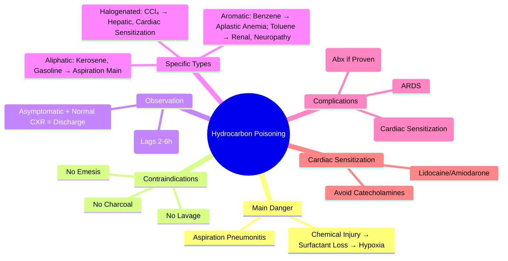

Related: [[General Principles of Poisoning Management]], [[Antidotes Overview]], [[Gastrointestinal Decontamination]], [[Sedative-Hypnotic Toxidrome]]

> [!tip]
> **Aspiration pneumonitis** = main danger (NOT systemic toxicity). **NEVER induce emesis, NO gastric lavage, NO activated charcoal** — **increases aspiration risk**. **CXR changes lag 2-6h** — observe 6h. **Systemic toxicity rare** (CNS depression, arrhythmias with halogenated/aromatic). Key FCPS/MRCP: **aspiration = main risk**; observe 6h, CXR at 6h; **NO emesis/lavage/charcoal**; supportive; antibiotics only if secondary infection.

## 1. Learning Objectives
- Recognize hydrocarbon aspiration syndrome
- Understand why decontamination is contraindicated
- Apply observation and imaging protocol
- Differentiate specific hydrocarbon types (halogenated, aromatic)

## 2. Definition
Hydrocarbon poisoning = toxicity from ingestion/aspiration of petroleum distillates and related compounds causing **chemical pneumonitis** (primary) and **systemic CNS/cardiac toxicity** (secondary, rare).

## 3. Core Physiology
- **Physical properties**: **low viscosity**, **low surface tension**, **high volatility** → **easily aspirated** even with small volumes
- **Aspiration pneumonitis**: **chemical injury** to alveolar epithelium → inflammation, surfactant disruption, V/Q mismatch → **hypoxia** (peaks 4-6h)
- **Systemic absorption**: minimal for aliphatic; higher for **halogenated** (CCl₄, TCE) and **aromatic** (benzene, toluene, xylene) → **CNS depression, cardiac sensitization, hepatic/renal toxicity**
- **Volatility**: exhaled via lungs → characteristic odor on breath

## 4. Clinical Features

### Aspiration Pneumonitis (Main Complication)
- **Onset**: coughing, choking, gagging **during/immediately after** ingestion
- **Respiratory**: tachypnea, hypoxia, grunting, retractions, **crackles/rhonchi**, cyanosis
- **CXR**: **bilateral lower lobe infiltrates** (peaks 2-6h, may lag initial presentation)
- **Timing**: **symptoms within 30 min** if significant aspiration; **CXR changes lag 2-6h**

### Systemic Toxicity (Rare, Halogenated/Aromatic)
- **CNS**: headache, dizziness, euphoria, confusion, **seizures**, coma
- **Cardiac**: **"sudden sniffing death"** — **cardiac sensitization to catecholamines** → **VF** (halogenated: CCl₄, TCE; aromatic: toluene)
- **Hepatic**: centrilobular necrosis (CCl₄, chloroform)
- **Renal**: tubular necrosis (toluene, CCl₄)
- **Hematologic**: **aplastic anemia, leukemia** (benzene chronic)
- **Peripheral neuropathy**: n-hexane, toluene (chronic)

## 5. Specific Hydrocarbon Types

| Type | Examples | Key Toxicity |
|------|----------|--------------|
| **Aliphatic** (straight/branched chain) | Kerosene, gasoline, diesel, lamp oil, mineral oil | **Aspiration pneumonitis** (main); minimal systemic |
| **Halogenated** | Carbon tetrachloride, trichloroethylene, perchloroethylene, chloroform | **Hepatic necrosis (CCl₄), renal, cardiac sensitization → VF** |
| **Aromatic** | Benzene, toluene, xylene | **CNS depression, cardiac sensitization → VF, aplastic anemia/leukemia (benzene chronic)** |
| **Pine oil / Turpentine** | | GI irritation, aspiration, CNS depression |

## 6. Differential Diagnosis
- **Other aspiration**: food, gastric contents (similar pneumonitis)
- **Chemical pneumonitis** from other agents (chlorine, smoke)
- **Community-acquired pneumonia**: fever, productive cough, infiltrate (later onset)
- **Cardiac arrest**: "sudden sniffing death" (halogenated/aromatic)

## 7. Investigations
- **CXR**: **baseline then at 6h** — bilateral lower lobe infiltrates (aspiration); **normal initial CXR ≠ excludes aspiration** (lags 2-6h)
- **ABG/VBG**: hypoxia, respiratory acidosis
- **ECG**: arrhythmias (halogenated/aromatic)
- **LFTs, renal function**: if halogenated/aromatic
- **CBC**: leukocytosis (pneumonitis), anemia (benzene chronic)
- **Paracetamol level** (always)

## 8. Management

### 1. **NEVER** (Absolute Contraindications)
- **NO emesis** — **increases aspiration risk**
- **NO gastric lavage** — **increases aspiration risk**
- **NO activated charcoal** — **does not adsorb hydrocarbons well; increases aspiration risk if vomited**
- **NO neutralization** (not applicable)

### 2. Supportive Care (Mainstay)
- **Airway**: protect if coughing, choking, altered mental status — **intubate if respiratory failure**
- **Breathing**: **O₂**, **NIV/CPAP** for hypoxia, **mechanical ventilation** with PEEP if severe ARDS
- **Circulation**: fluids, vasopressors if needed
- **Position**: **head elevated 30°** (reduce aspiration risk)

### 3. Observation Protocol
- **Asymptomatic + normal CXR at 6h** → **discharge** (with return precautions)
- **Symptomatic OR abnormal CXR** → **admit** (obs 24-48h until resolving)
- **CXR at 6h mandatory** for all significant ingestions (even if asymptomatic initially)

### 4. Specific Complications
- **Secondary bacterial pneumonia** (superinfection): **antibiotics ONLY if evidence** (fever, leukocytosis, purulent sputum, new infiltrate) — NOT prophylactic
- **ARDS**: PEEP, lung-protective ventilation, prone if severe
- **Pneumothorax**: chest drain if tension
- **Cardiac arrhythmia** (halogenated/aromatic): **avoid catecholamines** (β-agonists); **lidocaine** or **amiodarone** for VF; **β-blockers** controversial (avoid if possible)
- **Hepatic/renal failure** (CCl₄, toluene): supportive, dialysis if needed

### 5. Decontamination
- **Skin**: remove contaminated clothing, wash with soap/water
- **Eyes**: copious irrigation 15+ min
- **GI**: **NO emesis, NO lavage, NO charcoal**

## 9. Complications
- **Chemical pneumonitis** → ARDS → respiratory failure
- **Secondary bacterial pneumonia**
- **Pneumothorax/pneumomediastinum**
- **Cardiac arrhythmia** (sudden sniffing death)
- **Hepatic/renal failure** (halogenated/aromatic)
- **Chronic neurological** (peripheral neuropathy, cognitive — chronic toluene/n-hexane)

## 10. Prognosis
- **Aspiration pneumonitis**: excellent with supportive care (most resolve 3-7 days)
- **Severe ARDS**: mortality 10-20%
- **Sudden sniffing death**: high mortality
- **Chronic toxicity**: permanent neurological/hematological sequelae

## 11. FCPS/MRCP High-Yield Points
1. **Aspiration pneumonitis = main danger** (not systemic toxicity)
2. **NEVER**: emesis, gastric lavage, activated charcoal — **all increase aspiration risk**
3. **CXR at 6h mandatory** — changes lag 2-6h; normal initial ≠ excludes
4. **Observe 6h** — asymptomatic + normal CXR at 6h = discharge
5. **Halogenated (CCl₄) = hepatic necrosis + cardiac sensitization → VF**
6. **Aromatic (benzene) = aplastic anemia/leukemia (chronic), cardiac sensitization**
7. **Toluene = renal tubular acidosis, peripheral neuropathy (chronic)**
8. **NO prophylactic antibiotics** — only if secondary infection
9. **Cardiac sensitization** → avoid catecholamines; lidocaine/amiodarone for VF
10. **Sudden sniffing death** = VF from cardiac sensitization (halogenated/aromatic)

## 12. Common Viva Questions
1. Why no emesis/lavage/charcoal for hydrocarbons?
2. Observation protocol (CXR at 6h)
3. Halogenated vs aromatic specific toxicities
4. Cardiac sensitization and management
4. Sudden sniffing death mechanism
5. Benzene chronic toxicity

## 13. Common Confusions / Exam Traps
- **Charcoal for hydrocarbon ingestion** → NO (poor adsorption + aspiration risk)
- **Emesis to empty stomach** → NO (increases aspiration)
- **Prophylactic antibiotics** → NO (only if secondary infection)
- **Normal initial CXR = no aspiration** → NO (lags 2-6h)
- **All hydrocarbons same** → halogenated/aromatic have systemic toxicity
- **Adrenaline for VF in hydrocarbon** → NO (catecholamines worsen sensitized myocardium)

## 14. Mnemonics
- **HYDROCARBON NO-NOs**: **N**o **E**mesis, **N**o **L**avage, **N**o **C**harcoal
- **ASPIRATION RISK**: **L**ow **V**iscosity, **L**ow **S**urface **T**ension, **H**igh **V**olatility
- **HALOGENATED**: **C**Cl₄ = **H**epatic **N**ecrosis, **C**ardiac **S**ensitization
- **AROMATIC**: **B**enzene = **A**plastic **A**nemia, **L**eukemia; **T**oluene = **R**enal, **N**europathy
- **OBSERVATION**: **6h** CXR, **Asymptomatic** + **Normal CXR** = **Discharge**
- **VF IN HYDROCARBON**: **N**o **C**atecholamines, **L**idocaine/**A**miodarone

## 15. Mind Map


## 16. Flowchart
```mermaid
flowchart TD
  A[Hydrocarbon Ingestion] --> B[ABCDE: Assess Aspiration\nCoughing/Choking/Hypoxia?]
  B -->|Yes| C[Airway Protection\nO2, CPAP/NIV, Intubate if Severe\nHead Elevated 30°]
  B -->|No| D[Observe]
  C --> E[CXR at 6h Mandatory\n(Even if Asymptomatic Initially)]
  D --> E
  E --> F{CXR Abnormal or\nSymptomatic at 6h?}
  F -->|Yes| G[Admit\nSupportive: O2, Ventilation if Needed\nFluids, Monitor\nAbx ONLY if Secondary Infection]
  F -->|No| H[Discharge with Return Precautions]
  G --> I{Halogenated/Aromatic?}
  I -->|Yes| J[Monitor ECG for Arrhythmias\nAvoid Catecholamines\nLidocaine/Amiodarone for VF\nLFTs, Renal Function]
  I -->|No| K[Continue Supportive]
  J --> K
  K --> L[Discharge When Stable\nCXR Clearing\nNo Respiratory Distress]
```

## 17. Suggested Visuals / Image Notes
- Hydrocarbon aspiration CXR progression (0h, 2h, 6h, 24h)
- Cardiac sensitization mechanism
- Observation protocol card

## 18. Suggested Video References
- Hydrocarbon aspiration management (Toxbase, Pediatric Toxicology)

## 19. One-Page Revision Summary
- **Aspiration pneumonitis = main danger** (chemical injury → surfactant loss → hypoxia)
- **NEVER**: emesis, lavage, charcoal — all increase aspiration
- **CXR at 6h mandatory** — lags 2-6h; normal initial ≠ excludes
- **Observe 6h**: asymptomatic + normal CXR = discharge
- **Halogenated (CCl₄)**: hepatic necrosis + cardiac sensitization → VF
- **Aromatic (benzene)**: aplastic anemia/leukemia (chronic); toluene: renal, neuropathy
- **Cardiac sensitization**: avoid catecholamines; lidocaine/amiodarone for VF
- **No prophylactic antibiotics** — only if secondary infection
- **Sudden sniffing death** = VF from cardiac sensitization

## 24-Hour Recall Prompts
- State 3 contraindications for hydrocarbon ingestion
- Explain why CXR at 6h (not immediately)
- List halogenated vs aromatic specific toxicities
- Explain cardiac sensitization management

## 7-Day / 15-Day / 30-Day Revision Tracker
- [ ] Day 1 completed
- [ ] 24-hour recall completed
- [ ] Day 7 revision completed
- [ ] Day 15 revision completed
- [ ] Day 30 revision completed

## 20. Must Know / Should Know / Nice to Know
### Must Know
- Aspiration pneumonitis = main danger
- NO emesis, NO lavage, NO charcoal
- CXR at 6h (lags 2-6h)
- Observe 6h, asymptomatic + normal CXR = discharge
- Halogenated = hepatic + VF; Aromatic = benzene anemia/leukemia
- Cardiac sensitization → avoid catecholamines
- No prophylactic antibiotics

### Should Know
- Sudden sniffing death mechanism
- Toluene renal tubular acidosis, neuropathy
- ARDS management
- Skin/eye decontamination

### Nice to Know
- n-hexane peripheral neuropathy
- Benzene leukemogenesis mechanism
- Specific aliphatic chain length toxicity
- Chronic vs acute Differentiation

## 21. Self-Test Scorecard
- Understanding: /10
- Recall: /10
- MCQ Performance: /10
- SBA Performance: /10
- Viva Confidence: /10
- Total: /50

> [!tip]
> Interpretation: <35 = weak topic, 35-44 = acceptable but insecure, 45+ = strong exam-ready topic.

## 22. Exam Answer Modes
### Long Answer Skeleton
- Physical properties → aspiration risk
- Contraindications (emesis, lavage, charcoal)
- Observation protocol (CXR at 6h)
- Specific hydrocarbon toxicities table
- Cardiac sensitization mechanism and management
- Complications and prognosis

### Short Note Skeleton
- Contraindications box
- Observation protocol card
- Hydrocarbon types table
- Cardiac sensitization box

### Viva One-Liners
- "Hydrocarbon: aspiration pneumonitis = main danger"
- "NEVER: emesis, lavage, charcoal for hydrocarbons"
- "CXR at 6h mandatory (lags 2-6h)"
- "Observe 6h: asymptomatic + normal CXR = discharge"
- "Halogenated: CCl₄ = hepatic necrosis + cardiac sensitization"
- "Aromatic: benzene = aplastic anemia/leukemia; toluene = renal/neuropathy"
- "Cardiac sensitization: NO catecholamines; lidocaine/amiodarone for VF"
- "No prophylactic antibiotics for pneumonitis"
- "Sudden sniffing death = VF from cardiac sensitization"

### Ward-Case Discussion Points
- Child drank kerosene, coughing → observe 6h, CXR at 6h, no charcoal
- Teenager "huffing" toluene, cardiac arrest → lidocaine, no adrenaline
- Worker with CCl₄ exposure, jaundice → hepatic necrosis, monitor LFTs
- Chronic benzene exposure → CBC for aplastic anemia/leukemia

### Last-Night-Before-Exam Sheet
- Main: Aspiration Pneumonitis
- NO: Emesis, Lavage, Charcoal
- CXR: 6h (Lags)
- Obs: 6h, Discharge if Normal
- Halogenated: Hepatic + VF
- Aromatic: Benzene = Anemia/Leukemia
- Cardiac Sensitization: No Adrenaline, Lido/Amiodarone
- No Prophylactic Abx

## 23. Summary
Hydrocarbon poisoning = **aspiration pneumonitis** (main danger). **NEVER emesis, lavage, charcoal**. **CXR at 6h mandatory** (lags 2-6h). **Observe 6h**: asymptomatic + normal CXR = discharge. **Halogenated** (CCl₄): hepatic necrosis + **cardiac sensitization → VF**. **Aromatic** (benzene): aplastic anemia/leukemia; toluene: renal tubular acidosis, neuropathy. **Cardiac sensitization**: avoid catecholamines; **lidocaine/amiodarone for VF**. No prophylactic antibiotics. Sudden sniffing death = VF from sensitization.

## 24. MCQs (10)
1. Question 1
   A. Option A
   B. Option B
   C. Option C
   D. Option D
   **Answer: A**
   *Explanation: Explanation 1*

2. Question 2
   A. Option A
   B. Option B
   C. Option C
   D. Option D
   **Answer: B**
   *Explanation: Explanation 2*

3. Question 3
   A. Option A
   B. Option B
   C. Option C
   D. Option D
   **Answer: C**
   *Explanation: Explanation 3*

4. Question 4
   A. Option A
   B. Option B
   C. Option C
   D. Option D
   **Answer: D**
   *Explanation: Explanation 4*

5. Question 5
   A. Option A
   B. Option B
   C. Option C
   D. Option D
   **Answer: A**
   *Explanation: Explanation 5*

6. Question 6
   A. Option A
   B. Option B
   C. Option C
   D. Option D
   **Answer: B**
   *Explanation: Explanation 6*

7. Question 7
   A. Option A
   B. Option B
   C. Option C
   D. Option D
   **Answer: C**
   *Explanation: Explanation 7*

8. Question 8
   A. Option A
   B. Option B
   C. Option C
   D. Option D
   **Answer: D**
   *Explanation: Explanation 8*

9. Question 9
   A. Option A
   B. Option B
   C. Option C
   D. Option D
   **Answer: A**
   *Explanation: Explanation 9*

10. Question 10
   A. Option A
   B. Option B
   C. Option C
   D. Option D
   **Answer: B**
   *Explanation: Explanation 10*


## 25. SBA Questions (10)
1. Scenario 1
   A. Option A
   B. Option B
   C. Option C
   D. Option D
   **Answer: A**
   *Explanation: Explanation 1*

2. Scenario 2
   A. Option A
   B. Option B
   C. Option C
   D. Option D
   **Answer: B**
   *Explanation: Explanation 2*

3. Scenario 3
   A. Option A
   B. Option B
   C. Option C
   D. Option D
   **Answer: C**
   *Explanation: Explanation 3*

4. Scenario 4
   A. Option A
   B. Option B
   C. Option C
   D. Option D
   **Answer: D**
   *Explanation: Explanation 4*

5. Scenario 5
   A. Option A
   B. Option B
   C. Option C
   D. Option D
   **Answer: A**
   *Explanation: Explanation 5*

6. Scenario 6
   A. Option A
   B. Option B
   C. Option C
   D. Option D
   **Answer: B**
   *Explanation: Explanation 6*

7. Scenario 7
   A. Option A
   B. Option B
   C. Option C
   D. Option D
   **Answer: C**
   *Explanation: Explanation 7*

8. Scenario 8
   A. Option A
   B. Option B
   C. Option C
   D. Option D
   **Answer: D**
   *Explanation: Explanation 8*

9. Scenario 9
   A. Option A
   B. Option B
   C. Option C
   D. Option D
   **Answer: A**
   *Explanation: Explanation 9*

10. Scenario 10
   A. Option A
   B. Option B
   C. Option C
   D. Option D
   **Answer: B**
   *Explanation: Explanation 10*


## 26. Flashcards
- Q: Flashcard 1 question
  A: Flashcard 1 answer
- Q: Flashcard 2 question
  A: Flashcard 2 answer
- Q: Flashcard 3 question
  A: Flashcard 3 answer
- Q: Flashcard 4 question
  A: Flashcard 4 answer
- Q: Flashcard 5 question
  A: Flashcard 5 answer
- Q: Flashcard 6 question
  A: Flashcard 6 answer
- Q: Flashcard 7 question
  A: Flashcard 7 answer
- Q: Flashcard 8 question
  A: Flashcard 8 answer
- Q: Flashcard 9 question
  A: Flashcard 9 answer
- Q: Flashcard 10 question
  A: Flashcard 10 answer
- Q: Flashcard 11 question
  A: Flashcard 11 answer
- Q: Flashcard 12 question
  A: Flashcard 12 answer
- Q: Flashcard 13 question
  A: Flashcard 13 answer
- Q: Flashcard 14 question
  A: Flashcard 14 answer
- Q: Flashcard 15 question
  A: Flashcard 15 answer

## 27. Answer Key with Explanations
### MCQs
1. **A** - Explanation 1
2. **B** - Explanation 2
3. **C** - Explanation 3
4. **D** - Explanation 4
5. **A** - Explanation 5
6. **B** - Explanation 6
7. **C** - Explanation 7
8. **D** - Explanation 8
9. **A** - Explanation 9
10. **B** - Explanation 10


### SBAs
1. **A** - Explanation 1
2. **B** - Explanation 2
3. **C** - Explanation 3
4. **D** - Explanation 4
5. **A** - Explanation 5
6. **B** - Explanation 6
7. **C** - Explanation 7
8. **D** - Explanation 8
9. **A** - Explanation 9
10. **B** - Explanation 10

## PasTest Scenario SBAs (Clinical Vignettes)

> **Auto-generated PasTest/Mediscope-style scenario SBAs** grounded in the authored source. Each scenario tests a real clinical fact (triad, specific sign, contraindication, trial, first-line Rx) extracted from the topic. *Source: Ch 11: Poisoning — Hydrocarbon Poisoning*

**Q1.** What is the most appropriate first-line therapy for Hydrocarbon Poisoning?

  - **A.** Airway + intubate if respiratory failure + Breathing
  - **B.** An advanced/surgical therapy reserved for refractory disease
  - **C.** Symptomatic treatment only, no disease-modifying therapy
  - **D.** Empiric broad-spectrum therapy without specific indication

  > **Answer: A** — Airway + intubate if respiratory failure + Breathing
  >
  > *Source:* Supportive Care (Mainstay)
- **Airway**: protect if coughing, choking, altered mental status — **intubate if respiratory failure**
- **Breathing**: **O₂**, **NIV/CPAP** for hypoxia, **mechanical venti

