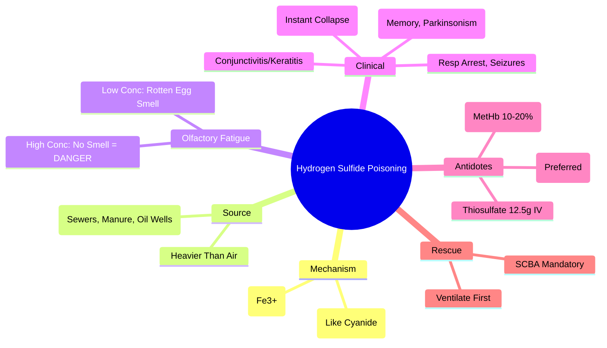

Related: [[General Principles of Poisoning Management]], [[Cyanide Poisoning]], [[Carbon Monoxide Poisoning]], [[Antidotes Overview]]

> [!tip]
> **"Rotten egg smell"** → **olfactory fatigue** at high concentrations (dangerous). **Inhibits cytochrome c oxidase** (like cyanide) → **histotoxic hypoxia**. **Nitrites** induce methemoglobinemia → binds H₂S. **Hydroxocobalamin** also effective. **Rapid collapse** ("knockdown") in confined spaces. Key FCPS/MRCP: smell = low conc, NO smell = high conc/olfactory fatigue; nitrite therapy; hydroxocobalamin; confined space rescue protocols.

## 1. Learning Objectives
- Recognize H₂S poisoning (rotten egg smell, rapid collapse, histotoxic hypoxia)
- Understand olfactory fatigue danger
- Apply nitrite and hydroxocobalamin therapy
- Implement confined space rescue protocols

## 2. Definition
Hydrogen sulfide poisoning = toxicity from H₂S gas causing **cytochrome c oxidase inhibition** (Complex IV) → **histotoxic hypoxia**, respiratory depression, and rapid cardiovascular collapse.

## 3. Core Physiology
- **Mechanism**: H₂S binds **ferric iron (Fe³⁺)** in **cytochrome c oxidase** → **inhibits mitochondrial respiration** → **histotoxic hypoxia** (identical to cyanide)
- **Source**: **confined spaces** (sewers, manure pits, oil/gas wells, paper mills, tanneries), **volcanoes**, **bacterial decomposition** of organic matter
- **Gas properties**: **heavier than air** → accumulates in low-lying areas; **flammable**
- **Olfactory fatigue**: **smell at low conc (0.01-0.1 ppm), loss of smell at > 100-150 ppm** → **NO smell = HIGH concentration = DANGER**
- **Rapid absorption**: pulmonary → systemic within seconds

## 4. Clinical Features

### Acute (High Concentration > 500 ppm)
- **"Knockdown"**: **instant collapse**, respiratory arrest, cardiac arrest within **seconds-minutes**
- **Seizures**, fixed dilated pupils
- **No warning smell** (olfactory fatigue)
- **Death** within minutes without intervention

### Subacute (Moderate 50-500 ppm)
- **Rotten egg smell** (present)
- **Respiratory**: dyspnea, pulmonary edema, chemical pneumonitis
- **Neurological**: headache, dizziness, confusion, ataxia, **memory loss**, seizures
- **Ocular**: **conjunctivitis**, keratitis ("gas eye"), photophobia
- **Cardiac**: arrhythmias, hypotension, ischemia

### Chronic (Low < 50 ppm)
- Fatigue, headache, irritability, memory impairment, **olfactory loss**

## 5. Differential Diagnosis
- **Cyanide**: bitter almond smell, same mechanism, fire victims
- **CO**: headache, cherry-red skin, no rotten egg smell
- **Organophosphate**: secretions, miosis, fasciculations
- **H₂S vs CN**: both inhibit cytochrome oxidase; H₂S = rotten egg smell (low conc), CN = bitter almond

## 6. Investigations
- **ABG/VBG**: severe metabolic acidosis, high lactate
- **ECG**: arrhythmias, ischemia
- **CXR**: pulmonary edema, chemical pneumonitis
- **Co-oximetry**: methemoglobin if nitrite given
- **Sulfide level**: blood/urine (not routinely available)
- **Thiosulfate level**: if nitrite given
- **Paracetamol level** (always)

## 7. Management

### 1. **RESCUE PROTOCOL** — **DO NOT ENTER CONFINED SPACE WITHOUT SCBA**
- **Self-contained breathing apparatus (SCBA) MANDATORY** for rescuers
- **Ventilate** area before entry if possible
- **Remove victim** to fresh air immediately

### 2. ABCDE — **Airway Priority**
- **Intubate early** for respiratory depression/coma
- **100% O₂** via NRB or ventilator
- **Fluids + vasopressors** for hypotension

### 3. Antidotes

#### **Sodium Nitrite** (Induces Methemoglobinemia)
- **Mechanism**: methemoglobin (Fe³⁺) binds H₂S → sulfhemoglobin
- **Dose**: **300 mg (10 mL of 3%) IV** over 5-10 min
- **Target MetHb**: 10-20% (monitor continuously)
- **Contraindicated**: anemia, G6PD deficiency, cardiovascular disease, **CO co-exposure** (MetHb + COHb = fatal hypoxia)

#### **Hydroxocobalamin** (Preferred if Available)
- **Mechanism**: direct binding → cyanocobalamin
- **Dose**: **5 g IV** over 15 min (Cyanokit)
- **Advantages**: **no methemoglobinemia**, safe in CO co-exposure, no Hb interference
- **Same as cyanide protocol**

#### **Sodium Thiosulfate** (Adjunct)
- **Dose**: **12.5 g (50 mL of 25%) IV** over 10-20 min
- **Mechanism**: sulfur donor for rhodanese → thiocyanate

### 4. Supportive Care
- **Pulmonary edema**: PEEP, diuretics if fluid overloaded
- **Seizures**: benzodiazepines
- **Ocular exposure**: copious irrigation 15+ min, ophthalmology referral
- **Skin decontamination**: remove clothes, wash with soap/water

## 8. Complications
- **Delayed neurological sequelae** (DNS): memory loss, parkinsonism, cerebellar signs (2-40 days)
- **Persistent pulmonary fibrosis**
- **Chronic encephalopathy**
- **Cardiac arrhythmias**
- **Death** (rapid if high concentration)

## 9. Prognosis
- **Good if rescued early** from low-moderate exposure
- **Poor if "knockdown" + cardiac arrest** (high mortality)
- **DNS** in 10-30% survivors

## 10. FCPS/MRCP High-Yield Points
1. **Rotten egg smell at low conc; NO smell at high conc (olfactory fatigue) = DANGER**
2. **Confined spaces** (sewers, manure pits, oil wells) = typical setting
3. **"Knockdown" = instant collapse** at > 500 ppm
4. **Mechanism**: cytochrome c oxidase inhibition (same as cyanide)
5. **Nitrite 300mg IV** → induces MetHb 10-20% (binds H₂S)
6. **Hydroxocobalamin 5g IV** = preferred (no MetHb, safe in CO)
7. **SCBA mandatory** for rescuers — **do not become second victim**
8. **Delayed neurological sequelae** (DNS): memory loss, parkinsonism
9. **Ocular**: conjunctivitis, keratitis ("gas eye")
10. **Thiosulfate adjunct** for both nitrite and hydroxocobalamin

## 11. Common Viva Questions
1. Olfactory fatigue and its danger
2. Nitrite dosing and MetHb target
3. Hydroxocobalamin advantages over nitrite
3. Confined space rescue protocol
4. Delayed neurological sequelae
5. Differentiate from cyanide

## 12. Common Confusions / Exam Traps
- **Smell present = safe** → WRONG, smell means low conc; NO smell = high conc = deadly
- **Nitrite safe in all** → NO (anemia, G6PD, CO co-exposure, CV disease)
- **Enter confined space to rescue** → NO without SCBA
- **H₂S lighter than air** → NO, heavier than air (accumulates low)
- **Same as cyanide treatment exactly** → nitrite contributes to MetHb; hydroxocobalamin preferred

## 13. Mnemonics
- **H2S SMELL**: **L**ow conc = **S**mell; **H**igh conc = **N**o **S**mell (**O**lfactory **F**atigue)
- **KNOCKDOWN**: **K**nockdown = **I**nstant **C**ollapse > 500 ppm
- **NITRITE**: **3**00mg IV → **M**etHb **1**0-**2**0%
- **CONFINED SPACE**: **S**CBA **M**andatory **D**o **N**ot **E**nter **A**lone
- **DNS**: **D**elayed **N**eurological **S**equelae (Memory, Parkinsonism)

## 14. Mind Map


## 15. Flowchart
```mermaid
flowchart TD
  A[Confined Space + Collapse +\nRotten Egg Smell (or NO smell)] --> B[H2S Poisoning]
  B --> C[RESCUE: SCBA Mandatory\nDO NOT ENTER WITHOUT SCBA\nVentilate If Possible]
  C --> D[Remove to Fresh Air\nABCDE: Intubate, 100% O2\nFluids + Vasopressors]
  D --> E{Hydroxocobalamin Available?}
  E -->|Yes| F[Hydroxocobalamin 5g IV\nOver 15 min\n+ Thiosulfate 12.5g IV]
  E -->|No| G{Nitrite Indicated?\nNo Anemia/G6PD/CO/CV Disease}
  G -->|Yes| H[Nitrite 300mg IV\nTarget MetHb 10-20%\n+ Thiosulfate 12.5g IV]
  G -->|No| I[Supportive Only\n100% O2, Ventilation]
  F --> J[Monitor: MetHb (if nitrite),\nECG, Neurological\nOphthalmology for Eyes]
  H --> J
  I --> J
  J --> K[DNS Follow-up 4-6 Weeks\nMemory, Parkinsonism Screen]
```

## 16. Suggested Visuals / Image Notes
- Olfactory fatigue curve (conc vs smell)
- Confined space rescue protocol
- Nitrite vs hydroxocobalamin comparison

## 17. Suggested Video References
- H₂S confined space rescue training
- Nitrite vs hydroxocobalamin comparison

## 18. One-Page Revision Summary
- **Rotten egg smell = low conc; NO smell = high conc (olfactory fatigue) = DANGER**
- **Confined spaces** (sewers, manure pits) = typical setting
- **"Knockdown"** = instant collapse > 500 ppm
- **Mechanism**: cytochrome oxidase inhibition (like cyanide)
- **Hydroxocobalamin 5g IV** = preferred (no MetHb)
- **Nitrite 300mg IV** → MetHb 10-20% (avoid if anemia/G6PD/CO/CV disease)
- **SCBA mandatory** for rescue
- **DNS**: memory loss, parkinsonism (2-40 days)
- **Ocular**: conjunctivitis, keratitis
- **Thiosulfate** adjunct

## 24-Hour Recall Prompts
- Explain olfactory fatigue danger
- State nitrite dose and MetHb target
- Explain why hydroxocobalamin preferred over nitrite
- Describe confined space rescue protocol

## 7-Day / 15-Day / 30-Day Revision Tracker
- [ ] Day 1 completed
- [ ] 24-hour recall completed
- [ ] Day 7 revision completed
- [ ] Day 15 revision completed
- [ ] Day 30 revision completed

## 19. Must Know / Should Know / Nice to Know
### Must Know
- Rotten egg smell = low conc; NO smell = high conc (olfactory fatigue)
- Confined spaces = typical setting
- Knockdown = instant collapse
- Hydroxocobalamin 5g IV preferred
- Nitrite 300mg IV → MetHb 10-20% (contraindications)
- SCBA mandatory for rescue
- DNS: memory loss, parkinsonism

### Should Know
- Thiosulfate adjunct for both antidotes
- Ocular: conjunctivitis, keratitis
- Heavier than air
- Pulmonary edema management

### Nice to Know
- Chronic low-level exposure effects
- Specific industrial sources
- Rhodanese pathway details
- Comparison with cyanide in detail

## 20. Self-Test Scorecard
- Understanding: /10
- Recall: /10
- MCQ Performance: /10
- SBA Performance: /10
- Viva Confidence: /10
- Total: /50

> [!tip]
> Interpretation: <35 = weak topic, 35-44 = acceptable but insecure, 45+ = strong exam-ready topic.

## 21. Exam Answer Modes
### Long Answer Skeleton
- Mechanism (cytochrome oxidase, histotoxic hypoxia)
- Source/setting (confined spaces, heavier than air)
- Olfactory fatigue danger
- Clinical (knockdown, ocular, DNS)
- Antidotes: hydroxocobalamin > nitrite (contraindications)
- Rescue protocol (SCBA mandatory)
- Complications (DNS, pulmonary fibrosis)

### Short Note Skeleton
- Olfactory fatigue box
- Nitrite vs hydroxocobalamin table
- Confined space rescue protocol
- DNS features

### Viva One-Liners
- "H₂S: rotten egg smell low conc; NO smell high conc (olfactory fatigue)"
- "Knockdown = instant collapse > 500 ppm"
- "Hydroxocobalamin 5g IV preferred (no MetHb, safe in CO)"
- "Nitrite 300mg IV → MetHb 10-20%; NO if anemia/G6PD/CO/CV disease"
- "SCBA mandatory for rescue — do not become second victim"
- "DNS: memory loss, parkinsonism (2-40 days)"
- "Ocular: conjunctivitis, keratitis (gas eye)"
- "Heavier than air — accumulates in low areas"
- "Thiosulfate adjunct for both antidotes"

### Ward-Case Discussion Points
- Sewer worker collapse → SCBA rescue, hydroxocobalamin, 100% O₂
- Farmer in manure pit → same protocol, consider DNS follow-up
- Oil rig worker with eye irritation → irrigation, ophthalmology, hydroxocobalamin

### Last-Night-Before-Exam Sheet
- Smell = Low Conc, NO Smell = High Conc (Olfactory Fatigue)
- Knockdown = Instant Collapse
- Hydroxocobalamin 5g > Nitrite
- Nitrite: 300mg, MetHb 10-20%, NO Anemia/G6PD/CO
- SCBA Mandatory
- DNS: Memory, Parkinsonism
- Ocular: Conjunctivitis

## 22. Summary
Hydrogen sulfide poisoning = cytochrome oxidase inhibition → histotoxic hypoxia (like cyanide). **Rotten egg smell at low conc; NO smell at high conc (olfactory fatigue) = DANGER**. Confined spaces typical. **Knockdown** = instant collapse > 500 ppm. **Hydroxocobalamin 5g IV preferred**; nitrite 300mg IV → MetHb 10-20% (contraindicated in anemia/G6PD/CO/CV disease). **SCBA mandatory for rescue**. DNS: memory loss, parkinsonism. Ocular: conjunctivitis/keratitis.

## 23. MCQs (10)
1. Question 1
   A. Option A
   B. Option B
   C. Option C
   D. Option D
   **Answer: A**
   *Explanation: Explanation 1*

2. Question 2
   A. Option A
   B. Option B
   C. Option C
   D. Option D
   **Answer: B**
   *Explanation: Explanation 2*

3. Question 3
   A. Option A
   B. Option B
   C. Option C
   D. Option D
   **Answer: C**
   *Explanation: Explanation 3*

4. Question 4
   A. Option A
   B. Option B
   C. Option C
   D. Option D
   **Answer: D**
   *Explanation: Explanation 4*

5. Question 5
   A. Option A
   B. Option B
   C. Option C
   D. Option D
   **Answer: A**
   *Explanation: Explanation 5*

6. Question 6
   A. Option A
   B. Option B
   C. Option C
   D. Option D
   **Answer: B**
   *Explanation: Explanation 6*

7. Question 7
   A. Option A
   B. Option B
   C. Option C
   D. Option D
   **Answer: C**
   *Explanation: Explanation 7*

8. Question 8
   A. Option A
   B. Option B
   C. Option C
   D. Option D
   **Answer: D**
   *Explanation: Explanation 8*

9. Question 9
   A. Option A
   B. Option B
   C. Option C
   D. Option D
   **Answer: A**
   *Explanation: Explanation 9*

10. Question 10
   A. Option A
   B. Option B
   C. Option C
   D. Option D
   **Answer: B**
   *Explanation: Explanation 10*


## 24. SBA Questions (10)
1. Scenario 1
   A. Option A
   B. Option B
   C. Option C
   D. Option D
   **Answer: A**
   *Explanation: Explanation 1*

2. Scenario 2
   A. Option A
   B. Option B
   C. Option C
   D. Option D
   **Answer: B**
   *Explanation: Explanation 2*

3. Scenario 3
   A. Option A
   B. Option B
   C. Option C
   D. Option D
   **Answer: C**
   *Explanation: Explanation 3*

4. Scenario 4
   A. Option A
   B. Option B
   C. Option C
   D. Option D
   **Answer: D**
   *Explanation: Explanation 4*

5. Scenario 5
   A. Option A
   B. Option B
   C. Option C
   D. Option D
   **Answer: A**
   *Explanation: Explanation 5*

6. Scenario 6
   A. Option A
   B. Option B
   C. Option C
   D. Option D
   **Answer: B**
   *Explanation: Explanation 6*

7. Scenario 7
   A. Option A
   B. Option B
   C. Option C
   D. Option D
   **Answer: C**
   *Explanation: Explanation 7*

8. Scenario 8
   A. Option A
   B. Option B
   C. Option C
   D. Option D
   **Answer: D**
   *Explanation: Explanation 8*

9. Scenario 9
   A. Option A
   B. Option B
   C. Option C
   D. Option D
   **Answer: A**
   *Explanation: Explanation 9*

10. Scenario 10
   A. Option A
   B. Option B
   C. Option C
   D. Option D
   **Answer: B**
   *Explanation: Explanation 10*


## 25. Flashcards
- Q: Flashcard 1 question
  A: Flashcard 1 answer
- Q: Flashcard 2 question
  A: Flashcard 2 answer
- Q: Flashcard 3 question
  A: Flashcard 3 answer
- Q: Flashcard 4 question
  A: Flashcard 4 answer
- Q: Flashcard 5 question
  A: Flashcard 5 answer
- Q: Flashcard 6 question
  A: Flashcard 6 answer
- Q: Flashcard 7 question
  A: Flashcard 7 answer
- Q: Flashcard 8 question
  A: Flashcard 8 answer
- Q: Flashcard 9 question
  A: Flashcard 9 answer
- Q: Flashcard 10 question
  A: Flashcard 10 answer
- Q: Flashcard 11 question
  A: Flashcard 11 answer
- Q: Flashcard 12 question
  A: Flashcard 12 answer
- Q: Flashcard 13 question
  A: Flashcard 13 answer
- Q: Flashcard 14 question
  A: Flashcard 14 answer
- Q: Flashcard 15 question
  A: Flashcard 15 answer

## 26. Answer Key with Explanations
### MCQs
1. **A** - Explanation 1
2. **B** - Explanation 2
3. **C** - Explanation 3
4. **D** - Explanation 4
5. **A** - Explanation 5
6. **B** - Explanation 6
7. **C** - Explanation 7
8. **D** - Explanation 8
9. **A** - Explanation 9
10. **B** - Explanation 10


### SBAs
1. **A** - Explanation 1
2. **B** - Explanation 2
3. **C** - Explanation 3
4. **D** - Explanation 4
5. **A** - Explanation 5
6. **B** - Explanation 6
7. **C** - Explanation 7
8. **D** - Explanation 8
9. **A** - Explanation 9
10. **B** - Explanation 10