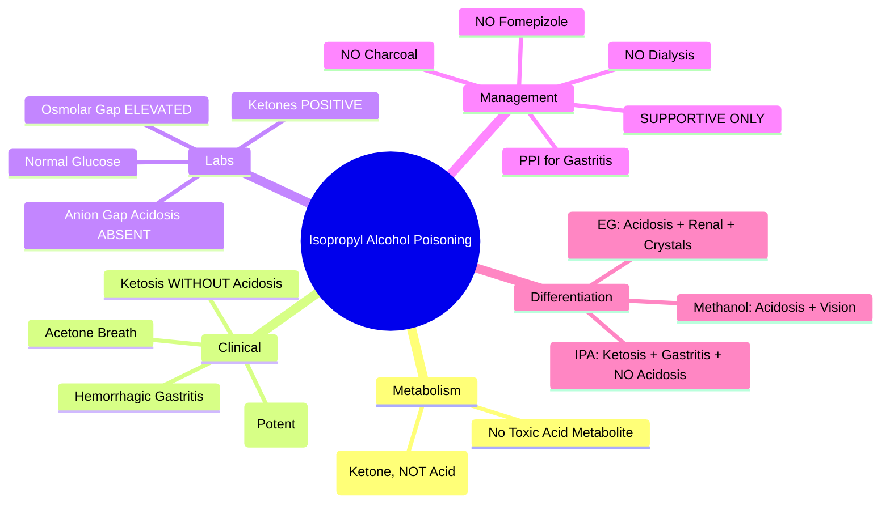
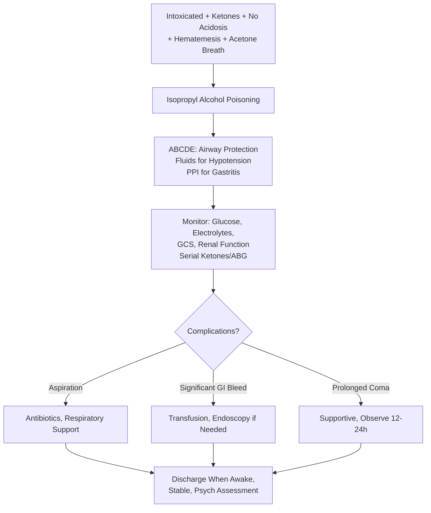

Related: [[General Principles of Poisoning Management]], [[Methanol Poisoning]], [[Ethylene Glycol Poisoning]], [[Antidotes Overview]], [[Sedative-Hypnotic Toxidrome]]

> [!tip]
> **Isopropyl alcohol → acetone** (ketone, not acid). **Ketosis WITHOUT metabolic acidosis** = hallmark. **CNS depression + hemorrhagic gastritis**. **NO fomepizole, NO dialysis** (acetone dialyzable but not needed). Supportive care only. Key FCPS/MRCP: differentiate from methanol/EG by **ketonemia/ketonuria WITHOUT anion gap acidosis**; osmolar gap present; smell of acetone/rubbing alcohol; hemorrhagic gastritis.

## 1. Learning Objectives
- Recognize isopropyl alcohol poisoning (ketosis without acidosis, hemorrhagic gastritis, CNS depression)
- Differentiate from methanol and ethylene glycol poisoning
- Understand why fomepizole and dialysis are NOT indicated
- Provide supportive care

## 2. Definition
Isopropyl alcohol poisoning = toxicity from isopropanol (rubbing alcohol, hand sanitizers, solvents) metabolized to **acetone**, causing **CNS depression, ketosis without metabolic acidosis, and hemorrhagic gastritis**.

## 3. Core Physiology
- **Metabolism**: Isopropyl alcohol → (ADH) → **Acetone** (ketone)
- **Acetone**:
  - **NOT an acid** → **no metabolic acidosis** (vs methanol formic acid, EG glycolic acid)
  - **Ketone** → **ketonemia, ketonuria** (positive nitroprusside test)
  - CNS depressant (contributes to sedation)
  - Excreted renally and via lungs (fruity/acetone breath)
- **Isopropyl alcohol itself**: potent CNS depressant (2-3x ethanol), GI irritant
- **No toxic acid metabolite** → **fomepizole NOT indicated**, **dialysis NOT indicated** (acetone dialyzable but low toxicity)

## 4. Clinical Features
- **CNS depression** (rapid, profound — "drunk" but more severe)
- **Ketosis WITHOUT metabolic acidosis** — **HALLMARK**
- **Hemorrhagic gastritis** — hematemesis, melena, abdominal pain (direct irritation)
- **Acetone breath** (fruity, nail polish remover smell)
- **Hypotension** (vasodilation)
- **Hypothermia**
- **No visual loss** (vs methanol)
- **No renal failure/crystals** (vs ethylene glycol)
- **No significant anion gap metabolic acidosis** (may have mild lactic from hypotension)

## 5. Differential Diagnosis
| Feature | Isopropyl Alcohol | Methanol | Ethylene Glycol |
|---------|-------------------|----------|-----------------|
| **Metabolic acidosis** | **NO** (ketosis only) | YES (formic acid) | YES (glycolic acid) |
| **Ketones** | **YES** (acetone) | No | No |
| **Visual loss** | No | **YES** | No |
| **Renal failure** | No | Late | **YES** (oxalate) |
| **Crystalluria** | No | No | **YES** (Ca oxalate) |
| **Gastritis** | **Hemorrhagic** | Mild | Mild |
| **Fomepizole** | **NO** | YES | YES |
| **Dialysis** | **NO** | YES | YES |

## 6. Investigations
- **Ketones** (serum/urine) — **positive** (acetoacetate/β-hydroxybutyrate negative, acetone positive on nitroprusside)
- **ABG/VBG** — **NO anion gap metabolic acidosis** (pH normal or mild respiratory depression)
- **Osmolality** — **elevated osmolar gap** (parent alcohol)
- **Isopropyl alcohol level** (if available) > 50 mg/dL toxic
- **Acetone level** — correlates with ketosis
- **Glucose** — normal (vs DKA)
- **Paracetamol level** (always)
- **CXR** — aspiration risk
- **ECG**

## 7. Management

### 1. Supportive Care (ONLY — No Antidote, No Dialysis)
- **Airway**: protect if GCS < 8 — intubation
- **Breathing**: O₂, ventilate if needed
- **Circulation**: fluids for hypotension
- **GI**: PPI/H2 blocker for hemorrhagic gastritis; blood transfusion if significant bleed
- **Monitor**: glucose, electrolytes, renal function, GCS

### 2. Decontamination
- **Activated charcoal**: **NOT effective** (poor adsorption of alcohols)
- **Gastric lavage**: contraindicated (hemorrhagic gastritis risk, aspiration)
- **Emesis**: contraindicated

### 3. NO Fomepizole
- **Reason**: acetone is not toxic; fomepizole would prolong isopropanol half-life → longer CNS depression

### 4. NO Dialysis
- **Reason**: acetone is dialyzable but low toxicity; isopropanol half-life short (2-3h); supportive care sufficient

### 5. Time Course
- **Peak levels**: 30-60 min
- **Half-life**: isopropanol 2-3h; acetone 7-10h
- **Recovery**: typically 6-12h with supportive care

## 8. Complications
- Aspiration pneumonia
- Significant GI hemorrhage
- Prolonged CNS depression
- Hypothermia
- Rhabdomyolysis (prolonged immobilization)

## 9. Prognosis
- **Excellent** with supportive care
- Mortality rare (< 1%)
- Full recovery expected

## 10. FCPS/MRCP High-Yield Points
1. **Ketosis WITHOUT metabolic acidosis** = hallmark (vs methanol/EG)
2. **Hemorrhagic gastritis** = characteristic (hematemesis, melena)
3. **Acetone breath** (fruity/nail polish remover)
4. **NO fomepizole** (acetone not toxic, would prolong CNS depression)
5. **NO dialysis** (not needed)
6. **Osmolar gap present** (parent alcohol)
7. **Powerful CNS depressant** (2-3x ethanol)
8. **Differentiate**: Methanol=acidosis+visual, EG=acidosis+renal+crystals, IPA=ketosis no acidosis+gastritis
9. **Charcoal NOT effective** for alcohols
10. **Half-life short** (2-3h isopropanol, 7-10h acetone)

## 11. Common Viva Questions
1. Key differentiating feature of IPA vs methanol/EG
2. Why no fomepizole?
3. Why no dialysis?
4. Clinical features (ketosis, gastritis, CNS depression)
5. Investigation findings (ketones + no acidosis + osmolar gap)
6. Management (supportive only)

## 12. Common Confusions / Exam Traps
- **Ketosis = metabolic acidosis** → NO, ketosis WITHOUT anion gap acidosis
- **Fomepizole for all toxic alcohols** → NO, contraindicated in IPA
- **Dialysis for all toxic alcohols** → NO, not needed for IPA
- **Charcoal works for IPA** → NO, poor adsorption
- **DKA vs IPA** → DKA: hyperglycemia, acidosis; IPA: normal glucose, no acidosis
- **Acetone breath = DKA** → can be IPA (acetone is ketone)

## 13. Mnemonics
- **IPA HALLMARKS**: **K**etosis **NO** **A**cidosis, **H**emorrhagic **G**astritis, **A**cetone **B**reath
- **NO ANTIDOTE**: **NO** Fomepizole, **NO** Dialysis, **NO** Charcoal
- **TOXIC ALCOHOLS**: **M**ethanol = **A**cidosis + **V**ision; **E**G = **A**cidosis + **R**enal + **C**rystals; **I**PA = **K**etosis **NO** **A**cidosis + **G**astritis
- **OSMOLAR GAP**: All three have it early
- **HALF-LIFE**: IPA 2-3h, Acetone 7-10h (short)

## 14. Mind Map

## 15. Flowchart

## 16. Suggested Visuals / Image Notes
- Toxic alcohol comparison table (3 columns)
- IPA lab findings (ketones + normal pH + osmolar gap)

## 17. Suggested Video References
- Isopropyl alcohol vs methanol/EG differentiation

## 18. One-Page Revision Summary
- **Metabolite**: acetone (ketone, NOT acid)
- **Hallmark**: ketonemia/ketonuria WITHOUT anion gap metabolic acidosis
- **Hemorrhagic gastritis** (hematemesis, melena)
- **Acetone breath** (fruity)
- **NO fomepizole** (prolongs CNS depression)
- **NO dialysis** (not needed)
- **NO charcoal** (poor adsorption)
- **Supportive care only**: airway, fluids, PPI
- **Osmolar gap present** early
- **Differentiate**: Methanol=acidosis+vision, EG=acidosis+renal+crystals, IPA=ketosis+gastritis NO acidosis

## 24-Hour Recall Prompts
- State the key lab finding that differentiates IPA from methanol/EG
- List 3 clinical features of IPA poisoning
- Explain why fomepizole is contraindicated
- Explain why dialysis is not indicated

## 7-Day / 15-Day / 30-Day Revision Tracker
- [ ] Day 1 completed
- [ ] 24-hour recall completed
- [ ] Day 7 revision completed
- [ ] Day 15 revision completed
- [ ] Day 30 revision completed

## 19. Must Know / Should Know / Nice to Know
### Must Know
- Ketosis WITHOUT metabolic acidosis
- Hemorrhagic gastritis
- Acetone breath
- NO fomepizole, NO dialysis, NO charcoal
- Supportive care only
- Differentiation from methanol/EG

### Should Know
- Potent CNS depressant (2-3x ethanol)
- Osmolar gap positive
- Half-life short (2-3h IPA, 7-10h acetone)
- PPI for gastritis

### Nice to Know
- Nitroprusside test detects acetone (not β-hydroxybutyrate)
- Hand sanitizer ingestion (common in pediatrics/prisons)
- Acetone CNS depressant effects

## 20. Self-Test Scorecard
- Understanding: /10
- Recall: /10
- MCQ Performance: /10
- SBA Performance: /10
- Viva Confidence: /10
- Total: /50

> [!tip]
> Interpretation: <35 = weak topic, 35-44 = acceptable but insecure, 45+ = strong exam-ready topic.

## 21. Exam Answer Modes
### Long Answer Skeleton
- Metabolism to acetone (ketone, not acid)
- Clinical: CNS depression, ketosis no acidosis, hemorrhagic gastritis
- Labs: ketones +, anion gap acidosis -, osmolar gap +
- Management: supportive only (no fomepizole, no dialysis, no charcoal)
- Differentiation table

### Short Note Skeleton
- IPA vs Methanol vs EG comparison table
- Key lab: ketones + acidosis -
- Management: supportive only

### Viva One-Liners
- "IPA = ketosis WITHOUT metabolic acidosis"
- "Hemorrhagic gastritis = characteristic of IPA"
- "Acetone breath (fruity) = IPA"
- "NO fomepizole for IPA — acetone not toxic, prolongs CNS depression"
- "NO dialysis for IPA — not needed"
- "Methanol=acidosis+vision, EG=acidosis+renal+crystals, IPA=ketosis+gastritis NO acidosis"
- "Osmolar gap in all three toxic alcohols"

### Ward-Case Discussion Points
- "Drunk" patient with ketones but normal pH → think IPA (not DKA)
- Hematemesis in "alcoholic" → IPA gastritis, not varices necessarily
- Hand sanitizer ingestion in child → usually benign, observe for CNS depression

### Last-Night-Before-Exam Sheet
- Metabolite: Acetone (ketone)
- Key: Ketosis NO Acidosis
- Gastritis: Hemorrhagic
- Breath: Acetone
- NO: Fomepizole, Dialysis, Charcoal
- Supportive only
- Methanol=Vis, EG=Ren, IPA=Ket+Gastr

## 22. Summary
Isopropyl alcohol poisoning = metabolism to acetone (ketone) → **ketosis WITHOUT metabolic acidosis** + **hemorrhagic gastritis** + **CNS depression**. Acetone breath. **NO fomepizole, NO dialysis, NO charcoal**. Supportive care only. Osmolar gap present. Differentiate: methanol=acidosis+vision, EG=acidosis+renal+crystals, IPA=ketosis+gastritis NO acidosis. Excellent prognosis.

## 23. MCQs (10)
1. Question 1
   A. Option A
   B. Option B
   C. Option C
   D. Option D
   **Answer: A**
   *Explanation: Explanation 1*

2. Question 2
   A. Option A
   B. Option B
   C. Option C
   D. Option D
   **Answer: B**
   *Explanation: Explanation 2*

3. Question 3
   A. Option A
   B. Option B
   C. Option C
   D. Option D
   **Answer: C**
   *Explanation: Explanation 3*

4. Question 4
   A. Option A
   B. Option B
   C. Option C
   D. Option D
   **Answer: D**
   *Explanation: Explanation 4*

5. Question 5
   A. Option A
   B. Option B
   C. Option C
   D. Option D
   **Answer: A**
   *Explanation: Explanation 5*

6. Question 6
   A. Option A
   B. Option B
   C. Option C
   D. Option D
   **Answer: B**
   *Explanation: Explanation 6*

7. Question 7
   A. Option A
   B. Option B
   C. Option C
   D. Option D
   **Answer: C**
   *Explanation: Explanation 7*

8. Question 8
   A. Option A
   B. Option B
   C. Option C
   D. Option D
   **Answer: D**
   *Explanation: Explanation 8*

9. Question 9
   A. Option A
   B. Option B
   C. Option C
   D. Option D
   **Answer: A**
   *Explanation: Explanation 9*

10. Question 10
   A. Option A
   B. Option B
   C. Option C
   D. Option D
   **Answer: B**
   *Explanation: Explanation 10*

## 24. SBA Questions (10)
1. Scenario 1
   A. Option A
   B. Option B
   C. Option C
   D. Option D
   **Answer: A**
   *Explanation: Explanation 1*

2. Scenario 2
   A. Option A
   B. Option B
   C. Option C
   D. Option D
   **Answer: B**
   *Explanation: Explanation 2*

3. Scenario 3
   A. Option A
   B. Option B
   C. Option C
   D. Option D
   **Answer: C**
   *Explanation: Explanation 3*

4. Scenario 4
   A. Option A
   B. Option B
   C. Option C
   D. Option D
   **Answer: D**
   *Explanation: Explanation 4*

5. Scenario 5
   A. Option A
   B. Option B
   C. Option C
   D. Option D
   **Answer: A**
   *Explanation: Explanation 5*

6. Scenario 6
   A. Option A
   B. Option B
   C. Option C
   D. Option D
   **Answer: B**
   *Explanation: Explanation 6*

7. Scenario 7
   A. Option A
   B. Option B
   C. Option C
   D. Option D
   **Answer: C**
   *Explanation: Explanation 7*

8. Scenario 8
   A. Option A
   B. Option B
   C. Option C
   D. Option D
   **Answer: D**
   *Explanation: Explanation 8*

9. Scenario 9
   A. Option A
   B. Option B
   C. Option C
   D. Option D
   **Answer: A**
   *Explanation: Explanation 9*

10. Scenario 10
   A. Option A
   B. Option B
   C. Option C
   D. Option D
   **Answer: B**
   *Explanation: Explanation 10*

## 25. Flashcards
- Q: Flashcard 1 question
  A: Flashcard 1 answer
- Q: Flashcard 2 question
  A: Flashcard 2 answer
- Q: Flashcard 3 question
  A: Flashcard 3 answer
- Q: Flashcard 4 question
  A: Flashcard 4 answer
- Q: Flashcard 5 question
  A: Flashcard 5 answer
- Q: Flashcard 6 question
  A: Flashcard 6 answer
- Q: Flashcard 7 question
  A: Flashcard 7 answer
- Q: Flashcard 8 question
  A: Flashcard 8 answer
- Q: Flashcard 9 question
  A: Flashcard 9 answer
- Q: Flashcard 10 question
  A: Flashcard 10 answer
- Q: Flashcard 11 question
  A: Flashcard 11 answer
- Q: Flashcard 12 question
  A: Flashcard 12 answer
- Q: Flashcard 13 question
  A: Flashcard 13 answer
- Q: Flashcard 14 question
  A: Flashcard 14 answer
- Q: Flashcard 15 question
  A: Flashcard 15 answer

## 26. Answer Key with Explanations
### MCQs
1. **A** - Explanation 1
2. **B** - Explanation 2
3. **C** - Explanation 3
4. **D** - Explanation 4
5. **A** - Explanation 5
6. **B** - Explanation 6
7. **C** - Explanation 7
8. **D** - Explanation 8
9. **A** - Explanation 9
10. **B** - Explanation 10

### SBAs
1. **A** - Explanation 1
2. **B** - Explanation 2
3. **C** - Explanation 3
4. **D** - Explanation 4
5. **A** - Explanation 5
6. **B** - Explanation 6
7. **C** - Explanation 7
8. **D** - Explanation 8
9. **A** - Explanation 9
10. **B** - Explanation 10