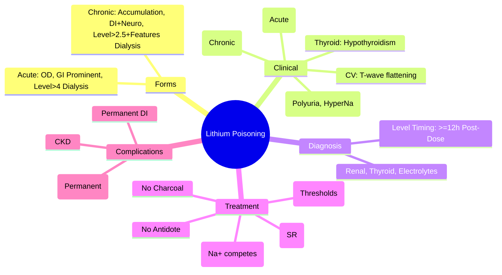

Related: [[General Principles of Poisoning Management]], [[Antidotes Overview]], [[Enhanced Elimination (Dialysis, Hemoperfusion)]], [[Sedative-Hypnotic Toxidrome]]

> [!tip]
> **Narrow therapeutic index** (0.4-1.0 mmol/L). **Two forms**: acute (intentional OD) vs chronic (therapeutic accumulation). **Dialysis indications differ**: acute > 4 mmol/L; chronic > 2.5 mmol/L + neuro/renal/elderly. **Nephrogenic DI** = hallmark chronic toxicity. **No antidote** — dialysis = definitive. Key FCPS/MRCP: acute vs chronic dialysis thresholds; neuro symptoms = dialysis; nephrogenic DI (polyuria, polydipsia, hypernatremia); SILENT syndrome (irreversible neurotoxicity).

## 1. Learning Objectives
- Differentiate acute vs chronic lithium toxicity
- Apply dialysis criteria for each scenario
- Recognize nephrogenic diabetes insipidus
- Manage neurotoxicity (SILENT syndrome)
- Monitor lithium levels correctly (timing critical)

## 2. Definition
Lithium poisoning = toxicity from lithium carbonate/citrate causing **neurological, renal, endocrine, and GI** manifestations. Narrow therapeutic index (0.4-1.0 mmol/L).

## 3. Core Physiology
- **Mechanism**: competes with Mg²⁺/Na⁺ → inhibits **GSK-3β**, **inositol monophosphatase** (IMPase) → ↓ inositol recycling → ↓ PIP₂ signaling → mood stabilization
- **Renal**: **inhibits ADH action** on collecting duct (↓ aquaporin-2) → **nephrogenic DI** → polyuria, polydipsia, **hypernatremia**
- **Thyroid**: inhibits thyroid hormone release → **hypothyroidism**, goitre
- **Pharmacokinetics**: **no protein binding**, small Vd (~0.6-0.9 L/kg), **renal excretion** (60% reabsorbed proximally), **long half-life 18-36h** (prolonged in renal failure/elderly)
- **Crosses BBB slowly** — neurotoxicity lags behind serum levels in acute OD

## 4. Clinical Features

### Acute Toxicity (Intentional Overdose)
- **GI**: nausea, vomiting, diarrhea (early, prominent)
- **Neuro**: coarse tremor, hyperreflexia, ataxia, nystagmus, confusion, seizures, coma
- **CV**: hypotension, arrhythmias (rare)
- **Renal**: usually normal initially

### Chronic Toxicity (Therapeutic Accumulation)
- **Neuro**: **SILENT syndrome** — **S**yndrom of **I**rreversible **L**ithium-**E**ffectuated **N**euro**T**oxicity: cerebellar dysfunction (ataxia, dysarthria, nystagmus), cognitive impairment, **peripheral neuropathy** — **may be PERMANENT**
- **Renal**: **nephrogenic DI** — polyuria (> 3L/d), polydipsia, **hypernatremia**, renal tubular damage (interstitial fibrosis)
- **Thyroid**: hypothyroidism, goitre
- **CV**: ECG changes (T-wave flattening, U waves)
- **GI**: less prominent

## 5. Acute vs Chronic Comparison
| Feature | Acute OD | Chronic Toxicity |
|---------|----------|------------------|
| **Serum level** | Often > 4 mmol/L | Often 1.5-2.5 mmol/L |
| **GI symptoms** | **Prominent** (vomiting, diarrhea) | Mild/absent |
| **Neuro symptoms** | Lag behind level (BBB crossing) | **Correlate with level** |
| **Nephrogenic DI** | Rare | **Hallmark** |
| **SILENT syndrome** | No | **Yes** (permanent risk) |
| **Dialysis threshold** | **> 4 mmol/L** | **> 2.5 mmol/L + neuro/renal/elderly** |
| **Dialysis duration** | Shorter | Longer (tissue redistribution) |

## 6. Investigations
- **Serum lithium level** — **critical timing**: draw **≥ 12h post-dose** (steady state); acute OD — repeat q6-12h (distribution phase)
- **Renal function**: urea, creatinine, eGFR
- **Electrolytes**: **Na⁺ (hypernatremia)**, K⁺, Ca²⁺, Mg²⁺
- **Thyroid function**: TSH, free T4 (hypothyroidism)
- **ABG/VBG**: metabolic acidosis possible
- **ECG**: T-wave changes, arrhythmias
- **Paracetamol level** (always)
- **CK**: if seizures/rhabdo

## 7. Management

### 1. Supportive Care
- **Airway**: protect if GCS < 8, seizures
- **Fluids**: **NS 1-2 L bolus then 150-200 mL/hr** — **maintain urine output > 1.5 mL/kg/hr**; **avoid saline overload** (lung injury); **NS preferred** (Na⁺ enhances Li⁺ clearance)
- **Correct hypernatremia** slowly (free water deficit calculation)
- **Seizures**: benzodiazepines (lorazepam/diazepam) — **phenytoin less effective**
- **Monitor**: neuro status q2-4h, fluid balance, electrolytes q4-6h

### 2. Decontamination
- **Activated charcoal**: **NOT effective** (lithium not adsorbed)
- **Whole bowel irrigation**: **INDICATED for sustained-release** (lithium carbonate SR) — PEG 1-2 L/hr until clear effluent
- **Gastric lavage**: not indicated

### 3. Hemodialysis — **DEFINITIVE TREATMENT**
**Indications (ANY ONE)**:

| Scenario | Criteria |
|----------|----------|
| **Acute OD** | **Level > 4.0 mmol/L** (or > 2.5 mmol/L if severe neuro/cardiac) |
| **Chronic toxicity** | **Level > 2.5 mmol/L** + **neuro symptoms / renal impairment (Cr > 150) / elderly (> 65)** |
| **Any** | **Severe neurotoxicity** (confusion, seizures, coma) regardless of level |
| **Any** | **Renal failure** (AKI, anuria) |
| **Any** | **Life-threatening cardiac arrhythmia** |

**Dialysis Prescription**:
- **High-flux dialyzer**, blood flow 300-400 mL/min, dialysate 500-800 mL/min
- **Duration**: 4-6h sessions
- **Frequency**: **daily** until level < 1.0 mmol/L (chronic) or < 1.5 mmol/L (acute)
- **Rebound**: expect **20-30% rebound** post-dialysis (redistribution from tissues) — **repeat if needed**
- **CRRT**: alternative if hemodynamically unstable

### 4. No Specific Antidote
- **Sodium polystyrene sulfonate** — not recommended
- **Furosemide** — may ↑ Li⁺ clearance but risk volume depletion
- **Aminophylline/theophylline** — historical, not used

### 5. Drug Interactions (Precipitants of Chronic Toxicity)
- **ACEi/ARB** (↓ GFR, ↑ proximal reabsorption)
- **Diuretics** (thiazide > loop — volume depletion → ↑ Li⁺ reabsorption)
- **NSAIDs** (↓ renal prostaglandins → ↓ GFR)
- **Antibiotics**: metronidazole, tetracyclines (rare)

## 8. Complications
- **SILENT syndrome** (irreversible cerebellar/neuro)
- Permanent nephrogenic DI (chronic interstitial nephritis)
- Chronic kidney disease
- Hypothyroidism
- Rhabdomyolysis (seizures)
- Death (rare with dialysis)

## 9. Prognosis
- **Acute**: good with early dialysis; neuro recovery usual
- **Chronic**: **SILENT syndrome may be permanent**; DI may persist; neuro recovery incomplete

## 10. FCPS/MRCP High-Yield Points
1. **Therapeutic range**: 0.4-1.0 mmol/L; **toxic > 1.5 mmol/L**
2. **Acute vs Chronic**: GI prominent in acute; DI + neuro in chronic
3. **Dialysis thresholds**: **Acute > 4 mmol/L**; **Chronic > 2.5 mmol/L + neuro/renal/elderly**
4. **Nephrogenic DI** = polyuria, polydipsia, **hypernatremia** (ADH resistance)
5. **SILENT syndrome** = irreversible cerebellar/peripheral neuropathy (chronic)
6. **Level timing**: **≥ 12h post-dose** (steady state); acute — repeat q6-12h
7. **NS preferred for hydration** (Na⁺ competes with Li⁺ for reabsorption)
8. **Charcoal NOT effective**; **WBI for SR formulations**
9. **Rebound post-dialysis** 20-30% — repeat daily until level safe
10. **Precipitants**: ACEi/ARB, thiazides, NSAIDs

## 11. Common Viva Questions
1. Acute vs chronic lithium toxicity features
2. Dialysis indications (acute vs chronic thresholds)
3. Nephrogenic DI mechanism and management
3. SILENT syndrome
4. Lithium level timing
5. Drug interactions precipitating toxicity
6. Why NS not D5W for hydration?

## 12. Common Confusions / Exam Traps
- **Acute level 3.5 = no dialysis** → true (threshold 4.0), but neuro symptoms = dialyze
- **Chronic level 2.0 = safe** → NO if neuro symptoms/renal impairment/elderly
- **Charcoal for lithium** → NOT effective
- **D5W for hydration** → NO, NS (Na⁺ competes)
- **Level at 6h post-dose** → NOT steady state (distribution phase)
- **SILENT = reversible** → NO, **permanent**
- **Polyuria = diabetes mellitus** → check glucose, think nephrogenic DI

## 13. Mnemonics
- **LITHIUM DIALYSIS**: **A**cute **>4**, **C**hronic **>2.5** + **N**euro/**R**enal/**E**lderly
- **NEPHROGENIC DI**: **P**olyuria, **P**olydipsia, **H**yper**N**atremia
- **SILENT**: **S**yndrom of **I**rreversible **L**ithium **E**ffectuated **N**euro**T**oxicity
- **CHRONIC TOXICITY**: **D**I, **H**ypothyroidism, **I**nterstitial **N**ephropathy, **C**erebellar **N**eurotoxicity
- **PRECIPITANTS**: **A**CEi/ARB, **D**iuretics (thiazide), **N**SAIDs

## 14. Mind Map


## 15. Flowchart
```mermaid
flowchart TD
  A[Suspected Lithium Toxicity] --> B[ABCDE + Li Level (>=12h post-dose)\n+ Renal, Thyroid, Na+, CK, ECG]
  B --> C{Acute OD or Chronic?}
  C -->|Acute| D[Level > 4.0 mmol/L?]
  D -->|Yes| E[Hemodialysis]
  D -->|No| F[Severe Neuro/Cardiac?]
  F -->|Yes| E
  F -->|No| G[NS Hydration 1-2L Bolus\nThen 150-200mL/hr\nWBI if SR]
  C -->|Chronic| H[Level > 2.5 mmol/L?]
  H -->|Yes| I{Neuro Symptoms\nor Renal Impairment\nor Elderly?}
  I -->|Yes| E
  I -->|No| G
  H -->|No| G
  G --> J[Monitor Level q6-12h\nNeuro q2-4h\nFluid Balance\nElectrolytes q4-6h]
  E --> K[Daily HD Until Level\nAcute <1.5 / Chronic <1.0\nExpect 20-30% Rebound]
  K --> J
```

## 16. Suggested Visuals / Image Notes
- Acute vs chronic comparison table
- Dialysis criteria card
- SILENT syndrome features

## 17. Suggested Video References
- Lithium toxicity and dialysis (Toxbase, Nephrology)

## 18. One-Page Revision Summary
- **Therapeutic**: 0.4-1.0 mmol/L
- **Acute**: GI prominent, level > 4 = dialysis
- **Chronic**: DI (polyuria, hyperNa), neuro, level > 2.5 + features = dialysis
- **Level timing**: ≥ 12h post-dose
- **Hydration**: NS (Na⁺ competes), NOT D5W
- **Charcoal NO; WBI for SR**
- **Dialysis**: daily until level safe, expect rebound
- **SILENT** = permanent cerebellar/neuro (chronic)
- **Precipitants**: ACEi/ARB, thiazides, NSAIDs

## 24-Hour Recall Prompts
- State acute vs chronic dialysis thresholds
- Describe nephrogenic DI triad
- Explain SILENT syndrome
- Why NS not D5W for hydration?

## 7-Day / 15-Day / 30-Day Revision Tracker
- [ ] Day 1 completed
- [ ] 24-hour recall completed
- [ ] Day 7 revision completed
- [ ] Day 15 revision completed
- [ ] Day 30 revision completed

## 19. Must Know / Should Know / Nice to Know
### Must Know
- Therapeutic range 0.4-1.0 mmol/L
- Acute: GI, >4 mmol/L dialysis
- Chronic: DI + neuro, >2.5 + features dialysis
- Level ≥ 12h post-dose
- NS hydration (Na⁺ competes)
- SILENT = permanent (chronic)
- Charcoal NO, WBI for SR

### Should Know
- Dialysis rebound 20-30%
- Precipitants: ACEi/ARB, thiazides, NSAIDs
- Hypothyroidism association
- CRRT if unstable

### Nice to Know
- Specific SILENT features (ataxia, dysarthria, neuropathy)
- Lithium in pregnancy (Ebstein's anomaly)
- Peritoneal dialysis less effective

## 20. Self-Test Scorecard
- Understanding: /10
- Recall: /10
- MCQ Performance: /10
- SBA Performance: /10
- Viva Confidence: /10
- Total: /50

> [!tip]
> Interpretation: <35 = weak topic, 35-44 = acceptable but insecure, 45+ = strong exam-ready topic.

## 21. Exam Answer Modes
### Long Answer Skeleton
- Mechanism and pharmacokinetics
- Acute vs chronic comparison table
- Investigations (level timing critical)
- Management: hydration, WBI, dialysis thresholds
- Complications (SILENT, DI, CKD)
- Drug interactions

### Short Note Skeleton
- Acute vs chronic table
- Dialysis criteria box
- Level timing box
- SILENT syndrome

### Viva One-Liners
- "Lithium: therapeutic 0.4-1.0, toxic >1.5"
- "Acute: GI prominent, dialysis >4 mmol/L"
- "Chronic: DI + neuro, dialysis >2.5 + symptoms"
- "Level: ≥12h post-dose (steady state)"
- "Hydration: NS (Na⁺ competes with Li⁺ reabsorption)"
- "SILENT = irreversible cerebellar/neuro (chronic)"
- "Charcoal NO; WBI for SR"
- "Rebound 20-30% post-HD — repeat daily"
- "Precipitants: ACEi/ARB, thiazides, NSAIDs"

### Ward-Case Discussion Points
- Elderly on lithium + thiazide + ACEi → confusion, level 2.2 → DIALYZE (chronic + renal + elderly)
- Acute OD level 4.5 at 6h → wait for 12h level? NO, clinical toxicity + rising level → dialyze
- Chronic patient with polyuria, hypernatremia → nephrogenic DI, water restriction + NS

### Last-Night-Before-Exam Sheet
- Acute: GI, Dialysis >4
- Chronic: DI+Neuro, Dialysis >2.5+Features
- Level: >=12h
- NS Hydration
- SILENT = Permanent
- Charcoal NO

## 22. Summary
Lithium poisoning = narrow therapeutic index (0.4-1.0 mmol/L). **Acute**: GI prominent, dialysis > 4 mmol/L. **Chronic**: nephrogenic DI (polyuria, hypernatremia) + neurotoxicity, dialysis > 2.5 mmol/L + neuro/renal/elderly. **Level ≥ 12h post-dose**. **Hydration with NS** (Na⁺ competes). **SILENT syndrome** = irreversible cerebellar/peripheral neuro (chronic). **Charcoal NO; WBI for SR**. Dialysis daily until level safe, expect 20-30% rebound.

## 23. MCQs (10)
1. Question 1
   A. Option A
   B. Option B
   C. Option C
   D. Option D
   **Answer: A**
   *Explanation: Explanation 1*

2. Question 2
   A. Option A
   B. Option B
   C. Option C
   D. Option D
   **Answer: B**
   *Explanation: Explanation 2*

3. Question 3
   A. Option A
   B. Option B
   C. Option C
   D. Option D
   **Answer: C**
   *Explanation: Explanation 3*

4. Question 4
   A. Option A
   B. Option B
   C. Option C
   D. Option D
   **Answer: D**
   *Explanation: Explanation 4*

5. Question 5
   A. Option A
   B. Option B
   C. Option C
   D. Option D
   **Answer: A**
   *Explanation: Explanation 5*

6. Question 6
   A. Option A
   B. Option B
   C. Option C
   D. Option D
   **Answer: B**
   *Explanation: Explanation 6*

7. Question 7
   A. Option A
   B. Option B
   C. Option C
   D. Option D
   **Answer: C**
   *Explanation: Explanation 7*

8. Question 8
   A. Option A
   B. Option B
   C. Option C
   D. Option D
   **Answer: D**
   *Explanation: Explanation 8*

9. Question 9
   A. Option A
   B. Option B
   C. Option C
   D. Option D
   **Answer: A**
   *Explanation: Explanation 9*

10. Question 10
   A. Option A
   B. Option B
   C. Option C
   D. Option D
   **Answer: B**
   *Explanation: Explanation 10*


## 24. SBA Questions (10)
1. Scenario 1
   A. Option A
   B. Option B
   C. Option C
   D. Option D
   **Answer: A**
   *Explanation: Explanation 1*

2. Scenario 2
   A. Option A
   B. Option B
   C. Option C
   D. Option D
   **Answer: B**
   *Explanation: Explanation 2*

3. Scenario 3
   A. Option A
   B. Option B
   C. Option C
   D. Option D
   **Answer: C**
   *Explanation: Explanation 3*

4. Scenario 4
   A. Option A
   B. Option B
   C. Option C
   D. Option D
   **Answer: D**
   *Explanation: Explanation 4*

5. Scenario 5
   A. Option A
   B. Option B
   C. Option C
   D. Option D
   **Answer: A**
   *Explanation: Explanation 5*

6. Scenario 6
   A. Option A
   B. Option B
   C. Option C
   D. Option D
   **Answer: B**
   *Explanation: Explanation 6*

7. Scenario 7
   A. Option A
   B. Option B
   C. Option C
   D. Option D
   **Answer: C**
   *Explanation: Explanation 7*

8. Scenario 8
   A. Option A
   B. Option B
   C. Option C
   D. Option D
   **Answer: D**
   *Explanation: Explanation 8*

9. Scenario 9
   A. Option A
   B. Option B
   C. Option C
   D. Option D
   **Answer: A**
   *Explanation: Explanation 9*

10. Scenario 10
   A. Option A
   B. Option B
   C. Option C
   D. Option D
   **Answer: B**
   *Explanation: Explanation 10*


## 25. Flashcards
- Q: Flashcard 1 question
  A: Flashcard 1 answer
- Q: Flashcard 2 question
  A: Flashcard 2 answer
- Q: Flashcard 3 question
  A: Flashcard 3 answer
- Q: Flashcard 4 question
  A: Flashcard 4 answer
- Q: Flashcard 5 question
  A: Flashcard 5 answer
- Q: Flashcard 6 question
  A: Flashcard 6 answer
- Q: Flashcard 7 question
  A: Flashcard 7 answer
- Q: Flashcard 8 question
  A: Flashcard 8 answer
- Q: Flashcard 9 question
  A: Flashcard 9 answer
- Q: Flashcard 10 question
  A: Flashcard 10 answer
- Q: Flashcard 11 question
  A: Flashcard 11 answer
- Q: Flashcard 12 question
  A: Flashcard 12 answer
- Q: Flashcard 13 question
  A: Flashcard 13 answer
- Q: Flashcard 14 question
  A: Flashcard 14 answer
- Q: Flashcard 15 question
  A: Flashcard 15 answer

## 26. Answer Key with Explanations
### MCQs
1. **A** - Explanation 1
2. **B** - Explanation 2
3. **C** - Explanation 3
4. **D** - Explanation 4
5. **A** - Explanation 5
6. **B** - Explanation 6
7. **C** - Explanation 7
8. **D** - Explanation 8
9. **A** - Explanation 9
10. **B** - Explanation 10


### SBAs
1. **A** - Explanation 1
2. **B** - Explanation 2
3. **C** - Explanation 3
4. **D** - Explanation 4
5. **A** - Explanation 5
6. **B** - Explanation 6
7. **C** - Explanation 7
8. **D** - Explanation 8
9. **A** - Explanation 9
10. **B** - Explanation 10