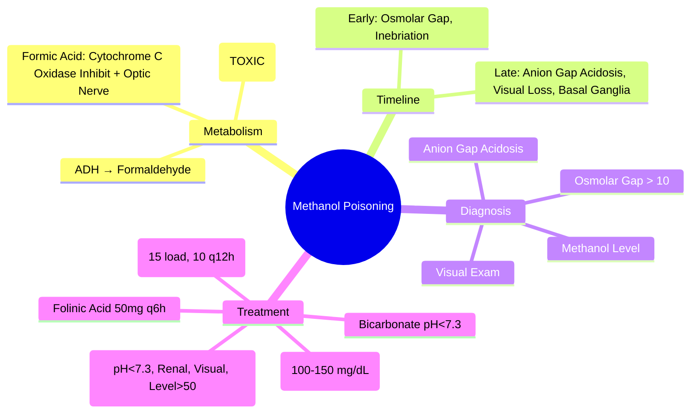
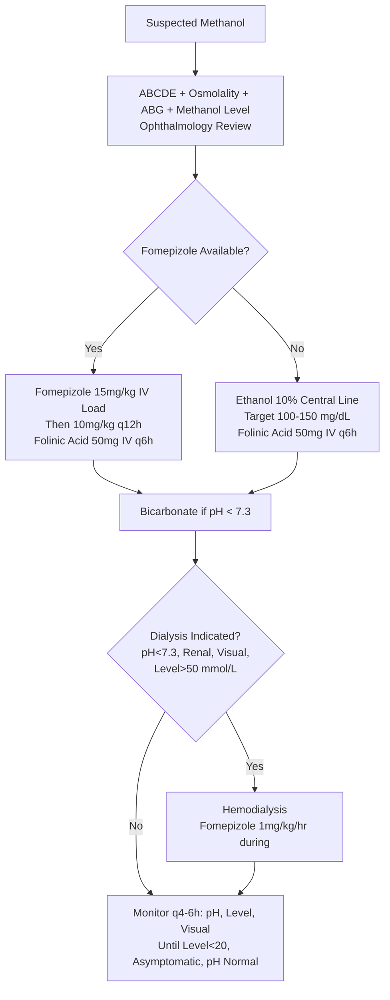

Related: [[General Principles of Poisoning Management]], [[Ethylene Glycol Poisoning]], [[Isopropyl Alcohol Poisoning]], [[Antidotes Overview]], [[Enhanced Elimination (Dialysis, Hemoperfusion)]]

> [!tip]
> **Methanol → formaldehyde → formic acid** (toxic metabolite). **Formic acid = metabolic acidosis + optic nerve toxicity (blindness)**. **Fomepizole** (or ethanol) blocks ADH → prevents metabolism. **Dialysis** for pH < 7.3, renal failure, visual symptoms, level > 50 mmol/L. Key FCPS/MRCP: osmolar gap early, anion gap metabolic acidosis later; fomepizole 15 mg/kg load then 10 mg/kg q12h; folate/folinic acid enhances formate metabolism; dialysis criteria.

## 1. Learning Objectives
- Recognize methanol poisoning (metabolic acidosis, visual disturbances, osmolar gap)
- Apply fomepizole (or ethanol) protocol
- Identify dialysis indications
- Differentiate from ethylene glycol and isopropyl alcohol poisoning
- Administer folate/folinic acid adjunct

## 2. Definition
Methanol poisoning = toxicity from methanol (methyl alcohol) metabolized to **formaldehyde** then **formic acid**, causing **severe metabolic acidosis** and **optic nerve/retinal damage** leading to blindness.

## 3. Core Physiology
- **Metabolism**: Methanol → (ADH) → **Formaldehyde** → (ALDH) → **Formic acid** (toxic)
- **Formic acid**:
  - Inhibits **cytochrome c oxidase** (mitochondrial respiration) → **lactic acidosis**
  - Direct **optic nerve/retinal toxicity** → blurred vision, "snowfield" vision, blindness
  - Metabolic acidosis (high anion gap)
- **ADH affinity**: ethanol > fomepizole > methanol → competitive inhibition
- **Elimination**: renal (slow, zero-order at high concentrations), dialysis highly effective
- **Osmolar gap**: early (parent alcohol present); **anion gap metabolic acidosis**: late (formic acid accumulated)

## 4. Clinical Features

### Early (0-12h) — Osmolar Gap Phase
- Inebriation (similar to ethanol but less euphoria)
- Nausea, vomiting, abdominal pain
- **Normal or mildly elevated anion gap**
- **Elevated osmolar gap** (> 10 mOsm/kg)

### Late (12-24h+) — Anion Gap Metabolic Acidosis Phase
- **Severe metabolic acidosis** (pH often < 7.2)
- **Visual disturbances** — **HALLMARK**: blurred vision, photophobia, "snowfield" vision, **central scotoma**, dilated pupils with sluggish light reflex, **optic disc hyperemia/edema**
- Altered mental status, seizures, coma
- **Putaminal hemorrhage/necrosis** (basal ganglia) — parkinsonism sequelae
- Pancreatitis

## 5. Differential Diagnosis
- **Ethylene glycol**: metabolic acidosis + oxalate crystals + renal failure (no visual)
- **Isopropyl alcohol**: ketosis WITHOUT acidosis, hemorrhagic gastritis, CNS depression
- **Diabetic ketoacidosis**: hyperglycemia, ketones, no osmolar gap (or small)
- **Lactic acidosis/sepsis**: no osmolar gap, no visual
- **Salicylate**: respiratory alkalosis + metabolic acidosis, tinnitus

## 6. Investigations

### Mandatory
1. **Methanol level** (if available) — > 20 mg/dL (6.2 mmol/L) toxic
2. **Osmolality** (measured) → **osmolar gap** = measured - calculated (2×Na + glucose/18 + BUN/2.8 + EtOH/4.6) — **> 10 = significant**
3. **ABG/VBG** — pH, HCO₃⁻, anion gap
4. **Electrolytes** — Na⁺, K⁺, Cl⁻, glucose, lactate
5. **Renal function**
6. **CK** (rhabdo)
7. **Paracetamol level** (always)
8. **ECG**
9. **Ophthalmology review** — fundoscopy (optic disc edema, hyperemia)

### Calculated Values
- **Osmolar gap** = measured osmolality - [2×Na + glucose/18 + BUN/2.8 + EtOH/4.6]
- **Anion gap** = Na - (Cl + HCO₃)
- **Estimated methanol contribution** = osmolar gap × 3.2 (mg/dL) or × 0.1 (mmol/L) — rough

## 7. Management

### 1. Resuscitation (ABCDE)
- **Airway**: intubate if GCS < 8
- **Breathing**: high-flow O₂, ventilate to compensate for metabolic acidosis
- **Circulation**: fluids, vasopressors if needed
- **Correct acidosis**: **NaHCO₃ infusion** for pH < 7.3 (target pH > 7.3)

### 2. Antidote: Fomepizole (4-Methylpyrazole) — **PREFERRED**
- **Mechanism**: competitive ADH inhibitor (binds ADH > ethanol > methanol)
- **Dose**:
  - **Loading**: **15 mg/kg IV** over 30 min (in 100 mL NS/D5W)
  - **Maintenance**: **10 mg/kg IV q12h** (in 100 mL) × 4 doses, then **15 mg/kg q12h** if dialysis planned (fomepizole dialyzed out)
  - **During dialysis**: **1 mg/kg/hr** infusion OR redose post-dialysis
  - **Duration**: until methanol < 20 mg/dL (or < 6.2 mmol/L) AND patient asymptomatic with normal pH
- **Advantages over ethanol**: no CNS depression, no hypoglycemia, easier dosing, no monitoring
- **Cost**: higher but preferred

### 3. Alternative: Ethanol (if Fomepizole Unavailable)
- **Target blood ethanol**: **100-150 mg/dL** (22-33 mmol/L)
- **Loading**: 10% ethanol 15 mL/kg (or 5% 30 mL/kg) IV over 30-60 min — **central line preferred** (thrombophlebitis)
- **Maintenance**: 10% ethanol at 1-2 mL/kg/hr (adjust to maintain level)
- **Monitoring**: blood ethanol q1-2h, glucose (hypoglycemia), ABG, osmolar gap
- **Complications**: CNS depression, hypoglycemia, pancreatitis, thrombophlebitis, intoxication

### 4. Adjunct: Folate / Folinic Acid
- **Mechanism**: enhances formate → CO₂ + H₂O via 10-formyl-THF synthetase (folate-dependent)
- **Dose**: **Folinic acid (leucovorin) 50 mg IV q6h** OR **Folic acid 1 mg/kg IV q6h** (max 50 mg)
- **Continue** until methanol cleared and acidosis resolved

### 5. Hemodialysis — **Indications (Any One)**
- **pH < 7.30** (persistent despite bicarbonate)
- **Renal failure** (AKI, anuria)
- **Visual symptoms** (any degree — blindness prevention)
- **Methanol level > 50 mmol/L (160 mg/dL)** — some guidelines > 20 mmol/L with acidosis
- **Refractory electrolyte disturbances**
- **Continue dialysis** until methanol < 20 mg/dL (6.2 mmol/L) AND pH normalized AND asymptomatic

### 6. Supportive Care
- **Bicarbonate infusion** for pH < 7.3
- **Correct electrolytes** (K⁺, Mg²⁺, PO₄³⁻)
- **Thiamine 100 mg IV** (prevent Wernicke)
- **Ophthalmology follow-up** (serial exams)

## 8. Complications
- Permanent blindness (optic nerve atrophy)
- Putaminal necrosis → parkinsonism
- Severe metabolic acidosis → multi-organ failure
- Pancreatitis
- Seizures
- Death

## 9. Prognosis
- **Good if treated early** (fomepizole before significant formate accumulation)
- **Blindness** = major morbidity if delayed
- Mortality: < 10% with early fomepizole/dialysis; higher if delayed

## 10. FCPS/MRCP High-Yield Points
1. **Methanol → formaldehyde → formic acid** (toxic)
2. **Formic acid = metabolic acidosis + optic nerve toxicity (blindness)**
3. **Osmolar gap early** → **anion gap metabolic acidosis late**
4. **Fomepizole 15 mg/kg load → 10 mg/kg q12h** (preferred over ethanol)
5. **Folinic acid 50 mg IV q6h** (enhances formate metabolism)
6. **Dialysis criteria**: pH < 7.3, renal failure, **visual symptoms**, level > 50 mmol/L
7. **Visual symptoms = dialysis indication** (even if mild)
8. **Ethanol alternative**: target 100-150 mg/dL, central line, monitor glucose
9. **Bicarbonate for pH < 7.3**
10. **Putaminal necrosis** → delayed parkinsonism
11. **Differentiate from EG (renal, oxalate) and IPA (ketosis no acidosis)**

## 11. Common Viva Questions
1. Methanol metabolism pathway and toxic metabolite
2. Fomepizole dosing protocol
3. Dialysis indications
4. Role of folinic acid
5. Differentiate methanol, ethylene glycol, isopropyl alcohol
6. Osmolar gap vs anion gap timeline
7. Ethanol therapy practical aspects
8. Visual symptoms significance

## 12. Common Confusions / Exam Traps
- **Fomepizole dose**: 15 mg/kg load, then 10 mg/kg q12h (not 15 q12h initially)
- **Dialysis during fomepizole**: increase dose to 1 mg/kg/hr or 15 mg/kg q12h
- **Visual symptoms = dialysis** even if pH normal
- **Ethanol 10% via central line** (not peripheral — thrombophlebitis)
- **Formic acid causes BOTH acidosis AND blindness** (not formaldehyde)
- **Osmolar gap normalizes as anion gap rises** (metabolism to formate)
- **Isopropyl alcohol = ketosis WITHOUT acidosis** (vs methanol/EG)
- **Ethylene glycol = oxalate crystals + renal failure** (vs methanol visual)

## 13. Mnemonics
- **METHANOL**: **M**ethanol → **F**ormaldehyde → **F**ormic acid → **A**cidosis + **N**erve (optic) **O**s → **L**ate
- **FOMEPIZOLE**: **1**5 mg/kg **L**oad, **1**0 mg/kg **q**12h; **D**ialysis → **1** mg/kg/hr
- **DIALYSIS**: **pH < 7.3**, **R**enal failure, **V**isual, **L**evel > 50
- **FOLINATE**: **F**olinic acid **5**0 mg **q**6h **E**nhances **F**ormate metabolism
- **TOXIC ALCOHOLS**: **M**ethanol = **M**etabolic acidosis + **V**ision loss; **E**G = **R**enal + **O**xalate; **I**PA = **K**etosis **N**o **A**cidosis

## 14. Mind Map

## 15. Flowchart

## 16. Suggested Visuals / Image Notes
- Methanol metabolism pathway
- Osmolar gap vs anion gap timeline
- Fomepizole dosing card
- Dialysis criteria table

## 17. Suggested Video References
- Methanol poisoning management (Toxbase, EM:RAP)
- Fomepizole vs ethanol comparison

## 18. One-Page Revision Summary
- **Toxic metabolite**: formic acid (not methanol or formaldehyde)
- **Formic acid = metabolic acidosis + optic nerve damage (blindness)**
- **Osmolar gap early** → **anion gap acidosis late**
- **Fomepizole**: 15 mg/kg load → 10 mg/kg q12h (increase during dialysis)
- **Folinic acid 50 mg IV q6h** (enhances formate clearance)
- **Dialysis**: pH < 7.3, renal failure, **visual symptoms**, level > 50 mmol/L
- **Ethanol alternative**: 10% central line, target 100-150 mg/dL
- **Bicarbonate** for pH < 7.3
- **Putaminal necrosis** → delayed parkinsonism
- **Visual symptoms = dialysis even if mild**

## 24-Hour Recall Prompts
- State methanol toxic metabolite and its two main effects
- Recite fomepizole dosing (load, maintenance, dialysis adjustment)
- List 4 dialysis indications
- Contrast methanol vs ethylene glycol vs isopropyl alcohol

## 7-Day / 15-Day / 30-Day Revision Tracker
- [ ] Day 1 completed
- [ ] 24-hour recall completed
- [ ] Day 7 revision completed
- [ ] Day 15 revision completed
- [ ] Day 30 revision completed

## 19. Must Know / Should Know / Nice to Know
### Must Know
- Toxic pathway: methanol → formaldehyde → formic acid
- Formic acid = acidosis + blindness
- Fomepizole 15 load, 10 q12h (dialysis: 1 mg/kg/hr or 15 q12h)
- Folinic acid 50mg q6h
- Dialysis: pH<7.3, renal, visual, level>50
- Visual symptoms = dialysis indication
- Osmolar gap early, anion gap late

### Should Know
- Ethanol protocol details (central line, monitoring)
- Putaminal necrosis → parkinsonism
- Bicarbonate target pH > 7.3
- Fomepizole advantages over ethanol

### Nice to Know
- Formate metabolism via THF (folate-dependent)
- Specific ocular findings (disc hyperemia, edema)
- Chronic methanol exposure effects
- Fomepizole pharmacokinetics

## 20. Self-Test Scorecard
- Understanding: /10
- Recall: /10
- MCQ Performance: /10
- SBA Performance: /10
- Viva Confidence: /10
- Total: /50

> [!tip]
> Interpretation: <35 = weak topic, 35-44 = acceptable but insecure, 45+ = strong exam-ready topic.

## 21. Exam Answer Modes
### Long Answer Skeleton
- Metabolism pathway (ADH, ALDH, formic acid)
- Clinical timeline (osmolar gap → anion gap + visual)
- Diagnosis (level, osmolar gap, ABG, ophthalmology)
- Treatment: fomepizole (protocol), folinic acid, bicarbonate, dialysis (criteria)
- Ethanol alternative
- Complications/prognosis

### Short Note Skeleton
- Metabolism diagram
- Fomepizole dosing box
- Dialysis criteria list
- Toxic alcohol comparison table

### Viva One-Liners
- "Methanol → formaldehyde → formic acid (toxic)"
- "Formic acid = metabolic acidosis + optic nerve toxicity (blindness)"
- "Fomepizole: 15 mg/kg load, 10 mg/kg q12h; dialysis → 1 mg/kg/hr"
- "Folinic acid 50 mg IV q6h enhances formate metabolism"
- "Dialysis: pH<7.3, renal failure, visual symptoms, level>50 mmol/L"
- "Visual symptoms = dialysis indication even if mild"
- "Osmolar gap early → anion gap metabolic acidosis late"
- "Ethanol: 10% central line, target 100-150 mg/dL"
- "Putaminal necrosis → delayed parkinsonism"
- "Methanol=vision, EG=renal/oxalate, IPA=ketosis no acidosis"

### Ward-Case Discussion Points
- "Drunk" patient with anion gap acidosis + visual complaints → methanol until proven otherwise
- Fomepizole started, patient going to dialysis → increase fomepizole dose
- Blindness at presentation → still give fomepizole + dialysis (may recover partial vision)

### Last-Night-Before-Exam Sheet
- Toxic: Formic acid
- Effects: Acidosis + Blindness
- Fomepizole: 15 load, 10 q12h (dialysis: 1/hr or 15 q12h)
- Folinic: 50mg q6h
- Dialysis: pH<7.3, Renal, Visual, Level>50
- Osmolar gap early → Anion gap late
- Ethanol: central, 100-150
- Putaminal → Parkinsonism

## 22. Summary
Methanol poisoning = metabolism to formic acid → severe metabolic acidosis + optic nerve toxicity (blindness). Osmolar gap early → anion gap acidosis late. Fomepizole 15 mg/kg load → 10 mg/kg q12h (increase during dialysis). Folinic acid 50 mg IV q6h enhances formate clearance. Dialysis for pH < 7.3, renal failure, visual symptoms, level > 50 mmol/L. Visual symptoms = dialysis indication. Ethanol alternative if fomepizole unavailable. Putaminal necrosis → delayed parkinsonism.

## 23. MCQs (10)
1. Methanol metabolism - toxic metabolite?
   A. Formaldehyde → formic acid
   B. Ethylene glycol
   C. Acetaldehyde
   D. Acetone
   **Answer: A**
   *Explanation: Methanol → (ADH) → formaldehyde → (ALDH) → formic acid (toxic). Formic acid inhibits cytochrome c oxidase → cellular hypoxia, metabolic acidosis, ocular toxicity.*

2. Classic methanol triad?
   A. Metabolic acidosis, visual disturbances, CNS depression
   B. Respiratory alkalosis, seizures, renal failure
   C. Metabolic alkalosis, visual loss, coma
   D. Pure anion gap acidosis only
   **Answer: A**
   *Explanation: Methanol: high anion gap metabolic acidosis (formic acid), visual disturbances (blurred vision, 'snowfield', photophobia, blindness), CNS depression. Also pancreatitis.*

3. Fomepizole dose for methanol?
   A. 10 mg/kg load, 5 mg/kg q6h
   B. 15 mg/kg load, 10 mg/kg q12h (increase to 15 mg/kg q12h after 48h if on dialysis)
   C. 20 mg/kg load, 10 mg/kg q24h
   D. 5 mg/kg load, 2 mg/kg q8h
   **Answer: B**
   *Explanation: Fomepizole: 15 mg/kg load, then 10 mg/kg q12h. Increase to 15 mg/kg q12h after 48h if on dialysis (dialyzed out). Blocks ADH → prevents formic acid formation.*

4. Methanol dialysis criteria?
   A. pH < 7.3, renal failure, visual symptoms, level > 50 mmol/L
   B. pH < 7.0 only
   C. Level > 100 mmol/L only
   C. Visual symptoms only
   **Answer: A**
   *Explanation: Dialysis if: pH < 7.3, renal failure, visual symptoms (any), methanol level > 50 mmol/L (320 mg/dL). Also if severe acidosis unresponsive to fomepizole.*

5. Ethanol as alternative to fomepizole - target blood level?
   A. 50 mg/dL
   B. 100-150 mg/dL (22-33 mmol/L)
   C. 200 mg/dL
   D. 300 mg/dL
   **Answer: B**
   *Explanation: Ethanol: competes for ADH. Target blood ethanol 100-150 mg/dL (22-33 mmol/L). Loading dose 0.6-0.8 g/kg, maintenance 0.1-0.2 g/kg/hr. Monitor glucose (hypoglycemia), inebriation.*

6. Methanol visual symptoms - mechanism?
   A. Retinal edema
   B. Formic acid inhibits cytochrome c oxidase in optic nerve/retina
   C. Direct corneal toxicity
   D. Optic neuritis
   **Answer: B**
   *Explanation: Formic acid inhibits cytochrome c oxidase → mitochondrial dysfunction in retina/optic nerve → visual loss. 'Snowfield' vision, photophobia, blurred vision, blindness. Early fomepizole + dialysis may reverse.*

7. Methanol vs ethylene glycol - key difference?
   A. Methanol = visual, EG = renal
   B. Same presentation
   C. EG = visual, Methanol = renal
   D. EG has no acidosis
   **Answer: A**
   *Explanation: Methanol: visual disturbances (formic acid → optic nerve). EG: renal failure (calcium oxalate crystals). Both: high anion gap acidosis, osmolal gap early.*

8. Fomepizole in pregnancy?
   A. Contraindicated
   B. Category C, use if benefit > risk (preferred over ethanol)
   C. Category A
   D. Only ethanol allowed
   **Answer: B**
   *Explanation: Fomepizole pregnancy Category C. Preferred over ethanol (teratogenic). Use if benefit > risk. Monitor fetal heart rate.*

9. Methanol level 80 mmol/L, pH 7.25, no visual symptoms. Dialysis?
   A. No
   B. Yes - level > 50 mmol/L
   C. Only if pH < 7.2
   D. Only if renal failure
   **Answer: B**
   *Explanation: Level > 50 mmol/L = dialysis indication. Also pH < 7.3, renal failure, visual symptoms. This patient meets level criterion.*

## 24. SBA Questions (10)
1. Patient drinks windshield washer fluid (methanol). Presents 6h later with nausea, blurred vision, 'snowfield' vision. pH 7.28, osmolal gap 25. Management?
   A. Observe
   B. Fomepizole 15mg/kg load + prepare for dialysis
   C. Ethanol infusion only
   D. Bicarbonate only
   **Answer: B**
   *Explanation: Methanol: visual symptoms + high anion gap acidosis + osmolal gap. Fomepizole 15mg/kg load immediately. Dialysis indicated (visual symptoms, pH < 7.3, level likely >50). Folate 50mg IV q4h enhances formate metabolism.*

2. Fomepizole not available. Ethanol dose?
   A. 10% ethanol 100mL/hr
   B. Loading 0.6-0.8g/kg (e.g., 40-50mL 100% ethanol), then 0.1-0.2g/kg/hr to maintain 100-150mg/dL
   C. 5% dextrose with 10% ethanol
   D. Oral whiskey 50mL/hr
   **Answer: B**
   *Explanation: Ethanol: loading 0.6-0.8g/kg (40-50mL 100% ethanol IV), then 0.1-0.2g/kg/hr IV to maintain 100-150mg/dL. Monitor glucose (hypoglycemia), inebriation, venous ethanol levels q1-2h.*

3. Methanol poisoning, on fomepizole, pH 7.22, no visual symptoms, level 40 mmol/L. Dialysis?
   A. No - level < 50
   B. Yes - pH < 7.3
   C. Only if renal failure
   D. Only if visual symptoms
   **Answer: B**
   *Explanation: Dialysis criteria: pH < 7.3 OR visual symptoms OR renal failure OR level > 50 mmol/L. This patient: pH 7.22 = dialysis indicated.*

4. Methanol - folate/folinic acid role?
   A. Antidote
   B. Enhances formate metabolism to CO₂/H₂O (cofactor for formate dehydrogenase)
   C. Treats acidosis
   D. Prevents visual loss
   **Answer: B**
   *Explanation: Folate/folinic acid 50mg IV q4h: cofactor for formate dehydrogenase → enhances formate metabolism to CO₂ + H₂O. Adjunct to fomepizole/dialysis.*

5. Ethylene glycol poisoning - specific feature?
   A. Visual disturbances
   B. Renal failure (calcium oxalate crystals), hypocalcemia
   C. Pancreatitis
   D. Only CNS depression
   **Answer: B**
   *Explanation: EG: glycolic/oxalic acid → high anion gap acidosis. Calcium oxalate crystals → renal failure, hypocalcemia (oxalate binds Ca²⁺). Envelope-shaped crystals in urine. No visual symptoms.*

6. Methanol + ethylene glycol co-ingestion?
   A. Treat as methanol only
   B. Fomepizole covers both (ADH inhibitor for both)
   C. Ethanol only for EG
   D. Different antidotes needed
   **Answer: B**
   *Explanation: Fomepizole inhibits ADH for BOTH methanol and EG. Same protocol. Dialysis criteria similar (pH<7.3, renal failure, level>50, visual for methanol).*

7. Methanol level falling, pH improving, but patient develops permanent blindness. Why?
   A. Fomepizole toxicity
   B. Formic acid caused irreversible optic nerve damage before treatment
   C. Dialysis complication
   D. Folate deficiency
   **Answer: B**
   *Explanation: Formic acid inhibits cytochrome oxidase in optic nerve → mitochondrial damage. If treatment delayed, permanent blindness. Early fomepizole + dialysis may reverse if caught early.*

8. Methanol - osmolal gap calculation?
   A. Measured - 2×Na
   B. Measured osmolality - (2×Na + glucose/18 + BUN/2.8 + EtOH/4.6). Normal < 10. Early = high gap.
   C. Only with ethanol
   D. Not useful
   **Answer: B**
   *Explanation: Osmolal gap = measured - calculated. Early toxic alcohol = high osmolal gap (parent alcohol). Late = gap normalizes as metabolized to acids (anion gap rises). Gap < 10 normal.*

9. Fomepizole dosing on dialysis?
   A. Same dose
   B. Increase to 15 mg/kg q12h (dialyzed out)
   C. Stop during dialysis
   D. Double dose
   **Answer: B**
   *Explanation: Fomepizole dialyzed out → increase dose to 15 mg/kg q12h during/after dialysis. Continue until methanol level < 20 mmol/L and pH normal.*

## 25. Flashcards
- Q: Methanol metabolism?
  A: Methanol → ADH → formaldehyde → ALDH → formic acid (toxic). Formate inhibits cytochrome c oxidase → cellular hypoxia, acidosis, ocular toxicity.
- Q: Methanol classic triad?
  A: High anion gap metabolic acidosis + visual disturbances (blurred, snowfield, photophobia, blindness) + CNS depression.
- Q: Fomepizole dose?
  A: 15 mg/kg load, then 10 mg/kg q12h. Increase to 15 mg/kg q12h after 48h if on dialysis. Blocks ADH.
- Q: Methanol dialysis criteria?
  A: pH < 7.3 OR visual symptoms OR renal failure OR level > 50 mmol/L (320 mg/dL).
- Q: Ethanol alternative?
  A: Target blood ethanol 100-150 mg/dL. Load 0.6-0.8g/kg, maintain 0.1-0.2g/kg/hr. Monitor glucose (hypoglycemia), inebriation.
- Q: Methanol visual mechanism?
  A: Formic acid inhibits cytochrome oxidase in optic nerve/retina → mitochondrial dysfunction. Early treatment may reverse.
- Q: Methanol vs EG?
  A: Methanol: visual (formic acid → optic nerve). EG: renal failure (calcium oxalate crystals), hypocalcemia. Both: anion gap acidosis, osmolal gap early.
- Q: Fomepizole pregnancy?
  A: Category C. Preferred over ethanol (teratogenic). Use if benefit > risk.
- Q: Folate in methanol?
  A: Folate/folinic acid 50mg IV q4h: cofactor for formate dehydrogenase → enhances formate → CO₂ + H₂O.
- Q: EG specific?
  A: Calcium oxalate crystals → renal failure, hypocalcemia. Envelope-shaped crystals in urine. No visual symptoms.
- Q: Methanol + EG co-ingestion?
  A: Fomepizole covers both (ADH inhibitor). Same protocol. Dialysis criteria similar.
- Q: Osmolal gap in toxic alcohols?
  A: Early: high gap (parent alcohol). Late: gap normalizes as metabolized to acids (anion gap rises). Gap = measured - (2×Na + glu/18 + BUN/2.8 + EtOH/4.6).
- Q: Fomepizole on dialysis?
  A: Dialyzed out → increase to 15 mg/kg q12h. Continue until methanol < 20 mmol/L and pH normal.
- Q: Methanol permanent blindness?
  A: Formic acid → irreversible optic nerve mitochondrial damage if delayed treatment. Early fomepizole + dialysis may reverse.
- Q: Pancreatitis in methanol/EG?
  A: Both can cause pancreatitis (amylase/lipase elevation). Not specific.
## 26. Answer Key with Explanations
### MCQs
1. **A** - Methanol → (ADH) → formaldehyde → (ALDH) → formic acid (toxic). Formic acid inhibits cytochrome c oxidase → cellular hypoxia, metabolic acidosis, ocular toxicity.
2. **A** - Methanol: high anion gap metabolic acidosis (formic acid), visual disturbances (blurred vision, 'snowfield', photophobia, blindness), CNS depression. Also pancreatitis.
3. **B** - Fomepizole: 15 mg/kg load, then 10 mg/kg q12h. Increase to 15 mg/kg q12h after 48h if on dialysis (dialyzed out). Blocks ADH → prevents formic acid formation.
4. **A** - Dialysis if: pH < 7.3, renal failure, visual symptoms (any), methanol level > 50 mmol/L (320 mg/dL). Also if severe acidosis unresponsive to fomepizole.
5. **B** - Ethanol: competes for ADH. Target blood ethanol 100-150 mg/dL (22-33 mmol/L). Loading dose 0.6-0.8 g/kg, maintenance 0.1-0.2 g/kg/hr. Monitor glucose (hypoglycemia), inebriation.
6. **B** - Formic acid inhibits cytochrome c oxidase → mitochondrial dysfunction in retina/optic nerve → visual loss. 'Snowfield' vision, photophobia, blurred vision, blindness. Early fomepizole + dialysis may reverse.
7. **A** - Methanol: visual disturbances (formic acid → optic nerve). EG: renal failure (calcium oxalate crystals). Both: high anion gap acidosis, osmolal gap early.
8. **B** - Fomepizole pregnancy Category C. Preferred over ethanol (teratogenic). Use if benefit > risk. Monitor fetal heart rate.
9. **B** - Level > 50 mmol/L = dialysis indication. Also pH < 7.3, renal failure, visual symptoms. This patient meets level criterion.

### SBAs
1. **B** - Methanol: visual symptoms + high anion gap acidosis + osmolal gap. Fomepizole 15mg/kg load immediately. Dialysis indicated (visual symptoms, pH < 7.3, level likely >50). Folate 50mg IV q4h enhances formate metabolism.
2. **B** - Ethanol: loading 0.6-0.8g/kg (40-50mL 100% ethanol IV), then 0.1-0.2g/kg/hr IV to maintain 100-150mg/dL. Monitor glucose (hypoglycemia), inebriation, venous ethanol levels q1-2h.
3. **B** - Dialysis criteria: pH < 7.3 OR visual symptoms OR renal failure OR level > 50 mmol/L. This patient: pH 7.22 = dialysis indicated.
4. **B** - Folate/folinic acid 50mg IV q4h: cofactor for formate dehydrogenase → enhances formate metabolism to CO₂ + H₂O. Adjunct to fomepizole/dialysis.
5. **B** - EG: glycolic/oxalic acid → high anion gap acidosis. Calcium oxalate crystals → renal failure, hypocalcemia (oxalate binds Ca²⁺). Envelope-shaped crystals in urine. No visual symptoms.
6. **B** - Fomepizole inhibits ADH for BOTH methanol and EG. Same protocol. Dialysis criteria similar (pH<7.3, renal failure, level>50, visual for methanol).
7. **B** - Formic acid inhibits cytochrome oxidase in optic nerve → mitochondrial damage. If treatment delayed, permanent blindness. Early fomepizole + dialysis may reverse if caught early.
8. **B** - Osmolal gap = measured - calculated. Early toxic alcohol = high osmolal gap (parent alcohol). Late = gap normalizes as metabolized to acids (anion gap rises). Gap < 10 normal.
9. **B** - Fomepizole dialyzed out → increase dose to 15 mg/kg q12h during/after dialysis. Continue until methanol level < 20 mmol/L and pH normal.