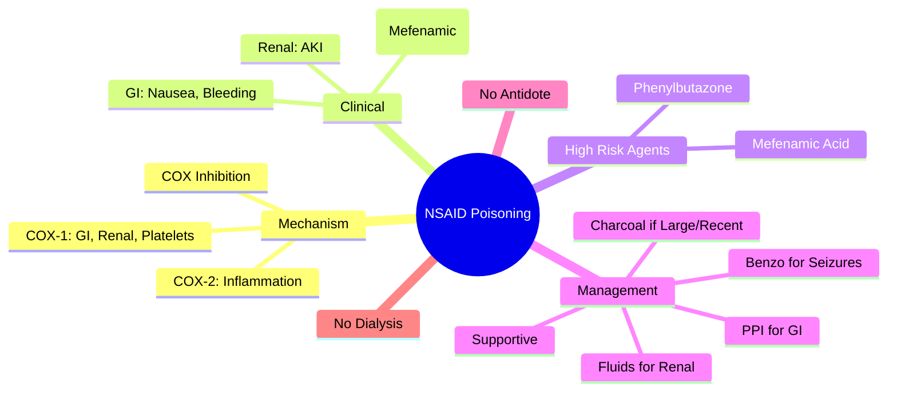
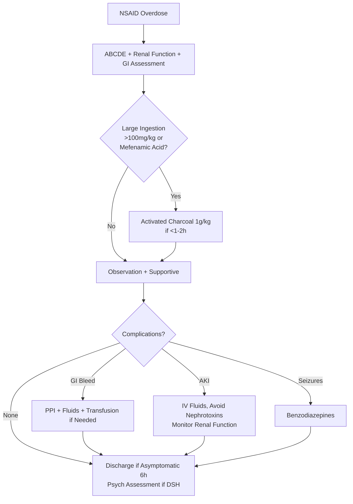

Related: [[General Principles of Poisoning Management]], [[Paracetamol (Acetaminophen) Poisoning]], [[Salicylate (Aspirin) Poisoning]], [[Gastrointestinal Decontamination]]

> [!tip]
> **Generally low toxicity** in acute overdose. **Main risks**: GI irritation/bleeding, renal impairment, metabolic acidosis (rare), CNS effects (drowsiness, seizures with massive ingestion). **No specific antidote**. Supportive care. Key FCPS/MRCP: Ibuprofen most common; mefenamic acid → seizures; COX-2 selective → less GI but CV risk.

## 1. Learning Objectives
- Recognize NSAID overdose clinical features
- Differentiate from salicylate/paracetamol poisoning
- Apply supportive management
- Identify high-risk agents (mefenamic acid, phenylbutazone)

## 2. Definition
NSAID poisoning = toxicity from non-steroidal anti-inflammatory drugs (ibuprofen, naproxen, diclofenac, mefenamic acid, celecoxib, etc.) causing primarily GI, renal, and CNS effects.

## 3. Core Physiology
- **Mechanism**: COX inhibition → ↓ prostaglandins → GI mucosal injury, renal vasoconstriction, platelet dysfunction
- **COX-1**: GI protection, platelet aggregation, renal perfusion
- **COX-2**: inflammation, pain, fever
- **Selective COX-2 inhibitors** (celecoxib, etoricoxib): less GI toxicity, ↑ CV thrombotic risk
- **CNS toxicity**: unclear mechanism, possibly prostaglandin-independent

## 4. Clinical Features
- **GI**: nausea, vomiting, epigastric pain, hematemesis, melena (GI bleeding)
- **Renal**: acute kidney injury (pre-renal from volume depletion, interstitial nephritis, papillary necrosis)
- **CNS**: drowsiness, headache, dizziness, **seizures** (rare, more with mefenamic acid, phenylbutazone, massive ibuprofen)
- **Metabolic**: metabolic acidosis (rare, massive ingestion), hyperkalemia (renal impairment)
- **CV**: hypertension exacerbation, heart failure exacerbation (fluid retention)
- **Hypersensitivity**: bronchospasm (aspirin-exacerbated respiratory disease)

## 5. Differential Diagnosis
- **Salicylate poisoning**: tinnitus, hyperventilation, metabolic acidosis + respiratory alkalosis
- **Paracetamol poisoning**: asymptomatic early, hepatic failure later
- **Ibuprofen vs other NSAIDs**: similar, but mefenamic acid → seizures

## 6. Investigations
- **Renal function**: urea, creatinine, electrolytes
- **ABG/VBG**: metabolic acidosis if severe
- **CBC**: anemia (GI bleed), platelets
- **Coagulation**: INR (rarely affected)
- **LFTs**: usually normal
- **Paracetamol/salicylate levels** (co-ingestion common)
- **Drug level**: not routinely available/needed

## 7. Management
### 1. Supportive Care (Mainstay)
- **GI protection**: PPI (omeprazole 40mg IV/PO) for GI bleeding risk
- **Renal**: IV fluids for volume depletion, avoid nephrotoxins
- **Seizures**: benzodiazepines (lorazepam/diazepam)
- **Metabolic acidosis**: bicarbonate if pH < 7.2

### 2. Decontamination
- **Activated charcoal**: 1 g/kg if < 1-2h, large ingestion (> 100 mg/kg ibuprofen equivalent)
- **WBI**: rarely indicated (enteric-coated/sustained-release)

### 3. No Specific Antidote

### 4. Enhanced Elimination
- **Not dialyzable** (high protein binding > 99%, large Vd)
- **MDAC**: not effective

## 8. Complications
- GI perforation/bleeding
- Acute kidney injury
- Seizure-related injury
- Chronic interstitial nephritis (long-term)

## 9. Prognosis
- **Excellent** — mortality extremely rare
- Full recovery expected with supportive care

## 10. FCPS/MRCP High-Yield Points
1. **Low toxicity** — supportive care only
2. **Ibuprofen** = most common NSAID overdose
3. **Mefenamic acid** → **seizures** (lower threshold)
4. **Phenylbutazone** → seizures, agranulocytosis (historical)
5. **COX-2 selective** (celecoxib) → less GI, more CV risk
6. **Renal impairment** — volume depletion, elderly, ACEi/ARB/diuretic use
7. **No antidote, no dialysis**
8. **Differentiate from salicylate** (no tinnitus, no respiratory alkalosis)

## 11. Common Viva Questions
1. Clinical features of NSAID overdose
2. Why is mefenamic acid higher risk?
3. Management of NSAID-induced GI bleed
4. Renal risk factors for NSAID toxicity
5. Difference from salicylate poisoning

## 12. Common Confusions / Exam Traps
- **NSAID = salicylate** → NO, different toxidromes
- **Dialysis for NSAID** → NO (high protein binding)
- **All NSAIDs same seizure risk** → mefenamic acid > others
- **COX-2 = safer** → less GI but more CV events

## 13. Mnemonics
- **NSAID TOXICITY**: **G**I bleed, **R**enal failure, **C**NS (seizures rare)
- **MEFENAMIC** = **S**eizures

## 14. Mind Map

## 15. Flowchart

## 16. Suggested Visuals / Image Notes
- NSAID vs salicylate comparison table
- COX-1 vs COX-2 effects diagram

## 17. Suggested Video References
- NSAID overdose review (Toxbase)

## 18. One-Page Revision Summary
- **Low toxicity** — supportive care
- **Common**: ibuprofen, naproxen, diclofenac
- **Mefenamic acid** = seizures
- **Phenylbutazone** = seizures, agranulocytosis
- **GI**: PPI for bleed risk
- **Renal**: fluids, avoid nephrotoxins
- **NO antidote, NO dialysis**
- **Differentiate from salicylate**: no tinnitus, no resp alkalosis

## 24-Hour Recall Prompts
- List 3 clinical features of NSAID overdose
- Name high-risk NSAID for seizures
- State management priorities

## 7-Day / 15-Day / 30-Day Revision Tracker
- [ ] Day 1 completed
- [ ] 24-hour recall completed
- [ ] Day 7 revision completed
- [ ] Day 15 revision completed
- [ ] Day 30 revision completed

## 19. Must Know / Should Know / Nice to Know
### Must Know
- Low toxicity, supportive care
- Mefenamic acid → seizures
- GI bleed → PPI
- Renal impairment risk factors
- No antidote/dialysis

### Should Know
- COX-2 selective CV risk
- Enteric-coated → WBI consideration
- Co-ingestion with paracetamol/salicylate

### Nice to Know
- Specific NSAID pharmacokinetics
- Chronic toxicity (interstitial nephritis, papillary necrosis)

## 20. Self-Test Scorecard
- Understanding: /10
- Recall: /10
- MCQ Performance: /10
- SBA Performance: /10
- Viva Confidence: /10
- Total: /50

> [!tip]
> Interpretation: <35 = weak topic, 35-44 = acceptable but insecure, 45+ = strong exam-ready topic.

## 21. Exam Answer Modes
### Long Answer Skeleton
- Mechanism (COX inhibition)
- Clinical features (GI, renal, CNS)
- High-risk agents (mefenamic, phenylbutazone)
- Investigations
- Management (supportive, charcoal, PPI, fluids, benzos)
- Complications/prognosis

### Short Note Skeleton
- NSAID vs salicylate table
- High-risk agents box
- Management algorithm

### Viva One-Liners
- "NSAID overdose: low toxicity, supportive care"
- "Mefenamic acid = seizures"
- "Phenylbutazone = seizures + agranulocytosis"
- "COX-2: less GI, more CV"
- "No antidote, no dialysis"
- "Differentiate from salicylate: no tinnitus, no resp alkalosis"

### Ward-Case Discussion Points
- Elderly on ACEi + diuretic + NSAID → AKI risk
- Child with ibuprofen overdose → usually benign, observe 4-6h

### Last-Night-Before-Exam Sheet
- NSAID: Low tox, Supportive
- Mefenamic = Seizures
- GI: PPI
- Renal: Fluids
- No Antidote/Dialysis

## 22. Summary
NSAID poisoning = low toxicity. Main risks: GI bleed, renal impairment, seizures (mefenamic acid). Management: supportive, charcoal if large/recent, PPI for GI, fluids for renal, benzos for seizures. No antidote, not dialyzable. Differentiate from salicylate (tinnitus, resp alkalosis).

## 23. MCQs (10)
1. Question 1
   A. Option A
   B. Option B
   C. Option C
   D. Option D
   **Answer: A**
   *Explanation: Explanation 1*

2. Question 2
   A. Option A
   B. Option B
   C. Option C
   D. Option D
   **Answer: B**
   *Explanation: Explanation 2*

3. Question 3
   A. Option A
   B. Option B
   C. Option C
   D. Option D
   **Answer: C**
   *Explanation: Explanation 3*

4. Question 4
   A. Option A
   B. Option B
   C. Option C
   D. Option D
   **Answer: D**
   *Explanation: Explanation 4*

5. Question 5
   A. Option A
   B. Option B
   C. Option C
   D. Option D
   **Answer: A**
   *Explanation: Explanation 5*

6. Question 6
   A. Option A
   B. Option B
   C. Option C
   D. Option D
   **Answer: B**
   *Explanation: Explanation 6*

7. Question 7
   A. Option A
   B. Option B
   C. Option C
   D. Option D
   **Answer: C**
   *Explanation: Explanation 7*

8. Question 8
   A. Option A
   B. Option B
   C. Option C
   D. Option D
   **Answer: D**
   *Explanation: Explanation 8*

9. Question 9
   A. Option A
   B. Option B
   C. Option C
   D. Option D
   **Answer: A**
   *Explanation: Explanation 9*

10. Question 10
   A. Option A
   B. Option B
   C. Option C
   D. Option D
   **Answer: B**
   *Explanation: Explanation 10*

## 24. SBA Questions (10)
1. Scenario 1
   A. Option A
   B. Option B
   C. Option C
   D. Option D
   **Answer: A**
   *Explanation: Explanation 1*

2. Scenario 2
   A. Option A
   B. Option B
   C. Option C
   D. Option D
   **Answer: B**
   *Explanation: Explanation 2*

3. Scenario 3
   A. Option A
   B. Option B
   C. Option C
   D. Option D
   **Answer: C**
   *Explanation: Explanation 3*

4. Scenario 4
   A. Option A
   B. Option B
   C. Option C
   D. Option D
   **Answer: D**
   *Explanation: Explanation 4*

5. Scenario 5
   A. Option A
   B. Option B
   C. Option C
   D. Option D
   **Answer: A**
   *Explanation: Explanation 5*

6. Scenario 6
   A. Option A
   B. Option B
   C. Option C
   D. Option D
   **Answer: B**
   *Explanation: Explanation 6*

7. Scenario 7
   A. Option A
   B. Option B
   C. Option C
   D. Option D
   **Answer: C**
   *Explanation: Explanation 7*

8. Scenario 8
   A. Option A
   B. Option B
   C. Option C
   D. Option D
   **Answer: D**
   *Explanation: Explanation 8*

9. Scenario 9
   A. Option A
   B. Option B
   C. Option C
   D. Option D
   **Answer: A**
   *Explanation: Explanation 9*

10. Scenario 10
   A. Option A
   B. Option B
   C. Option C
   D. Option D
   **Answer: B**
   *Explanation: Explanation 10*

## 25. Flashcards
- Q: Flashcard 1 question
  A: Flashcard 1 answer
- Q: Flashcard 2 question
  A: Flashcard 2 answer
- Q: Flashcard 3 question
  A: Flashcard 3 answer
- Q: Flashcard 4 question
  A: Flashcard 4 answer
- Q: Flashcard 5 question
  A: Flashcard 5 answer
- Q: Flashcard 6 question
  A: Flashcard 6 answer
- Q: Flashcard 7 question
  A: Flashcard 7 answer
- Q: Flashcard 8 question
  A: Flashcard 8 answer
- Q: Flashcard 9 question
  A: Flashcard 9 answer
- Q: Flashcard 10 question
  A: Flashcard 10 answer
- Q: Flashcard 11 question
  A: Flashcard 11 answer
- Q: Flashcard 12 question
  A: Flashcard 12 answer
- Q: Flashcard 13 question
  A: Flashcard 13 answer
- Q: Flashcard 14 question
  A: Flashcard 14 answer
- Q: Flashcard 15 question
  A: Flashcard 15 answer

## 26. Answer Key with Explanations
### MCQs
1. **A** - Explanation 1
2. **B** - Explanation 2
3. **C** - Explanation 3
4. **D** - Explanation 4
5. **A** - Explanation 5
6. **B** - Explanation 6
7. **C** - Explanation 7
8. **D** - Explanation 8
9. **A** - Explanation 9
10. **B** - Explanation 10

### SBAs
1. **A** - Explanation 1
2. **B** - Explanation 2
3. **C** - Explanation 3
4. **D** - Explanation 4
5. **A** - Explanation 5
6. **B** - Explanation 6
7. **C** - Explanation 7
8. **D** - Explanation 8
9. **A** - Explanation 9
10. **B** - Explanation 10