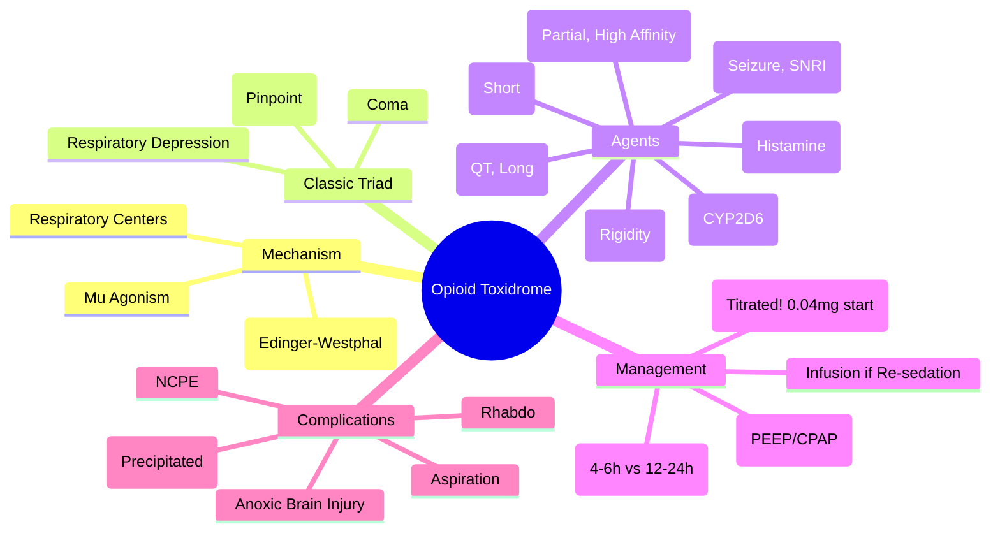

Related: [[General Principles of Poisoning Management]], [[Sedative-Hypnotic Toxidrome]], [[Antidotes Overview]], [[Benzodiazepine Poisoning]], [[Benzodiazepine Poisoning]], [[Methanol Poisoning]] (DDx metabolic acidosis)

> [!tip]
> Think: "pinpoint pupils + respiratory depression + coma" — classic triad. Naloxone is antidote but TITRATE to avoid precipitated withdrawal. Key FCPS/MRCP: Observe 4-6h post naloxone (longer for methadone, SR/ER, fentanyl). Mixed OD with benzo/alcohol common. Non-cardiogenic pulmonary edema.

## 1. Learning Objectives
- Recognize classic opioid toxidrome (miosis, respiratory depression, coma)
- Apply naloxone titration protocol (avoid precipitated withdrawal)
- Determine observation duration based on opioid half-life
- Identify non-cardiogenic pulmonary edema
- Manage mixed opioid-sedative overdoses

## 2. Definition
Opioid toxidrome = clinical syndrome from µ-opioid receptor agonism causing CNS depression, respiratory depression, miosis, and gastrointestinal/hypotensive effects.

## 3. Core Physiology
- **Receptors**: µ (mu) — analgesia, respiratory depression, euphoria, miosis, GI motility ↓, dependence; κ (kappa) — analgesia, dysphoria, sedation; δ (delta) — analgesia, seizures
- **Agonists**: morphine, heroin (diacetylmorphine), fentanyl, methadone, oxycodone, codeine, tramadol (also SNRI), buprenorphine (partial agonist, high affinity), tapentadol (also NRI)
- **Mechanism**: Gi protein → ↓ cAMP → ↓ neuronal excitability, ↑ K⁺ efflux, ↓ Ca²⁺ influx
- **Respiratory depression**: ↓ sensitivity to CO₂ in medullary respiratory centers; ↓ hypoxic drive
- **Miosis**: µ + κ agonism → Edinger-Westphal nucleus stimulation (except meperidine, diphenoxylate — may have normal/dilated pupils)
- **Duration varies**: heroin (short, 4-6h), morphine (4-6h), methadone (long, 24-36h+), fentanyl (short but lipophilic redistribution), buprenorphine (long, ceiling on resp depression), tramadol (seizure risk), codeine (prodrug → morphine via CYP2D6)

## 4. Clinical Features

### Classic Triad
1. **Miosis** (pinpoint pupils) — **hallmark**, bilateral (except meperidine, diphenoxylate, massive overdose with hypoxic brain injury → fixed dilated)
2. **Respiratory depression** — RR < 12, shallow, irregular, apnea; hypoxemia, hypercapnia
3. **Coma** (CNS depression) — GCS 3-8 typically

### Other Features
- **Hypotension** (peripheral vasodilation, histamine release — morphine, codeine)
- **Bradycardia** (vagal stimulation)
- **Hypothermia**
- **Decreased bowel sounds / ileus / constipation**
- **Urinary retention**
- **Skin**: track marks (IV), "poppy seed" pupils, cool peripheries
- **Non-cardiogenic pulmonary edema** (NCPE) — post-naloxone or spontaneous; mechanism: hypoxic vasoconstriction + α₁ surge + increased permeability
- **Seizures**: tramadol, propoxyphene, meperidine (normeperidine), fentanyl (rigid chest wall at high dose)

### Agent-Specific Nuances
| Agent | Half-Life | Key Features |
|-------|-----------|--------------|
| **Heroin** | 2-6 min (6-MAM), morphine 2-3h | Rapid onset, pulmonary edema common |
| **Morphine** | 2-4h | Histamine release → hypotension, flushing |
| **Fentanyl** | 3-12h (context-sensitive) | **Chest wall rigidity** (high dose/rapid IV), rapid redistribution |
| **Methadone** | 24-36h (up to 60h) | **Long QT**, Torsades risk; prolonged observation needed |
| **Buprenorphine** | 24-60h | **Partial agonist** — ceiling on resp depression; high affinity → naloxone resistant |
| **Tramadol** | 6-8h | **Seizure risk** (SNRI + opioid); serotonin syndrome risk; miosis may be absent |
| **Codeine** | 3-4h | CYP2D6 ultrarapid metabolizers → toxicity at normal doses (children) |
| **Tapentadol** | 4-6h | NRI + opioid; seizure risk low; norepinephrine effects |

## 5. Differential Diagnosis
- **Sedative-hypnotic** (benzo, barbiturate, alcohol): miosis NOT pinpoint (normal/small), less respiratory depression per degree of coma, **no naloxone response**
- **Cholinergic**: miosis + secretions + bronchospasm + bradycardia + fasciculations
- **Pontine hemorrhage**: **pinpoint pupils + coma + hyperthermia + extensor posturing** — no respiratory depression initially, no naloxone response
- **Organophosphate**: miosis + SLUDGE + fasciculations
- **Hypoglycemia**: coma + diaphoresis + normal pupils
- **Brainstem stroke**: pinpoint pupils + coma + no respiratory depression initially

## 6. Investigations
- **Glucose** (bedside) — mandatory
- **VBGA**: respiratory acidosis (high pCO₂), hypoxemia, metabolic acidosis (lactic)
- **Paracetamol level** (always — co-ingestion common in DSH)
- **ECG**: QT prolongation (methadone, propoxyphene), bradycardia
- **CK**: if seizures, prolonged immobilization
- **Urine drug screen**: opioid panel (morphine, codeine; **misses fentanyl, methadone, buprenorphine, tramadol, tapentadol** — limited utility)
- **Specific levels**: methadone, fentanyl (rarely available acutely)
- **CXR**: pulmonary edema, aspiration

## 7. Management

### 1. ABCDE — Airway/Breathing Priority
- **Airway**: jaw thrust, OPA/NPA, suction
- **Breathing**: **High-flow O₂ (15L NRB)**, bag-valve-mask if apneic/hypoventilating
- **Intubation** if: GCS < 8, persistent respiratory depression despite naloxone, NCPE, inability to protect airway

### 2. Naloxone (µ-Opioid Antagonist) — **TITRATED**
- **Mechanism**: competitive antagonist at µ, κ, δ (highest affinity µ)
- **Dose**: **Start LOW, go SLOW**
  - **0.04-0.1 mg IV** (child 0.01 mg/kg) — **goal: RR > 10-12, NOT full arousal**
  - Repeat q2-3 min: 0.1 mg, 0.2 mg, 0.4 mg, 0.8 mg, 2 mg (max single dose)
  - **Total max 10 mg** — if no response, reconsider diagnosis
  - **IM/SC/IN** if no IV access: 0.4-2 mg (IN atomizer 1 mg/mL)
- **Infusion** if repeated boluses needed: 2/3 of effective bolus dose per hour (e.g., 0.4 mg bolus → 0.27 mg/hr infusion). Titrate to RR.
- **Duration**: 30-90 min (shorter than most opioids) → **re-sedation COMMON**

### 3. Observation Period (CRITICAL)
| Opioid | Observation Post Last Naloxone |
|--------|--------------------------------|
| Heroin, Morphine, Oxycodone (IR), Fentanyl (IV) | **4-6 hours** |
| Methadone | **12-24 hours** (long half-life, variable) |
| Sustained/Extended Release (MS Contin, OxyContin, Fentanyl patch) | **12-24 hours** |
| Buprenorphine | **6-12 hours** (partial agonist, ceiling) |
| Tramadol | **6-8 hours** (seizure risk) |
| **Mixed/Unknown** | **Minimum 6 hours, often 12+** |

- **Discharge criteria**: GCS 15, RR > 12, SpO₂ > 94% RA, no naloxone in last 4h (6h for methadone/SR), no pulmonary edema, psych safe

### 4. Non-Cardiogenic Pulmonary Edema (NCPE)
- **Onset**: minutes-hours post naloxone (or spontaneous)
- **Mechanism**: hypoxic pulmonary vasoconstriction → capillary stress failure + α₁ surge from sympathetic storm post-naloxone
- **Management**: CPAP/BiPAP → intubation + PEEP if severe; fluids NOT indicated (preload reduction)
- **Prevention**: **titrated naloxone** (avoid massive sympathetic surge)

### 5. Fentanyl Chest Wall Rigidity
- **High dose/rapid IV** → skeletal muscle rigidity (chest wall, abdomen) → impossible to ventilate
- **Treatment**: **Neuromuscular blocker** (succinylcholine/rocuronium) + intubation + naloxone
- **Prevention**: slow IV push, pre-oxygenation

### 6. Buprenorphine Overdose
- **Partial agonist** — ceiling on respiratory depression (less severe)
- **High affinity** — displaces full agonists → precipitated withdrawal in dependent patients
- **Naloxone resistance** — high doses needed (4-10 mg), infusion often required

### 7. Methadone Overdose
- **Long QT** → Torsades risk (hypokalemia, hypomagnesemia, bradycardia)
- **ECG monitoring** essential
- **Correct K⁺/Mg²⁺** aggressively
- **Prolonged observation** (12-24h)

### 8. Tramadol Overdose
- **Seizures** (dose-dependent, SNRI mechanism) — treat with benzos (NOT naloxone for seizures)
- **Serotonin syndrome risk** (with SSRIs, MAOIs)
- **Hyponatremia** (SIADH)

### 9. Withdrawal Precipitated by Naloxone
- **Symptoms**: agitation, tachycardia, hypertension, nausea/vomiting/diarrhea, piloerection, yawning, lacrimation
- **Management**: supportive, clonidine (α₂ agonist), symptomatic. **Do NOT re-dose opioid.**
- **Prevention**: **titrated low-dose naloxone**

## 8. Complications
- Anoxic brain injury (prolonged respiratory depression)
- Aspiration pneumonia
- Non-cardiogenic pulmonary edema
- Rhabdomyolysis (prolonged immobilization, seizures)
- Compartment syndrome (prolonged immobilization)
- Infective endocarditis (IVDU)
- Skin/soft tissue infections, abscesses
- HIV, Hepatitis B/C (IVDU)

## 9. Prognosis
- Excellent with timely naloxone + support
- Mortality from: delayed presentation, mixed OD (benzo/alcohol), NCPE, anoxic injury
- Buprenorphine: lower mortality (ceiling effect)
- Methadone: higher mortality (long QT, prolonged)

## 10. FCPS/MRCP High-Yield Points
1. **Classic triad**: pinpoint pupils + respiratory depression + coma
2. **Naloxone titration**: 0.04-0.1 mg IV → goal RR > 10, NOT full arousal. Avoid precipitated withdrawal.
3. **Observation duration**: 4-6h (heroin/morphine), **12-24h (methadone, SR/ER formulations, fentanyl patch)**
4. **Re-sedation common** (naloxone shorter than opioid) — monitor, consider infusion
5. **Non-cardiogenic pulmonary edema**: post-naloxone, sympathetic surge → CPAP/PEEP
6. **Fentanyl chest wall rigidity** → paralyze + intubate
7. **Buprenorphine**: partial agonist (ceiling), high affinity (naloxone resistant, precipitated withdrawal)
8. **Methadone**: QT prolongation → Torsades, correct K/Mg, ECG monitoring
9. **Tramadol**: seizures (SNRI), serotonin syndrome — benzos for seizures
10. **Mixed OD common** (benzo, alcohol) — naloxone reverses opioid component only
11. **Urine drug screen misses**: fentanyl, methadone, buprenorphine, tramadol, tapentadol

## 11. Common Viva Questions
1. Opioid toxidrome triad
2. Naloxone dosing and titration (why low dose?)
3. Observation periods for different opioids
4. Non-cardiogenic pulmonary edema mechanism and management
5. Fentanyl chest wall rigidity
6. Buprenorphine vs full agonist differences
7. Methadone-specific risks (QT, prolonged obs)
8. Tramadol-specific risks (seizures, serotonin)
9. Mixed opioid + benzo management
10. Precipitated withdrawal prevention/management

## 12. Common Confusions / Exam Traps
- **Naloxone dose**: 0.4-2 mg IV bolus = TOO HIGH for naive (precipitated withdrawal). Start 0.04-0.1 mg.
- **Full arousal not goal**: target RR > 10-12
- **Observation too short for methadone/SR** → re-sedation at home → death
- **Urine opioid screen negative ≠ no opioid** (misses fentanyl, methadone, buprenorphine, tramadol)
- **Pinpoint pupils absent** = meperidine, diphenoxylate, hypoxic brain injury, massive overdose
- **NCPE = fluid overload** → NO, it's permeability + α surge; treat with PEEP, not diuresis
- **Flumazenil in opioid+benzo** → reverses benzo only; seizure risk if TCA co-ingestion

## 13. Mnemonics
- **OPIOID TRIAD**: **O**pioid = **P**inpoint pupils, **I**nadequate respiration, **O**btruded consciousness (coma)
- **NALOXONE TITRATION**: **S**tart **L**ow (0.04mg), **G**o **S**low (q2-3min), **T**arget **R**R > 10
- **OBSERVATION**: **H**eroin/**M**orphine = 4-6h; **M**ethadone/**S**R = 12-24h
- **METHADONE**: **M**emory aid → **M**onitoring ECG, **E**lectrolytes (K/Mg), **T**orsades risk, **H**alf-life long, **A**tropine not for this, **D**uration obs 24h, **O**ngoing QT check, **N**aloxone infusion
- **BUPRENORPHINE**: **B**uprenorphine = **B**uprenorphine **P**artial agonist, **U**nresponsive to naloxone (high dose needed), **P**recipitated withdrawal

## 14. Mind Map


## 15. Flowchart
```mermaid
flowchart TD
  A[Pinpoint Pupils + Respiratory Depression + Coma] --> B[Opioid Toxidrome]
  B --> C[ABCDE: High-Flow O2, BVM if Needed\nGlucose, Paracetamol Level]
  C --> D[Naloxone 0.04-0.1mg IV\nGoal: RR > 10-12\nNOT Full Arousal]
  D --> E{Response?}
  E -->|No| F[Reconsider Diagnosis\nMax 10mg Total]
  E -->|Yes| G[Monitor RR, GCS, SpO2\nRe-sedation Expected]
  G --> H{Opioid Type?}
  H -->|Heroin, Morphine, IR| I[Observe 4-6h Post Last Naloxone]
  H -->|Methadone, SR/ER, Fentanyl Patch| J[Observe 12-24h\nECG for Methadone QT]
  H -->|Buprenorphine| K[Observe 6-12h\nHigh-Dose Naloxone May Need]
  H -->|Tramadol| L[Observe 6-8h\nBenzo for Seizures]
  I --> M[Discharge Criteria:\nGCS 15, RR>12, SpO2>94% RA\nNo Naloxone x 4h (6h Methadone)\nNo NCPE, Psych Safe]
  J --> M
  K --> M
  L --> M
  G --> N{Complications?}
  N -->|NCPE| O[CPAP/BiPAP → Intubate + PEEP\nNo Fluids]
  N -->|Fentanyl Rigidity| P[Paralyze + Intubate + Naloxone]
  N -->|Precipitated Withdrawal| Q[Supportive, Clonidine\nNo Re-dose Opioid]
```

## 16. Suggested Visuals / Image Notes
- Naloxone titration algorithm
- Observation duration table by opioid
- NCPE mechanism diagram

## 17. Suggested Video References
- Opioid overdose management (WHO, Toxicology)
- Naloxone titration demonstration
- Fentanyl chest wall rigidity

## 18. One-Page Revision Summary
- **Triad**: pinpoint pupils, respiratory depression, coma
- **Naloxone**: START LOW (0.04-0.1mg IV), target RR>10, repeat q2-3min, max 10mg
- **Obs**: 4-6h (heroin/morphine/IR), **12-24h (methadone/SR/fentanyl patch/buprenorphine)**
- **Re-sedation common** → consider infusion (2/3 bolus/hr)
- **NCPE**: post-naloxone, α surge → CPAP/PEEP, no fluids
- **Fentanyl rigidity** → paralyze + intubate
- **Buprenorphine**: partial agonist (ceiling), naloxone resistant, precipitated withdrawal
- **Methadone**: QT prolongation → Torsades, correct K/Mg, ECG monitor
- **Tramadol**: seizures (SNRI), serotonin syndrome — benzos
- **Urine screen misses**: fentanyl, methadone, buprenorphine, tramadol

## 24-Hour Recall Prompts
- State naloxone titration protocol (start dose, target, max)
- List observation durations by opioid type
- Describe NCPE mechanism and management
- Contrast buprenorphine vs full agonist

## 7-Day / 15-Day / 30-Day Revision Tracker
- [ ] Day 1 completed
- [ ] 24-hour recall completed
- [ ] Day 7 revision completed
- [ ] Day 15 revision completed
- [ ] Day 30 revision completed

## 19. Must Know / Should Know / Nice to Know
### Must Know
- Classic triad (miosis, resp depression, coma)
- Naloxone titration (0.04mg start, RR>10 target)
- Observation durations (4-6h vs 12-24h)
- Re-sedation common, infusion protocol
- NCPE: post-naloxone, PEEP not fluids
- Fentanyl rigidity → paralyze
- Buprenorphine: partial, naloxone resistant, precipitated withdrawal
- Methadone: QT, long obs
- Tramadol: seizures, serotonin syndrome

### Should Know
- Naloxone infusion calculation
- Precipitated withdrawal management (clonidine)
- Mixed OD (benzo/alcohol) — naloxone only reverses opioid
- Urine screen limitations
- Fentanyl patch: absorption continues after removal

### Nice to Know
- Codeine CYP2D6 ultrarapid metabolizers
- Tapentadol NRI effects
- Propoxyphene (withdrawn) QT
- Remifentanil ultra-short
- Opioid rotation in pain management

## 20. Self-Test Scorecard
- Understanding: /10
- Recall: /10
- MCQ Performance: /10
- SBA Performance: /10
- Viva Confidence: /10
- Total: /50

> [!tip]
> Interpretation: <35 = weak topic, 35-44 = acceptable but insecure, 45+ = strong exam-ready topic.

## 21. Exam Answer Modes
### Long Answer Skeleton
- Definition + mechanism (µ receptor)
- Classic triad + other features
- Agent comparison table (half-life, specific risks)
- Investigations (glucose, paracetamol, ECG)
- Management: ABCDE → titrated naloxone → observation by agent → complications
- Naloxone: dose, titration, infusion, cautions
- Complications + prognosis

### Short Note Skeleton
- Opioid toxidrome features
- Naloxone titration algorithm
- Observation duration table
- NCPE / Fentanyl rigidity / Buprenorphine / Methadone key points

### Viva One-Liners
- "Opioid triad: pinpoint pupils, respiratory depression, coma"
- "Naloxone: start 0.04mg IV, target RR > 10, NOT full arousal"
- "Obs: 4-6h heroin/morphine; 12-24h methadone/SR/fentanyl patch"
- "Re-sedation common — naloxone shorter than opioid; consider infusion"
- "NCPE: post-naloxone sympathetic surge → PEEP, NO fluids"
- "Fentanyl rigidity → paralyze + intubate"
- "Buprenorphine: partial agonist, ceiling resp depression, naloxone resistant, precipitated withdrawal"
- "Methadone: QT prolongation → Torsades, correct K/Mg, ECG monitor"
- "Tramadol: seizures (SNRI), serotonin syndrome"
- "Urine screen misses fentanyl, methadone, buprenorphine, tramadol"

### Ward-Case Discussion Points
- Patient "awake" post-naloxone but received methadone → MUST observe 24h
- Fentanyl patch removed but patient drowsy → continue absorption, observe
- IVDU with coma → naloxone + consider NCPE, aspiration, infection

### Last-Night-Before-Exam Sheet
- Triad: Pinpoint, Resp Dep, Coma
- Naloxone: 0.04mg → RR>10
- Obs: Short 4-6h, Long 12-24h (Methadone/SR)
- NCPE: PEEP
- Buprenorphine: Partial, High Affinity
- Methadone: QT
- Tramadol: Seizure
- Screen misses: Fenta, Methadone, Bupren, Tramadol

## 22. Summary
Opioid toxidrome = µ agonism → miosis + respiratory depression + coma. Naloxone titrated from 0.04mg IV targeting RR > 10 (not full arousal). Observation: 4-6h short-acting, 12-24h methadone/SR/fentanyl patch. Re-sedation common → infusion. NCPE post-naloxone → PEEP. Fentanyl rigidity → paralyze. Buprenorphine: partial agonist, naloxone resistant, precipitated withdrawal. Methadone: QT prolongation. Tramadol: seizures, serotonin syndrome.

## 23. MCQs (10)
1. Classic opioid toxidrome triad?
   A. Mydriasis, tachycardia, hypertension
   B. Pinpoint pupils, respiratory depression, coma
   C. Miosis, hyperthermia, diaphoresis
   D. Mydriasis, respiratory depression, seizures
   **Answer: B**
   *Explanation: Classic triad: pinpoint pupils (miosis) + respiratory depression (RR < 12) + coma (CNS depression). Hallmark.*

2. Naloxone starting dose for opioid overdose (IV)?
   A. 0.4-2 mg
   B. 0.04-0.1 mg
   C. 2-4 mg
   D. 4-8 mg
   **Answer: B**
   *Explanation: TITRATED naloxone: start 0.04-0.1 mg IV (child 0.01 mg/kg). Goal: RR > 10-12, NOT full arousal. Avoid precipitated withdrawal.*

3. Observation period post-naloxone for HEROIN overdose?
   A. 1-2 hours
   B. 4-6 hours
   C. 12-24 hours
   D. 24-48 hours
   **Answer: B**
   *Explanation: Short-acting opioids (heroin, morphine, IR oxycodone, IV fentanyl): observe 4-6 hours post LAST naloxone dose.*

4. Observation period for METHADONE overdose?
   A. 4-6 hours
   B. 6-8 hours
   C. 12-24 hours
   D. 2-3 hours
   **Answer: C**
   *Explanation: Long-acting: methadone, SR/ER formulations, fentanyl patch = 12-24 hours observation. Methadone half-life 24-36h (up to 60h).*

5. Buprenorphine overdose - key features?
   A. Full agonist, severe respiratory depression
   B. Partial agonist - ceiling on respiratory depression, high affinity (naloxone resistant), precipitated withdrawal
   C. No respiratory depression
   D. Short half-life
   **Answer: B**
   *Explanation: Buprenorphine: partial µ agonist → ceiling on respiratory depression (less severe). High affinity → displaces full agonists → precipitated withdrawal in dependent patients. Naloxone resistant (high doses 4-10mg, infusion often needed).*

6. Methadone-specific cardiac risk?
   A. QRS widening
   B. QT prolongation → Torsades de Pointes
   C. Brugada pattern
   D. Heart block
   **Answer: B**
   *Explanation: Methadone: hERG channel blockade → QT prolongation → Torsades risk. Correct K⁺/Mg²⁺ aggressively. ECG monitoring essential.*

7. Fentanyl chest wall rigidity - treatment?
   A. High-dose naloxone alone
   B. Neuromuscular blocker + intubation + naloxone
   C. Benzodiazepines
   D. Phrenic nerve stimulation
   **Answer: B**
   *Explanation: High-dose/rapid IV fentanyl → skeletal muscle rigidity (chest wall, abdomen) → impossible to ventilate. Treatment: paralyze (succinylcholine/rocuronium) + intubate + naloxone.*

8. Tramadol overdose - specific risks?
   A. Only respiratory depression
   B. Seizures (SNRI) + serotonin syndrome + hyponatremia (SIADH)
   C. Pure opioid effects
   D. No seizures
   **Answer: B**
   *Explanation: Tramadol: SNRI + opioid → dose-dependent seizures. Serotonin syndrome risk (with SSRIs/MAOIs). Hyponatremia (SIADH). Miosis may be absent. Seizures treated with benzos.*

9. Non-cardiogenic pulmonary edema (NCPE) post-naloxone - mechanism?
   A. Fluid overload
   B. Hypoxic pulmonary vasoconstriction + α₁ surge from sympathetic storm
   C. Direct opioid toxicity
   D. Aspiration
   **Answer: B**
   *Explanation: NCPE mechanism: hypoxic pulmonary vasoconstriction → capillary stress failure + α₁ surge from sympathetic storm post-naloxone. NOT fluid overload. Management: CPAP/BiPAP → intubation + PEEP. Avoid fluids.*

10. Urine drug screen for opioids - major limitation?
   A. False positives only
   B. Misses fentanyl, methadone, buprenorphine, tramadol, tapentadol
   C. Only detects heroin
   D. Quantitative levels
   **Answer: B**
   *Explanation: Standard urine opioid panel detects morphine/codeine. MISSES: fentanyl, methadone, buprenorphine, tramadol, tapentadol. Limited utility.*

## 24. SBA Questions (10)
1. A 28-year-old man found unconscious, pinpoint pupils, RR 6. Given naloxone 0.4mg IV, wakes up, RR 16. 30 minutes later, drowsy again, RR 8. What is the explanation?
   A. Naloxone dose too low
   B. Re-sedation: naloxone half-life (30-90 min) shorter than opioid
   C. Benzo co-ingestion
   D. Seizure post-ictal
   **Answer: B**
   *Explanation: Re-sedation is COMMON. Naloxone duration 30-90 min, shorter than most opioids. Monitor, consider naloxone infusion (2/3 bolus dose/hr).*

2. Patient on methadone maintenance found drowsy, pinpoint pupils, RR 8. Given naloxone 0.4mg IV, improves. How long to observe?
   A. 4-6 hours
   B. 6-8 hours
   C. 12-24 hours
   D. 2 hours
   **Answer: C**
   *Explanation: Methadone: long half-life (24-36h, up to 60h). Observe 12-24h post last naloxone. Also check ECG for QT prolongation.*

3. IV heroin user develops frothy pink sputum, hypoxia after naloxone. CXR: bilateral infiltrates. Management?
   A. Furosemide 40mg IV
   B. CPAP/BiPAP → intubation + PEEP if severe
   C. Fluid bolus
   D. Antibiotics only
   **Answer: B**
   *Explanation: NCPE post-naloxone: sympathetic surge → permeability edema. NOT fluid overload. CPAP/BiPAP first, intubate + PEEP if severe. No fluids/diuretics.*

4. Patient on chronic fentanyl patch found drowsy. Patch removed. 6 hours later still drowsy. Why?
   A. Fentanyl patch continues absorption after removal
   B. Benzo co-ingestion
   C. Naloxone not given
   D. Metabolic encephalopathy
   **Answer: A**
   *Explanation: Fentanyl patch: reservoir in skin continues absorption after removal. Observe 12-24h. Consider naloxone infusion.*

5. Buprenorphine overdose - naloxone 2mg IV given, minimal response. Next step?
   A. Give more naloxone up to 10mg
   B. Intubate and ventilate
   C. Switch to flumazenil
   D. Observe only
   **Answer: A**
   *Explanation: Buprenorphine: high affinity, partial agonist → naloxone resistant. High doses (4-10mg) often needed, infusion usually required. Intubation + ventilation is definitive if naloxone fails.*

6. Methadone overdose with QT 520ms, K⁺ 3.0. Management?
   A. Only naloxone
   B. Naloxone + correct K⁺/Mg²⁺ aggressively + ECG monitoring + consider isoproterenol/overdrive pacing if Torsades
   C. Magnesium only
   D. Stop methadone only
   **Answer: B**
   *Explanation: Methadone: QT prolongation → Torsades risk. Correct K⁺ > 4.0, Mg²⁺ > 2.0. ECG monitoring. If Torsades: magnesium 2g IV, isoproterenol or overdrive pacing.*

7. Tramadol overdose with seizures. Treatment?
   A. Naloxone for seizures
   B. Benzodiazepines (lorazepam/diazepam) for seizures
   C. Phenytoin
   D. Levetiracetam
   **Answer: B**
   *Explanation: Tramadol seizures: SNRI mechanism, dose-dependent. Treat with benzodiazepines. Naloxone reverses opioid component only. Serotonin syndrome risk with SSRIs.*

8. Naloxone 10mg IV given, no response. Diagnosis?
   A. Opioid overdose - need more naloxone
   B. Reconsider diagnosis - not opioid
   C. Naloxone resistance
   D. Give flumazenil
   **Answer: B**
   *Explanation: Max naloxone 10mg. If no response → RECONSIDER DIAGNOSIS. Not opioid, or mixed overdose with dominant non-opioid component.*

9. Precipitated withdrawal after naloxone in opioid-dependent patient. Management?
   A. Re-dose opioid
   B. Supportive + clonidine (α₂ agonist) for autonomic symptoms
   C. More naloxone
   D. Benzodiazepines only
   **Answer: B**
   *Explanation: Precipitated withdrawal: agitation, tachycardia, hypertension, GI symptoms, piloerection. Supportive + clonidine. Do NOT re-dose opioid. Prevention: titrated low-dose naloxone.*

10. Mixed opioid + benzo overdose. Naloxone given, patient arousable but still respiratory rate 8. Why?
   A. Naloxone dose too low
   B. Benzo respiratory depression not reversed by naloxone
   C. Opioid tolerance
   D. Sepsis
   **Answer: B**
   *Explanation: Mixed OD common. Naloxone reverses ONLY opioid component. Benzo/alcohol respiratory depression persists. Supportive ventilation, consider flumazenil ONLY if pure benzo (no TCA, seizure risk).*

## 25. Flashcards
- Q: Opioid toxidrome classic triad?
  A: Pinpoint pupils + respiratory depression (RR<12) + coma
- Q: Naloxone titration protocol?
  A: Start 0.04-0.1mg IV → goal RR>10, NOT full arousal → repeat q2-3min: 0.1, 0.2, 0.4, 0.8, 2mg (max single). Total max 10mg.
- Q: Observation durations?
  A: Heroin/morphine/IR: 4-6h. Methadone/SR/ER/fentanyl patch: 12-24h. Buprenorphine: 6-12h. Tramadol: 6-8h (seizure risk). Mixed/unknown: min 6h, often 12+.
- Q: Re-sedation post-naloxone?
  A: COMMON. Naloxone t½ 30-90min < opioid t½. Consider infusion: 2/3 effective bolus dose per hour.
- Q: NCPE mechanism + management?
  A: Post-naloxone: hypoxic vasoconstriction + α₁ surge → permeability edema. CPAP/BiPAP → intubate + PEEP. NO fluids/diuretics.
- Q: Fentanyl chest wall rigidity?
  A: High dose/rapid IV → skeletal rigidity → impossible to ventilate. Paralysis (succinylcholine/rocuronium) + intubation + naloxone.
- Q: Buprenorphine key features?
  A: Partial agonist (ceiling resp depression), high affinity (naloxone resistant, precipitated withdrawal in dependent). Naloxone 4-10mg + infusion often needed.
- Q: Methadone specific risks?
  A: QT prolongation → Torsades. Correct K⁺/Mg²⁺. ECG monitoring. Prolonged obs 12-24h.
- Q: Tramadol specific risks?
  A: Seizures (SNRI) - treat with benzos. Serotonin syndrome risk. Hyponatremia (SIADH). Miosis may be absent.
- Q: Urine opioid screen limitations?
  A: Detects morphine/codeine. MISSES: fentanyl, methadone, buprenorphine, tramadol, tapentadol. Limited utility.
- Q: Naloxone max dose + no response?
  A: Max 10mg. If no response → RECONSIDER DIAGNOSIS (not opioid or mixed dominant non-opioid).
- Q: Precipitated withdrawal management?
  A: Supportive + clonidine. Do NOT re-dose opioid. Prevention: titrated low-dose naloxone.
- Q: Mixed opioid + benzo OD?
  A: Naloxone reverses opioid only. Benzo resp depression persists. Flumazenil ONLY if pure benzo (no TCA, seizure hx, chronic benzo).
- Q: Codeine toxicity in CYP2D6 ultrarapid metabolizers?
  A: Children: normal dose → toxic morphine levels → respiratory depression. Contraindicated <12y (FDA).
- Q: Fentanyl patch removed but patient drowsy?
  A: Skin reservoir continues absorption. Observe 12-24h. Consider naloxone infusion.
## 26. Answer Key with Explanations
### MCQs
1. **B** - Classic triad: pinpoint pupils (miosis) + respiratory depression (RR < 12) + coma (CNS depression). Hallmark.
2. **B** - TITRATED naloxone: start 0.04-0.1 mg IV (child 0.01 mg/kg). Goal: RR > 10-12, NOT full arousal. Avoid precipitated withdrawal.
3. **B** - Short-acting opioids (heroin, morphine, IR oxycodone, IV fentanyl): observe 4-6 hours post LAST naloxone dose.
4. **C** - Long-acting: methadone, SR/ER formulations, fentanyl patch = 12-24 hours observation. Methadone half-life 24-36h (up to 60h).
5. **B** - Buprenorphine: partial µ agonist → ceiling on respiratory depression (less severe). High affinity → displaces full agonists → precipitated withdrawal in dependent patients. Naloxone resistant (high doses 4-10mg, infusion often needed).
6. **B** - Methadone: hERG channel blockade → QT prolongation → Torsades risk. Correct K⁺/Mg²⁺ aggressively. ECG monitoring essential.
7. **B** - High-dose/rapid IV fentanyl → skeletal muscle rigidity (chest wall, abdomen) → impossible to ventilate. Treatment: paralyze (succinylcholine/rocuronium) + intubate + naloxone.
8. **B** - Tramadol: SNRI + opioid → dose-dependent seizures. Serotonin syndrome risk (with SSRIs/MAOIs). Hyponatremia (SIADH). Miosis may be absent. Seizures treated with benzos.
9. **B** - NCPE mechanism: hypoxic pulmonary vasoconstriction → capillary stress failure + α₁ surge from sympathetic storm post-naloxone. NOT fluid overload. Management: CPAP/BiPAP → intubation + PEEP. Avoid fluids.
10. **B** - Standard urine opioid panel detects morphine/codeine. MISSES: fentanyl, methadone, buprenorphine, tramadol, tapentadol. Limited utility.

### SBAs
1. **B** - Re-sedation is COMMON. Naloxone duration 30-90 min, shorter than most opioids. Monitor, consider naloxone infusion (2/3 bolus dose/hr).
2. **C** - Methadone: long half-life (24-36h, up to 60h). Observe 12-24h post last naloxone. Also check ECG for QT prolongation.
3. **B** - NCPE post-naloxone: sympathetic surge → permeability edema. NOT fluid overload. CPAP/BiPAP first, intubate + PEEP if severe. No fluids/diuretics.
4. **A** - Fentanyl patch: reservoir in skin continues absorption after removal. Observe 12-24h. Consider naloxone infusion.
5. **A** - Buprenorphine: high affinity, partial agonist → naloxone resistant. High doses (4-10mg) often needed, infusion usually required. Intubation + ventilation is definitive if naloxone fails.
6. **B** - Methadone: QT prolongation → Torsades risk. Correct K⁺ > 4.0, Mg²⁺ > 2.0. ECG monitoring. If Torsades: magnesium 2g IV, isoproterenol or overdrive pacing.
7. **B** - Tramadol seizures: SNRI mechanism, dose-dependent. Treat with benzodiazepines. Naloxone reverses opioid component only. Serotonin syndrome risk with SSRIs.
8. **B** - Max naloxone 10mg. If no response → RECONSIDER DIAGNOSIS. Not opioid, or mixed overdose with dominant non-opioid component.
9. **B** - Precipitated withdrawal: agitation, tachycardia, hypertension, GI symptoms, piloerection. Supportive + clonidine. Do NOT re-dose opioid. Prevention: titrated low-dose naloxone.
10. **B** - Mixed OD common. Naloxone reverses ONLY opioid component. Benzo/alcohol respiratory depression persists. Supportive ventilation, consider flumazenil ONLY if pure benzo (no TCA, seizure risk).

## PasTest Scenario SBAs (Clinical Vignettes)

> **Auto-generated PasTest/Mediscope-style scenario SBAs** grounded in the authored source. Each scenario tests a real clinical fact (triad, specific sign, contraindication, trial, first-line Rx) extracted from the topic. *Source: Ch 11: Poisoning — Opioid Toxidrome*

**Q1.** Which of the following is characterised by the clinical triad: miosis, resp depression, coma?

  - **A.** Opioid Toxidrome
  - **B.** A related condition in the same clinical area
  - **C.** A common mimicker with overlapping features
  - **D.** A complication rather than the underlying disease

  > **Answer: A** — Opioid Toxidrome
  >
  > *Source:* completed
- [ ] Day 30 revision completed
## Must Know / Should Know / Nice to Know
### Must Know
- Classic triad (miosis, resp depression, coma)
- Naloxone titration (0.04mg start, RR>10 target)
- Ob

**Q2.** Which of the following features is most specific or characteristic of Opioid Toxidrome?

  - **A.** Miosis
  - **B.** A feature common to many acute inflammatory conditions
  - **C.** A non-specific sign that does not localise the diagnosis
  - **D.** An investigation finding rather than a clinical feature

  > **Answer: A** — Miosis
  >
  > *Source:* **Miosis** (pinpoint pupils) — **hallmark**, bilateral (except meperidine, diphenoxylate, massive overdose with hypoxic brain injury → fixed dilated)
2

**Q3.** What is the most appropriate first-line therapy for Opioid Toxidrome?

  - **A.** Dose + Start LOW, go SLOW
  - **B.** An advanced/surgical therapy reserved for refractory disease
  - **C.** Symptomatic treatment only, no disease-modifying therapy
  - **D.** Empiric broad-spectrum therapy without specific indication

  > **Answer: A** — Dose + Start LOW, go SLOW
  >
  > *Source:* **Dose**: **Start LOW, go SLOW**

