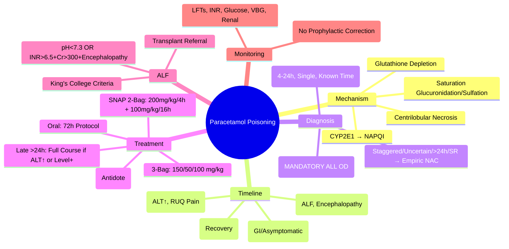
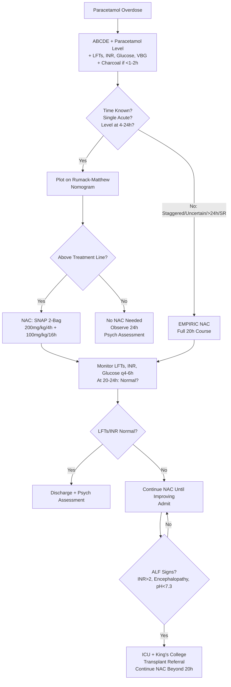

Related: [[General Principles of Poisoning Management]], [[Antidotes Overview]], [[Gastrointestinal Decontamination]], [[Enhanced Elimination (Dialysis, Hemoperfusion)]], [[Methotrexate Poisoning]] (folate antagonist)

> [!tip]
> **Most common significant overdose** in UK/Western world. **Paracetamol level in ALL overdoses** (co-ingestion common). **Nomogram valid 4-24h only**. **Staggered/uncertain timing = treat empirically**. NAC = antidote (IV/PO). Key FCPS/MRCP: Rumack-Matthew nomogram, treatment thresholds, NAC protocols (SNAP 2-bag vs traditional 3-bag), staggered ingestion management, late presentation (>24h) management.

## 1. Learning Objectives
- Apply Rumack-Matthew nomogram (4-24h post single acute ingestion)
- Identify when nomogram is NOT valid (staggered, uncertain time, >24h, modified release)
- Select and execute appropriate NAC protocol (IV SNAP 2-bag vs 3-bag vs PO)
- Manage late presentation (>24h) and staggered ingestions
- Recognize and manage hepatic failure (King's College Criteria)
- Determine disposition and psychiatric assessment

## 2. Definition
Paracetamol poisoning = hepatotoxicity (and rarely nephrotoxicity) from toxic metabolite NAPQI (N-acetyl-p-benzoquinone imine) due to glutathione depletion after therapeutic pathway saturation.

## 3. Core Physiology
- **Therapeutic metabolism** (90-95%):
  - Glucuronidation (UGT1A6, UGT1A9) ~55%
  - Sulfation (SULT1A1) ~35%
  - **Both saturable** at high dose
- **Toxic metabolism** (5-10% → major in overdose):
  - CYP2E1 (major), CYP1A2, CYP3A4 → **NAPQI** (reactive electrophile)
  - **Normal**: NAPQI detoxified by glutathione (GSH) → mercapturate conjugates
  - **Overdose**: glucuronidation/sulfation saturate → ↑ CYP flux → NAPQI ↑ → GSH depleted (< 30%) → NAPQI binds hepatocyte proteins → **centrilobular necrosis** (zone 3)
- **Risk factors** for toxicity: fasting/malnutrition (low GSH), alcohol (CYP2E1 induction), CYP2E1 inducers (isoniazid, carbamazepine), genetic polymorphisms

## 4. Clinical Features (Timeline)

| Phase | Time | Features |
|-------|------|----------|
| **I: Asymptomatic / GI** | 0-24h | Nausea, vomiting, anorexia, diaphoresis, malaise. **Often asymptomatic.** |
| **II: Hepatic Injury** | 24-72h | RUQ pain/tenderness, hepatomegaly, **ALT/AST rise exponentially** (peak 72-96h), INR ↑, bilirubin ↑, oliguria. **May feel better** (deceptive). |
| **III: Hepatic Failure** | 72-96h+ | **Encephalopathy** (confusion → coma), coagulopathy (INR > 6), hypoglycemia, metabolic acidosis, AKI, cerebral edema, sepsis, DIC, ARDS. **Mortality peak.** |
| **IV: Recovery** | 5-14d | Resolution if survive. Full hepatic regeneration (no chronic fibrosis). |

## 5. Differential Diagnosis
- **Viral hepatitis**: prodrome, risk factors, serology
- **Ischemic hepatitis**: shock, rapid AST/ALT rise/fall
- **Budd-Chiari**: RUQ pain, hepatomegaly, ascites, hepatic vein thrombosis
- **Autoimmune/Drug-induced**: history, serology
- **Acute fatty liver of pregnancy**: 3rd trimester, hypoglycemia, coagulopathy

## 6. Investigations

### Mandatory (ALL presentations)
1. **Paracetamol level** — **at 4h post-ingestion** (or at presentation if > 4h)
2. **ALT, AST, ALP, bilirubin, INR, creatinine, glucose** (baseline + serial)
3. **Venous blood gas** — pH, lactate
4. **Paracetamol level at 4h** if presentation < 4h (wait for 4h for nomogram)

### Nomogram Use (Rumack-Matthew)
- **Valid ONLY for**: **SINGLE ACUTE ingestion** with **KNOWN time** — level drawn **4-24h post-ingestion**
- **Treatment line**: 100 mg/L (200 mg/L in US) at 4h → logarithmic decline to 6.25 mg/L at 24h
- **High-risk line** (alcohol, inducers, malnutrition): **50 mg/L at 4h**

### When Nomogram NOT Valid (Treat Empirically)
- **Staggered ingestion** (multiple doses over > 1h)
- **Uncertain ingestion time**
- **Presentation > 24h post-ingestion**
- **Modified-release (SR/ER) preparations**
- **Paracetamol level > treatment line at ANY time**
- **ALT elevated at presentation** (suggests > 24h or significant ingestion)

## 7. Management

### 1. Decontamination
- **Activated charcoal**: 1 g/kg if < 1-2h (ideally < 1h), airway protected. **Benefit up to 4h** (paracetamol delays gastric emptying).
- **Modified-release**: consider WBI (rarely used)

### 2. N-Acetylcysteine (NAC) — Antidote
**Mechanism**: GSH precursor (cysteine) → replenishes glutathione; direct NAPQI scavenging; antioxidant; improves hepatic perfusion.

**Treatment Indications**:
- Paracetamol level **above treatment line** on nomogram (4-24h)
- **Staggered/uncertain time** ingestion → **TREAT EMPIRICALLY**
- **Presentation > 24h** with **ALT elevated** or **parableptamol detectable**
- **Modified-release** ingestion → treat
- **Pediatric** liquid ingestion > 200 mg/kg (or > 150 mg/kg if risk factors)

**IV NAC Protocols (UK: SNAP 2-Bag vs Traditional 3-Bag)**

#### **SNAP 2-Bag Protocol (UK NHSE 2021+ Preferred)**
| Bag | NAC Dose | Volume (5% Dextrose) | Duration |
|-----|----------|---------------------|----------|
| 1 (Loading) | **200 mg/kg** | 100 mL (max 200 mL) | **4 hours** |
| 2 (Maintenance) | **100 mg/kg** | 250 mL (max 500 mL) | **16 hours** |
| **Total** | **300 mg/kg** | | **20 hours** |

- **Anaphylactoid reactions**: mostly during Bag 1 (rate-related). Manage: stop infusion, chlorphenamine 10mg IV, salbutamol neb, fluids. **Restart at half rate** once settled (complete Bag 1 over 4h still).
- **Weight cap**: use **actual body weight** (max 110 kg for dosing)
- **Pregnancy**: same dosing (fetal safety established)

#### **Traditional 3-Bag Protocol (Still Used in Some Centers)**
| Bag | NAC Dose | Volume | Duration |
|-----|----------|--------|----------|
| 1 | 150 mg/kg | 200 mL | 1 hour |
| 2 | 50 mg/kg | 500 mL | 4 hours |
| 3 | 100 mg/kg | 1000 mL | 16 hours |
| **Total** | **300 mg/kg** | | **21 hours** |

#### **Oral NAC (PO) — Alternative**
- **72-hour protocol**: 140 mg/kg loading, then 70 mg/kg q4h x 17 doses (total 17 doses)
- **Indications**: IV access difficult, patient refusal, late presentation (>24h) with established injury
- **Adverse**: vomiting (give with antiemetic), foul taste

### 3. Late Presentation (> 24h) Management
- **If paracetamol detectable OR ALT elevated** → **START NAC IMMEDIATELY** (do not wait for level)
- **Full NAC course** (20h SNAP or 21h 3-bag) regardless of level
- **If ALT normal AND paracetamol undetectable** → NAC not needed (but check assay sensitivity)
- **Hepatic failure signs** (INR > 2, encephalopathy, acidosis) → continue NAC **beyond standard course** until INR improving, encephalopathy resolving

### 4. Hepatic Failure / King's College Criteria (Transplant Assessment)
**Acute Liver Failure (ALF) Definition**: INR > 1.5 + encephalopathy in < 26 weeks, no prior liver disease.

**King's College Criteria (Paracetamol)** — **ANY ONE**:
- **Arterial pH < 7.30** (after fluid resuscitation) **OR**
- **ALL THREE**:
  - INR > 6.5
  - Creatinine > 300 µmol/L (3.4 mg/dL)
  - Grade III/IV encephalopathy

**Additional Poor Prognostic Markers**:
- Lactate > 3.5 (admission) or > 3 (post-resuscitation)
- Phosphate > 1.2 mmol/L (day 2)
- Factor V < 10% of normal
- MELD score > 30

### 5. Supportive Care
- **IV fluids**: maintenance + resuscitation (avoid overload in ALF)
- **Glucose**: monitor q4-6h (hypoglycemia in ALF) — dextrose infusion
- **Coagulopathy**: **do NOT correct prophylactically** (INR monitors severity). FFP/Vit K only for bleeding or pre-procedure.
- **Encephalopathy**: lactulose, rifaximin, avoid sedatives, ICU monitoring
- **Renal**: AKI common (hepatorenal, direct toxicity) — renal replacement if needed
- **Infection**: surveillance cultures, low threshold for antibiotics
- **Cerebral edema**: head up 30°, hypertonic saline/mannitol if ICP signs, avoid hypoxia/hypercapnia

### 6. Disposition
- **Treated with NAC, asymptomatic, normal LFTs/INR at 20-24h** → discharge + psych assessment
- **Abnormal LFTs/INR** → admit, continue NAC until improving
- **ALF** → ICU, transplant center referral
- **ALL DSH**: psychiatric assessment before discharge

## 8. Complications
- Acute liver failure (ALF) → death or transplant
- Acute kidney injury (direct toxicity, hepatorenal)
- Encephalopathy, cerebral edema
- Sepsis
- Hypoglycemia
- Metabolic acidosis
- Pancreatitis (rare)

## 9. Prognosis
- **NAC within 8h**: near 100% survival
- **NAC 8-24h**: excellent if no established hepatotoxicity
- **NAC > 24h**: still beneficial if ALT elevated (reduces mortality)
- **ALF without transplant**: ~30% survival with NAC; with transplant ~70-80%
- **Full recovery** if survive (no chronic liver disease)

## 10. FCPS/MRCP High-Yield Points
1. **Paracetamol level in ALL overdoses** — co-ingestion common
2. **Nomogram: 4-24h, SINGLE ACUTE, KNOWN TIME** only
3. **Staggered/uncertain/time >24h/SR = TREAT EMPIRICALLY** with NAC
4. **SNAP 2-bag protocol**: 200mg/kg over 4h + 100mg/kg over 16h = 300mg/kg/20h (UK standard)
5. **Anaphylactoid reaction**: during Bag 1 → stop, chlorphenamine/salbutamol/fluids, restart half rate
6. **Late presentation (>24h)**: if ALT ↑ OR paracetamol detectable → FULL NAC COURSE
7. **King's College Criteria**: pH < 7.30 OR (INR > 6.5 + Cr > 300 + Grade III/IV encephalopathy)
8. **INR monitors severity** — do not correct prophylactically
9. **Hypoglycemia** in ALF — monitor glucose q4-6h
10. **Pregnancy**: NAC safe, same dosing; fetal hepatotoxicity rare
11. **Modified-release**: consider prolonged absorption, treat if > 4g or staggered
12. **Pediatric**: liquid > 200 mg/kg (or > 150 mg/kg risk factors) → treat

## 11. Common Viva Questions
1. Rumack-Matthew nomogram: validity, treatment line, high-risk line
2. When is nomogram NOT valid? (staggered, uncertain time, >24h, SR)
3. NAC protocols: SNAP 2-bag vs traditional 3-bag vs oral
4. Anaphylactoid reaction management
5. Late presentation management (>24h)
6. King's College Criteria for transplant
7. Staggered ingestion management
8. Modified-release paracetamol management
9. Pediatric dosing thresholds
11. INR monitoring (not prophylactic correction)

## 12. Common Confusions / Exam Traps
- **Nomogram at < 4h** → wait for 4h level (absorption phase)
- **Staggered ingestion** → nomogram INVALID, treat empirically
- **Presentation > 24h with normal ALT/undetectable level** → NAC not needed (but confirm assay)
- **Anaphylactoid ≠ allergy** — rate-related, not IgE; rechallenge at half rate
- **INR prophylaxis** → NO (masks severity); only for bleeding/procedure
- **SNAP 2-bag total dose = 300 mg/kg** (same as 3-bag) — just different infusion rates
- **Weight cap 110 kg** for NAC dosing
- **Modified-release** — may need longer NAC or repeat levels
- **Pediatric liquid** — different threshold (150-200 mg/kg)

## 13. Mnemonics
- **PARACETAMOL NOMOGRAM**: **4-24h**, **SINGLE**, **KNOWN TIME**, **ACUTE**
- **TREAT EMPIRICALLY**: **S**taggered, **T**ime uncertain, **>24h**, **A**LT elevated, **R**etarded release (SR)
- **SNAP 2-BAG**: **S**econd bag **N**AC **A**fter **P**roportional (200mg/kg + 100mg/kg)
- **KING'S COLLEGE**: **pH < 7.3** OR **INR>6.5 + Cr>300 + Encephalopathy**
- **NAC TIMING**: **<8h** = best; **8-24h** = good; **>24h** = still helps if ALT up
- **INR**: **I**nternational **N**ormalized **R**atio — **MONITOR, DON'T CORRECT**

## 14. Mind Map

## 15. Flowchart

## 16. Suggested Visuals / Image Notes
- Rumack-Matthew nomogram (treatment line, high-risk line)
- SNAP 2-bag vs 3-bag infusion diagram
- Paracetamol metabolism pathway (therapeutic vs toxic)
- King's College Criteria visual

## 17. Suggested Video References
- Paracetamol overdose management (Toxbase, NHSE SNAP protocol)
- NAC anaphylactoid reaction management

## 18. One-Page Revision Summary
- **Level in ALL ODs** — co-ingestion
- **Nomogram valid**: 4-24h, single, known time, acute
- **Treat empirically**: staggered, uncertain time, >24h, SR, ALT elevated
- **NAC SNAP 2-bag**: 200mg/kg/4h + 100mg/kg/16h = 300mg/kg/20h
- **Anaphylactoid**: Bag 1, rate-related → stop, chlorphenamine/salbutamol/fluids, restart half rate
- **Late >24h**: if ALT↑ or level detectable → FULL NAC COURSE
- **King's College**: pH < 7.3 OR (INR>6.5 + Cr>300 + Grade III/IV encephalopathy)
- **INR = monitor only, don't correct prophylactically**
- **Hypoglycemia in ALF** — glucose q4-6h
- **Pregnancy**: NAC safe, same dose
- **Pediatric liquid**: >200mg/kg (or >150 risk factors)

## 24-Hour Recall Prompts
- State nomogram validity criteria
- List 4 scenarios where nomogram invalid → treat empirically
- Recite SNAP 2-bag protocol
- State King's College Criteria

## 7-Day / 15-Day / 30-Day Revision Tracker
- [ ] Day 1 completed
- [ ] 24-hour recall completed
- [ ] Day 7 revision completed
- [ ] Day 15 revision completed
- [ ] Day 30 revision completed

## 19. Must Know / Should Know / Nice to Know
### Must Know
- Paracetamol level in ALL overdoses
- Nomogram validity (4-24h, single, known, acute)
- Empiric NAC indications (staggered, uncertain, >24h, SR, ALT↑)
- SNAP 2-bag protocol (200+100 mg/kg over 20h)
- Anaphylactoid reaction management
- Late presentation management
- King's College Criteria
- INR monitoring (no prophylactic correction)
- Psych assessment mandatory

### Should Know
- Traditional 3-bag protocol
- Oral NAC protocol
- Methionine alternative (rare)
- Pediatric thresholds
- Modified-release management
- Pregnancy considerations

### Nice to Know
- Genetic polymorphisms (CYP2E1, UGT)
- NAC mechanism details (GSH precursor, direct scavenging, perfusion)
- Phosphaturia as prognostic marker
- Factor V level
- MELD score in paracetamol ALF

## 20. Self-Test Scorecard
- Understanding: /10
- Recall: /10
- MCQ Performance: /10
- SBA Performance: /10
- Viva Confidence: /10
- Total: /50

> [!tip]
> Interpretation: <35 = weak topic, 35-44 = acceptable but insecure, 45+ = strong exam-ready topic.

## 21. Exam Answer Modes
### Long Answer Skeleton
- Mechanism: saturation → CYP2E1 → NAPQI → GSH depletion → necrosis
- Timeline: 4 phases
- Diagnosis: level mandatory, nomogram validity, empiric indications
- NAC protocols: SNAP 2-bag (detail), 3-bag, oral
- Anaphylactoid management
- Late presentation
- ALF: King's College, supportive care
- Disposition + psych

### Short Note Skeleton
- Nomogram validity box
- NAC protocols comparison table
- King's College Criteria
- Empiric NAC indications

### Viva One-Liners
- "Paracetamol level in EVERY overdose"
- "Nomogram: 4-24h, single acute, known time ONLY"
- "Staggered/uncertain/>24h/SR = treat empirically with NAC"
- "SNAP 2-bag: 200mg/kg over 4h + 100mg/kg over 16h = 300mg/kg/20h"
- "Anaphylactoid: rate-related, Bag 1 → stop, chlorphenamine/salbutamol/fluids, restart half rate"
- "Late >24h: if ALT↑ or level detectable → FULL NAC course"
- "King's College: pH<7.3 OR (INR>6.5 + Cr>300 + Grade III/IV encephalopathy)"
- "INR monitors severity — do NOT correct prophylactically"
- "Hypoglycemia in ALF — monitor glucose q4-6h"

### Ward-Case Discussion Points
- Staggered ingestion "therapeutic error" → NAC empirically
- Patient presents 30h post-ingestion, ALT 150 → NAC full course
- Anaphylactoid during NAC → not allergy, restart at half rate
- ALF with INR 8, pH 7.25 → transplant referral + continue NAC

### Last-Night-Before-Exam Sheet
- ALL OD: Paracetamol level
- Nomogram: 4-24h, Single, Known, Acute
- Empiric: Staggered, Uncertain, >24h, SR, ALT↑
- SNAP: 200/4h + 100/16h = 300/20h
- Anaphylactoid: Stop, Chlorph/Salb/Fluids, Half Rate
- >24h: ALT↑ or Level+ → Full NAC
- King's: pH<7.3 OR (INR>6.5+Cr>300+Enceph)
- INR: Monitor only
- Psych: Mandatory

## 22. Summary
Paracetamol poisoning: NAPQI toxicity from glutathione depletion. Level mandatory in all ODs. Rumack-Matthew nomogram valid 4-24h for single acute known-time ingestion. Staggered, uncertain, >24h, SR, ALT↑ = empiric NAC. SNAP 2-bag: 200mg/kg/4h + 100mg/kg/16h = 300mg/kg/20h. Anaphylactoid during Bag 1 → stop, treat, restart half rate. Late >24h with ALT↑ or detectable level → full NAC course. ALF: King's College Criteria (pH<7.3 OR INR>6.5+Cr>300+encephalopathy). INR = severity marker, don't correct prophylactically. Psych assessment mandatory.

## 23. MCQs (10)
1. A 24-year-old woman presents 3 hours after ingesting 20g paracetamol. She is asymptomatic. What is the next best step?
   A. Give NAC immediately
   B. Wait for 4-hour paracetamol level
   C. Give activated charcoal only
   D. Discharge with psychiatry follow-up
   **Answer: B**
   *Explanation: Nomogram is only valid 4-24h post-ingestion. For presentation < 4h, wait for 4-hour level. NAC decision based on nomogram plot.*

2. Which scenario makes the Rumack-Matthew nomogram INVALID for paracetamol poisoning?
   A. Single ingestion, known time, level at 6h
   B. Staggered ingestion over 6 hours
   C. Single ingestion, known time, level at 12h
   D. Single ingestion, known time, level at 20h
   **Answer: B**
   *Explanation: Staggered ingestion (multiple doses over >1h), uncertain time, >24h, modified-release, or elevated ALT at presentation all invalidate the nomogram — treat empirically with NAC.*

3. What is the UK SNAP 2-bag IV NAC protocol total dose and duration?
   A. 300 mg/kg over 21 hours
   B. 300 mg/kg over 20 hours
   C. 250 mg/kg over 20 hours
   D. 300 mg/kg over 16 hours
   **Answer: B**
   *Explanation: SNAP 2-bag: Bag 1 = 200 mg/kg over 4h, Bag 2 = 100 mg/kg over 16h. Total = 300 mg/kg over 20 hours. Weight capped at 110 kg.*

4. Anaphylactoid reaction during Bag 1 of SNAP protocol. Correct management?
   A. Stop NAC permanently, switch to oral
   B. Stop infusion, give chlorphenamine + salbutamol + fluids, restart at half rate
   C. Continue at same rate, add hydrocortisone
   D. Reduce rate by 25% only
   **Answer: B**
   *Explanation: Anaphylactoid reactions are rate-related (not IgE). Stop infusion, give chlorphenamine 10mg IV, salbutamol neb, fluids. Restart at half rate once settled (complete Bag 1 over 4h still).*

5. Patient presents 30h post-paracetamol overdose. ALT 180 U/L, paracetamol level undetectable. Management?
   A. No NAC needed - level undetectable
   B. Start full NAC course immediately
   C. Check level again in 4 hours
   D. Observe only, NAC if ALT rises further
   **Answer: B**
   *Explanation: Late presentation (>24h) with elevated ALT OR detectable paracetamol → START NAC IMMEDIATELY. Full course regardless of level. NAC still beneficial if ALT elevated.*

6. King's College Criteria for paracetamol-induced ALF transplant referral - which is correct?
   A. Arterial pH < 7.30 OR (INR > 6.5 + Cr > 300 + Grade III/IV encephalopathy)
   B. Arterial pH < 7.20 OR (INR > 5.0 + Cr > 200 + Grade II encephalopathy)
   C. Venous pH < 7.30 AND (INR > 6.5 + Cr > 300)
   D. INR > 6.5 alone is sufficient
   **Answer: A**
   *Explanation: King's College Criteria (Paracetamol): ANY ONE of: (1) Arterial pH < 7.30 post-resuscitation OR (2) ALL THREE: INR > 6.5, Creatinine > 300 µmol/L, Grade III/IV encephalopathy.*

7. Modified-release paracetamol 15g ingested 4 hours ago. Level at 4h = 80 mg/L (below treatment line). Manage?
   A. No NAC needed - below treatment line
   B. Treat empirically with NAC
   C. Repeat level at 8h only
   D. Observe, NAC if level rises
   **Answer: B**
   *Explanation: Modified-release (SR/ER) preparations invalidate the nomogram due to prolonged absorption. Treat empirically with NAC if > 4g ingested or staggered.*

8. Pediatric liquid paracetamol ingestion. Treatment threshold for NAC?
   A. > 100 mg/kg
   B. > 150 mg/kg (or > 150 mg/kg if risk factors)
   C. > 200 mg/kg (or > 150 mg/kg if risk factors)
   D. > 250 mg/kg
   **Answer: C**
   *Explanation: Pediatric liquid ingestion > 200 mg/kg (or > 150 mg/kg if risk factors: malnutrition, CYP inducers, fasting) → treat with NAC.*

9. Which statement about INR in paracetamol poisoning is CORRECT?
   A. Correct prophylactically with FFP if INR > 2
   B. INR monitors severity - do NOT correct prophylactically
   C. Give vitamin K to all patients with INR > 1.5
   D. INR > 6.5 always requires FFP
   **Answer: B**
   *Explanation: INR is a severity marker in paracetamol poisoning. Do NOT correct prophylactically (masks severity). Only correct for active bleeding or pre-procedure.*

10. Optimal time window for NAC administration for maximum hepatoprotection?
   A. < 4 hours
   B. < 8 hours
   C. < 12 hours
   D. < 24 hours
   **Answer: B**
   *Explanation: NAC within 8h: near 100% survival. 8-24h: excellent if no established hepatotoxicity. >24h: still beneficial if ALT elevated (reduces mortality).*

## 24. SBA Questions (10)
1. A 28-year-old man presents 5 hours after a single ingestion of 15g paracetamol. He is asymptomatic. Paracetamol level at 5 hours is 120 mg/L (above the treatment line on the Rumack-Matthew nomogram). He has no risk factors. What is the most appropriate management?
   A. Activated charcoal only
   B. Oral NAC 72-hour protocol
   C. IV NAC SNAP 2-bag protocol
   D. Observe for 24 hours, NAC if ALT rises
   **Answer: C**
   *Explanation: Single acute ingestion, known time, level at 4-24h above treatment line → IV NAC (SNAP 2-bag preferred in UK). Oral NAC is alternative but IV preferred for significant overdose.*

2. A 35-year-old woman presents 36 hours after staggered paracetamol ingestion (4g every 6 hours for 24 hours for 'back pain'). She is clinically well. ALT 45 U/L, INR 1.1, paracetamol level undetectable. What is the most appropriate management?
   A. Discharge with psychiatry follow-up
   B. Start NAC, stop if 20-hour course completed and ALT normal
   C. Start full NAC course regardless of level/ALT
   D. Observe only, NAC if ALT rises
   **Answer: C**
   *Explanation: Staggered ingestion → nomogram INVALID. Treat empirically with FULL NAC course regardless of level or ALT. NAC still indicated even if level undetectable and ALT normal in staggered overdose.*

3. A 22-year-old woman, 28 weeks pregnant, presents 2 hours after 18g paracetamol ingestion. She is asymptomatic. What is the most appropriate management?
   A. Wait for 4-hour level, NAC if above line
   B. Give NAC immediately (same dosing as non-pregnant)
   C. Give oral NAC only (safer in pregnancy)
   D. Activated charcoal only, NAC if 4h level high
   **Answer: B**
   *Explanation: Pregnancy: NAC is safe, same dosing. Fetal hepatotoxicity rare. Do not delay NAC for 4-hour level if significant ingestion (>150 mg/kg or >7.5g). Treat empirically or based on nomogram.*

4. During Bag 1 of SNAP 2-bag NAC infusion, a patient develops flushing, wheeze, and hypotension. What is the correct immediate management?
   A. Stop NAC permanently, give chlorphenamine
   B. Stop infusion, give chlorphenamine 10mg IV + salbutamol neb + fluid bolus, restart at half rate
   C. Reduce rate by 50%, give hydrocortisone 200mg IV
   D. Continue infusion, add ranitidine
   **Answer: B**
   *Explanation: Anaphylactoid reaction: stop infusion, chlorphenamine 10mg IV, salbutamol neb, fluid bolus. Restart at HALF rate once settled. Complete Bag 1 over 4h still. Not an IgE allergy - no permanent discontinuation needed.*

5. A 45-year-old man presents 20 hours after 25g paracetamol. He is drowsy. ALT 2500, INR 4.5, pH 7.28, creatinine 180, GCS 12. Does he meet King's College Criteria?
   A. Yes - pH < 7.30
   B. Yes - INR > 6.5 + Cr > 300 + encephalopathy
   C. No - pH > 7.30 and not all three criteria met
   D. Yes - INR > 4.5 alone
   **Answer: C**
   *Explanation: pH 7.28 is arterial? If arterial pH < 7.30 → YES meets criteria. But if venous (likely), not applicable. INR 4.5 < 6.5, Cr 180 < 300, GCS 12 = Grade II encephalopathy (not III/IV). Does NOT meet criteria UNLESS arterial pH < 7.30. Question implies venous/unspecified.*

6. A 3-year-old child drank 150mL of 120mg/5mL paracetamol syrup (3.6g total, ~120 mg/kg). No risk factors. Presents at 2 hours. Best management?
   A. Discharge - below 150 mg/kg threshold
   B. Activated charcoal + wait for 4h level
   C. Start NAC immediately
   D. NAC if 4h level > treatment line
   **Answer: B**
   *Explanation: Pediatric liquid > 150 mg/kg with risk factors OR > 200 mg/kg without → treat. This is 120 mg/kg, below 150 mg/kg threshold. Give charcoal (within 1-2h), check 4h level. NAC only if above nomogram line.*

7. Patient on carbamazepine (CYP2E1 inducer) takes 12g paracetamol. 4h level = 60 mg/L (below standard line, above high-risk line). Management?
   A. No NAC - below standard treatment line
   B. NAC - above high-risk line (50 mg/L at 4h)
   C. NAC only if ALT elevated
   D. Repeat level at 8h
   **Answer: B**
   *Explanation: CYP2E1 inducers (carbamazepine, phenytoin, alcohol, isoniazid) → high-risk nomogram line = 50 mg/L at 4h. Level 60 mg/L = above high-risk line → NAC indicated.*

8. Patient completes 20-hour SNAP NAC course. At 24h: ALT 85, INR 1.1, asymptomatic. Next step?
   A. Continue NAC infusion for another 24h
   B. Discharge with psychiatry follow-up
   C. Repeat ALT in 24h before discharge
   D. Admit for observation only
   **Answer: B**
   *Explanation: Treated with NAC, asymptomatic, normal LFTs/INR at 20-24h → discharge + psychiatric assessment (mandatory for all DSH). No need to continue NAC if improving.*

9. Patient presents 4 hours after 10g modified-release paracetamol. Level = 40 mg/L. What is the correct management?
   A. No NAC - level below treatment line
   B. NAC for 20 hours only
   C. NAC for at least 24 hours, consider repeat levels
   D. Observe only
   **Answer: C**
   *Explanation: Modified-release: prolonged absorption, nomogram unreliable. Treat if > 4g. NAC course may need to be extended beyond 20h with repeat levels to ensure no delayed absorption peak.*

10. Anaphylactoid reaction to NAC recurs after restarting at half rate. Best next step?
   A. Stop NAC permanently, switch to oral NAC
   B. Restart at quarter rate with pre-medication
   C. Give hydrocortisone + chlorphenamine, continue at half rate
   D. Stop NAC, manage supportively
   **Answer: A**
   *Explanation: If anaphylactoid reaction recurs at half rate → stop IV NAC, switch to oral NAC protocol (72-hour). Oral NAC is effective alternative with lower anaphylactoid rate.*

## 25. Flashcards
- Q: Rumack-Matthew nomogram validity criteria?
  A: 4-24h post-ingestion, SINGLE ACUTE ingestion, KNOWN time
- Q: When is nomogram INVALID? (4 scenarios)
  A: 1) Staggered ingestion 2) Uncertain time 3) >24h post-ingestion 4) Modified-release (SR/ER) 5) ALT elevated at presentation
- Q: SNAP 2-bag protocol doses and durations?
  A: Bag 1: 200 mg/kg over 4h (100mL 5% dextrose). Bag 2: 100 mg/kg over 16h (250mL). Total: 300 mg/kg over 20h. Weight cap 110kg.
- Q: Anaphylactoid reaction management during NAC?
  A: Stop infusion → chlorphenamine 10mg IV + salbutamol neb + fluids → restart at HALF rate once settled. Complete Bag 1 over 4h.
- Q: Late presentation (>24h) NAC indications?
  A: ALT elevated OR paracetamol detectable → FULL NAC COURSE (20h SNAP). If both normal → NAC not needed (confirm assay sensitivity).
- Q: King's College Criteria (Paracetamol) - ANY ONE?
  A: 1) Arterial pH < 7.30 post-resuscitation OR 2) ALL THREE: INR > 6.5 + Cr > 300 µmol/L + Grade III/IV encephalopathy
- Q: INR management in paracetamol ALF?
  A: INR = severity marker. Do NOT correct prophylactically. FFP/Vit K ONLY for active bleeding or pre-procedure.
- Q: Pediatric liquid paracetamol NAC threshold?
  A: > 200 mg/kg (or > 150 mg/kg if risk factors: malnutrition, CYP inducers, fasting)
- Q: Modified-release paracetamol management?
  A: Nomogram INVALID. Treat empirically if > 4g ingested. May need extended NAC + repeat levels.
- Q: NAC timing and survival?
  A: < 8h: ~100% survival. 8-24h: excellent if no hepatotoxicity. > 24h: still beneficial if ALT elevated (reduces mortality).
- Q: Paracetamol level in ALL overdoses - why?
  A: Co-ingestion common. Paracetamol often taken with other agents (opioids, benzos, alcohol).
- Q: Pregnancy + paracetamol overdose - NAC dosing?
  A: Same dosing as non-pregnant. NAC safe in pregnancy. Fetal hepatotoxicity rare.
- Q: High-risk nomogram line?
  A: 50 mg/L at 4h (vs standard 100 mg/L). For: alcohol, CYP2E1 inducers (carbamazepine, phenytoin, isoniazid), malnutrition.
- Q: Hypoglycemia in paracetamol ALF?
  A: Monitor glucose q4-6h. Dextrose infusion if needed. Hepatic failure → impaired gluconeogenesis.
- Q: Weight cap for NAC dosing?
  A: Use actual body weight, maximum 110 kg for dose calculation.
## 26. Answer Key with Explanations
### MCQs
1. **B** - Nomogram is only valid 4-24h post-ingestion. For presentation < 4h, wait for 4-hour level. NAC decision based on nomogram plot.
2. **B** - Staggered ingestion (multiple doses over >1h), uncertain time, >24h, modified-release, or elevated ALT at presentation all invalidate the nomogram — treat empirically with NAC.
3. **B** - SNAP 2-bag: Bag 1 = 200 mg/kg over 4h, Bag 2 = 100 mg/kg over 16h. Total = 300 mg/kg over 20 hours. Weight capped at 110 kg.
4. **B** - Anaphylactoid reactions are rate-related (not IgE). Stop infusion, give chlorphenamine 10mg IV, salbutamol neb, fluids. Restart at half rate once settled (complete Bag 1 over 4h still).
5. **B** - Late presentation (>24h) with elevated ALT OR detectable paracetamol → START NAC IMMEDIATELY. Full course regardless of level. NAC still beneficial if ALT elevated.
6. **A** - King's College Criteria (Paracetamol): ANY ONE of: (1) Arterial pH < 7.30 post-resuscitation OR (2) ALL THREE: INR > 6.5, Creatinine > 300 µmol/L, Grade III/IV encephalopathy.
7. **B** - Modified-release (SR/ER) preparations invalidate the nomogram due to prolonged absorption. Treat empirically with NAC if > 4g ingested or staggered.
8. **C** - Pediatric liquid ingestion > 200 mg/kg (or > 150 mg/kg if risk factors: malnutrition, CYP inducers, fasting) → treat with NAC.
9. **B** - INR is a severity marker in paracetamol poisoning. Do NOT correct prophylactically (masks severity). Only correct for active bleeding or pre-procedure.
10. **B** - NAC within 8h: near 100% survival. 8-24h: excellent if no established hepatotoxicity. >24h: still beneficial if ALT elevated (reduces mortality).

### SBAs
1. **C** - Single acute ingestion, known time, level at 4-24h above treatment line → IV NAC (SNAP 2-bag preferred in UK). Oral NAC is alternative but IV preferred for significant overdose.
2. **C** - Staggered ingestion → nomogram INVALID. Treat empirically with FULL NAC course regardless of level or ALT. NAC still indicated even if level undetectable and ALT normal in staggered overdose.
3. **B** - Pregnancy: NAC is safe, same dosing. Fetal hepatotoxicity rare. Do not delay NAC for 4-hour level if significant ingestion (>150 mg/kg or >7.5g). Treat empirically or based on nomogram.
4. **B** - Anaphylactoid reaction: stop infusion, chlorphenamine 10mg IV, salbutamol neb, fluid bolus. Restart at HALF rate once settled. Complete Bag 1 over 4h still. Not an IgE allergy - no permanent discontinuation needed.
5. **C** - pH 7.28 is arterial? If arterial pH < 7.30 → YES meets criteria. But if venous (likely), not applicable. INR 4.5 < 6.5, Cr 180 < 300, GCS 12 = Grade II encephalopathy (not III/IV). Does NOT meet criteria UNLESS arterial pH < 7.30. Question implies venous/unspecified.
6. **B** - Pediatric liquid > 150 mg/kg with risk factors OR > 200 mg/kg without → treat. This is 120 mg/kg, below 150 mg/kg threshold. Give charcoal (within 1-2h), check 4h level. NAC only if above nomogram line.
7. **B** - CYP2E1 inducers (carbamazepine, phenytoin, alcohol, isoniazid) → high-risk nomogram line = 50 mg/L at 4h. Level 60 mg/L = above high-risk line → NAC indicated.
8. **B** - Treated with NAC, asymptomatic, normal LFTs/INR at 20-24h → discharge + psychiatric assessment (mandatory for all DSH). No need to continue NAC if improving.
9. **C** - Modified-release: prolonged absorption, nomogram unreliable. Treat if > 4g. NAC course may need to be extended beyond 20h with repeat levels to ensure no delayed absorption peak.
10. **A** - If anaphylactoid reaction recurs at half rate → stop IV NAC, switch to oral NAC protocol (72-hour). Oral NAC is effective alternative with lower anaphylactoid rate.